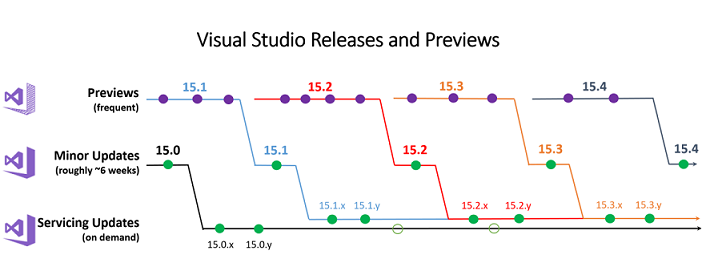

#  Visual Studio 2017 Release Rhythm
With Visual Studio 2017, we slightly adjusted how we ship from Visual Studio 2015. We have moved away from large quarterly updates with servicing releases on top of those, 
to smaller and more frequent minor updates that will have servicing releases. We’ve also introduced a new way to get preview releases. Below you can find more details 
about how and when updates to Visual Studio 2017 will ship, and how you can preview functionality before it’s released to the mainstream. 

## Shipping Cadence and Content
Updates to Visual Studio 2017 fall into two general categories:     
* Minor Updates ship roughly every six weeks. These updates may include new features, bug fixes, and changes needed to reflect platform changes (e.g. changes in Windows). 
You’ll be able to tell which minor update you’re running by opening the Help, About and reading the second digit of the version number, for example 15.1 or 15.2.
* Servicing Updates are very targeted releases that typically contain bug fixes and ship more quickly. These servicing updates can ship often (e.g. weekly). You’ll be able 
to tell which servicing update you’re running by opening the Help, About and reading the third string in the version, for example 15.1.x, 15.2.y. 

Both minor and servicing updates are supported and ready to be used in production environments. Particularly noteworthy updates will be announced via the [Visual Studio 
blog](https://blogs.msdn.microsoft.com/visualstudio/), and minor updates will be accompanied by release notes. Visual Studio will notify you that a new update is available 
by raising the [notification flag](https://docs.microsoft.com/en-us/visualstudio/ide/visual-studio-notifications) in the title bar of the IDE.

We strongly encourage everyone to adopt these updates as soon as possible. However, we do acknowledge that some customers can’t absorb the updates as fast as we release them. 
In those situations, we recommend you create your own [offline installer](https://docs.microsoft.com/en-us/visualstudio/install/create-an-offline-installation-of-visual-studio) 
and store the bits for future use. Or, you can wait for the next released update which will always be a superset of the most current update. 

## Previews
Starting in Visual Studio 2017, we made it easier for customers to preview upcoming functionality. 

The ability to preview features is not new in Visual Studio 2017. What is new, however, is the ability to install a preview release next to, and independently of, a regular 
release (“side by side”). With Visual Studio 2017, releases and previews are explicitly designed to exist simultaneously on a machine without causing adverse impact to either 
installation. All features or experiences that are coming online in the next minor update will first ship in a preview. Previews are meant to be used by those who are enthusiastic 
about trying out new bits and getting an early peek at upcoming functionality. Even though previews are not intended for use in production, they will be at a sufficient quality 
level for you to generally use and provide feedback that we can act upon before the functionality is released more broadly. There will be multiple previews leading up to the next 
minor update, and they don’t necessarily adhere to any preset schedule. 

Like regular releases, most people will become aware of updates to the previews via a notification flag in the IDE. The corresponding documentation will provide information 
about the changes to help you make an informed decision about what the update contains and when to install it. Lastly, we’ll be updating all the relevant feedback items on 
the [Developer Community](https://developercommunity.visualstudio.com/) portal to close the loop with you about when and where an issue was fixed.

*(Figure 1) Visual Studio Releases and Previews*

The new release cycle (_Figure 1_) is a response to customer requests that we make more of the work we’re doing on Visual Studio available more quickly. Because we can now 
ship quicker, we’re also able to respond to customer feedback quicker. By reporting feedback on our [Developer Community](https://developercommunity.visualstudio.com/), you 
raise awareness to our product teams and motivate more customers to participate in the analysis. We are committed to reviewing feedback frequently and will inform you when 
issues will be fixed or when workarounds might be available sooner. Our release notes highlight all addressed customer feedback for each release, providing another opportunity 
to learn more about the improvements we implemented based on your feedback. For more information, see [How to Report a Problem](https://docs.microsoft.com/en-us/visualstudio/ide/how-to-report-a-problem-with-visual-studio-2017).

[Top of Page](#top)

