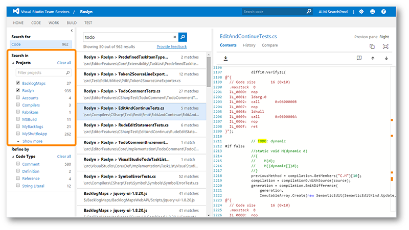
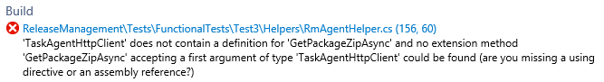
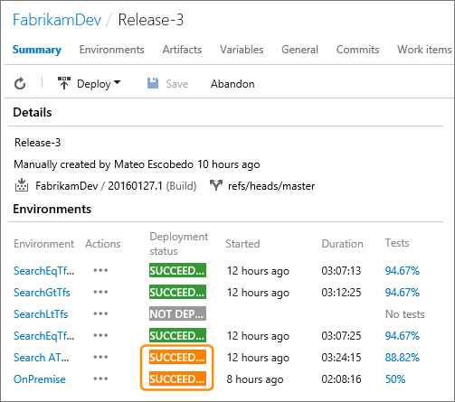
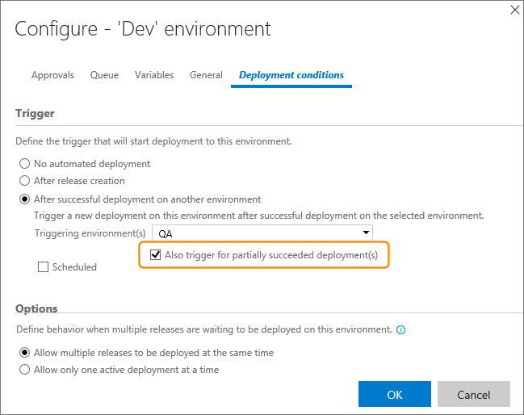
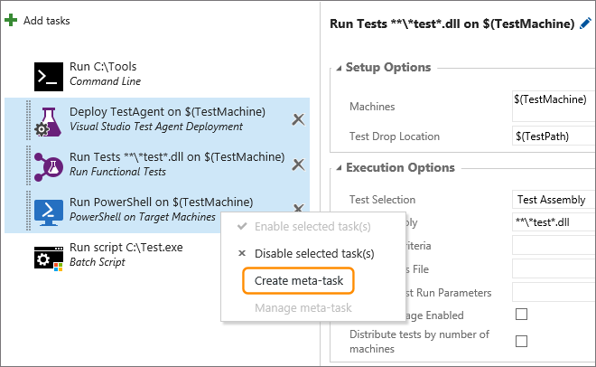
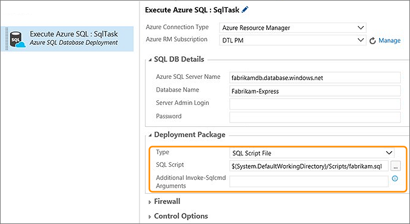
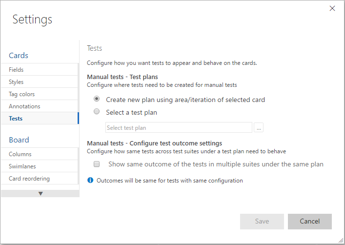
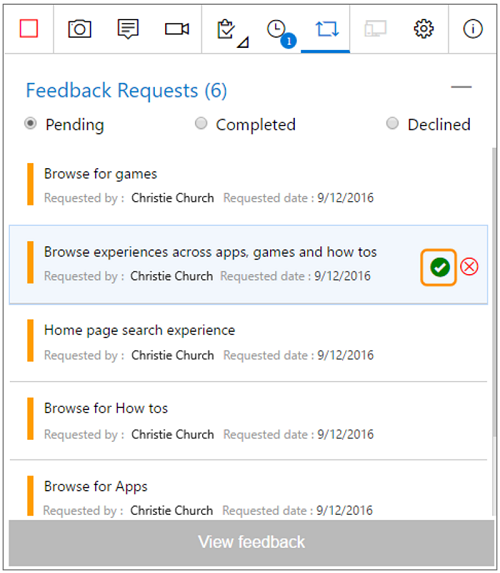

#  Team Foundation Server 2017

### Release Date: November 16, 2016

Today, we are happy to announce the release of Team Foundation Server 2017. This new release includes our most recent feature innovations and improvements. Note that the requirements have changed for Team Foundation Server 2017.  You can find more details on the [Team Foundation Server Requirements and Compatibility](https://go.microsoft.com/fwlink/?LinkId=809018 "Team Foundation Server Requirements and Compatibility") page. If these were not the release notes you were expecting, you have reached the release notes for the most current version.

#### Download: [Team Foundation Server 2017](https://go.microsoft.com/fwlink/?LinkId=831912 "Team Foundation Server 2017")

To learn more about other related downloads, see the [Downloads](https://www.visualstudio.com/downloads "Downloads") page.

#### What's New?
* [Code Search](#codesearch)
* [Package Management](#package)
* [Agile Improvements](#agile)
* [Dashboards and Widget Improvements](#dashboards)
* [Git Improvements](#git)
* [Build Improvements](#build)
* [Release Management Improvements](#rm)
* [Test Improvements](#test)
* [Marketplace Improvements](#Marketplace)
* [Administration Improvements](#admin)
* [Personal Access Tokens](#pat)

#### Known Issues
* [Known Issues](#knownissues)

---

## What's New

###  Code Search
Code Search provides fast, flexible, and accurate search across all your code.  As your codebase expands and is divided across multiple projects and repositories, finding what you need becomes increasingly difficult. To maximize cross-team collaboration and code sharing, Code Search can quickly and efficiently locate relevant information across all your projects.

From discovering examples of an API's implementation, browsing its definition, to searching for error text, Code Search delivers a one-stop solution for all your code exploration and troubleshooting needs.

Code Search offers:

* Search across one or more projects
* Semantic Ranking
* Rich filtering
* Code collaboration

For details, see [Search across all your code](https://www.visualstudio.com/docs/search/overview "Search across all your code").

###  Package Management
Packages enable you to share code across your organization: you can compose a large product, develop multiple products based on a common shared framework, or create and share reusable components and libraries. Package Management facilitates code sharing by hosting your packages, sharing them with the people you select, and making them easily accessible to Team Build and Release Management. 

Package Management eliminates the need to host a separate NuGet server or file share by hosting NuGet packages directly in your Team Foundation Server. It has best-in-class support for NuGet 3.x as well as support for NuGet 2.x legacy clients. It works seamlessly with your existing TFS infrastructure, teams, and permissions, so there’s no need to deal with synchronizing identities, managing groups in multiple places, etc. It also integrates easily with Team Build so you can create and use packages in continuous integration workflows.

For more details, see the [Package Management overview](https://www.visualstudio.com/docs/package/overview).

###  Agile Improvements

In Team Foundation Server 2017, we've added new features and functionality to work items and Kanban boards.

#### New Work Item Form
The new work item form has a new look and feel. It also adds some great new features:

* A rich work item discussion experience.
* Drag and drop support for attachments.
* Improved history experience ([History & auditing](https://www.visualstudio.com/en-us/docs/work/track/history-and-auditing)).
* Improved code and build integration.
* State coloring.
* Responsive design.

#### Follow a Work Item
You can now setup an alert for tracking changes to a single work item just by clicking on the new "Follow" button in the form. When you follow a work item, you'll be notified any time the work item changes – including field updates, links, attachments, and comments.

For details, see [Follow a work item](https://msdn.microsoft.com/Library/vs/alm/work/track/follow-work-items "Follow a work item").

#### Kanban Board Live Updates

Your Kanban board is now Live!

Have you been hitting F5 to figure out what's going on throughout the day with your Kanban board? Try the icon in the screenshot below.

When anyone in your team creates, updates, or deletes a work item on the board, you will receive live updates on your board immediately. Also, if the administrator makes board or team level updates such as adding a new column or enabling bugs on backlog, you will be notified to refresh the board to update your board layout.
All you need to do now, is enable the tower icon on your Kanban board and start collaborating with your team.

For more information, see [Kanban basics](https://www.visualstudio.com/en-us/docs/work/kanban/kanban-basics).

#### Checklist Improvements
We’ve made several improvements to how Checklists work.

Checklists titles now appear as hyperlinks. You can click on the title to open the work item form.

Checklists now also support context menus that allow you to open, edit, or delete checklist items.

For details, see [Add task checklists](https://www.visualstudio.com/en-us/docs/work/kanban/add-task-checklists).

#### Epic and Feature Board Drill-down
You now have the ability to drill down on your Epic and Feature boards. The checklist format lets you easily mark work as completed, and provides a handy bird’s eye view of the completed versus outstanding work.

For more information, see [Kanban features and epics](https://www.visualstudio.com/en-us/docs/work/kanban/kanban-epics-features-stories).

#### Turning Board Annotations On/Off
We are giving you more control of the additional information that shows on the cards on your boards. You can now select annotations that you want to view on your Kanban cards. Simply unselect an annotation and it will disappear from the cards on your Kanban board. The first two annotations to show up here are child work items (tasks in this example) and the Test annotation.

For more information, see [Customize Cards](https://www.visualstudio.com/en-us/docs/work/customize/customize-cards).

#### Clear Formatting Command
We’ve added a new command to all rich text controls on work items that lets you clear all formatting from selected text. If you’re like me, you’ve probably been burned in the past by copying and pasting formatted text into this field that you can’t undo (or clear). Now you can simply highlight any text, select the Clear Formatting toolbar button (or press CTRL+Spacebar), and you'll see the text return to its default format.

#### Filtering in Kanban Board
Personalize your Kanban boards by setting filters on users, iterations, work item types, and tags. These filters will persist so that you can view your personalized board, even when you connect from multiple devices.

Team members can also filter their boards to view progress accruing to a specific parent work item. For example, a user can view user stories that are linked to a feature, or view work across two or more features that roll up to an epic. This feature, much like Checklists, is one more step in our effort to bring visibility through to the different backlog levels.

For details, see [Filter Kanban board](https://www.visualstudio.com/en-us/docs/work/kanban/filter-kanban-board).

#### Default Iteration Path for New Work Items
When you create a new work item from the Queries tab or from the New Work Item dashboard widget, the iteration path of that work item is always set to the current iteration. This is not what all teams want, because it will mean that bugs could show up on the task board immediately. With this improvement, teams can choose the default iteration path (a specific one or the current iteration) that should be used for new work items. Navigate to the administration area for your team to choose a default iteration.

For more information, see [Area and iteration paths](https://www.visualstudio.com/en-us/docs/work/customize/modify-areas-iterations).

#### Checkbox Control

You can now add a checkbox control to your work items. This new field type (Boolean) has all the properties of normal fields and can be added to any type in your process. When displayed on cards or in a query result, the value is shown as True/False.

For details, see [Customize a field](https://www.visualstudio.com/en-us/docs/work/process/customize-process-field#boolean-field).

#### Tags Bulk Editing
You can now add and remove tags from multiple work items using the bulk edit dialog.

For details, see [Add tags to work items](https://www.visualstudio.com/en-us/docs/work/track/add-tags-to-work-items).

#### New Extension Points
We’ve added a new contribution point on the board and backlog pages to allow you to write extensions as a pivot tab next to Board/Backlog/Capacity tabs.

We have exposed a new extension point on the backlog. Extensions can target the pane on the right side, where mapping and work details are today.

For more information on extensions, see [Extension Points](https://www.visualstudio.com/en-us/docs/integrate/extensions/reference/targets/overview).

#### Email Improvements
We’ve significantly improved the formatting and usability of work item alerts, follows, and @mention emails sent by TFS. Emails now include a consistent header, a clear call to action, and improved formatting to make sure the information in the mail is easier to consume and understand. Additionally, all these emails are being designed to ensure they render well on mobile devices.

For more information, see [Work item alerts](https://www.visualstudio.com/en-us/docs/work/track/alerts-and-notifications).

#### Work Item Templates
We added the ability to create rich work item templates directly into the native web experience. This capability was previously very limited in the web, and only available in this new form through a Visual Studio power tool. Teams can now create and manage a set of templates for quickly modifying common fields.

For details, see [Work item templates](https://www.visualstudio.com/en-us/docs/work/productivity/work-item-template).

#### Project Server Integration No Longer Supported
Team Foundation Server 2017 and later versions no longer support Project Server integration. As of RC2, if you upgrade a TFS database that has Project Server integration configured, you'll receive the following warning:

**We have detected that you have Project Server integration configured for this database. Team Foundation Server 2017 and later versions no longer support Project Server integration.**

After upgrade, the Project Server integration will no longer operate. 

Going forward, we will be relying on Partners to provide integration solutions. 

For more information on this change, please read the following topic: [Synchronize TFS with Project Server](https://go.microsoft.com/fwlink/?LinkID=816838).

###  Dashboards and Widgets Improvements

Team Foundation Server 2017 has made improvements on multiple widgets, such as the Query Tile and Pull Request widgets.

#### Redesigned Widget Catalog
We’ve redesigned our widget catalog to accommodate the growing set of widgets and deliver a better overall experience. The new design includes an improved search experience and has been restyled to match the design of our widget configuration panels.

For more details, see [Widget Catalog](https://www.visualstudio.com/en-us/docs/report/widget-catalog).

#### Widget Updates
The Query Tile widget now supports up to 10 conditional rules and has selectable colors. This is extremely handy when you want to use these tiles as KPIs to identify health and/or action that may be needed.

The Pull Request widget now supports multiple sizes, allowing users to control the height of the widget. We’re working on making most of the widgets we ship resizable, so look for more here.

The New Work Item widget now allows you to select the default work item type, instead of forcing you to select the most common type you’re creating over and over from the drop-down list.  

We've made the WIT chart widgets resizable. This allows users to see an expanded view of any WIT chart on the dashboard regardless of its original size.

The Team Members widget has been updated to make it easier to add somebody to your team.

Teams can now configure the size of the dashboard's Query Results widget, allowing it to display more results.

The Sprint Overview widget has been redesigned making it easier for teams to see if they're on track.

The Assigned to Me widget helps users manage the work assigned to them without leaving the dashboard context. By providing a widget dedicated to this purpose, team admins can add this functionality to their dashboards with 16 fewer clicks, no context switches and no typing required. Users can now view, sort, filter, and manage the work assigned to them within the widget context. 

#### Dashboards REST APIs
You can now use REST APIs to programmatically add, delete, and get information on a dashboard. The APIs also let you add, remove, update, replace, and get information on a widget or a list of widgets on a dashboard. The documentation is available on [Visual Studio online docs](https://aka.ms/dashboardapi).

#### Permissible Dashboards
Non-admin users can now create and manage team dashboards. Team admins can restrict non-admin permissions through the dashboard manager.

For more information, see [Dashboards](https://www.visualstudio.com/en-us/docs/report/dashboards).

###  Git Improvements

Some major changes have been made in Git for Team Foundation Server 2017. Included are a redesign of the Branches page and a new option to “squash merge”.

#### Redesigned Branches Page
The Branches page has been completely redesigned. It has a "mine" pivot that shows the branches you created, pushed to, or favorited. Each branch shows its build and pull requests status, as well as other commands like Delete. If there is a slash in a branch name, like "features/jeremy/fix-bug", it's shown as a tree, so it's easy to browse through a large list of branches. If you know the name of your branch, you can search to find the one you want quickly.

For more details on branches, see [Manage branches](https://www.visualstudio.com/en-us/docs/git/manage-your-branches).

#### New Pull Request Experience
The Pull Request experience has some major updates this release, bringing some really powerful diff capabilities, a new commenting experience, and an entirely refreshed UI.

For more details, see [Review code with Pull Requests](https://www.visualstudio.com/en-us/docs/git/pull-requests).

#####Redesigned UI
When opening a pull request, the new look and feel is evident immediately.  We've reorganized the header to summarize all the critical state and actions, making them accessible from every view in the experience.  

#####Overview
The Overview now highlights the PR Description and makes it easier than ever to give feedback.  Events and comments are shown with the newest items on top to help reviewers see the latest changes and comments front and center.  Policies, work items, and reviewers are all provided in detail and reorganized to be more clear and concise.  

#####Files
The biggest new feature in this release is the ability to see past updates made to a pull request.  In previous previews, we released the ability to properly track comments as a PR is updated with changes.  However, it's not always easy to see what's between updates.  In the Files view, you can now see  exactly what changed each time new code is pushed to your PR.  This is very useful if you've given feedback on some code and want to see exactly how it changed, isolated from all the other changes in the review.  

#####Updates
The new Updates view is used to show how the PR is changing over time.  Where the Files view shows how the files have changed over time, the Updates view shows the commits added in each update.  If a force push ever happens, the Updates view will continue to show the past updates as they occurred in history. 

#####Comments, now with markdown and emoji
Use the full power of markdown in all your discussions, including formatting, code with syntax highlighting, links, images, and emoji.  The commenting controls also have a more user friendly editing experience allowing multiple comments to be edited (and then saved) at one time.  

#####Add and Remove Reviewers in Pull Requests
It's now easier to add and remove reviewers from your pull requests. To add a reviewer or group to your pull request, simply enter their name into the search box in the Reviewers section. To remove a reviewer, hover over their tile in the Reviewers section and click the X to remove them.

#####Improved build and pull request traceability
The traceability between builds and pull requests has improved, making it easy to navigate from a PR to a build and back. In the build details view for a build triggered by a pull request, the source will now show a link to the pull request that queued the build. In the Build Definitions view, any build triggered by a pull request will provide a link to the pull request in the "Triggered By" column. Finally, the Build Explorer view will list pull requests in the source column.
 
#####Comment tracking for pull requests
Pull requests in VSTS have been improved to show comments left in files on the proper line, even if those files have been changed since the comments were added. Previously, comments were always shown on the line of the file where they were originally added, even if the file contents changed—in other words, a comment on line 10 would always be shown on line 10. With the latest improvements, the comments follow the code to show what the user expects—if a comment was added on line 10, and two new lines were subsequently added to the beginning of the file, the comment will be shown on line 12.

Here's an example change with a comment on line 13.

Even after the code has changed to shift the line with the original comment from 13 to 14, the comment is appearing in the expected place (line 14).

##### Auto-complete pull requests waiting on policies
Teams that are using branch policies (https://www.visualstudio.com/en-us/docs/git/branch-policies) to protect their branches will want to check out the auto-complete action.  Many times, the author of a pull request will be ready to merge their PR, but they're waiting on a build to finish before they can click Complete.  Other times, the build is passing, but there is one reviewer that hasn't given the final approval.  In these cases, the auto-complete action lets the author set the PR to automatically complete as soon as the policies are all approved.  

Just like the manual complete action, the author has a chance to customize the message of the merge commit and select the appropriate merge options.

Once auto-complete has been set, the PR will display a banner that confirms that the auto-complete is set and waiting for policies to complete.

When all the policies have been met (e.g., the build completes, or that final approval is granted), the PR will be merged using the options and comments specified.  As expected, if there is a build failure or the reviewer doesn't approve, the PR will remain active until the policies are passing.

#### Squash Merge Pull Requests
When completing a pull request, you now have the option to squash merge. This new option will produce a single commit containing the changes from the topic branch that will be applied to the target branch. The most notable difference between a regular merge and a squash merge is that the squash merge commit will only have one parent commit. This will mean a simpler history graph, as any intermediate commits made to the topic branch will not be reachable in the resulting commit graph.

You can find more information at [Squash merge pull requests](https://www.visualstudio.com/en-us/docs/git/merging-with-squash).

#### Commit Traceability
Build status (success or failure) is now clearly visible in the Code Explorer and Commit Details views. More details are just a click away, so you’ll always know if the changes in the commit passed the build or not. You can also customize which builds post status in the repository options for the build definition.
Additionally, the latest changes to the Commit Details view provide deeper insights about your changes. If you’re using pull requests to merge your changes, you’ll see the link to the pull request that introduced the changes into the master branch (or in the case of a merge commit, the PR that created it). When your changes have reached master, the branch link will appear to confirm that the changes have been included.

#### View Git LFS Files in the Web
If you’re already working with large files in Git (audio, video, datasets, etc.), then you know that Git Large File Storage (LFS) replaces these files with pointers inside Git, while storing the file contents in a remote server. This  makes it possible to view the full contents of these large files by simply clicking the file in your repo.

For more information, see [Manage large files with Git](https://www.visualstudio.com/en-us/docs/git/manage-large-files).

#### Create and Send Links to Specific Sections of Code
Share code references easily with code links. Just select text in a file and click the Link icon. It will copy a link to the selected code. When someone views that link, the code you highlighted will have a gold background. It even works for partial line selections.

#### Status API
Success or failure of the build is now clearly visible in the code explorer and commit details views.  More details are just a click away, so you'll always know if the changes in the commit passed the build or not.  You can also customize which builds post build status in the repository options for the build definition.

#### File Type Icons
You will see new file icons matching the extension of the file in the explorer, pull requests, commit details, shelveset, changeset or any other view that shows a list of files.

#### Add a Readme During Repo Creation
The new Git repository creation has been improved by providing users the ability to add a ReadMe file. Adding a ReadMe to the repository not only helps others understand the purpose of the codebase, but also allows you to immediately clone the repository.

###  Build Improvements

In this release, we’ve increased the size of the logs, added Java build templates, and improvements to our Xamarin support to name a few changes.

#### Redesigned Build Queue Tab
We've implemented a new design for the Queued builds page that shows a longer list of queued and running builds, and in a more intuitive fashion.

For more information, see [Administer your build system](https://www.visualstudio.com/en-us/docs/build/admin/index).

#### Enable Build Result Extensions to Specify Order and Column
Build result section extensions can now specify which column and the order in which they appear. The result view has two columns, and all extensions will be in the first column by default. Note: All third-party extensions will appear after the build result sections we include.

#### Build to Line Number
Now you can jump from a build error to the line of code that caused it.  Looking at the latest error on the primary build we use as a pull request policy internally, I see this:

#### Build log view supports much larger logs
The previous log view only supported logs up to 10,000 lines. The new viewer is based on the Monaco editor used in VS Code and will support logs up to 150,000 lines.

#### Java Build Templates
We’ve made it even easier for Java developers to get started with build by adding build templates for Ant, Maven, and Gradle.

For more information on templates, see [Build steps](https://www.visualstudio.com/en-us/docs/build/define/build).

#### Xamarin Build Tasks
We made some significant improvements to our Xamarin support:
* The [Xamarin.Android](https://msdn.microsoft.com/library/vs/alm/build/steps/build/xamarin-android) step now supports Mac and Linux.
* The [Xamarin.iOS](https://msdn.microsoft.com/library/vs/alm/build/steps/build/xamarin-ios) step now supports signing and packaging.
* [Xamarin Test Cloud](https://msdn.microsoft.com/library/vs/alm/build/steps/test/xamarin-test-cloud) results can be displayed on the build summary page.
* A new [Xamarin component restore](https://msdn.microsoft.com/en-us/library/vs/alm/build/steps/package/xamarin-component-restore) step.
* The [NuGet Installer](https://msdn.microsoft.com/en-us/library/vs/alm/build/steps/package/nuget-installer) step now supports Mac OS.

The Xamarin License step is no longer necessary and has been removed from the build templates. As part of this effort we will also deprecate the task. All build definitions that use this task should be updated to remove it in order to prevent any disruption when the task is finally removed.

Finally, the Xamarin build definition templates were enhanced to use these new tasks. [Build your Xamarin app](https://msdn.microsoft.com/en-us/Library/vs/alm/Build/apps/xamarin).

#### Docker Integration for Build and Release Management
Take advantage of the build capabilities to build your Docker images and upload them to the Docker Hub as part of your continuous integration flow. Then, deploy those images to a number of Docker hosts as part of Release Management. The [Marketplace extension](https://marketplace.visualstudio.com/items?itemName=ms-vscs-rm.docker) adds all the service endpoint types and tasks necessary for you to work with Docker.

#### SonarQube Results in Pull Request View
If the build run to merge a pull request contains SonarQube MSBuild tasks, you will now see new code analysis issues as discussion comments in the pull request. This experience works for any language for which a plug-in is installed on the SonarQube server. For more information, see the [SonarQube Code Analysis issues integration into Pull Requests](https://blogs.msdn.microsoft.com/visualstudioalm/2016/06/02/sonarqube-code-analysis-issues-integration-into-pull-requests/) blog post.

#### Configure Status API Reporting for a Build Definition
You can now choose which build definitions report their status back to the Git status API. This is particularly useful if you have many definitions that build a given repository or branch, but only have one that represents the real health.

For more information, see the [Build REST API reference](https://www.visualstudio.com/en-us/docs/integrate/api/build/builds).

#### Build vNext Support in Team Rooms
It has been always possible to add notifications of XAML builds in the team room. With this sprint, users can also receive notifications from Build vNext completions.

#### Enable Path Filters for Git CI Triggers
CI triggers for hosted Git repositories can include or exclude certain paths. This enables you to configure a build definition to run only when files in specific paths have changed.

###  Release Management Improvements

Since the introduction of integrated web-based Release management in Team Foundation Server 2015, we have made several enhancements in this version.

#### Clone, Export, and Import Release Definitions

We have incorporated the ability to clone, export, and import release definitions within Release hub, without requiring installation of an extension.

For more details, see [Clone, export, and import a release definition](https://www.visualstudio.com/en-us/docs/release/author-release-definition/more-release-definition#clonedef)

#### Test Results Displayed in the Release Summary

In the release summary page, we have enabled a contribution point for an external service to show environment-specific information. 

In Team Services, this functionality is used to display a summary of test results when tests are run as part of a release environment.

For more details, see [Understand the summary view of a release](https://www.visualstudio.com/en-us/docs/release/managing-releases/track-release#detailsview)

#### Pass OAuth Tokens to Scripts

If you need to run a custom PowerShell script that invokes the REST APIs on Team Services, perhaps to create a work item or query a build for information, you need to pass the OAuth token in the script. 

A new option when you configure an environment allows scripts to run as tasks in the environment to access the current OAuth token.

For more details, see [Environment general options](https://www.visualstudio.com/en-us/docs/release/author-release-definition/understanding-environments#options)

This is a simple example showing how to get a build definition:

#### Trigger on Partially Successful Deployments

Build and release tasks have an option to **Continue on error** in the **Control Options** parameters for each task. 

In a build definition, this results in a **Build partially succeeded** result if a task with this option set should fail. 

The same behavior is now available in release definitions. If a task fails, the overall release result will show as "Release partially succeeded".

By default, a partially successful release will not automatically trigger a release to a subsequent environment, even if this behavior is specified in the environment deployment options. 

However, a new option can be set in each release environment that instructs Release Management to trigger a release to a subsequent environment when the previous release is partially successful.

For more details, see [Environment deployment triggers](https://www.visualstudio.com/en-us/docs/release/author-release-definition/understanding-environments#deploymenttriggers)

#### Consume Artifacts Stored in GitHub Directly

Sometimes you may want to consume artifacts stored in a version control system directly, without passing them through a build process, as described in [this topic](https://www.visualstudio.com/en-us/docs/release/author-release-definition/understanding-artifacts#tfvcsource).

You can now do the same if your code is stored in a GitHub repository.

For more details, see [TFVC, Git, and GitHub sources](https://www.visualstudio.com/en-us/docs/release/author-release-definition/understanding-artifacts#tfvcsource)

#### Web App Deployment Using ARM

A new version of the Azure Web App Deployment task is available, called [AzureRM Web App Deployment](https://github.com/Microsoft/vsts-tasks/blob/master/Tasks/AzureRmWebAppDeployment/README.md). 

It uses MSDeploy and an Azure Resource Manager service endpoint connection. Use this task to deploy Azure Web Jobs and Azure API apps, in addition to ASP.NET 4, Node, and Python based web apps. 

The task also supports common publishing options such as the ability to retain app data, take an app off-line, and remove additional files at the destination. 

More features, such as configuration transformations, may appear in forthcoming versions.

#### Task Groups

A *task group* lets you encapsulate a sequence of tasks already defined in a build or a release definition into a single reusable task that can be added to a build or release definition just like any other task. 

You can choose to extract the parameters from the encapsulated tasks as configuration variables, and abstract the rest of the task information. 

The new task group is automatically added to the task catalogue, ready to add to other release and build definitions.

For more details, see [Task Groups](https://www.visualstudio.com/en-us/docs/release/author-release-definition/understanding-tasks#metatasks)

#### Soft Delete of Releases

When you delete a release, or it is automatically deleted by a retention policy, the release is removed from the overview and details lists. 

However, it is retained with the release definition for a period (typically 14 days) before it is permanently deleted. 

During this period, it is shown in the **Deleted** tab of the overview and details lists. 

You can restore any of these releases by opening the shortcut menu and choosing **Undelete**.

For more details, see [Restore deleted releases](https://www.visualstudio.com/en-us/docs/release/managing-releases/track-release#restore-deleted)

#### Retain Releases and Builds for Each Environment

The release retention policy for a release definition determines how long a release and the build linked to it are retained. 

By default, a release is retained for 60 days - releases that have not been deployed or modified during that time will automatically be deleted. 

However, you may want to retain more releases that have been deployed to specific environments, such as your production environment, or retain them longer than those that were just deployed to other environments such as test, staging, and QA. 

You can also retain the build linked to a release for the same period as the release to ensure that the artifacts are available if you need to redeploy that release.

For more details, see [Release and build retention](https://www.visualstudio.com/en-us/docs/release/author-release-definition/more-release-definition#retention)

#### Linked Artifact Improvements

Two new features make it easier to work with artifacts and artifact sources:

* You can link multiple artifact sources to a release definition. Each of the artifacts is downloaded into a folder on the agent called the source alias. You can now edit the source alias of a linked artifact. For example, when you change the name of the build definition, you can edit the source alias to reflect the name of the build definition.

    

    For more details, see [Artifact source alias](https://www.visualstudio.com/en-us/docs/release/author-release-definition/understanding-artifacts#source-alias)

* A number of variables of the format Build.* (such as Build.BuildId and Build.BuildNumber) are exposed for use in task parameters. When multiple sources are associated with a release, these variables are now populated with values from the artifact source you specify as the primary source. 
For more details, see [Artifact variables](https://www.visualstudio.com/en-us/docs/release/author-release-definition/understanding-artifacts#variables).

#### Deployment - Manual Intervention Task

You can now pause execution during deployment to an environment.

Including a Manual Intervention task in an environment enables you to temporarily halt a deployment, perform manual steps, and then resume further automated steps.

You can also reject the deployment and prevent further steps from executing after a manual intervention.

For more details, see [Manual intervention](https://www.visualstudio.com/en-us/docs/release/author-release-definition/understanding-tasks#manualintervention)

#### SQL Database Deployment Task Scripts

The **Azure SQL Database Deployment** task has been enhanced to run SQL scripts against an Azure SQL Database. The scripts can be provided as a file, or inline within the task.

#### Release Definition Summary - Dashboard Widget

Pin a release definition to the dashboard - an easy way to make a summary of releases for that definition visible to all your team. 

For more details, see [Add release information to the dashboard](https://www.visualstudio.com/en-us/docs/release/managing-releases/track-release#add-dashboard)

#### Promote releases to an environment at a specific time

Want all your production deployments to happen at midnight? You can configure a condition on an environment that selects a successful deployment (or just the latest one) from another environment, and deploys it at the specified time.

#### Deploy based on conditions in multiple environments

Until the previous version, you could do parallel deployments (_forkdeployments_), but you could not start a deployment to an environment based on the status of multiple environments (_join deployments_). Now you can.

For more details, see [Parallel forked and joined deployments](https://www.visualstudio.com/en-us/docs/release/author-release-definition/understanding-environments#deploymenttriggers)

#### REST APIs for Release Management

You can use the REST APIs for the Release Management service to create release definitions and releases, and manage many aspects of deploying a release.

For more information, see the [API reference documentation](https://www.visualstudio.com/en-us/docs/integrate/api/rm/overview).
You'll find some basic examples that use the APIs in this blog post, [Using ReleaseManagement REST API’s](https://blogs.msdn.com/b/chandananjani/archive/2016/04/15/using-releasemanagement-rest-api-s.aspx).

#### Service Hooks Integration

Send release notifications when new releases are created, deployments are started or completed, or when approvals are pending or completed. Integrate with third party tools such as Slack to receive such notifications.

#### Deployment to National Azure Clouds

Use the new Environment setting in an Azure Classic service endpoint to target a specific Azure cloud, including pre-defined national clouds such as Azure China cloud, Azure US Government cloud, and Azure German cloud. 

For more details, see [Azure Classic service endpoint](https://www.visualstudio.com/en-us/docs/release/author-release-definition/understanding-tasks#sep-azure-classic).

###  Test Improvements

Key test improvements have been added in Team Foundation Server 2017.   

##### Updated test result storage schema
In this release, we are migrating the test result artifacts to a new compact and efficient storage schema. Since test results are one of the top consumers of storage space in TFS databases, we expect this feature to translate into reduced storage footprint for TFS databases. For customers who are upgrading from earlier versions of TFS, test results will be migrated to the new schema during TFS upgrade. This upgrade may result in long upgrade times depending on how much test result data exists in your databases. It’s advisable to configure the [test retention policy](https://www.visualstudio.com/en-gb/docs/test/manual-exploratory-testing/getting-started/how-long-to-keep-test-results "test retention policy") and wait for the policy to kick in and reduce the storage used by test results so that the TFS upgrade will be faster. After installing TFS, but before upgrading the TFS instance, you can use the [TFSConfig.exe tool](https://go.microsoft.com/fwlink/?linkid=821967 "TFSConfig.exe tool") to clean up test results. See TFSConfig.exe help for more details. If you don’t have the flexibility to configure test retention or clean up test results before upgrade, make sure you plan accordingly for the upgrade window. See [Test result data retention with Team Foundation Server 2015](https://blogs.msdn.microsoft.com/visualstudioalm/2015/10/08/test-result-data-retention-with-team-foundation-server-2015/ "Test result data retention with Team Foundation Server 2015") for more examples about configuring test retention policy.

#### Test Hub Improvements

#####Test configuration management in Test Hub
We’ve brought test configuration management to the web UI by adding a new Configurations tab within the Test Hub. Now you can create and manage test configurations and test configuration variables from within the Test hub.

For more information, see [Create configurations and configuration variables](https://www.visualstudio.com/en-us/docs/test/manual-exploratory-testing/test-different-configurations#create-configurations-and-variables).

#####Assigning configurations to test plans, test suites, and test cases
Assigning configurations just got easier - you can assign test configurations to a test plan, test suite, or test case(s) directly from within the Test hub. Right-click an item, select **Assign configurations to …**, and you’re off and running. You can also filter by Configurations in the Test hub.

For more information, see [Assign configurations to Test plans and Test suites](https://www.visualstudio.com/en-us/docs/test/manual-exploratory-testing/test-different-configurations#assign-configurations-to-test-plans-and-suites).

#####View test plan/test suite columns in Test Results pane
We’ve added new columns to the Test results pane that show you the test plan and test suite under which the test results were executed in. These columns provide much-needed context when drilling into results for your tests.

#####Ordering of Tests in Test Hub & on cards
You can now order manual tests from within the Test Hub, irrespective of the type of suite in which they’re included: static, requirement-based, or query-based suites. You can simply drag and drop one or more tests or use the context menu to reorder tests. Once the ordering is completed, you can sort your tests by the Order field and then run them in that order from the Web runner. You can also order the tests directly on a user story card on the Kanban board. This completes one of the long-pending [user voice items](https://visualstudio.uservoice.com/forums/330519-team-services/suggestions/4147125-enable-changing-the-order-of-test-cases-on-the-web/) (with 495 votes) under manual testing.

#####Order test suites in Test hub
Test teams can now order the test suites as per their needs – prior to this capability, the suites were only ordered alphabetically. Now, using the drag/drop capability in Test hub, suites can be re-ordered among the peer suites or moved to another suite in the hierarchy. This addresses the following [user voice](https://visualstudio.uservoice.com/forums/330519-team-services/suggestions/2726830-add-ability-to-order-test-suites) item under manual testing/test case management.

#####Search for users as part of assigning testers
As part of the rollout of new identity picker controls across the different hubs, in Test hub, we have also enabled the option to search for users when assigning testers to one or more tests. This is extremely useful in scenarios where the number of team members is large, but the context menu only shows a limited set of entries.

#####Pick a Build to test with
You can now pick the “Build” you want to test with and then launch the Web runner, using ‘Run with options’ in Test hub. Any bug filed during the run will automatically be associated with the build selected. In addition, the test outcome is published against that specific build.

#####Launch Microsoft Test Runner client from Test hub with Data Collectors
You can now choose your data collectors & build to associate with the test run, and launch the Microsoft Test Runner 2017 (client) in a performant way from Test hub, without having to configure them in Microsoft Test Manager client. The Microsoft Test Runner will be launched without opening the entire Microsoft Test Manager shell and will shut-down on completion of the test execution.

For more information, see [Run tests for desktop apps](https://www.visualstudio.com/en-us/docs/test/manual-exploratory-testing/getting-started/run-manual-tests#run-tests-for-desktop-apps).

#####Choose Data Collectors and Launch Exploratory Runner client from Test hub
You can now choose your data collectors and launch the Exploratory Runner 2017 (client) in a performant way from Test hub, without having to configure them in Microsoft Test Manager client. Invoke 'Run with options' from the context menu for a Requirement based suite and choose Exploratory runner and the data collectors you need. The Exploratory runner will be launched similar to Microsoft Test Runner as described above.

#####Configure test outcomes for tests across different test suites
We have now added the ability to configure the behavior of test outcomes for tests shared across different test suites under the same test plan. If this option is selected, and you set the outcome for a test (mark it as Pass/Fail/Blocked either from the Test hub, Web runner, Microsoft Test Runner, or from cards on Kanban board), that outcome will propagate to all the other tests present across different test suites under the same test plan, with the same configuration. Users can set the “Configure test outcomes” option for a particular test plan either from the Test hub test plan context menu or from the Kanban board test page in the common settings configuration dialog. This option is turned off by default and you will have to explicitly enable it to take effect.

#####Verify bugs from work item
You can now verify a bug by re-running the tests which identified the bug. You can invoke the Verify option from the bug work item form context menu to launch the relevant test case in the web runner. Perform your validation using the web runner and update the bug work item directly within the web runner.

#####REST APIs for Test Plan / Test suite Clone
We've added REST APIs for cloning of Test Plans and Test Suites. You can find them under the Test Management section on our [Team Services Integrate site](https://www.visualstudio.com/da-dk/docs/integrate/api/test/cloneoperations).

#### Test Progress from Your Kanban Cards
You can now add, view, and interact with test cases directly from your stories on the Kanban board. Use the new **Add Test** menu option to create a linked Test case, and then monitor status directly from the card as things progress.

With this new capability, you can now perform the following actions directly from a card on your board:
- Add tests.
- Open tests.
- Reparent a test by dragging/dropping from one user story to another.
- Copy the same test to another user story using CTRL+Drag/Drop (for scenarios where the same test case tests more than one user story).
- Update the test status by quickly marking it Pass/Fail/etc.
- Run the test by launching it in the Web Test Runner, from which you can pass or fail individual steps, file bugs, etc.
- View a summary of the roll-up status indicating how many tests have passed and how many remain for that story.

If you need advanced test management capabilities (like assign testers, assign configurations, centralized parameters, exporting test results, etc.), you can then switch over to Test Hub and start using the default test plan/requirement-based suites that have been auto-created for you. 
For more information, see [Add, run, and update inline tests](https://www.visualstudio.com/en-us/docs/work/kanban/add-run-update-tests).

#####Traverse to a Test Plan/Test suite from the card
You can now easily traverse to the underlying test plan/test suite under which the tests are created, directly from a card on the Kanban board. Clicking on this link will take you to the Test hub, open the right test plan, and then select the specific suite that controls those inline tests.

#####Test page in common settings configuration of Kanban board
Using the new Tests page in common settings configuration dialog on Kanban board, you can now control the test plan under which the inline tests are created. Prior to this, any tests created on a card would automatically be added to a newly created test plan provided no test plans existed that matched the area & iteration paths of the card. Now, you can override this behavior by configuring an existing test plan of your choice – all the tests will then be added to the selected test plan going forward. Note that this functionality is only enabled if the Test annotation is turned on.

#### Web Runner Enhancements

#####Add test step attachments during manual testing
We’ve enhanced the Web test runner to give you the ability to add test step attachments during manual testing. These step result attachments automatically show up in any bugs you file in the session and subsequently in the Test results pane.

#####Screenshot, Screen recording, Image action log and System info support in Web runner (using Chrome browser)
In the Web runner when using Chrome, you can now take screenshots and annotate them inline. You can also capture on-demand screen recordings of not just the web apps, but also your desktop apps. These screenshots and screen recordings are automatically added to the current Test step. 
In addition to screenshots & screen recordings, you can also capture on-demand image action log from your web apps. You need to specify the browser window on which to capture your actions – all actions on that window (any existing or new tabs you open in that window) or any new child browser windows you launch, will automatically be captured and correlated against the test steps being tested in the Web runner.  These screenshots, screen recordings and image action logs are then added to any bugs you file during the run and attached to the current test result. 
Similarly, the system information data is automatically captured and included as part of any bugs you file from the Web runner. All these leverage the capability from the [Chrome-based Test & Feedback extension](https://aka.ms/xtlearn/).

For more information, see [Collect diagnostic data during tests](https://www.visualstudio.com/en-us/docs/test/manual-exploratory-testing/collect-diagnostic-data#collect-web).

#####Bugs filed as children – Web runner/Test & Feedback extension
When running tests in Web runner, launched either from a card on the board or from a requirement-based suite in Test hub, any new bugs filed will now be automatically created as a child to that user story. Similarly, if you are exploring a user story from the exploratory testing extension, any new bugs you file will also be created as a child to that user story. This new behavior allows for simpler traceability across stories and bugs. This is applicable only if the “Working with bugs” settings in the Common Settings Configuration page is set to “Bugs do not appear on backlogs or board” or "Bugs appear on the backlogs and boards with tasks". For all other settings for “Working with bugs” option and in certain other scenarios, such as adding to an existing bug that already has a parent defined, a Related link will be created instead.

#####Update existing bugs from Web Runner
In addition to creating new bugs from the Web runner, now you can also update an existing bug. All the diagnostic data collected, repro steps, and links for traceability from the current session are automatically added to the existing bug.

#### Test & Feedback Extension - Enhancements
The [browser-based Test & Feedback extension](https://aka.ms/xtlearn/) can be installed from the Visual Studio Marketplace. It supports both Visual Studio Team Services and Team Foundation Server (2015 or later).

#####Explore work items. 
Do exploratory testing for a specific work item. This lets you associate the selected work item with your ongoing testing session and view the acceptance criteria and description from within the extension. It also creates end-to-end traceability between bugs or tasks that you file and the selected work item. You can explore the work item either directly from a work item or from within the extension:

•	Directly from a work item. Launch exploratory testing session for a specific work item directly from within the product using the “Do exploratory testing” option in the context menu. We’ve added entry points on all cards, grids, and in the Test hub.

•	Within the extension. Search for a work item from within the XT session and then associate it with the ongoing session.

For more information, see [Explore work items with the Test & Feedback extension](https://www.visualstudio.com/en-us/docs/test/manual-exploratory-testing/explore-workitems-exploratory-testing).

##### Capture Image action log, Screen recordings and Web page load data using Test & Feedback
Image Action Log: The extension also gives you a new option to add the steps that led to the bug automatically with just one click. Select the “Include image action log” option to capture the mouse, keyboard, and touch actions, and add the corresponding text and images directly into the bug or task.

Screen recording as video: You can also capture on-demand screen recordings using the extension. These screen recordings can be captured not just from the web apps, but also your desktop apps. You can configure the extension to automatically stop screen recordings and attach them to a bug being filed using the extension’s “Options” page. 

Page Load Data: We have added a new background capture capability to the extension – capturing of “web page load” data. Just like the “image action log” captured your actions performed on a web app being explored, in the form of images in the background, the “page load” functionality automatically captures details for a web page to complete the load operation. Instead of relying on subjective/perceived slowness of web page load, you can objectively quantify the slowness in the bug now. Once the bug is filed, in addition to the tile view, a detailed report is also attached to the bug, which can help the developer with their initial set of investigations.

##### Create test cases based on Image action log data
You can now create test cases during your exploratory session, wherein the test steps with images are automatically filled in for you. Simultaneous test design and test execution is the basis of true exploratory testing, and this new capability makes this a reality. You can edit the text captured, add the expected result, uncheck rows not relevant, and save it for upcoming test passes/runs.

For more information, see [Create test cases based in image action log data](https://www.visualstudio.com/en-us/docs/test/manual-exploratory-testing/connected-mode-exploratory-testing#create-test-cases).

##### Exploratory testing session insights
You can now view the completed exploratory testing sessions, either at a team or individual level, for a given time period created using the Test & Feedback extension. You can get to this insights page by clicking the “Recent exploratory sessions” link in the Runs hub within the Test Hub group in web access. This new view helps you derive meaningful insights, including:
- The summary view that shows a breakdown of the work items explored, the work items created, and the session owners, along with the total time spent on these sessions.
- The group-by view that can be pivoted by either explored work-items, sessions, session owners, or none. For any pivot, you can either view the list of all work items (bugs, tasks, test cases) created or scope the list down to a specific work item type.
- The details pane view that displays information based on selection in the group-by view. For a selected pivot row (say explored work items), you can view its summary information in the details pane, such as the total number of sessions, the total time spent across these sessions, the session owners who explored it, and the bugs/tasks/test cases created against it, along with their state and priority. For a selected work item row, you can view its work item form inline and make changes as appropriate.

For more information, see [Get insights across your exploratory testing sessions](https://www.visualstudio.com/en-us/docs/test/manual-exploratory-testing/insights-exploratory-testing).

######Exploratory testing sessions: View unexplored work items
In addition to seeing the details of all the explored work items in the “recent exploratory sessions” view, filtered by all/my sessions for a given date range, we have now added the ability to also see a list of all work items that have *NOT* been explored, in the same view. You start by specifying a shared query for work items that you are interested in and the sessions page shows a list of all the work items from the query, with a breakdown of both explored and unexplored items in the summary section. In addition, using the “Unexplored Work Item” group by pivot, you can see the list of items that have not been explored yet. This is extremely useful to track down how many stories have not been explored or gone through a bug-bash yet.

##### End to end stakeholder feedback flow
###### Request feedback
Users with basic access level can now request feedback from stakeholders directly for ongoing or completed features/stories using the Request Feedback option in the work item menu. This opens the Request feedback form where you can choose the stakeholders you want feedback from and optionally provide a simple set of instructions prompting for the areas of the product you’d like input. This will send off individual mails to the selected stakeholders along with the instructions provided, if any.   

For more information, see [Request stakeholder feedback using the Test & Feedback extension](https://www.visualstudio.com/en-us/docs/test/manual-exploratory-testing/stakeholder/request-stakeholder-feedback#request).

###### Provide Feedback
Stakeholders can respond to the feedback request by clicking the Provide feedback link in the mail they received, which automatically configures the Test & Feedback extension (formerly Exploratory Testing extension) with the selected feedback request (it will prompt to install the extension, if not already installed). Stakeholders can then use the full capture capabilities of the extension to capture their findings and submit their feedback in the form of feedback response/bug/task work items. Additionally, stakeholders can navigate to the “Feedback requests” page to view in one place all feedback requests received by them. From the list, they can select the feedback request they want to provide feedback on, manage their “Pending feedback requests” by marking them as complete or by declining them and can switch between different types of feedback requests by clicking on the desired radio button.

For more information, see [Provide feedback using the Test & Feedback extension](https://www.visualstudio.com/en-us/docs/test/manual-exploratory-testing/stakeholder/provide-stakeholder-feedback#provide).

###### Voluntary Feedback
In addition to the solicited flow mentioned above, stakeholders can also use the extension to provide voluntary feedback. They can open the extension, select the “Connected” mode in the Connection settings page, and connect to the account and Project/Team to whom they wish to provide feedback. They can then use the extension to capture their findings and submit their feedback in the form of feedback response/bug/task work items.

For more information, see [Provide voluntary feedback using the Test & Feedback extension](https://www.visualstudio.com/en-us/docs/test/manual-exploratory-testing/stakeholder/voluntary-stakeholder-feedback#voluntary).

#### Automated Testing Improvements

#####Console logs and test duration in Tests tab in Build/Release summary
Test result console logs that are captured in trx files are extracted and published as test result attachments. You have an option to preview them in Tests tab, and don't need to download the trx file to view logs anymore.

##### Test trend widget for Builds
We have added a new 'Test result trend' widget to the Widget Gallery. Use this widget to add a test result trend chart of up to 30 most recent builds for a build definition to the dashboard. Widget configuration options can help you customize the chart to include pivots like passed test count, failed test count, total test count, pass percentage, and test duration.

#####Test status with Release Environment summary
It’s a recommended practice to use Release Environments to deploy applications and run tests against them. With this release, we have integrated test pass rate of Release Environments in the Environments section of the Release summary page. As shown in the screenshot, if an Environment has failed, you can quickly infer if the failure is because of failing tests by looking at the Tests column. You can click on the pass rate to navigate to the Tests tab and investigate the failing tests for that Environment.

#####Automated Test History for Branches and Release Environments
It’s a common scenario for an individual test to run on multiple branches, environments, and configurations. When such a test fails, it is important to identify if the failure is contained to development branches like the master branch or if failures are also impacting release branches that deploy to production environments. You can now visualize the history of a test across various branches that it is testing by looking at the History tab in Result summary page. Similarly, you group by the Environment pivot to visualize the history of a test across different Release Environments in which its run.

######Traceability with Continuous Testing
Users can now track the quality of their Requirements right on their Dashboard. We already have a solution for Requirements quality for our Planned testing users and we are bringing it to our users who follow Continuous Testing. Users will be able to link automated tests directly to Requirements and then use Dashboard widgets to track the quality of Requirements you are interested in tracking, pulling the Quality data from Build or Release.

#####Remote testing – Distribute tests based on number of machines
We have enabled tests from within an assembly to be distributed to remote machines using the Run Functional Tests task. In TFS 2015, you could distribute tests only at the assembly level. This can be enabled using the check box in the task as below.  

#####Automated testing for SCVMM and VMWare
Users can dynamically set up test machines in the cloud with Azure, or on premises using SCVMM or VMWare, and use these machines to run their tests in a distributed manner. Users can use one of the machine provisioning tasks— Azure, SCVMM, or VMWare—followed by the Run Functional Tests task to run tests.

#####SonarQube analysis in Maven and Gradle tasks
You can now trigger a SonarQube analysis in the Maven and Gradle build task by checking 'Run SonarQube Analysis', and providing the endpoint, the SonarQube project name, the project key, and the version.

You will also now get a link on the SonarQube project. You can request a full analysis to see the quality gates details, and choose to break the build if they are not met.

For more information, please see [The Gradle build task now supports SonarQube analysis](https://blogs.msdn.microsoft.com/visualstudioalm/2016/06/15/the-gradle-build-task-now-supports-sonarqube-analysis).

###  Marketplace Improvements

Project collection administrators can now browse to the Visual Studio Marketplace from a Team Foundation Server and install free extensions in a team project collection. The extensions are automatically downloaded from the Visual Studio Marketplace, uploaded to the Team Foundation Server, and installed in the selected team project collection.

#### Purchase and Install Paid Extensions

Project collection administrators can now browse to the Visual Studio Marketplace from a Team Foundation Server, buy paid extensions, and install them in a selected team project collection. The administrator can pay for extensions with an Azure subscription and select the number of users to assign these extensions. These extensions are automatically downloaded from the Visual Studio Marketplace, uploaded to the Team Foundation Server, and installed in the selected team project collection. 

For more details, see [Get extensions for Team Foundation Server](https://www.visualstudio.com/docs/marketplace/get-tfs-extensions).

###  Administration Improvements

#### A Modern Navigation Experience
In this release, we are enabling a new and improved top navigation bar. There are two core goals for the new nav:
* Increase navigation efficiency across product areas by quickly allowing you access any of the hubs with one click.
* Bring a modern visual aesthetics and user experience to the product.

Since this is a big change for our users, and the feature is still being iterated on, we decided to have the new navigation UX off by default.  If you want to play with it, you can enable it by going to the Team Foundation Server admin area Control Panel and choosing to “Turn on new navigation”. Please note that will enable it for all users in the server. 

#### Team Project Rename Permission
The permission controlling which users can rename a team project has changed. Previously, users with Edit project-level information permission for a team project could rename it. Now users can be granted or denied the ability to rename a team project through the new Rename team project permission.

#### Admin Settings Work Hub
We've introduced a new "Work" hub in the Admin settings page that combines general settings, Iterations, and Areas in a single tab.
With this change, users will see clear differences between project-level settings and team settings. For team settings, users will only see areas and iterations that are relevant to their team. At a project level, the settings page will enable admins to manage areas and iterations for the entire project. Additionally, for project area paths, a new column called "Teams" has been added to make it convenient for admins to tell quickly and easily which teams have selected a specific area path.

#### Process Configuration REST APIs
This public API allows users to get the process configuration of a given project. The process configuration contains the following settings:
* __TypeFields:__ abstractions of customizable fields that are used in the agile tooling. For example, the type of the "Story points" field is "Effort".
* __Backlog definitions:__ define what work item types are on each of the backlogs.
This is a frequently requested API from customers building extensions. With this data, an extension can know how to leverage process-specific fields to enable common scenarios in the agile tools (such as changing the activity or effort of a work item, knowing what work items are included at a given backlog level, or determining whether teams are identified by area path or a custom field). Please refer to [Work Overview](https://www.visualstudio.com/integrate/api/work/overview) for more information. 

#### New Admin Experience with Prefix Based AD Search
Team Foundation Server 2017 introduces a new experience to manage groups and group membership.  You can search in active directory or local machine users/groups using prefix based search criteria on user/group name(s).  For example, 'John D' as well as samaccountname (e.g. 'businessdomain\johbdnd') and see the contact card of a user/group.

#### User Security Settings
You can manage your personal access tokens and SSH in the new "My Security" experience. Users who were using "My Profile" to manage SSH will now need to manage their SSH public keys in the user security settings.

#### Unified Configuration Wizard
In previous releases, you would pick one of multiple configuration wizards for your TFS deployment depending on what you were trying to do – the Basic and Full wizards could be used to configure a new deployment; the Upgrade wizard could be used for production and pre-production upgrades; and the Application-Tier Only wizard could be used for a variety of scenarios, including scaling out an existing deployment, replacing an application tier with new hardware, and so forth. In TFS 2017, all of these scenarios have been unified into a single Server Configuration Wizard, which guides you toward and then through each of these scenarios by asking you to make simple choices. Additionally, advanced configurations like pre-production upgrades and clone existing deployment now automate actions which used to be done via tfsconfig.exe, including changing server IDs, remapping database connection strings, and removing references to external dependencies (which used to be done with tfsconfig.exe PrepareClone). 

#### New Access Level
With the new Visual Studio Enterprise group added to the Access Level admin portal in Team Foundation Servers, you can now quickly identify who has a Visual Studio Enterprise subscription. Once identified, these users will gain full access to all first party TFS extensions installed from the Visual Studio Marketplace at no additional charge.

###  Personal Access Tokens
You can now connect to any Team Foundation Server using a personal access token in addition to SSH. This is helpful if you develop on Linux or Mac and would like to use in any automation tools and GIT. You can manage your personal access tokens from the user security settings page.

## Known Issues
This is a complete list of known issues in this release.

#### There are no Power Tools for Team Foundation Server 2017
* #### Issue:
   No Power Tools have been released for TFS 2017.  

* #### Workaround:
   We are excited to let you know that most of the previous Power Tools have been integrated into TFS 2017.  The Process Template Editor is one that has not been integrated, but we are going to publish a Process Template Editor tool for TFS 2017 to the Visual Studio Gallery shortly after TFS 2017 is available.  We will provide the link here as soon as it’s published.

#### Updating custom control extensions
* #### Issue:
   The schema for fields on the work item form has changed.  The documentation for custom control extensions also changed.  

* #### Workaround:
   See the new documentation: [Add a custom control to the work item form](https://www.visualstudio.com/en-us/docs/integrate/extensions/develop/custom-control).

#### Error when importing work item type definition
* #### Issue:
   Customers with a work item page extension installed, who export a work item type definition then import that definition, will see an error, “The ‘LayoutMode’ attribute is not declared”.  
    
* #### Workaround:
   There is an extra LayoutMode attribute on the PageContribution element each time you export a work item type definition. Before importing the definition, search for the PageContribution mode and remove the LayoutMode attribute. For example, remove LayoutMode="FirstColumnWide".
   
#### Customers should update to Git LFS version 1.3.1 or higher
* #### Issue:
   Git LFS versions before 1.3.1 will not be supported in future releases.

* #### Workaround:
   Customers using Git LFS are strongly encouraged to update to Git LFS version 1.3.1 or higher. Older versions of the LFS client are not compatible with authentication changes in this version of TFS. In order to give customers time to migrate, we implemented a short-term workaround for RTW. The workaround will be removed in Update 1, at which point Git LFS clients below 1.3.1 will no longer work.
   
#### NuGet Restore is not finding packages that exist in nuget.org
* #### Issue:
   When using NuGet 3.4.3 or greater, the NuGet Restore task will not restore packages from NuGet.org unless it is an explicit source in the NuGet.Config.

* #### Workaround:
   Ensure NuGet.org is in NuGet.Config.   
   
   <packageSources> 
     <add key="nuget.org" value="https://api.nuget.org/v3/index.json" protocolVersion="3" > 
   <!-- other sources -->  
   </packageSources>

#### NuGet build and release tasks do not authenticate
* #### Issue:
   When using Team Foundation Server / Package Management, NuGet build and release tasks will not authenticate to feeds if the agent is running as a NETWORK SERVICE user, which is the default when the build agent is run as a service. This happens because versions of NuGet before 3.5 use the credentials of the user account running the build agent, not the credentials provided by the build task.

* #### Workaround:
   To use NuGet build/release tasks with TFS feeds using an agent that is running as a NETWORK SERVICE, you must use NuGet 3.5 or higher. 
   
#### NuGet build and release tasks use agent’s credentials
* #### Issue:
   Versions of NuGet before 3.5 use the credentials of the user account running the build agent, not the credentials provided by the build task. This may result in unexpected access or lack of access to feeds.
   
* #### Workaround:
   Use NuGet 3.5 or higher on TFS build agents.

#### External extensions do not automatically upgrade when upgrading TFS
* #### Issue:
   If you downloaded an extension from the Visual Studio Marketplace, published it to your TFS 2015 installation, and then upgraded to TFS 2017, the extension will not be automatically updated when new versions of the extension are published to the Marketplace.

* #### Workaround:
   After upgrading to TFS 2017, uninstall the extensions you had installed in TFS 2015. Then reinstall the latest extensions. In TFS 2017 we added a feature to automatically check for updated external extensions once a day and upgrade them.
 
#### The Jenkins Queue Job task cannot be run in release definitions
* #### Issue:
   When running the Jenkins Queue Job task in a release definition, customers get a 500 server error.

* #### Workaround:
   Currently, the Jenkins Queue Job task can be run as part of TFS build definitions, but not release definitions.  This ability will be added in a future release.

#### Custom TFS server plugins need to be rebuilt against TFS 2017 DLLs
* #### Issue:
   Custom TFS server plugins do not work after upgrading to TFS 2017.
  
* #### Workaround:
   Rebuild your custom server plugins against the TFS 2017 assemblies.
   
#### The Server Object Model for Custom TFS server plugins has changed since TFS 2015 RTM
* #### Issue:
   Custom TFS server plugins do not compile.
 
* #### Workaround:
   Fix up source code as described in [this blog post](https://blogs.msdn.microsoft.com/visualstudioalm/2015/10/13/breaking-change-in-tfs-2015-update-1-for-server-side-plugins/).
  
#### When using administrator actions, an exception is thrown
* #### Issue:
   In the __Alerts Administration__ page, when Team Administrators use the __Find Alerts for a specific user__ search to find subscriptions for a team, they might get an exception.

* #### Workaround:
   * __Option 1:__
   Click on the __All Alerts__ node and set the __All My Teams Alerts__ filter to show. This will show all alerts for all groups that the user has access to. 

   * __Option 2:__
   In case the group is a team, instead of searching by team name, navigate to this team’s __Alerts Administration__ page to manage subscriptions.

If you encounter issues that are preventing you from deploying in a production environment (Go-Live), please contact [Microsoft product support](https://support.microsoft.com/oas/default.aspx?prid=16124). (English only) U.S. business hours only (M-F 6a-6p PST), 1 business day response.

