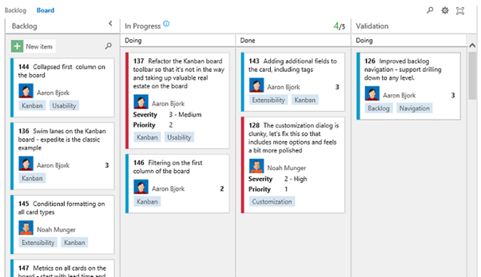
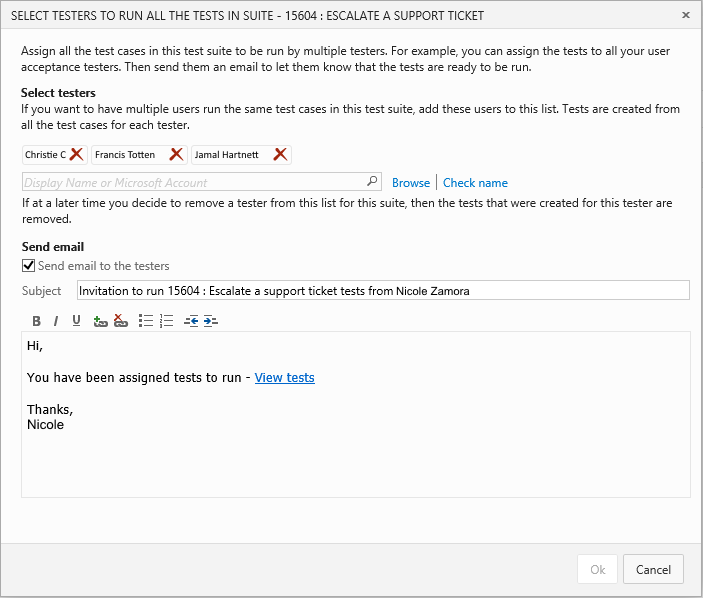
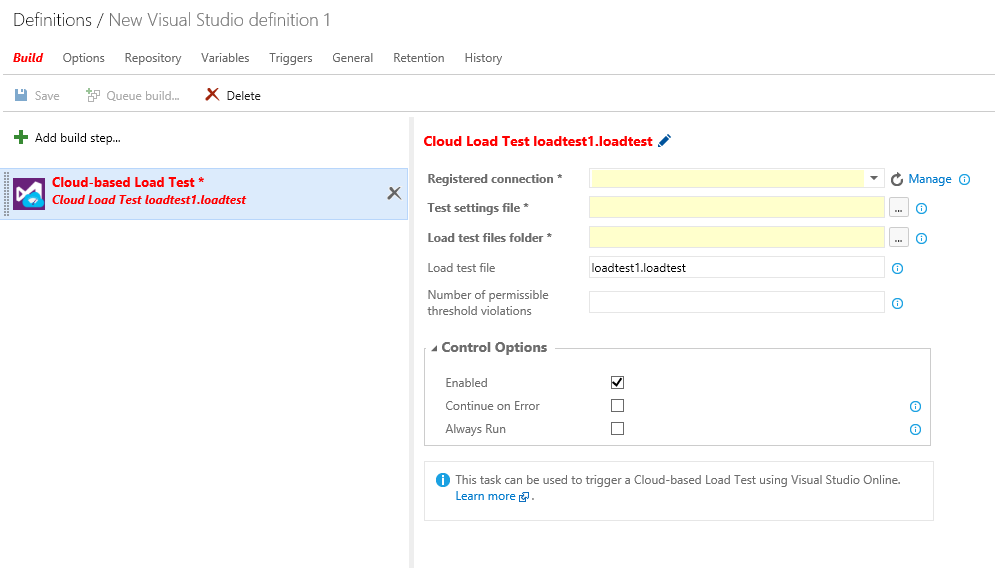
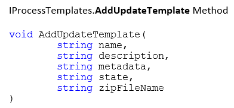
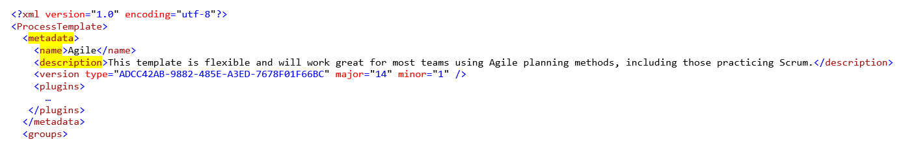

#  Team Foundation Server 2015 RTM

### August 6, 2015

Today, we are happy to announce the availability of the Visual Studio Team Foundation Server 2015 RTM (Release to Manufacturing). This is the newest version of Team Foundation Server (TFS), the collaboration platform at the core of Microsoft's application lifecycle management (ALM) solution.

You can install Team Foundation Server from the following link.

**Download:   [Team Foundation Server 2015 RTM](http://go.microsoft.com/fwlink/?LinkId=517106)**

## What's New in Team Foundation Server 2015

SKU changes:

- [Basic license expanded](#basic)
- [Changes to the schema in databases](#schema)
- [Project Server Extensions](#pservext)
- [SharePoint Extensions](#spext)

Feature updates:

- [Identity control and avatars](#indentav)
- [Taskboard: Bugs on your backlogs and boards](#tbugs)
- [Product backlog updates](#pbacklogup)
- [Sprint backlog and task board updates](#sprint)
- [Customize and configure your cards](#ccards)
- [Kanban board updates](#kanban)
- [Turn off the first column on the CFD chart](#cfdcol)
- [SAFe support for Process Templates](#safe)
- [Process Templates renamed](#proctemp)
- [Current iteration query token](#curitoken)
- [Query progressive disclosure](#qprog)
- [Branch policies ](#brpol)
- [Branch policies - Gated build](#gatebld)
- [Branch policies - Code review](#codepol)
- [Branch history (pushes & pull requests)](#branchist)
- [Web history view for Git projects](#webhistgit)
- [Quick code editing](#quicked)
- [History control](#histcon)
- [View history on a folder](#vhist)
- [Build automation system](#bldauto)
- [Team project rename](#tpr)
- [REST APIs](#restapi)
- [Service hooks](#svchook)
- [Improved merge performance](#mergperf)
- [Assign multiple testers](#multitest)
- [Cloud-based load tests](#loadtest)
- [Automated testing](#autotest)
- [Change in API behavior](#apichange)

Other changes: 

- [Bug Fixes & Known Issues](#Other)

Related releases:

- [Visual Studio 2015 RTM](https://www.visualstudio.com/news/releasenotes/vs2015-rtm-vs)

###  Basic license expanded

The following features are now available to all Team Foundation Server users with a "Basic" license:

- Web-based test execution
- Agile portfolio management
- Work item chart authoring
- Team Rooms

What this means: All teams of five or fewer members with a "Basic" license have access to these features using Team Web Access for free, while larger teams can access this functionality at a much lower price point.

###  Changes to schema in databases

Team Foundation Server 2015 includes a large number of changes to the schema used in its databases, and as such, an upgrade from TFS 2013 and older releases is expected to take a significant amount of time. Because upgrades are offline, Microsoft is providing a tool, TfsPreUpgrade.exe, which can be used to perform the most time-expensive portions of the upgrade online against TFS 2013 QU4 and QU5 deployments. The Upgrade wizard includes a readiness check, which warns you if your database is large enough that running TfsPreUpgrade.exe is recommended.

###  Project Server Extensions

Project Server Extensions are now a separate download. Check out the TFS section of the [Downloads page](http://go.microsoft.com/fwlink/?LinkId=517106) for more information.

###  SharePoint Extensions

In the past, if you wanted your Team Foundation Server integrated with a SharePoint instance that was on a different machine, you could either run the Team Foundation Server installer on the SharePoint server and then configure TFS Extensions for SharePoint *or* run a special installer (tfs_sharePointExtensions.exe) that put only the bits necessary for configuring TFS Extensions for SharePoint.

We have removed this special installer, so to integrate your Team Foundation Server with SharePoint, you must run the Team Foundation Server installer on the SharePoint server and then configure TFS Extensions for SharePoint.

###  Identity control and avatars

This new control includes a user’s full name, avatar, and email address.

We've designed this control to be very intuitive to use. When you put focus on the control, it starts by giving you an MRU (most recently used) list of people to whom you’ve most recently assigned work items. If the person you’re after isn’t in the list, just click Search and the list will populate with matching results from the users in your account. And, not only are we providing a new identity control, but we've also refactored many of the places where we display a user's name so that it now includes their avatar. You'll see avatars on cards on your work items, boards, and more.

###  Taskboard: Bugs on your backlogs and boards

We've enabled the ability for teams to choose if they want to show bugs on their backlogs, regardless of process template. We have expanded the functionality of this setting. Teams can now choose to show bugs on the backlogs and taskboard with requirements (user stories or product backlog items), with tasks, or not at all.

###  Product backlog updates

#### Backlog navigation updates

We've overhauled the navigation of backlogs. From every backlog, you can drill down into more levels, all the way down to Tasks. In addition, from every backlog, you can toggle the levels above your backlog on or off by using the Parents filter. Items not owned by the team, but pulled in based on relationship, display with a hollowed-out color bar. At a glance, you can differentiate between items that your team owns from those owned by other teams.

Finally, you can reorder and re-parent in every view! Just drag and drop in any of the views to reorder items and change relationships.

#### Opt-in to portfolio backlog levels

Related to the navigation updates, you can now turn off backlog levels that your team isn’t using. Prior to this update, all backlog levels were forced on every team. Each backlog level is now “opt-in,” allowing you to configure the levels appropriate for your team. Click the gear at the top of the page, select the team you’re configuring, and then choose the backlog levels you need.

#### Re-ordering in a filtered backlog

The context menu now provides an option to move an item to the top or to a specific position, even when a filter is applied on the backlog.

#### Text filtering on backlogs & queries

Now you can quickly filter backlogs and query results by using the new filter textbox we've placed on the toolbar. Simply type in text from the items you’re looking for and the backlog/result is immediately filtered to show only those items with matching text. This feature is really handy when you’re scanning a long backlog or query result for a specific item (or set of items). Note that the matching is done on data in the displayed columns—including tags.

###  Sprint backlog and task board updates

#### Show un-parented tasks

The tasks in the sprint that do not have a parent story will now show up on the sprint backlog and task board, under an "Un-parented" category. The un-parented row is highlighted with a grey-colored bar. You can move tasks from an un-parented row to any user story, and vice versa. (Note: Drag & drop of an un-parented row is not allowed; it will always appear on the top of sprint backlog as well as the task board.)

#### Collapse completed stories

Completed stories will be collapsed automatically when the task board is opened. All stories on the sprint backlog will be collapsed by default. Stories that are collapsed but have pending work will show a warning on the task board. Collapsed rows on the task board will also show the summary of pending work for that user story. And, PBIs on task board will now appear as cards just as tasks do.

###  Customize and configure your cards by adding fields & tags

Not only can you customize how your cards look on your Kanban board, but you now have configuration options for the data showing up on your cards in the Customize Cards dialog box. 

(A similar customization dialog box is also available for the Taskboard.)

You can turn the ID on or off, select how the assigned to field is displayed, and choose to show tags directly on your cards. Most people want fields like "title" and "assigned to" on every card, but it's a time saver to bring a bit more information to the cards so you can take action on them without having to open them for more details. For example, notice that we've added both "Priority" and "Severity" to the following bug cards:

The Custom fields added to your cards are directly editable from the board. And, these options are per team (or backlog) and per work item so that you have maximum flexibility. 

###  Kanban board updates

#### Adding and editing directly from the Kanban board

We've updated all boards to support adding new cards and inline editing. The Kanban board now has a New item button at the top of the first column that adds a new card. After you add a new card, all data on the card can be edited directly from the card itself. Learn more about Kanban inline adding and editing.

#### Reordering on the Kanban board

We've turned on reordering items on the board. You can now move items up and down in priority within each column on your board. Any changes made on the board are also reflected directly on the backlog. In fact, with this change, many of you may choose to use the board over the backlog, as the board now supports adding, inline editing, and reordering. Learn more about Kanban reordering.

#### Filtering across all data displayed on the Kanban board

You can now filter the entire board. Enter a filter term in the all-board filter and it will filter by any information displayed on your card, including any fields that you might have added, tags, or ID. We’ve also provided a filter on the first column so you can find that item on your backlog to pull onto your Kanban board.

#### Split columns on the Kanban board

We’ve added a new feature to our Kanban board called “Split Columns”. Kanban teams use a pull model to move work through the board. To do this effectively, each column on your board is split into two subcolumns—Doing and Done. Moving a card into the Done column provides a clear signal that work is ready to progress, and that the card can be pulled by the person/team who owns that next stage.

To split any of the columns on your board, simply click the Customize Columns link on the toolbar.

Learn more about  [Kanban split columns](https://www.visualstudio.com/en-us/news/2015-feb-18-vso).

#### Swimlanes on the Kanban board

We added the ability for teams to create horizontal swimlanes to track different classes of work. A classic example is the Expedite lane. So now, each team can create their own lanes, and make the board look just the way they want.

#### Kanban definition of done

As work moves through your board, it's critical that you and your team are on the same page about what “done” means for each column. This release brings a new capability that lets you specify a definition of done for each column on your board. We even support markdown, so you can format the text or include hyperlinks to other locations.Columns with a definition now include a small icon in the header that communicates the agreed-upon definition.

Learn more about  [Kanban DoD (definition of done)](https://www.visualstudio.com/en-us/news/2015-mar-10-vso).

###  Turn off the first column on the CFD chart

You can now omit the first column of the Kanban board and get a more meaningful CFD chart. (The first column often represents the long backlog of items a team is working on, but not the items actively on the kanban board.)

To do this, select "Edit" from the CFD chart, and then uncheck the "include first column" checkbox. (And note that for all existing backlogs/CFD charts, this box will be checked by default.)

###  SAFe support for Process Templates

We are very excited to provide built-in support for the Scale Agile Framework (SAFe) using our existing Scrum, Agile, and CMMI templates.

#### Support for Epics

- We have added an Epic work item type and a backlog/board to track Epics. Epics are hierarchically above Features. Features are mapped to Epics, like Backlog items are mapped to Features.
- Full backlog and board functionality are available. You can manage the Epic backlog like any other backlog as well as customize your Kanban columns and cards to match your needs. (The Epics backlog is not enabled by default. To enable this feature, check the "Epics" checkbox from the Team Settings page.)
- The Epics backlog can be turned on or off at the team level. As per our whitepaper, Portfolio Teams should enable the Epics backlog. Program and Feature teams can disable the Epics backlog if they don’t manage Epics in your organization.

#### Support for Architectural vs. Business backlogs

We have added a “Value Area” field to all work items that appears on a backlog, that is: Epics, Features, and (depending on your process template), the field also appears on Product Backlog Items, User Stories, and Requirements.

The Value area has two values: Business and Architectural. By default value, all Epics, Features, and Stories are Business types. To create an Architectural Epic, Feature, or Story, set the value to Architectural.

With this functionality, you can define Architectural Epics, which in turn break down into Architectural Features and Stories, allowing you to track your architectural roadmap across your organization. 

Learn more about [SAFe support for process templates](http://blogs.msdn.com/b/visualstudioalm/archive/2015/05/15/scaled-agile-framework-visual-studio-online-process-template-updates.aspx).

###  Process Template renamed

The name of the templates will change from the verbose names that includes the version name (for example, "MSF for Agile Software Development 2013.4") to simply "Scrum", "Agile" and "CMMI". The templates are now locked, which means that you cannot make changes to the shipped templates. To create a custom process template based on a shipped template, simply export an existing template, give it a new name and version, and then reimport it by using the Process Template Manager. Existing projects are unaffected by this change, which means that they can continue to have their process customized by using witadmin.

###  Current iteration query token

This feature gives you the ability to specify a token that represents the current iteration in iteration-based queries. As you know, iterations have dates associated with them. As you move from iteration to iteration, it's very tedious to update all the queries used to track work for the next iteration. This release brings the addition of a new query token, @CurrentIteration, that returns the current iteration based on today's date. There are some limitations with this new token, however. For example, it doesn't work in Excel. The token relies on understanding your team context, and unfortunately Excel doesn't have all the information needed to determine which iteration is current. Learn more about the current iteration query token.

###  Query progressive disclosure

Now, large query lists are not opened every time the query pane is shown. Only the first two levels are loaded, and then you can load the remaining levels on demand.

###  Branch policies

To help teams using Git improve the quality of code going into their repo, we've added a new capability to set policies on branches. These new policies enable teams to configure requirements for their development branches that are enforced by the server when pushing or merging pull requests. You can prevent build breaks by using the build policy to require that all changes entering a branch must pass a configured build. You can also use code review policies to set a minimum number of reviewers for pull requests, or even require specific users to review changes made to specific portions of your codebase.

###  Branch policies – Gated build

Git projects can now set branch policies to require a successful build before any code can be submitted into a branch. Enabling the build policy will require the use of pull request to submit changes into the configured branch, and completion of the pull request will be gated upon the successful outcome of the configured build.

###  Branch policies – Code review

Git projects can now set branch policies to require code reviews for any code submitted into a branch. Enabling the code review policies for a branch will enforce that all code must be submitted to that branch using pull requests. The policies provide options to require a minimum number of code reviewers, as well as to require specific reviewers for particular paths and/or file types.

###  Branch history (pushes & pull requests)

In the web portal, the History hub under CODE has been updated to support a new view for Git projects. The new "Branch Updates" view shows all of the updates for a given branch, and groups commits by Push and Pull Request activity. This view provides developers a new insight into how their Git repo is being updated over time, and provides traceability from History to Pull Requests.

###  Web history view for Git projects

The code history hub has a new view: Branch Updates. This view—which is available only for Git projects—shows all updates for a given branch, and groups commits by push-and-pull request activity. This view also provides developers with a new insight into how their Git repo is being updated over time, and provides traceability from history to pull requests.

###  Quick code editing

In this release, we added the ability to make a quick edit to a file in version control directly from your web browser and then commit those changes straight back to the service. When browsing a source file, you now have an Edit command that puts the file into editing mode. Changes can then be made inline, complete with color coding and formatting support. As soon as you click the Save command, we create a new commit/changeset with your changes. Use the diff view to see exactly what changes you’re making before committing the changes. If the file is a Markdown or HTML file, you can also preview your changes before you save them.

Not only can you edit files, but we also added the ability to add, delete and rename files directly from the web. To add a new file (or files), right-click a folder in your repository, select 

Add file(s), enter your check-in/commit comment, and you're ready to go. The days are gone when you have to download your entire codebase just to rename or delete a file.

The new editing capabilities also show up in the Welcome hub, making it easy to create documentation for your projects. If you don't have a README.md file, you can start with our template guide and commit your own.

We also enabled the ability to create links to existing (or new) markdown files by following the syntax. Don't worry if the page doesn’t exist, because you can edit and commit the new file when you click the link, wiki-style.

With these new features, we hope that you find creating and editing your project documentation to be easy and fast!

Learn more about the [quick code editing](https://www.visualstudio.com/news/2014-dec-17-vso).

###  History control

We have optimized the history control to make discussions easier to read. Specifically, we’ve reduced the vertical space required so that you can get to the discussions you want to see more quickly, and we’ve done this without reducing functionality.

###  View history on a folder

Now, you can right click on any folder in Solution Explorer, the Changes page, or the Commit Details page, and get the history of changes to files within that folder. 

###  Build automation system

Team Foundation 2015 includes our new build automation system. To learn more about the new build automation system, click the [link](https://msdn.microsoft.com/Library/vs/alm/Build/overview) in the message header, which is in the Build tab.

###  Team project rename

We've enabled the ability to rename a team project. All of your version control paths, work items, queries, and other team project artifacts will be updated to reflect the new name. Team projects can be renamed multiple times and older names can be reused as well.

Learn more about [renaming a team project](http://go.microsoft.com/fwlink/p?LinkId=528893).

###  REST APIs

This is the first release that brings REST APIs to on-premises TFS. JSON REST APIs enable a lightweight way to work with Team Foundation Server from virtually any device, platform, or technology stack, including Windows, Android, iOS, Node.js, and others. You can create and query work items, queue a build, get recent team room messages, access source code, and accomplish almost any team or code management task.

###  Service hooks

You can use service hooks to let your app or service get notified instantly when an event happens in Team Foundation Server. With service hooks, your app or service can avoid continuously polling to check for changes, such as completed builds, commits/check-ins, or work item changes. Now you can create powerful integration scenarios where Team Foundation Server can inform another service of a change, thereby enabling the use of both services together. You can find services hooks as a new hub in project administration.

How service hooks work: A service hook subscription controls what action to perform on a target, external service when a specific type of event happens. Similarly to an e-mail alert subscription, a service hook subscription is associated with the user who created it. When an event occurs and a service hook attempts to match a configured subscription to an event, a permission check is performed to ensure the user who created the subscription has permission to access to the resource associated with the event. For example, a user (likely a project administrator) creates a service hook subscription that is triggered on all “work item created” events. When a new work item is created under an area path that this user does not have access to, the permission check will prevent the subscription from matching and therefore avoid any external notification from being sent via this subscription.

However, because service hooks make it easy to integrate with external services (like Trello or Campfire), you should make sure that the data that the creator of a subscription has access to is not made available to other users who might not have the same level of access. For example, a subscription that is defined to send all “code push” events to a Campfire room could result in information being improperly disclosed to users who do not have access to the repository associated with the event (but would be able to see the information because they have access to the Campfire room).

###  Improved merge performance

We have improved merge performance, which is especially apparent on large repos.

###  Assign multiple testers and invite them for testing

If you have a scenario in which you must invite multiple sign-off owners to run the same set of test cases, you can now assign multiple testers to a test suite. Doing so will pick each test case in the test suite and create a test for each tester who you add to the test suite. You can also send an email inviting them to run tests. When a tester clicks the “View tests” link in the email, a test plan opens that includes a filtered list of tests assigned to that tester.

###  Cloud-based load tests

We are announcing new capability for running Cloud-based load tests as part of the new Build system. There are two parts: A cloud-based Load Test and a Cloud-based Web Performance Test: 

list-style-type: none; 
- **Cloud-based Load Test** allows you to execute an existing Load test project as part of your CI/CD pipeline.
- **Cloud-based Web Performance Test** executes a simple load test against an App URL, with the basic load test parameters being configured in the task itself.

###  Automated testing

We are announcing new capabilities for running unit tests on the build machine, functional automation runs on remote machines, and browse test results as part of the new Build system. Read more details in [this blog](http://aka.ms/testingblog).

There are now two test tasks - Visual Studio Tests (VSTest Task) and Visual Studio Tests using Tests Agents (VSTest Remote Task). 

- **VSTest Task** runs tests locally on the build machine, and typically, you'll run only unit tests with this task.
- **VSTest Remote Task** runs tests on remote machines in a distributed fashion by using test agents, and you can run either functional, unit tests or UI tests.

Additionally, we are announcing a Machines hub, and a Runs tab in the Test hub.

- **Machines hub**. You'll use the Machines hub to create and manage remote machines.
- **Runs tab**. This tab in the Test hub acts as a a single repository for all test results in the system. You’ll not only be able to browse automated test results from VSTest and VSTestRemote tasks, but also from legacy workflows such as XAML Builds and Build- Deploy-Test workflows. Additionally, you can choose to integrate publishing test results into you custom tasks by leveraging REST APIs to publish Test Results. The ‘Runs’ hub today supports querying on test runs and test results, assigning owners to test failures, tracking their analysis, and filing bugs.

###  Change in API behavior

The name, description, and metadata arguments values of the API for IProcessTemplates.AddUpdateTemplate Method are now overridden by the process template data specified in the zipFileName. The reason for this change is to avoid conflicts between what’s in the ZIP file and what’s passed in as a parameter to the API.

The following screenshot shows where these properties are defined in ProcessTemplate.xml.

###  Other Changes: Bug Fixes & Known Issues

For a complete description of technology improvements, bug fixes, and known issues in this release, see the following KB article. 

**Learn More**: [Description of Team Foundation Server 2015 RTM](http://go.microsoft.com/fwlink/?LinkId=617926)

[Top of Page](#top)