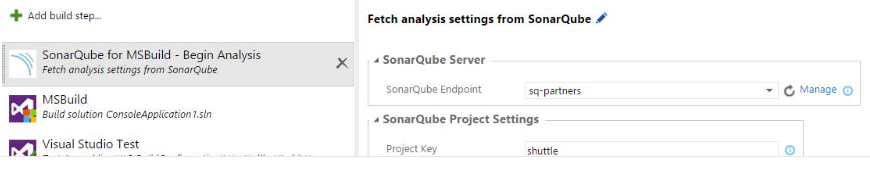
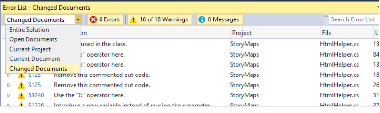

#  Team Foundation Server 2015 Update 1

### November 30, 2015

Today, we are happy to announce the availability of the Visual Studio Team Foundation Server 2015 Update 1. This is the newest version of Team Foundation Server (TFS), the collaboration platform at the core of Microsoft's application lifecycle management (ALM) solution.

You can install Team Foundation Server from the following link.

[Download the latest Team Foundation Server update now.](http://go.microsoft.com/fwlink/?LinkId=615439)

## What's New in Team Foundation Server 2015 Update 1

Feature updates:

- [Git and Team Foundation Version Control (TFVC) in the same project](#git)
- [Version control on the web - history and getting started improvements](#vcweb)
- [Query on Kanban columns](#querykan)
- [SonarQube works for Java programs built with a Maven Build task](#sonarqube)
- [SonarQube Analysis build tasks work with on-premises and hosted agents](#sonarbuild)
- [Multi-select on all backlogs](#multi)
- [Tag coloring on Kanban](#tagcolor)
- [Tasks as a checklist](#taskchk)
- [Dashboards: customizable; create multiple dashboards; new widgets](#dashboards)
- [Rename Kanban columns and swimlanes inline](#rename)
- [Pull requests in Visual Studio](#pullreq)
- [#ID in pull requests](#idpull)
- [Branch policy to require linked work items](#branchpol)
- [Add/remove users from capacity](#addremov)
- [Multiple activities per team member](#multact)
- [Drag any item to an iteration from anywhere](#dragitem)
- [Add panel on the iteration backlog](#addpanel)
- [Line on the burndown indicates actual capacity](#line)
- [Reorder cards when changing columns](#reorder)
- [Configure settings directly from backlogs/boards](#config)
- [Hide empty fields on cards](#hide)
- [Card coloring on task board and Kanban board](#cardcol)
- [When creating a query, limit the values shown for Work Item Type](#querylimit)
- [Manual Testing: Export test outcome](#mantest)
- [Manual Testing: Manual test step results and iterations for data driven tests](#mtresults)
- [Improved access control for build resources](#imprvacc)
- [Improved source control integration in Team Build](#imprvsci)
- [Fixed small usability issues in Build Explorer](#fixed)
- [Test result retention policy](#testresult)
- [XAML build parity progress](#xaml)
- [Commit details summary is easier to read](#commit)
- [Improved experience for empty Git repositories and cloning existing repositories](#improvegit)
- [Azure Resource Group deployment support in build workflow](#azurergp)
- [Continuous delivery: Provisioning of resources in Azure](#cdazure)
- [Visual Studio error list filtering is governed by modified files](#errorlist)
- [Standalone Office integration installer](#standalone)

###  Git and TFVC in the same project

Team Foundation Server now supports adding Git repositories to Team Foundation Version Control (TFVC) Team Projects or adding TFVC repositories to Git team projects. This makes it easier to adopt a new version control system while keeping all your current team project data. Team members will need to run Visual Studio 2015 Update 1 to easily switch between TFVC and Git in the same team project.

###  Version control on the web - history and getting started improvements

The commit details page for merge commits is improved to make it easier to read the commit message and see the important details of a merge commit. Merge commits default to showing a diff against parent 1 because that's the most likely diff you want, especially if you use pull requests. In addition, the empty Git repo and clone Git repo experience make it easier to clone your repo through Visual Studio, XCode, Eclipse, or the command line.

###  Query on Kanban columns

Data from your Kanban board, including the board column, column done indicator, and board swim lane, are all now available. You can create queries, charts, and styling rules based on them. These fields show up in all column option pickers, and can be exported as read-only fields in Excel. You’ll see three new fields in work item experiences:

- Board Column: current Kanban board column the work item is in.
- Board Column Done: False (Doing) or True (Done) value depending on whether the work item is in the Doing or Done split column on the Kanban board.
- Board Lane: current Kanban board swimlane.

###  SonarQube works for Java programs built with a Maven Build task

You can now perform a SonarQube analysis using the Maven Build Task.

###  SonarQube Analysis build tasks work with on-premises and hosted agents

SonarQube build tasks that embed the sonar-msbuild-runner 1.0 work with on-premises and hosted agents. You can now use two build tasks to execute a SonarQube analysis in conjunction with MSBuild. Before the build steps that execute the actual MSBuild, insert a **SonarQube for MSBuild - Begin Analysis** task to specify the SonarQube project parameters, the connection to the SonarQube server, and (until SonarQube 5.2 is available) the connection to the SonarQube database. After the build and any test tasks, append a **SonarQube for MSBuild - End Analysis** task to complete the analysis and send the data to SonarQube.

###  Multi-select on all backlogs

Multi-select is available on all backlogs and supports:

- Drag-and-drop reordering and re-parenting
- Dragging items to an iteration
- Dragging items to the mapping pane
- Support for **move to top** and **move to position** on the context menu
- Bulk edit
- Bulk assign to

###  Tag coloring on Kanban

You can now change the color and style of title text as well as add color to specific tags. To try this, click the gear icon. You can format title text under **Styles** and color tags under **Tag colors**.

###  Tasks as a checklist

Tasks can now be added, edited, and marked as done directly from the parent card on your board. A summary of the roll-up status indicates how many tasks have been completed and how many remain.

###  Dashboards

Dashboards are now available in Team Foundation Server Update 1. Dashboards provide visibility to your team and stakeholders on progress of work, code, tests, and builds.

We've added the following:

- **Customizable dashboards.** The existing project home pages are now a completely customizable experience, giving you full control of all the data on your screen. As a team admin, you can rearrange, remove, or add the widgets that you want and use. A new widget catalog is accessible to team admins through the large green plus (+) button at the lower right side of the dashboard.
- **Create multiple dashboards.** Until now, the Team Overview page was the only page that teams could use to pin widgets. Now, as a team admin, you can create multiple dashboards using the plus (+) button next to an existing dashboard or through the dashboard manager. The dashboard manager is accessible through the settings icon on the dashboard.
- **New dashboard widgets.** All the pieces of data that used to be available on the previous Team Overview page are now available through the widget catalog. You can still add multiple charts to the dashboard through the Work, Test, and Build hubs. In addition, we’ve brought new widgets into the catalog: a conditional query tile (that allows you to set red or green if the number of work items crosses a threshold); a code tile (recent commits in the last 7 days); a query results widget (allows you to see all work items from a query); and a markdown widget (enables custom text, images, and links).   

###  Rename Kanban columns and swimlanes inline

You can now rename columns on your Kanban board in place, without having to jump into the configuration dialog.

###  Pull requests in Visual Studio

Team Explorer has a new Pull Requests hub where users can see the list of pull requests they have created as well as the pull requests others have assigned to them. The Create Pull Request experience has been improved to enable users to publish branches and create pull requests in a single action.

###  \#ID in pull requests

You can now mention work items using the "#" symbol in pull request discussions, pull request code comments, and commit code comments. Those work items are clickable and present the work item light box experience that you're familiar with.

###  Branch policy to require linked work items

We now have a branch policy to require associated work items for any pull request. Like the code reviewer and build policies, any code submitted to the branch must be submitted via pull request. When a pull request is created, the associated commits will be inspected for work item links, and if there is at least one link, the policy will be fulfilled. Also, you can now link work items to pull requests directly, and if the pull request is directly linked to at least one work item, the policy will be fulfilled. If no work items are linked to the pull request or the associated commits, the policy will fail.

###  Add/remove users from capacity

Two new buttons on the toolbar let you add any member to your sprint plan (including those outside your team), as well as add any missing team member.

###  Multiple activities per team member

When planning capacity for a sprint, you can now assign multiple activities to a single team member. Just hover over or click on a row, then click the ellipses (…) to add a new activity. If a team member does both development and testing, you can fine tune the capacity to match your team’s skill sets.

###  Drag any item to an iteration from anywhere

You can now drag any work item from any board or any backlog to a sprint.

###  Add panel on the iteration backlog

We've made a change that allows you to add new backlog items directly to your sprint backlogs. Previously, the only way to add new work to requirements or bugs to a sprint was to add them to the product backlog, and then drag each item one at a time to the correct sprint.

###  Line on the burndown indicates actual capacity

The burndown chart now has a line that shows available capacity during a sprint, in addition to the existing ideal trend line. Now you'll have a better idea of whether you're on track to finish all your work during the sprint. This line is built on the capacity data, including individual and team days off.

###  Reorder cards when changing columns

You can now reorder the card when you change the column, so the card will stay where you drop it. We also eliminated auto-scrolling, so the board keeps its location after you drop a card.

###  Configure settings directly from backlogs/boards

The gear icon appears on all the backlog and board pages. Click it to show all the settings available for that page. As new settings become available, you’ll find them here.

###  Hide empty fields on cards

We've added the ability to hide empty fields on the card. This means less whitespace, smaller cards, and more cards on your board. To enable this feature, click the gear icon, select **Fields**, and clear **Show empty fields**.

###  Card coloring on task board and Kanban board

You can now configure boards to include custom formatting on your work items, based on any value. Setting this up is easy. Click the gear icon on the top of your board, select **Card styles**, and create a rule for the color you’d like to add.

###  When creating a query, limit the values shown for Work Item Type

You can now scope queries to limit the drop–down list for states and work item types, eliminating states and types from projects outside the scope of your query.

###  Manual testing: Export test outcome

The Export Test Plan feature in Test Hub lets you email or print a test plan in a review–friendly format. Until now, you could export test–authoring–centric information such as test plan, test suite hierarchy, test configurations, and test cases. Now there's support for exporting test–execution–centric information. You can use this feature to share a detailed status of test execution progress with stakeholders. In the export selection dialog, you can export the latest test outcome, which will export the latest test result for all tests of a test case, including fields like the time when the test was run, the build that was tested, the configuration that was tested, the tester who was assigned the test, and the identity who actually ran the test.

###  Manual Testing: Manual test step results and iterations for data driven tests

Test Hub supports running manual tests and viewing test pass/fail information. Until now, viewing detailed test result information like test step details, comments, and attachments was possible only with Microsoft Test Manager (MTM). With this update, you can browse which test steps passed or failed and the comments entered by the tester while running the manual tests. In Test Hub, click the **Runs** tab. If you have run tests using MTM and have captured screenshots, video, and other attachments such as system information, you can view them as well. If your tests are data driven with parameters, you can browse the details for all the test iterations. To browse this detailed test result information, open the **Recent Test Results** pane and double-click a test result. You can also view these test results by navigating to Runs tab in Test Hub.

###  Improved access control for build resources

Build administrators can now add permissions to agent queue, which will restrict who can use that queue in a build definition.

###  Improved source control integration in Team Build

You can control the client–side mappings for source control folders from Team Foundation Version Control (TFVC). We've reduced the number of characters in the default working directories for Team Build, which should help mitigate some of the path length issues in Team Build.

###  Fixed small usability issues in Build Explorer

The My Builds context menu item is available again in the Build Explorer. This will open the list of your builds in Visual Studio instead of always taking you to the web. Clicking on an individual build to see the details will still launch the browser.

###  Test result retention policy

We've enabled in-product support to simplify test result data cleanup and remove dependency on tools like the Test Attachment Cleaner. The test result retention policy feature will add the capability to clean up all test result data in the system including test runs, test results, and test attachments that are older than a specified number of days. All test results in the system, including results from automated test workflows, manual test workflows, and test results published using REST APIs can be cleaned up using this feature. This retention policy can be configured at a team project level. You can specify separate policies for automated and manual test results, offering the flexibility to retain manual test results longer than automated test results.

We are also integrating test retention with the retention policy of the new build system (Build vNext) by adding functionality to delete test results when builds are deleted. More information about this feature is coming on the [Visual Studio ALM blog](http://blogs.msdn.com/b/visualstudioalm/archive/2015/10/08/test-result-data-retention-with-team-foundation-server-2015.aspx).

###  XAML build parity progress

Team Build in Visual Studio Team Services and Team Foundation Server now support the following features from the XAML build system:

- Label sources in both Git and TFVC
- Client–side workspace mappings for TFVC

###  Commit details summary is easier to read

The commit details summary is easier to read because the commit message is at the top and the extended message is below. It also defaults to showing a diff with parent 1, which works well with the new pull request experience that always creates a merge commit.

###  Improved experience for empty Git repositories and cloning existing repositories

It's easier to clone a repository on Visual Studio Team Services and Team Foundation Server. You can **clone in Visual Studio** or create a personal access token directly from the empty Git repo page or clone button.

###  Azure Resource Group deployment support in build workflow

With the addition of the Azure Resource Group deployment task, along with the support of ARM (Azure Resource Manager), you can manage the lifecycle of an Azure Resource Group. This includes support for provisioning and deployment of Azure resources. The Azure Resource Manager lets you create reusable deployment templates that declaratively describe the resources that make up your application (for example, a website and a SQL database). This simplifies the process of creating complex environments for development, testing, and production in a repeatable manner. You can find Azure templates at GitHub and Azure Gallery.

In addition, Azure service connection endpoint now supports Azure AD Security Principals

###  Continuous delivery: Provisioning of resources in Azure

Using Azure Resource Manager, you can now include a step in your build definition to provision resources. The new "Azure Resource Group Deployment" task lets you provision resources, like virtual machines, by using a template file and then deploy the latest build into those resources by using resource extensions, such as DSC resource extension.

###  Visual Studio error list filtering is governed by modified files

You can now filter the error list to see only errors, warnings, and information in files that have pending changes. This way, you are not overwhelmed by errors in the files that you did not touch, and you can focus on the errors that you have an opportunity to fix.

###  Standalone Office integration installer

The standalone Team Explorer installer was removed in Team Foundation Server 2015 because many non-developer features were moved into the TFS web experience. One inconvenience this introduced was that non-developers who wanted to use TFS Office integration capabilities could no longer access them unless they installed a full version of Visual Studio. In the TFS 2015 Update 1 release, a standalone Office integration installer is now available. It includes Excel integration Project client integration and the PowerPoint–based storyboarding tool.

### Other Changes: Bug Fixes & Known Issues

For a complete description of technology improvements, bug fixes, and known issues in this release, see the following Knowledge Base (KB) article.

**Learn More**: [Description of Team Foundation Server 2015 Update 1](http://go.microsoft.com/fwlink/?LinkId=691935)

[Top of Page](#top)