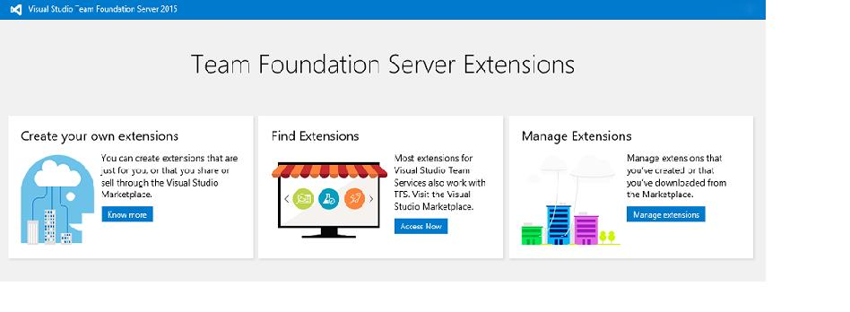

#  Team Foundation Server 2015 Update 2

### May 5, 2016

Today, we are happy to announce the availability of the Visual Studio Team Foundation Server 2015 Update 2. This is the newest version of Team Foundation Server (TFS), the collaboration platform at the core of Microsoft's application lifecycle management (ALM) solution.

You can install Team Foundation Server from the following link.

**Download the latest [Team Foundation Server Update](http://go.microsoft.com/fwlink/?LinkId=615439)**

**Note:** Team Foundation Server 2015 Update 2.1 has had some bug fixes since Update 2.0. Please refer to [KB3160281](http://go.microsoft.com/fwlink/?LinkId=787659) for the list of fixes. If needed, for configurations such as multiple application tiers that require matched versions, you can still download [Team Foundation Server 2015 Update 2.0](http://go.microsoft.com/fwlink/?LinkId=787600).

To learn more about the other related downloads, please see the [download page](https://www.visualstudio.com/downloads/download-visual-studio-vs).

We welcome your feedback! For problems, let us know via the Send Feedback option in Visual Studio. For suggestions, let us know through [UserVoice](http://visualstudio.uservoice.com/forums/330519-team-services).

## What's New in Team Foundation Server 2015 Update 2

Feature updates:

- [Team project creation and deletion experience improvements](#teamproj)
- [Release Management: new features and improvements](#newrmtfs)
- [Test results available in the Release summary](#testresult)
- [Reordering cards on boards](#reorder)
- [Deleting work items](#delwork)
- [Global shortcut keys](#globalshort)
- [Dashboards edit mode](#dashedit)
- [Auto-refresh dashboards](#autodash)
- [Build widgets in the dashboard catalog](#widgetdb)
- [Work item query charts in the dashboard catalog](#wiqdash)
- [@mentions and #ID](#mentionsid)
- [Pull request widget](#prwidget)
- [Markdown widget lets you choose an existing file in a code repository to display](#mdwidget)
- [Common identity picker](#commonip)
- [Gated check-in for Team Foundation Version Control](#gatedcheck)
- [Version control web](#vcweb)
- [Team Foundation Server extensions](#suppext)
- [Keyboard shortcuts for Kanban board](#keyshort)
- [Improved linking between code and work items](#imprlink)
- [Build-related features and improvements](#builditems)
- [Testing: new features and improvements](#testing)
- [Test in Java](#testjava)

###  Team project creation and deletion experience improvements

We're giving you the option to create and delete Team projects from the web experience and through the REST APIs. These improvements help to bring more parity between Visual Studio Team Services and Team Foundation Server for project management operations. Users who have permission to create team projects can do so from the collection administration view or the navigation drop-down list. See [creating a team project](https://msdn.microsoft.com/en-us/library/vs/alm/overview/create-team-project) for more details.

 

Similarly, users who have permission to delete a team project can do so from the collection administration view.

###  Release Management: new features and improvements

- **New version of web-based Release Management.** Release Management is now integrated into TFS. You can access Release Management features directly from the RELEASE hub in TFS web access without having to install a separate server or client. This new version of Release Management is simpler to use than the earlier version and is based on the same infrastructure and experience as the new Build system in TFS.
    - Simplify your application deployment to on-premises servers, SCVMM- or VMware-managed virtual machines, or to Azure.
    - Control your deployments by setting up release definitions that trigger deployments to environments in sequence or in parallel. Track how far your work items, commits, builds, and releases have been deployed.
    - You can create bugs for failed tests. Debug information, like error message and stack trace, will be auto-populated in the bug.

There's [documentation](https://msdn.microsoft.com/Library/vs/alm/Release/overview) about this new version and some recent [blog posts](https://blogs.msdn.microsoft.com/visualstudioalm/tag/release-management/).

- **A new extension for integration with VMWare.** Connect to a VMWare vCenter server from Visual Studio Team Services or from TFS and create, delete, and apply snapshots on virtual machines that are managed in vCenter. For virtual machines that are managed in VMWare, dynamically provision or restore them to a clean snapshot, then create build and release definitions to deploy. Get this [new extension](https://marketplace.visualstudio.com/items/ms-vscs-rm.vmwareapp) from the Marketplace.
- **A new extension for System Center Virtual Machine Manager (SCVMM).** Connect to a SCVMM server and create, delete, and apply snapshots on virtual machines that are managed in SCVMM administration console. Now you can replicate one of the key features from TFS Lab Management: create build and release definitions to deploy to virtual machines that are managed in SCVMM after you've restored them to a clean snapshot. Get this [new extension](https://marketplace.visualstudio.com/items/ms-vscs-rm.scvmmapp) from the Marketplace.
- **A deployments section in build summary.** This new section shows a list of environments where a build has been deployed through Release Management. You can also create a new release from this section.

- **Set target environments when you create and deploy a release.** We've added the ability to override automatic deployment. When you want to turn off automatic deployment to specific environments, go to the Automated deployments section in the Create New Release dialog box.A note on security: The flexibility to edit the deployment flow graph across environments is still restricted to release definition authors only. 

- **Create new releases on a schedule.** We've added the ability to set up a schedule for creating new releases. The latest version of successful build artifacts is picked up at the scheduled time. Once the release is created, automatic deployment to environments is determined by the deployment conditions configured on those environments. To configure a scheduled trigger for creating new releases, go to the Triggers tab in the release definition.

###  Test results available in the Release summary

To view test quality and analyze test results, the Tests tab in the Release summary will show you test status of each environment in which tests have run. The status includes count of passed and failed tests, pass percentage, and test duration for a particular environment or for the entire release, across all environments. You can drill down into the error message, stack trace, and test attachments to look for failed tests - without leaving the Release summary page.

###  Reordering cards on boards

Optimize boards for the way your team works. You can now specify how cards will be reordered when you change columns: reorder with no restrictions or strictly follow the backlog order.

###  Deleting work items

You now have the ability to delete work items, complete with a recycle bin experience! This capability replaces the **Removed** state. We’ve implemented**delete** as a unique permission, so you have fine-grained control over who has access to this capability.

###  Global shortcut keys

Introducing keyboard shortcuts for the Code and Work hubs! Navigate without ever taking your hands off the keyboard.

###  Dashboards edit mode

We’ve added a new mode called **edit mode** to all dashboards. Widgets won't move unless you select edit mode, reducing the chances of "accidentally" moving a widget. While you're in edit mode, you can remove, rearrange, and configure widgets, as well as add new widgets. 

###  Auto-refresh dashboards

We've added an option to auto-refresh a specific dashboard every 5 minutes. This is a great way to put the dashboard on your TV monitor or hallway screen and keep it updated.

###  Build widgets in the dashboard catalog

A new option to add a build history chart from the dashboard catalog lets you configure the build definition directly from the dashboard. Read the[dashboards futures blog](http://blogs.msdn.com/b/visualstudioalm/archive/2016/01/11/dashboards-futures-january-2016.aspx) to learn how we’re improving the discoverability and ease in bringing different charts to your dashboard.

###  Work item query charts in the dashboard catalog

You can now add charts for work item queries to the dashboard from the widget catalog. These charts are configurable. You can choose a query, a chart type, and visualization options while staying in the dashboard context. Chart types include pie, bar, column, stacked bar, line, area, and stacked area. You can also display data in a pivot table. And, you can still add charts from the Charts tab in the Work hub and configure them just like you've always done.

###  @mentions and #ID

Now you can use the **@ symbol** to mention people in pull request discussions, including commit changeset and shelveset discussions.

When you mention a person in a discussion, they receive an email alert that includes the discussion and a link to the pull request, commit, changeset, or shelveset. People mentions are clickable and display an identity card, with additional details. If you mention individuals who do not have permission to the pull request, commit, changeset, or shelveset, you’ll receive an email indicating that the @mention has failed.

In addition, you can now use the **# symbol** to mention work items in pull request discussions, including commit changeset and shelveset discussions.

These work items are clickable and open a new tab, where you’ll see the work item experience that you’re already familiar with.

Note: We don’t currently support @/# mentions in work item discussions and code comments. This is something we are planning on supporting in a future release.

###  Pull request widget

Team admins can now add the pull request widget from the dashboards catalog. For a specific repository, the pull request widget lets users see pull requests that are assigned to the team, assigned to me, and created by me. Users can quickly navigate to an individual pull request or they can view the summary of pull requests in the repository.

###  Markdown widget lets you choose an existing file in a code repository to display

You can now choose to display any markdown file in your existing repository. You can also add the file to any dashboard in your team project directly from the Code Explorer.

###  Common identity picker

We're rolling out an improved experience to search and discover users and groups in version control, release management, and @mention areas. Users can now do prefix-based searches on attributes like Display Name (such as ‘john doe’) and SAM-Account-Name (such as ‘jdoe’).

###  Gated check-in for Team Foundation Version Control

TFVC projects can now have branch policies to require a successful build before any code can be submitted into a branch.

###  Version control web

The CODE hub has several new features and numerous usability and style improvements. The Code Explorer now shows the status of the latest build for the selected branch, and has all new, modern icons to improve readability on high resolution displays.

The Pull Requests hub has improved views to highlight the pull requests you've created and those assigned to you and your team. Traceability between pull requests, work items, and commits has been improved by new linking experiences.

###  Team Foundation Server extensions

Extensions enable integrated experiences that extend and enhance the Team Foundation Server web experience, either by adding new capabilities or integrating with existing services.

On-premises extensions can be uploaded to Team Foundation Server and installed on specific team project collections.

Extensions can also be downloaded from the [Visual Studio Marketplace](https://marketplace.visualstudio.com/#VSTS) and uploaded to a Team Foundation Server.

###  Keyboard shortcuts for Kanban board

You can now click a work item on the Kanban board and use keyboard shortcut keys for common tasks. Here's a sample of what you can do:

- create new work items
- move work items within or across columns and swimlanes
- expand and collapse work items

###  Improved linking between code and work items

In addition to commit linking, we've added new linking capabilities. You can link work items to Git branches and pull requests and also create branch links directly from backlog items or the Kanban board.

When you create a pull request, any work items linked to the source branch or the commits will automatically be linked to the new pull request. The pull request details view has also been updated to include a Related Work Items section. The Related Work Items section lists all of the work items that are linked to a given pull request and provides a simple experience for adding links to more work items.

###  Build-related features and improvements

- **Build administration.** Administrators for build queues can now control who is able to create build and release definitions that use a given queue. This allows a team to have its own build resources within a given account or project collection.
- **Historical statistics.** Historical statistics for build and release agents are available from the queue and pool view. This can give build administrators a better understanding of how much usage there is for a given build resource.
- **Build interface improvements.** We've simplified the interface for creating new build definition. You can set key information about your sources and queue after selecting a template.
- **Extend build results view.** The build result (sometimes called build summary) view can be extended with custom information and views by using the extension framework. You can also extend the view by publishing a simple markdown file using this command: ##vso[task.addattachment type=Distributedtask.Core.Summary;name=myattachmentname;]c:\myattachment.md
- **Publish tasks as extensions.** Using the gallery, build and release tasks can be published as part of an extension.

###  Testing: new features and improvements

#### Planned testing in Build vNext

If you've invested in planned testing using test plans and test suites, you can trigger automated runs in Build vNext by using the **Run Functional Tests** task. Results are displayed in the Tests tab on the Build Summary page, as well as in the Test Hub. We've added a new Group By option on the Tests tab. Grouping by Test Suite gives you a quick view of all suites that were run and their quality.

#### Test results in build

There’s help for you to analyze test results in the Build summary page:

- An aggregate summary of test results across all test runs in the build.
- Tests failing for the first time in the bug are flagged as **New failures** to help you identify regressions. For tests that continue to fail across multiple builds, you can see how stale the failures have become and navigate to the build in which a failure was introduced.
- Trend charts that show the count of failed tests and test duration for the last 10 builds. You can add these charts to the dashboard.
- Code coverage reporting has been enhanced to show a pictorial view with build-to-build deltas.
- Test status is now available the build completion email notification.

#### Task improvements:

- Visual Studio Test using Test Agent task has been renamed to Run Functional Test.
- The Visual Studio test task and the Run Functional Test tasks are faster, more intuitive, and user-friendly.
- We’ve added support for xUnit, NUnit, Junit and the .trx file format to the Publish Test Results task.
- A new task, Publish Code Coverage, uploads data from Jacoco and Cobertura code coverage tools.
- In addition, a lot of work has been done to enable our Java users to publish results and code coverage information to TFS. Read about it in the section, "Test in Java."

#### Manual testing improvements:

- **Filter test plans.** Set a work item query based filter for test plans.
- **Show test from child suites.** See all tests that are present in the current suite and their child suites, with one click.
- **Delete test plans.** One of the top [UserVoice](https://visualstudio.uservoice.com/forums/330519-team-services/suggestions/5875605-visual-studio-online-add-ability-to-delete-a-tes) items for test is available in this release. Now you can delete plans directly from the Test Hub.

#### Exploratory testing (XT) on the web

Learn about exploratory testing on the web and get started by installing the Chrome browser plug-in from the [Marketplace](https://marketplace.visualstudio.com/items/ms.vss-exploratorytesting-web). Features include:

- **Capture screenshots and notes.** Simplified capture of notes and screenshots with inline annotation capability.
- **Create bugs and tasks.** Capture the issues found during the exploratory testing as either Bugs or Tasks. The notes, annotated screenshots, videos, image action logs, team area and iteration paths, and system and browser information are captured for you automatically.
- **Search and update existing bugs.** As you create a bug, the extension will automatically search and list existing bugs based on the Title match. You have the option to update an existing bug with the new information so you can avoid duplicate bugs.
- **Explore work items.** Do exploratory testing for a specific work item. This lets you associate the selected work item with your ongoing testing session and view the acceptance criteria and description from within the extension. It also creates end-to-end traceability between bugs or tasks that you file and the selected work item. You can explore the work item either directly from a work item or from within the extension:
    - **Directly from a work item.** Launch exploratory testing session for a specific work item directly from within the product. We’ve added entry points on all cards, grids, and in the Test hub.
    - **Within the extension.** Search for a work item from within the XT session and then associate it with the ongoing session.

- **Data collection - image action log.** Now you have the option to add the steps that lead to the bug automatically with just one click. Select the Include image action log option to capture the mouse, keyboard, and touch actions and add the corresponding text and images directly into the bug or task.
- **Create test cases based on image action log.** Simultaneous test design and test execution is the basis of true exploratory testing. Create test cases during your exploratory testing session and the test steps, with images, are automatically filled in for you. You can edit the text that's captured, add the expected result, exclude rows that aren't relevant, and save the text for upcoming test passes and runs.
- **Support for screen recording.** You can now capture your findings for all those problematic issues by using on-demand screen recording, which will be automatically attached to the task or bug that you file. Support for audio is coming next.
- **Connect to devices.** Test your application on devices by using browser-based emulators or device cloud providers like Perfecto.
- **Standalone mode.** Now you can jot down notes, take screenshots (and annotate them if you want to), and create bugs without connecting to Visual Studio Team Services or to TFS. Share your findings with your team in a report that includes details of all the bugs you created, screenshots, and your notes.

###  Test in Java

- **Support for JUnit.** You can upload JUnit results to TFS from Ant, Gradle, and Maven tasks.
- **Support for JUnit in Publish Test Results task.** Run tests using a different command line tool and upload results to TFS.
- **Code Coverage support.** Choose between Jacoco and Cobertura as Code Coverage tools for your Java project. The build file is modified on the fly to use the correct tool and the results are uploaded to TFS.
- **Publish Code Coverage task supports Jacoco and Cobertura.** If your build file is already set to collect code coverage information, or if you're using a different Code Coverage tool (such as Istanbul) that supports outputting results in Jacoco or Cobertura format, you can use the Publish Code Coverage task to upload code coverage data to TFS.

### Other Changes: Bug Fixes & Known Issues

For a complete description of technology improvements, bug fixes, and known issues in this release, see the following MSDN article.

**Learn More**: [Description of Team Foundation Server 2015 Update 2](http://go.microsoft.com/fwlink/?LinkId=746672)

[Top of Page](#top)