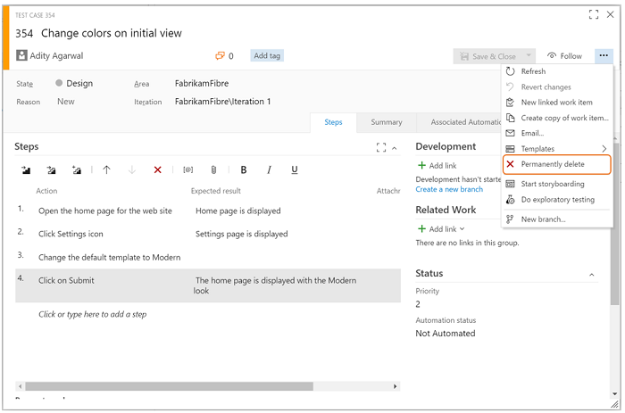
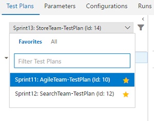

# Team Foundation Server 2017 Update 1 

> To see the latest updates, please visit the English [Release Notes](https://www.visualstudio.com/en-us/news/releasenotes/tfs2017-update1).

### Release Date: March 7, 2017

We are happy to announce the release of Team Foundation Server 2017 Update 1. This new release includes our most recent feature innovations and improvements.
You can find requirement information on the [Team Foundation Server Requirements and Compatibility](https://go.microsoft.com/fwlink/?LinkId=809018 "Team Foundation Server Requirements and Compatibility") page.

#### Download: [Team Foundation Server 2017 Update 1](http://go.microsoft.com/fwlink/?LinkId=839593 "Team Foundation Server 2017 Update 1")

To learn more about other related downloads, see the [Downloads](https://www.visualstudio.com/downloads "Downloads") page.

#### What's New in TFS 2017 Update 1
* [More Personal Experiences](#personal)
* [Version Control Improvements](#vc)
* [Work Item Tracking Improvements](#wit)
* [Build Improvements](#build)
* [Payment Required for Package Management](#packagepayment)
* [Package Improvements](#package)
* [Cross Platform Improvements](#xplat)
* [Testing Improvements](#test)
* [Release Management Improvements](#rm) 
* [Code Search Update](#search)
* [Code Insights Improvements](#insights)
* [Administration Improvements](#admin)
* [Team Room Deprecation](#teamroom)
* [Markdown no Longer Supports File Links](#markdown)
* [Announcing the Process Template Editor](#pte)

***

#### Known Issues
* [Known Issues](#knownissues)

<hr style="border:1px solid Silver">

## What's New

### <a id="personal"> </a> More personal experiences
####Personalized collection home page
With this release, it's super easy for you to access artifacts that are most important to you. The redesigned collection page *(Figure 1)* has a personalized experience that shows the Projects, Favorites, Work, and Pull Requests you care about. This makes for a great way to start your day. You can go to one place and quickly find everything you need and care about. See [Account hub pages](https://www.visualstudio.com/en-us/docs/connect/account-home-pages) for more information. 


<center>*(Figure 1) Redesigned collection page*</center>

####Your project gets an identity
There is now one place to get an overview of your project. The new project page makes it easy to view and edit the project description, view or add members, and check on the latest activity. It is even easier to get started with a new project, and leverage all the built-in DevOps functionality of TFS. 

### <a id="vc"> </a> Version Control Improvements

#### <a id="repoadmin"> </a> Repo admin permission changes
For Git repos, we’ve divided the __Administer__ permission into several more granular permissions. This gives you more flexibility to decide who can perform what actions. For instance, you may allow anyone in your account to create new repositories, but disallow them from deleting repos or adding new users to a repo. The new permissions are:
* Manage permissions: Add/remove users and permissions.
* Create: Create a new repo.
* Delete: Delete a repo.
* Rename: Rename a repo.
* Edit policies: Configure branch policies.
* Remove others’ locks: Remove branch locks set by another user.

These permissions can be applied to all repositories in a project, or to individual repositories.

#### <a id="branchpolicy"> </a> Branch policy improvements
In the __Policies__ section *(Figure 2)*, the required and optional policies are now grouped into sections. This clarifies exactly which policies are required in order to complete a PR. Required reviewers are also summarized in the required section, and will only be marked as passing when all required reviewers have approved.


<center>*(Figure 2) Policies section*</center>

If you need to bypass policies (and have the required permissions), a new experience will be shown in the __Complete__ dialog *(Figure 3)*. Any policies that are not met will be shown in a warning message, and a new explicit option to opt-in to override policies will be presented. Checking the override option will enable the __Override & Complete__ action, which will complete the PR, overriding any failing policies.


<center>*(Figure 3) Complete dialog*</center>

####Support file exclusions in the required reviewer policy
When specifying required reviewers for specific file paths, you can now exclude paths by using a “!” prefix to the path you want to exclude. For example, you can use this to exclude a docs folder from your normally required signoff *(Figure 4)*.


<center>*(Figure 4) File exclusion support*</center>

####Import repository
You can now import a Git repository from GitHub, BitBucket, GitLab, or other locations. Import into either a new, or existing empty repository. For more information, see [Import a Git repo](https://www.visualstudio.com/en-us/docs/git/import-git-repository).

####Add .gitignore during repo creation
While creating a new Git repository, you can now add and associate a .gitignore file with your repository. A .gitignore file specifies files that Git should ignore while performing a commit. 

The dialog allows you to select one of the many available .gitignore templates *(Figure 5)*. 


<center>*(Figure 5) Add .gitignore during repo creation*</center>

####Cherry-pick and revert
We’ve added two new features that make it easier to port or back out changes from the web portal: Cherry-pick and Revert. 

Use the cherry-pick command to port changes in a pull request to multiple branches. A typical use case is when a bug needs to be hotfixed, but should also be fixed in the mainline. Once you’ve created your pull request that contains the fix to the hotfix branch, you can easily cherry-pick the same fix into the master branch. See [Copy changes with cherry-pick](https://www.visualstudio.com/en-us/docs/git/tutorial/cherry-pick) for more information.

You can revert changes on completed PRs.  Find the PR that introduced the bad change, click __Revert__, and follow the steps to create a PR that backs out the unwanted changes. For more information, see [Undo Changes with Git](https://www.visualstudio.com/en-us/docs/git/tutorial/undo). 

####Configurable compare branch
You can now set your compare branch to something other than the default branch. This setting will be remembered on a per-user basis. Pull requests and new branches created from the __Branches__ page will be based off the branch you set as the compare branch. See [Manage your branches](https://www.visualstudio.com/en-us/docs/git/manage-your-branches) for more information.

####Find a file or folder
You can quickly search for a file or folder in a repository using the __Code__ hub in your Team Services project. The result lists items from your current folder followed by files and folders across the repository.

For any Git repository, go to the path control box *(Figure 6)*, and start typing to initiate a navigation search experience for the file, or folder you are looking for. 


<center>*(Figure 6) Find a file or folder*</center>

####Confirmation for deleting repos

To prevent accidental repository deletions, you now have to type the name of the repository that you wish to delete to confirm the action.

####Repo favorites
You can now favorite the repos you work with most frequently. In the repo picker *(Figure 7)*, you will see tabs for __All repositories__ and your __Favorites__. Click the star to add a repository to your list of Favorites. 


<center>*(Figure 7) Repo favorites*</center>

####Search for a file or folder in commit history
Similar to the files tab, you can now search for a file or folder in a repository and see the history of commits for that file or folder. For any Git repository, go to the path control box on the History tab *(Figure 8)*, and start typing to initiate a history search experience for the file, or folder you are looking for.


<center>*(Figure 8) Commit history*</center>

####Commit page improvements
We made your experience of the commit details page and commit history page up-to-date and highly performant. You can now find, and act on, important information related to the commit at a bird’s-eye view. 

Here is an example of the commit details page *(Figure 9)*:


<center>*(Figure 9) Commit details*</center>

Here is the commit history page *(Figure 10)*:


<center>*(Figure 10) Commit history*</center>

####Search for commits in branches
You can now search for a commit in a specified branch or a tag by clicking on the __Search in branches__ button on the commit details page *(Figure 11)*.


<center>*(Figure 11) Commit search*</center>

You can select tags and branches in the window to view, even if these branches and tags do not contain the particular commit *(Figure 12)*.


<center>*(Figure 12) Commit search dialog*</center>

#### <a id="toolbar"> </a> Discussion control toolbar
Markdown is a powerful tool when adding comments to pull requests, but it can be hard to remember the syntax. To make this easier, we’ve added a toolbar to the discussion control *(Figure 13)*. This will insert the appropriate Markdown syntax to add common formatting. Headings, boldface, italics, links, code, and lists can all be added using the new toolbar controls, and features like @ and # mentions can be entered using the toolbar as well. Keyboard shortcuts are available for boldface (CTRL + B), italics (CTRL + I), and creating links (CTRL + K).  


<center>*(Figure 13) Discussion toolbar*</center>

#### <a id="prcomment"> </a> PR comment improvements
To help you better identify the new comments in their PR, we’ve added some additional decoration to the new replies in existing discussion threads. Comments in the files view will also highlight threads that have new comments *(Figure 14)*.


<center>*(Figure 14) PR comment improvements*</center>

#### <a id="viewprs"> </a> View PRs for a commit
You can now view all associated pull requests for a commit on the __Commit details__ page. From the image below *(Figure 15)*, you can see that:

* In the associated pull request drop-down, there are two pull requests associated with this commit.
* Pull request #2 brought this commit to master.
* The same commit was brought into branch 4 via pull request #1.


<center>*(Figure 15) PR in commits*</center>

####Follow a pull request
You can now follow a pull request to stay notified of any changes via email alerts. The option to __Follow__ is available in the context menu *(Figure 16)*.


<center>*(Figure 16) Follow a pull request*</center>

####Restart pull request merge
Another option has been added to re-attempt the merge for a pull request where the target branch has been updated. This __Restart merge__ option is useful when you want to verify that recent changes to the target branch haven’t created conflicts or broken your PR build.

####Completion blocked on rejected pull requests
Branches that have the code review policy set will show that the PR is unable to be completed if it is rejected by one or more reviewers. Many of you expected this behavior, so we’ve changed the default behavior. For teams that want the original behavior, there is a new option in the branch policy setting page *(Figure 17)*.


<center>*(Figure 17) Code review policy*</center>

####Markdown in pull request description
Spice up your pull request description with Markdown. The same Markdown support you know and love in pull request comments is now available in the pull request description.

####Attachments in PR discussions
You can now add attachments to your pull request comments *(Figure 18)*. Attachments can be added by drag-and-drop or by browsing. For images, attachments can be added by simply pasting from the clipboard. Adding an attachment automatically updates the comment to include a Markdown reference to the new attachment. 


<center>*(Figure 18) Attachments in PR discussions*</center>

####Highlight the PRs that have updates
It’s now easier than ever to see the updates to your pull requests. In the PR list view *(Figure 19)*, PRs with changes since you've last seen them, are shown with a new updates column that shows a roll-up of the changes.


<center>*(Figure 19) PR updated files*</center>

When you view a PR that has changes, you’ll see a similar summary message in the overview. New pushes and comment threads are highlighted in blue *(Figure 20)*. Clicking the __View code updates__ link will navigate to the __Files__ view, where a diff of the new changes since you last viewed the pull request is shown. This feature makes it easy to follow up on a PR where the author made changes in response to feedback.  


<center>*(Figure 20) PR summary*</center>

####Branch policy for PR merge strategy
We’ve added a new branch policy *(Figure 21)* that lets you define a strategy for merging pull requests for each branch. Previously, you chose the decision to either merge or squash at the time a PR was completed. If enabled, this policy will override your preferences, enforcing the requirement set by the policy.


<center>*(Figure 21) Branch policy*</center>

####Expose merge conflict information
If there are any files with conflicts in a pull request, the details about those conflicts will now be visible in the overview *(Figure 22)*. Each conflicting file will be listed, along with a short summary of the type of conflict between the source and target branches.  


<center>*(Figure 22) Merge conflicts*</center>

####Markdown preview button

When viewing a diff of a markdown file in a commit, push, or pull request, you can now easily toggle to see the resulting rendered view.

### <a id="wit"> </a> Work Item Tracking Improvements

####Improved search experience for scoped identity fields
With this release, we updated the identity picker behavior for scoped identity fields, i.e. identity fields that are configured to only allow assignment to a specific group of users. In the updated experience, the picker’s MRU list and search results will only return members of the configured group, rather than show results for all valid users for the collection.

### <a id="build"> </a> Build Improvements

####Rollback build definitions
You can roll a build definition back to a previous version. You can do this when editing a build definition by going to the __History__ tab.

####Disable the sync and checkout of sources in a build
You can optionally disable the automatic source sync and checkout for Git. This will enable you to handle the source operations in a task or script, instead of relying on the agent&rsquo;s built-in behavior. All standard source-related variables like Source.Version, Source.Branch, and Build.SourcesDirectory are set.

####Git shallow clone and git-lfs
The build agent now supports Git shallow clone and git-lfs.  For more details, see the [Build definition repository page](https://www.visualstudio.com/en-us/docs/build/define/repository).

####Task versioning for Build and Release definitions
We’ve given you control over the major version of a task that you run in your build or release. This change will result in fewer unpredictable errors that were caused by automatic updates to the agent and task version. You now specify the major version of the task on the __Build__ tab of your definition, or on the __Environments__ tab of your release definition. 

When a minor version is released (for example, 1.2 to 1.3), you get that change automatically in your build. But if a new major version is released (for example 2.0), then your build stays locked to version 1.3 until you edit the definition and manually change to the new major version. A flag in the build definition alerts you to new major versions.

### <a id="packagepayment"> </a> Payment required for Package Management
To continue using Package Management, you will either need a Visual Studio Enterprise subscription or a Package Management license purchased in the [Marketplace](https://marketplace.visualstudio.com/items?itemName=ms.feed). You can read more about [licensing Package Management](https://www.visualstudio.com/en-us/docs/package/install).

### <a id="package"> </a> Package Improvements

####Release views in Package Management
We've added a new feature to Package Management called __release views__ *(Figure 23)*. Release views represent a subset of package-versions in your feed that you've promoted into that release view. Creating a release view and sharing it with your package's consumers enables you to control which versions they take a dependency on. This is particularly useful in continuous integration scenarios where you're frequently publishing updated package versions, but may not want to announce or support each published version.

Look for the quick start in Web Access or [learn about release views for package CI/CD](https://www.visualstudio.com/en-us/docs/package/feeds/about-release-views) to get started.


<center>*(Figure 23) Release views*</center>

####npm in Package Management
Package Management feeds now support npm packages for Node.js and JavaScript development. In addition, npm feeds support npmjs.com as an "upstream source with caching." By enabling this option, your feed will transparently proxy and cache packages from npmjs.com (see [Use packages from npmjs.com](https://www.visualstudio.com/en-us/docs/package/npm/upstream-sources)), which means that you'll only need to get a particular package@version from npmjs.com once; future requests for that package will be served directly from your TFS server. If a package is removed from npmjs.com, you'll still be able to get the cached version from TFS.

To get started, look for the new npm option in the __Connect to feed__ dialog *(Figure 24)*. 


<center>*(Figure 24) npm in Package Management*</center>

### <a id="xplat"> </a> Cross Platform Improvements

####Xcode Build task xcpretty formatting
You can now format your xcode build output with [xcpretty](https://github.com/supermarin/xcpretty) *(Figure 25)*. You can also publish JUnit test results to Team Services with xcodebuild. Previously, [xctool](https://github.com/facebook/xctool) had to be used as the build tool to publish test results. Now, to enable xcpretty, check **Use xcpretty** and uncheck **Use xctool** in the **Advanced** section of the Xcode task.


<center>*(Figure 25) Xcpretty formatting*</center>

####Publish Jenkins test and code coverage results 

The **Jenkins Queue Job** build and release task can now retrieve test and code coverage results from a Jenkins job or pipeline. This requires installation of the TFS Plugin for Jenkins 5.2.0 or later on your Jenkins server and configuring the post-build action **Collect Results for TFS/Team Services**. After results are retrieved from Jenkins, they can be published with the **Publish Test Results** or **Publish Code Coverage** build tasks.

####Xcode 8 signing and exporting packages in the Xcode Build Task
The Xcode task now supports building your projects using Xcode 8 automatic signing *(Figure 26)*. You can install the certs and provisioning profiles on the build server manually, or have the task install them by specifying the __File Contents__ options.


<center>*(Figure 26) Xcode automatic signing*</center>

Xcode 8 requires specifying an export options plist *(Figure 27)* when exporting an app package (IPA) from an archive (.xcarchive). The Xcode task now automatically identifies the export method if you are using Xcode 8 or Xcode 7. You can specify the export method or specify a custom plist file from the Xcode task. If you are using an Xcode version older than Xcode 7, the task falls back to using the old tool (xcrun) for creating the app package.


<center>*(Figure 27) Xcode export options*</center>

### <a id="test"> </a> Test Improvements

#### <a id="runtestsfromvs"> </a> Run tests built using Visual Studio 2017
Using the __Deploy Test Agent__ and __Run Functional Tests__ tasks in CI/CD pipeline *(Figure 28)*, you can now install Test Agents for Visual Studio 2017 and run tests that were built using Visual Studio 2017. 


<center>*(Figure 28) Run tests*</center>

####Verify bugs from work item

You can now verify a bug by re-running the tests which identified the bug *(Figure 29)*. You can invoke the **Verify** option from the bug work item form context menu to launch the relevant test case in the web runner. Perform your validation using the web runner, and update the bug work item directly within the web runner.


<center>*(Figure 29) Verify bugs from work item*</center>

####REST client helpers for Test Step operations
You will now be able to create, modify, and delete test steps and test step attachments in Test Case work items using the helper classes we have added to the REST client  (see the [RestApi-Sample](https://github.com/pankagar/RESTApi-Sample)).

####Update existing bugs from Web Runner
In addition to creating new bugs from the Web runner, now you can also update an existing bug *(Figure 30)*.  All the diagnostic data collected, repro steps, and links for traceability from the current session are automatically added to the existing bug.


<center>*(Figure 30) Update existing bug*</center>

####Test case description in Web Runner
The test case description field was often used for capturing the prerequisites required before the test case execution can start. With this update, you are now be able to view the test case description information in the Web runner by using the __Show description__ option *(Figure 31)*.


<center>*(Figure 31) Test case description*</center>

####Test hub contribution point
We have added a new contribution point (“ms.vss-test-web.test-plan-pivot-tabs”) *(Figure 32)* within the __Test plan__ hub to allow developers to write extensions as a pivot tab that appears next to the __Tests__ and __Charts__ tab.


<center>*(Figure 32) Contribution point*</center>

####Delete test artifacts
Prior to this release, your delete option was limited to work items. With this update, you now have the ability to permanently delete test artifacts—test plans, test suites, test cases, shared parameters, and shared steps—both from the __Test__ hub and the __Work__ hub, by using the __Permanently delete__ *(Figure 33)* option in the work item form context menu.


<center>*(Figure 33) Delete test artifacts*</center>

####Favorites for Test Plans
You can now favorite the Test Plans you work with most frequently. In the __Test Plans__  picker, you will see tabs for __All__ your Test Plans and __Favorites__ *(Figure 34)*. Click the star icon to add a Test Plan to your list of favorites. The favorited Test Plans are accessible in the Test Plans picker and from the __Favorites__ tab in the new account home page. You can also filter Test Plans by searching on the title field *(Figure 35)*. 


<center>*(Figure 34) Test plans*</center>


<center>*(Figure 35) Test favorites*</center>

####Test Impact Analysis for managed automated tests
Test Impact Analysis for managed automated tests is now available via a checkbox in the __2.* preview__ version of the VSTest task *(Figure 36)*.


<center>*(Figure 36) Test impact analysis*</center>

If enabled, only the relevant set of managed automated tests needed to validate a given code change, will run. Test Impact Analysis requires the latest version of Visual Studio, and is presently supported in CI for managed automated tests.

####Firefox support for Test & Feedback extension
We are happy to announce the General Availability of the Test &amp; Feedback extension for Firefox. You can download the Firefox add-on from our [marketplace](https://marketplace.visualstudio.com/items?itemName=ms.vss-exploratorytesting-web) site. 

__Note:__ Support for the Edge browser is also in the works; stay tuned for more updates.

### <a id="rm"> </a> Release Management Improvements

#### <a id="variablegroups"> </a> Variable groups support in Release
Variable groups are used to group your variables and their values to make them available across multiple release definitions. You can also manage security for variable groups and chose who can view, edit, and consume the variables from the variable groups in your release definitions.

Open the __Library__ tab in the __Build & Release__ hub and choose __+ Variable group__ in the toolbar *(Figure 37)*. Currently, variable groups can be consumed only in release definitions. Find more information about variable groups, [Release definitions in Microsoft Release Management](https://www.visualstudio.com/en-us/docs/release/author-release-definition/more-release-definition#var-groups).

Create *(Figure 37)*, then edit *(Figure 38)* a variable group, as shown below:


<center>*(Figure 37) Create variable group*</center>


<center>*(Figure 38) Edit variable group*</center>

####Multiple schedules in releases
Want to schedule your releases to be created more than once a day? You can now configure multiple scheduled triggers in a release definition *(Figure 39)*.


<center>*(Figure 39) Release schedule*</center>

####Inline service connections in Build and Release
With this feature, you can create service connections right in the build/release definition without navigating to the __Services__ tab. This will be auto-enabled for all extensions which are defined declaratively, such as Docker, Jenkins, VMWare, and SCVMM. 

####Link build artifacts from another team project
Until now, release definitions could only link artifact sources from the current project. Now, you can link build artifacts *(Figure 40)* from another project as well. While linking an artifact, the project drop down will list all the projects in the account.


<center>*(Figure 40) Link build artifacts*</center>

####Azure resource group improvements
Prior to this release, the Azure resource group task could not validate the ARM template syntax, or it would be accepted without actually deploying the resources. This enhancement allows a new deployment mode called __Validation Only__, where you can find problems with the template authoring before creating actual Azure resources.

Another enhancement to the Azure resource group task is to allow either incremental, or complete deployments *(Figure 41)*. Previously, the task deployed the ARM templates using the Incremental mode. However, it did not modify resources that existed in the resource group not specified in the template. Complete mode deletes resources that are not in your template. The default is incremental mode.


<center>*(Figure 41) Azure resource groups*</center>

####Azure CLI task
The new Azure CLI task *(Figure 42)* supports running Azure CLI commands on cross platform agents like Windows, Linux, and Mac. The task supports both Classic and ARM subscriptions. It supports two modes of providing the script, one as a linked artifact and another as an inline script.


<center>*(Figure 42) Azure CLI task*</center>

### <a id="search"> </a> Code Search Update
In TFS 2017 Update 1, the Code Search service includes Elasticsearch version 2.4.1. If the Code Search service is configured on a server running TFS 2017, the Code Search service will be updated as part of the TFS upgrade. If the Code Search service is configured on a remote server, then copy the content of the __Search Service Package__ provided with the installer to the remote machine and follow the instructions in the readme file to upgrade the search service manually.

### <a id="insights"> </a> Code Insights Improvements

####SonarQube MSBuild tasks
SonarQube MSBuild tasks are now available from an extension provided by SonarSource. For more details, please read [SonarSource have announced their own SonarQube Team Services / TFS integration](https://blogs.msdn.microsoft.com/visualstudioalm/2016/12/13/sonarsource-have-announced-their-own-sonarqube-team-services-tfs-integration/).

### <a id="admin"> </a> Administration Improvements

####New notification settings experience
Notifications help you and your teams stay informed about activity in your Team Services projects. With this update, it’s now easier to manage what notifications you and your teams receive. 

You now have your own account-level experience in the profile menu for managing your notifications setting *(Figure 43)*.


<center>*(Figure 43) Notification settings*</center>

This view lets you manage personal subscriptions you create *(Figure 44)*. It also shows subscriptions created by team administrators for all projects in the account.


<center>*(Figure 44) Manage personal subscriptions*</center>

Learn more about [managing personal notification settings](https://aka.ms/vstsmanagenotifications).

####addProjectReports is now in TfsConfig
You can now use the command addProjectReports to add reports to your team projects. This was a previous Power Tool command and is now part of the TfsConfig.exe command. For more information, see [Upload reports to a team project](https://www.visualstudio.com/en-us/docs/report/admin/upload-reports).

### <a id="teamroom"> </a> Team Room Deprecation
With so many good solutions available that integrate well with TFS and Team Services, such as [Slack](https://slack.com/) and [Microsoft Teams](https://products.office.com/en-US/microsoft-teams/group-chat-software), we made a decision to deprecate our Team Room feature from both TFS and Team Services. If you are working in Team Services, you will see a new yellow banner appear that communicates our plan. Later this year, we plan to turn off the Team Room feature completely.  

There are several alternatives you can use. The Team room is used both for a notification hub as well as for chat. TFS and Team Services already integrate with many other collaboration products including [Microsoft Teams](https://products.office.com/en-US/microsoft-teams/group-chat-software), [Slack](https://slack.com/), [HipChat](https://www.hipchat.com/), [Campfire](https://campfirenow.com/), and [Flowdock](https://www.flowdock.com/). You can also use [Zapier](https://zapier.com/) to create your own integrations, or get very granular control over the notifications that show up.

See more about the [deprecation of Team Rooms in Team Services](https://blogs.msdn.microsoft.com/visualstudioalm/2017/01/04/deprecation-of-the-team-rooms-in-team-services-and-tfs/).

### <a id="markdown"> </a> Markdown no longer supports file links
With Update 1, welcome pages, the markdown widget on team dashboards, and the Definition of Done on the Kanban boards will no longer support file links in their Markdown. As a workaround, you can include your file link as text in the Markdown. For more information, see [Markdown guidance](https://www.visualstudio.com/en-us/docs/reference/markdown-guidance).

### <a id="pte"> </a> Announcing the Process Template Editor
We have released the [Process Template Editor](https://marketplace.visualstudio.com/items?itemName=KarthikBalasubramanianMSFT.TFSProcessTemplateEditor) extension for Visual Studio 2017. This extension provides a convenient method for viewing and updating process templates, as well as tools for updating global lists and work item types, and viewing the attributes of work item fields. This works against TFS 2017 and TFS 2017 Update 1 servers.

****

## <a id="knownissues"> </a>Known Issues

#### Build doesn't work when upgrading to TFS 2017 Update 1 build 15.112.26301.0 from TFS 2013 or earlier
* #### Issue:
  Note that this issue only occurs if you upgraded to TFS 2017 Update 1 build 15.112.26301.0, released on 7 March, 2017. If you upgraded to build 15.112.26307.0, released on 9 March, you will not encounter this.
  
  After upgrading from TFS 2013 (RTM or any update) or earlier, Build shows an error of "counter with name TaskReferenceId does not exist".

* #### Workaround:
  Run the following script on your upgraded collection databases:
  
  ```
INSERT  tbl_Counter (PartitionId, DataspaceId, CounterName, CounterValue)
SELECT  DISTINCT
            dpm.PartitionId,
            ds.DataspaceId,
            N'TaskReferenceId',
            1
    FROM    tbl_DatabasePartitionMap dpm
    INNER LOOP JOIN Task.tbl_Hub h
    ON      h.PartitionId = dpm.PartitionId
    INNER LOOP JOIN tbl_Dataspace ds
    ON      ds.PartitionId = dpm.PartitionId
            AND ds.DataspaceCategory = h.DataspaceCategory
            AND ds.DataspaceIdentifier <> '00000000-0000-0000-0000-000000000000'
    WHERE   dpm.PartitionId > 0
            AND dpm.HostType = 4
            AND NOT EXISTS (
                SELECT  *
                FROM    tbl_Counter c
                WHERE   c.PartitionId = dpm.PartitionId
                        AND c.DataspaceId = ds.DataspaceId
                        AND c.CounterName = N'TaskReferenceId'
            ) 
   ```
   
#### Customers should update to Git LFS version 1.3.1 or higher
* #### Issue:
  Git LFS versions before 1.3.1 are no longer supported.

* #### Workaround:
  If you are using Git LFS, you must update to Git LFS version 1.3.1 or higher. Older versions of the LFS client are not compatible with authentication changes in this version of TFS.
  
#### Work item forms do not render correctly
* #### Issue:
  If you use a legacy custom control in your work item forms, such as the legacy multi-value control, your work item forms may fail to render.    

* #### Workaround:
  You will need to update to the latest version of your control.  You can find the latest multi-value control for TFS 2017 Update 1 [here](https://witcustomcontrols.codeplex.com/).

#### Work item forms do not render correctly in the web
* #### Issue:
  If you have a custom control, such as the multi-value control, installed for the Visual Studio client but not the web client, work item forms in the web fail to render.    

* #### Workaround:
  You can add a web layout that doesn’t contain the missing control element. You can have different layout targeting visual studio and web. For more info on the layout https://www.visualstudio.com/en-us/docs/work/reference/all-form-xml-elements-reference#attributes-that-are-used-to-format-form-elements.

#### Work item forms do not hide read only fields
* #### Issue:
  If you use old workitem form with __HideReadonlyEmptyFields__ property set to true in the layout, your form will fail to hide read only and empty fields.    

* #### Workaround:
  There is no workaround at this time. This will be fixed in TFS 2017 Update 2.

#### Work item forms become dirty on viewing
* #### Issue:
  This issue is specific to IE 11 on TFS 2017 Update 1 when opting into the new work item form. If you have your profile set to French, Korean, Russian, Turkish, Japanese, or Chinese, and the work item is assigned to any identity, you will see the work item form as dirty when viewing the work item. If you save the work item, the Assigned To field will be set to unassigned.

* #### Workaround:
  Use another browser besides IE11. If you are using IE11, click undo/refresh from the work item toolbar to restore the correct Assigned To value.

####Caching of upstream NPM packages fail
* #### Issue:
  If your TFS server is behind a proxy, the caching of upstream NPM packages will fail.

* #### Workaround:
  If your TFS server is behind a corporate proxy, make the following changes to your TFS server web.config (i.e. %ProgramFiles%\Microsoft Team Foundation Server 15.0\Application Tier\Web Services\web.config).

  Replace this configuration block:
  ```
    <!-- ASP.NET Proxy Usage for HttpWebRequests 
          "usesystemdefault" 
             false - stops the server using the default proxy configuration or proxy
                   auto-detection. 
          "bypassonlocal"
             true - this tells all requests to a local address to ignore configured proxies.
      -->
    <defaultProxy>
      <proxy usesystemdefault="False" bypassonlocal="True" />
    </defaultProxy>
  ```
  With this:
  ```
    <defaultProxy useDefaultCredentials="true" />
  ```


#### Code dropdown menu shows incorrect Version Control pages
* #### Issue: 
  If you navigate to the admin page on a git repository, as shown in the image below *(Figure 45)*, and click on the __Code__ hub, they will see the __Changesets__ and __Shelvesets__ links, instead of the __History__ link.   
  

<center>*(Figure 45) Code dropdown menu*</center>
   
* #### Workaround:
  Navigate out of the git repository admin page and you will see the correct links.
  
#### Extensions are not being auto-updated
* #### Issue: 
   If you upgrade a prior version of TFS to reach TFS 2017 and are running TFS 2017 in connected mode then your extensions will not be auto-updated as they should be.
    
* #### Workaround:
   There is no workaround at this time. We have fixed the issue and the auto update behavior will reach you through TFS 2017 Update 2. If for any reason you cannot wait for Update 2 then reach us through the Support channel and we shall share the fix earlier.

#### Extensions cannot not be acquired or will not function correctly if Public URL is not set correctly
* #### Issue:
  Extension acquisition from Visual Studio Marketplace will fail.

  Already acquired extensions are likely to not function as expected.
   
* #### Workaround:
  This is fixed in TFS 2017 Update 2 and we recommend upgrading.  If you need this to work on Update 1, set the ‘Public URL’ in the TFS Server Administrator Console such that the URL is reachable from another system within your corporate environment *(Figure 46)*.


<center>*(Figure 46) Code menu*</center>


   