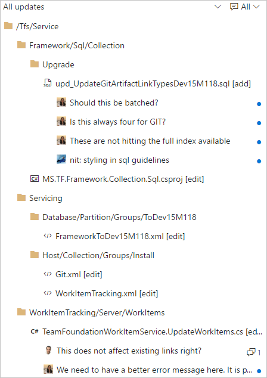
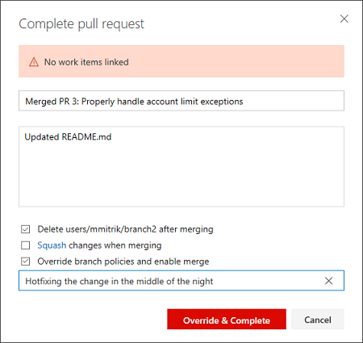
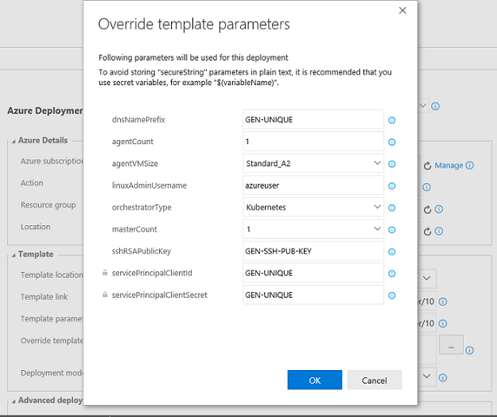

# Team Foundation Server 2017 Update 2 Release Notes

In this article, you will find information regarding the newest release for Team Foundation Server 2017 Update 2. Click the button to download.

<a href="https://go.microsoft.com/fwlink/?LinkId=850949"></a>

For other formats or languages, please see the [download site](https://www.visualstudio.com/downloads/#tfs2017-u2).

To learn more about Team Foundation Server 2017, see the [Team Foundation Server Requirements and Compatibility](https://go.microsoft.com/fwlink/?LinkId=809018 "Team Foundation Server Requirements and Compatibility") page.

***

### Feedback 
We’d love to hear from you! You can report a problem and track it through the [Developer Community](https://developercommunity.visualstudio.com/spaces/22/index.html) portal. Send us your suggestions through the [Visual Studio Team Services Product Updates](https://www.visualstudio.com/team-services/updates/) site.

***

## Release Date: July 24, 2017

## Summary of Updates in TFS 2017 Update 2

We've added a lot of new value to Team Foundation Server 2017 Update 2. Some of the highlights include:
* Work items now have [icons](#witicons) associated with each work item type.
* We have introduced [Delivery Plans](#deliveryplans).
* You can search for work items using [Work Item Search](#witsearch).
* There is a [new branch policies configuration experience](#branchux).
* There have been many [pull request improvements](#pr).
* There are now Git graphs to [visualize your Git history](#gitgraph).
* You can now add and view [Git tags](#gittags).
* We have a new [Package Management experience](#pkux).
* There is a new [build definition editor experience](#buildux).
* Various updates when deploying to [Azure Web Apps](#webapp).
* Many improvements when deploying [containers](#containers).
* We have introduced [conditional build tasks](#condition).
* There are now [out-of-the-box notifications](#notifications).

You can see the details of all the new features by viewing the improvements by feature area:
* [Work item tracking](#wit)
* [Version control](#vc)
* [Pull requests](#pr) 
* [Package Management](#pk)
* [Build and release](#build)
* [Testing](#test)
* [Warehouse](#wh)
* [Administration](#admin)
* [Microsoft Teams integration](#teams)

---

## What's New in this Release

### <a id="wit"> </a> Work Item Tracking Improvements

#### <a id="witicons"> </a> Work item type icons
We have made a global commitment to make our products fully accessible to our customers. As part of that commitment, we have been working to find and address many accessibility issues – anywhere from keyboard patterns to visual design and layout. 

Work item tracking has relied solely on color in many experiences to convey work item type. However, this is problematic for our color blind or low vision users who may not be able to distinguish between items due to similarities in color. To increase the scanability of work item type for all our customers, we have introduced icons to the visual language of work item type. You can [customize your work item types](https://go.microsoft.com/fwlink/?linkid=844968) by choosing from a selection of our icon library.

Color bars conveying type on the backlog and queries grids have been replaced with colored icons *(Figure 1)*.


<center>*(Figure 1) Colored icons in query*</center>

Cards on the board now include a type icon *(Figure 2)*.


<center>*(Figure 2) Board with icon type*</center>

#### <a id="deliveryplans"> </a> Delivery Plans
Delivery Plans is an organizational tool that helps you drive cross-team visibility and alignment by tracking work status on an iteration-based calendar. You can tailor your plan to include any team or backlog level from across projects in the account. Furthermore, __Field Criteria__ on Plans enables you to further customize your view, while __Markers__ highlight important dates. 

Check out the marketplace page for [Delivery Plans](https://marketplace.visualstudio.com/items?itemName=ms.vss-plans) to learn more and install the extension.

For users with a TFS instance that is disconnected from the Internet, Delivery Plans will be available directly from the __Manage extensions__ option in web access, without navigating to the VSTS Marketplace. From __Manage extensions__, click on __Browse local extensions__, then select __Delivery Plans__ and click __Install__. See the documentation on [pre installed extensions](https://www.visualstudio.com/en-us/docs/marketplace/get-tfs-extensions#adding-pre-installed-extensions-first-party) for more information.

#### Automatic linking from work items to builds
With this new setting in the build definition, you can track the builds that have incorporated your work without having to search through a large set of builds manually. Each successful build associated with the work item automatically appears in the development section of the work item form.

To enable this feature, toggle the setting under __Options__ in your build definition *(Figure 3)*. 


<center>*(Figure 3) WIT build linking*</center>

#### Deprecation of old work item form
Overall feedback for the new work item form has been positive and we now have 100% adoption on our hosted accounts. We want on-premises customers to tap into the same value that has delighted our VSTS users and so we have made the decision to deprecate the old work item form and old extensibility model. Read more about our plans on the [Microsoft Application Lifecycle Management](https://blogs.msdn.microsoft.com/visualstudioalm/2017/05/22/announcing-the-deprecation-of-the-old-work-item-form-in-tfs/) page.

#### <a id="witsearch"> </a> Work Item Search
Work Item Search provides fast and flexible search across all your work items over all projects in a collection *(Figure 4)*. You can use the Work Item Search full text search engine to easily search for terms across all work item fields and efficiently locate relevant work items. Use in-line search filters, on any work item field, to quickly narrow down to a list of work items.

Once the Search service is [configured](https://www.visualstudio.com/docs/search/code/administration#config-tfs) in TFS, you can [get searching](https://www.visualstudio.com/docs/search/workitem/get-started#start-search) without the need to install anything else. By using Work Item Search you can:

* __Search over all your projects:__ Search in your own and your partner teams' backlog. Use cross-project searches over all the work items to search across your organization's entire work items. Narrow your search by using project and area path filters.
* __Search across all work item fields:__ Quickly and easily find relevant work items by searching across all work item fields (including ere fields). Use a full text search across all fields to efficiently locate relevant work items. The snippet view indicates where matches were found.
* __Search in specific fields:__ Use the quick in-line search filters, on any work item field, to narrow down to a list of work items in seconds. The dropdown list of suggestions helps complete your search faster. For example, a search such as __AssignedTo:Chris WorkItemType:Bug State:Active__ finds all active bugs assigned to a user named Chris.
* __Take advantage of integration with work item tracking:__ The Work Item Search interface integrates with familiar controls in the Work hub, letting you view, edit, comment, share, and much more.


<center>*(Figure 4) Workitem search*</center>

### <a id="vc"> </a> Version Control Improvements

#### <a id="branchux"> </a> New branch policies configuration experience
We’ve redesigned the branch policies configuration experience and added some great new capabilities *(Figure 5)*. One of the most powerful features is the ability to configure policies for branch folders. You can do this from the __Branches__ view by selecting a branch folder and choosing __Branch policies__ from the context menu.  


<center>*(Figure 5) Configure branch policies*</center>

This will open the new policies configuration UX, where you can configure policies that apply to all of the branches in the branch folder *(Figure 6)*.  


<center>*(Figure 6) Policies page*</center>

If you’re using the build policy, you can now configure multiple builds for a single branch. There are also new options to specify an automatic or manual trigger *(Figure 7)*. Manual triggers are useful for things like automated test runs that might take a long time to run, and you only really need to run once before completing the pull request. The build policy also has a display name that is useful if you’re configuring multiple builds.


<center>*(Figure 7) Manual build*</center>

Once you’ve configured a manually triggered policy, you can run it by selecting the __Queue build__ option in the __Policies__ section for the pull request *(Figure 8)*.


<center>*(Figure 8) Manual build queue*</center>

For required reviewer policies *(Figure 9)*, we added the ability for administrators to specify a note that will be appended to the pull request timeline when the policy applies *(Figure 10)*.


<center>*(Figure 9) Required reviewer dialog*</center>


<center>*(Figure 10) Required reviewer note*</center>

#### New policy for no active comments
Ensure that all comments in your pull requests are being addressed with the new __Comments__ policy. With this policy enabled, active comments will block completion of the PR, forcing all comments to be resolved. Reviewers that leave comments for the PR author but optimistically approve the pull request can be sure that an author that’s eager to merge won’t miss any comments.

#### Files hub improvements
We’ve made several updates to the __Files__ hub to improve the viewing and editing experiences.

For viewing, we’ve added pivots that let you view the README in the current folder *(Figure 11)*, preview Markdown files, compare a file to a previous version *(Figure 12)*, and view blame.


<center>*(Figure 11) Files viewing*</center>


<center>*(Figure 12) Files compare*</center>

For editing, you can now preview your changes, easily add a comment, commit to a new branch, and link work items *(Figure 13)*.


<center>*(Figure 13) Files editing*</center>

#### <a id="gitgraph"> </a>Visualize your git repository
You can now see a graph while showing commit history for repositories or files. This allows you to easily create a mental model of all your branches and commits for your git repositories using git graph *(Figure 14)*. The graph shows all your commits in topological order. 


<center>*(Figure 14) Git graph*</center>

The key elements of the git graph include *(Figure 15)*:
1. the git graph is right-aligned, so commits associated with the default branch or the selected branch appear on the right while the rest of the graph grows on the left.
2. merge commits are represented by grey dots connected to their first parent and second parent. 
3. normal commits are represented by blue dots.
4. if the parent commit of a commit is not visible in the view port on the next 50 commits, then we excise the commit connection. Once you click the arrow, the commit is connected to its parent commit.


<center>*(Figure 15) Git graph elements*</center>

#### <a id="gittags"> </a>View git tags on commits
If your team has been using Git tags to mark a specific point in the history of your repository, then your commits will now show the tags that you have created. You will be able view tags *(Figure 16)* for a specific commit in the __commit list__ view and the __details__ page.


<center>*(Figure 16) Show tags*</center>

#### Add tags to commits
Instead of creating tags from the command line and pushing the tags to the repository, you can now simply go to a commit and add a tag *(Figure 17)*. The tag creation dialog will also let you tag any other ref on the repo.


<center>*(Figure 17) Create tag details*</center>

The commit list view also supports a context menu *(Figure 18)*. No need to go to the __commit details__ page to create tags and create new branches *(Figure 19)*.


<center>*(Figure 18) Create tag history*</center>


<center>*(Figure 19) Tag branch*</center>

#### Updated changeset and shelveset pages
We have modernized the changeset and shelveset pages in TFVC. Both pages are made more accessible for those of you who use assistive technologies. The new pages also have a new header that contains the changeset title and associated information about the changeset, such as author details *(Figure 20)*.


<center>*(Figure 20) Changeset page*</center>

Both changeset and shelveset pages also host the a new markdown discussion control *(Figure 21)* that will allow to type comments in markdown, @mention users, associate work items using #, and easily attach files and images.


<center>*(Figure 21) Changeset discussion*</center>

#### Improved commit filtering
You can now filter the commit history results *(Figure 22)* by [advanced filtering options](https://www.git-scm.com/docs/git-log). You can filter commits by:
* full history.
* full history with simplified merges.
* first parent.
* simple history (this is the default filter setting).


<center>*(Figure 22) Improved commit filtering*</center>

#### Import repositories from TFVC to Git
You can migrate code from your TFVC repositories to Git repositories in the same account. To start migration, select __import repository__ from the repository selector drop-down *(Figure 23)*.


<center>*(Figure 23) Repository selector drop-down*</center>

Individual folders or branches can be imported to the Git repository, or the entire TFVC repository can be imported (minus the branches) *(Figure 24)*. You can also import up to 180 days of history.  


<center>*(Figure 24) Import repo complete*</center>

#### Git LFS file locking
We have added the Git LFS [file locking](https://github.com/git-lfs/git-lfs/blob/master/docs/api/locking.md) feature. This allows teams working with large, undiffable files to avoid losing work when two or more people attempt to edit the same file at once. Before anyone can begin editing the file, they take a lock, which notifies the server. When anyone else attempts to take a lock, the server rejects the request, letting the second person know that someone else is already working on that file. Please upgrade to [Git LFS 2.1](https://github.com/git-lfs/git-lfs/releases) or higher to use this feature.

#### Git commit comments use the new discussion control
Lightweight comments left on Git commits has been updated to use the new discussion control. This brings support for Markdown in those comments, and rounds out all of the code-commenting features in the web for both Git and TFVC to use the latest experience.

#### New tree view control
The Pull Request Files view, Git commit details, Git push details, TFVC Shelveset details, TFVC Changeset details, TFVC Changesets hub and Git history hub have been updated with a new tree view control *(Figure 25)*. The tree view has a few usability improvements. First, we’ve changed the view to show a condensed tree view that automatically collapses empty folder nodes, maximizing the number of files that are in view.  

The tree also shows comments in a more compact way. Files with comments show a child item for each comment thread, with the avatar indicating the user that created the thread. New comment threads and those with replies are indicated by the blue dot, and the count of replies is summarized with a count.


<center>*(Figure 25) New tree view*</center>

### <a id="pr"> </a> Pull Request Improvements

#### Improved CTAs for PR author and reviewers
For teams using branch policies, it can sometimes be hard to know exactly what action is required when you view a pull request. If the main call to action is the __Complete__ button, does that mean it’s ready to complete? Using information about the person viewing the page and the state of configured branch policies, the PR view will now present the call to action that makes the most sense for that user.

When policies are configured, but aren’t yet passing, the __Complete__ button *(Figure 26)* will now encourage the use of the __Auto-complete__ feature. It’s not likely that you’ll be able to complete the PR successfully if policies are blocking, so we offer an option that will complete the PR when those policies eventually pass.


<center>*(Figure 26)  Auto-complete feature*</center>

For reviewers, it’s more likely that you’ll want to approve a PR than complete it, so reviewers will see the __Approve__ button *(Figure 27)* highlighted as the main CTA if you haven’t approved yet.


<center>*(Figure 27)  CTA approve*</center>

Once approved, reviewers will see the __Complete__ (or __Auto-complete__) button highlighted as the CTA for those cases where a reviewer is also the person completing the PR.

#### Actionable comments
In a PR with more than a few comments, it can be hard to keep track of all of the conversations. To help you better manage comments, we’ve simplified the process of resolving items that have been addressed with a number of enhancements:
 
* In the header for every PR, you’ll now see a count of the comments that have been resolved *(Figure 28)*.


<center>*(Figure 28) PR header*</center>

* When a comment has been addressed, you can resolve it with a single click *(Figure 29)*. 


<center>*(Figure 29) Resolve button*</center>

* If you have comments to add while you’re resolving, you can reply and resolve in a single gesture *(Figure 30)*.


<center>*(Figure 30) Reply and resolve*</center>

* As comments are resolved, you’ll see the count go up until everything has been addressed *(Figure 31)*.


<center>*(Figure 31) Comment count address rate*</center>

* The filter in the Overview has been improved to enable filtering by various comment states and to show the count of comments for each filter option *(Figure 32)*.


<center>*(Figure 32) Filter improvements*</center>

#### Updates view shows rebase and force push
In the __Pull Request details__ view, the __Updates__ tab has been improved to show when a force push has occurred and if the base commit has changed *(Figure 33)*. These two features are really useful if you rebase changes in your topic branches before completing your PRs. Reviewers will now have enough info to know exactly what’s happened.


<center>*(Figure 33) Updates views*</center>

#### Pull request filtering by people
It’s now easier to find pull requests! We’ve added new filtering options to allow you to find PRs created by a specific author or assigned to a specific reviewer *(Figure 34)*. Simply select a user from the author or reviewer filter, and the list will be updated to show only the PRs that match the filter. 


<center>*(Figure 34) Filtering by people*</center>

#### Reason required when bypassing pull request policies
When you are bypassing a pull request policies, you are required to specify a reason. In the __Complete pull request__ dialog, you will see a new __Reason__ field, if they choose to bypass *(Figure 35)*.


<center>*(Figure 35) Bypass dialog*</center>

After entering the reason and completing the pull request, the message will be displayed in the __Overview__ *(Figure 36)*.


<center>*(Figure 36) Bypass message*</center>

#### Share pull requests with teams
The __Share Pull Request__ action is a handy way to notify reviewers *(Figure 37)*. In this release, we’ve added support for teams and groups, so you can notify everyone involved the pull request in a single step.


<center>*(Figure 37) Share PR with teams*</center>

#### Pull request improvements for teams
If you’re a member of multiple teams, you will now see all of the PRs assigned to those teams listed in the __My Pull Requests__ view *(Figure 38)*. This makes the __My Pull Requests__ view the one stop you need to visit to see all the PRs on your plate.


<center>*(Figure 38) PR improvements for teams*</center>

In a future release, we’ll add teams to the __Pull Requests__ hub under __Code__ to make it easier to see all of your PRs for a single project.

#### Default notifications for pull request comments
Stay up to date with the conversations happening in your PRs with the new comment notifications *(Figure 39)*. For PRs that you've created, you will automatically be notified any time a user adds a new comment thread or replies to an existing thread. When you comment on another user's PR, you'll be notified about any future replies to comment threads that you create or reply to.  


<center>*(Figure 39) Default PR notifications*</center>

These notifications are available as part of the out of the box subscriptions, and are configurable on the __Notifications__ settings page. 

### <a id="pk"> </a> Package Management Improvements

#### <a id="pkux"> </a>Updated Package Management experience
We've updated the Package Management user experience to make it faster, address common user-reported issues, and make room for upcoming package lifecycle features *(Figure 40)*. Learn more about the update on the [Updated experience](https://www.visualstudio.com/docs/package/preview/updated-experience) page.


<center>*(Figure 40) Package Management*</center>

#### Package Management adds npm READMEs and download button
You can now see the README of any npm package that includes a README.md in the package *(Figure 41)*. READMEs can help your team document and share knowledge about your packages.

You can also download any npm package using the __Download__ button in the command bar.


<center>*(Figure 41) Package Management npm README*</center>

#### NuGet Restore and NuGet Command build tasks
We’ve made major updates to the __NuGet Installer__ (now called __NuGet Restore__) task, and added a new NuGet task: __NuGet Command__. Most notably, the __NuGet Command__ and __NuGet Restore__ tasks now use nuget.exe 4.0.0 by default.

__NuGet Restore__ is now optimized for the most common scenario of restoring packages before a Visual Studio Build step. It also has better support for small projects that share a single NuGet feed: you can now pick a Team Services feed and have it added to an auto-generated NuGet.Config.

For more complex NuGet operations, the __NuGet Command__ task provides the flexibility to specify any command and set of arguments *(Figure 42)*.


<center>*(Figure 42) NuGet command*</center>

### <a id="build"> </a> Build and Release Improvements

#### <a id="buildux"> </a> New build definition editor
We’ve redesigned our build definition editor to provide a more intuitive experience, fix some pain points, and add new capabilities. We hope that you’ll find it easier to use templates, add tasks, and change settings. And now you can use process parameters to make it easier to specify the most important bits of data without having to go deep into your tasks.

#### Search for a templates
Search for the template you want and then apply it, or start with an empty process *(Figure 43)*.


<center>*(Figure 43) Build template search*</center>

#### Quickly find and add a task right where you want it
Search for the task you want to use, and then after you’ve found it, you can add it after the currently selected task on the left side, or drag and drop it where you want it to go *(Figure 44)*.


<center>*(Figure 44) Build task search*</center>

You can also drag and drop a task to move it, or drag and drop while holding the Ctrl key to copy the task.

#### Use process parameters to pass key arguments to your tasks 
You can now use process parameters *(Figure 45* to make it easier for those who use your build definition or template to specify the most important bits of data without having to go deep into your tasks.


<center>*(Figure 45) Process parameters*</center>

If you create a new build from some of the built-in templates (for example **Visual Studio** and **Maven**) you can see examples of how these work.
 
The new editor includes a few other enhancements, such as giving you quicker access to your sources settings. 

For a walkthrough of creating your first build definition using the new editor, see [CI/CD for newbies](https://www.visualstudio.com/docs/build/get-started/ci-cd-part-1).

Learn more on the [2017 user experience](https://www.visualstudio.com/docs/build/preview/2017-user-experience) page.

#### <a id="condition"> </a> Conditional build tasks
If you’re looking for more control over your build tasks, such as a task to clean things up or send a message when something goes wrong, we’re now offering four built-in choices for you to control when a task is run *(Figure 46)*.


<center>*(Figure 46) Conditional build tasks*</center>

If you are looking for more flexibility, such as a task to run only for certain branches, with certain triggers, under certain conditions, you can express your own **custom conditions**:

```
and(failed(), eq(variables['Build.Reason'], 'PullRequest'))
```


See [Specify conditions for running a task](https://www.visualstudio.com/docs/build/concepts/process/conditions) page.

#### <a id="containers"></a> Built-in tasks for building and deploying container based applications
With this release we have pulled most of the tasks in our Docker extension into the product by default, improved them, and introduced a set of new tasks and templates for making a set of container scenarios easier.
* __Docker:__ Build, push, or run Docker images, or run a Docker command. This task can be used with Docker or Azure Container registry. You can now use our built-in service principal authentication with ACR to make it even easier to use.
* __Docker-Compose:__ Build, push, or run multi-container Docker applications. This task can be used with Docker or Azure Container registry. 
* __Kubernetes:__ Deploy, configure, or update your Kubernetes cluster in Azure Container Service by running kubectl commands.
* __Service Fabric:__ Deploy containers to a Service Fabric Cluster. Service Fabric is the best choice today for running Windows Containers in the cloud. 


#### <a id="webapp"></a> Azure Web App deployment updates
We have made many enhancements for Azure Web Applications:
* Azure App Service deployment task supports Java WAR files, Node.js, Python, and PHP applications to be deployed.
* Azure App Service deployment task supports deploying to Azure Web App for Linux using containers.
* Azure portal Continuous Delivery is expanded now support Node applications.
* Azure App Service manage task is added to Start, Stop, Restart or Slot swap for an Azure App Service. It also supports installing site extensions to enable installation of the required PHP or Python version or installing IIS Manager or Application Insights.

We have also introduced CI/CD support into the latest version of the Azure CLI for configuring CI/CD.  Here is an example:

```
az appservice web source-control config --name mywebapp --resource-group mywebapp_rg --repo-url https://myaccount.visualstudio.com/myproject/_git/myrepo --cd-provider vsts --cd-app-type AspNetCore
```

#### .NET Core tasks support project files
With the current update, we are enhancing .NET core tasks to support *.csproj files in addition to project.json. You can now use Visual Studio 2017 on your build agents to build .NET core applications using csproj files.

#### SSH deployment improvements
The __Copy Files Over SSH__ build/release task now supports tildes(~) in the destination path to simplify copying files to a remote user’s home directory.  Also, a new option allows causing the build/release to fail when no files are found to copy.

The SSH build/release task now supports running scripts with Windows line endings on remote Linux or macOS machines.

#### Install an SSH key during a build or release
A new preview task, __Install SSH Key (Preview)__, installs an SSH key prior to a build or release and removes it from the agent when the build or release completes. The installed key can be used for fetching code from a Git repository or submodules, running deployment scripts, or other activities that require SSH authentication. It will be improved in the future to support passphrases and other capabilities.

#### Tasks fail if Visual Studio 2017 is specified but not present on agent
The [Visual Studio Build](https://www.visualstudio.com/docs/build/steps/build/visual-studio-build) and [MSBuild](https://www.visualstudio.com/docs/build/steps/build/msbuild) tasks enable you to select a specific version of Visual Studio. Until now, if the **Visual Studio 2017** version was not available, these tasks would automatically pick the next available version.

We’re changing this behavior. Now the build will fail if you select **Visual Studio 2017** but it is not present on the agent.

We made this change for the following reasons:

* Newer app types such as .NET Core do not compile with older build tools. They explicitly require Visual Studio 2017 or newer.

* You get more consistent and predictable results when you use the same exact version of Visual Studio.

* Whenever build tasks fall back, you may get compilation errors that are difficult to understand.

> [!TIP]
> 
> Make sure to use a queue connected with a pool that has agents with Visual Studio 2017, and no agents that have only earlier versions of Visual Studio.

#### Private agent automatic workspace cleanup
You can now configure an agent pool to periodically clean up stale working directories and repositories *(Figure 47)*. For example, the pool will delete workspaces left behind by deleted build and release definitions.


<center>*(Figure 47) Agent maintenance*</center>

Using this option should reduce the potential for your private build and release agents to run out of disk space. The maintenance is done per agent (not per machine), so if you have multiple agents on a single machine you could still run into disk space issues.

#### Build agent upgrade status
When an agent is being upgraded, it now indicates the status of the upgrade in the queue and pool management portal.

#### Selection of private agents on machines not in use
The system now uses machine name as a factor when allocating a build or a release to a private agent. As a result, the system will prefer an agent on an idle machine over an agent on a busy machine when it allocates the job.

#### iOS DevOps enhancements
The [Apple App Store extension](https://marketplace.visualstudio.com/items?itemName=ms-vsclient.app-store) now supports two-step verification (two-factor authentication) and releasing builds to external testers *(Figure 48)*.


<center>*(Figure 48) Apple App Store connection*</center>

__Install Apple Certificate (Preview)__ is a new build task that installs a P12 signing certificate on the agent for use by a subsequent Xcode or Xamarin.iOS build.

__Install Apple Profile (Preview)__ is a new build task for installing provisioning profiles on the agent for use by a subsequent Xcode or Xamarin.iOS build.

MSBuild, Xamarin.Android, and Xamarin.iOS build tasks now support building with the Visual Studio for Mac tool set.

#### Java code coverage enhancements
The __Publish Code Coverage Results__ build task reports Cobertura or JaCoCo code coverage as part of a build.  It now supports specifying wildcards and minimatch patterns in __Summary File__ and __Report Directory__ fields, allowing the files and directories to be resolved on a per-build basis for paths that change between builds.

#### Maven and SonarQube improvements
The Maven build task now allows specifying a SonarQube project for analysis results in cases where it differs from what is specified in the Maven pom.xml file.

#### Improved Jenkins integration
The __Jenkins Queue Job__ build/release task now supports running Jenkins multibranch pipeline jobs while displaying the Jenkins console output in Team Services *(Figure 49)*.  Pipeline results are published to the Team Services build summary.


<center>*(Figure 49) Improved Jenkins integration*</center>

#### <a id="vm"></a>Azure virtual machine scale set deployment
A common pattern being used for deployment is to create a full machine image for each version of the application and then deploy that. To make that easier we have a new __Build immutable machine image__ task. This task uses Packer to generate a machine image after deploying applications and all the required prerequisites. The task takes either the deployment script or the packer configuration template to create the machine image and stores it in an Azure Storage account. This image can then be used for Azure virtual machine scale set deployments that work well with this type of immutable image deployment.

#### Override template parameters in Azure resource group deployments
Currently in Azure resource group deployment tasks, users select the template.json and the parameters.json and provide the override parameter values in a text box, following a specific syntax. This experience is now enhanced so the template parameters are rendered in a grid which allows them to be edited and overridden *(Figure 50)*. You can access this feature by clicking the __...__ next to the override parameters field, which opens a dialog with the template parameters along with their default values and allowed values (if defined in the template and parameter .json files). This feature requires that CORS rules are enabled at the source. If template and parameter json files are in Azure storage blob, refer to [the Azure Storage Services documentation](https://docs.microsoft.com/rest/api/storageservices/fileservices/Cross-Origin-Resource-Sharing--CORS--Support-for-the-Azure-Storage-Services?redirectedfrom=MSDN#understanding-cors-requests) to enable CORS.


<center>*(Figure 50) Azure RG parameters*</center>

#### Multiple release triggers with branch and tag filters
Release management now supports setting up CD triggers on multiple artifact sources of type “Build”. When added, a new release is created automatically when a new artifact version is available for any of the specified artifact sources.
You can also specify the source branch that the new build should be from to trigger a release. Additionally, Tag filters can be set to further filter the builds that should trigger a release.

#### Set defaults for artifact sources in a release
Users can define the default artifact version to deploy in a release when linking an artifact source in a definition *(Figure 51)*. When a release is created automatically, the default version for all the artifact sources would be deployed. 


<center>*(Figure 51) Default artifact version*</center>

#### Separation of duties for deployment requester and approvers
Previously, environment owners could restrict release creators from approving deployments of the release to an environment. You could, however, manually start deployment of a release created by another user, and approve it yourself.

We have now filled this gap by considering the deployment creator as a separate user role for deployments. Either the release creator or deployment creator can be restricted from approving the deployments.

#### Release level approvals
You can now choose to automatically approve deployments that were automatically triggered after successful deployment to another environment *(Figure 52)*. Approving a chain of deployments (which have the same approvers) can be done at one go if you choose to not approve every deployment. 

Let’s say you have two environments Dev and Test, with the predeployment approvers set to “userA” and “userB,” with both of them required to approve the deployment. If the policy on Test is set as shown below, during deployment time it will be sufficient for userA and userB to approve only Dev. Deployment to Test will get auto-approved. If the deployment to Test is triggered manually, the approvals will be required before deployment to ensure correct approvals.


<center>*(Figure 52) Release level approvals*</center>

#### Deploy to Azure Government Cloud
Customers with Azure subscriptions in Government Clouds can now configure [Azure Resource Manager service endpoint](https://www.visualstudio.com/docs/build/concepts/library/government-cloud#gsep-azure-rm) to target national clouds.

With this, you can now use Release Management to deploy any application to Azure resources hosted in government clouds, using the same deployment tasks *(Figure 53)*.


<center>*(Figure 53) Government cloud*</center>

#### Set maximum number of parallel deployments
This feature gives you control on how multiple pending releases are deployed into a given environment *(Figure 54)*. For example, if your release pipeline performs validation of builds in a QA environment and the rate of generation of builds is faster than the rate of completion of the deployments, you may configure multiple agents and as many builds to get validated in parallel. That means each of the builds generated gets validated, and the wait time is dependent in the number of available agents.
With this feature, we let you optimize validations by enabling you to perform validation on the n most recent builds in parallel and cancel the older deployment requests.


<center>*(Figure 54) Parallel deployments*</center>

#### Timeout enhancements for the Manual Intervention task 
The __Manual Intervention__ task can now be automatically rejected or resumed after it is pending for the specified timeout or 60 days, whichever is earlier. The timeout value can be specified in the control options section of the task. 

#### Release Management parallel execution
Release Management now supports a parallel execution option for a phase *(Figure 55)*. Select this option to fan out a phase by using either Multi-configuration or Multi-agent as a phase multiplier option.


<center>*(Figure 55) Parallel execution support*</center>

Multi-configuration: Select this option to run the phase for each multi-configuration value. For example, if you wanted to deploy to two different geos at the same time, using a variable ReleasePlatform defined on the Variables tab with values "east-US, west-US" would run the phase in parallel, one with a value of "east-US" and the other "west-US”.
Multi-agent: Select this option to run the phase with one or more tasks on multiple agents in parallel.

#### Web app deployment history in Azure portal
Release management now updates the deployment logs of Azure App Service when a deployment is done by using the App Service deployment task. You can view deployment history in the Azure portal by selecting the __Continuous delivery__ option in the __App Service__ blade.

### <a id="test"> </a> Testing Improvements

#### Run tests using agent phases  
Using the __Visual Studio Test task__, you can now run automated tests using agent phases *(Figure 56)*.

We now have a unified automation agent across build, release and test. This brings in the following benefits:
1.	You can leverage an agent pool for your testing needs.
2.	Run tests in different modes using the same __Visual Studio Test task__, based on your needs&mdash;single agent&ndash;based run, multi-agent&ndash;based distributed test run or a multi-configuration run to run tests on, say, different browsers.


<center>*(Figure 56) Run tests using Agent Phases*</center>

For more information, refer to this [Microsoft Application Lifecycle Management](https://aka.ms/testingwithphases) post.

#### On-demand triggering of automated tests
The __Test__ hub now supports triggering automated test cases from test plans and test suites *(Figure 57)*. Running automated tests from the __Test__ hub will need a setup similar to the way you run tests in a scheduled fashion in release environments. You will need to setup an environment in the release definition using the __Run automated tests from test plans__ template and associate the test plan to run the automated tests. See the [documentation](https://go.microsoft.com/fwlink/?linkid=849494) for the step by step guidance on how to setup environments and run automated tests from the __Test__ hub.


<center>*(Figure 57) On-demand automated tests trigger*</center>

### <a id="wh"> </a> Warehouse Improvements

####Performance improvements in Analysis Services cube processing
We’ve made performance improvements to the __vDimWorkItemTreeOverlay__ view, which is used to create __Work Item Tree Hierarchy__ dimension based on the links. Although it depends on System.LinkTypes.Hierarchy links, we observed that the processing duration was affected by other links as well (e.g. System.LinkTypes.Related). We optimized the view to skip addition link types which limits the amount of data read. This change significantly decreases processing time for certain warehouses.

####Case-insensitive schema reconciliation
The schema of the warehouse database is created by merging fields from all the attached collection databases in the schema reconciliation process. Previously, all comparisons were case-sensitive and administrators had to make sure there is an exact match on field reference names. This led to problems where there were subtle differences in casing. With this release we make the process more tolerant to such discrepancies.

### <a id="admin"> </a> Administration Improvements

#### Combined email recipients for notifications
Recipients for the same email notification are now included together on the to: line and sent a single email. Previously, individual emails were sent to each recipient. This made it difficult to know who else received the notification and to have a conversation about the event over email. This feature applies to out-of-the-box as well as team subscriptions that are capable of targeting multiple recipients. For example, all reviewers of a pull request are now sent a single email when a change is made to the pull request.

Learn more about [combining email recipients](https://www.visualstudio.com/docs/collaborate/manage-team-notifications).

#### <a id="notifications"></a> Out-of-the-box notifications
Users and teams are now automatically notified via email when there is activity in the account directly relevant to them, such as:

* when a work item is assigned to a user.
* when a user or team is added as a reviewer to a pull request.
* when a user or team is a reviewer on a pull request that is updated.
* when another user responds to a pull request comment.
* when a build requested by a user completes.
* when an extension is installed or requested (admins only).

Users can unsubscribe from any of these subscriptions by going to __Notification__ settings under the user profile menu and then switching off the appropriate toggle(s). 

An account admin can disable one or more of these automatic subscriptions by navigating to the collection-level __Notifications__ hub under the settings gear. Any of these subscriptions can be disabled by clicking __Disable__ under the "..." action. Once a subscription is disabled, it will no longer appear for users in their personal notification settings page.

Learn more about [out-of-the-box notifications](https://www.visualstudio.com/docs/collaborate/manage-personal-notifications#out-of-the-box-notifications).

#### Extension management permissions
An admin can now grant other users and groups permission to manage extensions for the collection *(Figure 58)*. Previously only collection administrators (i.e. members of the Project Collection Administrators group) could review extension requests, install, disable, or uninstall extensions. 

To grant this permission, an administrator can navigate to the Extensions admin hub by opening the Marketplace menu, selecting Manage extensions, and then click the Security button:


<center>*(Figure 58) Extension management permissions*</center>

#### Getting notified when extensions are installed, require attention, and more
Admins, or those with the ability to manage extensions, are now automatically notified when an extension is installed, uninstalled, enabled, disabled, or requires attention. This is especially useful in larger deployments where multiple people have the responsibility of managing extensions. Admins can turn off these notifications by navigating to __Notification__ settings under the profile menu and switching off the extensions toggle.

Admins can also define custom subscriptions for extension-related events. For example, an admin can get notified whenever any extension is updated.

Users can also now turn off automatic notifications about their extension requests.

#### Allowing TFS admins to add subscribers to the advanced access level
The __Advanced__ access level will be removed from future versions of Team Foundation Server. However, until that happens, TFS admins will have the ability to add MSDN Platform and Visual Studio Test Professional subscribers to the __Advanced__ access level with Update 2.

Visual Studio Enterprise subscribers should be added to the Visual Studio Enterprise access level instead of __Advanced__. If you have purchased the Test Manager extension, please continue to manage this in the Users hub within the Team Project that you made the purchase.

### <a id="teams"> </a> Microsoft Teams Integration

Organizations using Microsoft Teams to collaborate can now see activity from their TFS projects within their team’s channels. This allows teams to stay informed about relevant work item changes, pull requests, builds, and releases and more as they are working in Microsoft Teams. For more information see our [documentation](https://go.microsoft.com/fwlink/?linkid=832347).

----

### Known Issues

#### Work item forms do not render correctly in the web

* #### Issue:
  If you have a custom control, such as the multi-value control, installed for the Visual Studio client but not the web client, work item forms in the web fail to render.    

* #### Workaround: 
  You will need to update to the latest version of your control. It is necessary to add a web layout that doesn’t contain the missing control element. You can find the latest multi-value control for TFS 2017 Update on the [Custom Controls for TFS Work Item Tracking](https://witcustomcontrols.codeplex.com/) page. For more information on the layout, see [All FORM XML elements reference (TFS 2015)]( https://www.visualstudio.com/en-us/docs/work/reference/all-form-xml-elements-reference#attributes-that-are-used-to-format-form-elements) page.

### Known Issues

#### TFS version is RC2 instead of the final release

* #### Issue:
  After downloading TFS 2017 Update 2 before August 1, 2017, and installing, you have an RC2 version.

* #### Workaround: 
  This was due to an intermittent issue in the installation links that was fixed on August 1, 2017. Please redownload TFS 2017 Update 2 and install this final release.

****

<a href="https://developercommunity.visualstudio.com/spaces/22/tfs.html?topics=tfs"></a> See customer-reported issues reported for Team Foundation Server 2017.

****

<center>[Top of Page](#top)</center>