# Team Foundation Server 2018 RC1 Release Notes

In this article, you will find information regarding the newest release for Team Foundation Server 2018 RC1. Click the button to download.

<a href="https://go.microsoft.com/fwlink/?LinkId=856344"></a>

To learn more about Team Foundation Server 2018, see the [Team Foundation Server Requirements and Compatibility](https://go.microsoft.com/fwlink/?LinkId=809018 "Team Foundation Server Requirements and Compatibility") page.

***

### Feedback 
We’d love to hear from you! You can report a problem and track it through [Developer Community](https://developercommunity.visualstudio.com/spaces/22/index.html) and get advice on [Stack Overflow](https://stackoverflow.com/questions/tagged/tfs). As always, if you have ideas on things you’d like to see us prioritize, head over to [UserVoice](https://visualstudio.uservoice.com/forums/330519-team-services) to add your idea or vote for an existing one.

***

## Release Date: August 30, 2017

## Summary: Team Server Foundation Updates in TFS 2018 RC1

We've added a lot of new value to Team Foundation Server 2018. Some of the highlights include:
* We have improved the [Project Creation Wizard and Process Template Manager](#pcw) on the web.
* We optimized the [mobile work item form](#mobilewit).
* We added support for [Git forks](#forks).
* You can view, filter, delete, and set the security of [Git tags](#tags).
* We made many improvements to [pull requests](#pr).
* You have a new improved [Wiki](#wiki) experience.
* We’ve added support for [Maven packages](#maven).
* You can [import and export build definitions](#buildimport).
* The new [Release Definition Editor](#rmeditor) has opt-in by default.
* You can deploy with [VM deployments](#vm).
* We [improved exploratory testing traceability](#xt).

##Summary: What's New in this Release
* [Work Item Tracking](#wit)
* [Version Control](#vc)
* [Package Management](#pk)
* [Build and Release](#build)
* [Testing](#test)

###Features removed with this release:
* We removed support for [XAML Builds](#xaml).
* Support for [Lab Center and automated testing flows in Microsoft Test Manager](#mtm) has been removed.
* We discontinued [TFS Extension for SharePoint](#sp).
* We removed the [Team Room](#tr) feature.

---

## Details: What's New in this Release

### <a id="wit"> </a> Work Item Tracking 

####<a id="pcw"> </a> Project Creation Wizard on the web
We have improved the experience for creating a Team Project from web access. It now includes most of the features, which are available when creating a Team Project in the Visual Studio client. The benefit of using the web interface is that you don't need a matching Visual Studio version. The difference of using Visual Studio or the web version is that the web version doesn’t provision your reports in SSRS. If you used the web version of the Team Project creation, you can run the `tfsconfig` command on the Application Tier to provision or update the SSRS reports. See details in [add project reports](https://www.visualstudio.com/en-us/docs/setup-admin/tfs/command-line/tfsconfig-cmd#addprojectreports).

####Process Template Manager on the web
With TFS 2018, you can use web access to upload your process templates. The web interface is a much easier experience because you don't have to install the correct version of Visual Studio to interact with your process templates. Visual Studio 2017 Update 4 and earlier will still show the __Process Template Manager__ dialog, although we recommend using the web interface. Visual Studio 2017 Update 5 and later will redirect you to the web automatically. 

####<a id="mobilewit"> </a> Mobile work item form
We have a full end-to-end experience that includes an optimized look and feel for work items *(Figure 1)* and provides an easy way to interact with items that are assigned to you, that you’re following, or that you have visited, or edited recently, from your phone.

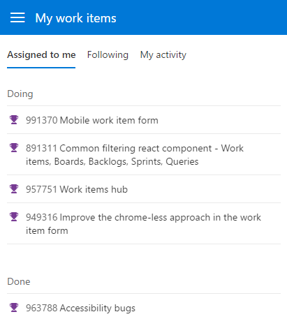
<center>*(Figure 1) Mobile work item query*</center>

Along with the good looks, this experience supports optimized controls for all field types *(Figure 2)*.

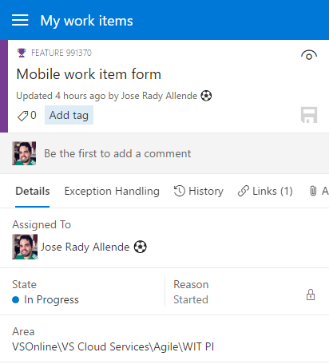
<center>*(Figure 2) Mobile work item form*</center>

With the new mobile navigation  *(Figure 3)*, users can reach any other mobile-ready parts of TFS and get back to the full desktop site in case they need to interact with other hubs. 

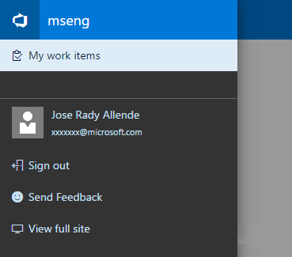
<center>*(Figure 3) Mobile navigation*</center>

####Filtering on backlogs, Kanban boards, sprints, and queries
All of our work item tracking grid experiences (queries, backlogs, Kanban boards, sprints backlogs, and test case management) now make use of our common, consistent filtering component  *(Figure 4)*. Beyond applying a keyword filter across displayed columns and selecting tags, you can also filter on work item types, states, and assigned to in order quickly to get to the work items you are looking for. 

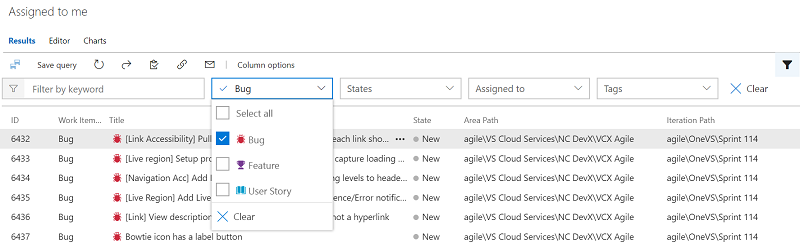
<center>*(Figure 4) Filtering on queries*</center>

####Expand to show empty fields on a Kanban card
Today, you have the option to add additional fields to a card and then __hide empty fields__  *(Figure 5)* in board settings to remove unnecessary clutter from the board. The drawback to this feature was that once an empty field was hidden, the only way to update the field was to open the work item form. With the newly available expand option on Kanban cards, you can now benefit from hiding empty fields across the board, but still have single click access to update a particular field on a card. Simply hover over the card and look for the down chevron at the bottom of the card to update the hidden field. 

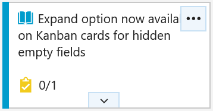
<center>*(Figure 5) Hidden field on Kanban card*</center>

Click the down chevron at the bottom of the card to update the field  *(Figure 6)*.

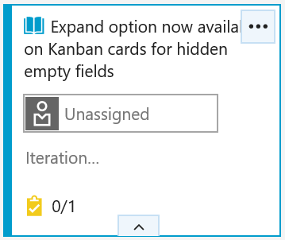
<center>*(Figure 6) Update hidden field on Kanban card*</center>

####Extensions block work item save
Work item form custom controls, groups, and pages can now [block work item save](https://www.visualstudio.com/en-us/docs/integrate/extensions/reference/client/api/tfs/workitemtracking/services/workitemformservice#seterror) to validate data and ensure the user fills out any required information before saving the work item form. 

### <a id="vc"> </a> Version Control

####<a id="forks"> </a> Forks
TFS 2018 adds support for Git forks *(Figure 7)*. A fork is a server-side copy of a repository. Using forks, you can allow a broad range of people to contribute to your repository without giving them direct commit access. Instead, they commit their work to their own fork of the repository *(Figure 7)*. This gives you the opportunity to review their changes in a pull request before accepting those changes into the central repository.

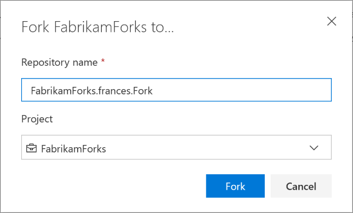
<center>*(Figure 7) Git forks*</center>

####Setting to turn off web editing for TFVC repos
Teams that use TFVC often use check-in policies in Visual Studio to ensure code quality. However, because check-in policies are enforced on the client, code that is edited on the web isn’t subjected to the same policies.

Several people have asked for a way to disable web-editing to protect against changes that bypass check-in policies. We’ve enabled a way for you to turn off web-editing (adding, deleting, renaming, and editing) for TFVC on a project/repository basis.

To disallow web-editing from the **Files** page go to __Settings__ then __Version Control__ *(Figure 8)*. Click on the TFVC repo in the tree, navigate to the Options pivot, and uncheck **Enable web-editing for this TFVC repository.**  By default, web-editing is enabled. Note: Editing the README from the __Project Overview page__ is unaffected.

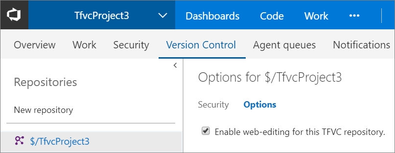
<center>*(Figure 8) Turn off web editing*</center>

If you attempt a web-edit in a project with web-editing disabled, you will be notified that web-editing is not allowed *(Figure 9)*.

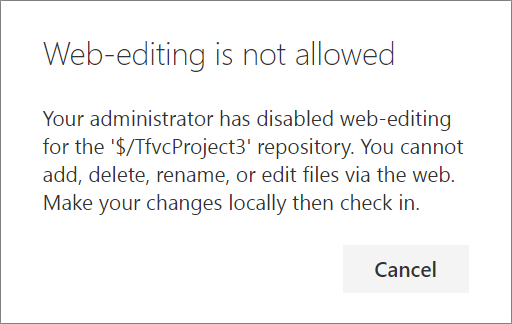
<center>*(Figure 9) Web editing not allowed dialog*</center>

This has been developed based on a [related suggestion](https://visualstudio.uservoice.com/forums/330519-team-services/suggestions/9699246-quick-code-editing-switch-or-warning).

####Identify stale branches
Keeping your repository clean by deleting branches you no longer need enables teams to find branches they care about and set favorites at the right granularity. However, if you have lots of branches in your repo, it can be hard to figure out which are inactive and can be deleted. We’ve now made it easier to identify “stale” branches (branches that point to commits older than 3 months). To see your stale branches, go to the **Stale** pivot on the **Branches** page *(Figure 10)*.

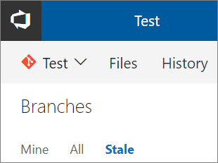
<center>*(Figure 10) Stale branches*</center>

####Search for a deleted branch and re-create it
When a branch is accidentally deleted from the server, it can be difficult to figure out what happened to it. Now you can search for a deleted branch, see who deleted it and when, and re-create it if you wish.

To search for a deleted branch, enter the full branch name into the branch search box. It will return any existing branches that match that text. You will also see an option to search for an exact match in the list of deleted branches. Click the link to search deleted branches *(Figure 11)*.

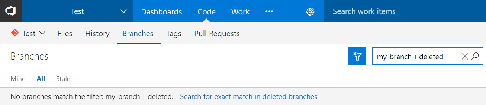
<center>*(Figure 11) Search for deleted branches*</center>

If a match is found, you will see who deleted it and when. You can also restore the branch *(Figure 12)*.

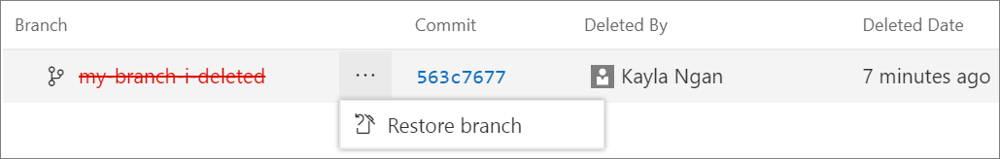
<center>*(Figure 12) Restore deleted branches*</center>

Restoring the branch will re-create it at the commit to which is last pointed. However, it will not restore policies and permissions.

####Search for a commit in branches starting with a prefix
If you have branch structure in a hierarchical format where all branches are prefixed with a text, then this feature will help you to find a commit in all the branches starting with that prefix text. For example, if you want to see whether a commit made its way to all branches that are prefixed with "dev" then simply type "dev" in the search box and select __Search in branches starting with "dev"__ *(Figure 13)*.

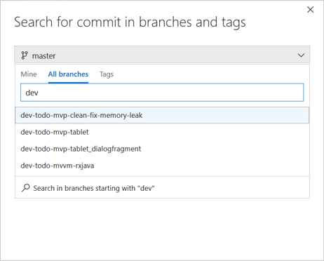
<center>*(Figure 13) Search for a commit*</center>

####Richer pull request callout on commit details page 
The pull request callout on the commit details page shows more relevant information to help you diagnose better *(Figure 14)*. Now we also show the **first pull request** that introduced the commit to any branch and the **pull request associated with the default branch** in the callout.

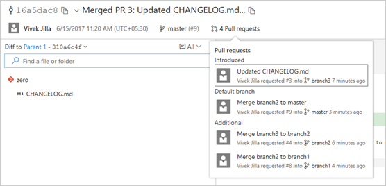
<center>*(Figure 14) Pull request callout*</center>

####Filter tree view in Code
Now you don’t need to scroll through all the files that a commit may have modified to just get to your files. The tree view on commit details, pull requests, shelveset details, and changeset details page now supports file and folder filtering. This is a smart filter that shows child files of a folder when you filter by folder name and shows a collapsed tree view of a file to show the file hierarchy when you filter by file name. 

Find a file or folder filter on commit tree *(Figure 15)* and *(Figure 16)*:

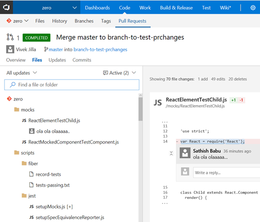
<center>*(Figure 15) Find a file or folder*</center>

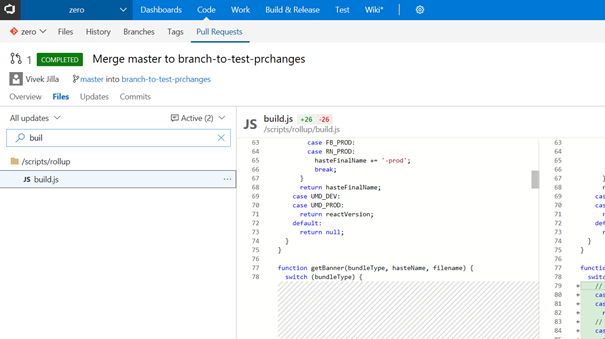
<center>*(Figure 16) Filtered view on commit tree*</center>

####Branch updates page is now Pushes
The **Branch Updates** page has tremendous value. However, it was hidden as a pivot under the **History** hub. Now the branch updates page will be visible as a hub called **Pushes** *(Figure 17)* under **Code**, alongside **Commits**, **Branches**, **Tags**, and **Pull Requests**. The new URL for the pushes page is: \<tfsserverurl\>/\<projectname\>/_git/\<reponame\>/pushes. The old URLs will continue to function.

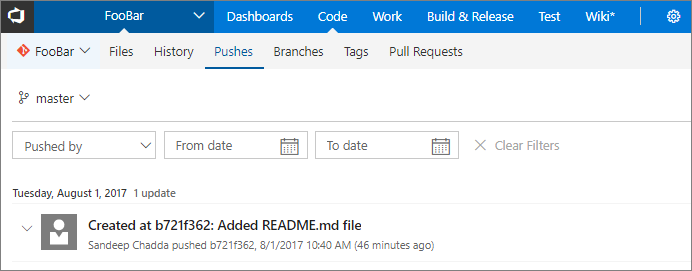
<center>*(Figure 17) Pushes page*</center>

At the same time, the **History** hub is now renamed to **Commits** *(Figure 18)* since the hub only shows commits. We received feedback that people were finding it difficult to troubleshoot commit related issues because the commit list view only showed detailed time on-hover. Now the commit list view across you instance will show date and time in dd/mm/yy hh:mm format. The new URL for commits page is: \<tfsserverurl\>/\<projectname\>/_git/\<reponame\>/commits. The old URLs will continue to function.

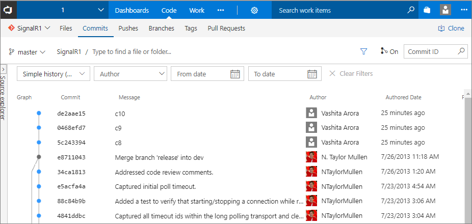
<center>*(Figure 18) Commits page*</center> 

####Retain filename when moving from Files to Commits
We heard feedback from people that when they filter the directory to a particular file in the **Files** pivot of the **Code** hub and later flip to the **History** pivot, the filename doesn’t persisted if the commit changed more than 1,000 files. This resulted in people having to load more files and filter content to find the file and was impacting productivity. Developers normally work in the same directory and want to persist to the directories they work in as they trace changes. Now, we persist the filename as you move between **Code** hub pivots regardless of the number of files changed in a commit. This means that you do not have to click on **Load More** to find the file you want.

####<a id="tags"> </a>View Git tags
You can view all the tags on your repository on the **Tags** page *(Figure 19)*. If you manage all your tags as releases, then a user can visit the tags page to get a bird’s-eye view of all the product releases. 

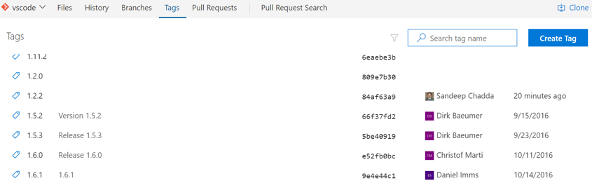
<center>*(Figure 19) View Git tags*</center>
 
You can easily differentiate between a lightweight and an annotated tag here, as annotated tags show the tagger and the creation date alongside the associated commit, while lightweight tags only show the commit information.

####Delete Git tags
There can be times when you want to delete a tag from your remote repo. It could be due to a typo in the tag name, or you you might have tagged the wrong commit. You can easily delete tags from the web UI by clicking the context menu of a tag on the __Tags__ page and selecting __Delete tag__ *(Figure 20)*. 

**Note:** Deleting tags on remote repos should be exercised with caution.

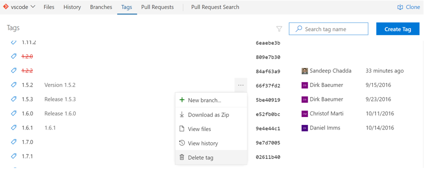
<center>*(Figure 20) Delete Git tags*</center>

####Filtering Git tags
For old repositories, the number of tags can grow significantly with time; there can also be repositories that have tags created in hierarchies, which can make finding tags difficult. 

If you are unable to find the tag that you were looking for on the tag page, then you can simply search for the tag name using the filter on top of the __Tags__ page *(Figure 21)*.

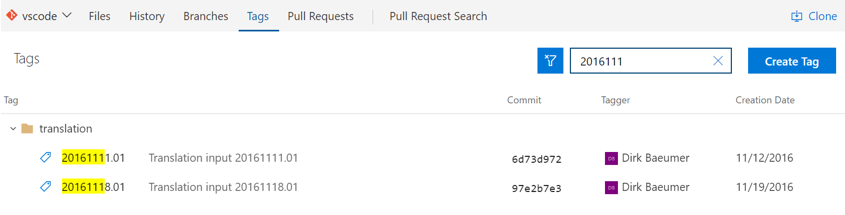
<center>*(Figure 21) Filter Git tags*</center>
 
####Git tags security
Now you can grant granular permissions to users of the repo to manage tags. You can give users the permission to delete tags or manage tags from this interface *(Figure 22)*.

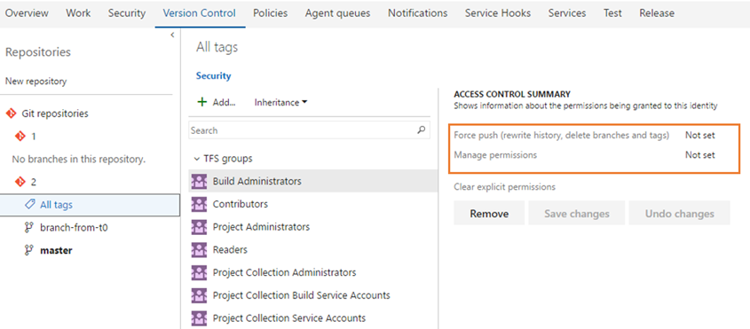
<center>*(Figure 22) Git tag security*</center>

Read more about Git tags at the [Microsoft DevOps blog](https://blogs.msdn.microsoft.com/visualstudioalm/2017/06/14/view-tags-for-git-repositories/).

####<a id="pr"> </a>Automatically complete work items when completing pull requests
If you’re linking work items to your PRs, keeping everything up to date just got simpler. Now, when you complete a PR, you’ll have the option to automatically complete the linked work items after the PR has been merged successfully *(Figure 23)*. If you’re using policies and set PRs to auto-complete, you’ll see the same option. No more remembering to revisit work items to update the state once the PR has completed. This will automatically be done for you.  

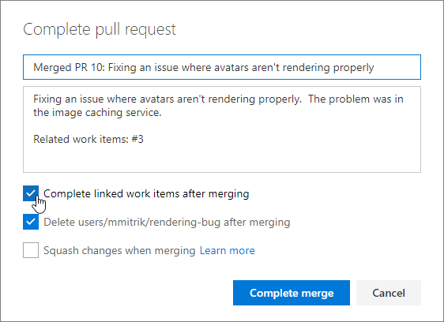
<center>*(Figure 23) Complete linked work items*</center>

####Reset votes on push/new iteration
Teams opting for a more strict approval workflow in PRs can now opt-in to reset votes when new changes are pushed *(Figure 24)*. The new setting is an option under the policy to __Require a minimum number of reviewers__.

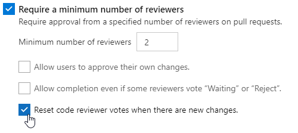
<center>*(Figure 24) Reset votes setting*</center>

When set, this option will cause all votes from all reviewers to be reset any time the source branch of the PR is updated. The PR timeline will record an entry any time the votes are reset as a result of this option*(Figure 25)*.

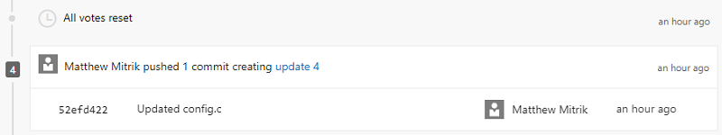
<center>*(Figure 25) Reset votes in timeline*</center>

####Filter pull request tree by file name
Finding a specific file in a pull request is easier than ever. The new filter box in the __Files__ view lets users filter down the list of files in the tree view *(Figure 26)*.  

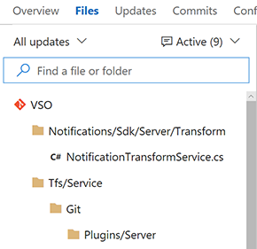
<center>*(Figure 26) Find file or folder in pull request*</center>

The filter matches any part of the path of the files in the pull request, so you can search by folder names, partial paths, file names, or extensions *(Figure 27)*.

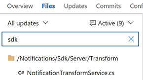
<center>*(Figure 27) Find results*</center>

####More pull request comments filtering options
Comments in both the pull request overview and the files view now have the same options *(Figure 28)*. You can also filter to see only the discussions you participated in.

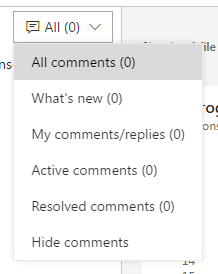
<center>*(Figure 28) PR comment filtering*</center>

####View original diff for code comments in pull request details
Sometimes, it’s hard to make sense out of a PR comment after the code it’s referencing has changed (many times, when a requested change has been made) *(Figure 29)*.  

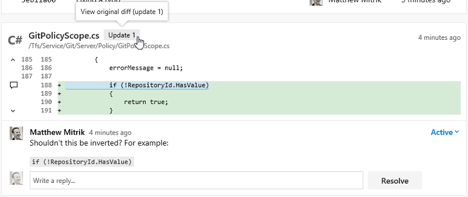
<center>*(Figure 29) View original diff*</center>

When this happens, you’ll now see a badge with an update number that you can click to see what the code looked like at the time the comment was originally created *(Figure 30)*.  

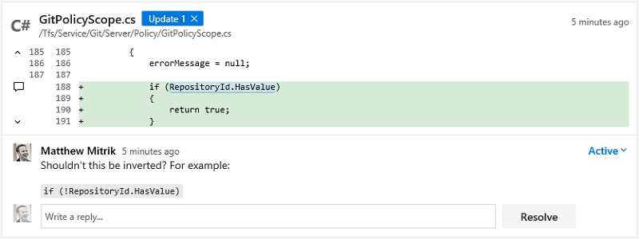
<center>*(Figure 30) Update badge*</center>

####Collapsible pull request comments
Reviewing code is a critical part of the pull request experience, so we’ve added new features to make it easier for reviewers to focus on the code. Code reviewers can easily hide comments to get them out of the way when reviewing new code for the first time *(Figure 31)*.  

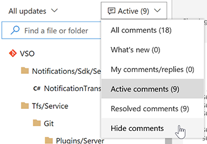
<center>*(Figure 31) Hide comments*</center>

Hiding comments *(Figure 32)* hides them from the tree view and collapses the comment threads in the file view:

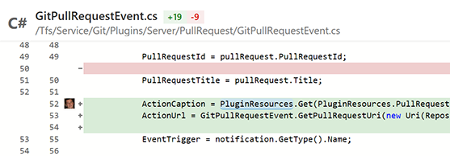
<center>*(Figure 32) Collapsed comments*</center>

When comments are collapsed, they can be expanded easily by clicking the icon in the margin, and then collapsed again with another click. Tooltips *(Figure 33)* make it easy to peek at a comment without seeing the entire thread.

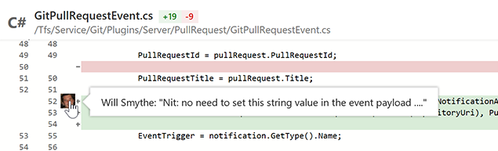
<center>*(Figure 33) Collapsed comment tooltip*</center>

####Task lists in pull request descriptions and comments
When preparing a PR or commenting you sometimes have a short list of things that you want to track but then end up editing the text or adding multiple comments. Lightweight task lists are a great way to track progress on a list of todos as either a PR creator or reviewer in the description or a single, consolidated comment. Click on the Markdown toolbar to get started or apply the format to selected text *(Figure 34)*.

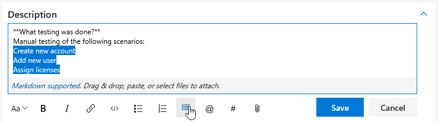
<center>*(Figure 34) Task list toolbar*</center>

Once you’ve added a task list *(Figure 35)*, you can simply check the boxes to mark items as completed. These are expressed and stored within the comment as `[ ]` and `[x]` in Markdown. See [Markdown guidance](https://www.visualstudio.com/docs/reference/markdown-guidance#checklist-or-task-list) for more information.

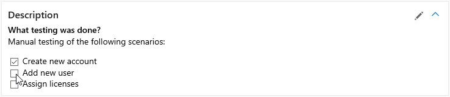
<center>*(Figure 35) Task list*</center>

####Ability to “Like” comments in pull requests
Show your support for a PR comment with a single click on the __like__ button *(Figure 36)*. You can see the list of all people that liked the comment by hovering over the button.  

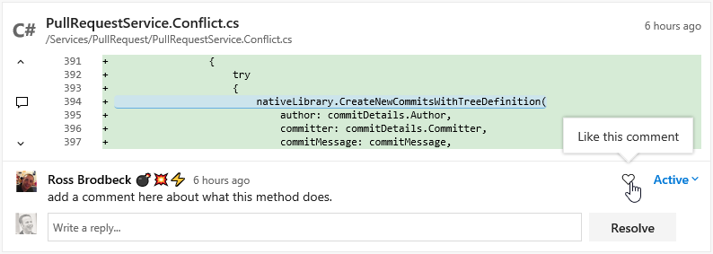
<center>*(Figure 36) Like pull request comments*</center>

####Improved workflow when approving with suggestions
Using the __auto-complete__ option *(Figure 37)* with pull requests is a great way to improve your productivity, but it shouldn’t cut short any active discussions with code reviewers. To better facilitate those discussions, the __Approve with suggestions__ vote will now prompt when a pull request is set to complete automatically. The user will have the option to cancel the auto-complete so that their feedback can be read, or keep the auto-complete set and allow the pull request to be completed automatically when all policies are fulfilled.  

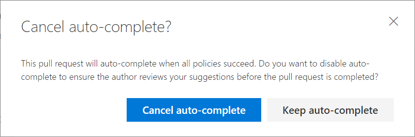
<center>*(Figure 37) Cancel auto-complete dialog*</center>

####Path filtering support for Git notifications
Instead of getting notifications for all folders in a repo, you can now choose to get notified when team members create pull requests or push code in only the folders that you care about. When creating custom Git push or Git pull requests email notification subscriptions, you will see a new option to filter these notifications by folder path *(Figure 38)*.

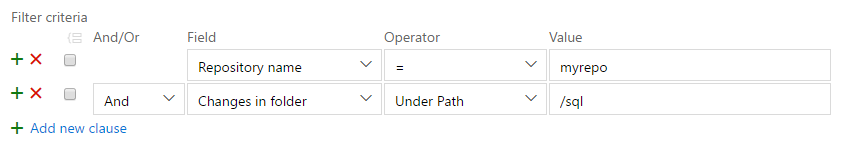
<center>*(Figure 38) Path filtering for notifications*</center>

####Great email templates for pull request workflows
Pull request email alerts have been refreshed to make them clear, concise, and actionable *(Figure 39)*. The subject line will begin with the PR title and secondary information, like the repo name, and ID will be deferred to the end.  The name of the author has been added to the subject to make it simpler to apply rules and filters based on the person that’s created the PR.  

The body of the alert emails has a refreshed template that first summarizes why the alert was sent, followed by the critical metadata (title, branch names, and description), and a main call-to-action button. Additional details like the reviewers, files, and commits are included further down the email.

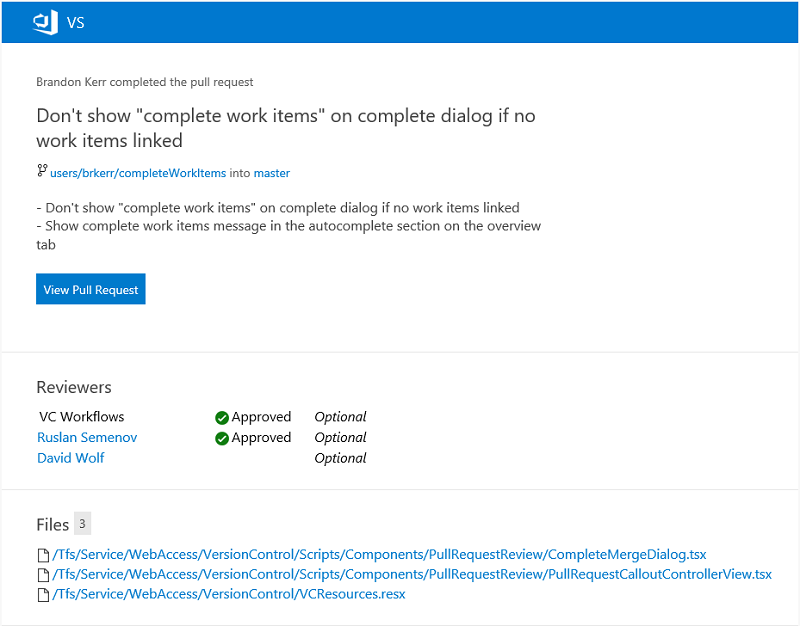
<center>*(Figure 39) Improved email template*</center>

For most alerts, the call-to-action *(Figure 40)* will be to view the pull request in the web. However, when you’re notified about a specific comment, the call-to-action will __link directly to that comment__ so you can easily find the code and prior conversation for context.  

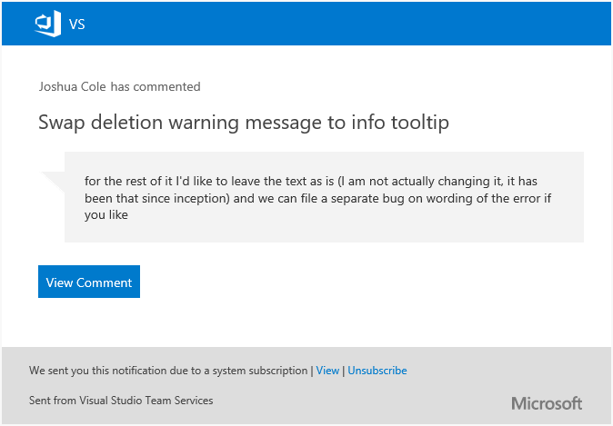
<center>*(Figure 40) Email call-to-action*</center>

####Pull Request Status Extensibility
Using branch policies can be a great way to increase the quality of your code. However, those policies have been limited to only the integrations provided natively by VSTS. Using the new PR Status API and the corresponding branch policy, 3rd party services can participate in the PR workflow just like native VSTS features.  

When a service posts to the Status API for a pull request, it will immediately appear in the __PR details__ view in a new __Status__ section *(Figure 41)*. The status section shows the description and creates a link to the URL provided by the service. Status entries also support and action menu (...) that is extensible for new actions to be added by web extensions.  

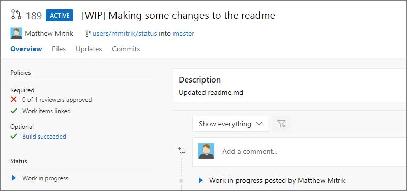
<center>*(Figure 41) PR status section*</center>

Status alone does not block completion of a PR - that’s where the policy comes in. Once PR status has been posted, a policy can then be configured. From the branch policies experience, a new policy is available to **Require approval from external services**. Select **+ Add service** to begin the process *(Figure 42)*.

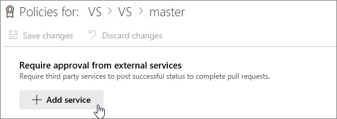
<center>*(Figure 42) PR Add new policy*</center>

In the dialog, select the service that’s posting the status from the list and select the desired policy options *(Figure 43)*.  

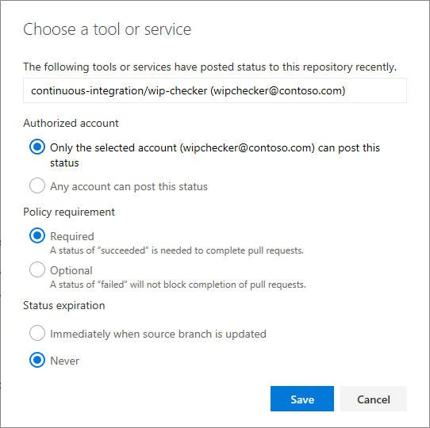
<center>*(Figure 43) PR Set status policy*</center>

Once the policy is active, the status will be shown in the __Policies__ section, under __Required__ or __Optional__ as appropriate, and the PR completion will be enforced as appropriate. 

To learn more about the status API, and to try it out for yourself, check out the [documentation](https://go.microsoft.com/fwlink/?linkid=854107) and [samples](https://go.microsoft.com/fwlink/?linkid=854108).

####<a id="wiki"> </a>Wiki
Each project now supports its own Wiki *(Figure 44)*. Now you can conveniently write pages that help your team members understand, use, and contribute to your project. 

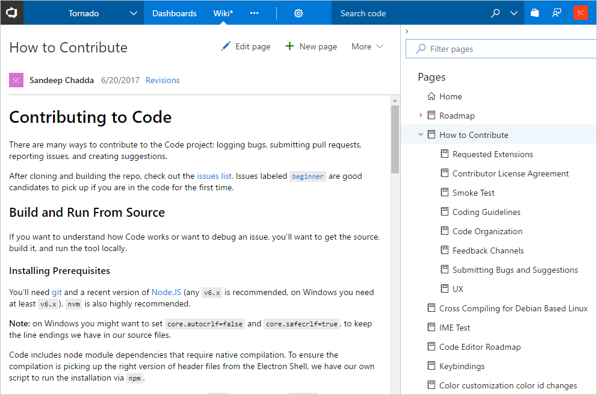
<center>*(Figure 44) PR Wiki page*</center>

Some of the key features of the new Wiki include:
- Simplified editing experience using [markdown syntax](https://www.visualstudio.com/docs/reference/markdown-guidance).
- The new page allows you to specifiy a title and add content. *(Figure 45)*
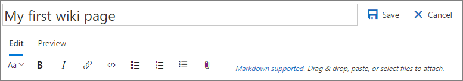
<center>*(Figure 45) PR Title wiki*</center>

- Support for HTML tags in markdown *(Figure 46)*. 

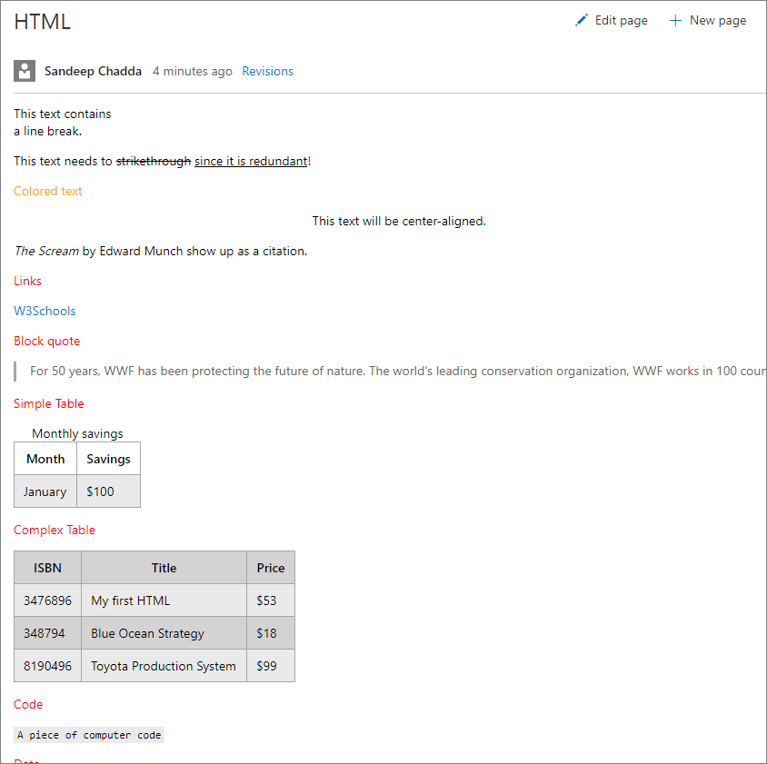
<center>*(Figure 46) PR Wiki HTML tags*</center>

- Conveniently resize images in the markdown folder *(Figure 47)*.

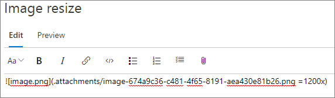
<center>*(Figure 47) PR Image resize*</center>

- Powerful page management pane that allows to reorder, re-parent, and manage pages. 
- Ability to filter pages by title for large wikis *(Figure 48)*.

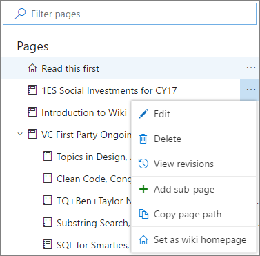
<center>*(Figure 48) PR Wiki menu*</center>

- [Offline updates](https://www.visualstudio.com/docs/collaborate/add-edit-wiki#clone-your-wiki-repo-and-edit-wiki-pages-offline) of Wiki for power users.

Learn more about [getting started with Wiki](https://www.visualstudio.com/docs/collaborate/add-edit-wiki#create-your-wiki-and-first-wiki-page). 

- As you use Wiki more, there is a chance you’ll save unintended changes. Now you can revert a revision to a Wiki page by going to the revision details and clicking on the __Revert__ button *(Figure 49)*.

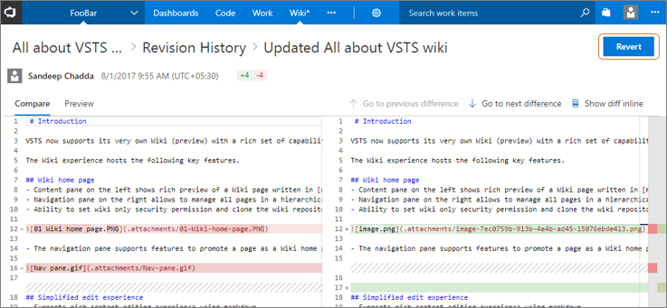
<center>*(Figure 49) PR Wiki revert button*</center>

__Create a Wiki page from a broken link__
During Wiki creation, we’ve observed a pattern that people create a table of contents on a Wiki page that includes non-existent links *(Figure 50)*. Then people would click on these links to create the actual pages. In our earlier experience, we were handling this scenario by giving a warning suggesting that the link was broken, or that the page did not exist. Now, we are handling this as a mainstream scenario for Wiki by allowing you to create pages instead.

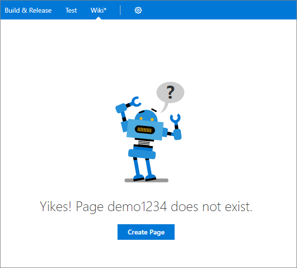
<center>*(Figure 50) PR Create wiki page*</center>

The [Wiki extension](https://marketplace.visualstudio.com/items?itemName=ms-devlabs.wiki) on the Marketplace is now deprecated. If you are an existing Wiki extension user, then you can migrate your wiki pages to the new wiki using an this [migration tool](https://github.com/Microsoft/vsts-wikiTools). Learn more to [migrate your existing wiki pages to the new Wiki](https://www.visualstudio.com/docs/collaborate/migrate-extension-wiki-pages).

### <a id="pk"> </a> Package Management 

####Package Management experience updates
Package URLs now work with the package name and version, rather than using GUIDs. This makes it easier to hand-craft package URLs *(Figure 50)*. The format is: \<tfsserverurl\>/\<project|team\>/_packaging?feed=\<feed\>&package=\<package\>&version=\<version\>&protocolType=\<NuGet|Npm|Maven\>&_a=package.

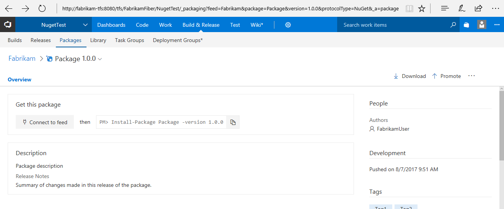
<center>*(Figure 51) PR Package URL*</center>

You can now hide deleted package versions *(Figure 52)* from all feed users (no more strikethrough packages!), in response to [this UserVoice suggestion](https://visualstudio.uservoice.com/forums/330519-team-services/suggestions/17719306-add-ui-toggle-to-hide-show-packages-that-have-been).

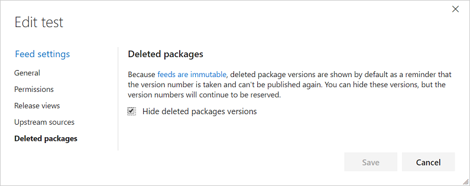
<center>*(Figure 52) Hide deleted packages*</center>

Any action that you could perform on the package details page can now be performed from the context menu in the list of packages.

The package list contains a new __Last pushed__ column *(Figure 53)* with humanized dates so you can easily find recently-updated packages. 

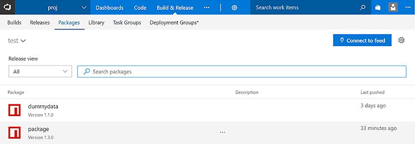
<center>*(Figure 53) Last pushed column*</center>

####<a id="maven"> </a> Maven packages
We’ve launched support for hosting Maven artifacts in TFS 2018 *(Figure 54)*! Maven artifacts enable Java developers to easily share code and components. Check out our [getting started guide](https://www.visualstudio.com/en-us/docs/package/get-started-maven) for how to share Maven artifacts using Package Management.

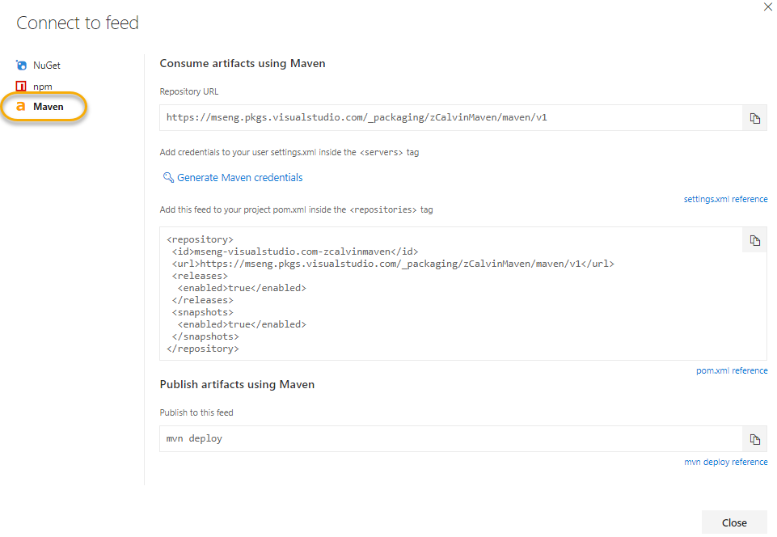
<center>*(Figure 54) Maven packages*</center>

####New unified NuGet task
We’ve combined the __NuGet Restore__, __NuGet Packager__, and __NuGet Publisher__ task into a unified __NuGet__ build task to align better with the rest of the build task library; the new task uses NuGet 4.0.0 by default. Accordingly, we’ve deprecated the old tasks, and we recommend moving to the new NuGet task as you have time. This change coincides with a wave of improvements outlined below that you’ll only be able to access by using the combined task.

As part of this work, we’ve also released a new __NuGet Tool Installer__ task that controls the version of NuGet available on the PATH and used by the new NuGet task. So, to use a newer version of NuGet, just add a __NuGet Tool Installer__ task at the beginning of your build *(Figure 55)*. 

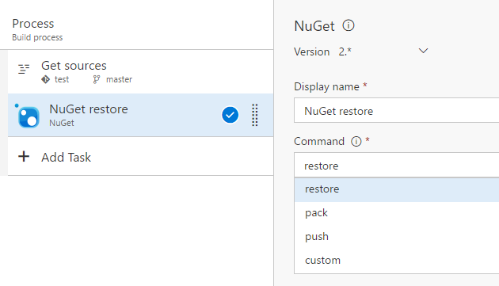
<center>*(Figure 55) NuGet task*</center>

####NuGet “Allow duplicates to be skipped” option
We heard from many NuGet customers that they generate a set of packages, only some of which may have updates (and therefore updated version numbers). The __NuGet__ build task has a new __Allow duplicates to be skipped__ option that will enable the task to continue if it tries to push packages to a VSTS/TFS feed where the version is already in use.

####npm build task updates
Whether you’re building your npm project on Windows, Linux, or Mac the new __NPM__ build task will work seamlessly. We have also reorganized the task to make both __npm install__ and __npm publish__ easier. For __install__ and __publish__, we have simplified credential acquisition so that credentials for registries listed in your project’s .npmrc file can be safely stored in a [service endpoint](https://www.visualstudio.com/en-us/docs/build/concepts/library/service-endpoints). Alternatively, if you’re using a VSTS/TFS feed, we have a picker that will let you select a feed, and then we will generate a .npmrc with requisite credentials that are used by the build agent.

####Maven now supports authenticated feeds
Unlike __NuGet__ and __npm__, the __Maven__ build task did not previously work with authenticated feeds. We’ve updated the __Maven__ task so you can work easily with VSTS/TFS feeds *(Figure 56)*.

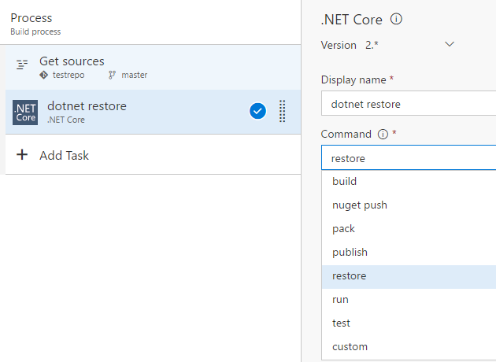
<center>*(Figure 56) dotnet task*</center>

####dotnet task supports authenticated feeds, web projects
The next major version of the __dotnet__ task (2.x) addresses many of your feedback requests and fixes a set of bugs we’ve tracked for a while.
1. First, __dotnet__ now supports authenticated package sources like Package Management, so you don’t need to use the __NuGet__ task anymore to restore packages from private package sources.
2. The behavior of __Path to project(s)__ field has changed in the 2.0 version of the task. In previous versions of the task, if the project file(s) matching the specified pattern were not found, the task used to log a warning and then succeed. In such scenarios it can sometimes be challenging to understand why the build succeeded but dependencies were not restored. Now the task will fail if the project file(s) matching the specified pattern are not found. This is in line with the behavior of other tasks and is easy to understand and use.
3. In previous versions of the task’s publish command, the task modified the output path by putting all the files in a folder that was named after the project file name, even when you passed an explicit output path. This makes it hard to chain commands together. Now you have control over the output path file.

We’ve also released a new **dotnet Tool Installer** task that controls the version of dotnet available on the PATH and used by the new dotnet task. So, to use a newer version of __dotnet__, just add a __dotnet Tool Installer__ task at the beginning of your build. 

####Working outside your account/collection
It’s now easier to work with feeds outside your TFS server or VSTS account, whether they’re __Package Management__ feeds in another VSTS account or TFS server or non-Package Management feeds like NuGet.org/npmjs.com, Artifactory, or MyGet *(Figure 57)*. Dedicated __Service Endpoint__ types for NuGet and npm make it easy to enter the correct credentials and enable the build tasks to work seamlessly across package download and package push operations.

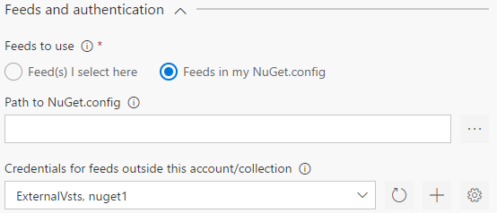
<center>*(Figure 57) Feed to use*</center>

####Feed picker for VSTS/TFS feeds
We always recommend checking in a configuration file (e.g. NuGet.Config, .npmrc, etc.) so that your source repository has a record of where your packages came from. However, we’ve heard a set of scenarios where this isn’t ideal, so we’ve added a new __Use packages from this VSTS/TFS feed__ option that allows you to select a feed and automatically generate a configuration file that will be used for that build step *(Figure 58)*.

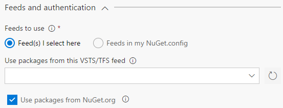
<center>*(Figure 58) Feed picker*</center>

### <a id="build"> </a> Build and Release

#### <a id="xaml"> </a> Removing support for XAML Builds
In TFS 2015, we introduced a web-based, cross-platform build system. In TFS 2018, that is the only model we support. XAML builds are not supported in TFS 2018. We encourage you to [migrate your XAML builds](https://www.visualstudio.com/en-us/docs/build/actions/migrate-from-xaml-builds). If you're not yet ready to migrate and need to continue using XAML builds, then you should not upgrade to TFS 2018.

When you upgrade to TFS 2018:

* If you have any XAML build data in your team project collection, you'll get a warning about the removal of XAML build features.

* In TFS 2018, you'll be able to view completed XAML builds, but you won't be able to queue new ones.

* There's no new version of the XAML build controller or agent in TFS 2018, and you can't configure an older version of the XAML build controller or agent to work with TFS 2018.

For an explanation of our XAML build deprecation plan, see [this blog post](https://blogs.msdn.microsoft.com/bharry/2017/05/30/evolving-tfsteam-services-build-automation-capabilities). 

#### <a id="buildimport"> </a>Export and import build definitions

Build definitions are implemented internally as .json files, so you can see details on changes in the file’s history. You can already clone and make templates from your build definitions, but many users have wanted to take a copy of their CI build logic and reuse it in another team project. In fact it’s been a [top-ten request on UserVoice](https://visualstudio.uservoice.com/forums/330519-team-services/category/145254-ci-build).

We’re pleased to announce that now you can do it *(Figure 59)* and *(Figure 60)*!

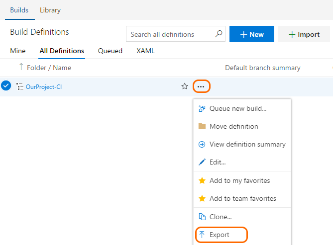
<center>*(Figure 59) Export build definition*</center>


<center>*(Figure 60) Import build definition*</center>

#### Extensions with build templates

Build templates let you create a baseline for users to get started with defining their build process. We ship a number of them in the box today and while you could upload new ones to your account, it was never possible for extension authors to include new templates as part of an extension. You can now include build templates in your extensions. For example:

```json
{  "id": "Template1", 
   "type": "ms.vss-build.template", 
   "targets": [ "ms.vss-build.templates" ], 
   "properties": { "name": "Template1" } }
```

For the full example, see https://github.com/Microsoft/vsts-extension-samples/tree/master/fabrikam-build-extension.

> [!TIP]
> You can use this capability to offer and share the same custom template across all your team projects.

#### Deprecate a task in an extension

You can now deprecate a task in your extension. To make it work, you must add the following variable to the latest version of your task:

```json
"deprecated": true
```

When the user searches for deprecated tasks *(Figure 61)*, we push these tasks to the end and group them under a collapsible section that’s collapsed by default. If a definition is already using a deprecated task, we show a deprecated task badge to encourage users to switch to the replacement.

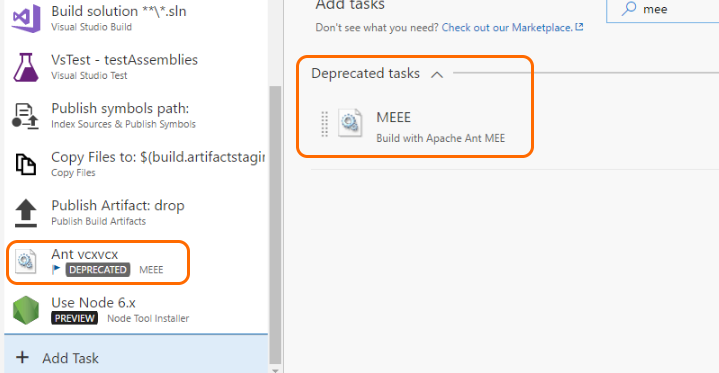
<center>*(Figure 61) Deprecated task badge*</center>

You can help your users learn about the replacement task by mentioning it in the task description *(Figure 62)*. The description will then point folks using the task in the right direction from both the task catalog and the existing build/release definitions.   

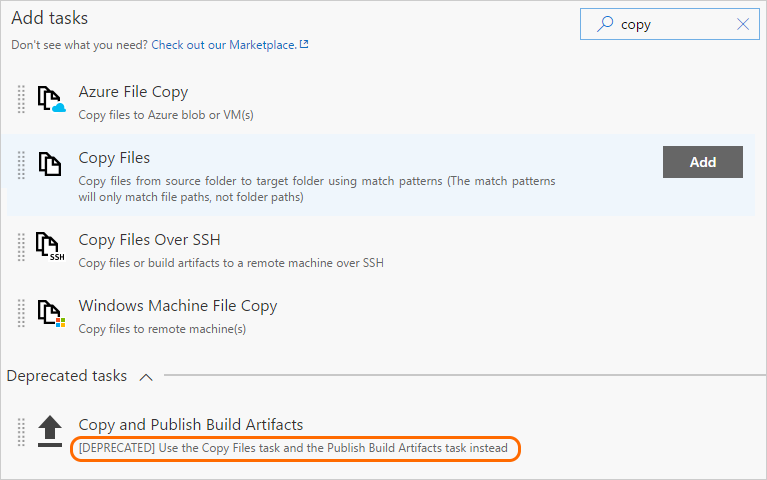
<center>*(Figure 62) Deprecated task description*</center>

####Let contributed build sections control section visibility
Previously if you were using an extension that had build tasks and build summary sections, you’d see the build summary section even if you weren’t using the build task in that build. Now, you can choose to hide or show that section in the build summary page by adding the following line in your extension code and setting the value to true or false: 

`VSS.getConfiguration().setSectionVisibility("$(publisherId).$(extensionId).$(sectionId)", false);`

View the sample included in the [Microsoft vsts-extension-samples repository](https://github.com/Microsoft/vsts-extension-samples/blob/master/build-results-enhancer/src/enhancer/status.ts).

####Variable group support
Variable groups have been available to use in release definitions, and now they are ready to be used in build definitions too. Learn more about [creating a variable group](https://www.visualstudio.com/docs/build/concepts/library/variable-groups). This has been developed and prioritized based on related suggestions for [project-level build/release variables](https://visualstudio.uservoice.com/forums/330519-team-services/suggestions/14515326-project-level-build-release-variables) and [variable groups in build definitions](https://visualstudio.uservoice.com/forums/330519-team-services/suggestions/17646697-make-library-variable-groups-available-for-use-in).

#### Work with secure files such as Apple certificates

We’ve added a general-purpose [secure files library](https://www.visualstudio.com/en-us/docs/build/concepts/library/secure-files) *(Figure 63)*.

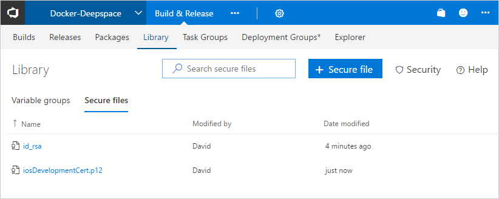
<center>*(Figure 63) Secure files library*</center>

Use the secure files library to store files such as signing certificates, Apple Provisioning Profiles, Android Keystore files, and SSH keys on the server without having to commit them to your source repository. 

The contents of secure files are encrypted and can only be used during build or release processes by referencing them from a task. Secure files are available across multiple build and release definitions in the team project based on security settings. Secure files follow the Library security model.

We’ve also added some Apple tasks that leverage this new feature:

* [Utility: Install Apple Certificate](https://www.visualstudio.com/en-us/docs/build/steps/utility/install-apple-certificate)

* [Utility: Install Apple Provisioning Profile](https://www.visualstudio.com/en-us/docs/build/steps/utility/install-apple-provisioning-profile)

####<a id="rmeditor"> </a>New Release Definition Editor
__Default opt-in:__ The new release definition editor has been opted-in by default for everyone. You or your TFS admins will still have the option to turn it off by going to the __Preview features__ option under your profile menu.  See [Preview features](https://www.visualstudio.com/en-us/docs/collaborate/preview-features) for more details.

Continuing on our journey of refreshing the Build and Release experiences, after the new build definition editor we have now re-imagined our release definition editor to make it a more cleaner and intuitive experience, fixed some pain points, and added new capabilities. One of its most powerful features of the new editor is its ability to help you create a mental model or visualize how the deployments to your environments would progress. In addition to this, approvals, environment and deployment settings are now in-context and easily configurable *(Figure 65)*.

__Visualization of the pipeline__

The pipeline *(Figure 64)* in the editor provides a graphical view of how deployments will progress in a release. The artifacts will be consumed by the release and deployed to the environments. The layout and linking of the environments reflects the trigger settings defined for each environment.

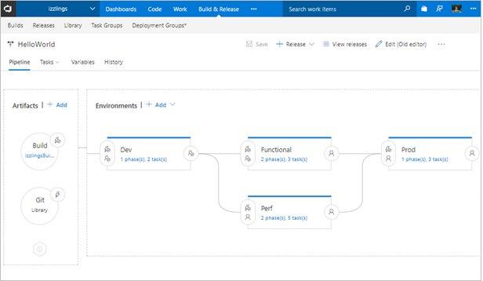
<center>*(Figure 64) Release pipeline*</center>

__In context configuration UI__

Artifacts, release triggers, pre deployment and post deployment approvals, environment properties and deployment settings are now in-context and easily configurable *(Figure 65)*.

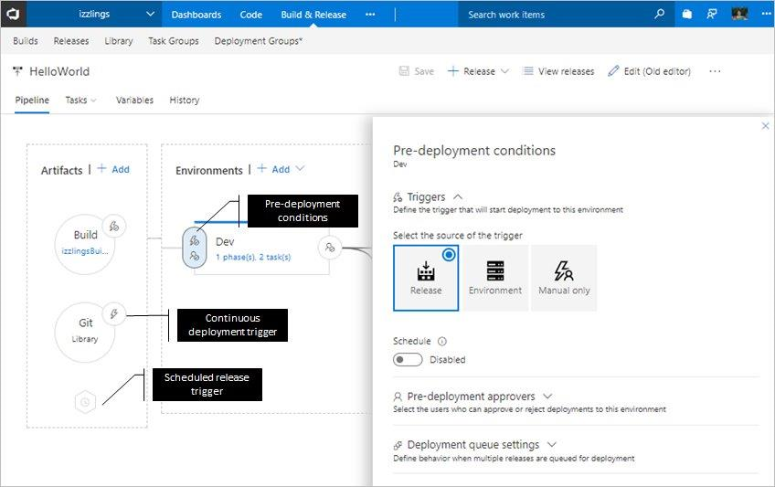
<center>*(Figure 65) Release configuration*</center>

__Getting started with deployment templates__

List of templates (out-of-the-box and custom) are shown when creating a new environment to get started easily *(Figure 66)*.

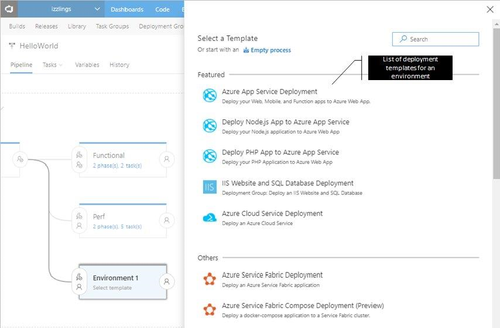
<center>*(Figure 66) Deployment templates*</center>

__Improved task and phase editor__

All the enhancements in the new build definition editor are now available in the release definition editor too *(Figure 67)*. You can search for tasks and add them either by using the __Add__ button or by using drag/drop. You can reorder or clone tasks using drag/drop.

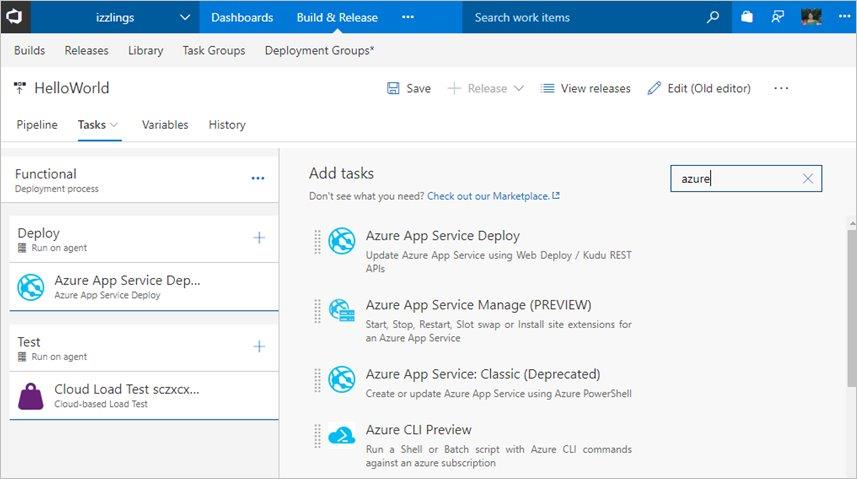
<center>*(Figure 67) Task editor*</center>

__Variable groups, Retention, and Options tabs__

You can now link/unlink to variable groups *(Figure 68)*, set retention policy for individual environments, and modify release definition-level settings such as release number format from the **Options** tab. You can also save an environment as a deployment template, set environment level permissions, and re-order phases within the **Tasks** tab.

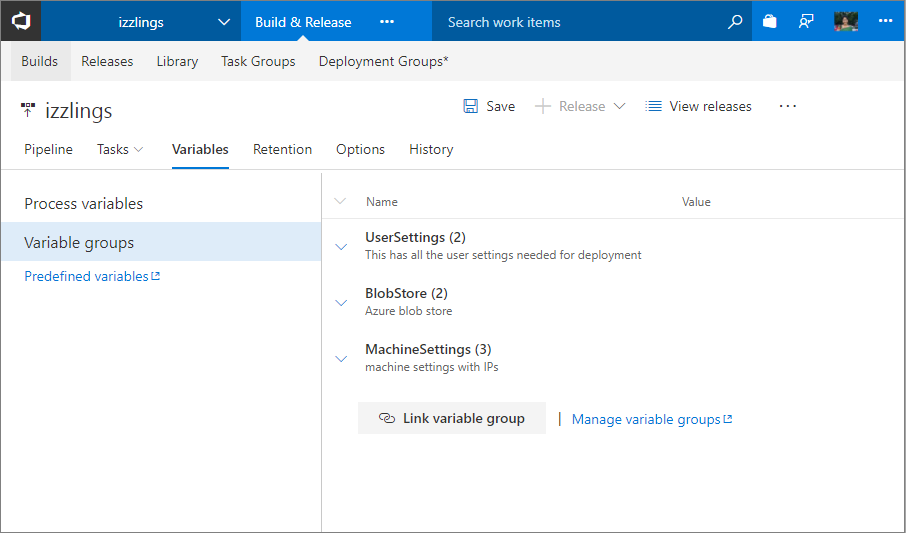
<center>*(Figure 68) Variable groups*</center>

Use environment level operations to save as template and set security *(Figure 69)*.

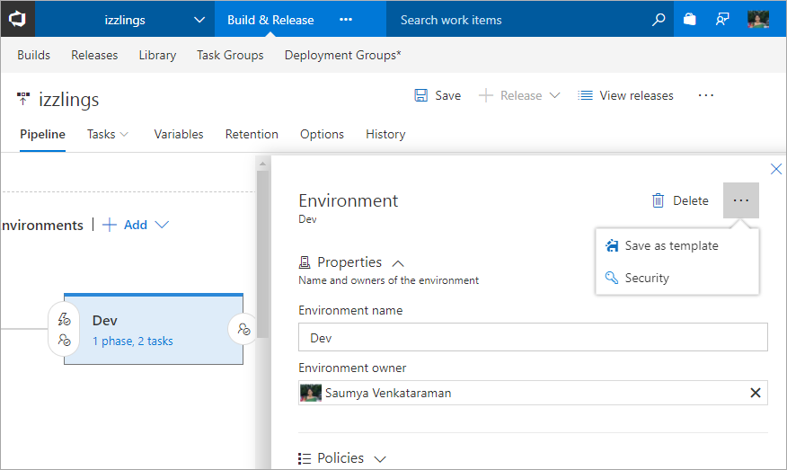
<center>*(Figure 69) Environment menu*</center>

####<a id="vm"> </a>VM Deployment using Deployment Groups
Release Management now supports robust out-of-the-box multi-machine deployment. You can now orchestrate deployments across multiple machines and perform rolling updates while ensuring high availability of the application throughout.

Agent-based deployment capability relies on the same build and deployment agents. However, unlike the current approach where you install the build and deployment agents on a set of proxy servers in an agent pool and drive deployments to remote target servers, you install the agent on each of your target servers directly and drive rolling deployment to those servers. You can use the full task catalog on your target machines.  

A deployment group *(Figure 70)* is a logical group of targets (machines) with agents installed on each of them. Deployment groups represent your physical environments, such as single-box Dev, multi-machine QA, and a farm of machines for UAT/Prod. They also specify the security context for your physical environments.

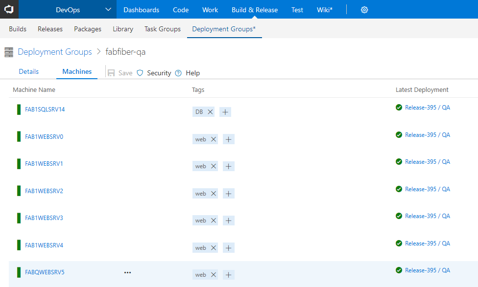
<center>*(Figure 70) Deployment groups*</center>

You can use this against any VM that you register our agent with. We’ve also made it very easy to register with Azure with support for a Azure VM extension that auto-installs the agent when the VM spins up. We will automatically inherit the tags on the Azure VM when it’s registered.  

Once you have a deployment group, you simply configure what you want us to execute on that deployment group *(Figure 71)*. You can control what gets run on which machines using tags and control how fast or slow the rollout happens.

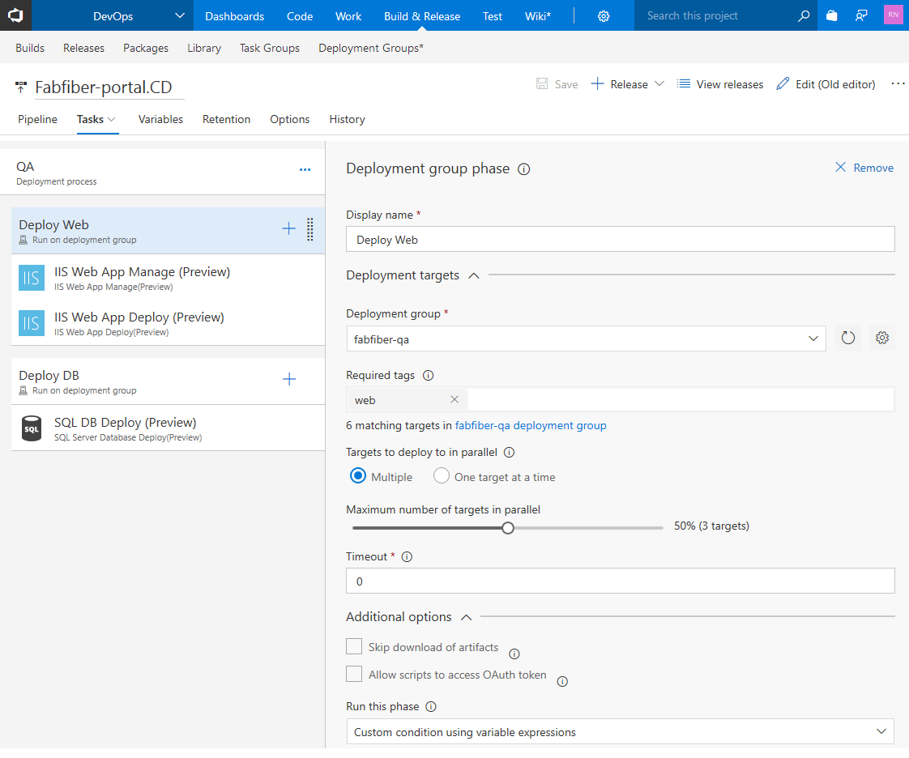
<center>*(Figure 71) Configure deployment groups*</center>

When the deployment is run, the logs show the progression across the entire group of machines you are targeting *(Figure 72)*.

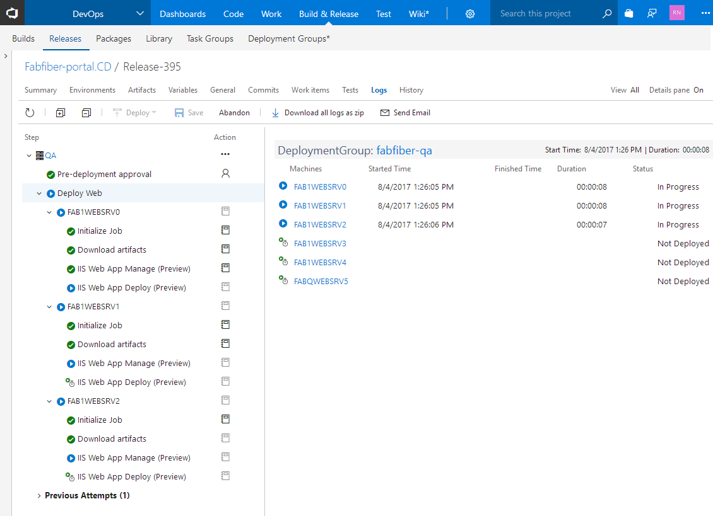
<center>*(Figure 72) Deployment group progress*</center>

This feature is now an integrated part of Release Management.  There are no additional licenses required to use it. 

#### Task group references
Task groups let you define a set of tasks that you can add to your build or release definitions. This is handy if you need to use the same grouping of tasks in multiple builds or releases. To help you track the consumers of a task group, you now have a view into the build definitions, release definitions, and task groups that reference your task group *(Figure 73)*.

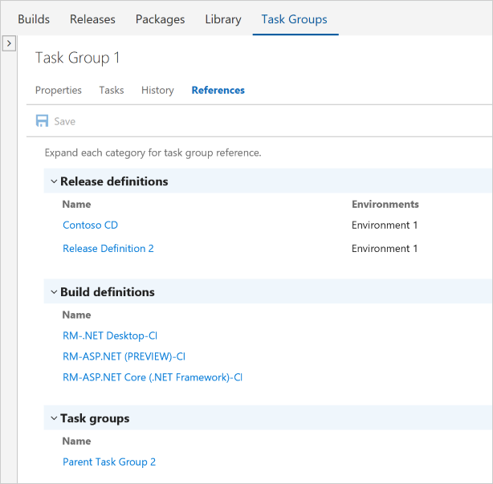
<center>*(Figure 73) Task group references*</center>

When you try to delete a task group that’s still referenced, we warn you and give you a link to this page.

####Task group versioning
When making changes to task groups, it can feel risky because the change is effective to all definitions that use the task group. With task group versioning, now you can draft and preview task group versions while still offering stable versions to your most important definitions until you are ready to switch. After some drafting and iteration, you can publish a stable version and, while publishing, if the changes are breaking in nature, you can choose to publish the task group as preview (a new major version). Alternatively you can publish it directly as an updated stable version *(Figure 74)*.

When a new major (or preview) version of the task group is available, the definition editor will advise you that there is a new version. If that major version is preview, you even see a “try it out” message. When the task group comes out of preview, definitions using it will be auto-updated, sliding along that major channel *(Figure 75)*.

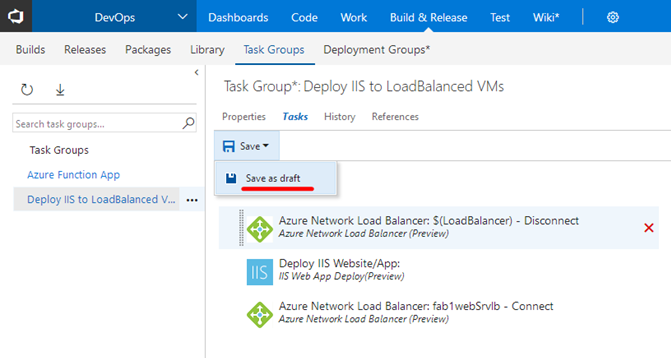
<center>*(Figure 74) Save task group as draft*</center>

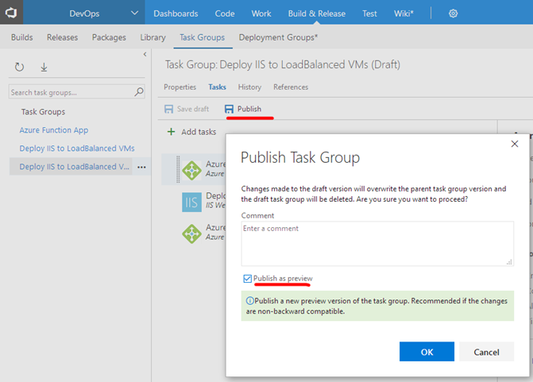
<center>*(Figure 75) Publish task group as preview*</center>

####Task group import and export
Although task groups have enabled reuse within a project, we know that recreating a task group across projects and accounts can be painful. With task group import/export *(Figure 76)*, as we’ve done for release definitions, now you can export as a JSON file and import where you want it. We’ve also enabled nested task groups, which first expand when they are exported.

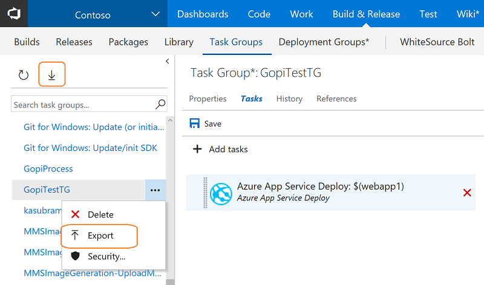
<center>*(Figure 76) Export task group*</center>

####Multi Configuration support in Server Side (Agentless) tasks
By specifying variable multipliers for server side (agentless) tasks *(Figure 77)*, you can now run the same set of tasks in a phase on multiple configurations, which run in parallel. 

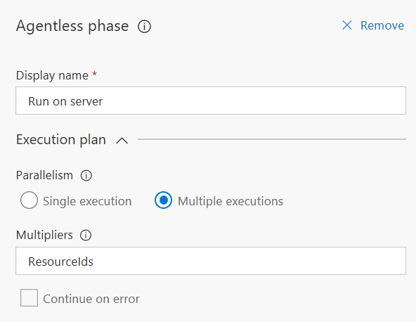
<center>*(Figure 77) Multi configuration of agentless tasks*</center>

####Variables Support in Manual Intervention task
The __Manual Intervention__ task *(Figure 78)* now supports the use of variables within the instruction text shown to users when the task runs, at the point where the user can resume execution of the release process or reject it. Any variables defined and available in the release can be included, and the values will be used in the notifications as well as in the email sent to users *(Figure 79)*. 

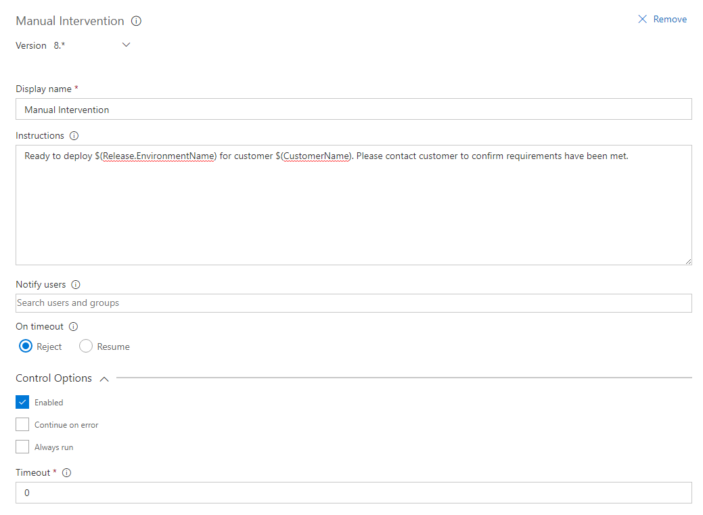
<center>*(Figure 78) Manual intervention task*</center>

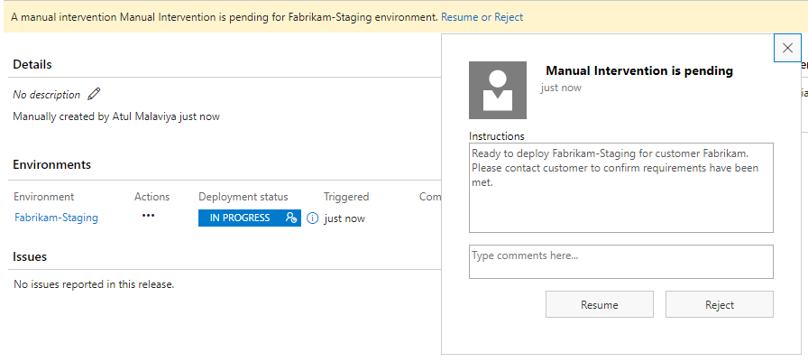
<center>*(Figure 79) Manual intervention pending dialog*</center>

####Control releases to an environment based on the source branch
A release definition can be configured to trigger a deployment automatically when a new release is created, typically after a build of the source succeeds. However, you may want to deploy only builds from specific branches of the source, rather than when any build succeeds.

For example, you may want all builds to be deployed to Dev and Test environments, but only specific builds deployed to Production. Previously you were required to maintain two release pipelines for this purpose, one for the Dev and Test environments and another for the Production environment.

Release Management now supports the use of artifact filters for each environment. This means you can specify the releases that will be deployed to each environment when the deployment trigger conditions (such as a build succeeding and creating a new release) are met. In the __Trigger__ section of the environment __Deployment conditions__ dialog *(Figure 80)*, select the artifact conditions such as the source branch and tags for builds that will trigger a new deployment to that environment.

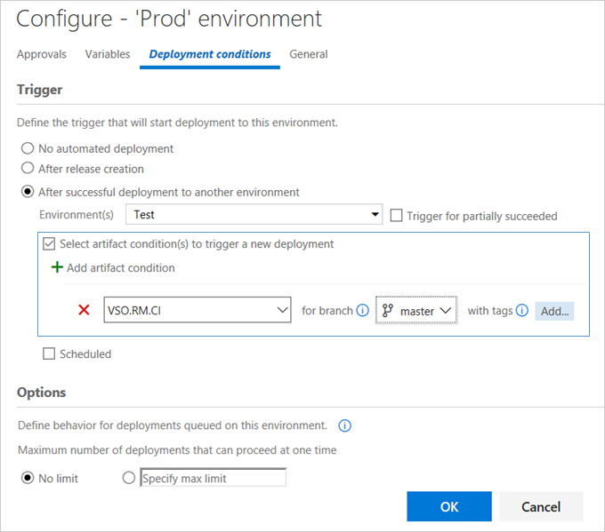
<center>*(Figure 80) Deployment conditions dialog*</center>

In addition, the __Release Summary__ page *(Figure 81)* now contains a pop-up tip that indicates the reason for all “not started” deployments to be in that state, and suggests how or when the deployment will start.

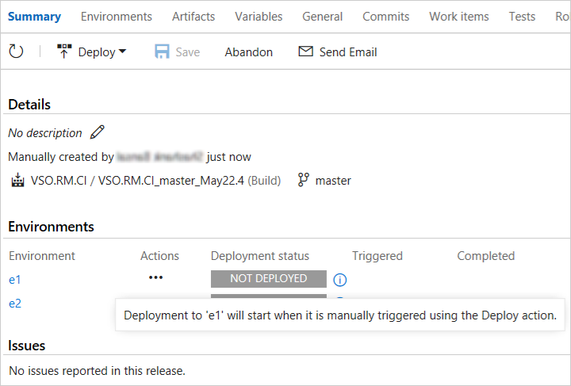
<center>*(Figure 81) Release summary tip*</center>

####Release Triggers for Git repositories as an artifact source
Release Management now supports configuring a continuous deployment trigger *(Figure 82)* for Git repositories linked to a release definition in any of the team projects in the same account. This lets you trigger a release automatically when a new commit is made to the repository. You can also specify a branch in the Git repository for which commits will trigger a release.

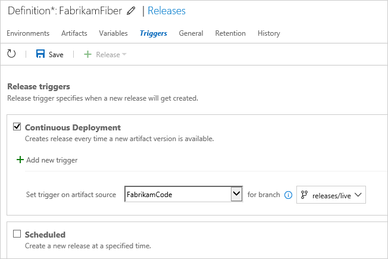
<center>*(Figure 82) Release triggers*</center>

####Release Triggers: Continuous deployment for changes pushed to a Git repository
Release Management has always provided the capability to configure continuous deployment when a build completes. However, now you can also configure continuous deployment on Git Push. This means that you can link GitHub and Team Foundation Git repositories as artifact sources to a release definition, and then trigger releases automatically for applications such as Node.JS and PHP that are not generated from a build and so do not need a build action for continuous deployment.

####Enhancements to server-side tasks
We have made two enhancements to server-side tasks (tasks that run within a server phase).

We have added a new task that can be used to invoke any generic HTTP REST API *(Figure 83)* as part of the automated pipeline. For example, it can be used to invoke specific processing with an Azure function, and wait for it to be completed.

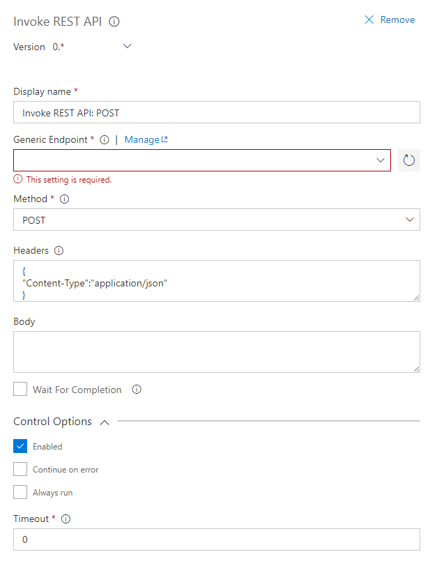
<center>*(Figure 83) REST API task*</center>
 
We have also added a __Control options__ *(Figure 84)* section to all server-side tasks. Task behavior now includes setting the __Enabled__, __Continue on error__, __Always run__, and __Timeout__ options.

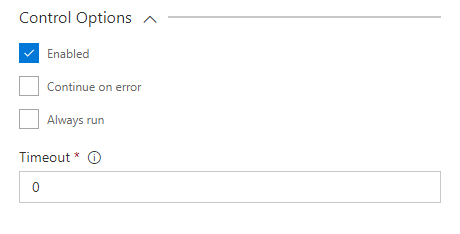
<center>*(Figure 84) Task control options*</center>

####Release status badge in Code hub
Today, if you want to know whether a commit is deployed to your customer production environment, you first identify which build consumes the commit and then check all the release environments where this build is deployed. Now this experience is much easier with the integration of the deployment status in the **Code** hub status badge to show the list of environments that your code is deployed to. For every deployment, status is posted to the latest commit that was part of the deployment. If a commit is deployed to multiple release definitions (with multiple environments) then each has an entry in the badge, with status shown for each environment *(Figure 85)*. This improves the traceability of code commit to deployments.

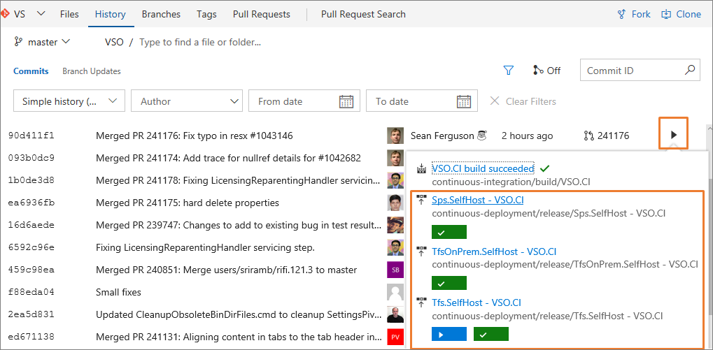
<center>*(Figure 85) Release status badge*</center>

By default, when you create a release definition, deployment status is posted for all environments. However, you can selectively choose the environments whose deployment status should be displayed in the status badge (e.g. only show production environments) *(Figure 86)*.

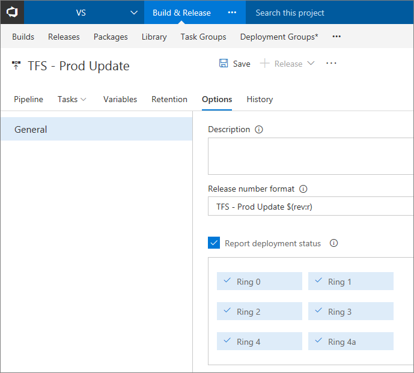
<center>*(Figure 86) Deployment options dialog*</center>

####Enhancements to Build definition menu when adding artifacts
When adding build artifacts to a release definition, you can now view the definitions with their folder organization information and simplify choosing the desired definition *(Figure 87)*. This makes it easy to differentiate the same build definition name but in different folders.

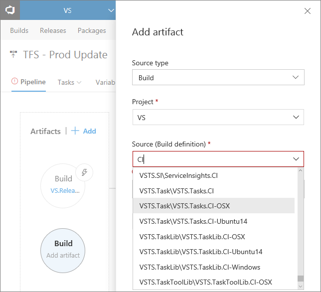
<center>*(Figure 87) Add artifact*</center>

The list of definitions is filtered based on those that contain the filter term.

####Revert your release definition to older version
Today, if a release definition is updated, you can’t directly revert to a previous version. The only way is to look into the release definition history to find the diff of the changes, and then manually edit the release definition.
Now, using the **Revert Definition** feature *(Figure 88)*, you can choose, and revert back to any older version of a release definition from the release definition **History** tab.

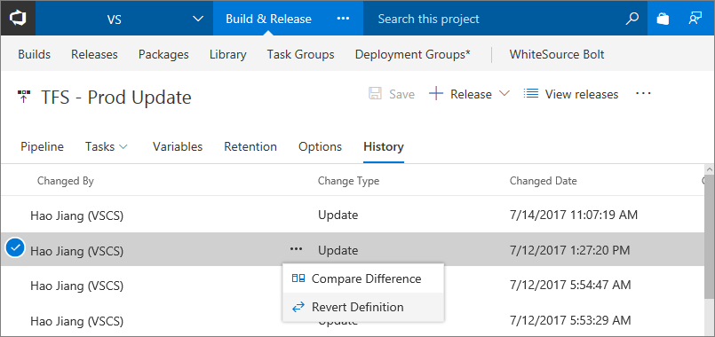
<center>*(Figure 88) Revert release definition*</center>

### <a id="test"> </a> Testing

#### <a id="mtm"> </a> Removing support for Lab Center and automated testing flows in Microsoft Test Manager
With the evolution of Build and Release Management, [XAML builds are no longer supported in TFS 2018](#xaml) and consequently we are updating support for using Microsoft Test Manager (MTM) with TFS. Using Test Center/Lab Center in MTM for automated testing is no longer supported by TFS, starting with TFS 2018. If you are not ready to migrate away from XAML builds and Lab Center, you should not upgrade to TFS 2018. 

If you upgrade to TFS 2018, the following is the impact:
##### Lab Center:
  * No longer supported:
      * Test Controllers cannot be registered with TFS for creating and managing Lab environments. 
      * Any existing Test Controllers registered with TFS will go offline and existing Lab environments will appear as 'Not Ready'.
  * Recommended alternative: 
      * You can connect to your SCVMM server using [SCVMM TFS Extension](https://marketplace.visualstudio.com/items?itemName=ms-vscs-rm.scvmmapp), create/manage VMs and run your workflows on it. For more details see [How to perform Lab management operations in Build and Release](http://go.microsoft.com/fwlink/?LinkId=832659).


##### Automated Testing:
  * No longer supported:
    * Automated testing workflows that rely on Test controller and Lab environments such as XAML Build-Deploy-Test workflow or running automated tests from a test plan using MTM are no longer supported.
  * Recommended alternatives:
    * You can [run automated tests in Build and Release](https://go.microsoft.com/fwlink/?linkid=856589).
    * You can [run automated tests from a test plan using the Test hub](https://aka.ms/runautomatedtesthub).


##### Manual Testing:
  * All manual testing scenarios continue to be fully supported. While manual tests can be run using MTM with TFS 2018, Lab Environments cannot be used to run manual tests. 
  * For all manual testing scenarios, we [strongly recommend using the Test hub](https://www.visualstudio.com/en-us/docs/test/manual-exploratory-testing/mtm/guidance-mtm-usage) in TFS web access.


####<a id="xt"> </a>Exploratory testing traceability improvements for work item links, iterations, and area paths
Based on the feedback we received from teams doing exploratory testing, we are improving traceability links while filing bugs, tasks, or test cases from the [Test & Feedback extension](https://marketplace.visualstudio.com/items?itemName=ms.vss-exploratorytesting-web). Bugs and tasks created while exploring requirements will now be created with the same area path and iteration as that of the requirement instead of team defaults. Test cases created while exploring requirements will now be linked with a __Tests <-> Tested By__ link instead of the __Parent <-> Child__ link so that the test cases you create are automatically added to requirement based test suites. Finally, work items created while not specifically exploring any requirement will be filed in the team’s default iteration instead of the current iteration so that no new work items come into the current iteration after the sprint planning is complete.

####Filters for Test Case work items in Test Plans and Suites in Test Hub
In addition to the filters on **Test** fields like __Outcome__, __Configuration__, and __Tester__, you can now filter on Test Case work item fields like __Title__, __State__, and __Assigned To__ *(Figure 89)*. 

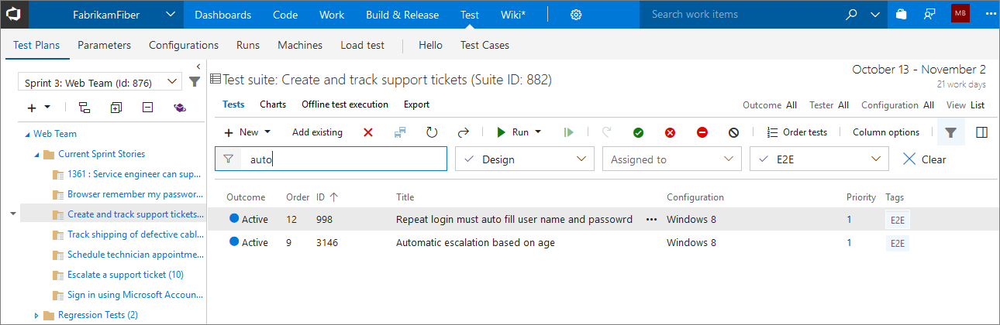
<center>*(Figure 89) Test case filters*</center>

####Test trend charts for Release Environments and Test Runs
We are adding support for **Release Environments** in the **Test Result Trend** widget *(Figure 90)* so that you can track status of test environments on VSTS dashboards. Like the way you to do for test results in **Build**, you can now create trend charts showing test pass rate, count of total, passed or failed tests, and test duration for **Release Environments**. You can also filer the charts to a specific test run within an environment with the **Test Run** title filter. 

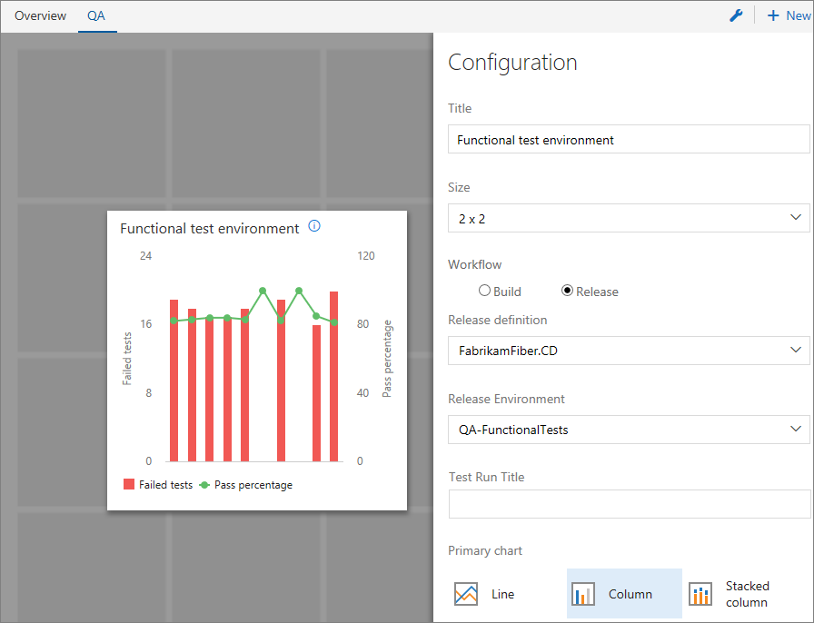
<center>*(Figure 90) Test trend chart*</center>

####Markdown formatting support for Test Run and Test Result comments
We are adding support for formatting **Test Run** and **Test Result** comments with [markdown syntax](https://www.visualstudio.com/docs/reference/markdown-guidance). You can use this feature to create formatted text or quick links to URLs in your comments. You can update **Test Result** comments in the **Result Summary** page with **Update analysis** and **Test Run** comments in the **Run Summary** page with **Update comments** in **Test** hub.

####Add link to existing bug for a failing test
While analyzing the test result in the **Build** or **Release** summary page or in the **Test** hub, you can now associate an existing bug to a failed test. This is helpful when a test is failing for a known reason that has a bug already filed.

### <a id="sp"> </a> Discontinuing TFS Extension for SharePoint
TFS 2018 and later versions will no longer support the TFS Extension for SharePoint. Additionally, the screens used to configure integration between a TFS Server and a SharePoint server have been removed from the Team Foundation Administration Console. 
**If you are upgrading to TFS 2018 from a previous version configured to integrate with SharePoint, you will need to disable the SharePoint integration after upgrade, or your TFS SharePoint sites will fail to load**. 

We have created a solution that allows you to disable integration on the SharePoint server. For more information, please see the post on [the future of our TFS/SharePoint Integration](https://go.microsoft.com/fwlink/?linkid=852977).

### <a id="tr"> </a> Discontinuing Team Rooms
Modern development teams heavily depend on collaboration. People want (and need) a place to monitor activity (notifications) and talk about it (chat). A few years back, we recognized this trend and set out to build the [Team Room](https://www.visualstudio.com/en-us/docs/collaborate/collaborate-in-a-team-room) to support these scenarios. Since that time, we have seen more solutions to collaborate emerge in the market. Most notably, the rise of [Slack](https://marketplace.visualstudio.com/search?term=slack&target=VSTS&category=All%20categories&sortBy=Relevance). And more recently, the announcement of [Microsoft Teams](https://marketplace.visualstudio.com/items?itemName=ms-vsts.vss-services-teams).

With so many good solutions available that integrate well with TFS and Visual Studio Team Services, we [announced in January](https://blogs.msdn.microsoft.com/devops/2017/01/04/deprecation-of-the-team-rooms-in-team-services-and-tfs/) the plans to remove our Team Room feature from both TFS 2018 and Visual Studio Team Services. 

----

### Known Issues

#### TFS Database Import Service does not support RC releases
The TFS Database Import Service for Visual Studio Team Services doesn’t support imports from RC releases of TFS. If you’re planning on importing your collection database to Team Services using this service, it’s important that you don’t upgrade your production database to this RC release. If you do upgrade, then you will need to wait and upgrade to the RTW version of this release or restore a backup copy of your database from a previous TFS version to import. 

#### Visual Studio Test v1 task in Build/Release cannot run tests using Visual Studio 2017 Update 3
The Visual Studio Test v1 task in Build/Release cannot run tests using Visual Studio 2017 Update 3. The task fails with 'Unable to determine the location of vstest.console.exe'. The workaround is to use version 2 of the Visual Studio Test task.