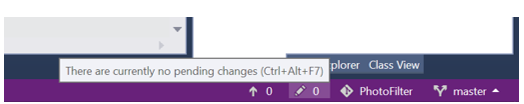
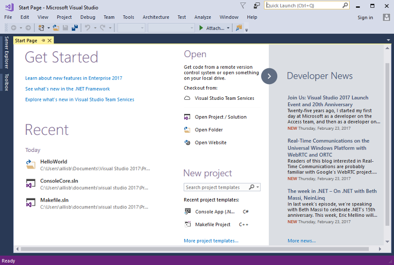
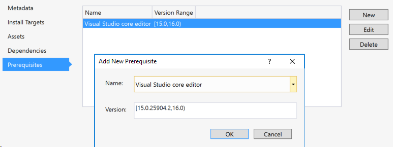
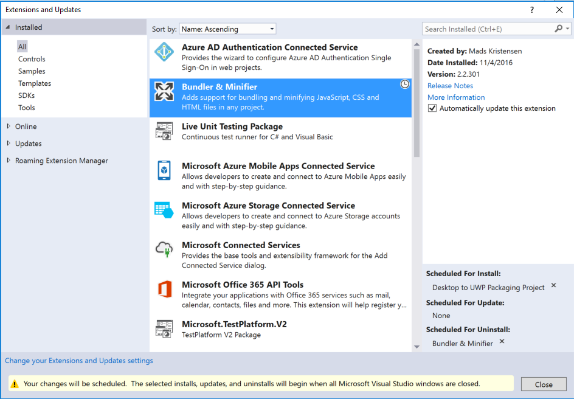
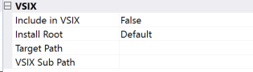
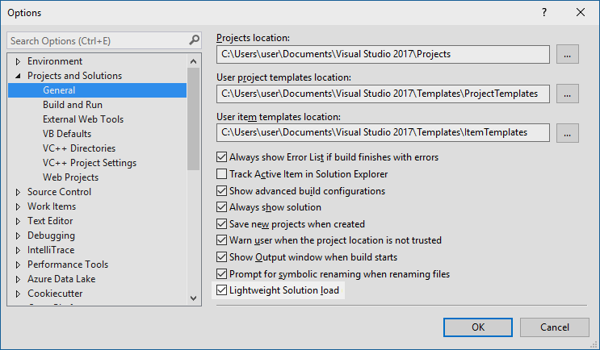
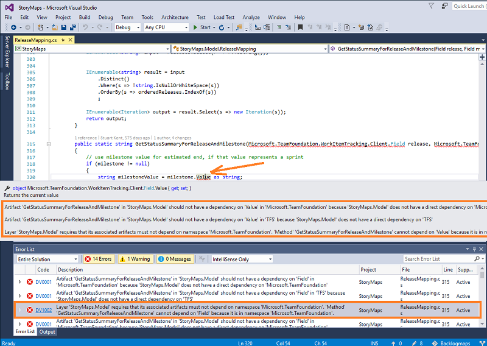
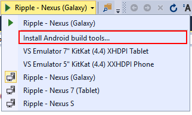

#  Visual Studio 2017 RC

## November 16, 2016

We are happy to announce the release of Visual Studio 2017 RC! This new release includes our most recent feature innovations and improvements.
> [!NOTE]
> You have reached the release notes for the most current version of Visual Studio 2017.

#### Download: [Visual Studio Enterprise 2017 RC](https://aka.ms/vs/15/release/vs_enterprise.exe)

To learn more about other related downloads, see the [Downloads](https://www.visualstudio.com/downloads) page. Also, see [Visual Studio 2017 System Requirements](https://www.visualstudio.com/productinfo/vs2017-system-requirements-vs) 
and [Visual Studio 2017 Platform Targeting and Compatibility](https://www.visualstudio.com/productinfo/vs2017-compatibility-vs).

> [!IMPORTANT]
> While Visual Studio 2017 RC in general is supported for use in a production environment, those workloads and components that are marked “Preview” in the installation UI are not supported for use in a production environment.  


#### Feedback 
We’d love to hear from you! For problems, let us know via the [Report a Problem](https://docs.microsoft.com/visualstudio/ide/how-to-report-a-problem-with-visual-studio-2017) option in the upper right corner, either from the installer or the Visual Studio IDE itself. Track your feedback on the [Developer Community](https://developercommunity.visualstudio.com/index.html) portal. For suggestions, let us know through [UserVoice](https://visualstudio.uservoice.com/forums/121579-visual-studio).

#### What's New?
* [New Installation Experience](#willow)
* [Enhanced Visual Studio Feedback Workflow](#ReportAProblem)
* [Visual Studio IDE](#vside)
* [Live Architecture Dependency Validation](#archtools)
* [Live Unit Testing](#LiveUnitTesting)
* [Developer Command Prompt](#devprompt)
* [Debugging and Diagnostics](#debuggingdiag)
* [Visual C++](#cplusplus)
* [C# and Visual Basic](#cshappvb)
* [F#](#fsharp)
* [Python](#python)
* [R](#rtools)
* [JavaScript and TypeScript](#javascripttypescript)
* [Tools for XAML Apps](#xaml)
* [Tools for Universal Windows App Development](#uwptools)
* [Visual Studio Tools for Apache Cordova](#apache)
* [Xamarin (Preview)](#xamarin)
* [NuGet](#nuget)
* [Developer Analytics Tools](#devanalytics)
* [Team Explorer](#teamexplorer)
* [SQL Server Data Tools](#sqltools)
* [Office Developer Tools for Visual Studio](#officedev)
* [Visual Studio Software Development Kit](#vssdk)
* [Azure SDK for .NET](#azuretools)
* [Node.js Tools for Visual Studio](#nodejs)
* [Visual Studio Tools for Unity](#vstu)
* [.NET Core and Docker(Preview)](#dncdocker)

#### Resolved Issues
To check out issues addressed in this RC release, please visit our [Developer Community Portal](https://developercommunity.visualstudio.com/topics/fixed-in%3A+Visual+Studio+2017+RC.html).

#### Known Issues
* [Known Issues](#knownissues)
  * [Installation Issues](#KIinstall)
  * [Editor and IDE Issues](#KIeditoride)
  * [NuGet Issues](#KINuget)
  * [Test Tools Issues](#KItesttools)
  * [Tools for Universal Windows App Development Issues](#KIuwptools)
  * [Live Unit Testing Issues](#KILUT)
  * [Lightweight Solution Load Issues](#KILSL)
  * [Web Development Tools Issues](#KIWebTools)
  * [.NET Core Tools Issues](#KICore)
  * [Extensibility Issues](#KIExtensibility)
  * [Other](#KIother)

#### Related Releases

* [Microsoft .NET Framework 4.6.2 - Web Installer](https://support.microsoft.com/kb/3120737 ".NET Framework 4.6.2")

---

## What's New ?

### <a id="willow"> </a>New Installation Experience

We're delighted to introduce our new installer, which was designed from the ground up to:

* Reduce the minimum footprint of Visual Studio.
* Install more quickly with less system impact, and uninstall cleanly.
* Make it easier for you to select and install just the features you need.

When you first install Visual Studio 2017 RC, you'll see the new experience:


The smallest install is just a few hundred megabytes, yet still contains basic code editing support for
more than twenty languages along with source code control. Most users will want to install
more, and so you can add one or more 'workloads' that represent common frameworks,
languages and platforms - covering everything from .NET desktop development to data science
with R, Python and F#.

As we prepare for release, we're continuing to evolve the list of workloads. In particular, because
the .NET Core, Xamarin, Python, and Data Science workloads have not yet reached RC-quality, we have
marked them as "Preview" quality. These three workloads should not be relied on in a production
environment at this stage. 

> [!IMPORTANT]
>If you have a preview release of Visual Studio 2017 installed on your computer, you will be prompted to remove it prior to installing Visual Studio 2017 RC.

For more information on known issues, see the [Known Issues](#knownissues) section of this document.

#### Feedback On the New Installer

We're eager for you to try this out and looking forward to receiving your feedback. You can
report problems or praise using the _Report a Problem_ and _Provide a Suggestion_ commands
from the new installer client. In particular, we want to know if you experience errors
installing, uninstalling, or modifying your installation, as well as abnormal installation
times (e.g., hangs) or unexpected error messages.

#### _**New in RC**_ Creating a Layout for Offline Installation and new Command-Line Installation Support

System administrators can now create an offline layout of Visual Studio that contains all of the content needed to
install the product without requiring Internet access.  To do so, run the bootstrapper executable associated with the product you want to
make available offline using the `--layout [path]` switch (e.g. `vs_enterprise.exe --layout c:\mylayout`). This will download the packages 
required to install offline. Optionally, you can specify a locale code for the product languages you want included (e.g. `--lang en-us`).  If not 
specified, support for all localized languages will be downloaded.

To install from the layout folder, you can simply run the bootstrapper executable from the newly-created layout folder. Note
that signature verification certificates will still need to be downloaded from the Internet. We are going to fix the need to be connected 
in an upcoming release. Last, note that the Android SDK requires an online connection to install.

You can also run `C:\Program Files (x86)\Microsoft Visual Studio\Installer\vs_installershell.exe` to install Visual Studio
components from the command line. Use the `--help` switch for further information on command-line options. 

### <a id="ReportAProblem"> </a> Enhanced Visual Studio Feedback Workflow
Visual Studio 2017 includes an upgraded feedback experience for better follow-up and collaboration. 
As part of this upgrade, you will notice a more collaborative Report-a-Problem experience in Visual Studio supplemented by a comprehensive [web portal]( https://developercommunity.visualstudio.com/index.html) 
for a complete end-to-end feedback solution. You can now search, follow, vote and get the latest updates on all feedback that you have provided via Visual Studio IDE’s Report a Problem feature. 
These enhanced experiences address a lot of the feedback we have received from you and enable bidirectional communication between our teams and you.

### <a id="vside"> </a> Visual Studio IDE

A broad range of enhancements are included in Visual Studio 2017 RC.

#### Overall Improvements
* The GitHub extension for Visual Studio can be selected in the new Visual Studio installer.
* Visual Studio has been optimized to reduce startup time and solution load time. The very first launch of Visual Studio is at least 50% faster.
* Visual Studio will now monitor extension performance that impacts startup, solution load, or editing. You will be alerted about poorly performing extensions via the Notification bar in the IDE. The new Performance Center (also available via Help | Manage Visual Studio Performance) lets you view not only extensions that are impacting performance, but also discover tool windows that are impacting your startup performance and change their startup load behavior.
* Reload All Projects has been replaced with Reload Solution to support better performance of switching branches external to VS. When using the Git command line to switch branches, choose Reload Solution after the branch has switched in order to achieve the maximum performance improvement.
* File globbing capabilities for .NET Core and ASP.NET Core projects have been enhanced. See [project file globbing](https://aka.ms/jcmh7k) for more details.
* You are now automatically taken to the folder view of your repository after cloning. You can view files or open Solutions with the new Solution selection list in the Solution Explorer.
* A new external service host is being introduced that will replace VSHub; this new service host is an external process and will appear in Task Manager as ServiceHub.Host.CLR.*.exe, as well as ServiceHub.Host.Node.x86.exe. This host will ultimately eliminate the localhost http traffic that was introduced with VSHub which should alleviate the noise Fiddler users reported.
* Pre-release license expiration messages more clearly communicate the current license state.
* The Account Settings dialog is now more accessible to screen readers.
* The version control status bar makes it easier to publish local repos to an SCC host and keep track of uncommitted and un-pushed work.

 

 

#### Start Page

* A revamped Start Page with new Open and Create facilities:
  * Acquire remote repos from VSTS or use our more prominent MRU to open local projects and solutions easily.
  * The Start Page MRU shows repos you've cloned on your other machines so you can easily clone them on your current machine.
  * Create a new project directly from the Start Page with searchable templates and a list of recently used templates. Recently used templates will also roam across Visual Studio instances with a personalization account.
  * Quickly launch the new Clone from VSTS experience through the "Checkout from VSTS" option on the Start Page.
  * Dismissible "Get Started" section. 
  * The News section is now collapsible:
    * _**New in RC**_ Updated badge on newly added items in the News Feed.
    * _**New in RC**_ Badge on News Feed expander if new items appear when the News Feed is collapsed.
  *  _**New in RC**_ Refined visual design to address feedback about truncated elements on smaller screens and utilization of empty space.

The Get Started section and News featured here:

  

And with Get Started dismissed and News collapsed:

  

#### <a id="betternav"> </a>Improved Code Navigation

We've made significant improvements to code navigation features in Visual Studio 2017 RC.

* Go To: (Ctrl + , or Ctrl + T) lets you quickly find and go to files, types, methods, and other elements in your code. It gives you a one-stop way to go to any kind of item you need, even in large code bases. What’s more, if you know what kind of item you’re after you can filter down easily.
We've also modernized the Go To Line (Ctrl + G) experience.

  You can find the Go To family of commands at the top of the Edit Menu. See [known issues](#knownissues) for a list of known limitations in Go To in this RC release.
   
* Find All References (Shift+F12) has been overhauled (currently for C#, Visual Basic, and C++), providing advanced grouping, filtering, sorting, searching within reference results, and colorization for results (for C# and VB), so you can get a clear understanding of your references and get to the line of code you need with confidence. On mouse hover over a reference item, a tooltip is displayed with the context of the reference in source code (for C# and VB). By toggling on the “Keep Results” button in the toolbar, the next invocation of Find All References will populate reference results in a new window. This allows you to keep the current results in the existing window.

  

* Structure Guide Lines are now drawn in the editor so that you can easily visualize the structure of the code that you are working in. On mouse hover, a tooltip is displayed containing the context of the current code block relative to its ancestor blocks. Structure Guide Lines are currently supported for C#, Visual Basic, and XAML files, and for any files supported via TextMate grammars. This feature may be disabled in the Tools Options Dialog by unchecking the *Show structure guide lines* checkbox under the *Text Editor* > *General* category.

  

#### EditorConfig Support
_**New in RC**_ Visual Studio editor now supports [EditorConfig](http://editorconfig.org), which allows developers to define and maintain consistent coding style conventions between different editors and IDEs. See [known issues](#KIeditoride) for a list of known limitations in EditorConfig support in this RC release.

#### New Extensibility Format
The new installer technology in Visual Studio 2017 RC gives you greater control over the tools that are installed.  Some users may install just the core Visual Studio editor while others may install several workloads.  To ensure that the prerequisite features an extension requires are installed, extension authors will now be able to specify the individual components required by their extension in the manifest.

Users will be warned when trying to install an extension that was not built using the new VSIX format.  The old VSIX format does not specify prerequisites needed and may fail to work if those prerequisites are unavailable in Visual Studio 2017 RC.  The new VSIX format is backwards compatible and can target past versions of Visual Studio up until Visual Studio 2012.

The VSIX manifest designer has been updated to reflect the changes to the manifest.  In the prerequisite tab, extension developers can find a list of installed components to specify as a prerequisite for their extension.



During the installation of the extension, the VSIX installer will indicate which components are missing and will install them alongside the extension.


#### Modify Extensions in Bulk
In the Extensions and Updates dialog, you can now schedule multiple extensions for installation, update, and uninstallation before needing to restart Visual Studio.  In the lower right corner, there is a summary of all the scheduled tasks.  Clicking the x will unschedule the extension for modification.

 

Once the VSIX Installer has detected that all Visual Studio windows are closed, it will start to complete the scheduled modifications.


#### Ngen Support

You can now choose to install assemblies using ngen.


* **NGEN -** Whether or not to use ngen on the assembly.
* **NGEN Application -** The application to pass into ngen via the /ExeConfig switch.
* **NGEN Architecture -** The target architecture for the native image.  Options are: x86, x64, and all.
* **NGEN Priority -** Ngen priority level.

#### Install Files Outside of Extension Directory

You can now choose to install files to a select list of folders that are outside of the extension directory.



* **Include in VSIX -** Whether or not to include the file in your VSIX. 
* **Install Root -** The root directory to install the file.  Options are: Default (install inside the extension directory), MSBuild, Schemas, PublicAssemblies, Licenses, and ReferenceAssemblies.
* **Target Path -** The name of the file to be installed on the user's machine.
* **VSIX Sub Path -** The subpath under the Install Root where the file will be installed.

#### Roaming Extension Manager

New in Visual Studio 2017 RC, the Roaming Extension Manager helps you keep track of all your favorite extensions across all your development environments. Roaming your extensions keeps track of the extensions you have installed by creating a synchronized list in the cloud. 

When you sign into Visual Studio, you can quickly see a list of your extensions from Tools > Extensions > Updates, and click Roaming Extension Manager. It tracks which extensions you have installed and lets you choose which ones are added to your Roaming list. With more cool extensions appearing in the gallery every day, this tool makes it quick and easy to set up each dev environment with your favorite extensions.


Using this feature, you will notice 3 icon types:
*  Roamed Icon: denotes an extension that is part of your Roaming List, but not installed on this machine. You can install these via the "Download" button. 
*  Roamed & Installed Icon: denotes all extensions that are part of your Roaming List and installed in this environment. If you decide you do not want to roam, you can remove these via the "Stop Roaming" button.
*  Installed Icon: denotes all extensions that are installed in this environment, but are not part of your Roaming List. Extensions can be added to roaming list via the "Start Roaming" button.

These icons will show you the current status of your list. You can have any extension in any state, so customize to your heart's content! Or let us do it for you! Any extension downloaded while you are signed in will be added to your list as  Roamed & Installed and will therefore be part of your Roaming list giving you access to it from any machine!

#### Sign in and Identity Improvements

_**New in RC**_ We introduced a new identity service that allows us to share user accounts across Microsoft developer tools. Within Visual Studio this sharing includes features such as Team Explorer, Azure Tools, Windows Store publishing, and more. These features now share a common and consistent sign in experience.

Along with improvements to Visual Studio we have completed the deployment of some improvements on the service side that allow users to safely stay signed in and eliminate the forced sign-in every 12 hours. This addresses the most commonly reported sign-in issue.
[Learn more about fewer Visual Studio prompts](https://blogs.msdn.microsoft.com/visualstudio/2016/08/15/fewer-visual-studio-sign-in-prompts/).

#### Open Folder

Open Folder is a convenient way for you to work with code bases without projects and solutions. Navigate to a folder
 by opening the File Menu, clicking Open, and then clicking Folder.


You can open and edit files using the Solution Explorer. Many popular languages have syntax highlighting and support
for symbol navigation (GoTo). Additionally, some languages have advanced IntelliSense and debugging support directly
from the folder:

* C++ (CMake)
* Node.js - JavaScript/TypeScript
* Python
* C# & VB

You can build or debug by using F5 and the file context menu in the Solution Explorer. For the best experience,
make sure you install the workload for the languages you are working with.

The folder view also supports the following:

* Search across the code in your folder with GoTo (Ctrl+,).
* Scope the Solution Explorer folder view to subfolders.
* Open folders in Explorer or the Command Prompt from the Solution Explorer.
* Easily toggle between Solutions in the opened folder or repository with the Solution selection dropdown.
* Configure debug and launch settings with launch.json. Right click on a debuggable file and select "Debug and Launch Settings".
* Configure tasks and customize build with tasks.json. Right click on any file and select "Configure Task Settings".
* Launch.json and tasks.json have IntelliSense in the JSON editor.

_**New in RC**_ The performance of opening folders and toggling between folder view and solution view has been drastically improved.

#### Lightweight Solution Load

Lightweight Solution load enables faster loading of large Solutions. For large Solutions, it can provide a 
substantial improvement in Solution load time and memory usage. The feature is not enabled by default and can be
enabled on a Solution by Solution basis or globally in the IDE. To enable globally, navigate to Tools Options
dialog by selecting General under "Projects and Solutions" or by searching for "Lightweight Solution load" with
Quick Launch. The feature can be turned on and off for individual Solutions in the Solution properties pane.



Lightweight Solution Load is best suited for large solutions that contain C# or a mix of C# and C++ projects. You
may be prompted to enable the feature if we detect that you are working with large solutions. You can find more
details about this feature on the [Visual Studio blog](https://blogs.msdn.microsoft.com/visualstudio/2016/10/11/shorter-solution-load-time-in-visual-studio-15/).

#### Syntax Colorization, Autocomplete, Snippet, and "Navigate To" Search support for a broader set of languages

Building on the support we added in updates to Visual Studio 2015, 
in Visual Studio 2017 RC we now support syntax colorization and autocomplete for an increased range of languages. 
In addition, some of these languages also support navigation via "Navigate To" (Ctrl+), and/or 
Code Snippets. See the list below for details.

Files for the languages noted below support these features in the new "Visual Studio Core Editor" even when 
no workloads have been installed to explicitly support the language in question. If a workload that provides 
language support is installed (e.g., the .NET Desktop Application Development workload, the Windows Desktop 
App Development with C++ workload, the Python Development workload, etc.), then more extensive language 
support including IntelliSense and other advanced language features like Light Bulbs may be provided.

**Language file types listed by support level:**
* Supports only Syntax Colorization and Autocomplete:
  * Bat, Clojure, CoffeeScript, CSS, Docker, F#, Groovy, INI, Jade, Javadoc, JSON, LESS, LUA, Make, Markdown ++, Objective-C, Perl, PowerShell, Python, Rust, ShaderLab, SQL, Visual Basic .NET, YAML. 
* Supports Code Snippets (in addition to Syntax Colorization and Autocomplete):
  * CMake, C++, C#, Go, Groovy, HTML, Java, Javadoc, JavaScript, Lua, Perl, PHP, R, Ruby, Shellscript, Swift, XML.
* Supports Navigate To (in addition to Syntax Colorization and Autocomplete):
  * C++, C#, Go, Java, JavaScript, PHP, TypeScript, Visual Basic.
  
#### Getting Started with Project Overview Pages
_**New in RC**_ Starting with ASP.NET Core and ASP.NET 4.x projects, we are introducing a completely new getting started experience for new projects. We've removed the Project_Readme.html from the solution and replaced it with an Overview
tab in our new App Configuration Designer. We've condensed the material on this page to focus on the actions that will get you up and running quickly! 


#### <a id="servicecapability"> </a>Connecting to Services Using Service Capabilities
Service Capabilities is the modern "Add Connected Service" or "Add Service Reference" feature of Visual Studio 2017 RC. 
The service Capabilities feature makes it easier to connect your app to services. A new node called "Service Capabilities" 
is available in the Solution Explorer for Web and Mobile project types. Double clicking this node will open a new full page 
tab in Visual Studio where you can discover popular Microsoft services you can connect to. 

Selecting a service on the Service Capabilities page will invoke the Connected Services Wizard that configures your project, 
and downloads the necessary NuGet packages to get you started coding against your service quickly and painlessly. 


#### <a id="connectedservice"> </a>Wizard for Connecting to Azure App Service Mobile App
The Service Capabilities page includes the Azure Mobile App provider for Mobile projects which helps you to connect to 
Azure App Service to store data in the cloud, add authentication, and deliver push notifications for mobile apps.


### <a id="archtools"> </a> Live Architecture Dependency Validation

In Visual Studio Enterprise, if you have setup Dependency Validation diagrams (aka Layer diagrams) you now get real-time notifications of violations of architectural dependency rules as you type code in the Code Editor: errors appear in the Error List and squiggles in the text editor show the precise location of this violation. You are now less likely to introduce unwanted dependencies.



### <a id="LiveUnitTesting"> </a> Live Unit Testing

_**New in RC**_ Live Unit Testing is a new feature we are introducing and only present in the Enterprise edition of Visual Studio. This feature visualizes unit test results and code coverage live on the editor, while you are coding. It works with C#/VB projects for .NET framework and supports three test frameworks of MSTest, xUnit, and NUnit. This is an early preview of this feature and has several [known issues](#KILUT).

### <a id="devprompt"> </a>Developer Command Prompt

The Visual Studio 2017 Developer Command Prompt scripts have been refactored to support the new installation experience:
* Environment variables will reflect installed workloads only.
* The Visual Studio Developer Command Prompt shortcut should be compatible with previous releases. 

You can now configure Developer Command Prompt scripts via command line arguments:
* In a command prompt, call `common7\tools\vsdevcmd.bat -help` (from the Visual Studio installation directory) for details.


### <a id="debuggingdiag"> </a>Debugging and Diagnostics

#### Run to Click
_**New in RC**_ Simply click the icon next to a line of code while debugging to run to that line. No longer set temporary breakpoints or perform several steps to execute your code and stop on the line you want. Now while stopped at a break state under the debugger, the Run to Click icon subtly appears next to the line of code that your mouse is hovered over. Move your mouse to the icon and click the button, now your code will run and stop on that line the next time it is hit in your code path. 
 _**Turn it off from Debug/Options/Enable Run to Click**_.


#### Attach to Process Filter
_**New in RC**_ Easily search in the "Attach to Process" dialog to quickly find the process you want to attach the debugger to. The list of running processes will be filtered to items matching your search. The search filter is sticky, and will remember your previous search when you reopen the dialog.


#### Reattach to Process
_**New in RC**_ You can now quickly reattach to processes you were previously debugging. Triggering the new 'Debug/Reattach to Process...' (Shift+Alt+P) command will immediately try to attach the debugger to the last processes from the previous debugging session that were invoked from the "Attach to Process" dialog. The debugger will reattach to processes by first attempting to match the previous process ID and then by matching to the previous process name. If no matches are found or there are multiple processes found with the same name, then the "Attach to Process" dialog will appear so you can select the intended process.  

#### The New Exception Helper

Use the new Exception Helper to view your exception information at a glance in a compact non-modal dialog with instant access to inner exceptions.

Quickly see what was null right inside the Exception Helper when diagnosing your NullReferenceException.

You can now exclude breaking on exception types thrown from specific modules by clicking the checkbox to add a condition while stopped at the thrown exception.
 
[Read this blog post for more detailed information on the new benefits of the Exception Helper.](https://blogs.msdn.microsoft.com/visualstudioalm/2016/03/31/using-the-new-exception-helper-in-visual-studio-15-preview/)


#### Add Conditions to Exception Settings

When you configure the debugger to break on thrown exceptions, you can add conditions so that the debugger will only break when exceptions are thrown in specified modules.

 
 
#### Debugger Accessibility Improvements
_**New in RC**_ You can now more effectively use several of the Debugger windows (Call Stack, Locals, Autos, Watch, and Quickwatch) with screen readers and for other accessibility needs.

#### IntelliTrace Events for .NET Core
_**New in RC**_ IntelliTrace now supports MVC, ADO.NET, and HttpClient events for [ASP.NET Core](https://docs.asp.net/en/latest) apps. These will appear in the Events tab in the Diagnostic Tools Window. 
 
#### Diagnostic Tools Window Updates
_**New in RC**_ When you start a debugging session, you'll see a new Summary view of your application in the Diagnostic Tools Window. From here, you'll be able to: 
* View the number of [Application Insights](https://azure.microsoft.com/documentation/articles/app-insights-visual-studio/) and [UI Analysis](#UIAnalysis) events (for UWP apps only) that occurred in your application. In Visual Studio Enterprise, you'll also be able to see the number of Exceptions and [IntelliTrace](https://msdn.microsoft.com/library/mt243851.aspx) events. 
* Take a [memory snapshot](https://blogs.msdn.microsoft.com/visualstudioalm/2014/11/13/memory-usage-tool-while-debugging-in-visual-studio-2015/) of your heap.
* Enable and disable [CPU profiling.](https://blogs.msdn.microsoft.com/visualstudioalm/2015/10/29/profile-your-cpu-in-the-debugger-in-visual-studio-2015/)


#### Performance Profiler Updates

_**New in RC**_ The [Performance Profiler](https://msdn.microsoft.com/library/mt210448.aspx "Performance Profiler") can now attach to a running process. The CPU Usage tool, GPU Usage tool, and Performance Wizard support attaching to a running process.

#### CPU Usage Tool Updates

The [CPU Usage Tool](https://blogs.msdn.microsoft.com/visualstudioalm/2015/10/29/profile-your-cpu-in-the-debugger-in-visual-studio-2015/ "CPU Usage Tool") has several improvements in Visual Studio 2017 RC:

* Better External Code support: the CPU Tool now gives you better insights into the costs of library and framework functions when called by user code.  
* A Functions view that ranks functions by their CPU cost. 
 
 

* A Caller / Callee view that allows you to investigate costs of function calls made to and from a selected function.

 
 
* A source view that shows a function's source code when the function is selected in the CPU Tool.

#### Chrome Debugging Support

When you start debugging ASP.NET projects and choose Google Chrome as your browser, Visual Studio will debug your JavaScript running in Chrome.

### <a id="cplusplus"> </a> Visual C++

Visual Studio 2017 RC brings many updates and fixes to the Visual C++ environment. We've fixed over 250 bugs and reported issues in the compiler and tools, many submitted by customers through [Microsoft Connect](https://connect.microsoft.com/VisualStudio "Microsoft Connect"). Thank you for reporting bugs!

The compiler and tools version number in Visual Studio 2017 RC is 14.10.24629.  

#### C++ Code Analysis

The C++ Core Checkers for enforcing the [C++ Core Guidelines](https://github.com/isocpp/CppCoreGuidelines) are now distributed with Visual Studio. Simply enable the checkers in the Code Analysis Extensions dialog in the project's property pages and the extensions will be included when you run code analysis. 

 

#### C++ Compiler

In this release, we've updated the C++ compiler and standard library with enhanced support for C++11 and C++14 features, as well as preliminary support for certain features expected to be in the C++17 standard. With support for generalized constexpr and NSDMI for aggregates, the compiler is complete for features added in the C++14 Standard. Note that the compiler still lacks a few features from the C++11 and C++98 Standards.
Visual Studio 2017 RC allows using /sdl with /await. We removed /rtc limitation with Coroutines.
This release brings several improvements in optimization and code generation. Some notable improvements include:  

- Improved code generation of loops: Support for automatic vectorization of division of constant integers, better identification of memset patterns.
- Improved code security: Improved emission of buffer overrun compiler diagnostics, and /guard:cf now guards switch statements that generate jump tables.

The /debug:fastlink option has been improved to provide 30% faster link times on large components than in Visual Studio 2015.

#### C++ Libraries

Standard Template Library:

* Minor basic_string _ITERATOR_DEBUG_LEVEL != 0 diagnostics improvements. Tripping an IDL check in string machinery will now report the specific behavior that caused the trip. For example, instead of "string iterator not dereferencable" you'll get "cannot dereference string iterator because it is out of range (e.g. an end iterator)".
* Performance improvement: made basic_string::find(char) overloads only call traits::find once. Previously this was implemented as a general string search for a string of length 1.
* Performance improvement: basic_string::operator== now checks the string's size before comparing the strings' contents.
* Performance improvement: removed control coupling in basic_string which was difficult for the compiler optimizer to analyze. Resolves VSO# 262848 "<string>: reserve() does too much work". Note that for all short strings, calling reserve still has nonzero cost to do nothing.
* We added \<any\>, \<string_view\>, apply(), make_from_tuple().
* std::vector has been overhauled for correctness and performance: aliasing during insertion/emplacement is now correctly handled as required by the Standard, the strong exception guarantee is now provided when required by the Standard via move_if_noexcept() and other logic, and insertion/emplacement perform fewer element operations.
* The STL now avoids dereferencing null fancy pointers.
* Added \<optional\>, \<variant\>, shared_ptr::weak_type, and \<cstdalign\>.
* Enabled C++14 constexpr in min/max/minmax(initializer_list) and min_element/max_element/minmax_element().
* Improved weak_ptr::lock() performance.
* Fixed std::promise's move assignment operator, which previously could cause code to block forever.
* Fixed compiler errors with atomic\<T \*\>'s implicit conversion to T \*.
* pointer_traits\<Ptr\> now correctly detects Ptr::rebind\<U\>.
* Fixed a missing const qualifier in move_iterator's subtraction operator.
* Fixed silent bad codegen for stateful user-defined allocators requesting propagate_on_container_copy_assignment and propagate_on_container_move_assignment.
* atomic\<T\> now tolerates overloaded operator&().
* To increase compiler throughput, STL headers now avoid including declarations for unnecessary compiler intrinsics.
* Slightly improved compiler diagnostics for incorrect bind() calls.

#### C++ IDE

The new SQLite-based database engine is now being used by default. This will speed up database operations like Go To Definition and Find All References, and will significantly improve initial solution parse time. The setting has been moved to Tools > Options > Text Editor > C/C++ > Advanced (it was formerly under ...C/C++ > Experimental).

We've improved IntelliSense performance on projects and files not using precompiled headers – an Automatic Precompiled Header will be created for headers in the current file.

We've added error filtering and help for IntelliSense errors in the error list. Clicking on the error column now allows for filtering. Also, clicking on the specific errors or pressing F1 will launch an online search for the error message.


Added the ability to filter Member List items by kind.


Added a new experimental Predictive IntelliSense feature that provides contextually-aware filtering of what appears in the Member List.

The new Find All References UI includes information about whether we are reading from or writing to a variable in the results for C++ code.

_**New in RC**_ The Dot-to-Arrow IntelliSense feature has been moved from experimental to advanced, and is now enabled by default. The editor features Expand Scopes and Expand Precedence have also been moved from experimental to advanced.

_**New in RC**_ The experimental refactoring features Change Signature and Extract Function are now available by default.

_**New in RC**_ We've enabled the new experimental feature for C++ projects ‘Faster project load’. The next time you open a C++ project it will load faster, and the time after that it will load really fast!

_**New in RC**_ Improvements to the Open Folder experience. 
Edit, build and debug your non-MSBuild C++ project by loading your sources through “Open Folder”.
Customize the experience through these json files:
-	CppProperties.json to customize the IntelliSense and browsing experience.
-	Tasks.json to customize the build steps. 
-	Launch.json to customize the debugging experience.

_**New in RC**_ C++ IntelliSense will work without the need to create a CppProperties.json file in the root folder. Along with this, we've added a new dropdown to allow users to easily switch between configurations provided by CMake and CppProperties.json files.
CMake support in Open Folder
Opening CMake projects with “Open Folder” will automatically configure the environment for C++ editing, building and debugging.

_**New in RC**_ Further configuration is supported via a CMakeSettings.json file that sits in the same folder as the CMakeLists.txt file.


#### C++ Installation Workloads 

Windows Desktop Development with C++:  

We now provide a more granular installation experience for installing the original C++ workload. We have added selectable components that enable you to install just the tools that you need.  Please note that the indicated installation sizes for the components listed in the installer UI are not accurate and underestimate the total size.  

Linux Development with C++:  

The popular extension [Visual C++ for Linux Development](https://visualstudiogallery.msdn.microsoft.com/725025cf-7067-45c2-8d01-1e0fd359ae6e) is now part of Visual Studio. This installation provides everything you need to develop and debug C++ applications running on a Linux environment.  

Game Development with C++:  

Use the full power of C++ to build professional games powered by DirectX or Cocos2d.  

Mobile Development with C++ (Android and iOS):  

You can now create and debug mobile apps using Visual Studio that can target Android and iOS.  

Universal Windows Platform development:

C++ comes as an optional component for the Universal Windows Platform development workload.  Upgrading C++ projects currently must be done manually: if you open a v140-targeted UWP project in Visual Studio 2017 RC, you need to select the v141 platform toolset in the project property pages if you do not have Visual Studio 2015 installed.
  

#### Clang/C2 Platform Toolset

The Clang/C2 toolset that ships with Visual Studio 2017 RC now supports the /bigobj switch, which is crucial for building large projects. It also includes several important bug fixes, both in the front-end and the back-end of the compiler.


### <a id="cshappvb"> </a>C\# and Visual Basic

#### IDE Experience and Productivity

Visual Studio provides new refactorings to allow you to organize source code with one action: 
- _**New in RC**_ Simplify object initialization with an initializer:


- _**New in RC**_ Move `out` variable declarations inline, leveraging a new C#7 feature:


- _**New in RC**_ Simplify null checks and throw expressions using null-coalescing operator, leveraging a new C#7 feature:


- Move type to matching file: Extract a type from one file and put it in another file with a matching name with one click via `Ctrl+.`.
- Sync file and type name: If your file and type name are out of sync, you can use `Ctrl+.`.
- Convert `String.Format` to string interpolation: take advantage of the [C# 6 language feature](https://msdn.microsoft.com/library/dn961160.aspx) with this Quick Action.

This release also introduces improvements to IntelliSense that will make you more productive when working in a large solution or an unfamiliar codebase. 
We have added an icon tray to IntelliSense that enables you to filter the member list by type (e.g., methods, properties, classes, etc.). 
Each filter toggle has an associated keyboard shortcut which you can discover by hovering over the icon.
To enable this feature, go to Tools > Options > Text Editor > [C# | Visual Basic] > IntelliSense and check the options for filtering and highlighting. 


We've also added/updated style analyzers to help you customize and enforce coding conventions on your team, including:
* Naming style rules.
* Use of “var” or explicit types.
* Use of “this.” or “Me.” on member access.
* Missing braces.
* Missing switch case.

 

Other new features in this release include:
* You can now split a long string into multiple concatenated strings by positioning the cursor mid-string and pressing Enter.
* A new code action for converting a property to a method.
* We now use fuzzy matching in the NavigateTo search results.

Look for the following improvements to the IDE experience that are also in Visual Studio 2015 Updates:
* A new quick fix option to add a reference to a NuGet package.
* Refactorings that simplify delegate invocations and raising events using the null condition operator.
* Refactorings to make async methods synchronous where applicable.
* Improvements to Add Using command to support "fuzzy" matching for misspelled types, including adding any needed project or metadata references.

#### Language Extensions and Analyzers

This release includes some proposed new language extensions that we are working on for the next versions of C# and Visual Basic. 
These new language features are enabled by default and include:

For C#:
* [Task-like return types for async methods](https://github.com/dotnet/roslyn/issues/7169 "Task-like return types"): This introduces the ability to return any task-like type from an async method.  Previously these return types were constrained to `Task<T>` and `Task`. 
* [Value tuples](https://github.com/dotnet/roslyn/blob/master/docs/features/tuples.md "Value tuples") introduce language support for using tuples to temporarily group a set of typed values. To learn more, please review the [design notes](https://github.com/dotnet/roslyn/blob/master/docs/features/tuples.md "Tuple Feature Specification") on GitHub. 
* [Nested local functions](https://github.com/dotnet/roslyn/issues/259 "Nested local functions") extend the language to support declaration of functions in a block scope.
* [Pattern matching extensions](https://github.com/dotnet/roslyn/blob/future/docs/features/patterns.md "Pattern matching") enable many of the benefits of algebraic data types and pattern matching from functional languages.
* [Ref returns](https://github.com/dotnet/roslyn/issues/118 "Ref returns") enable functions to return values by reference.

For Visual Basic:
* [Value tuples](https://github.com/dotnet/roslyn/issues/11370) introduce language support for using tuples to temporarily group a set of typed values: `Dim point As (x As Integer, y As Integer) = GetOffset()`.
* [ByRef return consumption](https://github.com/dotnet/roslyn/issues/11370) extend the language to support consumption of functions and properties from libraries which have ByRef returns.
* Binary literals and digit group separators allow native representation of binary numbers. This is super convenient for bitmasks and flags enumerations: `&B1001_0011`.

For more information, follow our development on [GitHub](https://github.com/dotnet/roslyn ".NET Compiler Platform (Roslyn)") to learn more about these and other proposed language extensions and APIs.

Finally, we have done considerable work to improve responsiveness of the IDE in presence of background operations that compute diagnostics and CodeLens information.

### <a id="fsharp"> </a> F# #

Support for F# 4.1 language features:

* Struct Tuples which interop with C# 7/VB 15 Tuples.
* Byref returns which support consuming C# 7 ref returns.
* Struct Record support with the `[<Struct>]` attribute.
* Struct Discriminated Union support with the `[<Struct>]` attribute.
* A new `Result<'TSuccess, 'TFailure>` type, with supporting functions in FSharp.Core.
* The `fixed` keyword, which supports pinning a pointer-type local on the stack.
* Underscores in numeric literals.
* Caller Info Attribute Arguments.
* Mutually Referential Types and Modules within the same file via `namespace rec` and `module rec`.
* Implicit "Module" suffix on modules which share the same name as a type.

Many improvements to the F# compiler and FSharp.Core:

* Improved Error Messages.
* Performance improvements in FSharp.Core.
* Improvements in interop between F# and C#.
* Quality-of-life improvements in Statically Resolved Type Parameters.
* Support for generating Portable PDBs.

A new editor based on Roslyn Workspaces, with the following features:

* Text completions.
* Type colorization.
* Roslyn-based Go to Definition.
* Roslyn-based brace matching.
* Roslyn-based indentation.
* Roslyn-based breakpoint resolution.

### <a id="python"> </a> Python 

Along with many improvements and fixes to the core editing and debugging experiences, this release includes a Python workload so you can easily select optional features and streamline your install.

* Python workload, for developing scripts, web applications, and automation using familiar frameworks and packages.
* Data Science workload, for interactive data analysis using Python, R, and F#.
* Install options are provided for either [Python](https://www.python.org) or Anaconda from [Continuum Analytics](https://continuum.io).
* Cookiecutter Explorer, to search, install, and generate projects from Cookiecutter templates.
* Use Ctrl+Enter to send the current line or code cell to the interactive window.
* Create as many interactive windows as you like, with the same or different versions of Python.
* Define custom scripts to automatically run when you start an interactive session.
* Create and debug C extensions for Python 3.5 and later using the Python Native Development option and C++ template.
* Completions for file names in the editor and interactive window.
* Code analysis now runs in a separate process for each project, allowing better parallelism and memory usage.
* Significantly improved performance for search paths, zip, egg, and extension module references.

A full list of improvements, bugfixes, contributors, and source code for Python language support is available at [our github page](https://github.com/Microsoft/PTVS).

### <a id="rtools"> </a> R

Support for the R language is available as part of the Data Science workload.  Here’s a summary of the changes for this release:

* Multiple data table viewer + sorting per column.
* Delete vars from Variable Explorer.
* Go to definition for library functions.
* Collapsible code regions.
* Intellisense, Peek in RMarkdown.
* Search web (stackoverflow) for current token under cursor.
* Plotting: Windows DPI support + Locator support.
* Integrated Microsoft R Client.

### <a id="javascripttypescript"> </a> JavaScript and TypeScript

#### TypeScript 2.1 

_**New in RC**_ TypeScript 2.1 RC is available for all TypeScript projects in Visual Studio. 
TypeScript 2.1 delivers down-level async/await, better type inference, local object expansion, and more! 
To read more about the release, check out [the release blog post](https://aka.ms/tsdev15rc) or [the full change log](https://github.com/Microsoft/TypeScript/wiki/What%27s-new-in-TypeScript).


#### JavaScript Language Service

A new JavaScript language service is available and enabled by default. 
The new service uses TypeScript definition files to improve IntelliSense and includes IntelliSense support for JSDoc comment annotations, ES6, and Common JS module formats. 
It also supports JSX syntax and features from ES2016, such as generators, modules, and decorators.

For more information, see the [Salsa documentation](https://github.com/Microsoft/TypeScript/wiki/Using-the-Salsa-Preview-in-Visual-Studio-15-Preview "Salsa documentation") on GitHub.


### <a id="xaml"> </a>Tools for XAML Apps

####XAML Diagnostics

The runtime toolbar now has an option to track focus. When enabled, the Live Visual Tree in Visual Studio will automatically select whichever element has focus every time focus changes in the running app. This feature is designed to help developers track down focus related issues such as elements that are incorrectly set as tab stops.

#### XAML Edit & Continue

Visual Studio now allows you to edit XAML while your WPF or Universal Windows App is running, and to see those changes in your running app. In the code editor, you can make a change to the markup and the change will be reflected in the running app without having to recompile the application. This preview includes some improvements and bug fixes as part of our ongoing development on the feature.

#### XAML Editor Productivity Enhancements
* IntelliSense filtering: When typing XAML, the completion list will only display types that match and the closest match will be selected.
* IntelliSense for x:Bind: We have enabled IntelliSense completion for X:Bind when binding to Path and Events.
* Namespace completion:
    * _**New in RC**_ If the reference to the namespace does not exist, you will not get IntelliSense support while typing but when you have finished typing, you will get lightbulb support to generate & insert the prefix for the type and add the namespace definition in your XAML document.
    
        
        
    * For types that require a prefix, IntelliSense will offer to auto-complete the prefix if the reference to the namespace already exists.
* _**New in RC**_ Namespace prefix rename refactoring: You can invoke the rename action from the context menu or using the keyboard shortcut Ctrl+R+R when the cursor is on the prefix. You can also preview changes before applying them.

    
    
* _**New in RC**_ Remove and sort Namespaces: You can now remove unnecessary namespaces and sort them from the context menu or using the keyboard shortcut Ctrl+R+G.  If your XAML document has unnecessary namespaces, you will also see a lightbulb that will give you the option to remove them.

    
    
* .editorconfig support for XAML editor: You can define settings for indent_style, indent_size, and tab_width in the .editorconfig file which will be used instead of the settings defined in **Tools > Options**.

* Structure Visualizer for XAML editor: The structure visualizer (i.e. indent guides) is now built into Visual Studio, and a separate extension is not required. This feature provides at a glance, without scrolling, the context of the block of code you are working on.

    

#### XAML Performance Improvements
* Improved XAML Tab switch performance: XAML Tab Switch performance has improved significantly, in a sample customer projects we have seen switching time reduce by over 90%.  
* Addressing XAML editor typing delays: XAML typing is now faster than ever. We have made several investments in this area and most developers should find the XAML editor and the XAML IntelliSense to be more responsive. This would be most apparent when editing a XAML file in projects that consume third party controls or large control libraries.


### <a id="uwptools"> </a>Tools for Universal Windows App Development

* **Updated .NET Native Toolchain.** This updated .NET Native toolchain adds several optimizations to improve runtime performance for managed UWP apps in Visual Studio. The release includes more than 600 bug fixes and features to address key customer feedback and improve the overall quality of the toolchain.
* **5.2.2 Microsoft.NETCore.UniversalWindowsPlatform package.** This update to the .NET Core NuGet framework libraries addresses a number of key issues reported by customers. Existing UWP projects can use the NuGet reference manager to update to this new version.
* **Windows 10 Anniversary Update SDK and Emulator.** The Windows SDK and Windows Phone emulator for the Windows 10 Anniversary Update are included in this release.
* UI Elements created from the Toolbox will now be created with fewer XAML Tags, resulting in cleaner, more readable XAML.
* A new options tool on the XAML Designer allows the developer to select the UI theme and High Contrast settings to be previewed on the design surface.
* The value editors in the Properties window now accept simple mathematical equations, such as "60+20". The equations will be immediately evaluated (in this case, 80) and their resulting value put into the XAML.

#### Manifest Designer Capability for Creating Visual Assets
The Manifest Designer has undergone a visual refresh, and now has the added capability of generating visual assets for your UWP apps. You can now use a single source image to create tiles, logos, icons, and splash screens at any or all scales to fit every type of device your app targets.


#### <a id="UIAnalysis"> </a>UI Analysis
The Universal Windows platform now has the ability to detect some common accessibility or performance related issues. By enabling the "UI Analysis" tool in the Select Tools menu of the Diagnostic Tools window, these issues will be reported along with links to helpful articles explaining how and why the issues should be addressed.


### <a id="apache"> </a>Visual Studio Tools for Apache Cordova
This Visual Studio 2017 RC release includes the following improvements:

* **Cordova simulate.** A new browser-based simulator enables you to code fast and see the results immediately in the browser. Live reload, plugin simulation, and support for Ionic Framework give Visual Studio the fastest developer workflow on the market.


* **Support for iOS 10 & XCode 8.** An update of the `remotebuild` build agent for iOS development now includes support for XCode 8.

* **Error colorization.** Because diagnosing build failures often requires developers to read through build output, we have started to colorize errors in the build output pane for easier reading. Moreover, we have added headers to delineate steps in the build process in order to help developers identify where in the build process there was a failure. 


* **In-product acquisition.** In addition to the new light-weight installation to get you building Cordova apps faster, we have now added pathways from within Visual Studio to acquire additional build pieces as your development continues. If you have not installed Android or Windows components, you can get them through the deploy bar, which will launch Visual Studio setup and guide you through the installation process.



* **Fast, reliable builds.** The new Visual Studio Installer, combined with offline installation of a fully validated toolchain of 3rd party components, provides for faster builds that are also easier to troubleshoot and fix.

_**Important Notes:**_  
* Build tools and emulators for Android and Windows are now optional. You can acquire them dynamically through the build/deploy menu bar.
* This release of Visual Studio does not support Windows Store 8.1 projects. We recommend that you update your Cordova projects to target Windows 10.
* Minimum supported Cordova version is raised to 6.0.0. Projects targeting a Cordova version lower than 6.0.0 will need to upgrade their project in ```config.xml``` in order to build and deploy in Visual Studio 2017 RC. 


### <a id="xamarin"> </a>Xamarin (Preview)
Xamarin 4.1 is included in Visual Studio 2017 RC. In addition to a number of bug fixes, this release adds support for tvOS, 
improves the iOS Assets Catalog support, improves the XML editing experience, and adds selectors for SSL/TLS and HttpClient 
implementations when creating iOS apps. For more information, see the [Xamarin release notes](https://developer.xamarin.com/releases/vs/xamarin.vs_4/xamarin.vs_4.3/).


### <a id="nuget"> </a>NuGet

Visual Studio 2017 RC includes NuGet 4.0 RC. This release is focused on supporting package reference for the majority project types, quality improvements, and performance improvements:
* In .NET Core and ASP.NET Core projects, packages are now managed using [package references](https://aka.ms/packagereferencesupport).

* In Visual Studio 2017 and above, the machine-wide NuGet.config is now located @ %PROGRAMFILES(X86)%\NuGet\Config\NuGet.config. Going forward, nuget.exe v4.0.0 + will also consider the new location for the machine-wide configuration. NuGet.config in program data will no longer be implicitly referenced or considered for hierarchical merging of nuget.config.


### <a id="devanalytics"> </a>Developer Analytics Tools

Visual Studio 2017 RC includes Developer Analytics Tools v8.3, with the following improvements:

* Request telemetry in CodeLens.
* Application Insights Configuration, a window for adding Application Insights to projects and managing Application Insights settings.
* See the events involved in an operation from the new Track Operation tab on events in Application Insights Search.
* Production telemetry information for requests in Diagnostic Tools.
* Work Item creation from Details for events in Application Insights Search.
* Better mapping between telemetry events and ASP.NET controller methods for services using custom ASP.NET routing.
* Updated HockeyApp SDK to version 4.2.2.
* The filter pane in Application Insights Trends is now resizable.

For more information, see the [technical release notes](https://azure.microsoft.com/en-in/documentation/articles/app-insights-release-notes-vsix/) in the Microsoft Azure documentation.

### <a id="teamexplorer"> </a> Team Explorer

#### Connect to VSTS

On the Visual Studio start page, the process for connecting to projects and cloning repos in VSTS has been personalized and streamlined.
Our brand new Connect page shows only the projects and repos that you have mapped and cloned across all your VSTS accounts (rather than every repo for every project). Additionally, you no longer need to connect to a project before cloning repos.

#### Work Item Forms

When you connect to Visual Studio Team Services from Visual Studio 2017 RC and open a work item, the work item form will appear in your web browser. However, if you connect to Team Foundation Server 2015 or earlier, you will see the legacy work item forms.

 


### <a id="sqltools"> </a>SQL Server Data Tools

The latest update of SQL Server Data Tools has been included in Visual Studio 2017 RC, which enables support for the latest features in [Azure SQL Database](https://azure.microsoft.com/documentation/services/sql-database/ "Azure SQL Database") and [SQL Server 2016](https://www.microsoft.com/server-cloud/products/sql-server-2016/ "SQL Server 2016").

This release brings together the ease of developing, testing, and deploying a database on all supported versions of SQL Server and database platforms - both on-premises and cloud - by using Visual Studio. The release also includes database programmability surface area enhancements, and it improves the SQL connection experience in SQL Server Data Tools, which now automatically discovers SQL Server and Azure SQL Databases that you can connect to with a simple click.

Additionally, Visual Studio 2017 RC addresses new Azure SQL Database authentication types, as well as Azure Active Directory Integrated and Password authentication.


### <a id="officedev"> </a>Office Developer Tools for Visual Studio

This RC release includes Office Developer Tools with the latest features and updates, as follows:
* New Office Add-in templates specific to Excel, Word, PowerPoint, and Outlook.
* Support for new Office Add-in features such as add-in commands, Fabric UI, and a new version of Office.js.
* New starter code in the templates that showcase how to get started with new Office Add-in features.
* Support for SharePoint 2016 in SharePoint solutions and add-in templates.

### <a id="vssdk"> </a>Visual Studio Software Developer Kit

Starting in Visual Studio 2017 RC SDK, there is a breaking change with how Visual Studio consumes project and item templates in order to improve performance of template discovery. The new discovery mechanism now requires all item and project templates following "vstemplate" schema to be defined in template manifest files. Visual Studio templates that you do not define in a template manifest file will no longer be visible in New Project or New Item dialogs. While new VSSDK tooling will generate manifest during VSIX build time, if you have Visual Studio templates released as part of a MSI package, you must manually generate template manifest files for those templates. For more information, visit the [Upgrading Custom Project and Item Templates for Visual Studio 2017](https://msdn.microsoft.com/library/mt706509.aspx) MSDN page.

### <a id="azuretools"> </a>Azure SDK for .NET

The Azure SDK for .NET Visual Studio is now available to be installed with the new Visual Studio installer. If you previously installed the Azure SDK for .NET using the Web Platform Installer, you can now get the same components by installing the Azure workload using the new Visual Studio Installer. The packages that are installed are at the same feature level as the 2.9.5 version of the SDK. For this version of Visual Studio and all future versions, the Azure SDK for .NET will only be available from the Visual Studio installer.

### <a id="nodejs"> </a>Node.js Tools for Visual Studio

Node.js Tools for Visual Studio turns Visual Studio into a powerful Node.js development environment. This release focuses on stability, performance, and overall product quality, including:

- Better integration with the new Salsa JavaScript language service.
- Reduced memory and cpu usage, and shorter project load times.
- Support for Pug template files.
- More up-to-date project templates.
- Support for Mocha 3.x test framework.
- Numerous bug fixes.

Thank you to all the amazing contributors who made this release of Node.js Tools for Visual Studio possible. For more information, check out the open source [Node.js Tools project on GitHub](https://github.com/Microsoft/nodejstools).

### <a id="vstu"> </a>Visual Studio Tools for Unity

Use Visual Studio to write and debug Unity games for all platforms.

Visual Studio Tools for Unity 3 Preview is now available to be installed with the "Game Development with Unity" workload in the new Visual Studio 2017 RC installer.

Visual Studio Tools for Unity 3 Preview focuses on improving the code editing and debugging experience for Unity developers as well as overall product quality, including:

- IntelliSense support for Unity messages.
- Code colorization of Unity messages.
- Improved expression evaluation in the Unity debugger.
- Improved Unity message wizards to support all Unity types able to receive messages.
- Numerous bug fixes and optimizations.


### <a id="dncdocker"> </a>.NET Core and Docker (Preview)

_**New in RC**_ Get an early preview of the future .NET Core tooling. It’s available as a workload under ".NET Core and Docker Tools (Preview)" in the installer. This is an early preview and best tried on new and simple projects. It has several [known issues](#KICore). High-level features in this release include the following:
 
- MSBuild support for .NET Core projects, with a simplified csproj project format that makes it easier to edit by hand without the need of unloading the project.
- Support for file wildcards in project file, enabling folder-based projects that don’t require individual files to be included.
- NuGet package references are now part of the csproj format, consolidating all project references in one file.
- Interop between .NET Core project and .NET Framework and  Xamarin projects. For example, .NET Core project can now reference standard (i.e. non-core) .NET projects.
- Cross-target multiple target frameworks in one project. 
- Web Publish moved from PowerShell to MSBuild.
- Migration of existing .NET Core projects from project.json to csproj using IDE or command line interface (CLI). 
- Easily configure continuous build integration for your ASP.NET Core application with Docker support and continuous build delivery to your Azure Container Services from within the Visual Studio IDE.

*For an up to date list of issues with .NET Core Tools see our [GitHub page](https://aka.ms/aspnetcoretoolski).*


## <a id="knownissues"> </a>Known Issues
Here is a description of known issues and available workarounds in this RC release.

### <a id="KIinstall"> </a>Installation Issues

#### Language Pack Support in Visual Studio 2017 RC
* #### Issue:
This release of Visual Studio supports only a single language pack for the user interface. You cannot install two languages 
for the user interface in the same instance of Visual Studio. In addition, you must select the language of Visual Studio 
during the initial install, and cannot change it during Modify.

* #### Workaround:
These are known issues that will be fixed in an upcoming release. To change the language in this release, you can uninstall and reinstall Visual Studio. 

#### No retry button on installation failure
* #### Issue:
If a non-fatal error occurs on installation (e.g. an optional component fails to install), a message box will be displayed
stating there was an error with a link to the log. On closing the message box, Visual Studio
will be installed, but not all workloads will be available in the installation. No warning will be shown in the installed products list.

* #### Workaround:
Click Modify to confirm the components desired to be installed. Otherwise, use "repair" to try to install those components or workloads again. 

#### Issue downloading security certificates during offline installations
* #### Issue:
After creating an offline install, you need an internet connection on the destination machine throughout the installation process in order to download security certificates.  

* #### Workaround:
We're working on a completely offline/disconnected installation experience in a future release.

#### "Setup Failed" Error When Installing the Tools for Universal Windows Apps
* #### Issue: 
When installing the Universal Windows Apps workload, you may receive a "Setup Failed" error if you have 
uninstalled Visual Studio 2015 prior to installing Visual Studio 2017 RC.

* #### Workaround:
To work around this issue: 
  1. Download and run the [Windows 10 SDK (14393) installer](https://developer.microsoft.com/windows/downloads/sdk-archive). 
  2. In the installer, select the "Windows Software Development Kit" and ".NET Framework SDK" features.
  3. Run Visual Studio Installer, click Modify, and then click Install. You do not need to change any feature selections.

#### After installing Test Pro, Visual Studio may not be able to launch using the start menu
* #### Issue:
On installing Microsoft Test Professional on a machine with Visual Studio 2017 already installed, the start menu items for Visual Studio 2017
may launch a non-working Visual Studio installation from a different directory than the one that was installed first. 

* #### Workaround:
Repair the Visual Studio installation to fix the start menu items to launch working installation.

#### Only one Visual Studio start menu item is available even after installing more than one Visual Studio

* #### Issue:
In Visual Studio 2017 RC, you can install multiple SKUs side-by-side (e.g. Community and Enterprise). In this scenario the start menu shortcuts
will launch the most recently-installed product SKU. Similarly, after uninstalling any one of multiple SKUs, the shortcut icons may be removed for all SKUs.

* #### Workaround:
You can launch the either SKU by launching devenv.exe from the target installation folder and looking under the Common7\IDE subdirectory of the product installation. Otherwise, a repair of the desired application of will update the start menu items.   

#### Feedback Client fails to execute on Windows 7

* #### Issue:
When you run a requested feedback, it may fail to execute on Windows 7 due to a missing protocol association.

* #### Workaround:
Manually update the mfbclient:// protocol with Feedback Client on the affected machine. You can do this by going into "Default Programs", selecting the Feedback Client, checking the checkbox next to the "mfbclient" protocol, and clickng "Save".

### <a id="KIeditoride"> </a>Editor and IDE Issues

#### Cannot add an account on Arabic (Saudi Arabia)
* #### Issue:
   When signing into Visual Studio that is installed on an Arabic operating system, an error prevents sign in from completing.   

* #### Workaround:
   1. Make sure Visual Studio is closed.
   2. Ensure that any ServiceHub.Host.Node.x86.exe process is terminated.
   3. Create an empty file in the following path: %localappdata%\.identityservice\IdentityServiceAdalCache.cache
   4. Restart Visual Studio.
        

#### Saving a dependency validation diagrams no longer triggers the analysis
* #### Issue:
When you save a dependency validation diagram, analysis is not re-triggered leaving you with a potentially stale list of issues.

* #### Workaround:
Close the solution and re-open it. This is fixed for RTW.

#### EditorConfig is not supported in XML files
* #### Issue:
Coding style conventions defined in .editorconfig are not applied when editing XML files.

* #### Workaround:
There is no workaround at this time.

#### EditorConfig insert_final_newline and trim_trailing_whitespace properties are not supported yet
* #### Issue:
insert_final_newline and trim_trailing_whitespace properties defined in .editorconfig file have no effect.

* #### Workaround:
There is no workaround at this time.

#### Goto Line can cause Visual Studio to become unresponsive if no file is open
* #### Issue:
If you launch the GoTo window, then select the line number filter without having any documents open, Visual Studio will become unresponsive and all unsaved work will be lost.

* #### Workaround:
Make sure to open a document before trying to navigate to a specific line number.

#### Cannot build new web site project
* #### Issue:
When you create a new web site project on a machine with PowerShell 2.0 installed and build it, you will see an error "Could not find a part of the path website\bin\roslyn\csc.exe".

* #### Workaround:
Upgrade PowerShell from 2.0 to 3.0 or above.

#### Visual Studio installation may fail if you are using the Git Bash shell while installing
* #### Issue:
If you are using the Git Bash shell while installing Visual Studio 2017 RC, the Visual Studio installation may fail.

* #### Workaround:
To work around this, make sure that the Git Bash shell is not running during installation.

#### Design in Blend does not open if Blend is not open
* #### Issue:
With a solution open in VS, when you right-click on a UWP project or XAML file, and select "Design in Blend...", Blend will not be started.

* #### Workaround:
Open Blend first, then right-click and select "Design in Blend...", this will open the project in Blend.

#### CSharp and VB IntelliSense completion list failures
* #### Issue:
   In some circumstances, CSharp and Visual Basic IntelliSense completion lists may stop working until you close and reopen the affected file or project.   

* #### Workaround:
   Possible remedies for this failure include:
   1. Disable completion filtering: go to _Tools > Options > Text Editor > [C# | Basic] > IntelliSense_ and uncheck "Show completion item filters".
   2. Turn off hardware graphics acceleration: go to _Tools > Options > Environment > General_ and uncheck the following options: "Automatically adjust visual experience based on client performance", "Enable rich client visual experience" and "Use hardware graphics acceleration if available".

#### Cannot create EnvDTE from outside of the devenv.exe process
* #### Issue: 
If you have tools or scripts that automate the Visual Studio environment through COM automation, your scripts or tools can no longer start the devenv.exe process using `Acivator.CreateInstance()` or `CoCreateInstance()`. This support has 
been deprecated to enable having more that one devenv.exe of the same version installed at a time.  

* #### Workaround:
Scripts and tools will need to be updated to start the specific application using the exact path desired, then get the EnvDTE object from the running object table. 

### <a id="KINuget"> </a> NuGet Issues

#### Build no longer triggers a restore with lightweight solution load enabled 
* #### Issue:
If you enable lightweight solution load, build will no longer trigger a restore.

* #### Workaround:
You must explicitly initiate restore before you build.

#### Running "dotnet pack" on a project with PackageReferences results in duplicate import warning
* #### Issue:
.NET Core Projects - Running “dotnet pack” on a project with PackageReferences results in duplicate import warning [NuGet#3665](https://github.com/NuGet/Home/issues/3665).

* #### Workaround:
None.

#### PackageTargetFallback property in csproj (formerly imports) doesn’t trim whitespace causing restore to fail
* #### Issue:
.NET Core Projects - PackageTargetFallback property in csproj (formerly imports) doesn’t trim whitespace which is received from the msbuild property. Placing a semicolon at the beginning and end of the value, will ensure that restore will still work, even if you reformat your xml element to span 3 lines. [NuGet#3819](https://github.com/NuGet/Home/issues/3819).

* #### Workaround:
Make sure your TFM entries have no whitespace to the left or right.


### <a id="KItesttools"> </a>Test Tools Issues

#### Analyze Code Coverage is not available for Python tests
* #### Issue:
When you right-click a test from a Python project in the test window, you cannot select Analyze Code Coverage.

* #### Workaround:
There is no workaround at this time.

#### Debugging C++ UWP unit tests does not hit a breakpoint
* #### Issue:
Debugging does not hit a breakpoint set on a C++ UWP unit test.

* #### Workaround:
Use "Debug All" to debug the tests.

#### Running tests from the command line with a .testsettings file
* #### Issue:
Tests using a .testsettings file do not run using vstest.console.exe.

* #### Workaround:
Launch Visual Studio at least once before running the tests from the command line.

#### Discovering tests targeting .NET Core
* #### Issue:
MSTest based Tests targeting .NET Core are not discovered when Run/Debug commands are initiated from the code editor context menu.

* #### Workaround:
Upgrade reference to the MSTest.TestAdapter NuGet package.

#### Discovering tests in solution with multiple target frameworks
* #### Issue:
The discovered test count is incorrect for solutions with multiple target frameworks.

* #### Workaround:
No workaround. No functional impact. Tests will be discovered and run appropriately.

#### UWP Test projects from Visual Studio 2015 cause compile time errors
* #### Issue:
UWP Test Projects created in Visual Studio 2015 cause compile time errors.

* #### Workaround:
Edit the project parameter $(UnitTestPlatformVersion) to 15.0.

#### Generating code for Coded UI Test for UWP apps may cause error
* #### Issue:
Generating code using the Coded UI Test builder for UWP apps may not work and you may run into an error that says "The system cannot find the file specified".

* #### Workaround:
The workaround is to modify the Visual Studio 2017 RC installation and include the ".NET desktop development" workload.  

#### Test discovery in the Test Explorer when Lightweight Solution loading is enabled
* #### Issue:
If Lightweight Solution loading is enabled, then the Test Explorer does not discover tests when a test project is opened in a fresh instance of Visual Studio.

* #### Workaround:
Close the solution and reopen the solution, the tests will start getting discovered.

#### Test projects with IntelliTest that were created in Visual Studio 2015 do not build
* #### Issue:
Test projects with IntelliTest that were created in in Visual Studio 2015 do not build.

* #### Workaround:
Open the .csproj file for the test project and change the hintpath for Microsoft.Pex.Framework.dll to VSInstallPath\Common7\IDE\Extensions\Microsoft\Pex\Microsoft.Pex.Framework.dll.

#### C++ Test projects that were created in Visual Studio 2015 do not build
* #### Issue:
C++ test projects that were created in in Visual Studio 2015 do not build.

* #### Workaround:
Open the .vcxproj file for the test project and include the folder containing the unit test header files in \<AdditionalIncludeDirectories\>.

#### Ordered tests and generic tests do not get discovered for test projects with x64 as the Platform target
* #### Issue:
Ordered tests and generic tests do not get discovered for test projects with x64 as the Platform target.

* #### Workaround:
There is no work around at this time.

#### Collecting app performance data using Application Insights during cloud-based load tests
* #### Issue:
When configuring Application Insights to collect app performance data during cloud-based load tests, you may see one or more errors. When executing existing cloud-based load tests with pre-configured applications, no app performance data will be collected.

* #### Workaround:
There is no workaround at this time. You can monitor your app using the Azure portal. 
    
#### Executing Coded UI test on a Windows 7 machine fails
* #### Issue:
Executing Coded UI test on a Windows 7 machine fails with the error "Failed to initialize the unit test extension 'urn:CodedUITest': A unit test extension is not registered for the following attribute: Microsoft.VisualStudio.TestTools.UITesting.CodedUITestAttribute".

* #### Workaround:
Edit the registry and create the following entries:
   1. Add a registry key [HKEY_LOCAL_MACHINE\SOFTWARE\WOW6432Node\Microsoft\VisualStudio\15.0\EnterpriseTools\QualityTools\TestTypes\{13cdc9d9-ddb5-4fa4-a97d-d965ccfc6d4b}\TestTypeExtensions\CodedUITestAttribute].
   2. To this key, add a string value with the name AttributeProvider and value Microsoft.VisualStudio.TestTools.UITesting.CodedUITestAttribute, Microsoft.VisualStudio.QualityTools.CodedUITestFramework, Version=15.0.0.0, Culture=neutral, PublicKeyToken=b03f5f7f11d50a3a. 
 
#### Test Controller / Test Agent 2017 Preview cannot be installed side-by-side on the same machine as Visual Studio 2017 RC
* #### Issue:
Test Controller / Test Agent 2017 Preview cannot be installed side-by-side on the same machine as Visual Studio 2017 RC. Doing so may corrupt the Visual Studio installation.

* #### Workaround:
Test Controller / Test Agent 2017 Preview should be installed on a separate machine.
 
### <a id="KIuwptools"> </a>Tools for Universal Windows App Development Issues

#### Network access may be required when debugging .NET Native applications
* #### Issue:
When you debug .NET native applications, you may need to download debugging support library from symbol server which requires network access. Without network access, debugging may not be functional.

* #### Workaround:
Debug .NET native application in the machine with network access at least once before going offline. This will make sure the necessary debugging library is populated into symbol cache and available for debugging when you take the machine offline.

#### Build warnings when building a blank .NET Universal Windows App
* #### Issue:
When you build a blank .NET Universal Windows App project, you may see unnecessary warnings in the build log. The warnings can be safely ignored and do not impact your application.

* #### Workaround:
There is no known work around at this time.    
    
### <a id="KILUT"> </a>Live Unit Testing Issues

#### Live Unit Testing does not work when solution contains project other than VB or CSharp
* #### Issue:
If the solution has projects which are not VB or CSharp then Live Unit Testing may not work.

* #### Workaround:
There is no work around at this time. 

#### Live Unit Testing does not work with .NET Core projects
* ####  Issue:
Live Unit Testing is not supported on .NET Core projects.
   
* ####  Workaround:
There is no workaround at this time.

#### Live Unit Testing does not support all unit test features
* ####  Issue:
Unit tests that use features like theories, or special custom attributes or need special setup to execute may not work with Live Unit Testing.
   
* ####  Workaround:
There is no workaround at this time.

#### Live Unit Testing does not support all unit test features
* #### Issue:
Live Unit Testing is not supported on Portable Class Library (PCL).

* #### Workaround:
There is no workaround at this time.

#### Live Unit Testing and Test Explorer window integration issue
* #### Issue:
Users cannot debug or run tests from Test Explorer window when it is in Live Unit Testing view.

* #### Workaround:
There is no workaround at this time.

#### Live Unit Testing does not support tests that create new appdomains
* #### Issue:
Test creating new appdomain will not work with Live Unit Testing and LUT visualization will not have that data. These tests would in turn not get run by Live Unit Testing when edits that impact these tests are made.

* #### Workaround:
There is no workaround at this time.

#### Live unit testing will have to be restarted after renaming of solution 
* #### Issue:
Renaming solution will cause Live Unit Testing to go into an inconsistant state. 

* #### Workaround:
There is no workaround at this time for the same Live Unit Testing session. Restarting Live Unit Testing will resolve the issue.

### <a id="KILSL"> </a>Lightweight Solution Load Issues

####Some extensions may not behave as expected when Lightweight Solution load is enabled
* #### Issue:
Some extensions may not behave as expected when Lightweight Solution load is enabled.

* #### Workaround:
There is no workaround at this time.

#### NuGet packages are not restored on build

* #### Issue:
When you build a solution, NuGet packages are not automatically restored.

* #### Workaround:
Restore packages from the Solution node context menu or command line.

#### Build is skipped if project file does not exist on disk

* #### Issue:
When you build a solution, projects that are not backed by an on-disk MSBuild project file (e.g. Web Sites) will not be built.

* #### Workaround:
Disable Lightweight Solution load.

#### C++ project build may be skipped if project dependencies have changed 

* #### Issue:
Solution build may skip a C++ project that has already been built even if the project build is required due to changed dependencies.

* #### Workaround:
Rebuild the project or the entire solution.

#### "Loading..." indicator for a loaded solution

* #### Issue:
You may see the "Loading..." indicator next to the solution name in the Solution Explorer even after the solution has finished loading.

* #### Workaround:
Disregard the "Loading..." indicator.

#### False errors in Visual Basic Projects

* #### Issue:
If you open a Visual Basic file in Lightweight Solution load, you may find that the IDE reports false errors as if a reference is missing.

* #### Workaround:
Disable Lightweight Solution load.

### <a id="KIWebTools"> </a> Web Development Tools Issues

#### MVC 4 Projects are not supported 

* #### Issue:
Open MVC 4 project using Visual Studio 2017 RC prompts to Install Missing Features - .NET Desktop Development, which is incorrect. Even after you install the missing features, project does not load in Solution Explorer and shows up as incompatible.

* #### Workaround:
No workaround, support will be added in the future.

#### New ASP.NET Single Page Applications encounter error at runtime 

* #### Issue:
After you create a new ASP.NET Single Page Application, you will run into the following error in the browser when you try to debug the application.
Could not load file or assembly 'Microsoft.AI.Web' or one of its dependencies. The system cannot find the file specified. 
 
* #### Workaround: 
The issue is caused due to package references not correctly getting added to the project file (.csproj file). To fix the issue, open the .csproj file in a text editor and manually add them:
 
```xml
<Reference Include="Microsoft.ApplicationInsights">
      <HintPath>..\packages\Microsoft.ApplicationInsights.2.1.0\lib\net45\Microsoft.ApplicationInsights.dll</HintPath>
    </Reference>
    <Reference Include="Microsoft.AI.Agent.Intercept">
      <HintPath>..\packages\Microsoft.ApplicationInsights.Agent.Intercept.1.2.1\lib\net45\Microsoft.AI.Agent.Intercept.dll</HintPath>
    </Reference>
    <Reference Include="Microsoft.AI.DependencyCollector">
      <HintPath>..\packages\Microsoft.ApplicationInsights.DependencyCollector.2.1.0\lib\net45\Microsoft.AI.DependencyCollector.dll</HintPath>
    </Reference>
    <Reference Include="Microsoft.AI.PerfCounterCollector">
      <HintPath>..\packages\Microsoft.ApplicationInsights.PerfCounterCollector.2.1.0\lib\net45\Microsoft.AI.PerfCounterCollector.dll</HintPath>
    </Reference>
    <Reference Include="Microsoft.AI.ServerTelemetryChannel">
      <HintPath>..\packages\Microsoft.ApplicationInsights.WindowsServer.TelemetryChannel.2.1.0\lib\net45\Microsoft.AI.ServerTelemetryChannel.dll</HintPath>
    </Reference>
    <Reference Include="Microsoft.AI.WindowsServer">
      <HintPath>..\packages\Microsoft.ApplicationInsights.WindowsServer.2.1.0\lib\net45\Microsoft.AI.WindowsServer.dll</HintPath>
    </Reference>
    <Reference Include="Microsoft.AI.Web">
      <HintPath>..\packages\Microsoft.ApplicationInsights.Web.2.1.0\lib\net45\Microsoft.AI.Web.dll</HintPath>
    </Reference>
  ```

#### Messages about 'Object initialization can be simplified' in VB ASP.NET projects

* #### Issue:
After you create a VB ASP.NET project (eg: Web Forms or MVC 5), you will see the following message in the error list after building the project: 

   *Message        IDE0017        Object initialization can be simplified        RouteConfig.vb*   
 
* #### Workaround:
None, the message is safe to ignore for now.

#### MVC5 Scaffolding fails for OData v3

* #### Issue:
Trying to scaffold an Odata v3 controller with Actions using Entity framework fails with error saying it could not find the file '<VSInstallDir>\Common7\IDE\EnvDTE'.
 
* #### Workaround:
   1. Edit the following file:
  * For C# projects: 'VSInstallDir\Common7\IDE\Extensions\Microsoft\Web\Mvc\Scaffolding\Templates\ODataControllerWithContext\Controller.cs.t4'
  * For VB projects: 'VSInstallDir\Common7\IDE\Extensions\Microsoft\Web\Mvc\Scaffolding\Templates\ODataControllerWithContext\Controller.vb.t4'
 
   Delete the line 
   ```XML
   <#@ assembly name="EnvDTE" #>
   ```

   2. And save the file. 

#### Bower packages fail to restore

* #### Issue:
Bower packages fail to restore. 

* #### Workaround:
    1. Open Tools | Options.
    2. In the Options Dialog in the left-hand pane, select "Projects and Solutions" | "External Web Tools".
    3. Add the following path to the "Locations of external tools" list: "$(DevEnvDir)\CommonExtensions\Microsoft\TeamFoundation\Team Explorer\Git\mingw32\bin".
    4. Click "OK".

### <a id="KICore"> </a>.NET Core Tools Issues

#### Migration is broken in several scenarios
* #### Issue:
Migration from project.json based projects has several issues and is mostly broken.

* #### Workaround:
Hand edit the converted csproj file to resolve issues.

### <a id="KIOpenFolder"> </a>Open Folder Issues

#### IntelliSense not available while editing launch.json or tasks.json
* #### Issue:
When you edit a launch.json or tasks.json file, IntelliSense is not available.

* #### Workaround:
Install the Web Tools workload.

#### C# refactoring may have inconsistent results
* #### Issue:
Refactoring C# or VB code may have inconsistent results in open folder mode.

* #### Workaround:
Load C# or VB projects in Solution mode.

#### Transition from folder to solution may result in blank Solution Explorer
* #### Issue:
When you open a solution from the Folder View that matches the folder name (e.g. MySolution/MySolution.sln), the Solution Explorer may be left blank.

* #### Workaround:
Close the folder and open the solution with File->Open->Project/Solution.

 
### <a id="KIExtensibility"> </a>Extensibility Issues

#### Delayed Shutdown of Visual Studio
* #### Issue: 
After closing Visual Studio, there may be some left-over processes that will not immediately end. These processes will continue to run for about 30 seconds after closing Visual Studio. Any actions waiting for Visual Studio shut down will need to wait for the left-over processes to shut down as well.

* #### Workaround:
If you are trying to complete actions such as installing extensions that require all Visual Studio-related processes to end and do not want to wait on the left-over processes, you can go to Task Manager -> More Details -> Details, find the processes by their PIDs, and end them.

#### Extension cannot be auto-updated
* #### Issue: 
Extensions cannot be auto-updated.

* #### Workaround:
There is no workaround at this time.

#### VSIX Installer becomes unresponsive when performing an unelevated update on an extension that was installed with elevation
* #### Issue:
If an extension is NOT marked as All Users but was installed with elevation, attempting to update the extension without elevating will cause the VSIX installer to become unresponsive.

* #### Workaround:
 Running `VSIXInstaller /uninstall:<vsixid>` twice will successfully remove the extension. You can then install the updated version of that extension.
 
#### File paths containing spaces are not properly resolved during installation to experimental instance
* #### Issue:
When installing to the experimental instance, any file paths that contain spaces will have the spaces replaced by %20.

* #### Workaround:
If you are referencing the Microsoft.VSSDK.BuildTools NuGet package, you will need to update it to the latest version.  If you are not, you will need to add the reference:
* Right-click on the solution and choose "Manage NuGet Packages for Solution..."
* Search for Microsoft.VSSDK.BuildTools and install it
 
### <a id="KIother"> </a>Other

#### XSLT Profiler support is not available
* #### Issue:
XSLT Profiling support is not available in RC. 

* #### Workaround:
There is no workaround at this time.


#### Lightweight Solution is not supported in SQL Server Data Tools
* #### Issue:
The "Lightweight Solution Load" option is not supported in SQL Server Data Tools. 

* #### Workaround:
Disable the "Lightweight Solution Load" option in Tools -> Options -> Projects and Solutions.  

#### Associate Automation to Test case
* #### Issue:
The Test case work item form in Visual Studio IDE, by default, opens in web view. Due to this, user will not be able assign automation to a Test case. i.e. Associate Test method to Test case, using the web view of the Test Case Work item.

* #### Workaround:
You can open the Test case work item form in compatibility mode within Visual Studio and use the ‘Associate Automation’ tab to continue to associate Test method to Test case. To do this. Go to Tools > Options > Work Items. Change the setting ‘Open work items in’ to Visual Studio (Compatibility mode).

#### Publishing Python to Azure App Service may fail
* #### Issue:
Publishing to Azure App Service from a Python project may fail or cause Visual Studio to freeze.

* #### Workaround:
Visit https://aka.ms/PythonOnAppService for alternative approaches.

#### Installing Python while Visual Studio is running
* #### Issue:
Visual Studio may not correctly recognize new installations of Python if they are installed while Visual Studio is open.

* #### Workaround:
Close Visual Studio before installing Python.

#### Debugging Azure Cloud Services with the compute emulator
* #### Issue:
The express version of the Azure Compute Emulator requires version 11 of the C runtime, but this version is no longer installed with Visual Studio. 

* #### Workaround:
If you choose to run the emulator using F5, Visual Studio will detect that the runtime isn't installed and ask if you want to install it. If you choose yes, Visual Studio will download the installer and install it for you. You can then restart your debugging session using F5.

#### Deploying RemoteDebugger and IntelliTrace with Cloud Services is not yet supported
* #### Issue:
Deploying the RemoteDebugger and IntelliTrace with Cloud Services is not yet supported in Visual Studio 2017 RC. It will be supported before Visual Studio 2017 is finished.

* #### Workaround:
There is no workaround at this time. 

#### The “Microsoft.VisualCpp.Redist.14” installation may take hours on some Windows 7 SP1 machines
* #### Issue:
On an unpatched machine with Windows 7 SP1, there may be an apparent hang when installing Windows Update packages. In Microsoft.VisualCpp.Redist.14, this is specifically KB2999226, which installs the Windows Universal CRT runtimes on the machine.  
It should be noted that the installation will eventually complete, but may take hours.  

* #### Workaround:
•	The fix is to install https://support.microsoft.com/kb/3172605, which includes the OS fix, prior to installing Visual Studio 2017 RC.  
•	It is also possible to workaround this issue by disabling automatic updates during Visual Studio installation.

#### Users cannot access Team Explorer in Visual Studio IDE shell after installing Test Professional 2017 RC SKU
* #### Issue:
After installing the Test Professional 2017 RC SKU package, if you try to access Team Explorer in the Visual Studio IDE, the IDE shell might shutdown with license expired errors or show incorrect version information. Due to this issue, you may not be able to access any of the Excel-based or SSRS-based test reports that show up in Team Explorer for your testing needs. There is no impact to the Microsoft Test Manager (MTM) client – it continues to work without any known issues. 

* #### Workaround:
We are working on getting this issue fixed, but in the interim, if you need access to Team explorer and/or the Excel-based/SSRS-based reports, install the “Visual Studio Professional 2017 RC” or "Visual Studio Enterprise 2017 RC" package, which will get you access to Team Explorer. 

#### Incorrect EULA presented for certain KOR SKUs 
* #### Issue:
Users of the Korean version for the following SKU's are presented with the incorrect EULA during setup:  
•	Visual Studio 2017 Performance Tools RC SKU    
•	Visual Studio 2017 Remote Tools RC SKU   
•	Visual Studio 2017 IntelliTrace Collector RC SKU      
•	Visual Studio 2017 VC++ Redist RC SKU  

* #### Workaround:
The correct EULA for the Korean versions of these SKU's is available at: https://go.microsoft.com/fwlink/?LinkId=829617&clcid=0x412.

#### Incorrect EULA shown for Chinese Traditional SKUs in the Bootstrapper  
* #### Issue:
Users of the following Chinese Traditional SKUs are presented incorrectly with the Chinese Simplified EULA during setup:    
•	Visual Studio 2017 Enterprise RC SKU     
•	Visual Studio 2017 Professional RC SKU  
•	Visual Studio 2017 Community RC SKU       

    NOTE: This only affects the license terms link in the first UI screen (bootstrapper) seen when installing VS.  

     

* #### Workaround:
The correct EULA for these SKU's are available at: https://www.visualstudio.com/zh-hant/license-terms/mlt551018.

#### Visual Studio becomes unresponsive in shared projects/linked files with Tuples in C#
* #### Issue:
If you type a method call to a method that takes a Tuple argument in a file included in multiple projects (linked files or shared projects), 
Visual Studio will become unresponsive.

* #### Workaround:
Uncheck "Parameter information" in Tools\Options\Text Editor\C#, or don't use Tuples in shared files.

#### Cannot build SharePoint Visual Basic projects that contain workflows  
* #### Issue:
SharePoint Visual Basic projects that have workflows may fail to build with the following error: 
The "ExpressionTranslationBuildTask" task failed unexpectedly.

* #### Workaround:
There is no workaround at this time.
 
#### Service Capabilities (formerly "Connected Services") cannot be added to VB projects
* #### Issue:
When working in a VB project, no commands are available to configure a service capability into your project as you might find in a similar project type in C#.
This is due to a bug in RC and will be fixed in an upcoming (pre-)release.    

* #### Workaround:
Either of these workarounds should be available:
  1. Use Visual Studio 2015 and the "Add Connected Service..." command.
  2. Create a C# project of a similar type to your VB project. Add your solution to (local) git source control. Configure the service capability. Use Team Explorer to view the Changes made to the repo and apply equivalent changes to your VB project.
 
#### Service Capabilities (formerly "Connected Services") cannot be added with a RUS language pack installation
* #### Issue:
When trying to configure a service capability in a project with the Russian language pack active in Visual Studio 2017 RC, the last button fails to configure the service.

* #### Workaround:
  1. Install another SKU (e.g. Community) from the Visual Studio Installer and choose another language (e.g. English).
  2. Use the alternate Visual Studio 2017 RC SKU to open the project and configure the service capability.
  3. Switch back to RUS Visual Studio to resume work.

#### CodeLens Team Indicators for Git may not refresh in some cases
* #### Issue:
When a file from a Git repo is loaded in Visual Studio, the CodeLens Team Indicators may not refresh automatically. 
In such cases, an error dialog is also shown with the message "An exception has been encountered. This may be caused by an extension".

* #### Workaround:
  Refresh the CodeLens Team Indicators by choosing the context menu on any indicator.

#### Visual Studio stuck when preparing for first use on localized builds
* #### Issue:
In some cases, the first launch of Visual Studio in non-English locales may get stuck with the message "preparing for first use".

* #### Workaround:
Open a Developer Command Prompt and use the following commands to disable NGen for the respective packages:
   ```
   ngen uninstall %VSINSTALLDIR%Common7\IDE\PrivateAssemblies\stanpackage.dll
   ngen uninstall %VSINSTALLDIR%Common7\IDE\Microsoft.VisualStudio.Web.HTML.dll
   ```
  