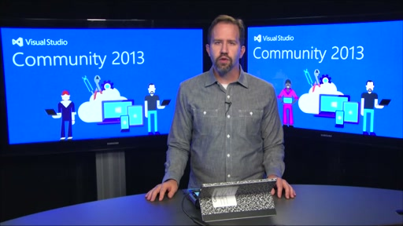

# Visual Studio Community 2013
### November 12, 2014

Visual Studio Community 2013 is a new edition that enables you to unleash the full power of Visual Studio to develop cross-platform solutions. Create apps in one unified IDE. Get Visual Studio extensions that incorporate new languages, features, and development tools into this IDE. (These extensions are available from the Visual Studio Gallery.) Find out more details about Visual Studio Community 2013 [here](https://www.visualstudio.com/products/visual-studio-community-vs).

## Download
You can download Visual Studio 2013 from [My.VisualStudio.com](https://www.visualstudio.com/vs/older-downloads/). My.VisualStudio.com requires a free [Dev Essentials](https://www.visualstudio.com/dev-essentials/) subscription, or a [Visual Studio Subscription](https://www.visualstudio.com/subscriptions/).

## What's in Visual Studio Community 2013

- Professional-grade editing, code analysis, and debugging support
- Support for open-source workflows (Git)
- Compilers for managed languages, C++ and more
- Cross-platform mobile development for your preferred device and platform, including the web, Android, iOS, and Windows Phone with the free Visual Studio Tools for Apache Cordova extension
- Take advantage of cloud services with simplified Azure SDK integration, and incorporate modern app analytics and telemetry with Application Insights
- Access to all the Visual Studio 2013 extensions on the [Visual Studio Gallery](https://visualstudiogallery.msdn.microsoft.com/)
- Visual Studio Community 2013 includes Update 4, which is a cumulative update of all previous Visual Studio 2013 updates

Watch the [Visual Studio Community 2013 video](http://channel9.msdn.com/Events/Visual-Studio/Connect-event-2014/040) to learn all about what you can do with this release:

Several other Visual Studio 2013 products are available for download with Update 4, including the following:

- Visual Studio 2013 Update 4
- Azure SDK for .NET 2.5
- Visual Studio Tools for Unity (VSTU) 2.0 Preview
- Kinect for Windows 2.0 SDK RTW
- Visual Studio Tools for Apache Cordova CTP3
- TypeScript 1.3

To get more details on these releases, go to the [release notes for Visual Studio 2013 Update 4](https://www.visualstudio.com/news/vs2013-update4-rtm-vs).
