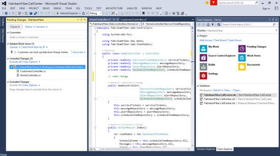
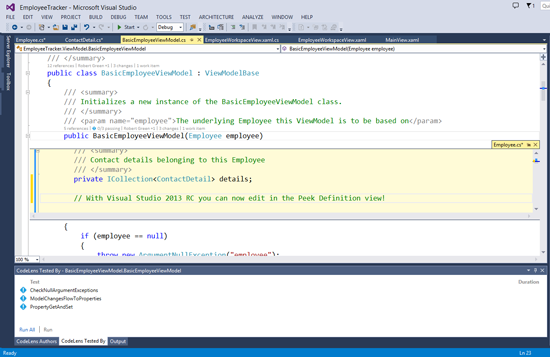
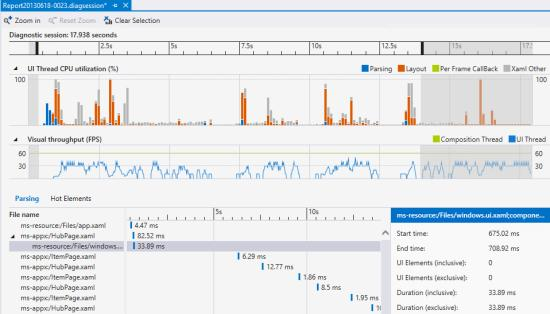
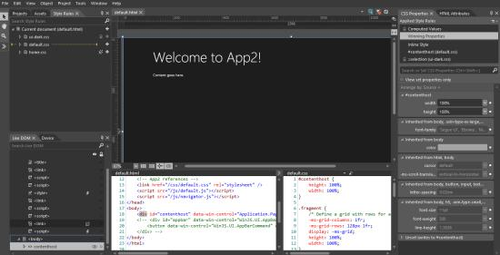
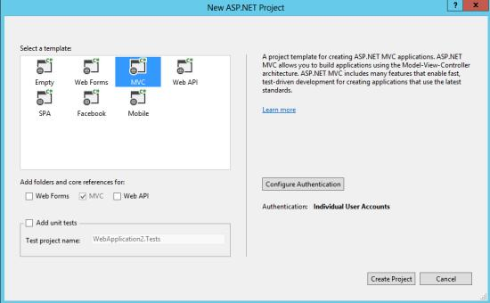
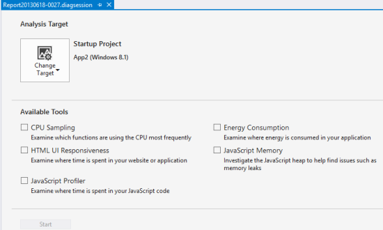
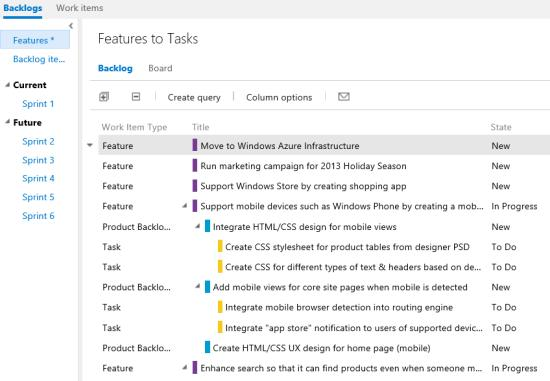
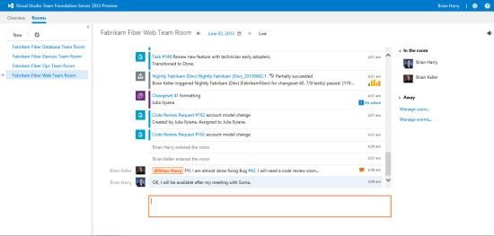
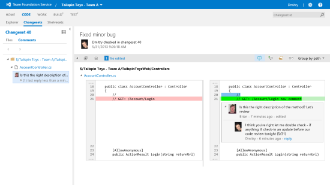
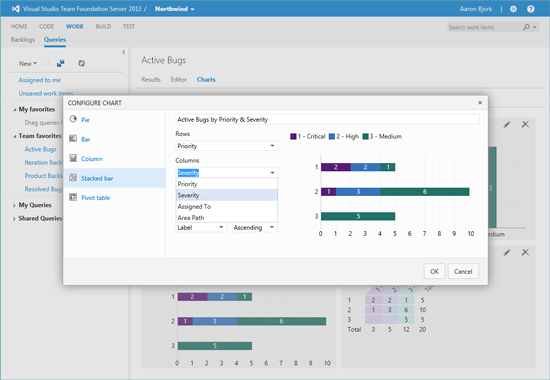

#  What's New in Visual Studio 2013

### October 17, 2013

## Visual Studio 2013 Highlights

There has been a fundamental shift to device and services experiences altering how the industry approaches software development. Consumers, customers, and employees now demand a new breed of applications. They demand applications that provide the best experience across multiple screens and devices, always-connected services for data they need, security, and continuous evolution.

Visual Studio 2013 builds on the advances delivered in Visual Studio 2012 and subsequent Visual Studio Updates to provide the solution needed for development teams to embrace this transformation and to develop and deliver new modern applications that leverage the next wave in Windows platform innovation (Windows 8.1), while supporting devices and services across all Microsoft platforms.

Below are just some of the highlights in this release, including: innovative features for greater developer productivity, support for Windows 8.1 app development, web development advances, debugging and optimization improvements for native and managed code, and expanded ALM capabilities.

### Download
You can download Visual Studio 2013 and Team Foundation Server 2013 from [My.VisualStudio.com](https://www.visualstudio.com/vs/older-downloads/). My.VisualStudio.com requires a free [Dev Essentials](https://www.visualstudio.com/dev-essentials/) subscription, or a [Visual Studio Subscription](https://www.visualstudio.com/subscriptions/).

### Innovative Features for Greater Developer Productivity

Visual Studio 2013 includes many user interface improvements based on customer feedback and Microsoft’s core design principle of keeping the focus on the content to deliver an improved user experience. You may notice the more than 400 modified icons with greater differentiation and increased use of color, a redesigned Start page, and other subtle design changes throughout Visual Studio.

Visual Studio 2013 includes a number of improvements to help you be more productive and stay focused when coding. Some features first appeared as experiments in the Visual Studio Power Tools extension before being refined and incorporated into Visual Studio. Productivity features such as automatic bracket completion, the ability to move code lines or blocks using keyboard shortcuts, and in-line navigation are now built-in. In addition, Visual Studio 2013 includes a new Team Explorer with an enhanced Home page that provides easier navigation to team collaboration features, including the ability to undock Pending Changes and Builds into a separate window.

When you work with large code files it can be hard to keep track of where you are. In Visual Studio 2013, you can easily switch the behavior of the scroll bar between two modes. In bar mode, you can view annotations such as your caret position, change your location, and track errors more directly. In map mode, the scroll bar shows a live preview of source code as well as the ability to hover over code to preview it greater detail within a tooltip. You can then click on the exact code position which navigates to that location.

Understanding what a line of code does is a key task during development. The Go To Definition command is now accompanied by the new Peek Definition feature. With Peek Definition you no longer have to leave the context of your line of code to view a definition in an inline view.

Understanding what a line of code does is only part of your challenge as a developer. You must also understand its history, who worked on it, what code references it, and more. This becomes especially challenging in team-oriented projects. CodeLens (Code Information Indicators) in Visual Studio Ultimate 2013 uses information from both your project metadata and Team Foundation Server 2013 to place decorators on each of the methods in your code that show information such as what changesets led to the creation or recent change, who was the last person to work on the code, what unit tests cover the method (including the latest pass/fail state), and what code references exist. You can also quickly jump into that data, such as an associated changeset or referenced code file with just a click.

Visual Studio 2013 introduces a connected IDE experience, enabling you to get started with Visual Studio 2013 more quickly. When you start Visual Studio 2013 for the first time, you’ll be asked to sign in using your Microsoft account, which you might already use with your MSDN or Team Foundation Service subscriptions. Once signed in, your copy of Visual Studio 2013 will be registered for your use without the need for any extra steps. Visual Studio 2013 will also automatically synchronize settings across your devices utilizing the Connected IDE experience. Synchronized settings include categories such as keyboard shortcuts, Visual Studio appearance (theme, fonts, etc.) and more, all while keeping you in full control through the Synchronized Settings options.

### Support for Windows 8.1 App Development

Visual Studio 2013 provides the ideal toolset for building modern applications that leverage the next wave in Windows platform innovation (Windows 8.1), while supporting devices and services across all Microsoft platforms. Support for Windows Store app development in Windows 8.1 includes many updates to the tools, controls and templates, new Coded UI test support for XAML apps, UI Responsiveness Analyzer and Energy Consumption profiler for XAML & HTML apps, enhanced memory profiling tools for HTML apps, and improved integration with the Windows Store.

Blend for XAML has been enhanced with significant new capabilities for Windows Store app design, such as the addition of rulers and custom guides for more precise content layout as well as improved styling capabilities. Blend for HTML also inherits these enhancements and adds specific new capabilities for building Windows Store apps with HTML, such as the new timeline for animating changes in CSS.

The coding experience for Windows Store apps has been enhanced in Visual Studio 2013. The XAML editor now provides advances in IntelliSense, which is now also available for data binding, template binding, and resources. It also enables a more productive transition between design markup and code behind; including support for finding references, going to definition, and switching to the view model. These, along with other improvements will help cut down the work when creating Windows Store apps.

Connecting your Windows Store apps is also easier with the addition of Windows Azure Mobile Services that expose your app to a host of scenarios such as easily enabling Push Notifications and data storage and manipulation in the cloud.

### Web Development Advancements

Creating websites or services on the Microsoft platform provides you with many options, including ASP.NET WebForms, ASP.NET MVC, WCF or Web API services, etc. In the past, working with each of these approaches in Visual Studio meant working with separate project types and tooling isolated to that specific project’s capabilities. The One ASP.NET vision unifies your web project experience in Visual Studio 2013 so that you can create ASP.NET web applications using your preference of ASP.NET component frameworks in a single project. This new unified experience includes the ability to easily create hybrid applications that include improved versions of ASP.NET WebForms, MVC or Web API, all in a single project. Now you can mix and match the right tools for the job within your web projects, giving you increased flexibility and productivity when developing for the web.

If you design web pages, or implement the designs of others, you probably spend a significant portion of your time tweaking HTML and CSS while refreshing browser windows again and again to achieve the exact experience you want to create. This is further complicated by the diversity of available web browsers your visitors might be using to view your site. Visual Studio 2013 eliminates this back and forth using Browser Link, which connects Visual Studio to one or more open modern browsers in an interactive development experience to keep them in synch with your markup changes without needing manual browser refreshes to see the changes you’re making.

### Create Modern Business Apps for Office 365

With Visual Studio 2013, you can create and manage modern business applications that extend the Office 365 experience to help people interact with business processes, artifacts, and other systems. Office 365 Cloud Business Apps run in the cloud, taking advantage of the rich platform capabilities exposed by Windows Azure and Office 365. As cloud-based apps, they are available to a myriad of devices to aggregate data and services from in and out of an enterprise, and integrate user identities and social graphs. These applications integrate with the application lifecycle management capabilities of Visual Studio, bridging the worlds of the business app developer with IT operations.

### Debugging and optimization Improvements

The new Performance and Diagnostics hub in Visual Studio 2013 provides a unified experience for various tools available in Visual Studio. The hub also makes it easy to identify the performance and diagnostic tools that work with your project and enables you to quickly start using them to improve your application.

Memory Dump Analyzer in Visual Studio 2013 makes it easier for you to diagnose memory problems in production environments by analyzing .NET memory heap dumps right from Visual Studio. Using the new memory analysis capability, you can solve memory leaks and inefficient memory usage by seeing size and counts, the largest instances of objects, and what is holding them alive in memory. You can also compare two memory dumps to gain insight into how memory usage is changing over time.

When debugging 64-bit .NET 4.5.1 applications in Visual Studio 2013, you can now “edit-and-continue” just as you do with 32-bit managed applications. In addition, asynchronous debugging is improved across Visual Basic, Visual C#, Visual C++, and JavaScript in Visual Studio 2013. When running on Windows 8.1, the call-stack window now includes the logical call stack if you hit a breakpoint or exception in an asynchronous method. Beyond diagnostics support, .NET 4.5.1 includes other improvements, such as support for on-demand compaction of the GC’s large object heap, and faster startup of apps when running on multicore machines.

In Visual Studio Ultimate 2013, you can diagnose errors and performance issues in apps monitored by System Center 2012 R2 Operations Manager. You can import exception and performance events as IntelliTrace log (.iTrace) and use IntelliTrace in Visual Studio to step through code execution for those events.

In addition to features that improve support for C++11, such as delegating constructors, raw string literals, explicit conversion operators, and variadic templates alongside “just my code” debugging in Visual Studio 2013 makes working with C++ even better. The ability to filter the call stack down to just the code you wrote when debugging has long existed for managed languages and is now available for C++.

PGO (Profile Guided Optimization) is a runtime Visual C++ compiler optimization that leverages profile data collected from running important or performance-centric user scenarios to build an optimized version of an application. The Profiling Tools in Visual Studio 2013 give insight into PGO optimization decisions, which helps you to understand how well that profile data corresponds to real-world performance by showing how the profiled hotter code paths (common user scenarios) and colder code paths (less common user scenarios) of an application correspond to what code was optimized by PGO and how (size or speed).

### Expanded ALM Capabilities

Visual Studio 2013 incorporates a wave of new Application Lifecycle Management (ALM) features that will help your teams be more productive and collaborate with improved support for agile development practices that you can adopt incrementally to suit the needs of your organization. Features such as agile portfolio management, team rooms, web-based code comments on changesets/commits, and web-based test case management improvements are part of an integrated solution to help your team collaborate better and increase productivity.

The core for Visual Studio’s ALM capabilities is provided by Team Foundation Server, which can be installed on a server on premises, or Team Foundation Service, which is hosted in the cloud. So whether the team prefers the increased control and customization of an on-premises installation, or the maintenance-free accessibility of the cloud, there's an option that fits your team’s needs.

With Agile Portfolio Management you can manage large and complex workloads in an agile way. You can define a hierarchy of backlogs to understand the scope of work across several teams and see how that work rolls up into broader initiatives.

Team rooms provide an area for fostering and capturing communication among team members, both near and far. In a Team Room you can discuss work in progress, ask questions, share status, and clarify issues as they arise. Your team room is your team projects activity feed for keeping the team informed of code check-ins, build status, work assignment, and more. By using the team room instead of email, you automatically receive an audit trail of conversations and decisions that you can review at any time and search. A Team Room is created by default for each project, and you can create additional rooms to support ad-hoc discussions and cross-team collaboration.

Team Foundation Server 2013 now supports Git repositories. In addition, you can now use the web-based Version Control Explorer in Visual Studio 2013 to create or reply to comments on changesets, shelvesets, or Git commits to engage in conversations with your team on source code changes. You can also find comments easily by using the Version Explorer filter.

With support for cloud-based load testing in Team Foundation Service, you can generate scale tests in seconds that utilize the elastic resources of Windows Azure to execute requests from thousands of virtual users; providing you with insight into the performance bottlenecks of your web applications and services without the hassle of managing hardware or a virtual lab.

Improvements in web-based Test Case Management enable you to create or manage Test Plans and suites right from the web interface. You can also run tests from non-Windows operating systems using any modern web browser, enabling your testers to stay productive from any work environment.

Also new in Team Foundation Server 2013 is Work Item Charting. Quickly create a variety of charts to visualize data based from your work item queries, such as bugs, user stories, and tasks.

## Pricing and Licensing

In addition to all of the new and exciting capabilities detailed above, we are pleased to offer Visual Studio 2013 at Visual Studio 2012 pricing. Also, MSDN subscribers gained new benefits at no additional cost since the release of Visual Studio 2012, including dev and test use rights for Microsoft’s latest releases such as Windows 8.1 and Windows Server 2012 R2, monetary credits to spend on Windows Azure services, discounted rates for Windows Azure Dev/Test scenarios and developer accounts for the Windows Store, Windows Phone Store, and an Office 365 Developer subscription.

Buying Visual Studio with an MSDN Subscription is the most popular way to purchase Visual Studio and gain access to the [most comprehensive collection of software, services, and benefits](https://msdn.microsoft.com/subscriptions/aa718661) for targeting Microsoft platforms. Active MSDN Subscribers will have the earliest access to the final release of Visual Studio 2013 in mid-October. Visual Studio 2013 with MSDN will be available through Volume Licensing on November 1st, and from retail resellers soon after; however, you can [purchase Visual Studio 2012 with MSDN today](https://www.visualstudio.com/en-us/products/msdn-subscriptions-vs) and receive Visual Studio 2013 upon its release.

As the entry-level professional product, Visual Studio Professional is the mainstay tool of choice for many developers around the world. With these developers in mind, we created a special, limited-time offer through the Microsoft Store for those who purchased Visual Studio Professional 2012 at retail to upgrade to Visual Studio Professional 2013 for only US$99 (pricing varies by region). For more information, see [Visual Studio on the Microsoft Store](https://www.microsoft.com/visualstudio/redir/microsoft-store)in early November. After this offer expires on January 31, 2014, Visual Studio Professional 2013 Upgrade will be available from the Microsoft Store and through resellers at the estimated retail price of US$299. The estimated retail price for Visual Studio Professional 2013 is US$499.

Lastly, with the release of Visual Studio 2013, agile project planning capabilities are now more accessible for project managers with Backlog Management and Sprint Planning capabilities available for Team Foundation Server 2013 Client Access License (TFS CAL) customers at no additional cost.

[Top of Page](#top)