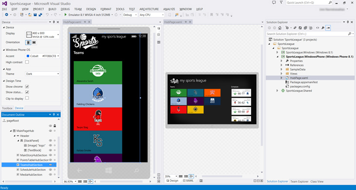
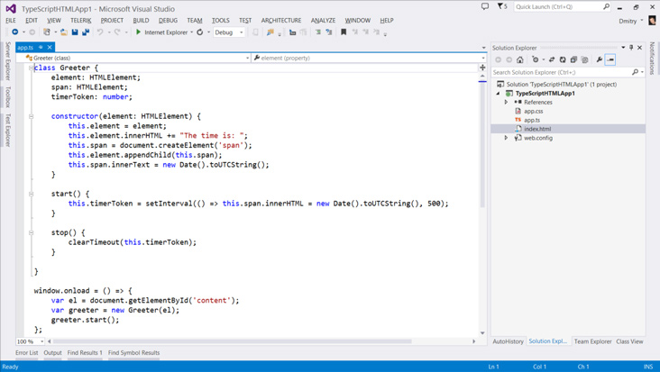

#  Visual Studio 2013 Update 2 RTM

### May 12, 2014

We’re happy to announce the availability of Visual Studio 2013 Update 2, the latest developer tooling for building great apps. This release includes many new features (as described below) such as targeting the new Windows Phone 8.1 platform or building universal Windows apps that can target multiple Windows form factors from a single solution.

- [Windows Phone 8.1 and Universal Windows Apps](#UniversalWindowsApps)
- [Azure Development](#Azure)
- [Web Development](#WebDevelopment)
- [Visual C++ Linker Enhancements](#CPP)
- [General Debugging and Analyzers](#DebuggingAndAnalyzers)
- [IntelliTrace](#IntelliTrace)
- [DirectX Profiling and Debugging](#DirectXProfilingAndDebugging)
- [Release Management](#ReleaseManagement)

*To learn what’s new in Team Foundation Server Update 2, see our previous release notes ([Visual Studio 2013 Update 2 (Build 2014)](https://www.visualstudio.com/news/2014-apr-2-vs))*

## Download
You can download Visual Studio 2013 and Team Foundation Server 2013 from [My.VisualStudio.com](https://www.visualstudio.com/vs/older-downloads/). My.VisualStudio.com requires a free [Dev Essentials](https://www.visualstudio.com/dev-essentials/) subscription, or a [Visual Studio Subscription](https://www.visualstudio.com/subscriptions/).

##  Windows Phone 8.1 and Universal Windows Apps

### How to get started?

With this release, we have changed what software developers must install to begin building Windows Phone 8.1 and universal Windows Apps:

- There is no longer a separate Visual Studio 2013 Express version for Phone development. Instead, Express users only need to install Visual Studio 2013 Express for Windows with Update 2
- Developers using Visual Studio 2013 Professional (or above) simply need to install Update 2

### Create apps for Windows Phone 8.1

Create apps targeting the new Windows Phone 8.1 release either by upgrading existing Windows Phone 8.0 Silverlight apps or by creating new Windows Phone 8.1 apps that run on Windows Phone 8.1 Silverlight or Windows Runtime built with .NET and XAML or WinJS. You can also create both Windows Phone 8.1 and universal Windows apps using C++ and DirectX. For the full list of options, go to the [Windows Phone Dev Center](https://msdn.microsoft.com/library/windowsphone/develop/br211361.aspx).

If you choose Windows Phone 8.1 to build or update existing phone apps using the [Silverlight app model](https://go.microsoft.com/fwlink/?LinkID=394712), you’ll gain access to new platform capabilities such as geofencing, roaming app data, media editing, a much more.

If you choose to build apps using the newly available Windows Runtime, you’ll gain new platform capabilities along with enhanced tooling support for creating apps using HTML and JavaScript (WinJS). In addition, phone apps built using the Windows Runtime platform share the same app model and app lifecycle previously available only to Windows Store apps, as well as the option for creating universal Windows apps that share code; making it easier to create apps that run on both Windows and Windows Phone (read more below).

For more details on what’s new for Windows Phone 8.1 app developers visit the [Windows Phone development center](http://dev.windowsphone.com/).

### Universal Windows Apps

If you were previously creating apps for both Windows Store and Windows Phone, you had no path in Visual Studio that made it easy to target both platforms from one solution, while sharing app lifecycle code, user interface elements, etc.

With the release of Update 2, you can now build apps that target both Windows and Windows Phone platforms from a single solution; building apps that run on Windows Runtime and are able to target various form factors in the family of Windows devices.

To get started, the new universal Windows app project templates are available to help you create one app where your business logic surfaces through a user experience relevant to the device; whether for Windows phones and tablets or Windows laptops and workstations.

For more details overall, visit the [Windows Development Center](https://dev.windows.com/).

### Performance and Diagnostics Hub

For Windows Store and Windows Phone 8.1 apps that target the Windows Runtime platform, you can now run more than one tool at a time in the Performance and Diagnostics hub ([Combining Tools in the Performance and Diagnostics hub in Visual Studio 2013](http://blogs.msdn.com/b/visualstudioalm/archive/2014/02/11/combining-tools-in-the-performance-and-diagnostics-hub-in-visual-studio-2013.aspx)), which means that you can correlate data across tools, make informed performance tradeoffs, and generally save time.

In addition, a newly available Memory Usage tool ([Diagnosing memory issues with the new Memory Usage Tool in Visual Studio](http://blogs.msdn.com/b/visualstudioalm/archive/2014/04/03/diagnosing-memory-issues-with-the-new-memory-usage-tool-in-visual-studio.aspx)) enables you to investigate application memory, which makes it easier to find issues such as memory leaks.

### Improved Debugging – Cached Resources

In Windows 8.1 apps, it is possible to cache resources for your app before the app launches. In this update, you can manually trigger this caching so you can test your app's behavior or to simply make sure that you've registered ContentPrefetcher properly.

### Test Notifications – Azure Notification Hub

With this release, we’ve added a new troubleshooting tool that enables you to send test messages ([Notification Hubs: Send Test Notifications](http://blogs.msdn.com/b/windowsazure/archive/2014/04/09/deep-dive-visual-studio-2013-update-2-rc-and-azure-sdk-2-3.aspx#NotificationHubs)) while in Visual Studio; making it even easier to ensure notifications are working correctly for your Windows Store, Phone, or universal Windows apps.

##  Azure Development

While many Microsoft Azure capabilities are typically made available through the Azure SDK, some features are built right into Visual Studio itself. With Update 2, we are making the following new features available:

### IDE Enhancements

If you are developing for Microsoft Azure, you can find an improved getting started experience. We offer a new capability that can link newly created web sites directly from File|New Project to a Microsoft Azure web site or Virtual Machine; making it easy to publish later.

In addition, you can use Server Explorer for Microsoft Azure Websites to view or edit live website files or view log files remotely.

### .NET Mobile Services

Working with Mobile Services powered by .NET is now available right from Visual Studio ([Quickstart: Add a mobile service](https://msdn.microsoft.com/library/windows/apps/xaml/dn629482.aspx)). With this release, you’ll find new tooling support, including a template to help get started with a new project type and support for Remote Debugging.

### Related – Windows Azure SDK 2.3

We’ve also recently shipped the [Microsoft Azure 2.3 SDK](http://azure.microsoft.com/downloads/), which adds even more new capabilities to Visual Studio developers working with Azure. This includes new Server Explorer enhancements such as:

- Remote debugging of native/managed code
- View/Edit remote files and view logs in websites

And there’s more. Learn about all the features from the [Windows Azure Blog: Deep dive: Visual Studio 2013 Update 2 RC and Azure SDK 2.3](http://blogs.msdn.com/b/windowsazure/archive/2014/04/09/deep-dive-visual-studio-2013-update-2-rc-and-azure-sdk-2-3.aspx).

***Tip*** – *Visual Studio 2013 Update 2 does not include the Azure SDK, get it from the MIcrosoft Azure download center.*

##  Web Development

With the release of Update 2, we’re shipping many new features for web developers, including TypeScript 1.0 RTM, a powerful new language and tooling experience for developers building application-scale JavaScript projects. In addition, we’re releasing other new features and improvements ([ASP.NET and Web Tools 2013.2 for Visual Studio 2013 Release Notes](http://www.asp.net/visual-studio/overview/2013/aspnet-and-web-tools-20132-preview-for-visual-studio-2013-release-notes)) for web development in tooling and the ASP.NET platform (including updates for MVC, Web API, and Web Pages). Read on for details.

### TypeScript 1.0

[TypeScript](http://www.typescriptlang.org/) is an open-source language developed by Microsoft for application-scale JavaScript projects, powered by a typed superset of JavaScript that compiles to plain JavaScript. TypeScript, combined with Visual Studio, is a first-class experience with features such as static checking, symbol-based navigation, code refactoring, and much more.

In this release, TypeScript has reached version 1.0 (RTM), bringing the language to the first official release after 18 months of development and much excitement from the developer community.

### Web Code Editor Enhancements (SASS, LESS & JSON)

We’ve further improved our code editor by adding support for additional file formats: SASS, and JSON. We’ve also improved our LESS editor with new capabilities.

The new SASS editor includes features such as colorization, variable and Mixins IntelliSense, syntax validation, goto definition, a color picker, and more. We’ve also enhanced the LESS editor with features such as Knockout IntelliSense Upgrade and a new URL picker for HTML, Razor, CSS, LESS, or SASS pages, and more.

The new JSON editor offers features such as syntax validation, colorization, outlining, and support for IntelliSense through the JSON schema.

### Browser Link

Browser Link enables developers to connect multiple browsers right to Visual Studio and refresh them all by clicking a single button. For more information, see [Using Browser Link in Visual Studio 2013](http://www.asp.net/visual-studio/overview/2013/using-browser-link).

In this release, we’ve enhanced Browser Link to support HTTPS connections, Single Page Applications (SPA), and static HTML files.

### Project Templates

We’ve updated ASP.NET default project templates to include the latest platform releases, such as ASP.NET MVC, Web API, Web Pages, SignalR, and more.

### Debugging Mobile Websites

If you have spent any amount of time trying to make a compelling mobile version of your website, you most likely have experienced issues with it not looking or working correctly on mobile browsers.

In this release, we’re making this a much better experience for developers that want to use the Windows Phone Emulator with Internet Explorer by enabling the use of Visual Studio’s debugging and performance tools while testing your web page in the phone emulator ([Diagnosing Mobile Website Issues on Windows Phone 8.1 with Visual Studio](http://blogs.msdn.com/b/visualstudioalm/archive/2014/04/04/diagnosing-mobile-website-issues-on-windows-phone-8-1-with-visual-studio.aspx)).

##  Visual C++ Linker Enhancements

In Update 2 we have added a few features that should improve link times:

- **/Zc:inline**: Remove unreferenced data and functions. This has a significant throughput impact for all of your projects.
- **PDB Improvements**: Reduce time spent generating PDB files. This has a significant throughput impact for binaries with medium to large amounts of debug information.
- **/cgthreads**: Parallelize the code-generation and optimization build phase. This is provides significant wins for medium to large binaries generated with the /LTCG option.

For more information, see [Linker Enhancements](http://blogs.msdn.com/b/vcblog/archive/2014/03/25/linker-enhancements-in-visual-studio-2013-update-2-ctp2.aspx).

##  General Debugging and Analyzers

### Visual Studio Debugger

Previously, if you needed to understand JSON payloads stored in string variables during debugging, you had no built-in visualizer to help make this easier.

In this release, we’ve added a new string visualizer ([JSON Debugger Visualizer in Visual Studio 2013](http://blogs.msdn.com/b/visualstudioalm/archive/2014/02/06/json-debugger-visualizer-in-visual-studio-2013.aspx)) for debugging JSON-encoded strings right from Visual Studio. The visualizer shows payloads in a treeview control so it's easy for you to search, highlight, or copy key/value pairs.

### .NET Managed Memory Analyzer

The .NET Managed Memory Analyzer ([Using Visual Studio 2013 to Diagnose .NET Memory Issues in Production](http://blogs.msdn.com/b/visualstudioalm/archive/2013/06/20/using-visual-studio-2013-to-diagnose-net-memory-issues-in-production.aspx)) helps you understand the .NET memory use of an application from .dmp files collected on production machines.

In this release we’ve added the ability to inspect the values of objects and instances in captured memory dumps ([.NET Memory Analysis: Object Inspection](http://blogs.msdn.com/b/visualstudioalm/archive/2014/02/06/net-memory-analysis-object-inspection.aspx)), making the analyzer even more useful.

### CPU Usage Tool

A new CPU Usage tool is now available in the Performance and Diagnostics hub that can be used with WPF, Console, Windows Store 8.1, or Windows Phone 8.1 apps.

This tool provides data on which functions are using the CPU and to what degree. This information empowers you to make decisions about where to focus your optimization efforts to achieve the best possible app performance. For more information, see [CPU Usage](http://blogs.msdn.com/b/visualstudioalm/archive/2014/02/28/new-cpu-usage-tool-in-the-performance-and-diagnostics-hub-in-visual-studio-2013.aspx).

##  IntelliTrace

### Performance Events

IntelliTrace just got smarter when working with performance events collected by the Microsoft Monitoring Agent (MMA).

We’ve added the ability to analyze performance data in depth by grouping performance events and reviewing hot paths ([UI Enhancements for IntelliTrace with Visual Studio 2013 Update 2](http://blogs.msdn.com/b/visualstudioalm/archive/2014/02/11/ui-enhancements-for-intellitrace-with-visual-studio-2013-update-2.aspx)). You can also Inspect SQL queries with Visual Studio tooling when you have ADO.NET event data available ([Jump to SQL with IntelliTrace](http://blogs.msdn.com/b/visualstudioalm/archive/2014/02/10/jump-to-sql-with-intellitrace.aspx)) or navigate easily to Actions/Controllers when you have data collected from ASP.NET MVC web sites ([IntelliTrace MVC Navigation](http://blogs.msdn.com/b/visualstudioalm/archive/2014/02/12/intellitrace-mvc-navigation.aspx)).

### Visualizing Exceptions in IntelliTrace Data

When reviewing an IntelliTrace file with Exceptions data that was collected by MMA, it is now easier to view parameters and to see where exceptions were thrown by visualizing the call stack on a Code Map ([Enhancements to Debugging Exceptions with IntelliTrace in Visual Studio 2013](http://blogs.msdn.com/b/visualstudioalm/archive/2014/03/07/enhancements-to-debugging-exceptions-with-intellitrace-in-visual-studio-2013.aspx)).

##  DirectX Profiling and Debugging

### New Graphics Profiler

We added a new tool for optimizing the rendering performance of your Direct3D game or app with [Graphics Frame Analysis](https://msdn.microsoft.com/library/dn642453.aspx). Unlike simply recording performance information during capture, frame analysis generates performance information later by timing events and collecting statistics during playback.

This means you can see an average of results from multiple playbacks, ensuring statistically sound data. It also means you can generate performance information for configurations and devices other than the one used for capture.

Frame analysis works the same way on Windows 8.1 and Windows Phone 8.1 devices, relying on a new timestamp query that was not available in Windows Phone 8.

### Graphics Debugger Enhancements

Enhancements to the Graphics Debugger include the ability to capture up to 30 consecutive frames with one capture (consecutive capture). You can also programmatically trigger automatic capture, which is helpful for debugging compute shaders in programs that never call Present, or when a rendering problem makes it hard to know when to expect a capture during manual testing ([Walkthrough: Capturing Graphics Information Programmatically](https://msdn.microsoft.com/library/hh780905.aspx)).

Use the new Draw Calls view to see captured events and their state in an organized hierarchy, or expand it to see the current device state at the time of the draw call or the events that set their values.

It is also now possible to use the graphics debugger with your Windows Phone 8.1 apps in the emulator or on a tethered phone; both scenarios are now fully supported.

##  Release Management

Updates to Release Management make it easier to deploy your apps to groups of servers, which saves considerable time.

### Server Groups

Most applications have multiple tiers, and most tiers run on several servers. Until now, in order to deploy a component to all servers in a tier, you had to author the same deployment sequence with the same set of steps on each server. This was not only a lot of repetitive work, it wasn’t maintainable.

With Update 2, you can now tag servers so that you author the deployment sequence once for a group of servers with the same tag ([Visual Studio Release Management 2013 Update 2 RC now available](http://blogs.msdn.com/b/visualstudioalm/archive/2014/04/03/visual-studio-release-management-2013-update-2-rc.aspx)). This deployment sequence will run automatically on all servers with the same tag in parallel when a release is triggered.

[Top of Page](#top)