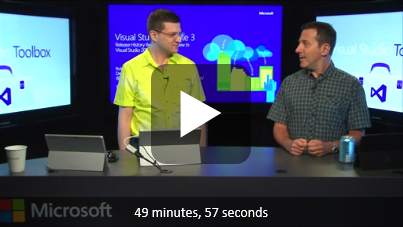
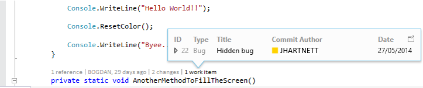
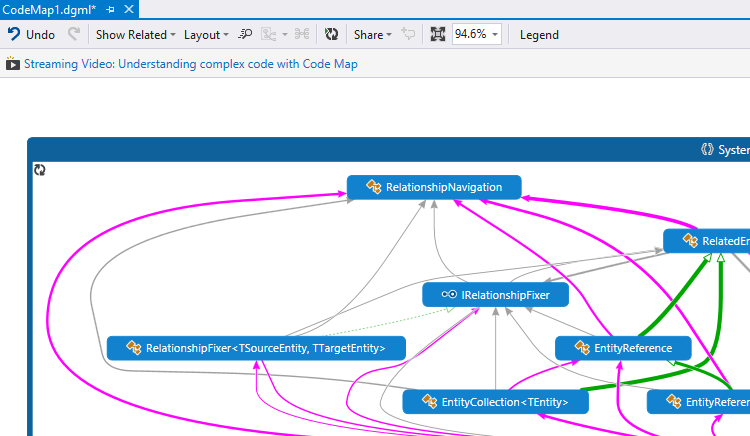
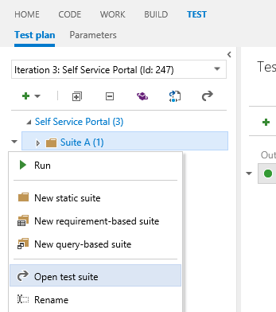
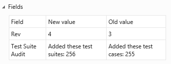
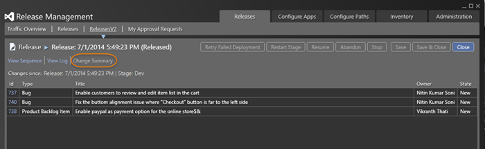

#  Visual Studio 2013 Update 3 RC

### July 2, 2014

Today, we are happy to announce the availability of Visual Studio 2013 Update 3 (Visual Studio 2013.3) Release Candidate (RC). This release includes some exciting new features, including: support for more ways to deploy your app using DSC, PowerShell, or Chef; customization for test plans and test suites; and the addition of Application Insights Tools to Visual Studio.

This update is the latest in a cumulative series of feature additions and bug fixes for Visual Studio 2013. In addition, several Visual Studio 2013 products are available for download with Update 3 included.

[Download Visual Studio 2013 Update 3 (2013.3)](https://support.microsoft.com/kb/2933779)

**Note** This download link now points to the RTM version of the update.

To get more details on what's new for Update 3, go to the sections below.

- [CodeLens](#CodeLens)
- [Code Map](#CodeMaps)
- [Visual Studio Menu Bar Options](#MenuBarOptions)
- [Debugger](#Debugger)
- [Performance and Diagnostics](#PerfAndDiag)
- [IntelliTrace](#IntelliTrace)
- [Application Insights](#AppInsights)
- [Testing](#Testing)
- [C++](#C++)
- [Graphics Diagnostics](#GraphicsDiagnostics)
- [ClickOnce Deployment](#ClickOnce)
- [SharePoint Apps](#SharePoint)
- [Release Management](#ReleaseManagement)

Dmitry Lyalin joins Robert Green to show a number of new and exciting features in the RC on the [Visual Studio 2013 Update 3 RC episode of Visual Studio Toolbox](http://channel9.msdn.com/Shows/Visual-Studio-Toolbox/Visual-Studio-2013-Update-3-RC):

For a complete description of technology improvements in this release, including fixed and known issues, see [Description of Visual Studio 2013 Update 3 RC](https://go.microsoft.com/fwlink/?LinkId=397828).

##  CodeLens

Use CodeLens indicators in the editor to learn about your code while staying focused on your work. You can find code references, changes to your code, related Team Foundation Server items, and unit tests – all without looking away from the code. To learn more about CodeLens, see  [Get history and other info about your code](https://msdn.microsoft.com/library/dn269218.aspx).

### CodeLens support for Git repositories

For Update 3, CodeLens now works with Git repositories to provide CodeLens indicators for authors and changes to your code. You can also view the work items associated with a method, property or class. These indicators are updated when a user commits, the Git repository is pulled or fetched, or the branch is changed.

For more information, see  [Code Lens for Git in Visual Studio 2013 Ultimate Update 3](http://blogs.msdn.com/b/visualstudioalm/archive/2014/05/23/code-lens-for-git-in-visual-studio-2013-ultimate-update-3.aspx). (Minimum edition: Ultimate)

##  Code Map

Code maps help you avoid getting lost in large code bases, unfamiliar code, or legacy code. For example, when you're debugging, you might have to look at code across many files and projects. Code maps help you navigate around these pieces of code and see relationships between them. You don't have to remember all this code, keep track of files, or draw a separate paper diagram. To learn more about code maps, see  [Map dependencies in specific code using code maps in Visual Studio](https://msdn.microsoft.com/library/jj739835.aspx).

### Color-coding for links

Links on code maps are now styled with colors to make it easier to quickly understand the map. You can use the Legend to understand what each color represents. (Minimum edition: Ultimate)

### Improved zoom

Before this update, if there were a lot of methods in the call stack the code map would size to fit. This could become unreadable. Now the code map keeps the zoom level that you set and minimizes panning so that you can still see as much context as possible. In addition, the current call stack or active call stack entry are always visible so that you know where you are. (Minimum edition: Ultimate)

### Drag and drop binaries to maps

Simply create a new directed graph in Visual Studio and drag binaries from File Explorer and drop them onto this graph. Now you can explore these binaries. For example, you can show the assemblies that they reference. (Minimum edition: Ultimate)

For more information, see  [Code Map improvements in Visual Studio 2013 Ultimate Update 3](http://blogs.msdn.com/b/visualstudioalm/archive/2014/05/27/code-map-improvements-in-visual-studio-2013-ultimate-update-3-ctp1.aspx).

##  Visual Studio Menu Bar Options

In Update 3 you can choose whether to display Visual Studio menu bars in all caps or in title case. You can find the checkbox in **Tools > Options > Environment > General**. The default value is All Caps. This option maps to the user's current registry state, so that users who have already turned off All Caps in the registry will continue to see title case menus. This option automatically roams to all signed-in devices. (Minimum edition: Express)

##  Debugger

### Multi-monitor support

After you move a Windows Store app to a different monitor while debugging, the app will reappear in that monitor the next time you start debugging. For more information, see  [Multiple Monitor Support for Windows Store Apps in Visual Studio 2013 Update 3](http://blogs.msdn.com/b/visualstudioalm/archive/2014/05/23/multiple-monitor-support-for-windows-store-apps-in-visual-studio-update-3.aspx). (Minimum edition: Express for Windows)

### Managed code memory dumps

A memory dump is a snapshot of an app's use of memory at the time when the dump is made. For more information, see [Using Visual Studio 2013 to Diagnose .NET Memory Issues in Production](http://blogs.msdn.com/b/visualstudioalm/archive/2013/06/20/using-visual-studio-2013-to-diagnose-net-memory-issues-in-production.aspx).

While you are debugging a memory dump, you can now select a type and navigate to the type's definition or its references by using **Go to Definition** and **Find All References**. For more information, see  [.NET Memory Analysis: Go to Source in Visual Studio 2013 Update 3](http://blogs.msdn.com/b/visualstudioalm/archive/2014/05/23/net-memory-analysis-go-to-source.aspx). (Minimum edition: Ultimate)

### Memory dump debugging support for .NET Native

You can now debug NET Native x86 applications, and debug memory dumps from .NET Native apps. (Minimum edition: Express)

##  Performance and diagnostics

### Importing and exporting Internet Explorer profiling sessions

The Performance and Diagnostics hub can open profiling sessions (.diagsession files) that were exported from F12 tools in the latest developer preview of Internet Explorer 11. For more information, see [Performance and Diagnostics Hub in Visual Studio 2013](http://blogs.msdn.com/b/visualstudioalm/archive/2013/07/12/performance-and-diagnostics-hub-in-visual-studio-2013.aspx). (Minimum edition: Express for Windows)

### CPU usage

The **CPU Usage** tool was introduced in  [Visual Studio 2013 Update 2](https://www.visualstudio.com/news/2014-apr-2-vs.aspx). You can find it in the **Performance and Diagnostics** hub that can be used with WPF, Console, Windows Store 8.1, or Windows Phone 8.1 apps written in C++, C#, Visual Basic, or JavaScript.

This tool provides data on which functions are using the CPU, so you can make decisions about where to focus your optimization efforts to achieve the best performance.

**Navigate to source**

You can now navigate from a function name in the **Call Tree** to the line of source code where the function is defined, so you can easily see the code that is using CPU in your application. For more information, see [New CPU Usage tool in the Performance and Diagnostics hub in Visual Studio 2013](http://blogs.msdn.com/b/visualstudioalm/archive/2014/02/28/new-cpu-usage-tool-in-the-performance-and-diagnostics-hub-in-visual-studio-2013.aspx). (Minimum edition: Express for Windows)

### Memory Usage

The **Memory Usage** tool, introduced in Visual Studio 2013, originally supported only Windows Store and Windows Phone Store apps using C#/VB/C++ and XAML. For more information, see  [Memory Usage Tool](https://msdn.microsoft.com/library/windows/apps/dn645469.aspx). (Minimum edition: Express for Windows)

Here are some features that were added to the tool:

**Support for WPF and Win32 Applications**

In Update 3, you can also use this tool with WPF (with .NET 4.0 and above) and Win32 apps. For more information, see  [New Memory Usage Tool for WPF and Win32 Applications](http://blogs.msdn.com/b/visualstudio/archive/2014/06/12/new-memory-usage-tool-for-wpf-and-win32-applications.aspx).

**Force GC**

Focus on objects that are important by explicitly forcing a garbage collection in your application to get rid of short-lived objects and objects in the Finalizer queue before taking a snapshot.

**Copy Multiple Rows**

No more copying data row by row. Copy and paste formatted content from multiple rows in any data grid in the heap analysis views using standard gestures like CTRL + Click.

**Module Column**

View the module from which a Type or a Stack Frame originated in the new Module column in the details views

**Faster native heap analysis**

Native heap analysis completes faster than ever. We delay load symbols for non-user assemblies until you explicitly turn off Just My Code. We have seen upwards of a 10X improvement in load times for large session files.

##  IntelliTrace

You can skip straight to the details of single performance events that were exported from Application Insights to IntelliTrace. (Minimum edition: Ultimate)

##  Application Insights

Application Insights is in preview.

Application Insights for Visual Studio Online is used to monitor your deployed applications. It can monitor web apps, Windows Store and Windows Phone apps. Use the Application Insights Tools for Visual Studio included in Update 3 to add this monitoring to your project:

- Find out what users are doing with your app, so that you can focus your development work where it’s most useful.
- Make sure your web service is available and responsive.
- Quickly diagnose any performance issues or exceptions in your web service.
- When people download and use your app, you’ll see statistical data in the Application Insights portal. For more information, see [Analytics for Windows Phone and Store apps](https://azure.microsoft.com/documentation/articles/app-insights-windows-get-started/). 

##  Testing

### Customize your test plans and test suites

One of the top feature requests from our users across various forums has been the ability to customize test plans and test suites to suit your testing needs. Now you can add  custom fields and workflows to test plans and test suites. For example, add an extra field to identify the reviewer for a test plan, or add a field for the test type to know if the test suite is for regression or functional tests. Also, you can change the default values for the state field to fit your process better.

Any fields you add or changes you make can be viewed or edited from Microsoft Test Manager or Team Web Access. Just open the test suite or test plan.

### Track changes to test plans and test suites

Use work item history to help you see which user made changes to test plans and test suites. Changes to work item fields are tracked in the same way as existing TFS work items. Changes are tracked for operations too. For example, you can view when test cases are added to a test suite from the All Changes tab in the History section.

### Enhanced security for test suites

A new permission to manage test suites has been added. The manage test suites permission controls access to:

- Creating and deleting test suites
- Adding and removing test cases from test suites
- Changing test configurations for test suites
- Moving test suites in a test plan

You can grant this permission to provide a different level of access at the area path level.

The existing permission to manage test plans will be changed to restrict access to specific test plan properties.

For more information, see  [Test Plan and Test Suite Customization with TFS2013 Update3](http://blogs.msdn.com/b/visualstudioalm/archive/2014/05/23/test-plan-and-test-suite-customization-with-tfs2013-update3.aspx).

### Cloud-based load testing with Application Insights

You don't need to use resources and set up your own machines to do load testing on your web site. You can use cloud-based load testing to provide virtual machines that generate the load of many users accessing your web site at the same time. When you run your load tests for your app using Visual Studio Online, you can use Application Insights to retrieve performance data as well. By correlating load and performance data together, you get more insight into any performance issues that you find.

With Update 3, you are no longer limited to the default counters. Now you can choose any performance counters from Application Insights that you want to see.

##  C++

### /Z0 Compiler Switch

**/Z0** is a compiler switch that generates richer debugging information for optimized code (non **/Od** builds). This includes improved support for debugging local variables. (Minimum edition: Express)

##  Graphics Diagnostics

Graphics Diagnostics tools in Visual Studio are designed to help you find graphics rendering and performance problems by letting you inspect your apps’ graphics events, shader code, graphics pipeline stages, resources, and device state for any frames that are captured using this tool. For more information, see  [Graphics Diagnostics Overview](https://msdn.microsoft.com/library/hh873207.aspx). (Minimum edition: Express for Windows)

In Update 3 RC, the Visual Studio Graphics Analyzer IDE is launched from Visual Studio when you analyze the frames you just captured in the current diagnostics session, or when you open an existing .vsglog from disk. This gives you a dedicated space for inspecting graphics information without overlapping with your regular Visual Studio windows.

In Update 3 RC, you can specify different Graphics Diagnostics options in the Tools/Options page:

- whether or not to collect call stacks during capture
- whether to collect call stacks only for draw calls or for all API calls
- whether or not to disable HUD (head-up display) during capture
- whether or not to capture in compatibility mode. In compatibility mode, apps do not use hardware-specific capabilities, so that capture can be played back on different GPUs.

In Update 3 RC, you can edit shader code and immediately apply the changes to the .vsglog file, so you can see the impact of your changes without having to re-run the app. You can open any shader files in the shader editor window by clicking on the shader file name in the **Pixel History** window or the **Pipeline Stages** window.

##  ClickOnce Deployment

### Allow SHA-256 certificates on .NET 4.0 in ClickOnce

Developers can now use SHA-256 code-signing certificates even for applications that target .NET 4.0 and lower. Before this update, .NET Framework 4.5 had to be present on the client machine whenever a SHA-256 code-signing certificate was used for desktop applications published with ClickOnce or Visual Studio Tools for Office add-ins. If you’ve used SHA-256 code-signing certificates in the past, and have seen errors like “The application is improperly formatted”, “The manifest may not be valid”, “Manifest XML signature is not valid”, or “SignatureDescription could not be created for the signature algorithm supplied”, this update should resolve the problem for re-published and newly-published applications. (Minimum edition: Express)

##  SharePoint Apps

### New autohosting apps no longer allowed

The Autohosted option is removed from the SharePoint app creation experience, because the Office 365 Autohosted Apps Preview program ended on June 30. New autohosted apps for SharePoint are no longer accepted by the SharePoint store. Existing autohosted apps are not affected, and apps that are currently running in the service will not be shut down. See  [Update on Autohosted Apps Preview program](http://blogs.office.com/2014/05/16/update-on-autohosted-apps-preview-program/) for more information about the update on the Autohosted Apps Preview program.(Minimum edition: Professional)

##  Release management

Improve the process of managing the release of your app. Deploy your app to a specific environment for each separate stage. Manage the steps in the process with approvals for each step.

### More ways to deploy your app

You can now deploy to an on-premises environment or a Windows Azure environment without having to set up a Microsoft Deployment Agent on each machine. You can use  [Windows PowerShell](https://msdn.microsoft.com/library/dd835506%28v=vs.85%29.aspx), or  [Windows PowerShell Desired State Configuration (DSC](https://technet.microsoft.com/library/dn249912.aspx)). For more information, see [Release Management Update 3 CTP1 is now available with DSC Deployment Feature](http://blogs.msdn.com/b/visualstudioalm/archive/2014/05/22/release-management-for-microsoft-visual-studio-2013-with-update-3-ctp1-is-live.aspx). There is a new action in Release Management to support deployment with either of these.

You can also deploy to servers that are not running a Windows operating system when you use  [Chef](http://www.getchef.com/). 

### Find out what changed

You can now use the change summary to see the user stories and bugs that have been completed since the previous release to know what to test and put in your release notes.

[Top of Page](#top)