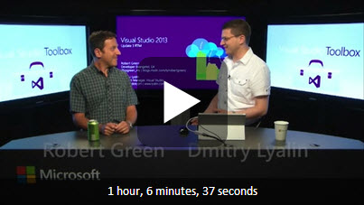
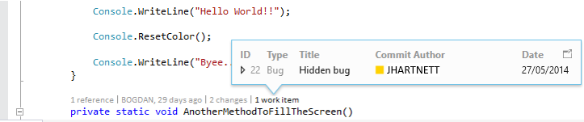
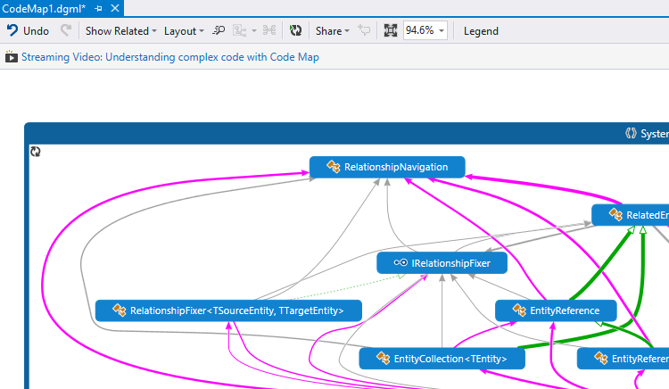
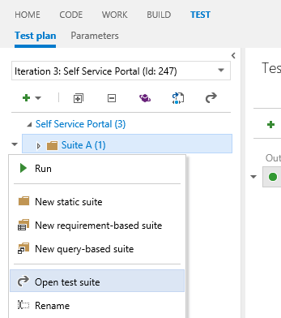
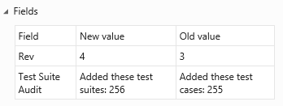
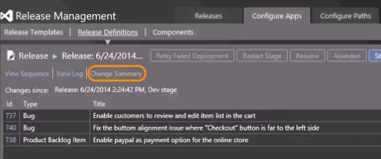

#  Visual Studio 2013 Update 3 (2013.3) RTM

### August 4, 2014

Today, we are happy to announce the availability of Visual Studio 2013 Update 3 (Visual Studio 2013.3) Release to Manufacturing (RTM).

## Download Visual Studio 2013 Update 3

This update is the latest in a cumulative series of feature additions and bug fixes for Visual Studio 2013. 
You can download Visual Studio 2013 and Team Foundation Server 2013 from [My.VisualStudio.com](https://www.visualstudio.com/vs/older-downloads/). 
My.VisualStudio.com requires a free [Dev Essentials](https://www.visualstudio.com/dev-essentials/) subscription, or a [Visual Studio Subscription](https://www.visualstudio.com/subscriptions/).

## What's new in Visual Studio 2013 Update 3

- [CodeLens](#CodeLens)
- [Code Map](#CodeMaps)
- [Debugger](#Debugger)
- [Performance and Diagnostics](#PerfAndDiag)
- [IntelliTrace](#IntelliTrace)
- [Windows Store Apps](#StoreApps)
- [Visual Studio IDE](#vside)
- [Testing](#Testing)
- [Bug Fixes & Known Issues](#Other)
- [Release Management](#ReleaseManagement)
- [Web Tools](#ASP)
- [Azure Tools](#AzureTools)
- [C++](#C++)
- [Graphics Diagnostics](#GraphicsDiagnostics)
- [Application Insights](#ApplicationInsights)
- [ClickOnce Deployment](#ClickOnce)
- [SharePoint Apps](#SharePoint)

In addition, several Visual Studio 2013 products are available for download with Update 3, including the following:

- [Multi-Device Hybrid Apps CTP 2.0 release](#MDD)
- [Azure SDK 2.4 Release RTM](#AzureSDK)
- [IntelliTrace Standalone Collector](#IntellitraceStandalone)
- [Windows Phone 8.1 Update Emulators](#WinPhoneSDK)

To get more details on these releases, see the [Related Releases](#Related) section below.

For a video overview of Visual Studio 2013.3, watch the [Visual Studio 2013 Update 3 episode of Visual Studio Toolbox with Robert Green & Dmitry Lyalin](http://go.microsoft.com/?linkid=9852092):

  
###  CodeLens

Use CodeLens indicators in the editor to learn about your code while staying focused on your work. You can find code references, changes to your code, related Team Foundation Server items, and unit tests – all without looking away from the code.

To learn more about CodeLens, see:  [Get history and other info about your code](https://msdn.microsoft.com/library/dn269218.aspx).

#### CodeLens support for Git repositories

For Update 3, CodeLens now works with Git repositories to provide CodeLens indicators for authors and changes to your code. You can also view the work items associated with a method, property or class. These indicators are updated when a user commits, the Git repository is pulled or fetched, or the branch is changed. (Minimum edition: Ultimate)

FFor more information, see:  [Code Lens for Git in Visual Studio 2013 Ultimate Update 3](http://blogs.msdn.com/b/visualstudioalm/archive/2014/05/23/code-lens-for-git-in-visual-studio-2013-ultimate-update-3.aspx).

####  Code Map

Code maps help you avoid getting lost in large code bases, unfamiliar code, or legacy code. For example, when you're debugging, you might have to look at code across many files and projects. Code maps help you navigate around these pieces of code and see relationships between them. You don't have to remember all this code, keep track of files, or draw a separate paper diagram.

To learn more about code maps, see:  [Map dependencies in specific code using code maps in Visual Studio](https://msdn.microsoft.com/library/jj739835.aspx).

#### Color-coding for links

Links on code maps are now styled with colors to make it easier to quickly understand the map. You can use the Legend to understand what each color represents. (Minimum edition: Ultimate)

#### Improved zoom

Before this update, if there were a lot of methods in the call stack the code map would size to fit. This could become unreadable. Now the code map keeps the zoom level that you set and minimizes panning so that you can still see as much context as possible. In addition, the current call stack or active call stack entry are always visible so that you know where you are. (Minimum edition: Ultimate)

#### Drag and drop binaries to maps

Simply create a new directed graph in Visual Studio and drag binaries from File Explorer and drop them onto this graph. Now you can explore these binaries. For example, you can show the assemblies that they reference. (Minimum edition: Ultimate)

For more information, see:  [Code Map improvements in Visual Studio 2013 Ultimate Update 3](http://blogs.msdn.com/b/visualstudioalm/archive/2014/05/27/code-map-improvements-in-visual-studio-2013-ultimate-update-3-ctp1.aspx).

###  Debugger

#### Multi-monitor support

After you move a Windows Store app to a different monitor while debugging, the app will reappear in that monitor the next time you start debugging. (Minimum edition: Express for Windows)

For more information, see:  [Multiple Monitor Support for Windows Store Apps in Visual Studio 2013 Update 3](http://blogs.msdn.com/b/visualstudioalm/archive/2014/05/23/multiple-monitor-support-for-windows-store-apps-in-visual-studio-update-3.aspx).

#### Managed code memory dumps

A memory dump is a snapshot of an app's use of memory at the time when the dump is made.

For more information, see:  [Using Visual Studio 2013 to Diagnose .NET Memory Issues in Production](http://blogs.msdn.com/b/visualstudioalm/archive/2013/06/20/using-visual-studio-2013-to-diagnose-net-memory-issues-in-production.aspx).

While you are debugging a memory dump, you can now select a type and navigate to the type's definition or its references by using **Go to Definition** and **Find All References**. (Minimum edition: Ultimate)

For more information, see:  [.NET Memory Analysis: Go to Source in Visual Studio 2013 Update 3](http://blogs.msdn.com/b/visualstudioalm/archive/2014/05/23/net-memory-analysis-go-to-source.aspx).

#### Memory dump debugging support for .NET Native

You can now debug NET Native x86 applications, and debug memory dumps from .NET Native apps. (Minimum edition: Express)

###  Performance and diagnostics

#### Importing and exporting Internet Explorer profiling sessions

The Performance and Diagnostics hub can open profiling sessions (.diagsession files) that were exported from F12 tools in the latest developer preview of Internet Explorer 11. (Minimum edition: Express for Windows)

For more information, see:  [Performance and Diagnostics Hub in Visual Studio 2013](http://blogs.msdn.com/b/visualstudioalm/archive/2013/07/12/performance-and-diagnostics-hub-in-visual-studio-2013.aspx).

#### CPU usage

The **CPU Usage** tool was introduced in Visual Studio 2013 Update 2. You can find it in the **Performance and Diagnostics** hub that can be used with WPF, Console, Windows Store 8.1, or Windows Phone 8.1 apps written in C++, C#, Visual Basic, or JavaScript.

This tool provides data on which functions are using the CPU, so you can make decisions about where to focus your optimization efforts to achieve the best performance.

**Navigate to source**

You can now navigate from a function name in the **Call Tree** to the line of source code where the function is defined, so you can easily see the code that is using CPU in your application. (Minimum edition: Express for Windows)

For more information, see:  [New CPU Usage tool in the Performance and Diagnostics hub in Visual Studio 2013](http://blogs.msdn.com/b/visualstudioalm/archive/2014/02/28/new-cpu-usage-tool-in-the-performance-and-diagnostics-hub-in-visual-studio-2013.aspx).

#### Memory Usage

The Memory Usage tool, introduced in Visual Studio 2013, originally supported only Windows Store and Windows Phone Store apps using C#/VB/C++ and XAML. (Minimum edition: Express for Windows)

For more information, see:  [Memory Usage Tool](https://msdn.microsoft.com/library/windows/apps/dn645469.aspx).

Here are some features that were added to the tool:

**Support for WPF and Win32 Applications**

In Update 3, you can also use this tool with WPF (with .NET 4.0 and above) and Win32 apps.

For more information, see:  [New Memory Usage Tool for WPF and Win32 Applications](http://blogs.msdn.com/b/visualstudio/archive/2014/06/12/new-memory-usage-tool-for-wpf-and-win32-applications.aspx).

**Force GC**

Focus on objects that are important by explicitly forcing a garbage collection in your application to get rid of short-lived objects and objects in the Finalizer queue before taking a snapshot.

**Copy Multiple Rows**

No more copying data row by row. Copy and paste formatted content from multiple rows in any data grid in the heap analysis views using standard gestures like CTRL + Click.

**Module Column**

View the module from which a Type or a Stack Frame originated in the new Module column in the details views

**Faster native heap analysis**

Native heap analysis completes faster than ever. We delay load symbols for non-user assemblies until you explicitly turn off Just My Code. We have seen upwards of a 10X improvement in load times for large session files.

###  IntelliTrace

It is now possible to skip straight to the details of single performance events that were exported from Application Insights to IntelliTrace. (Minimum edition: Ultimate)

To learn more about performance events, see:  [Performance Details in IntelliTrace](http://blogs.msdn.com/b/visualstudioalm/archive/2013/09/20/performance-details-in-intellitrace.aspx).

###  Windows Store Apps

The Windows App certification Kit (WACK) has been updated, allowing developers who build Windows Store Apps to use WinSock APIs in their in Windows Store apps. WACK now passes the use of libraries or code that depends on WinSock. Windows Phone apps already support WinSock APIs, making it even easier to share more code across phones, tablets, and PCs. (Minimum edition: Express for Windows)

To learn more about the WACK, see:  [Using the Windows App Certification Kit](https://msdn.microsoft.com/library/windows/apps/hh694081.aspx).

###  Visual Studio IDE

#### Menu Bar: All Caps Option

In Update 3 you can choose whether to display Visual Studio menu bars in all caps or in title case. You can find the checkbox in **Tools &gt; Options &gt; Environment &gt; General**. The default value is **All Caps**. This option maps to the user's current registry state, so that users who have already turned off All Caps in the registry will continue to 
see title case menus. This option automatically roams to all signed-in devices. (Minimum edition: Express)

#### Notifications Hub

Visual Studio 2013 has a centralized Notifications hub (in the upper right corner of the IDE) to display messages that are specific to your development environment (for example, updates to Visual Studio or an installed extension). With Update 3, the Notifications badge will turn yellow to indicate that an update is available for download. The badge now also acts as a toggle, so you can open and close the hub with a single click. (Minimum edition: Express)

###  Testing

#### Customize your test plans and test suites

One of the top feature requests from our users across various forums has been the ability to customize test plans and test suites to suit your testing needs.

With Update 3 for Team Foundation Server 2013, it is now possible to add custom fields and workflows to test plans and test suites. For example, add an extra field to identify the reviewer for a test plan, or add a field for the test type to know if the test suite is for regression or functional tests. Also, you can change the default values for the state field to fit your process better.

For more information, see:  [Configure features after a TFS upgrade](https://msdn.microsoft.com/library/ff432837.aspx).

Any fields you add or changes you make can then be viewed or edited from Microsoft Test Manager or Team Web Access. Just open the test suite or test plan.

For more information on getting started, see:  [Use test plans and test suites after a TFS 2013.3 upgrade](https://msdn.microsoft.com/library/dn790280.aspx).

#### Track changes to test plans and test suites

With Update 3 for Team Foundation Server 2013, test plans and test suites now track change history, like other TFS work items.

For example, you can view when test cases are added to a test suite from the All Changes tab in the History section.

#### Enhanced security for test suites

With Update 3 for Team Foundation Server, we've added a new type of permission to manage test suites security. This type of permission controls access to:

- Creating and deleting test suites
- Adding and removing test cases from test suites
- Changing test configurations for test suites
- Moving test suites in a test plan

You can grant this permission to provide a different level of access at the area path level.

The existing permission to manage test plans will be changed to restrict access to specific test plan properties.

For more information, see:  [Test Plan and Test Suite Customization with TFS 2013 Update 3](http://blogs.msdn.com/b/visualstudioalm/archive/2014/05/23/test-plan-and-test-suite-customization-with-tfs2013-update3.aspx).

#### Cloud-based load testing with Application Insights

You don't need to use resources and set up your own machines to do load testing on your web site. You can use cloud-based load testing to provide virtual machines that generate the load of many users accessing your web site at the same time. When you run your load tests for your app using Visual Studio Online, you can use Application Insights to retrieve performance data as well. By correlating load and performance data together, you get more insight into any performance issues that you find.

With Update 3, you are no longer limited to the default counters. Now you can choose any performance counters from Application Insights that you want to see.

Get started with [cloud-based load testing](https://www.visualstudio.com/get-started/load-test-your-app-vs).

###  Release management

Improve the process of managing the release of your app. Deploy your app to a specific environment for each separate stage. Manage the steps in the process with approvals for each step. 

#### Desired State Configuration (DSC)

You can now deploy to an on-premises environment or a Windows Azure environment without having to set up a Microsoft Deployment Agent on each machine. You can use [Windows PowerShell](https://msdn.microsoft.com/library/dd835506%28v=vs.85%29.aspx), or [Windows PowerShell Desired State Configuration (DSC](https://technet.microsoft.com/library/dn249912.aspx)). There is a new action in Release Management to support deployment with either of these. To learn more about deploying without agents, see: [Release your app to environments without deployment agents](https://www.visualstudio.com/get-started/deploy-no-agents-vs).
 
#### New Change Summary

You can now use the change summary to see the user stories and bugs that have been completed since the previous release to know what to test and put in your release notes.

**Web Platform and Tools**

ASP.NET & Visual Studio gives developers a powerful set of frameworks and tools to build websites, services (API’s), real-time bi-directional communication endpoints and much more. You can learn more on the [official ASP.NET website](http://www.asp.net/).

In Update 3 both ASP.NET Web Platform and Tooling has been updated, with highlights listed below. For a complete list of changes please see: [Announcing New Web Features in Visual Studio 2013 Update 3 RTM](http://blogs.msdn.com/b/webdev/archive/2014/08/04/announcing-new-web-features-in-visual-studio-2013-update-3-rtm.aspx).

Visual Studio Web tools provide everything web developers need to create great apps, including project templates, special editors for HTML, CSS and JSON file types, and IntelliSense.

For more information, see [Announcing New Web Features in Visual Studio 2013 Update 3 RTM](http://blogs.msdn.com/b/webdev/archive/2014/08/04/announcing-new-web-features-in-visual-studio-2013-update-3-rtm.aspx).

####  Web Tooling

**Scaffolding: Support for ASP.NET MVC & Web API v5.2**

ASP.NET Scaffolding is a code generation framework for ASP.NET Web applications, it helps developers save time for common tasks such as adding code that interacts with data models with just a few clicks.

To learn more about Scaffolding, see: [ASP.NET Scaffolding in Visual Studio 2013](http://www.asp.net/visual-studio/overview/2013/aspnet-scaffolding-overview).

With Update 3, we’ve added proper support for ASP.NET MVC and Web API packages v5.2, which was not working as intended in Update 2.

**JSON Editor: Auto-formatting and Brace Matching**

The JSON editor enables developers to work with JSON files using the rich code editor in Visual Studio, with capabilities such as colorization, syntax validation and more.

In Update 3 we’ve added options to give users more control over the editor, including the ability to turn off auto-formatting.

We’ve also added brace and bracket match highlighting (similar to C# or JavaScript), with an option for controlling brace positions.

To learn more about the JSON editor see: [New JSON Editor Features in Visual Studio 2013 Update 2 CTP2](http://blogs.msdn.com/b/webdev/archive/2014/02/28/new-json-editor-features-in-visual-studio-2013-update-2-ctp2.aspx).

**CSS Editor: Drag-and-drop support & Selectors Level 4**

The CSS editor enables developers to work with CSS files in Visual Studio. In Update 3 we’ve enhanced the CSS editor to enable developers to drag font, image or CSS files from their solution explorer and drop them right into the CSS file, which will auto-generate the correct CSS tag and file path.

We’ve also enhanced IntelliSense support for Selectors Level 4, which will support more selector patterns and makes it easier for developers to implement them in their markup.

To learn more about the CSS editor, see [Visual Studio 2013 Web Editor Features - CSS](http://www.asp.net/visual-studio/overview/2013/visual-studio-2013-web-editor-features-css).

**HTML and JavaScript Development**

With Update 3, the JavaScript language service now provides IntelliSense support for RequireJS modules.

**ASP.NET Project Templates**

With Update 3 installed new ASP.NET projects will include various changes include:

- Added support for two-factor authentication in One ASP.NET templates (for both MVC and Web Forms). You can learn more by reading: [Two-factor authentication using SMS and email with ASP.NET Identity](http://www.asp.net/identity/overview/features-api/two-factor-authentication-using-sms-and-email-with-aspnet-identity).
- We’ve moved the ASP.NET Facebook Template out of the file new project dialog, and instead it is now hosted in the NuGet gallery (see: Microsoft.AspNet.Facebook). This will enable Microsoft to make more rapid changes to this template as Facebook API’s change.

#### Web Platform

**ASP.NET Identity**

Update 3 provides added support for SignInManager, which makes it easier to add two-factor authentication, account lockout, and other security features when you log on.

For more information about this feature, see [ASP.NET Identity 2.1.0-alpha1](http://blogs.msdn.com/b/webdev/archive/2014/06/05/asp-net-identity-2-1-0-alpha1.aspx).

**Entity Framework 6.1.1**

This update includes Entity Framework 6.1.1. For more information, see [EF 6.1.1 RTM Available](http://blogs.msdn.com/b/adonet/archive/2014/06/20/ef-6-1-1-rtm-available.aspx).

**WebDeploy 3.5**

With Update 3, WebDeploy allows integration with SQL Server 2014. For more information, see [WebDeploy 3.5 RTW](http://blogs.iis.net/).

**ASP.NET MVC & Web API**

We’ve also recently shipped new versions of ASP.NET MVC & Web API, for more info see:

- [What’s New in ASP.NET MVC 5.2](http://www.asp.net/mvc/overview/releases/whats-new-in-aspnet-mvc-52)
- [What's New in ASP.NET Web API 2.2](http://www.asp.net/web-api/overview/releases/whats-new-in-aspnet-web-api-22)

###  Azure Tools

#### Notification hubs

Windows Azure Notification Hubs allow you to send mobile push notifications from any backend to any mobile platform.

In Update 3, the Push Notification Wizard now allows you to add push notifications to your Windows Store or Phone app (including WinRT, Phone, and Universal projects) from .NET Mobile Services as well as JavaScript-based Mobile Services. Windows Phone Silverlight projects are not supported.

The Notification hub can now display a list of the devices that are registered to receive notifications, and allows you to edit the registrations and delete the devices.

For more information, see: [Notification Hubs (Azure Documentation)](http://azure.microsoft.com/documentation/services/notification-hubs/).

#### Azure Web Jobs: PublishingSupport

With Update 3, you can now add standard console projects to your Visual Studio solutions and publish them to Azure Websites as either continuous, triggered, or scheduled WebJobs.

Console projects can also be published directly from the Solution Explorer as WebJobs to Azure Websites.

#### ASP.NET Web API projects

You can now provision a mobile service in the **New Project** dialog, instead of adding the service after the project has been created. 

###  C++

#### /Zo Compiler Switch

**/Zo** is a compiler switch that generates richer debugging information for optimized code (non **/Od** builds). This includes improved support for debugging local variables. (Minimum edition: Express)

###  Graphics Diagnostics

The Visual Studio Graphics Diagnostics tool helps diagnose graphics rendering and performance issues in DirectX apps by letting you inspect graphics events, shader code, graphics pipeline stages, resources, and device state for any frames that are captured using this tool. (Minimum edition: Express for Windows)

For more information, see [Graphics Diagnostics Overview](https://msdn.microsoft.com/library/hh873207.aspx).

In Update 3 RTM, you launch the Visual Studio Graphics Analyzer IDE when you analyze the frames you just captured in the current diagnostics session, or when you open an existing .vsglog from disk. This gives you a dedicated space for inspecting graphics information without overlapping with your regular Visual Studio windows.

In Update 3 RTM, you can specify different Graphics Diagnostics options in the **Tools/Options** page:

- whether or not to collect call stacks during capture
- whether to collect call stacks only for draw calls or for all API calls
- whether or not to disable HUD (head-up display) during capture
- whether or not to capture in compatibility mode. In compatibility mode, apps do not use hardware-specific capabilities, so that capture can be played back on different GPUs.

In Update 3 RTM, you can edit shader code and immediately apply the changes to the .vsglog file, so you can see the impact of your changes without having to re-run the app. You can open any shader files in the shader editor window by clicking on the shader file name in the **Pixel History** window or the **Pipeline Stages** window.

For more information about Graphics Diagnostics updates, see [Graphics Diagnostics in Visual Studio 2013 Update 3 RC](http://blogs.msdn.com/b/vcblog/archive/2014/07/02/graphics-diagnostics-in-visual-studio-2013-update-3-rc.aspx).

###  Application Insights

Application Insights is in preview.

Application Insights for Visual Studio Online is used to monitor your deployed applications. It can monitor web apps, Windows Store and Windows Phone apps. Use the Application Insights Tools for Visual Studio included in Update 3 to add this monitoring to your project:

- Find out what users are doing with your app, so that you can focus your development work where it’s most useful.
- Make sure your web service is available and responsive.
- Quickly diagnose any performance issues or exceptions in your web service.
- When people download and use your app, you’ll see statistical data in the Application Insights portal.

###  ClickOnce Deployment

#### Allow SHA-256 certificates on .NET 4.0 in ClickOnce

Before this update, .NET Framework 4.5 had to be present on the client machine whenever a SHA-256 code-signing certificate was used for desktop applications published with ClickOnce or Visual Studio Tools for Office add-ins. If you’ve used SHA-256 code-signing certificates in the past, and have seen errors like “The application is improperly formatted”, “The manifest may not be valid”, “Manifest XML signature is not valid”, or “SignatureDescription could not be created for the signature algorithm supplied”.

With Update 3, developers can now use SHA-256 code-signing certificates even for applications that target .NET 4.0 and lower, which should resolve the problem for re-published and newly-published desktop applications. (Minimum edition: Express)

###  SharePoint Apps

#### New autohosted apps no longer allowed

The Autohosted option is removed from the SharePoint app creation experience, because the Office 365 Autohosted Apps Preview program ended on June 30. New autohosted apps for SharePoint are no longer accepted by the SharePoint store. Existing autohosted apps are not affected, and apps that are currently running in the service will not be shut down. (Minimum edition: Professional)

See [Update on Autohosted Apps Preview program](http://blogs.office.com/2014/05/16/update-on-autohosted-apps-preview-program/) for more information.

###  Other Changes: Bug Fixes & Known Issues

For a complete description of technology improvements, bug fixes and known issues in this release see the KB article [Description of Visual Studio 2013 Update 3 RTM](http://go.microsoft.com/fwlink/?LinkId=397828).

###  Related Releases

###  Multi-Device Hybrid Apps CTP 2.0 release

You can use the Multi-device Hybrid Apps CTP 2.0 release  to build mobile apps using JavaScript or TypeScript for iOS, Android, Windows Store and Windows Phone using the Update 3 version of tooling for Apache Cordova. (Minimum edition: Professional)

Some of the new features are:

- Across-the-board quality, reliability, and performance improvements with hundreds of bug fixes
- SDK support for a wider range of operating system including Windows 7, Windows 8 and Windows Server 2012 R2
- Support for debugging Android targets &lt; 4.4 using jsHybugger
- Compatibility Checker helps you maintain a healthy developer environment by regularly checking for the proper installation and configuration of 3rd party tool chain dependencies (e.g. Java, Android SDK)

You can download the release here: [Multi-Device Hybrid Apps (Preview)](https://msdn.microsoft.com/vstudio/dn722381.aspx).

To learn more, see: [Apache Cordova Tooling Update with Support for Windows 7](http://blogs.msdn.com/b/visualstudio/archive/2014/08/04/apache-cordova-tooling-update-with-support-for-windows-7.aspx).

###  Azure SDK 2.4 RTM Release

The Azure SDK 2.4 RTM release includes tools to manage virtual machine configuration and set up remote debugging for 32-bit applications running on virtual machines, and tools to provision Geo-Redundant Storage.

In this release, Server Explorer now has a **Configure** option on the context menu for virtual machines. You can use this to view and edit properties of the virtual machine, set up endpoints, add and configure extensions, and create virtual machine snapshots.

You can also set up remote debugging for 32-bit virtual machines from the same context menu.

Read-Access Geo-Redundant Storage (RA-GRS) gives you better read availability for your storage account by providing read-only access to the data that has been replicated to the secondary location. You can now select RA-GRS as a redundancy option when you create a storage account from Visual Studio.

You can get the Azure SDK 2.4 release here:

- For Visual Studio 2013: [Windows Azure SDK](http://go.microsoft.com/fwlink/?LinkId=404332)
- For Visual Studio 2012: [Windows Azure SDK](http://go.microsoft.com/fwlink/?LinkId=404333)

For more information about this release, see: [Azure SDK for .NET 2.4 Release Notes (MSDN)](https://msdn.microsoft.com/library/azure/dn794167.aspx)

###  IntelliTrace Standalone Collector

The standalone IntelliTrace collector provides a more practical alternative to remote debugging an application in production. You can use the collector to record the execution of your application on a remote machine by saving it into an .itrace file and playing it back on your local development machine with Visual Studio.

For more information about the collector, see [Collect IntelliTrace Data Outside Visual Studio with the Standalone Collector](https://msdn.microsoft.com/library/vstudio/hh398365%28v=vs.120%29.aspx).

You can download the RTM release of the IntelliTrace Standalone Collector here: [IntelliTrace Collector for Visual Studio Update 3](http://go.microsoft.com/fwlink/?linkid=316689)

###  Windows Phone 8.1 Update Emulators

The new emulator package is now available to be downloaded from the  [Windows Phone 8.1 Update Emulators](https://www.microsoft.com/download/details.aspx?id=43719).

[Top of Page](#top)