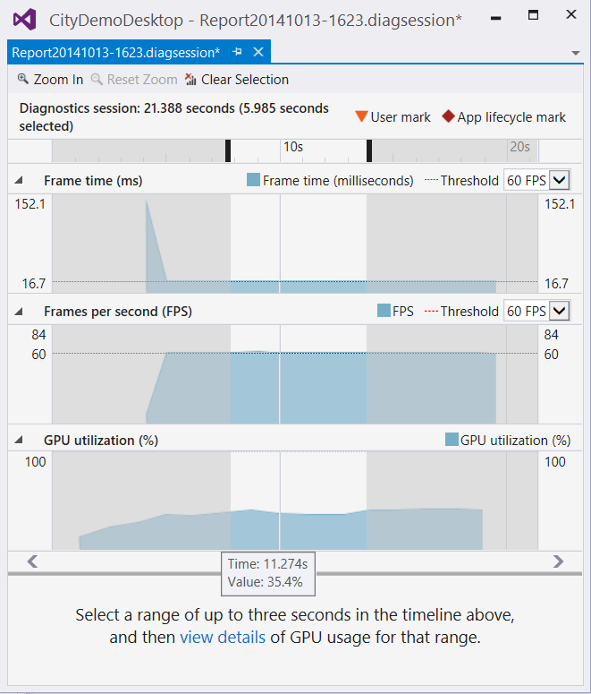
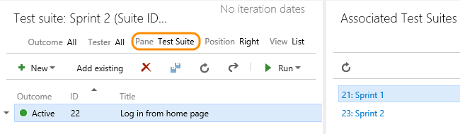
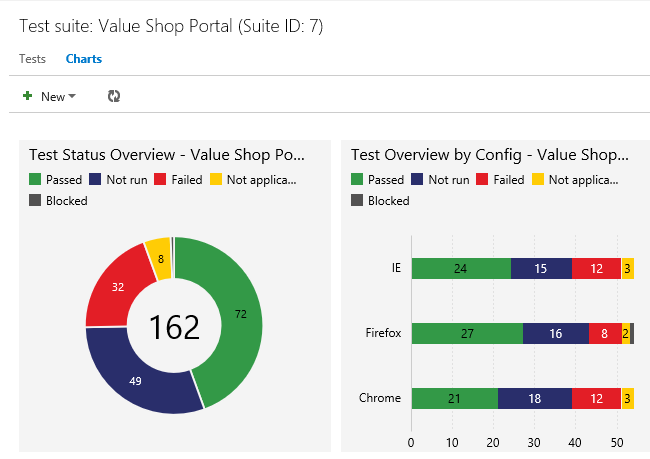
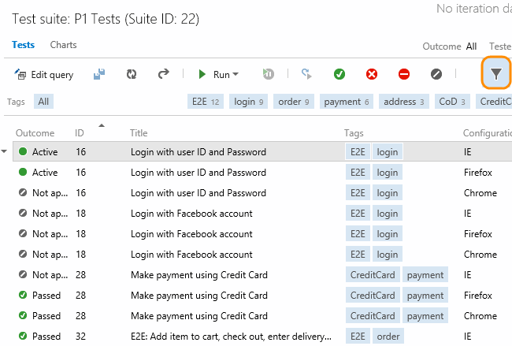
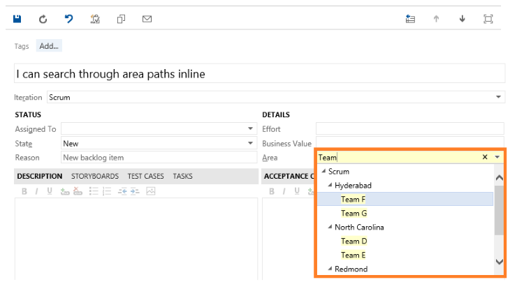

# Visual Studio 2013 Update 4 (2013.4) RC

### October 16, 2014

Today, we are happy to announce the availability of Visual Studio 2013 and Team Foundation Server 2013 Update 4 Release Candidate (RC).

**Download Visual Studio 2013 Update 4**

This update is the latest in a cumulative series of feature additions and bug fixes for Visual Studio 2013. You can install both Visual Studio 2013 and Team Foundation Server 2013 from the following link:

[Download Visual Studio 2013 Update 4 (2013.4) RC](http://go.microsoft.com/fwlink/?LinkId=510314)

## What's new in Visual Studio 2013 Update 4

Visual Studio updates:

- [CodeLens](#CodeLens)
- [C++](#C++)
- [JavaScript IntelliSense](#JS)
- [Microsoft ASP.NET and Web Tools](#AzureWeb)
- [Application Insights](#ApplicationInsights)

Team Foundation Server Updates:

- [Release Management](#ReleaseManagement)
- [Test](#Testing)
- [Version control](#VersionControl)
- [Plan and track work](#WIT)
- [Access level name changes and feature access](#Licensing)

SQL Server updates:

- [SQL Server](#SQL)

Other changes:

- [Bug Fixes & Known Issues](#Other)

In addition, several Visual Studio 2013 products are available for download with Update 4, including the following:

- [Team Explorer Everywhere 2013 Update 2](http://go.microsoft.com/fwlink/?LinkId=321339)
- [Visual Studio Tools for Unity](http://blogs.msdn.com/b/visualstudio/archive/2014/07/29/visual-studio-tools-for-unity-1-9.aspx) (VSTU) 1.9.1

To get more details on these releases, see the [Related Releases](#Related) section below.

##  CodeLens

With CodeLens indicators you can learn about your code while staying focused on your work. You can find code references, changes to your code, related TFS items, and unit tests – all without looking away from the code. [Learn more about CodeLens](https://msdn.microsoft.com/library/dn269218.aspx).

### Reduced data storage requirements for CodeLens with TFVC

The size of CodeLens data stored in the TFS database has been reduced. The data has been reformatted and duplicated information removed.

By default, CodeLens now only processes changes from the last 12 months to calculate team indicators. You can change this duration by using the [TFSConfig CodeIndex command](https://msdn.microsoft.com/library/dn280925.aspx).

##  C++

### GPU Usage

A new **GPU Usage** tool in the **Performance and Diagnostics** hub helps you determine whether the CPU or the GPU is the performance bottleneck. This tool lets you collect and analyze GPU usage data for DirectX applications.

You can use this tool for both Windows Desktop and Windows Store apps; support for Windows Phone and remote diagnostics will ship in a later release. You can also inspect the timing of each individual GPU event if a supported graphics card is present and latest drivers are installed. 

### Faster browsing

Visual Studio now scans or rescans large solutions and updates the symbol database more quickly. Browsing should be more responsive, and operations such as **Go To Definition** should not be blocked, even if the database has not been completely updated. A non-blocking message will warn you that your results may be inaccurate.

##  JavaScript IntelliSense

You can now get IntelliSense in JavaScript modules loaded with RequireJS. For more information about RequireJS, see [RequireJS](http://www.requirejs.org/).

##  Microsoft ASP.NET and Web Tools

We have made improvements in the JSON and HTML editors.

### JSON Editor Improvements

We made a few improvements in the JSON editor, including loading the JSON schema asynchronously, caching child schemas, and improving IntelliSense.  We also have the following new features:

- JSON Schema validation. We added a JSON schema validation feature, based on the schema selected in the drop-down list.
- Un-minify the context menu button. You can right-click the JSON editor and select **Un-minify context menu button** to un-minify any long arrays in the JSON file.
- The Reload Schemas context menu button. VS caches the schema downloaded from internet, and will use the cache even after you restart VS. If you know the schema has changed, you can use the context menu to download the changed schema in the active JSON document and use it immediately.

### HTML Editor Improvements

We improved the HTML editor with some bug fixes, updated IntelliSense for web standards, and introduced the following new features:

- Better client template formatting. The HTML editor no longer parses or formats double-curly syntax {{…}},  so we don’t flag the content as invalid HTML or try to format it as HTML. This is great for Angular, Handlebars, Mustache and other double-curly template syntaxes.
- Support for custom elements, polymer-elements and attributes.
We no longer validate unknown attributes for custom elements, because there can be many custom-made tags in different frameworks. There will no longer be squiggles under the unknown elements.
- HTML element tooltips. We now supply tooltips for HTML elements in the editor.
- #region support. The HTML editor now supports region folding. You can use a surrounding snippet to surround the current selection as well.
- viewport fix for the LESS editor. In the LESS editor, @viewport no longer shows verification warnings.
- Many more snippets. We now provide more snippets to make your developing experience easier.
- CSS auto-sync. Saving the CSS file or changing it externally (for example, with a LESS/SASS compiler) causes the whole CSS file to reload in the browser. If the file couldn’t auto-sync, Ctrl+S causes an automatic reload without needing to refresh the linked browsers(Ctrl+Alt+Enter). This feature can be disabled in the toolbar.

### Azure WebJobs

In Visual Studio 2013 Update 4 we’re releasing some new features that will make it easier than ever to build, deploy, and debug Azure WebJobs, and to add background processing to Azure Websites. WebJobs are now represented as nodes in the Visual Studio Server Explorer, so you can link directly to the WebJobs dashboards to see how your WebJobs are running. You can also use the Server Explorer to start and stop continuous jobs and run on-demand or scheduled jobs. We’ve also enabled one-click remote debugging of continuous WebJobs, so if you need to see how your continuous WebJob is processing incoming queues or blob messages, you can step through your code as it’s running live in the cloud.

#### 

### WebJobs SDK

The WebJobs SDK is pre-installed in the Azure WebJob project templates.   
As before, you can create a new WebJob project using the Azure WebJob project template.

### ASP.NET MVC 5.2.2

Template packages are updated to use ASP.NET MVC 5.2.2. This release doesn’t have any new features or bug fixes in MVC. We made a change in Web Pages for a significant performance improvement, and have updated all other dependent packages we own to depend on this new version of Web Pages.

### ASP.NET Web API 5.2.2

In this release we have made a dependency change for Json.Net 6.0.4. For information on what is new in this release of Json.NET, see [Json.NET 6.0 Release 4 - JSON Merge, Dependency Injection](http://james.newtonking.com/archive/2014/08/04/json-net-6-0-release-4-json-merge-dependency-injection). This release doesn’t have any other new features or bug fixes in Web API. We have subsequently updated all other dependent packages we own to depend on this new version of Web API.

### ASP.NET Web API OData 5.3.1 beta

See [What's New in ASP.NET Web API OData 5.3](http://www.asp.net/web-api/overview/releases/whats-new-in-aspnet-web-api-odata-53#OD).

### SignalR 2.1.2

Template packages are updated to use SignalR 2.1.2. Please see [SignalR 2.1.2](https://github.com/SignalR/SignalR/releases/tag/2.1.2).

### Owin 3.0

Template packages are updated to use Owin 3.0 NuGet packages. Please see this [Owin 3.0 release note](https://katanaproject.codeplex.com/releases/view/113283).

##  Application Insights

With Update 4, Application Insights Tools for Visual Studio has more performance improvements and bug fixes. It is fully compatible with projects that had Application Insights added with Visual Studio 2013.3. This update includes:

- Seamless integration with the workflow to publish to an Azure website
- Improved solution integration and project detection. (For example, Application Insights is no longer included in unsupported projects like Python.)

To learn more about changes to Application Insights data in the Azure Preview Portal, go [here](http://azure.microsoft.com/documentation/articles/app-insights-start-monitoring-app-health-usage/#add).

##  Release Management

Improve the process of managing the release of your app. Deploy your app to a specific environment for each separate stage. Manage the steps in the process with approvals for each step.

You can create release templates that use deployment agents to deploy your app, or you can use vNext release templates that use [Windows PowerShell](https://msdn.microsoft.com/library/dd835506(v=vs.85).aspx), Windows PowerShell Desired State Configuration ([DSC](https://technet.microsoft.com/library/dn249912.aspx)), or [Chef](http://www.getchef.com/). To help you know which type of release you are setting up, a new term has been added to the UI to make your choices clearer: agent-based. This identifies agent-based environments, components, release templates and release paths that only work with servers that have deployment agents. The other type of environments are vNext environments. You can only use vNext environments with vNext Components, vNext Release Templates and vNext Release Paths.

### Use tags when you deploy to a vNext environment

Now you can use tags with the servers in your vNext Azure or standard environments. For example, if you have multiple web servers in your environment then you can tag them all with WebServer. Set up your deployment actions for your tags. When a stage is deployed, these actions are performed on any server with this tag. So you only have to create the set of actions once for multiple servers.

With vNext tags you can also switch the deployment order from parallel to sequence.

### Access to system variables for your deployment sequences or scripts

By popular user demand, you can now access system variables just like other configuration variables and use them in your release template. You don't have to hardcode these any more for vNext release paths only.

Supported variables:

- Build directory
- Build number (for component in the release)
- Build definition (for component)
- TFS URL (for component)
- Team project (for component)
- Tag (for server which is running the action)
- Application path (destination path where component is copied)
- Environment (for stage)
- Stage

### Reduce the need for configuration files to deploy your builds

For vNext release paths only, you can now set up configuration variables for your release at the following levels: global, server, component, action. This extra flexibility means you might no longer need to maintain configuration files with your build. If variables have the same name, the value is determined based on this order of precedence: action, component, server, global. (Action has the highest precedence to override the other values).

### Manual intervention with a vNext release path

Now you can add manual steps to a stage in a vNext release path. Add a manual intervention activity into your deployment sequence. When the notification is triggered in that sequence, the deployment pauses and you can run some manual steps before continuing with the rest of the automation for the release path.

### Build drops stored on TFS servers 

If you have set up your build definition to copy the build output to the server and not a UNC path, vNext components in Release Management can now use these builds that are stored on the server.

### Deploy from a build drop using a shared UNC path

For vNext release paths, you can now use Release Management to deploy to servers using build drops located on a shared UNC path. You can deploy if both the target server and the Release Management server have access to the shared UNC path.

### Usability improvements

When you use the vNext release templates, you can now select servers and components from the drop-down list in the action. You can also give actions friendly names to make it easier to identify them.

### Mix and match vNext Azure and standard environments

Previously for a vNext release path, each stage in the path could only use either all vNext Azure environments or all vNext standard environments. Now you can mix and match your environments. For example, your test stage might deploy to a vNext Azure environments, but your production stage deploys to on-premises production servers in a vNext standard environment.

##  Test

### Find out quickly if a test case belongs to other test suites

As test cases can belong to more than one test suite, it's good to check if there are any other associated test suites before you make changes to a test case. Now you can quickly view all the test suites associated with a test case. [Find out the details](https://msdn.microsoft.com/library/dd286729.aspx).

 

### View recent test results for a test case

Quickly see the test result history for a test case to see if it has passed or failed recently. Just select the test case and choose the test results pane to view these results.

### Real-time lightweight charts to show testing status

Now you can create snapshot and trend charts for test cases from the Charts tab in the test hub. You can also create snapshot charts for test results.

### Filter by tags in the test hub

Tag test cases in a suite with any tag that is important to you. For example, tag all the tests related to login so that you can rerun these tests if a bug is fixed for the login page. Then you can filter on that tag from the test hub. You can add and edit tags when you edit a test case, or bulk edit tags in the grid view.

##  Version control

### Review and merge code with Git pull requests

Pull requests are a critical component of the developer workflow in Git. Now developers can use pull requests to help review and merge their code. Pull requests enable developers working in branches to get feedback on their changes from other developers before adding their code into the mainline. Any developer participating in the review can see the code changes, leave comments in the code, and give a “thumbs up” approval.

##  Plan and track work

The many small improvements to Team Foundation Server (TFS) with Update 4 help make it easier for you to use our tools to get your work done faster.

### Visualize trends and aggregate field values

Query-based chart authoring now includes trend charts: Stacked Area, Area, and Line. You can visualize trends across a one-week, two-week, or four-week time range. Also, in addition to field counts, you can now sum a field value across work items returned in a flat-list query. These new chart types can be pinned to your home pages too. Learn more about how to [view the status of your progress](https://www.visualstudio.com/get-started/visualize-progress-vs).

### Quickly reorder backlog items

If you had a large backlog, it was hard to drag and drop items to a different position. The context menu for backlog items now contains options to move an item directly to the top or to a specific position in the backlog. Be aware that with this change, we removed the field that tracks backlog priority from the work item forms in the default TFS process templates.

### Full screen mode support for backlog views, boards, queries

If you’re running a daily standup or viewing large backlogs, it's useful to be able to maximize the screen space and see as many items at once. Now you can hide all the chrome in the UI and have full-screen views of the backlog and boards. The toggle to enter full screen mode works for all the pages under the Backlogs and Queries tabs in the Work hub. Press ESC to return to the full work item view.

### Full screen mode support for all HTML/rich-text fields

You can now enter full screen mode for rich-text fields to help improve the readability and usability. For example, the **Steps to Reproduce** field can be maximized as shown below. The button toggles the text area between full screen mode and the work item view. Press ESC to return to the full work item view.

### Better triage experience

To improve the triage experience when you review query results, you can go back to the query by pressing Alt+Q. This keeps your position in the query.

### Assign backlog items to iterations within hierarchical views

From hierarchical views, you can now assign product backlog items to iterations with drag and drop.

### In-line search for area and iteration fields from the work item form

Often when triaging or assigning work items it’s necessary to change the area and/or the iteration path. Finding the path you want in large, deeply nested trees can be difficult. With inline search, values that match what you type are instantly highlighted. For example, type Team to highlight all path entries that contain the work Team in their name.

### Open hyperlinks quickly

If you have a hyperlinks defined within an HTML field, press the CTRL key and click the link. Previously it was a two step process to click the link, and then click the “navigate to…” command at the top of the text area.

### Teams choose whether or not to track bugs on their backlog

Teams now have greater flexibility in how they track bugs. While team projects created with the Scrum process template include bug tracking on the backlog, other process templates don't. Each team can now choose to view the bugs with the product backlog or turn off including them.

More details about adding bugs to the task board are [here](https://msdn.microsoft.com/library/jj920163.aspx).

### Work item form enhancements

Track work and share information more easily using some of the new features listed below and highlighted in the work item form pictured.

- Send a nicely formatted email directly from the work item form using the new email icon.
- Return directly to the query result you navigated from. If you like to use the keyboard, press ALT+Q. Or you can use the browser back button to do the same thing. This keeps your position in the query.
- Enter full screen mode from all queries and all work items. Just click the command in the toolbar to remove all the chrome and maximize your screen real estate.
- Open a work item in a new browser tab with the context menu command for query results.
- Copy and paste of query results now formats the results much better for pasting into email or a document.

### More items in your Kanban board

There is no longer a hard limit on the number of items in the first and last columns of the Kanban board. Now you can configure this limit to have up to 999 items.

### Easier way to link work items

In Visual Studio, there has always been a dialog box to find a work item that you want to link to, but with Team Web Access you could only type the work item ID to find it. With Update 4, you get a similar dialog box to find the work item you want to link to. You can run an existing query or find the work item based by searching for its title.

##  Access level name changes and feature access

With Update 4, all access levels have been renamed. The new names correspond to the same names used for Visual Studio Team Services licensing.

- Stakeholder (previously was Limited)
- Basic (previously was Standard)
- Advanced (previously was Full)

With this change, the feature set support for the Stakeholder access has been enhanced. Stakeholders have access to the project home page and most of the “work” related functionality. This includes the ability to view the backlog, add and edit items, run work item queries and more.

Any number of users can be assigned a stakeholder license at no charge. See more details [here](https://msdn.microsoft.com/library/jj159364.aspx).

##  SQL Server for Visual Studio

These are the added features for Update 4:

- SQL Server 2014 is now supported.
- Schema compare supports MSBuild with text and XML output.
- Token-based authentication for Azure SQL Database node in Server Explorer is supported - for Microsoft accounts and organizational accounts.
- From the Azure Preview Portal for Microsoft Azure SQL databases, you can now open the database schema directly in Visual Studio.
- Extensibility for Static Code Analysis.
- Filtering for the editable data grid.
- Save your data compare settings to a file (.dcmp).
- Additional actions are available when you connect to the TSQL editor.
- PDW tools are now part of Visual Studio Express 2013 for Windows Desktop

##  Other Changes: Bug Fixes & Known Issues

For a complete description of technology improvements, bug fixes and known issues in this release see the KB article [Description of Visual Studio 2013 Update 4](http://go.microsoft.com/fwlink/?LinkId=510328).

##  Related Releases

### Team Explorer Everywhere 2013 Update 2

[TEE 2013 Update 2](http://go.microsoft.com/fwlink/?LinkId=321339) improves how TEE stores credentials which makes signing in to [Visual Studio Team Services](https://www.visualstudio.com/products/visual-studio-team-services-vs) much easier. This release also adds the capability to browse Git repositories within TEE. Read more about this [here](http://blogs.msdn.com/b/visualstudioalm/archive/2014/09/22/team-explorer-everywhere-2013-update-2-is-here.aspx).

### Visual Studio Tools for Unity (VSTU)

VSTU is Microsoft’s free Visual Studio add-on that enables a rich programming and debugging experience for working with the [Unity gaming tools and platform](http://unity3d.com/). This is our first release since [the acquisition of SyntaxTree](http://blogs.msdn.com/b/somasegar/archive/2014/07/02/microsoft-acquires-syntaxtree-creator-of-unityvs-plugin-for-visual-studio.aspx), and we’re excited to have the opportunity to reach out to the Unity community with Visual Studio.

**Recent releases**

1.9.1 VSTU - find out the details of the new features and bug fixes from [this blog post](http://blogs.msdn.com/b/visualstudio/archive/2014/07/29/visual-studio-tools-for-unity-1-9.aspx).

1.9.2 VSTU - the minor features and bug fixes are listed here in [this change log](http://unityvs.com/documentation/changelog/#1.9.2).

To get started with the latest version of VSTU, download the tools from the Visual Studio Gallery: [VSTU for VS 2013](http://visualstudiogallery.msdn.microsoft.com/20b80b8c-659b-45ef-96c1-437828fe7cf2), [VSTU for VS 2012](http://visualstudiogallery.msdn.microsoft.com/7ab11d2a-f413-4ed6-b3de-ff1d05157714), and [VSTU for VS 2010](http://visualstudiogallery.msdn.microsoft.com/6e536faa-ce73-494a-a746-6a14753015f1).

[Top of Page](#top)