#  Visual Studio 2015 RTM

### July 20, 2015

Today, we are happy to announce the release of Visual Studio 2015 RTM. This Release to Manufacturing (RTM) of Visual Studio includes many new features and updates, such as tools for Universal Windows app development, cross-platform mobile development for iOS, Android, and Windows, including Xamarin, Apache Cordova, Unity, and more.

And now, you can see Visual Studio 2015 features in action; check out our videos on [Channel 9](https://channel9.msdn.com/visualstudio).

## Download
You can download Visual Studio 2015 from [My.VisualStudio.com](https://www.visualstudio.com/vs/older-downloads/). My.VisualStudio.com requires a free [Dev Essentials](https://www.visualstudio.com/dev-essentials/) subscription, or a [Visual Studio Subscription](https://www.visualstudio.com/subscriptions/).

For additional information, see [How to Install a Specific Release of Visual Studio](https://msdn.microsoft.com/library/mt653628.aspx).

To learn more about the most recent version of TFS, see the [Team Foundation Server 2015 release notes](https://www.visualstudio.com/news/releasenotes/tfs2015-rtm-vs).

### What's in Visual Studio 2015 RTM

Visual Studio:

- [Visual Studio C++ for Cross-Platform Development](#cplusplus)
- [Visual Studio Tools for Apache Cordova](#apache-cordova)
- [Visual Studio Emulator for Android](#androidemulator)
- [Visual Studio Tools for Universal Windows App Development](#universalwinapp)
- [Visual C++](#visualc)
- [C# and Visual Basic](#csharpvb)
- [F#](#fsharp)
- [.NET Framework 4.6](#Net)
- [Entity Framework](#entityframework)
- [Visual Studio IDE](#vside)
- [Blend](#blend)
- [Debugging and Diagnostics](#Debug)
- [ASP.NET](#ASP)
- [Azure Tooling](#azuretooling)
- [NuGet](#nuget)
- [JavaScript](#JavaScript)
- [TypeScript](#TypeScript)
- [IntelliTest](#intellitest)
- [Application Insights](#ApplicationInsights)
- [Release Management](#ReleaseManagement)
- [Single Sign-In](#SSI)
- [Git Version Control](#VersionControl)
- [CodeLens](#CodeLens)
- [Architecture, Design, and Modeling](#Architecture)
- [XAML Language Service](#xaml)
- [Miscellaneous](#misc)

Other changes:

- [Bug Fixes & Known Issues](#Other)

Related Releases:

- [Azure SDK 2.7 for .NET](#azuresdk)
- [Windows 10 SDK](#wintensdk)
- [Python Tools for Visual Studio 2.2 (RTM)](#python)
- [Visual Studio Tools for Unity 2.0 (RTM)](#unity)
- [Node.js Tools for Visual Studio 1.1 (RC)](#nodejs)
- [Office Developer Tools for Visual Studio 2015](#offdev)
- [GitHub Extension for Visual Studio 2015 (RTM)](#github)
- [Cloud-based Load Testing](#cloudtest)

##  Visual C++ for Cross-Platform Mobile Development

Now it's easy to share, reuse, build, deploy, and debug all but the most platform-specific code across multiple app platforms, all within a single solution in Visual Studio. Here are just a few of the things you can do:

- Create projects from templates for Android Native Activity apps, or for shared code libraries that you can use on multiple platforms and in Xamarin native Android applications.
- Use platform-specific IntelliSense to explore APIs and generate correct code for Android or Windows targets.
- Configure your build for x86 or ARM native platforms.
- Deploy your code to attached Android devices or use Microsoft's performant Android emulator for testing.
- Set breakpoints, watch variables, view the stack and step through code in the Visual Studio debugger.
- View the message log from an Android device by using the LogCat viewer. (Logcat is a diagnostic tool and essential for a good edit-&gt;build-&gt;debug experience.)   
Use Logcat to do the following:
    - Search for specific log messages by using search bar.
    - Use Toggle Autoscroll to view upcoming log messages easily.
    - Clear previous log output messages.
    - Choose between various log levels.

- Write C++ code targeting the iOS platform and also be able to take advantage of our advanced code authoring features, such as code sharing, cross-platform IntelliSense, refactoring, peek definition, and more. iOS support is still work in progress, so keep an eye out for more on this soon (and be sure to send us feedback; here's how: For bugs, use [Connect](https://connect.microsoft.com/visualstudio); for suggestions, use [UserVoice](http://visualstudio.uservoice.com/forums/121579-visual-studio); and for quick thoughts, use [Send-a-Smile](http://go.microsoft.com/fwlink/?LinkId=517102) in the Visual Studio IDE).

We've also added or updated the following:

- Support for Android API Level 21 (Lollipop).
- A new template that is based on make file support for Android, which allows using an external build system (including NDK- BUILD).
- Precompiled headers in all templates (including Dynamic Shared Library, Static Library, and Cross-platform mobile templates).

##  Visual Studio Tools for Apache Cordova

Formerly known as Multi-Device Hybrid Apps for Visual Studio, the Visual Studio Tools for Apache Cordova make it easy to build, debug, and test cross-platform apps that target Android, iOS, Windows, and Windows Phone from one simple Visual Studio project.

All of the features available in previous CTPs are now available in the Visual Studio 2015 RC, including the following improvements:

- Update on save for Ripple – no need to rebuild!
- Debug an iOS version of your app from Visual Studio when it is deployed to the iOS Simulator or a connected device on a Mac
- Improved security and simplified configuration for the included remote iOS build agent
- An improved plugin management experience that includes support for adding custom plugins to your project from Git or the filesystem
- Select platform-specific configuration options from an improved config.xml designer
- Support for Apache Cordova 4.0.0.   

We listened to your feedback and broadened the number of devices you can debug to, as follows:

- Android 4.4, Android 4.3 and earlier with jsHybugger
- iOS 6, 7, and 8
- Windows Store 8.1

Then, we broadened our debugging support further. You can now debug your Apache Cordova apps that target Windows Phone 8.1.

You can set breakpoints, inspect variables, use the console, and perform other debugging tasks on your Windows Phone 8.1 emulator or attached device. 

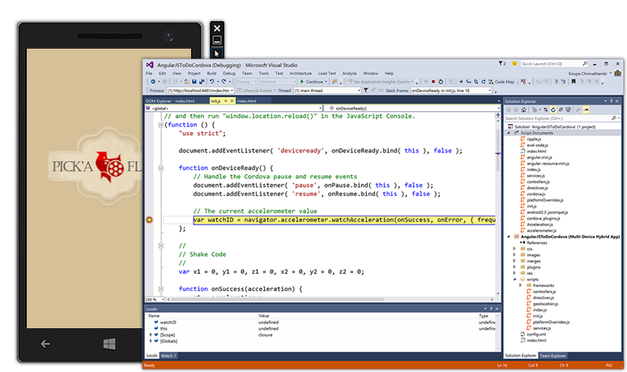

And in RC, we added: **CLI interoperability**. Cordova projects in Visual Studio will now synchronize with changes made to your project folder on-disk. Changes can flow in and out of Visual Studio whether you’re working with third-party tools or on other operating systems. (The default file structure for Cordova projects is based on the structure expected by the Apache Cordova command-line tools, which makes it easier to work directly with the Apache Cordova CLI or other tools that expect that folder structure.)

##  Visual Studio Emulator for Android

You can use the Visual Studio Emulator for Android either in a cross-platform project in Visual Studio (Xamarin or C++), or in Visual Studio Tools for Apache Cordova. The emulator allows you to switch between different platform emulators without Hyper-V conflicts. It supports a wide variety of sensors and simulations, including GPS/Location, accelerometer, screen rotation, zoom, SD card, camera, multi-touch, and network access. It also supports Android versions 4.4 (KitKat, API Level 19) and 5.0 (Lollipop, API Level 21).

The Visual Studio Emulator for Android supports both WiFi simulation and the ability to choose from several different device hardware configurations.

And now, **new in RTM**:

- **New platforms**. Jellybean (API 17) and Lollipop 5.1 (API 22) images are available.
- **Command-line interface**. Navigating to %programfiles(x86)%\Microsoft Emulator Manager\1.0\emulatorcmd.exe in a command prompt will allow you to interact with the emulator manager (list, install, start profiles, etc.) without a UI.
- **Drag-and-drop zip libraries**. Dragging and dropping a flashable zip onto the emulator will now automatically unpack and install it.
- **SD Card tab**. This new tab in the "Additional Tools" window allows you to push and pull data to and from the SD Card.
- **Acquire on its own**. The emulator can be installed on a machine without requiring you to install Visual Studio. A shortcut to the Emulator Manager appears in the Start menu so that you can start it and use it from any development tool chain.

Learn more about the  [Visual Studio Emulator for Android](https://www.visualstudio.com/explore/msft-android-emulator-vs).

##  Visual Studio Tools for Universal Windows App Development

The Visual Studio tools for Universal Windows app development is integrated with Visual Studio setup. These tools enable you to build Windows apps that run across all Windows 10 devices – the phone in your pocket, the tablet or laptop in your bag, the PC on your desk, the IoT devices and soon, the Xbox consoles in your house, the Surface Hub, and more. In addition, you can also use these tools to build Windows Desktop Applications that leverage Windows 10 APIs. Learn more about what's new in [Visual Studio Tools for Universal Windows Apps](http://go.microsoft.com/fwlink/?LinkId=618330).

For more information on Windows app development, see the [Guide to Universal Windows apps](http://go.microsoft.com/fwlink/?LinkId=618331) and the [Windows Developer Center](https://dev.windows.com/). For information on the latest Windows builds and SDKs, see the [Windows Insider](https://insider.windows.com/) portal.

##  Visual C++

In this release, the C++ compiler and standard library have been updated with enhanced support for C++11 and initial support for certain C++14 features. They also include preliminary support for certain features expected to be in the C++17 standard.

Additionally, more than 500 compiler bugs have been fixed, including many submitted by customers through [Microsoft Connect](https://connect.microsoft.com/VisualStudio)  ­— thank you!

### Language Features

We've added the following new features to bring the compiler closer to standard C++:

- **Resumable Functions (resume/await)** The resume and await keywords provide language-level support for asynchronous programming and enables resumable functions. Currently, this feature is only available for x64 targets. Proposed for C++17 [[N3858](http://isocpp.org/files/papers/N3858.pdf)]
- **Generic (Polymorphic) Lambda Expressions** Lambda function parameter types can now be specified using auto; the compiler interprets auto in this context to mean that the closure's function call operator is a member function template and that each use of auto in the lambda expression corresponds to a distinct template type parameter. C++14
- **Generalized Lambda Capture Expressions** Also known as init-capture. The result of an arbitrary expression can now be assigned to a variable in the capture clause of a lambda. This enables move-only types to be captured by value and enables a lambda expression to define arbitrary data members in its closure object. C++14
- **Binary Literals** are now supported. Such literals are prefixed with 0B or 0b and consist of only the digits 0 and 1. C++14
- **Return Type Deduction** The return type of normal functions can now be deduced, including functions with multiple return statements and recursive functions. Such function definitions are preceded by the auto keyword as in function definitions with a trailing return type, but the trailing return type is omitted. C++14
- **decltype(auto**) Type deduction using the auto keyword for initializing expressions strips ref-qualifiers and top-level cv-qualifiers from the expression. decltype(auto) preserves ref- and cv-qualifiers and can now be used anywhere that auto can be used, except to introduce a function with an inferred or trailing return type. C++14
- **Implicit Generation of Move Special Member Functions** Move constructors and move assignment operators are now implicitly generated when conditions allow, thus bringing the compiler into full conformance with C++11 rvalue references. C++11
- **Inheriting Constructors** A derived class can now specify that it will inherit the constructors of its base class, Base, by including the statement using Base::Base; in its definition. A deriving class can only inherit all the constructors of its base class, there is no way to inherit only specific base constructors. A deriving class cannot inherit from multiple base classes if they have constructors that have an identical signature, nor can the deriving class define a constructor that has an identical signature to any of its inherited constructors. C++11
- **Alignment Query and Control** The alignment of a variable can be queried by using the alignof() operator and controlled by using the alignas() specifier. alignof() returns the byte boundary on which instances of the type must be allocated; for references it returns the alignment of the referenced type, and for arrays it returns the alignment of the element type. alignas() controls the alignment of a variable; it takes a constant or a type, where a type is shorthand for alignas (alignof(type)). C++11
- **Extended sizeof** The size of a class or struct member variable can now be determined without an instance of the class or struct by using sizeof(). C++11
- **constexpr** Partial support for C++11 constexpr. C++11 (partial)
- **User-Defined Literals (UDLs)** Meaningful suffixes can now be appended to numeric and string literals to give them specific semantics. The compiler interprets suffixed literals as calls to the appropriate UDL-operator. C++11
- **Thread-Safe "Magic" Statics** Static local variables are now initialized in a thread-safe way, eliminating the need for manual synchronization. Only initialization is thread-safe, use of static local variables by multiple threads must still be manually synchronized. The thread-safe statics feature can be disabled by using the /Zc:threadSafeInit- flag to avoid taking a dependency on the CRT. C++11
- **Thread-Local Storage** Use the thread_local keyword to declare that an independent object should be created for each thread. C++11
- The **noexcept** operator can now be used to check whether an expression might throw an exception. The noexcept specifier can now be used to specify that a function does not throw exceptions. C++11
- **Inline Namespaces** A namespace can now be specified as inline to hoist its contents into the enclosing namespace. Inline namespaces can be used to create versioned libraries that expose their most-recent version by default, while still making previous API versions available explicitly. C++11
- **Unrestricted Unions** A union type can now contain types with non-trivial constructors. Constructors for such unions must be defined. C++11
- **New Character Types and Unicode Literals** Character and string literals in UTF-8, UTF-16, and UTF-32 are now supported and new character types char16_t and char32_t have been introduced. Character literals can be prefixed with u8 (UTF-8), u (UTF-16), or U (UTF-32) as in U'a', while string literals can additionally be prefixed with raw-string equivalents u8R (UTF-8 raw-string), uR (UTF-16 raw-string), or UR (UTF-32 raw-string). Universal character names can be freely used in Unicode literals as in u'\u00EF', u8"\u00EF is i", and u"\U000000ef is I". C++11
- **__func__** The predefined identifier __func__ is implicitly defined as a string that contains the unqualified and unadorned name of the enclosing function. C++11
- **__restrict** __restrict can now be applied to references.
- **Typename keyword**. Users can now write typename instead of class in a template template parameter. C++14
- The globals **void operator delete(void *, std::size_t) noexcept** and **void operator delete noexcept** can now be overloaded. C++14
- **Digit separators** Now, you can intersperse numerical literals with single quotes to make them more readable. For example, int x = 1'000'000;. C++14
- **Universal character names in literals** You can now write basic characters, like 'A' and the line feed character, as code points in literals. For example, const char *s = "\u0041\u000A";. C++11
- **Non-static data member initializers** now work correctly with initializer lists. C++11
- **Attributes** You can now specify a function as [[noreturn]] to tell the compiler that the function does not return (although it can throw an exception). Various constructs can now also be specified as [[deprecated]]. Attributes are now allowed on namespaces and enumerators. C++11, C++14, and C++17
- **User-Defined Literals (UDLs)** Numeric and string literals can now have meaningful suffixes that perform customized computations on the literal data. C++11
- **Data-dependency ordering** **attributes** You can now specify function parameters, lambda parameters or function declarations as [[carries_dependency]] to improve optimizations for concurrent data structures that are frequently read but seldom modified. C++11
- **New rules for auto with braced-init-lists** Auto deduction for copy-list-initializations will now either deduce a std::initializer_list or be ill-formed otherwise. C++17

### Visual C++ Library Features

- **User-Defined Literals (UDLs) for Standard Library Types** The &lt;chrono&gt;, &lt;string&gt;, and &lt;complex&gt; headers now provide UDL-operators for your convenience. For example, 123ms means std::chrono::milliseconds(123), "hello"s means std::string("hello"), and 3.14i means std::complex(0.0, 3.14).
- **Null Forward Iterators** The standard library now allows the creation of forward iterators that do not refer to a container instance. Such iterators are value-initialized and compare equal for a particular container type. Comparing a value-initialized iterator to one that is not value-initialized is undefined. C++14
- **quoted()** The standard library now supports the quoted() function to make working with quoted string values and I/O easier. With quoted(), an entire quoted string is treated as a single entity (as strings of non-whitespace characters are in I/O streams); in addition, escape sequences are preserved through I/O operations. C++14
- **Heterogeneous Associative Lookup** The standard library now supports heterogeneous lookup functions for associative containers. Such functions enable lookup by types other than the key_type as long as the type is comparable to key_type. C++14
- **Compile-Time Integer Sequences** The standard library now supports the integer_sequence type that represents a sequence of integer values that can be evaluated at compile time to make working with parameter packs easier and to simplify certain template programming patterns. C++14
- **exchange()** The standard library now supports the std::exchange() utility function to assign a new value to an object and returns its old value. For complex types, exchange() avoids copying the old value when a move constructor is available, avoids copying the new value if it’s a temporary or is moved, and accepts any type as the new value taking advantage of any converting assignment operator. C++14
- **Dual-Range equal(), is_permutation(), mismatch()** The standard library now supports overloads for std::equal(), std::is_permutation(), and std::mismatch() that accept two ranges. These overloads handle sequences of different lengths. C++14
- **get&lt;T&gt;()** The standard library now supports the get&lt;T&gt;() template function to allow tuple elements to be addressed by their type. If a tuple contains two or more elements of the same type get&lt;T&gt;() the tuple can't be addressed by that type, but other uniquely-typed elements can still be addressed. C++14
- **tuple_element_t** The standard library now supports the tuple_element_t&lt;I, T&gt; type alias which is an alias for typename tuple_element&lt;I, T&gt;::type. This provides some convenience for template programmers, similar to the other metafunction type aliases in &lt;type_traits&gt;.  C++14
- **File System "V3" Technical Specification** The included implementation of the File System Technical Specification has been updated to the final version.
- **Minimal Allocators** The standard library now supports the minimal allocator interface throughout; notable fixes include std::function, shared_ptr, allocate_shared(), and basic_string. C++11
- **&lt;chrono&gt;** The chrono types high_resolution_clock and steady_clock have been fixed. C++11
- **constexpr** has been implemented throughout the C++ Standard Library. C++11, C++14, and C++17
- **quick_exit()** You can now terminate multithreaded processes more cleanly by calling quick_exit() and run clean-up code in at_quick_exit(). C++11
- **void_t** supports advanced template metaprogramming. C++17
- Conversions to **unique_ptr&lt;T[]&gt;** are now allowed if they are known to be safe. C++17
- **invoke()** allows function objects, pointers to member functions, and pointers to data members to be called with uniform syntax. C++17
- **noexcept** The standard library has cleaned up its use of noexcept on certain functions. C++17
- **uncaught_exceptions()** reports the number of exceptions in flight (which may be more than 1). C++17
- **reference_wrapper** is now trivially copyable. C++17
- **map/unordered_map** now supports insert_or_assign()/try_emplace(). C++17
- **size()**, **empty()**, and **data()** non-member functions are now provided. C++17
- **auto_ptr**, **random_shuffle()**, and **old &lt;functional&gt;** machinery were deprecated in C++11/14 and removed in C++17. Visual Studio 2015 provides them by default, but defining _HAS_AUTO_PTR_ETC to 0 project-wide will remove their definitions.
- **unique_ptr** assignments are now precisely constrained. C++17
- **bool_constant** is now supported as an alias for integral_constant&lt;bool&gt;. C++17

### Visual C++ Faster Builds

- **Incremental Link-Time Code Generation (LTCG)** Now you can tell LTCG to rebuild only the parts of your project that are affected by an edit. This can significantly decrease link times of applications that use LTCG. Activate this feature by using the /LTCG:incremental linker switch.
- **Incremental Linking for Static Libraries** Changes to static libraries that are referenced by other code modules now link incrementally.
- /Debug:FastLink substantially decreases link times by using new PDB creation techniques.
- Algorithmic improvements have been made to the linker to decrease link times.
- Improvements have been made that will allow building template heavy code faster.
- **Fast Profile Guided Optimization (PGO) Instrumentation** A new, lightweight instrumentation mode for games and real-time systems has been introduced in PGO. Together with other new features made available through the /GENPROFILE and /FASTGETPROFILE linker switches you can now balance code quality and build speed when using PGO.
- **Object file size reduction** Compiler and C++ standard library enhancements result in significantly smaller object files and static libraries. These enhancements do not affect the size of dynamically-linked libraries (DLLs) or executables (EXEs) because the redundant code has historically been removed by the linker.

### Visual C++ Performance and Code Quality

- **Improvements to automatic vectorization**. We've improved vectorization of control flow (if-then-else), vectorization when compiling under /O1 (Minimize size), and improved the vector code quality overall, including support for the Parallel STL, vectorizing more range-based for loops, and support for #pragma loop(ivdep).
- **Improvements to scalar optimization**. We've added better code generation of bit-test operations, control flow merging and optimizations (loop-if switching), and other scalar optimizations (for example, better code generation for std::min and std::max).
- **Profile Guided Optimization (PGO)**. We've made a number of enhancements to PGO, including improved reference sets, better data layout capabilities, and the ability to reuse previously made inlining, speed vs. size, and layout decisions.
- **Control Flow Guard (CFG)**. We've added a new security feature; simply add a new option to your project, and the Visual C++ compiler will now inject extra security checks into your binaries to help detect attempts to hijack your code. When the check fires, it will stop execution of your code before a hijacker can do damage to your data or PC.   
  
**Note**: We have updated the command options. Instead of using the /d2guard4 switch as you did in earlier releases, you should now use /guard:cf.   

### Visual C++ Productivity, Debugging, and Diagnostics

We have added refactoring support for C++ with the following features:

- **Rename Symbol** Changes all occurrences of a symbol to a new name.
- **Function Extraction** Move selected code into its own function. This refactoring is available as an extension to Visual Studio on the [Visual Studio Gallery](http://go.microsoft.com/fwlink/?LinkId=518461).
- **Implement Pure Virtuals** Generates function definitions for pure virtual functions inherited by a class or structure. Multiple and recursive inheritance are supported. Activate this refactoring from the inheriting class definition to implement all inherited pure virtual functions, or from a base class specifier to implement pure virtual functions from that base class only.
- **Create Declaration or Definition** Generates a declaration from an existing definition or a default definition from an existing declaration. Access this refactoring from the existing declaration or definition, or from the light bulb indicator.
- **Move Function Definition** Moves the body of a function between the source code and header files. Activate this refactoring from the function's signature.
- **Convert to Raw String Literal** Converts a string containing escape sequences into a raw-string literal. Supported escape sequences are \n (new line), \t (tab), \' (single quote), \" (double quote), and \? (question mark). Activate this feature by right-clicking anywhere inside a string.

**Program Database (PDB) enhancements** in Visual C++ include the following:

- Solution Scanning speed has been improved, especially for large solutions.
- Operations like Go To Definition are no longer blocked during solution scan except during the initial solution scan when a new solution is opened for the first time.

**IntelliSense Readability Improvements**: Complex template instantiations and typedefs are simplified in parameter help and quickinfo to make them easier to read.

**Debugger Visualizations** in C++

Add Natvis debugger visualizations to your Visual Studio project for easy management and source control integration. Natvis files added to a project take evaluation precedence over Natvis visualizers outside the project. For more information, see [Create custom views of native objects in the debugger](https://msdn.microsoft.com/library/jj620914.aspx).

And since RC, you can use Natvis files while debugging C++ on Android. The debugger includes visualizations for many common templates, and supports loading custom files that are added to the C++ project.

**Native Memory Diagnostics**

- **Memory diagnostic sessions** (Alt+F2) enable you to monitor the live memory use of your native application.
- **Memory snapshots** capture a momentary image of your application's heap contents. Differences in heap state can be examined by comparing two memory snapshots. View object types, instance values, and allocation call stacks for each instance after stopping the application.

**Improved deadlock detection and recovery** when calling C++ functions from the Watch and Immediate windows.

**Improved compiler diagnostics** The compiler provides enhanced warnings about suspicious code. New warnings have been added (for example, shadowed variables and mismatched printf format-strings). Existing warning messages have been made clearer.

**The /Wv flag** Warnings introduced after a specific compiler version XX.YY.ZZZZ can be disabled by using the /Wv:XX.YY.ZZZZ flag. Other warnings can be specifically disabled in addition to those specified through the /Wv flag.

**Improved Support for Debugging Optimized Code** Debug code with the /Zi, /Zo, or /Z7 flags enabled.

**Visual C++ Graphics Diagnostics**

Graphics Diagnostics has been improved with the following features:

- **Consecutive Capture** Capture up to 30 consecutive frames with one capture.
- **Programmatic Capture** Initiate frame capture programmatically. Programmatic capture is especially useful for debugging compute shaders in programs that never call Present, or when a rendering problem is difficult to capture manually but can be predicted programmatically from the state of the app at runtime.
- **Enhanced Graphics Event List** A new Draw Calls view is added which displays captured events and their state in a hierarchy organized by Draw Calls. You can expand draw calls to display the device state that was current at the time of the draw call and you can further expand each kind of state to display the events that set their values.
- **Support for Windows Phone 8.1** Graphics Diagnostics now fully supports debugging Windows apps in Phone emulator or on tethered Phone.
- **Graphics Frame Analysis** This tool collects performance measurements on captured frames; in addition it also performs a set of pre-defined experiments which provides insights into how performance would be affected when various texture techniques are applied. Frame Analysis also collects performance counters from hardware.
- **Dedicated UI for Graphics Analysis** The new Visual Studio Graphics Analyzer window is a dedicated workspace for analyzing graphics frames.
- **Shader Edit and Apply** View the impact of shader code changes in a captured log without re-running the app.
- Configure **capture options** in Tools-&gt;Options-&gt;Graphics Diagnostics.
- **Command-line tool** for capturing and playing back frames.
- **Graphics Diagnostics support for DirectX 12**. The Visual Studio Graphics Diagnostics tool now supports debugging rendering problems in DirectX 12 applications.

**New GPU Usage tool**

The GPU Usage tool in Visual Studio 2015 can be used to understand GPU usage of DirectX applications. Frame Time, Frame Rate, and GPU Utilization graphs are available while the applications are running live. In addition, by collecting and analyzing detailed GPU usage data, this tool can provide insights into the CPU and GPU execution time of individual DirectX events, and therefore can be useful to determine whether the CPU or GPU is the performance bottleneck.

**Enabling debugging of a Visual C++ Managed Test Project**

New in RTM: To enable debugging of a Visual C++ Managed Test Project, go to the "Tools | Options | Debugging | General" pane, and check the "Suppress JIT optimization on module load (Managed only)" option.

##  C# and Visual Basic

### Language Features

In this release, several new C# and Visual Basic language features help reduce boilerplate and clutter in everyday code, encourage a more declarative style of programming, and bring the two languages even closer together. For example, there are syntactic improvements to type and member declarations and to null checking. Also, local variables can be declared inside expressions, and await can be used in catch and finally blocks. Many of these features are implemented only for one of the two languages in earlier releases, but will be available to both languages in the final release.

- **Nameof** provides a refactoring-safe way of getting the name of e.g. a parameter, member or type as a string.
- Using **null-conditional operators**, you can get a built-in null check while accessing and invoking members and indexers.
- **String interpolation**:  String interpolation provides a concise way of describing string templates that insert expressions into format strings (C# only at Preview, both VB and C# at RTM).
- **Methods**, **getter-only properties**, etc., can now have a single expression as their body, just like lambdas.
- **Auto-properties** can have initializers and no longer require setters.
- **Index initializers**: Inside an object initializer, you can now initialize a specific index of the new object. C# only.
- **Exception filters** let you look at an exception and decide whether to catch it with a given catch block.
- Using clauses for **static classes** bring their static members directly into scope, so you can call for example WriteLine() or Sqrt() without prefixing with the class name.
- **Await** now works in catch and finally blocks, obviating some very tricky workarounds.

### Code Editor UI and Editing

The code editor UI and editing experiences for C# and Visual Basic have been replaced with new experiences built on the .NET Compiler Platform ("Roslyn"). Many of the features you love today have been improved or revamped.

- Light bulbs are the new home for all quick actions you take in the Visual Studio Editor, including fixes to common code issues and refactoring code. When you have issues in your code, a light bulb shows suggested fixes for those issues. All refactoring operations have been moved to the light bulb, which you can access any time by typing **Ctrl + &lt;dot&gt;**.

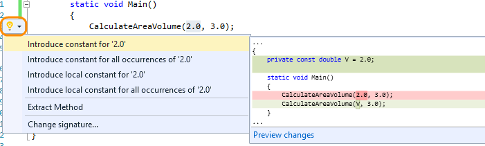

- There are two new core refactoring operations: **Inline temporary variable** and **Introduce local**. Here’s an example of the new **Introduce local** feature:

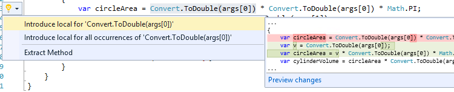

And an example of **Inline temporary variable**:

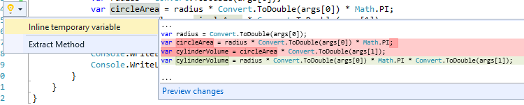

- Refactoring support for Visual Basic has been added for the first time, and has also been moved to the light bulb.
- Renaming has also been improved; now it highlights all the instances of the identifier you want to rename, letting you type the new name to all instances at once directly in the editor.

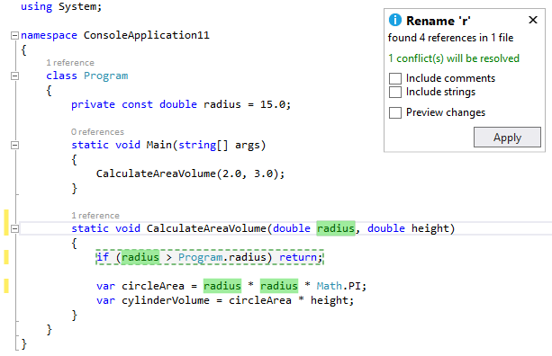

- You can get live code analysis and automatic fixes as you type, with specific code-aware guidance for the Microsoft platforms and NuGet packages that you're targeting. At Preview, you need to add the live FxCop analyzers through a NuGet package you get from the NuGet Gallery, as you would any other package. As you pull in any given live rule, it displaces the equivalent post-build FxCop rule, so you don’t get duplicate hits.
Here is an example from the [Code Analysis for Azure](http://aka.ms/azurecodeanalysis) package.

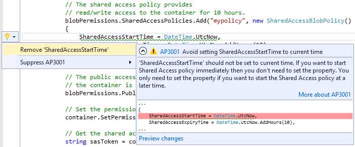

- The expression evaluator for C# and Visual Basic has been rewritten. Improvements include support for LINQ and lambda expressions in the Watch and Immediate Windows.

<h2> F# </h2>

### Language and Runtime Features

F# 4.0 contains numerous new language and runtime additions which fill in gaps, make more things "just work," and improve performance in key areas. Numerous bugs and small performance optimizations have been implemented across the compiler and runtime, as well.

- **Constructors as first-class functions** - Class names can now be used as first-class function values, representing the constructor(s) for that class.
- **Unification of 'mutable' and 'ref'** - The 'mutable' syntax can now be used everywhere, and captured values will be automatically converted to heap-based 'ref' values by the compiler when needed. A new optional warning has been added in case a developer wishes to be notified when this occurs.
- **Static parameters to provided methods** - Individual methods provided by type providers can now specify static parameters.
- **Non-nullable provided types** - Provided types can now be specified as non-nullable via the standard [&lt;AllowNullLiteral(false)&gt;].
- **Implicit quotation of method arguments** - Method arguments of type Expr&lt;'t&gt; can now be transparently auto-quoted, passing both the argument value and the AST of the expression that generated it.
- **Extended preprocessor grammar** - Boolean operators ||, && and ! can now be used, along with ( ) grouping, in #if preprocessor directives.
- **Rational exponents in units of measure** - units of measure now support rational exponents, which are sometimes used in physical sciences such as electrical engineering
- **Simplified use of units of measure values with 'printf'-style functions** - Unitized numerical values now work seamlessly with numerical printf format specifiers, without requiring the units to be removed.
- **Support for high-dimensional .NET arrays** - .NET arrays of rank 5 or greater can now be consumed by F# code.
- **Extension properties in object initializers** - Settable extension properties can now be assigned in object initializer expressions.
- **Inheritance from multiple generic interface instantiations** - F#-authored classes are now permitted to inherit from classes which implement multiple generic interface instantiations.
- **Multiple properties in 'StructuredFormatDisplayAttribute'** - %A formatting specified through [&lt;StructuredFormatDisplay&gt;] can now include multiple properties.
- **Leading 'Microsoft' namespace optional** - When consuming or opening modules and namespaces from FSharp.Core, the leading "Microsoft." is now optional.

### F# Runtime

- **Normalization of Array, List, and Seq modules** - the set of collection-processing functions is now consistent across the Array, List, and Seq modules (barring APIs not applicable to certain types), with dedicated, optimized implementations for each type.
- **Optimized structural hashing** - Significant optimizations have been made to improve the performance of generic hash comparison for primitive types, leading to performance gains by APIs such as 'distinct' and 'groupBy'.
- **Optimized non-structural comparison operators** - The FSharp.Core.Operators.NonStructuralComparison module can now be opened, replacing the default F# structural comparison operators with more efficient non-structural operators. This can provide significant performance gains when processing types with custom operator implementations, particularly value types.
- **Slicing syntax on F# lists** - F# lists now support slicing syntax for obtaining sub-lists.
- **Async extensions to System.Net.WebClient'** - WebClient extensions AsyncDownloadFile and AsyncDownloadData are now available.
- **Better Async stack traces** - Exceptions occuring in F# async computations now carry more user-friendly stack traces, making it easier to diagnose issues.
- **Interop APIs for Option** - Various new APIs were added to the Option module for converting to and from null objects and System.Nullable values.
- **Quotation active pattern for System.Decimal values** - An active pattern is now built in for matching constant literal System.Decimal values in quotations.

### F# IDE Features

There are new experiences and features in the Visual F# tools, as well, along with a number of bug fixes.

- **Script debugging** - F# scripts can now be debugged directly in the Visual Studio debugger.
- **Assembly metadata in project templates** - All F# project templates now contain a file AssemblyInfo.fs that contains common assembly-level metadata attributes.
- **Integrated up-to-date check** - F# projects now correctly report their "up-to-date" status when building in Visual Studio.
- **IntelliSense completion in object initializers** - Object initializer expressions now support IntelliSense completion of settable properties, using**Ctrl+Space**.
- **IntelliSense completion for named parameters** - Method and constructor calls now support IntelliSense auto-completion of named parameters, using**Ctrl+Space**.
- **Bug fixes around folder support** - Visual F# tools do not directly support folders in projects, but a number of project system bugs have been fixed improve the folder support added by the Visual F# Power Tools extension.

Learn more about [F#.](http://blogs.msdn.com/b/dotnet/archive/2015/04/29/rounding-out-visual-f-4-0-in-vs-2015-rc.aspx)

##  The .NET Framework 4.6

The newest version of the .NET Framework is 4.6. It features numerous enhancements in application development technologies such as ASP.NET, Windows Communication Foundation, and Windows Presentation Foundation. There are also changes in networking, the .NET Framework base class library, and the common language runtime (including a new 64-bit JIT compiler, native code compilation for Universal Windows Platform apps, assembly loader improvements).

Just a sampling of the changes include:

- ASP.NET Model Binding methods now return tasks.
- ADO.NET now supports the Always Encrypted feature available in SQL Server 2016 Community Technology Preview 2 (CTP2).
- Windows Presentation Foundation (WPF) offers better support for touch and improved HDPI layout.
- Windows Communication Foundation (WCF) now supports SSL version TLS 1.1 and TLS 1.2, in addition to SSL 3.0 and TLS 1.0.
- The .NET Framework base class library includes enhancements to garbage collection, to the task-based asynchronous pattern, and to cryptography. It also adds SIMD-enabled vector types, as well as support for compatibility switches that allow developers to provide a uniform opt-out mechanism for functionality supported by a new vesion of their libraries.

For additional detail and a complete list of the new features added to the .NET Framework, see [What's New in the .NET Framework](https://msdn.microsoft.com/library/ms171868.aspx).

##  Entity Framework

This release includes a preview version of Entity Framework 7 and an update of Entity Framework 6 that primarily includes bug fixes and community contributions.

### Entity Framework 7

The new version of Entity Framework enables new platforms and new data stores. Windows Phone, Windows Store, ASP.NET 5, and traditional desktop application can now use Entity Framework. This version of the framework supports relational databases as well as non-relational data stores such as Azure Table Storage and Redis. It includes an early preview of the EF7 runtime that is installed in new ASP.NET 5 projects. For more information on EF7, see  [What is EF7 all about](https://github.com/aspnet/EntityFramework/wiki/What-is-EF7-all-about).

### Entity Framework 6.x

This release includes the EF6.1.3 version of the runtime and tooling. EF6.1.3 includes bug fixes and community contributions; you can see a list of the changes included in EF6.1.3 on our Entity Framework [CodePlex](https://entityframework.codeplex.com/workitem/list/advanced?%20keyword=&status=Closed&type=All&priority=All&release=EF%20%206.1.3&assignedTo=All&component=All&sortField=AssignedTo&sortDirection=Ascending&page=0&reasonClosed=Fixed) site. 

The Entity Framework 6.1.1 runtime is included in a number of places in this release.

- The runtime will be installed if you create a new model using the Entity Framework Tools in a project that does not already have the EF runtime installed.
- The runtime is pre-installed in new ASP.NET projects, depending on the project template you select.

Learn more about [Entity Framework](http://blogs.msdn.com/b/adonet/archive/2015/07/20/entity-framework-and-visual-studio-2015-rtm.aspx).

##  Visual Studio IDE

### Shared Accounts

New in RTM, you can share the user accounts that you add in Visual Studio with other apps, such as with Blend for Visual Studio or with Microsoft Test Manager (and vice versa).

### Shared Projects

In this release, new templates are available to create empty shared projects for Visual Basic, C#, and JavaScript. These shared projects can now be referenced by several project types:

- Any un-flavored VB/C# projects (e.g. console apps, class libraries, Win form app)
- Windows Store 8.1 and Windows Phone 8.1 (VB/C#/JavaScript)
- Windows Phone Silverlight 8.0/8.1 (VB/C#)
- WPF and PCL

You can add/remove references to shared projects via the Reference Manager, on the Shared Projects tab. The shared project reference shows up under the References node in the Solution Explorer, but the code and assets in the shared project are treated as if they were files linked into the main project.

### Code Editor (All Languages)

**Find in Files** has been improved by enabling subsequent results to be appended to previous results; accumulated results can be deleted.

**Touch support** is now available in the Visual Studio editor for the following gestures:

- Scrolling (tapping-and-dragging on the editor surface on the regular and enhanced scrollbars)
- Pinch-to-Zoom
- Select a whole line by tapping in the editor margin, and select words by double-tapping them
- Invoking the editor context menu by pressing-and-holding

We are aware of one issue with touch, in that the double-tap gesture is not always reliable at lower zoom levels. We would like to hear feedback on the new touch support, and in particular any issues you may find.

### XAML Designer

Visual Studio customers will now be able edit their Templates and Styles stored in external resource dictionaries within the context of their usage. This experience has been further refined to use Peek to enable a true in-situ resource editing in the XAML designer.

### Custom Window Layouts

You can now save custom window layouts by clicking Save Window Layout from the Window menu, and apply a custom layout by clicking **Apply Window Layout** from the **Window** menu. You can also apply a layout by using the pre-assigned keyboard shortcuts. The first nine layouts also have keyboard shortcuts from Ctrl+Alt+1 to Ctrl+Alt+9. Other tasks you can perform include deleting, renaming, and reordering  layouts by clicking Manage Window Layout from the Window menu.

### High-Resolution Icons

Visual Studio supports high resolution icons in command bars, tool window toolbars (standard), the main menus, error list, status bar, and some Solution Explorer project types when your device is running at greater than 100% DPI scaling.

### UI Improvements

- Menus now appear in Title Case style instead of ALL CAPS style.
- The Configuration and Platform dropdown values for the Visual C++ Property Page dialog have been changed to remember the last user selection when the property page is closed and reopened.

### Visual Studio Feedback

The **Send a Frown** experience has been enhanced with better tools to report slowness, hangs, and crashes. You can now attach files or tag your feedback, to better describe the issue as well. Furthermore, the **Feedback** icons and menu items have been updated to improve discoverability.

### Visual Studio Extensibility

- You can now use high-resolution icons in your Visual Studio extensions.
- Add-ins are no longer supported in this release. Visual Studio add-in project templates and the Add-in Manager have been removed. We recommend that you convert your add-ins to VSPackage extensions. For more information, see the [FAQ: Converting Add-ins to VSPackage Extensions](https://msdn.microsoft.com/library/dn246938.aspx).
- You can now open an extensibility project even if you do not have the Visual Studio SDK installed.
- Additionally, you can install the Visual Studio SDK by using Visual Studio setup; you no longer have to go to a website. Here's how: On the Add Remove Programs menu, right-click Visual Studio 2015, and then select Modify. From the Visual Studio Set-up dialog, check Visual Studio Extensibility Tools under Common Tools.
- For increased portability and sharing of extension projects, you can use the NuGet versions of the Visual Studio SDK Reference Assemblies. For more information, see assemblies published by [Visual Studio Extensibility](http://www.nuget.org/profiles/VisualStudioExtensibility).

Learn more about [Visual Studio Extensibility](http://blogs.msdn.com/b/visualstudio/archive/2015/05/29/extending-visual-studio-2015.aspx).

##  Blend

We redesigned Blend for Visual Studio 2015 to provide you with an improved user interface development experience for creating beautiful XAML apps. Blend has a sleek new look consistent with Visual Studio, support for Solution and Team Explorer, and an enriched file reload experience to facilitate a better workflow between Blend and Visual Studio. We also delivered Blend's top most wanted features to help you be more productive:

- You can now write XAML more efficiently using XAML IntelliSense, which provides you with statement completion and navigation to source.
- You can also view and edit XAML controls and resources within the context in which they are used with XAML Peek Definition.
- Finding and fixing UI issues in your running app is now easier using UI tools for XAML debugging, which enable you to inspect the live visual tree and the properties of any elements in the tree.
- With NuGet support added, you can manage NuGet packages in Blend.
- We also replaced the Animation Workspace feature with the more powerful Synchronized Layouts feature that you can use to create many different window layout and roam them across machines.
- For power users who would rather use their keyboard instead of mouse, we made the Blend designer panes fully keyboard accessible.
- Finally, as part of Microsoft's ongoing effort towards creating universally accessible software, Blend is now fully screen reader and high-contrast accessible.

To learn more about new features added to Blend, visit our [Preview](http://blogs.msdn.com/b/visualstudio/archive/2014/11/13/blend-for-visual-studio-2015-preview.aspx) and [RC](http://blogs.msdn.com/b/wpf/archive/2015/04/29/blend-for-visual-studio-2015-rc.aspx) blog posts. As always, use [Blend's User Voice](http://visualstudio.uservoice.com/forums/121579-visual-studio/category/90110-blend-for-visual-studio) to post suggestions for features you would like us to include.

##  Debugging and Diagnostics

### Managed Edit and Continue on Attach

As of RC, you can edit and continue when you attach to .NET applications and when the environment variable 

complus_forceenc is set to 1 in the target process.

### Breakpoint Configuration

The new Breakpoint Settings window allows you to specify conditions and actions for your breakpoints. The window includes improved IntelliSense support for breakpoint conditions and actions. You can use undo (CTRL+Z) to restore deleted breakpoints.

### Lambda Expressions in Debugger Windows

You can now use lambda expressions in the Watch, Immediate, and other debugger windows in C# and Visual Basic.

### PerfTips

You can use the PerfTips feature to see how long code took to execute directly in the editor when you set breakpoints and step with the debugger.

### GPU Usage

The GPU Usage tool can be used to understand GPU usage of DirectX applications. Frame Time, Frame Rate, and GPU Utilization graphs are available while the applications are running live. In addition, by collecting and analyzing detailed GPU usage data, this tool can provide insights into the CPU and GPU execution time of each individual DirectX event, and therefore can be useful to determine whether the CPU or GPU is the performance bottleneck.

### Improvements in the C++ Debugger

When the C++ debugger is stopped at breakpoints, it can execute code in order to compute results, such as to show you data in the Watch and Immediate windows. If the debugger detects that a called function is deadlocked, it will attempt to resolve the issue.

When a C++ debugger launches a process, Windows now allocates memory using the normal heap rather than the debug normal heap. This results in a faster start for debugging. For more information, see [C++ Debugging Improvements in Visual Studio 2015](http://blogs.msdn.com/b/vcblog/archive/2014/10/06/debugging-improvements.aspx).

### UI debugging tools for XAML

We've added two new tools—the Live Visual Tree and the Live Property Explorer—that you can use to inspect the visual tree of your running WPF application, as well as the properties on any element in the tree. In short, these tools will allow you to select any element in your running app and show the final, computed and rendered properties. Here's more:

- **Live Visual Tree.** Now, you can view the full visual tree of a running application during a debug session. The Live Visual Tree is available when you press F5 in Visual Studio or attach to a running application. You can use the Live Visual Tree to select elements in a running application for inspection in the Live Property Explorer. Descendant count is displayed, and if the source information is available, you can instantly find the file and location of the element's definition.
- **Live Property Explorer.** Use this new tool to inspect the properties set on any element in a running application, grouped by the scope in which they are set. You can modify these properties during a debugging session and immediately see their changes in the running application.

Picking apart how properties override each other and figuring out winning behavior can prove difficult at design time. Now, by using our new UI debugging tools for XAML, you can perform these inspections at runtime, when you can take everything into account.

(Support for Windows Store apps will be released in a future update.)

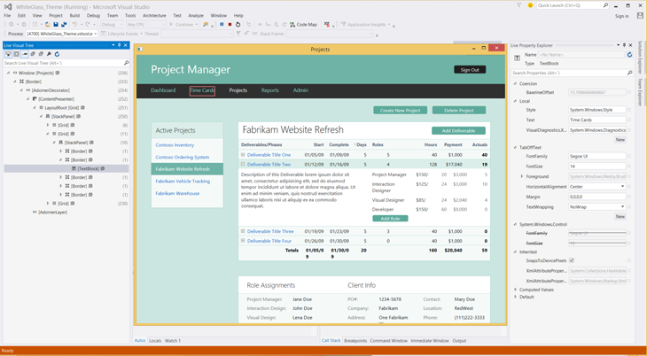

### Exception Settings

You can configure debugger exception settings by using the Exception Settings tool window. The new window is non-modal and includes improved performance, search, and filter capabilities.

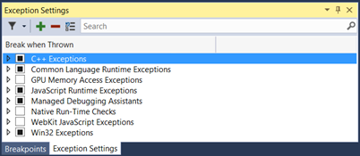

### Timeline Tool

Our new Timeline tool provides you with a scenario-centric view of the resources that your applications consume, which you can use to inspect, diagnose, and improve the performance of your WPF and Windows Store 8.1 applications.

The Timeline tool, which is in the Performance and Diagnostics hub, shows you how much time your application spends in preparing UI frames and in servicing networks and disk requests, and it does so in the context of scenarios such as Application Load and Page Load. 

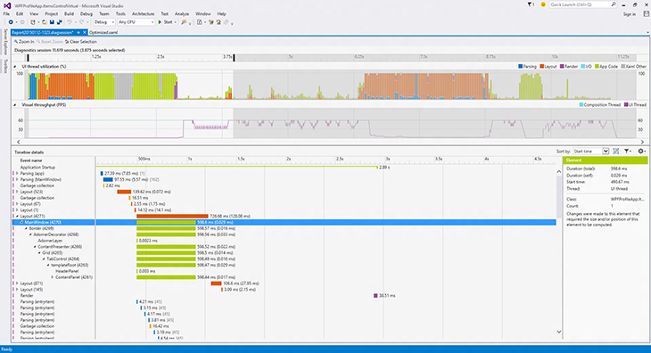

Learn more about the new [Timeline Tool in Visual Studio 2015](http://blogs.msdn.com/b/wpf/archive/2015/01/16/new-ui-performance-analysis-tool-for-wpf-applications.aspx).  (The new Timeline tool replaces the XAML UI Responsiveness tool.)

### Diagnostics Tools

We've added a new Diagnostic Tools window that appears when you start debugging (press F5). The Diagnostics Tools window contains the following features:

- **Events (with IntelliTrace)**   
Events (with IntelliTrace) gives you access to all Debugger Break, Output, and IntelliTrace events collected during your debugging session. The data is presented both as a timeline and as a tabular view. The two views are synchronized and can interact with each other.
- **Memory Usage**   
The Memory Usage tool allows you to monitor the memory usage of your app while you are debugging. You can also take and compare detailed snapshots of native and managed memory to analyze the cause of memory growth and memory leaks.
- **CPU Usage**   
The CPU Usage tool allows you to monitor the CPU usage of your application while you are debugging.   
(This tool replaces the CPU time PerfTip that was available in the Preview release of Visual Studio 2015.)

In previous releases, the Diagnostics Tools window supported the following project types and debugging configurations:

- Managed WPF, WinForms, and Console projects
- Native Win32, Console, and MFC projects
- ASP.NET 4 using IIS express only
- Managed or Native Windows Store projects running locally   
(Windows Store projects that are using JavaScript or are running on a phone are not supported)

The following improvements were made to the Diagnostic Tools window in the RC release:

- It can be moved to any window location within Visual Studio and remembers its location and size between debugging sessions
- It appears and shows data for a single process when attaching to a process using Debug -&gt; Attach to process
- It appears when debugging ASP.NET projects running on IIS
- It appears when debugging ASP.NET 5 projects
- It appears when debugging an app running on a remote Windows desktop device
- Memory snapshots can be viewed after you stop debugging
- Debugger Events (break events only) are available when debugging native projects

In RC, we also added the following new features:

**Just My Code**. When you press F5 to launch the debugger, it will show only your code so that you can understand performance issues and exceptions without noise from framework and other code. Because this new code filtering functionality in IntelliTrace suppresses system code and exposes only user code, it makes it easier for you to debug "just my code."

**Network Diagnostic Tool**. This new network diagnostic tool can help you diagnose network-related issues when building Windows store apps as well as universal apps that run across all Windows 10 devices, from Windows Phone to Xbox and Windows Store.

The network diagnostic tool records information about your app’s HTTP network operations,  including HTTP request and response headers, request and response payloads, cookies and  detailed timing information, and more. The network diagnostic tool can also help answer questions about common scenarios, such as:

- Authentication related issues (for example, why you're not able to access a resource) 
- Cache related issues (for example, why you're not getting the latest version of a resource) 
- How many bytes are downloaded when running common tasks of your apps 
- Where are the bottlenecks when accessing and downloading a resource 

To access the Network tool, open the Diagnostics Tools window in Visual Studio 2015.  On the **Debug** menu, select **Start Diagnostic Tools without  Debugging**.  Alternatively, just press Alt+F2.

And now, **new in RTM**, we've made the following improvements to the Diagnostic Tools window that appears while Debugging:

- Events from your app now appear in a single IntelliTrace Events track instead of being split between the IntelliTrace Events and Output Events tracks. Learn more about  [Debugging using IntelliTrace](http://blogs.msdn.com/b/visualstudioalm/archive/2015/04/29/walkthrough-of-live-debugging-using-intellitrace-in-visual-studio-2015-social-club.aspx).
- Events from your app now appear while your program is running; now you no longer have to press "Break All" to see events.
- You can now activate Historical Debugging for Tracepoints that you have set in your code, allowing you to see the source code and call stack.
- You can now see Garbage Collection and Snapshot events on the Memory Usage graph so that you can see when managed garbage collections occurred and when you took snapshots with the Memory Usage tool.
 

##  ASP.NET

### ASP.NET 4.6

#### ASP.NET Model Binding supports Task returning methods

ASP.NET Model Binding methods that were previously Task returning were not supported and threw an exception at runtime if configured. If applications are deployed with such methods, these methods will now be executed correctly. This change applies only to applications specifically targeting .NET 4.6 or later.

#### Enabling the .NET Compiler Platform (“Roslyn”) in ASP.NET applications

You can use the new language features of C# and VB in any ASP.NET 4.6 project. The Web Forms templates in VS 2015 have the[Microsoft.CodeDom.Providers.DotNetCompilerPlatform](https://www.nuget.org/packages/Microsoft.CodeDom.Providers.DotNetCompilerPlatform) package pre-installed.

#### Add support for HTTP/2

In Windows 10 and .NET Framework 4.6, we have added support for [HTTP/2](http://http2.github.io/). The main goal for HTTP/2 is to improve performance, latency, and network usage by using a single connection from browsers to a Web site.

#### Updated Frameworks and controls to support Entity Framework 6

We have updated Dynamic Data Framework, Entity Data Source Control and Universal Providers so they work with Entity Framework 6.

#### Authentication Updates

The ASP.NET 4.6 templates now use Open Id Connect middleware to authenticate with Azure AD. This makes the programming model to authenticate with Azure AD much easier.

If you select the “Individual User Accounts” option, then the ASP.NET 4.6 templates show how to use two-factor authentication and social logins using ASP.NET Identity.

#### ASP.NET MVC 5.2.3, Web Pages 3.2.3 and Web API 5.2.3

Template packages are updated to use the latest runtime packages for MVC 5.2, Web Pages 3.2 and Web API 2.2. For details on these packages updates see the [ASP.NET MVC 5.2.3, Web Pages 3.2.3 and Web API 5.2.3 Release](http://blogs.msdn.com/b/webdev/archive/2015/02/09/asp-net-mvc-5-2-3-web-pages-3-2-3-and-web-api-5-2-3-release.aspx) blog post.

#### ASP.NET Web API OData 5.3.1

The Web API OData scaffolders are updated to use ASP.NET Web OData 5.3.1. See [What's New in ASP.NET Web API OData 5.3](http://www.asp.net/web-api/overview/releases/whats-new-in-aspnet-web-api-odata-53).

#### SignalR 2.1.2

Template packages are updated to use SignalR 2.1.2. See the [SignalR release note](https://github.com/SignalR/SignalR/releases/tag/2.1.2) on GitHub.

#### Microsoft Owin 3.0 package

Template packages are updated to use Microsoft Owin 3.0 NuGet packages. See this [Katana 3.0 release note](https://katanaproject.codeplex.com/releases/view/113283).

#### ASP.NET Identity 2.2.1

ASP.NET Identity 2.2.1 has many bug fixes and performance improvements over 2.1. Read this [ASP.NET Identity 2.2.1](http://blogs.msdn.com/b/webdev/archive/2015/04/07/asp-net-identity-2-2-1.aspx) blog post for more details.

### ASP.NET Tooling Updates

#### JSON Editor Improvements

We have made some improvements in JSON editor, including performance improvements such as loading JSON schema asynchronously, caching of the child schemas, and supporting better IntelliSense. Additionally, there are the following new features:

- JSON Schema validation. Add JSON schema validation feature, based on the schema that is defined in the schema drop-down list.
- Un-minify context menu. You can right-click the JSON editor and select Un-minify context menu to un-minify any long arrays in the JSON file.
- Reload Schemas context menu. Visual Studio will cache the schema that is downloaded from Internet and will use the cache even after you restart Visual Studio. If you know the schema is changed, you can use the context menu Reload Schemas Ctrl+Shift+J to re-download the current used schema in the active JSON document, and then use it immediately on the current document.
- IntelliSense for package.json/bower.json. In addition to proving IntelliSense and validation for both package.json and bower.json files, Visual Studio also provides live IntelliSense for both Bower and npm packages directly within the JSON editor.
- Duplicate property validation. The JSON editor will now provide validation for any duplicate properties. This helps catch a common problem with JSON file authoring.
- The support for both IntelliSense and validation of JSON files has been greatly improved by fully supporting the JSON Schema draft v4 specification. Now it's much easier to identify required properties and the editor lets you easily sort the properties alphabetically. Formatting a minified JSON file will now automatically un-minify it.
- SchemaStore.org, which is an open source collection of useful JSON Schema files, is now supported. This means that any JSON file opened in Visual Studio that has a schema associated on SchemaStore.org will automatically get IntelliSense and validation.
- The support for JSON Schema authors has also been enhanced by better schema sanity validation.

#### HTML Editor Improvements

The HTML editor has updated IntelliSense for web standards and introduced the following new features:

- Better client template formatting. The HTML editor no longer parses or formats double-curly syntax {{…}}. This is to make sure that the content of that syntax is not treated as being HTML and therefore being invalidated, nor does it try to format the content, which cannot be done correctly by using the HTML formatter. This is great for Angular, Handlebars, Mustache, and other double-curly template syntaxes.
- Support for custom elements, polymer-elements and attributes. The HTML Editor no longer validates unknown attributes for custom elements, because different frameworks have many custom tags. There will no longer be squiggles under the unknown elements.
- Basic IntelliSense for Web Components. The HTML Editor has IntelliSense for &lt;link rel="import" /&gt; that is part of the Web Components standard.
- HTML element tooltips. Tooltips are supplied for HTML elements in the editor.
- #region support. The HTML editor now supports region folding. You can use the surrounding snippet to surround the current selection as well.
- Todo/Hack comment support in the Task List.
- Angular icons. Both Angular directives (ex. &lt;&lt;ng-view&gt;) and attributes (ex. ng-controller) now shows in IntelliSense with an Angular logo to make it easy to identify them.
- Bootstrap icons. The IntelliSense provided in HTML class attributes now shows with the Bootstrap logo if the class name was defined by the Bootstrap CSS file.

#### CSS/LESS/Sass Editor Improvements

- Todo/Hack comment support in the Task List.
- @viewport fix for the LESS editor. In the LESS editor, @viewport no longer shows verification warnings.
- Provide many more snippets. The CSS/LESS/Sass editor now provides more snippets to make your developing experience easier.
- An extension is now available for Visual Studio 2015 to compile both LESS, Scss and CoffeeScirpt. Download it [here](https://visualstudiogallery.msdn.microsoft.com/3b329021-cd7a-4a01-86fc-714c2d05bb6c). 

#### JSX editor (React.js)

Visual Studio now supports the JSX syntax of any files with the .jsx file extension. Get both IntelliSense, formatting and validation in the editor as you type. This editor was built in collaboration with the Facebook team that is responsible for the React.js library.

#### Browser Link

CSS is automatically synchronized. Saving the CSS file or changing it externally (for example, by using a LESS/SASS compiler) causes the entire CSS file to reload in the browser. If the file cannot auto-sync, Ctrl + S causes an automatic reload, which should put it back into a good state without having to refresh the linked browsers (Ctrl + Alt + Enter). The feature can be disabled in the toolbar.

Learn more about [ASP.NET](http://blogs.msdn.com/b/webdev/archive/2015/07/20/announcing-asp-net-4-6-and-asp-net-5-beta-5-in-visual-studio-2015-release.aspx).

### ASP.NET 5

ASP.NET 5 is a lean and composable .NET stack for building modern web applications for both cloud and on-premises servers. It includes the following features:

- New light-weight request pipeline
- Run on IIS, or self-hosted in your own process
- Built on new .NET Execution Environment (DNX) that can run on the full .NET Framework or on .NET Core, a new cloud-optimized runtime that supports true side-by-side versioning
- Runs cross-platform on Windows, Mac, and Linux
- NuGet everything, even the runtime itself
- Supports ASP.NET MVC 6 - a unified Web framework for Web UI and Web APIs
- Environment-based configuration for a seamless transition to the cloud
- Dependency injection out-of-the-box
- New Visual Studio project system and high productivity tooling experience
- All open source on GitHub through the .NET Foundation

Visual Studio 2015 includes the ASP.NET 5 beta5 runtime packages. These packages are still in preview and are not recommended for use in production. You can find all the details on the specific enhancements added and issues fixed in the [published release notes](https://github.com/aspnet/Home/releases/tag/v1.0.0-beta5) on GitHub.

Visual Studio 2015 comes with a new project system and integrated tooling experience for building ASP.NET 5 applications and for working with DNX projects. Some of the new tooling features include:

- New project system for creating cross-platform DNX based projects that can be built and run on Windows, Mac, and Linux.
- Templates for creating ASP.NET 5 Web Sites and Web APIs using MVC 6, Identity 3, and Entity Framework 7.
- Templates for creating DNX based class libraries and console applications
- Create and distribute cross-platform command-line tools via NuGet.
- Install and manage different DNX versions using the .NET Version Manager (DNVM) from the Developer Command Prompt.
- Integrated experience for finding, installing, and restoring NuGet packages.
- Use CTRL + . to find and install NuGet packages for unresolved symbols in your C# code.
- Integrated tooling for client-side Web development using NPM, Grunt/Gulp, and Bower, including package management integration and the new Task Runner Explorer.
- Run project level DNX commands directly from within Visual Studio by using the Run button dropdown menu.
- Create custom launch profiles that launch IIS Express, including setting of custom environment variables.
- Build NuGet packages from a single project that target multiple frameworks including .NET Core.
- Combined IntelliSense when building for multiple target frameworks from a single project.
- New Razor features introduced by ASP.NET 5, such as Tag Helpers, now light up in both IntelliSense and syntax highlighting.

#### New features in this release

- When you open a project that requires a version of DNX that is not available Visual Studio will prompt to install the required DNX version.
- You can now add references to lose assemblies using the Add Reference dialog.
- The ASP.NET 5 Web Application template now supports the Work and School Accounts option for authentication.
- The Host in Cloud option in the New ASP.NET Project dialog is now available for ASP.NET 5 projects.
- Use the Server Explorer to do remote editing of files under approot for ASP.NET 5 projects hosted on Azure.

For additional details, please see the [tooling release notes](http://go.microsoft.com/fwlink/?LinkId=534839) on GitHub, and our [.NET Web Development and Tools Blog](http://blogs.msdn.com/b/webdev/archive/2015/07/20/announcing-asp-net-4-6-and-asp-net-5-beta-5-in-visual-studio-2015-release.aspx).

##  Azure Tooling

#### Account Picker integration

The Account Picker is being used throughout the Web Publishing and Web App creation/selection dialogs, to enable one-click access to multiple accounts. You can log in once to multiple accounts, and have quick and easy access to select individual accounts as you publish resources.

#### API Apps

The API Apps preview template, publishing support, and Server Explorer visibility have all been migrated to Visual Studio 2015. Now you can create and deploy Azure API Apps using the latest version of Visual Studio. We've also improved the Swagger output functionality so that API app developers will have better out-of-the-box support for dynamically-generated Swagger from ASP.NET Web API.

#### WebJobs Tooling

You can now control web jobs on the Server Explorer WebJob node inside an Azure Website in the following ways:

- WebJobs nodes underneath Website nodes in Server Explorer.
- Start/Stop Continuous WebJobs from Server Explorer.
- Run On-demand or Scheduled jobs from Server Explorer.
- View WebJob Dashboard from Server Explorer.
- The View Dashboard context menu; use it to go to the Azure website's WebJob dashboard.

#### WebJobs SDK

The WebJobs SDK is pre-installed in the Azure WebJob project templates.

##  NuGet

#### NuGet 2.8.3

Support for DevExtreme project and BizTalkProject are added to 2.8.3. Check the [NuGet 2.8.3 release notes](http://docs.nuget.org/docs/release-notes/nuget-2.8.3) for detailed information.

#### NuGet Package Manager

The NuGet Package Manger user interface has been updated to provide easier management of packages across an entire solution in Visual Studio 2015. With a single view across packages installed in your projects, you can filter the list of available packages from the NuGet gallery, your installed packages, and the packages that have updates available.

#### NuGet Gallery

We've improved performance of the NuGet gallery with a new web service and integrated client. More details about NuGet updates can be found at[http://docs.nuget.org](http://docs.nuget.org/).

##  JavaScript

#### JavaScript Editor Support

We've updated the JavaScript editor to make it even more useful.

- **Tooling support for AngularJS**. Now, when you are writing apps using AngularJS, IntelliSense provides suggestions for Angular controllers, services, factories, directives, and animations.
- **New JavaScript language features** (from the ES6 version of JavaScript) are supported, including classes, arrow functions, and template strings.
- **Nav bar shared project support**. You can now use the navigation bar in the Shared project for Windows Universal App projects.
- **New navigation bar**. The new navigation bar makes it easier to navigate between major elements in JavaScript source code.
- **JSDoc comments**. Documentation comments written in the JSDoc format are now shown when using IntelliSense. (For more information about JSDoc comments, see [http://usejsdoc.org](http://usejsdoc.org/).)
- **Object literal IntelliSense**. The JavaScript editor provides you with IntelliSense suggestions when passing an object literal to functions documented using JSDoc.
- **Expand/collapse**. You can expand and collapse more sections of your JavaScript code, including multi-line comments, multi-line arrays, and all multi-line blocks.
- **Task List support**. You can use the Task List feature to review task comments, such as // TODO, in your JavaScript code.

##  TypeScript

Visual Studio 2015 includes the [1.5 release](http://blogs.msdn.com/b/typescript/archive/2015/07/20/announcing-typescript-1-5.aspx) of the TypeScript tools. This release adds rich support for ECMAScript 6, including modules, destructuring, for..of, spread, symbols, computed properties, let/const for ES3/ES5, and tagged string templates for ES3/ES5. In addition to the support for ES6, TypeScript 1.5 also adds support for the experimental ES7 decorator proposal, UMD and System.js module outputs, and a new lightweight, portable project file called ‘tsconfig.json’.

##  IntelliTest

In Visual Studio 2015, we've added IntelliTest, which explores your .NET code to generate test data and a suite of unit tests. For every statement in the code, a test input is generated that will execute that statement. A case analysis is performed for every conditional branch in the code. For example, 

if statements, assertions, and all operations that can throw exceptions are analyzed. This analysis is used to generate test data for a parameterized unit test for each of your methods, creating unit tests with maximum code coverage. Then you bring your domain knowledge to improve these unit tests.

We've also added the following functionality to IntelliTest:

- **Parameterized Unit Tests**. IntelliTest enables support for an API that you can use to guide test data generation, specify correctness properties of the code under test, and direct the exploration of the code under test. This API is available in the Microsoft.Pex.Framework namespace and can be used in the test methods (parameterized unit tests, factory methods) generated by IntelliTest. Consequently, the "IntelliTest" context menu command is now available from the generated test methods as well.
- **Test stubs creation**. "Create Unit Tests" is now available on the context menu as a command that provides the ability to create and configure a test project, a test class, and a test stub.

Learn more about [IntelliTest](https://msdn.microsoft.com/library/dn823749(v=vs.140).aspx) (formerly known as "Smart Unit Tests").

##  Application Insights

Along with various performance enhancements and bug fixes, Application Insights now includes the following updates:

- Application Insights tools in Visual Studio is now part of Visual Studio Connected Services. (To add Application Insights, open the Connected Services dialog and choose Application Insights from the list of services.)
- This update is fully compatible with projects that had Application Insights added in Visual Studio 2013 Update 3 or in Visual Studio 2013 Update 4.
- ASP.NET 5 developers, Windows 10 Universal Apps developers, and Windows 8.1 Universal Apps developers can add Application Insights to their projects right from Visual Studio.
- Windows 10 Universal Apps developers no longer have to be signed in to Azure to add the Application Insights SDK; instead, they can add it by using the Application Insights tools in Visual Studio.
- Because Application Insights uses the global account picker in Visual Studio, you can use the same account across Visual Studio.
- Now you can view "getting started"" information for Application Insights right from the Project's Service Reference folder; simply click the Getting Started folder.   
  
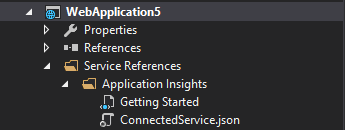

##  Release Management

With this feature, you can improve the process of managing the release of your app, deploy your app to a specific environment for each separate stage, and manage the steps in the process with approvals for each step. And by using the Release Management service for Visual Studio Online, you can also set up a release pipeline from check-in through to deployment without having to install and maintain an on-premises release management server.

An updated version of Release Management is available for Visual Studio 2015. This is very similar to the existing Release Management for Visual Studio 2013, but provides improved performance in the following areas:

- The release management client launch page, which shows an overview of the release process and notifications.
- Rendering and interactivity in other release management client pages, through additional caching.
- Synchronization of Active Directory and TFS security groups.
- Creation of new releases.

And **new in RTM**, you can now define components and release definitions for build definitions of the new build system included in Team Foundation Server 2015. And, while defining the component, you can specify the artifact for the component by using a component name that is same as (or contains) the name of the published artifact from the build definition.

Learn more about [Release Management](http://go.microsoft.com/fwlink?linkid=615900).

##  Git version control

It is easier to work with branches and see how the changes in your history diverged.

### Branches

You can organize your branches hierarchically by specifying a prefix:

Local branches and remote branches (including those you have not created locally) are shown separately in a tree view.

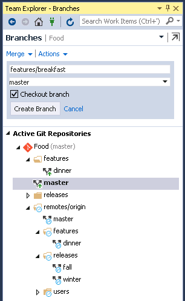

And as of RC, we reworked the Branches page:

- You can now merge from remote branches, as well as local branches.
- The branch that you are merging into is now fixed to the branch that is currently checked out.
- You can now rebase from the current branch onto any local or remote branch.
- You can checkout a remote branch by double-clicking it, or right-clicking it and then selecting Checkout.

### Remotes management

You can now configure your Git remotes in Team Explorer. In Repository Settings, there is a new Remotes section that shows the currently configured remotes where you can add, edit, or remove remotes. For example, if you need to change the URL of the origin remote, you can click Edit and change the fetch and/or push URL.

### Detailed history

You can now see how commits diverged in the history.

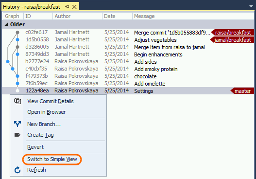

In the graph, merge commits are gray and non-merge commits are a brighter color. You can switch back and forth between the simple view and the detailed view. If the graph is truncated, you can resize it.

And in RC, we made several updates to the History graph:

- We've added a toolbar that allows you to control the level of detail that you see in the graph.
- We now highlight history lines to indicate which commits are reachable from the currently selected commit.
- We now show both lines of history if the local and remote branch differ. This is especially useful after rebasing a local branch.

### Rebase in Team Explorer

We now support rebase in Team Explorer. To initiate a rebase, click on the rebase flyout on the Branches page, or right click on a branch and select "Rebase Onto..."

### VSO repositories

We've improved the "getting started" experience when creating a VSO Repo, and there are a lot more changes coming to streamline the creation of a new repo. For RC, we made a small change to make it easier to add new code to an existing repo: If you connect to any repo using Team Explorer, and then select File | New Project, the dialog will now start out in the root of the repo you just connected to.

### Publish to Visual Studio Online

The Publish to Visual Studio Online feature dramatically simplifies the process of getting your local repository onto Visual Studio Online. What used to take 12 steps now takes 2. From the Team Explorer Sync page, the new Publish to Visual Studio Online section lets you select any of the user accounts in the Visual Studio account manager. Your Visual Studio online accounts are automatically available in a list; there's no need to remember URLs. When you are ready to share your code, simply pick a new or existing team project to host your repository, click publish, and you're done.

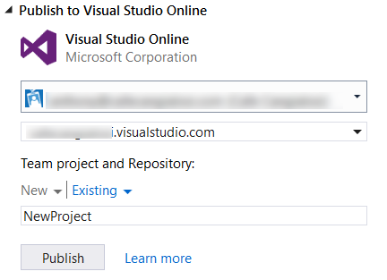

##  Single sign-in

You, like many other developers today, take advantage of multiple cloud services when developing your applications. For example, you've probably added a cloud backend to your applications to store data, stored your source code in the cloud, or published an application to a store.

In the past, each of these services required a separate sign-in process, and each service managed the signed-in user state separately.

With this release, we are reducing the authentication prompts required to access many integrated cloud services in Visual Studio. Now, when you authenticate to the first cloud service in Visual Studio, we will automatically sign you in, or reduce the authentication prompts for other integrated cloud services.

##  CodeLens

Find out more about your code, while staying focused on your work in the editor. Find code references, changes to your code, related TFS items, and unit tests – all without looking away from the code.

In this release, we have replaced the CodeLens "Authors" indicators with the new "Team Activity Timeline" and "Authors and Changes" history indicators.

- The **Team Activity Timeline** indicator shows the last author, and when the last change was made. Choosing this indicator opens **Team Activity View**, where you can look for patterns in changes to the code. This can help you to assess the impact of changes over time.
- The **Authors and Changes** indicator shows the number of authors that have changed the file, and the number of changes. Choosing this indicator opens a list of all the changes, details of the changes, and links to get more information and see the previous versions.

All the information from the indicators is available when your code is hosted in Team Foundation Version Control (in both Team Foundation Server and Visual Studio Online) and in Git repositories. When you are working in Team Foundation Server or Visual Studio Online, you can also get information about work items.

These indicators, together with the indicators available in previous versions, are displayed at the code element (method, field, or class) level for C# and Visual Basic files. The following is an example of the Team Activity Timeline indicator for a C# file:

The following is an example of the Authors and Changes indicator for a C# file:

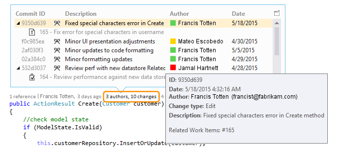

However, the indicators are now also displayed at file level for all other types of files (for example, C++, SQL, JavaScript, and other types of files). The following is an example of the Team Activity Timeline indicator for a file that is not a C# or Visual Basic code file:

##  Architecture, Design, and Modeling

### Code maps and dependency graphs

When you want to understand specific dependencies in your code, visualize them by creating **code maps**. You can then navigate these relationships by using the map, which appears next to your code. Code maps can also help you keep track of your place in the code while you work or debug code, so you'll read less code while you learn more about your code's design.

In the final RTM release, we made the shortcut menus for code elements and links much easier to use by grouping commands into sections related to selecting, editing, managing groups, and changing the layout of group contents. Notice also that test projects are displayed in a different style from other projects, and that we updated the icons for elements on the map to more appropriate versions.

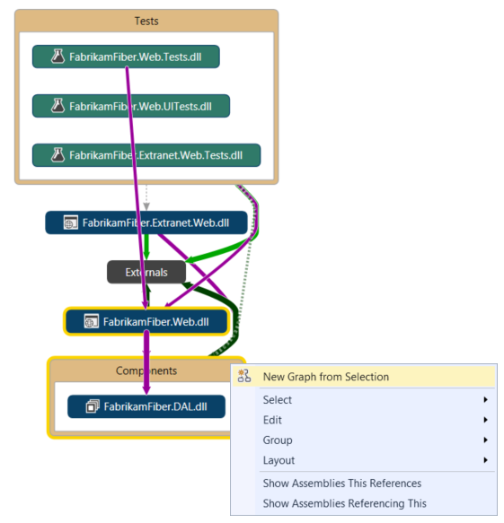

We also changed the way that contents of code elements are displayed, so you can now select more than one group and apply the layout style you want to all of them. Now, you can always get a useful dependency diagram when you expand an assembly, a namespace, or a type on a code map.

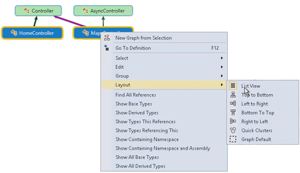

In the earlier preview and release candidate versions of Visual Studio 2015, we made changes that allow you to:

- **Get improved top-down diagrams**. For medium to large Visual Studio solutions, you can now use a simplified Architecture menu to get a more useful code maps for your solution. The assemblies of your solution are grouped by the solution folders, so you can see them in context and leverage the effort you've put in structuring the solution. You'll immediately see project and assembly references, and then the link types appear. In addition, the assemblies external to your solution are grouped in a more compact way.
- **Get reactive code maps more quickly**. Drag and drop operations produce an immediate result, and the links between nodes are created much more quickly, without affecting subsequent user-initiated operations such as expanding a node or requesting more nodes. In particular, the "Skip rebuilding your solution" option lets you get better performance when creating and editing diagrams. When you create code maps without building the solution, all the corner cases—such as when assemblies are not built—are now processed.
- **Filter code element nodes and groups**. You can quickly unclutter your maps by showing or hiding code elements based on their category, as well as by grouping code elements by solution folders, assemblies, namespaces, project folders, and types.
- **Filter relationships to make diagrams easier to read**. This includes cross group links, which makes working with the filter window less intrusive than it was in previous releases.
- **'Drill-in into dependency links' takes filters into account**. You get a useful, clear diagram when expanding it to understand the contributions to a dependency link. The diagram is less cluttered, and it takes into account the link filtering options you've selected.
- **Create diagrams from the Class View and Object Browser**. Drag and drop files and assemblies into a new or an existing map from the Class View and Object Browser windows.

Overall, the comprehensive list of improvements we've made to code maps includes:

- **Test Projects are styled differently and can be filtered**. You can now more easily and quickly identify test projects on a map because they are styled differently. They can also be filtered out so that you can focus on the application’s working code.
- **Code elements are added with their context**. Because diagrams now appear with their context (up to the assembly and solution folder that you can filter out if required), you get more useful diagrams when dragging and dropping code elements from Solution Explorer, Class View, and Object Browser; or when selecting elements in Solution Explorer and choosing Show on Code Map.
- **Simplified external dependency links**. Dependency links no longer represent the inheritance from System.Object, System.ValueType, System.Enum, and System.Delegate, which makes it easier to see external dependencies in your code map.

Learn more about [Code Maps](https://social.msdn.microsoft.com/Search/en-US?query=%22Code%20Map%22&beta=0&rn=Microsoft+Application+Lifecycle+Management&rq=site:blogs.msdn.com/b/visualstudioalm/&ac=2).

**Other design and modeling changes in this release**:

- **Layer diagrams**. Update these diagrams using the Class View and Object Browser. To meet software design requirements, use layer diagrams to describe the desired dependencies for your software. Keep code consistent with this design by finding code that doesn’t meet these constraints and validating future code with this baseline.
- **UML diagrams**. You can no longer create UML class diagrams and sequence diagrams from code. But you still create these diagrams using new UML elements.
- **Architecture Explorer**. You can no longer use Architecture Explorer to create diagrams. But you can still use Solution Explorer.

##  XAML Language Service

We’ve rebuilt the XAML language service on top of .NET Compiler Platform ("Roslyn") so that we can provide you with a fast, reliable, and modern XAML editing experience that includes IntelliSense.

This makes the XAML authoring experience equal to other first-class languages in Visual Studio. We'll also be able to deliver powerful feature sets around cross-language refactoring to you at a much faster cadence.

##  Miscellaneous

### Agents for Visual Studio 2015 no longer require a Test Controller

In Agents for Visual Studio 2015, you do not need a separate test controller because the agents can handle the orchestration by communicating with TFS 2015 or Visual Studio Online.

In all the new Visual Studio 2015 and TFS 2015 scenarios, we recommend that you use Agents for Visual Studio 2015.

However, if you do need the Test Agent or Test Controller to work with TFS 2013, we recommend that you use Agents for Visual Studio 2013 Update 5 and configure the Test Controller.

(The Test Controller is compatible with TFS 2015 as well as TFS 2013. But, Load Testing support in Visual Studio 2015 is not part of the agents, hence our recommendation that you install Agents for Visual Studio 2013 Update 5 and configure the controller.)

### Connected Services

The new Add Connected Service dialog in Visual Studio 2015 enables you to easily connect your application to [Azure Application Insights](http://go.microsoft.com/fwlink/?LinkID=529990), [Azure Storage](http://go.microsoft.com/fwlink/?LinkID=517539),[Azure Mobile Services](http://go.microsoft.com/fwlink/?LinkID=313674), [Office 365](http://go.microsoft.com/fwlink/?LinkID=517485), and [Salesforce](http://aka.ms/SalesforceConnectedServiceDownload). To add a Connected Service, right-click the References node and then select **Add Connected Service...**.

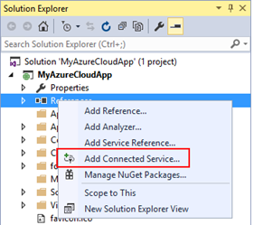

The Add Connected Service dialog contains all of the Connected Service providers currently installed and provides a way to get more information about the provider, the technologies it uses, and whether it's supported in the current project. Other providers can be discovered in the Extensions and Updates gallery by using the **Find more services...** link. The Add Connected Service dialog is also extensible. If you're a service developer, you can use our [Connected Services SDK](http://aka.ms/ConnectedServicesSDK) to build a provider that can improve discoverability and drive usage of your services.

#### Enterprise Single Sign-On

A common task for business application is to configure the application for enterprise single sign on using Azure Active Directory. You can now do this easily at any point during the construction of your application by right-clicking on your application and selecting **Configure Azure AD Authentication...**. This will bring up a wizard similar to the Add Connected Service experience to guide you through the process of configuring your application to work with Active Directory. Specifying an Active Directory Domain in the wizard will register your application with that Active Directory and configure your application to prompt for sign-in.

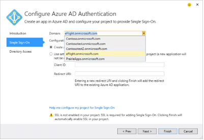

### IIS 10 Express for Visual Studio 2015 RC

The RC release included a new version of IIS 10 Express; its new functionality includes support for HTTP 2.0, as well as a sync up of bits with Windows 10.

##  Other Changes: Bug Fixes & Known Issues

For a complete description of technology improvements, bug fixes, and known issues in this release, see the following Knowledge Base (KB) article.

**Learn More**: [Description of Visual Studio 2015 RTM](http://go.microsoft.com/fwlink/?LinkId=613260)

## Related Releases

###  Azure SDK 2.7 for .NET

Azure SDK 2.7 is the first supported Azure SDK for the final release of Visual Studio 2015. Here are some of the new features and updates that will help improve your Azure development experience:

- **Sign-in improvements for Visual Studio 2015**: Azure SDK 2.7 for Visual Studio 2015 now includes support for accounts accessing Azure via [Role-Based Access Control](https://azure.microsoft.com/documentation/articles/role-based-access-control-configure/), Cloud Solution Providers, [DreamSpark](http://azure.microsoft.com/pricing/member-offers/dreamspark-students/), and other account and subscription types.
- **Cloud Explorer for Visual Studio 2015**: Azure SDK 2.7 includes Cloud Explorer for Visual Studio 2015 that provides a highly performant, scalable tool for searching and viewing your Azure resources, inspecting their properties, and performing key developer and diagnostic actions from within Visual Studio.
- **Remote debugging for Virtual Machines in Visual Studio 2015**: Remote debug processes running on Virtual Machines created using the Azure Resource Manager stack.
- **Azure Resource Manager Tools**: We've updated the Azure Resource Manager Tools to make working with the new Visual Studio Online build tasks easier. And, we've added improvements for working with Role Based Access Control (RBAC) and new subscription types.
- **Azure App Service Tools**: App Service Tools are now also available in Visual Studio 2015. This update brings Remote Profiling support for Web Apps, improvements to the Swagger generation for API Apps, and multiple account sign-in support. App Service tools now use the Azure Resource Management APIs for all features, and enables support for DreamSpark and Cloud Service Providers. We've also added support for the Azure API Apps preview release for Visual Studio 2015 developers in this update.
- **HDInsight Tools**: In this release, we have added views of execution graphs for Hive jobs running on Tez, expanded our Hive DML IntelliSense support, added NuGet for SCP.Net, upgraded our Storm templates, and added new templates for Pig.
- **Azure Data Factory Tools**: Now included in the Azure SDK are the Azure Data Factory Tools. Our goal is to simplify the Azure Data Factory authoring experience and remove on-boarding and deployment challenges. Our tailored experiences and rich tooling in the Azure Data Factory Tools improve productivity and efficiency for both new and advanced users. With this release, customers can interactively author and deploy data pipelines by using the Visual Studio interface. See the [Azure Data Factory blog post](http://go.microsoft.com/fwlink/?LinkId=617530) for more information about these tools.

###  Windows 10 SDK

This tools release updates Visual Studio 2015 to provide everything you need to build, debug, and submit apps for any Windows device running the Universal Windows Platform. Highlights include:

- Create a Universal Windows app in the language of your choice – C#, VB, C++ or JS – and deploy to a Windows 10 device.
- New debugging and diagnostic tools, including UI debugging tools for XAML apps and a network profiler.
- Create app packages for submission to the unified Store.
- The Windows 10 Mobile Emulator now takes advantage of your PC’s graphics hardware (GPU) to make the screen render faster. It provides a faster and more responsive debugging environment using Microsoft RemoteFx.
- You can now use the NFC simulation feature in the Windows 10 Mobile Emulator to build and test NFC/proximity-enabled universal apps.
- Rich XAML designer support for creating user experiences tailored for the device.
- .NET Native compilation of .NET apps in the cloud.

Learn more about [Windows 10 developer tools.](http://blogs.windows.com/buildingapps/2015/07/29/its-time-to-upgrade-your-world-and-your-apps/)

###  Python Tools for Visual Studio 2.2 (RTM)

Completely free Python support within Visual Studio.

- CPython, PyPy, IronPython and more
- Detailed IntelliSense
- Interactive debugging
- Integrated with Visual Studio features
- Free and open-source

Learn more about [Python Tools for Visual Studio](https://www.visualstudio.com/features/python-vs).

###  Visual Studio Tools for Unity 2.0 (RTM)

Turn Visual Studio into a powerful Unity development environment.

- Build multi-platform games
- Debug from Visual Studio
- Create Unity scripts in Visual Studio
- Experience enhanced productivity with Visual Studio

Learn more about [Visual Studio Tools for Unity](https://www.visualstudio.com/features/unitytools-vs.aspx).

###  Node.js Tools for Visual Studio 1.1 (RC)

Turn Visual Studio into a powerful Node.js development environment.

- Free and open source
- Intelligent code completion
- Advanced debugging and profiling
- Integration with other Visual Studio features and third-party tools
- Node.js, io.js, JavaScript, TypeScript, HTML, CSS, and JSON support

Learn more about [Node.js Tools for Visual Studio](https://www.visualstudio.com/features/node-js-vs.aspx).

###  Office Developer Tools for Visual Studio 2015

#### Development with Office 365 APIs

- Office 365 API Tools uses the new Connected Services in Visual Studio 2015 to provide a guided experience for developers to integrate Office 365 APIs into the project.
- Now you can let Office 365 API Tools auto-configure Single Sign-On in your ASP.NET MVC web applications by simply selecting "Configure Single Sign-On using Azure AD" in the Connected Services wizard.
- When you integrate Office 365 APIs into your project, Office 365 API Tools now downloads and installs the latest version of the Office 365 API client library NuGet packages from [NuGet.org](http://www.nuget.org/).

#### SharePoint add-in development

- When creating a SharePoint add-ins, the tools set the target SharePoint version to be the version of the debugging SharePoint website that you specify in the project creation wizard. The wizard shows which SharePoint version is selected and enables you to override that default. You can also change the target version after creating the project by using the SharePoint tab in Project Designer.
- The tools now install a NuGet package containing the [SharePoint Online Client Side Object Model](https://www.nuget.org/packages/Microsoft.SharePointOnline.CSOM/) (SPO-CSOM) into your project, when the target version is SharePoint Online. The tools also add references to the SharePoint Online CSOM assemblies to the project. The tools no longer rely on the [SharePoint Online Client Component SDK](https://www.microsoft.com/download/details.aspx?id=42038) that is released in the Microsoft Download Center. This makes it easier for you to upgrade the CSOM assemblies in the future by using the NuGet Package Manager in Visual Studio.
- You can now use either SAS or ACS connection strings for Microsoft Azure Service Bus to [debug and troubleshoot a remote event receiver in SharePoint add-ins](https://msdn.microsoft.com/library/office/dn275975.aspx).

#### Office add-in development

- In this release, the tools always create new apps for Office with a v1.1 manifest instead of v1.0, so that your apps can support the new capabilities in Office web apps and Office 2013 clients. For existing apps for Office that use a v1.0 manifest, the tools upgrade the manifest to v1.1 when any new capability is used that requires a v1.1 manifest.

Learn more about [Office Developer Tools for Visual Studio](https://www.visualstudio.com/features/office-tools-vs).

###  GitHub Extension for Visual Studio 2015 (RTM)

The easiest way to connect to your GitHub repositories in Visual Studio.

- Easy to install
- Connect to GitHub in Visual Studio
- Create repositories
- Clone repositories with one click
- Publish your local work to GitHub

Learn more about the [GitHub Extension for Visual Studio](https://visualstudio.github.com/).

###  Cloud-based Load Testing

#### Cloud-based load testing from Azure datacenters worldwide

Setting up the infrastructure required to run load testing just got easier: Now, you can perform cloud-based load testing from any of the supported Azure datacenters around the world.

Learn more about [choosing a location for your load test](http://blogs.msdn.com/b/visualstudioalm/archive/2015/04/30/load-test-enhancements-in-release-candidate-of-visual-studio-2015-enterprise-edition.aspx).

#### Cloud-based Load Test now supports advanced agent diagnostics

New in RTM: The capability to carry out test agent diagnostics for a cloud-based load test.

Debugging in the cloud is difficult because the machines are not accessible, and therefore, collecting logs or any other information from the test agents is not always possible. But now, with advanced agent diagnostics, you can collect logs from the test agents and have them attached to the cloud-load test results.

Learn more about test agent diagnostics in our [Using advanced diagnostics to debug issues in Cloud Load Test](http://blogs.msdn.com/b/visualstudioalm/archive/2015/02/06/using-advanced-diagnostics-to-debug-) blog post.

[Top of Page](#top)