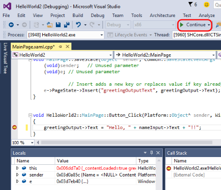
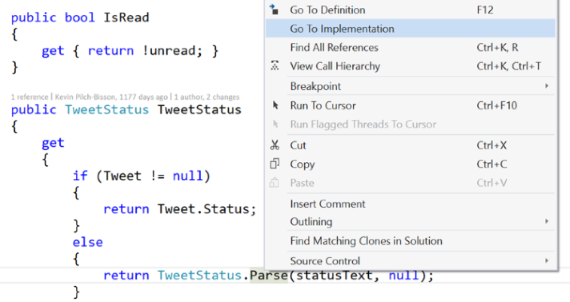
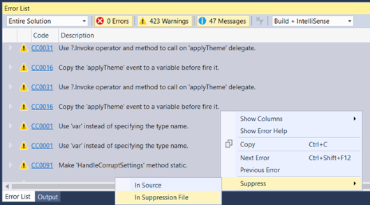
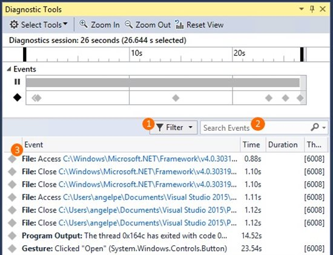
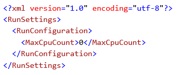

#  Visual Studio 2015 Update 1

### November 30, 2015

Today, we are happy to announce the release of Visual Studio 2015 Update 1. This release includes our latest feature and functionality updates.

## Download
You can download Visual Studio 2015 from [My.VisualStudio.com](https://www.visualstudio.com/vs/older-downloads/). My.VisualStudio.com requires a free [Dev Essentials](https://www.visualstudio.com/dev-essentials/) subscription, or a [Visual Studio Subscription](https://www.visualstudio.com/subscriptions/).

For additional information, see [How to Install a Specific Release of Visual Studio](https://msdn.microsoft.com/library/mt653628.aspx).

### What's new

Visual Studio:

- [Visual Studio Tools for Apache Cordova](#cordova)
- [Visual Studio Tools for Universal Windows Apps](#uniwinapps)
- [Visual C#](#Csharp)
- [Visual C++](#Cdoubleplus)
- [Debugging and Diagnostics](#debug)
- [.NET Framework 4.6.1](#dotnet)
- [ASP.NET](#asp)
- [TypeScript](#typescript)
- [Miscellaneous](#misc)

Other changes:

- [Bug Fixes & Known Issues](#Other)

Related releases:

- [ASP.NET 5 RC1](#aspnet)
- [Azure SDK 2.8 for .NET](#azsdknet)
- [Visual Studio Code Beta](#vscode)
- [Visual Studio GDB Debugger](#gdb)
- [Node.js Tools for Visual Studio](#nodejs)
- [NuGet 3.3](#nuget)

##  Tools for Apache Cordova

Developers using the Tools for Apache Cordova for the first time since RTM will find a richer development platform with support for iOS 9, the groundwork for Android 6 “Marshmallow”, a new plug-in for Azure AD authentication and dozens...even hundreds of bug fixes to improve the developer experience.

We also have a new destination for samples, tutorials and documentation, at [http://taco.visualstudio.com](http://taco.visualstudio.com/). And now, docs are sourced directly from GitHub, making it possible for developers to contribute tips, tricks, and corrections by using a simple pull request.

##  Tools for Universal Windows Apps

You can use Tools for Universal Windows Apps (v1.2) to build and submit apps to the Windows Store by targeting Windows 10 SDK Version 1511. Also included in this release are several developer productivity improvements to .NET Native, the XAML designer, the manifest designer, Windows Store packaging, and the debugger.

If you don't already have Tools for Universal Windows Apps installed, you can enable them by modifying the Visual Studio 2015 installation, or by directly installing them from the following link: [http://go.microsoft.com/fwlink/?LinkID=619614](http://go.microsoft.com/fwlink/?LinkID=619614)

<h2>  Visual C# </h2>

The **C# Interactive Window** is back in Visual Studio, as well as the command-line **C# REPL** window. (The Interactive Window is the REPL window inside Visual Studio.)

We've also released **scripting APIs** that enable you to build and run C# as a script. The scripting APIs are available on [GitHub](https://github.com/dotnet/roslyn/tree/master/src/Scripting/Core).

Additionally, we've released **csi.exe**, which is a tool that you can use to run a C# script file (.csx) from the Developer Command Prompt. For example, simply type csi myScript.csx to run your script file. Or, you can enter the command-line REPL mode to interactively evaluate snippets of C# code. To get to this mode, run the command csi without any arguments from the Developer Command Prompt.

##  Debugging and Diagnostics

###  Visual C++

In this release, we've added **Edit and Continue** support for **/BigObj**, which means that you can now Edit and Continue to edit code while debugging **Windows Store C++ projects**.

### IDE

The feature we've all been waiting for is finally here! You can now right-click on an interface or abstract method definition and navigate to its implementation by using the **Go To Implementation** shortcut.

We've also added a new refactoring that lets you convert get methods to properties by using the Quick Action command, **Ctrl + .**

Additionally, we've fixed bugs around [formatting](https://github.com/dotnet/roslyn/issues/2837), unnecessary casting, WinForms integration, crashing when searching for a class in the Solution Explorer, and go to def/MAS with "Use Tabs." And, we've made regions now auto-collapse upon first open.

#### Code Analysis

We now support the following scenarios in the IDE for managing the technical debt that comes from code analysis:

- View analysis warnings and messages for only 'my code changes.'
- 'Baseline' all current issues and "stay clean" moving forward.
- View and manage your baseline to audit suppressions, or to address existing technical debt.
- Remove duplicate instances of warnings in the error list to focus results to the unique set.

### Diagnostics Tools window

We've made several improvements to the Events tab of the Diagnostic Tools window to help you read through and understand its list of events even faster and more efficiently than before.

Here's what's new:

1. An **improved filtering menu** that you can customize in the following ways:   
By category, by thread, or by using [Just My Code](https://msdn.microsoft.com/library/dn457346.aspx?f=255&MSPPError=-2147217396).
2. A **new search control** that allows you to search all visible columns of the Events table.
3. New **category prefixes** that we've added to all events, which makes them easier to read.
  

**Note:** These Diagnostics Tools window improvements are available in all editions of Visual Studio. However, the following screenshot comes from Visual Studio Enterprise, which has IntelliTrace, and gives you access to more event categories than other editions.

Learn more about the [Diagnostics Tools window](http://blogs.msdn.com/b/visualstudioalm/archive/2015/11/12/searching-and-filtering-the-events-tab-of-the-diagnostic-tools-window.aspx).

### Profile your CPU Usage while debugging

Now, you can get a detailed per-function profile of your CPU Usage while you are debugging. You can turn CPU Profiling on and off while debugging and view the results when you are in a break state, which allows you to view a per-function breakdown of CPU Usage of code that executed between breakpoints and during steps. (To use this functionality, open the Diagnostic Tools window (Debug -&gt; Diagnostic Tools), switch to the CPU tab, and then click the "CPU Profiling" button.)

For more information, read our " [Profile Your CPU in the Debugger in Visual Studio 2015](http://blogs.msdn.com/b/visualstudioalm/archive/2015/10/28/profile-your-cpu-in-the-debugger-in-visual-studio-2015.aspx)" blog post.

##  .NET Framework 4.6.1

Visual Studio 2015 Update 1 now includes the latest version (4.6.1) of the .NET Framework. The .NET Framework 4.6.1 includes all the features and improvements of .NET 4.6 as well as numerous reliability, stability, security, and performance fixes. These are some of the top features in 4.6.1:

- [Windows Presentation Foundation (WPF)](https://msdn.microsoft.com/library/ms171868%28v=vs.110%29.aspx#WPF461) improvements for spell check, support for per-user custom dictionaries and improved touch performance
- [Cryptography](https://msdn.microsoft.com/library/ms171868%28v=vs.110%29.aspx#Crypto): Enhanced support for Elliptic Curve Digital Signature Algorithm  (ECDSA) X509 certificates
- [ADO.NET](https://msdn.microsoft.com/library/ms171868%28v=vs.110%29.aspx#ADO.NET461): Added support in SQL Connectivity for [AlwaysOn](https://msdn.microsoft.com/library/hh510230.aspx) and [Always Encrypted](https://msdn.microsoft.com/library/mt163865.aspx)
- [Windows Workflow Foundation](https://msdn.microsoft.com/library/ms171868%28v=vs.110%29.aspx#WWF461): System.Transactions APIs now support distributed transactions with a non-MSDTC coordinator
- [Profiling](https://msdn.microsoft.com/library/ms171868%28v=vs.110%29.aspx#Profile461) improvements related to IcorProfilerInfo interface
- [NGen](https://msdn.microsoft.com/library/ms171868%28v=vs.110%29.aspx#NGEN461): Introduction of NGen PDBs
- Added support to HttpListener API to enable server applications to use token binding
- Many other performance, stability, and reliability related fixes in RyuJIT, GC, WPF, and WCF.

For more details on the .NET Framework 4.6.1, see the following articles:

- [.NET Framework 4.6.1 RTM Blog](http://go.microsoft.com/fwlink/?LinkId=671770)
- [What's New in the .NET Framework](https://msdn.microsoft.com/library/ms171868%28v=vs.110%29.aspx): .NET Framework 4.6.1
- [Known issues for the .NET Framework 4.6.1](http://go.microsoft.com/fwlink/?LinkId=671749)
- [.NET Framework 4.6.1 Release Change List](http://go.microsoft.com/fwlink/?LinkId=671772)
- [Application Compatibility in the .NET Framework 4.6.1](https://msdn.microsoft.com/library/mt620033%28v=vs.110%29.aspx)
- [The .NET Framework API diff](http://go.microsoft.com/fwlink/?LinkId=671773) (on GitHub)

##  ASP.NET

#### ASP.NET 5 Beta 8

**Note**: While Visual Studio 2015 Update 1 includes ASP.NET 5 Beta 8, we strongly encourage you to try the newly released ASP.NET 5 RC1 that is now available for download; for details, see [ASP.NET 5 RC1](https://www.visualstudio.com/news/vs2015-update1-vs#aspnet) on this page.

ASP.NET 5 Beta 8 has the following features and updates:

- [**DNX Watcher**](https://github.com/aspnet/dnx-watch) allows developers who use the command line to experience the same edit and refresh browser experience that Visual Studio developers have been enjoying with ASP.NET 5 applications. DNX Watcher will watch the files in your project and show compilation errors if you have any. And as soon as your code can compile again, it will launch it and you can browse to your app.
- [**Localization**.](https://github.com/aspnet/Localization) Application developers can now develop web applications that can be translated and used by many different cultures. Middleware is capable of setting a culture so that it is accessible through Thread.CurrentCulture, and APIs have been provided to read strings from resource files that can be selected based on current culture.   
  
One of the great things about the localization libraries is that the keys for your localized strings are the values in the default culture. So, for example, if you are writing an application in English, you can put English strings as the key names.

So instead of your code being something like this:

var myMessage = resources.MyMessageString;
  
It can be this, instead, which makes it easier to correlate a message in your app to the code that sets it:

var myMessage = stringLocalizer[“Thank you for using our products”];

##  TypeScript

Visual Studio 2015 Update 1 includes features from the [1.6 and 1.7 releases of the TypeScript tools](https://github.com/Microsoft/TypeScript/wiki/Roadmap). It brings significant enhancements to TypeScript's type system and enables support for the polymorphic type, intersection types, local type declarations, generic type aliasing, and user-defined type guard functions.

It also completes ES6 support in TypeScript by adding ES6 Generators and ES6 Class expressions, and brings support for new ES7 feature proposals like ES7 Exponentiation operator and ES7 Async functions.

Additionally, React's JSX is now natively supported by the TypeScript compiler and tooling. This release also enables targeting Node v4's native implementations of ES6 features (--target ES6) while using Node native module system (--module commonjs), apart from an enhanced support for node module path resolution.

##  Miscellaneous

### Parallel Test Execution

The Visual Studio Test Platform introduces support parallel execution of test cases.

Parallel test execution leverages the available cores on the machine, and is realized by launching the test execution engine on each available core as a distinct process, and handing it a container (assembly, DLL, or relevant artifact containing the tests to execute), worth of tests to execute. The unit of scheduling is the test container. Within each container, the tests will be executed as per the semantics of the test framework. If there are many such containers, then as processes finish executing the tests within a container, they are handed the next available container.

Parallel Test Execution is enabled using the MaxCpuCount setting in the global section of the .runsettings file (as shown in the following screenshot).

The value for MaxCpuCount has the following semantics:

- ‘n’ (where 1 &lt;= n &lt;= number of cores) : upto ‘n’ processes will be launched.
- ‘n’ of any other value : The number of processes launched will be as many as the available cores on the machine.

Parallel execution is supported through all launch points - CI, command line (CLI) and the IDE (Test Explorer, CodeLens, various “Run” commands, etc.), and the Test Explorer indicators track the progress of tests executing in parallel.

#### ASP.NET 5 - MSTest support and CodeCoverage support

The Visual Studio Test Platform introduces support for MSTest framework-based tests for ASP.NET 5 applications.

The MSTest framework components are available from the NuGet gallery.

The Visual Studio Test Platform introduces support for CodeCoverage for ASP.NET 5 applications on the x86/x64 platforms that target the CoreCLR/CLR. 

### Subversion support for build

You can now build from subversion-based source control repositories, which can enable teams to centralize all build and work item management in TFS without having to move their source code right away.

### Pull requests hub in Visual Studio

Team Explorer now features a new Pull Requests hub where users can see the list of pull requests that they have created, as well as the pull requests that others have assigned to them.

We've also improved the Create Pull Request experience; now, users can publish branches and create pull requests in a single action.

### "Pull request required" work item policy

We now have a branch policy that requires associated work items for any pull request. Like the code reviewer and build policies, any code that is submitted to the branch must be submitted via pull request. When a pull request is created, the associated commits will be inspected for work item links, and if there is at least one link, the policy will be fulfilled.

Also, you can now link work items to pull requests directly, and if the pull request is directly linked to at least one work item, the policy will be fulfilled. (If no work items are linked to the pull request or the associated commits, the policy will fail.)

##  Other changes: Bug Fixes & Known Issues

For a complete description of technology improvements, bug fixes, and known issues in this release, see the following MSDN article.

**Learn More**: [Description of Visual Studio 2015 Update 1](http://go.microsoft.com/fwlink/?LinkId=691930)

## Related Releases

###  ASP.NET 5 RC1

ASP.NET 5 RC1 includes the following features and updates:

- Bootstrap Toolbox
- Bower Package Manager
- JSX Editor
- Better Colorization of Angular JS HTML attributes
- Improved Razor IntelliSense and Tag Helpers
- Can open MVC 4 projects
- NPM Package IntelliSense (similar to how Bower.json works)
- Cleaned up ASP.NET Solution Explorer

For more information about ASP.NET RC1, see the " [Announcing ASP.NET 5 Release Candidate 1](http://blogs.msdn.com/b/webdev/archive/2015/11/18/announcing-asp-net-5-release-candidate-1.aspx)" blog post. And to learn more about .NET Core and ASP.NET, see the " [Announcing .NET Core and ASP.NET 5 RC](http://blogs.msdn.com/b/dotnet/archive/2015/11/18/announcing-net-core-and-asp-net-5-rc.aspx)" blog post.

###  Azure SDK 2.8 for .NET

We've released Azure SDK 2.8 for Visual Studio 2013 and Visual Studio 2015, which includes the following features and updates:

- Azure Resource Manager
- "Send Azure Diagnostics data" to Application Insights
- New Support for Docker
- Updates to the Mobile Apps template
- Microsoft Azure Storage Explorer Preview
- Azure Service Fabric Tools
- Azure HDInsight Tools for Visual Studio
- Azure Data Factory Tools

For more detailed information about this release and its new features and updates, see the " [Announcing the Azure SDK 2.8 for .NET](https://azure.microsoft.com/blog/announcing-the-azure-sdk-2-8-for-net/)" blog post.

###  Visual Studio Code Beta

We have a number of exciting announcements to share with you about the beta for Visual Studio Code, including the following features and updates:

- Extensibility [Plug-in] Support in VS Code
- Extension Marketplace/Gallery
- Extensions "Ready to try now"
- VS Code is open-sourced

For detailed information and a download link, see the " [Announcing Visual Studio Code Beta](http://blogs.msdn.com/b/vscode/archive/2015/11/17/announcing-visual-studio-code-beta.aspx)" blog post.

###  Visual Studio GDB Debugger

We're pleased to introduce a new extension that enables the Visual Studio debugger to interact with GDB. This is particularly useful for debugging remote Linux targets. For example, you can use Visual Studio GDB Debugger in the following scenarios:

- Local GDB debugging
- GDB debugging on an Azure Linux VM
- GDB debugging on a Raspberry Pi with Azure IoT Hub

**Note**: To use this extension, you must have both Visual Studio 2015 Community or higher installed and the Visual C++ tools for Android or iOS installed.

For more information, see the " [Announcing the VS GDB Debugger extension](http://blogs.msdn.com/b/vcblog/archive/2015/11/18/announcing-the-vs-gdb-debugger-extension.aspx)" blog post.

###  Node.js Tools for Visual Studio

A free and open-source extension that turns Visual Studio into a powerful Node.js development environment, [Node.js Tools for Visual Studio](https://www.visualstudio.com/features/node-js-vs.aspx) includes many enhancements in the latest release, such as:

- Support for Node.js v4.x
- Support for npm v3.x, which helps work around potential MAX_PATH issues
- Faster and clutter-free IntelliSense, including better commit-character defaults, and the ability to opt in to a preview release of the upcoming ES6 IntelliSense engine
- Improved stability during debugging, and faster project load times
- Code snippet support

For more information, see the " [Node.js Tools 1.1 for Visual Studio Released](http://blogs.msdn.com/b/visualstudio/archive/2015/11/18/node-js-tools-1-1-for-visual-studio-released.aspx)" blog post.

###  NuGet

#### NuGet 3.3

The bundled version of the NuGet extension is 3.3. For more information about all the updates, see the [NuGet 3.3 release notes](http://docs.nuget.org/release-notes/nuget-3.3).

#### NuGet Package Manager

Based on user feedback, we've made several changes to the NuGet Package Manager user interface, to provide the following benefits:

- **Action buttons** that appear directly in the package list, which provides quicker access to common management functions.
- A **user interface separated into a series of tabs**, which are specific filters of the packages that you might work with in your projects.
- A **Consolidate** tab to use when you are working with the packages at the Solution level. It will also show a badge that indicates how many packages are candidates that you can update in projects.
- An **Update** tab to multi-select packages. Not only can you update all selected packages at one time, but you can also use this feature to choose all packages and perform an "Update All" action inside of a project or the solution. (And, like the Consolidate tab, it too shows a badge that indicates how many packages are candidates that you can update in projects.)

#### Improved Local Folder Support in NuGet

The NuGet tools now support significantly faster access to a specially crafted local folder store. To learn how to configure this repository, see the [NuGet 3.3 release notes](http://docs.nuget.org/release-notes/nuget-3.3) for detailed instructions.

[Top of Page](#top)