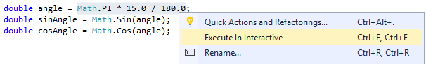
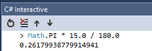
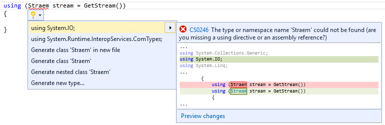
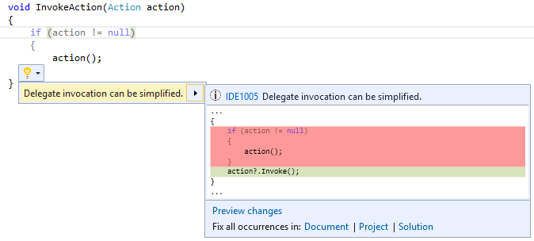
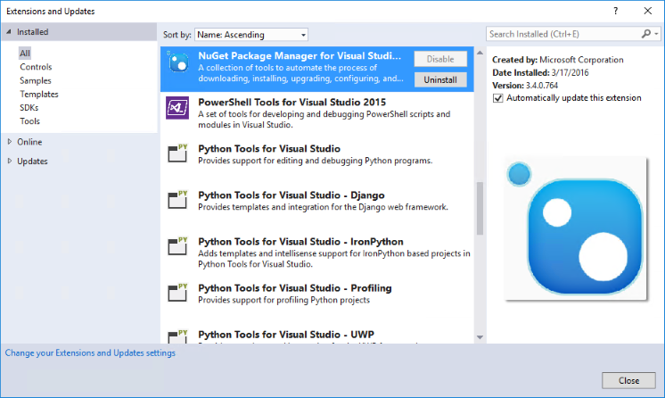
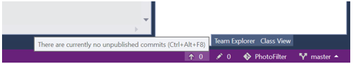
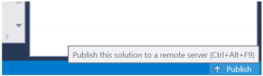
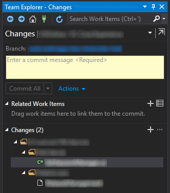

#  Visual Studio 2015 Update 2

### March 30, 2016

Today, we are happy to announce the release of Visual Studio 2015 Update 2. This release focuses on stability and on responding to the feedback we’ve received on RTM and 
Update 1. 

Some of the many things we've worked on since the RTM and Update 1 of Visual Studio include improving its  [performance](https://www.visualstudio.com/news/vs2015-update2-vs#perf) and [responsiveness](https://www.visualstudio.com/news/vs2015-update2-vs#response).

**Note** We welcome your continued feedback! For problems, let us know via the [Send Feedback](https://msdn.microsoft.com/library/mt632287.aspx) option in Visual Studio. For suggestions, let us know through [UserVoice](http://visualstudio.uservoice.com/forums/121579-visual-studio).

## Download
You can download Visual Studio 2015 from [My.VisualStudio.com](https://www.visualstudio.com/vs/older-downloads/). My.VisualStudio.com requires a free [Dev Essentials](https://www.visualstudio.com/dev-essentials/) subscription, or a [Visual Studio Subscription](https://www.visualstudio.com/subscriptions/).

For additional information, see [How to Install a Specific Release of Visual Studio](https://msdn.microsoft.com/library/mt653628.aspx).

To learn more about the most recent update of TFS, see the  [Team Foundation Server 2015 Update 2 release notes](https://www.visualstudio.com/news/tfs2015-update2-vs.aspx). To learn more about other related downloads, see the [Downloads](https://www.visualstudio.com/downloads/download-visual-studio-vs) page.

## What's New

Visual Studio:

- [Visual Studio Tools for Apache Cordova](#cordova)
- [Visual Studio Tools for Universal Windows App Development](#winapps)
- [Visual C++](#Cdoubleplus)
- [C# and Visual Basic](#CsharpAndVB)
- [.NET Framework 4.6.1](#dotnet)
- [Visual Studio IDE](#vside)
- [NuGet](#nuget)
- [TypeScript](#typescript)
- [Developer Analytics Tools](#devanalytic)
- [Team Explorer](#teamexp)
- [SQL Server Data Tools](#sql)
- [Python Tools for Visual Studio](#python)
- [Miscellaneous](#misc)

Other changes:

- [Performance & Reliability](#perfrel)
- [Bug Fixes & Known Issues](#bugs)

Related releases:

- [Azure SDK 2.9](#azuresdk)
- [Agents for Visual Studio 2015 with Update 2](https://www.visualstudio.com/downloads/download-visual-studio-vs#d-agents)
- [Microsoft Build Tools 2015 Update 2](https://www.visualstudio.com/downloads/download-visual-studio-vs#d-build-tools)
- [Microsoft Visual C++ 2015 Redistributable Update 2](https://www.visualstudio.com/downloads/download-visual-studio-vs#d-visual-c)
- [Remote Tools for Visual Studio 2015 Update 2](https://www.visualstudio.com/downloads/download-visual-studio-vs#d-remote-tools)
- [Modeling SDK for Visual Studio 2015 Update 2](https://www.visualstudio.com/downloads/download-visual-studio-vs#d-vs-modeling)

###  Visual Studio Tools for Apache Cordova

Visual Studio 2015 Update 2 includes Visual Studio Tools for Apache Cordova Update 8, with the following improvements:

- Support for Cordova 6.0.0
- Better build error messages
- Better npm integration (using a sandbox version and respecting system proxy settings)
- An updated plug-in list

For more information about this release, see the Visual Studio Tools for Apache Cordova  [release notes](http://taco.visualstudio.com/docs/release-update-8). And for more information about all the releases to date, see the Visual Studio Tools for Apache Cordova [blog](http://microsoft.github.io/vstacoblog/).

###  Visual Studio Tools for Universal Windows App Development

We have added following new features for Universal Windows Platform Tools in Visual Studio Update 2:

- **Universal Windows SDK Version Picker**. When creating a new UWP project, you can now select the version of the Windows SDK to target as well as the minimum OS version on which the apps are to be available.
- **Debugging C++ Background Task in Universal Windows Apps**. You can now debug Background task processes in a Universal Windows app in Visual Studio. You can access this option on the project Properties Debug tab.
- **Store Package Wizard Improvements**. The Store packaging wizard now caches the application name and package configurations. After a package has been associated with the Store, you can create an appx package without signing in again.

###  Visual C++

#### C++ Compiler

In this release, we've updated the C++ compiler and standard library with enhanced support for C++11 and C++14 features, as well as preliminary support for certain features expected to be in the C++17 standard. The most notable compiler changes are support for Variable Templates and constexpr improvements. 

Visual Studio 2015 Update 2 allows using /SDL with /AWAIT. We also removed /RTC limitation with Coroutines. Coroutines still are experimental, but ready for quality production code now. 

Additionally, we've fixed more than 300 compiler bugs, including many submitted by customers through [Microsoft Connect](https://connect.microsoft.com/VisualStudio) — thank you! (Some of these bug fixes address code generation issues in the compiler, and fixing them required source-breaking changes. For more information, review the [Breaking Changes in Visual C++ 2015 Update 2](https://msdn.microsoft.com/library/mt656697%28VS.140%29.aspx) list on MSDN.)

#### C++ Libraries

We’ve implemented every C++ Standard Library feature that's been voted into C++11, C++14, and the C++17-so-far  [Working Paper N4567](http://www.open-std.org/jtc1/sc22/wg21/docs/papers/2015/n4567.pdf) (pre-Jacksonville).

For UWP packages, ucrtbased.dll(debug) has been removed from the Microsoft.VCLibs, Version 14.0 framework package. We made this change to avoid lock-in to a specific version of the Windows 10 SDK. Visual Studio/MSBuild will automatically inject a reference to the Microsoft Universal CRT Debug Runtime Extension SDK for projects that reference the VCLibs framework package, which will then include the ucrtbased.dll in the application’s appx. For non-MSBuild build systems, you must manually include the ucrtbased.dll in the application’s appx file (App Local).

#### C++ IDE

The new SQLite-based database engine is now being used by default. This will speed up database operations like Go To Definitions and Find All References, and will significantly improve initial solution parse time. The setting has been moved to Tools -&gt; Options -&gt; Text Editor -&gt; C/C++ -&gt; Advanced (it was formerly under ...C/C++ -&gt; Experimental).   

#### Clang/C2 Platform Toolset

The Clang/C2 toolset that ships with Visual Studio 2015 Update 2 now supports the /bigobj switch, which is crucial for building large projects. It also includes several important bug fixes, both in the front-end and the back-end of the compiler. 

#### C++ MDD

##### Android

The Android offering now supports Gradle builds. Developers can use Gradle to build Android artifacts (.aar, .apk’s). To get started, take a look at the Gradle template provided as a part of the File -&gt; New -&gt; Visual C++ -&gt; Cross-platform menu.

##### iOS

Visual Studio now allows importing existing Xcode projects into Visual Studio through an entry-point wizard.

The iOS experience now also provides an improved edit-build-debug cycle as a result of using the following feature set, as follows:

- iOS developers can use provisioning profiles in Visual Studio.
- iOS developers can leverage frameworks and dylibs for their iOS offering.
- Visual Studio now provides an improved experience for dynamically refreshing debug targets.
- We've applied multiple bug fixes for clean-builds.

For scenarios where Xcode is still required—for example, signing your iOS application for the store or using Xcode instruments—developers can leverage the ‘Open in Xcode’ feature Visual Studio, which provides the ability to port a Visual Studio iOS project to Xcode and get going. 

###  C# and Visual Basic

While our focus for Update 2 was responding to customer feedback and fixing bugs, we also made improvements to the following features:

- You can now initialize the C# Interactive Window with a project's context, allowing immediate access to types inside that project. You can also send code fragments from your solution to be executed in the interactive window using a new "Execute In Interactive" command.    

- We improved the Add Using command to support "fuzzy" matching for misspelled types and to search the entire solution and metadata for the correct type, adding both a using and any needed project or metadata references.    

- We made Analyzer API improvements, including enabling Analyzer writers to  [mark their analyzers for concurrent execution](https://github.com/dotnet/roslyn/issues/6737), and providing control over whether analyzers run in generated code.  

- We added some new IDE refactorings including a light bulb action to simplify delegate invocations by using the new null condition operator, and a refactoring to make an asynchronous method synchronous when it does not use any 'await' operators.   

###  .NET Framework 4.6.1

#### ClickOnce Bootstrapper package

We have added the .NET Framework 4.6.1 ClickOnce Bootstrapper package for Visual Studio 2015 in Update 2. The ClickOnce Bootstrapper package for the .NET Framework 4.6.1 enables the .NET 4.6.1 entry in the list of available prerequisites in Visual Studio 2015, which makes it easier for you to publish applications for ClickOnce deployments.

###  Visual Studio IDE

- **TextMate snippet support**. Visual Studio now supports consuming tmSnippet files by placing them into a snippet folder. By default, snippets will be offered in the completion list for languages like GO, Groovy, Lua, Perl, R, Ruby, and Swift.
- **Auto-update for Extensions**. We are extending the auto-update functionality to more extensions. Extensions that are enabled for auto-update will be automatically downloaded and installed without user interaction. You no longer have to manually update and restart Visual Studio for these extensions. Extensions that are installed for ‘all users’ may now opt-in to this feature. As a user, you continue to have full control to enable/disable auto-updates for each extension in Tools -&gt; Extensions and Update or at a global level through Tools -&gt; Options.   

- The **Account Settings **dialog is now significantly more accessible through screen readers.

##### Version Control

Building on our work from Update 1, we’ve added even more functionality to the status bar to improve the version control experience. While Update 1 introduced two new compartments for displaying the repository name and current branch, these were limited to internal implementation. With Update 2, we’ve added three new compartments and opened these up for implementation by third-party source control providers.

Two of the new compartments will appear alongside the original Update 1 work and are meant to represent a quick look at the number of pending changes and unpublished commits. We know that different providers may have different paradigms around changes or syncing with the server, but we believe that these compartments provide enough flexibility to accommodate them. If one of the compartments doesn’t apply, a provider can choose to leave that compartment out of their implementation and it will be hidden from the status bar.

With the Git provider implemented out-of-the-box, navigating to the Sync, Changes, Branches, or Connections page in Team Explorer is just a click away! 

While the previously mentioned compartments are meant to provide more information and quick actions for solutions already under source control, the last one aims to provide a quick and easy way to get solutions into source control. With this new publish compartment, choosing a source control provider and adding your solution will be achievable in as little as one click! 

Out of the box, Publish will automatically wrap your solution in a Git repository and switch focus to the Sync page in Team Explorer to allow you to add a remote and publish your solution. As more providers support this feature, the Publish button will allow you to choose which source control you’d like to use for a given solution.

###  NuGet

The NuGet extension for Visual Studio has been updated to v3.4, which contains the following new features and improvements:

- The ability to copy PDBs from packages in xproj projects that are compiled.
- Support for iOS and Android build actions in contentFiles element.
- Support for running NuGet in Linux and Apple environments.
- An aggregated "All Repository Sources" source that allows you to search and install packages from any of your available configured package repositories.
- Significant performance improvements in package restore, and update actions.
- User interface performance tuning and improvements in the Update, Consolidate, and Installed views.
- Restoring packages for projects in parallel.
- Support for gzip compressed HTTP traffic, allowing NuGet clients to read gzip content-encoding from services.
- Improved handling of configuration files to prevent unnecessary edits and formatting. 
- Support for the netstandard and netstandardapp target framework moniker.

You can find a complete set of in-depth release notes with GitHub issues attached on the  [NuGet docs](http://docs.nuget.org/release-notes) site.

###  TypeScript

Visual Studio 2015 Update 2 includes TypeScript 1.8, which includes the following new and improved features.

- Support for string literal types, F-bounded polymorphism, 'this'-based type guards, and improved union type inference.
- The compiler now highlights common bugs such as unreachable code, missing return statements, and unused labels.
- JSX support has been updated to recognize and colorize the latest changes in the JSX syntax.
- Improved tsconfig.json support for better control over build configurations.
- Ability to design more modular libraries using module augmentation.
- JavaScript source files can be included as input to the TypeScript compiler.

For more information, see the  [TypeScript ](https://blogs.msdn.microsoft.com/typescript/2016/02/22/announcing-typescript-1-8-2/) blog on MSDN.

###  Developer Analytics Tools

Developer Analytics Tools v5.2 (formerly Application Insights Tools for Visual Studio) includes several new features and improvements over v4.0 that shipped with Visual Studio 2015 Update 1. 
Noteworthy additions include:

- Beta distribution of Universal Windows apps using HockeyApp.
- Beta distribution of Windows Forms apps using HockeyApp.
- Ability to search Application Insights telemetry emitted in the local debug session.
- Better targeted Application Insights toasts in Visual Studio.
- Streamlined experience to configure collection of traces from logging frameworks like log4net, NLog, and System.Diagnostics.

Additionally, we've made several improvements to the search functionality, as follows:

- Ability to jump from an exception stack trace to method in source code.
- Ability to search for related telemetry.
- Support for finding telemetry property values in code.
- Forward/Back history in search.

For more detailed information, see the  [technical release notes](https://azure.microsoft.com/en-in/documentation/articles/app-insights-release-notes-vsix/) on Microsoft Azure.

###  Team Explorer

With Update 2, opening Team Explorer and browsing work item queries in Visual Studio is faster.  Now, when you browse the query tree, Visual Studio progressively pulls the next level of query folders and items in the query hierarchy from the TFS server, so deeper tree levels are downloaded to the client when they are needed (in other words, when the hierarchy tree is expanded).

#### Git Improvements in Visual Studio

- **New Git commands**. In this update, we added support for reset (--hard and --mixed), cherry-pick, and staging.
- **Git LFS**. Visual Studio is now compatible with Git repos that are configured to use Git LFS (Large File Storage). Learn more about [Git LFS](https://git-lfs.github.com/).
- The **Changes page** now supports staging, with simple actions—such as double-click—to stage all and view diffs for changed files.    
  

- The **History view** supports filtering to find commits from a specific author or with keywords found in the commit comments. Selecting a commit will highlight the path to the head of the branch and the parent lineage.   
 

- The **Branches page **now makes it easier to fetch, pull, and push changes.

#### Gated Checkin for Team Foundation Version Control

TFVC projects can now set branch policies to require a successful build before any code can be submitted into a branch.

###  SQL Server Data Tools

Visual Studio 2015 Update 2 includes the latest updates of SQL Server Data Tools, which enable support for the latest features in  [Azure SQL Database](https://azure.microsoft.com/documentation/services/sql-database/) and [SQL Server 2016](https://www.microsoft.com/server-cloud/products/sql-server-2016/).

This update brings together the ease of developing, testing, and deploying a database on all supported versions of SQL Server and database platforms, both on-premises and cloud, by using Visual Studio. The update also includes database programmability surface area enhancements, and it improves the SQL connection experience in SQL Server Data Tools, which now automatically discovers SQL Server and Azure SQL Databases that you can connect to with a simple click.

Additionally, Visual Studio 2015 Update 2 addresses new Azure SQL Database authentication types, as well as Azure Active Directory Integrated and Password authentications.

###  Python Tools for Visual Studio

Visual Studio 2015 Update 2 includes an update to Python Tools 2.2.3. Python Tools provides editing, IntelliSense, debugging, profiling, and Azure functionality for the Python programming language.

This release also improves support for the newest versions of Django and fixes some other issues.

For full information and downloads, see the  [Python Tools 2.2.3 release page](https://github.com/Microsoft/PTVS/releases/tag/v2.2.3).

##  Miscellaneous

### Parallel Test Execution

The focus for Update 2 has been on fixing bugs and responding to user feedback. Based on such feedback, we have updated the Parallel Test Execution feature. The semantics remain the same as in Update 1 (when the feature was introduced). In Update 2, we have made it easier to control the feature in the following ways:

- The Visual Studio IDE Test Explorer sports a new toggle button that you can use to ON/OFF parallel execution. The setting is then persisted with the solution.
- From the command line,  

vstest.console.exe provides a new **/Parallel** switch.

### XAML Diagnostics

#### In-App Menu

Visual Studio 2015 now has an In-App Menu that makes it easier to perform UI Debugging. You can turn the selection mode on and off, toggle the layout adorners, and jump directly to the Live Visual Tree in Visual Studio. You can also collapse the In-App Menu by clicking on the bars below the icons, or turn the In-App Menu on and off from the Live Visual Tree.

#### Accessibility Properties in the Live Property Editor

The Live Property Explorer, which is available while debugging WPF or Universal Windows 10 projects, now enumerates the properties exposed by the automation peers in your app. This new view can help you diagnose many common issues that prevent your app from being accessible to all users.

## Other Changes

###  Performance & Responsiveness

We've made the following Visual Studio  **performance** improvements:

- Increased the speed of opening  [Team Explorer](https://www.visualstudio.com/news/vs2015-update2-vs#teamexp) and browsing work item queries in Visual Studio.
- Significantly reduced log file generation into the %temp% directory to save disk space and prevent application failures.
- Improved the reliability of downloading and installing VS Update and additional features.
- Reduced the time for Visual Studio to start when extensions are installed.
- Stopped Setup failures when downloading certain packages and selecting certain features.
- Added support for SQLite in our browsing database engine for C++, thereby significantly speeding up the original parsing of the user code and of all IntelliSense operations that require lookup.
- Stopped the "yield" sign from appearing next to your sign in name in the upper-right corner of the IDE. Now, your settings and profile roam for 90 days after authenticating within the IDE. (Credentials no longer expire after 7 days of no connection to visualstudio.com.)
- Updated the ASP.NET MVC5 templates. This fix addresses the vulnerability described in  [Microsoft Security Advisory 3137909](https://technet.microsoft.com/library/security/3137909).
- Enabled a new database engine; now, C++ Project load should be faster and experience fewer UI delays. 
- Increased the speed of extracting floating-point numbers with iostreams (in other words, "stream &gt;&gt; dbl"). It's now up to 19x faster, and all bits of the extracted value are now correct.
- Increased the speed of std::vector reallocation and std::copy(); they are up to 9x faster as they call memmove() for trivially copyable types (including user-defined types).
- Increased the speed of std::vector, which is up to 11x faster.
- Increased the speed of std::string::replace(), which is enormously faster when replacing same-size substrings. 
- Increased the speed of std::string::push_back(), which is up to 3x faster.
- Increased the speed of std::sub_match comparisons, as they now avoid constructing temporary std::strings.
- Increased the speed of std::function's copy constructor; it is slightly faster with a reduced codegen size.
- Improved the performance in NuGet in the Update, Installed, and Consolidate tabs; the restore and update actions; and the query speed to repositories such as NuGet.org that support gzip compression.
- Improved the initial completion list invocation in a session, which now responds much faster as the enumeration of snippets has been changed to be an asynchronous operation.
- Enhanced T4 text templates so that they now support C# 6.0.
- Made reliability improvements in Code Map (as related to the Windows docking scenarios).

We've also fixed Visual Studio  **responsiveness** in the following scenarios:

- Using the Help Viewer on Windows 10 when Edge is the default browser.
- Running setup when using read-only or disconnected drives.
- Working in Visual Studio while experiencing intermittent network connection issues.
- Editing C# or Visual Basic files while debugging, as described this MSDN article:  [Update for Microsoft Visual Studio 2015 (KB3110221)](https://msdn.microsoft.com/library/mt634751.aspx).
- Using the editor with custom snippets that are missing the &lt;Description&gt; or &lt;Title&gt; elements.
- Updating error list entries for Managed projects during editing. 
- Keeping Managed projects open for long sessions. (We stopped an OutOfMemoryException for solutions with Managed projects when they are kept open for long sessions. And we fixed the memory issues based on the heap dumps we received so far from the customers.)
- Opening memory profiler snapshots.
- Creating C++ Store applications.
- Using Visual Studio when a source controlled project path is too long.
- Loading a VC Project package during setup. 
- Shutting down Visual Studio. 
- Editing project properties. 
- Editing C++ code.
- Calling third-party components or other Visual Studio code when calling a method.
- Using the IntelliSense engine (vcpkgsrv) when it emits specific error messages in some localized builds. Now, an error message is displayed that says, "An IntelliSense PCH file was not generated". 
- Processing managed assembly referenced in a C++ project that contains a specific pattern of a named override in a generic types hierarchy. 
- Opening large C++ projects, which would stop Visual Studio from responding for up to three seconds. 
- Using Paste inside comments. 
- Invoking Create Declaration/Definition. 

###  Bug Fixes & Known Issues

For a complete description of technology improvements, bug fixes, and known issues in this release, see the following MSDN article. 

**Learn More**: [Description of Visual Studio 2015 Update 2](http://go.microsoft.com/fwlink/?LinkId=746671)

### Related Releases

####  Azure SDK 2.9

Here are some of the recent updates that can help improve your Azure development experience:

- Repaired issue in REST API Client Generation in which the string “Unknown Type” would appear as the name of the code-gen folder and/or the name of the namespace dropped into the generated code.
- Repaired issue related to Scheduled WebJobs in which the authentication information was failing to be passed to the Scheduler provisioning process. 
- Added support for secondary App Services in the “Services” tab of the App Service provisioning dialog. 

For more information, see the following [Azure Tools](https://azure.microsoft.com/blog/announcing-visual-studio-azure-tools-and-sdk-2-9) blog post.

[Top of Page](#top)