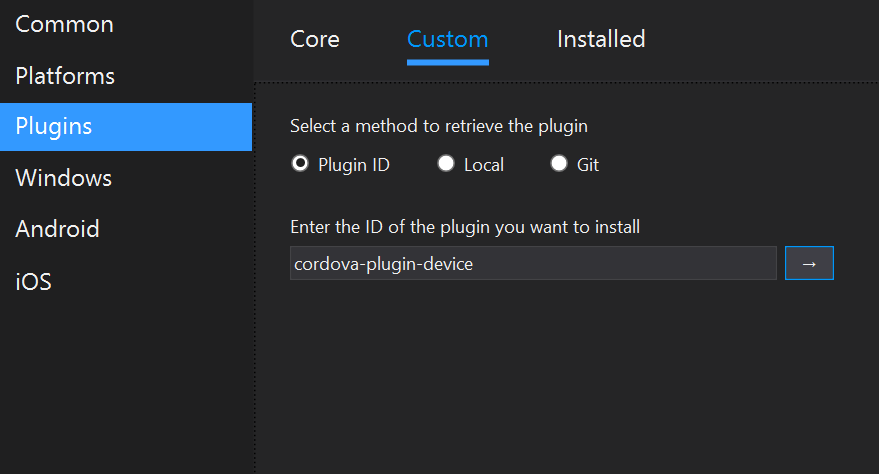
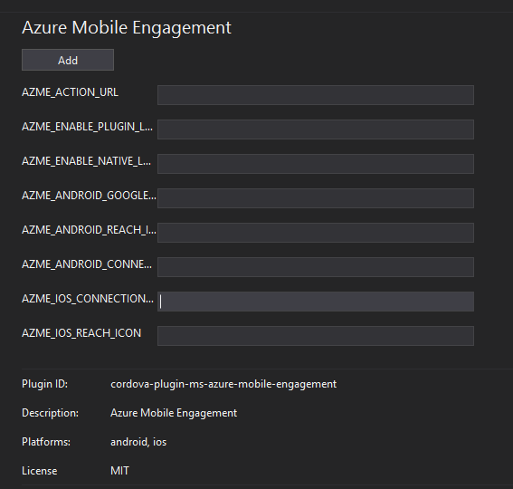
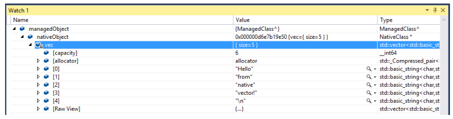
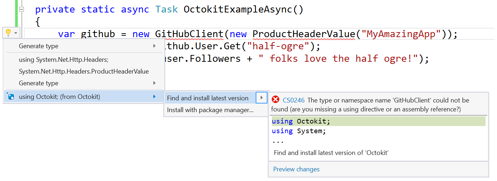
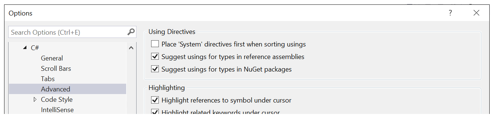

---
title: Visual Studio 2015 Update 3 Release Notes
description: Visual Studio 2015 Update 3 Release Notes
keywords: visualstudio
author: reshmim
ms.author: reshmim
manager: sacalla
ms.date: 09/07/2016
ms.topic: release-article
ms.prod: visual-studio-dev14
ms.service: visualstudio
ms.assetid: b678c3ad-297e-45a4-8a34-d56c9b3f7252
---

# Visual Studio 2015 Update 3

### Release Date: June 27, 2016

Today, we are happy to announce the release of Visual Studio 2015 Update 3.  One of the top issues reported in Update 2 was around high memory consumption. We addressed this issue in Update 3 RC, reached out to customers who had reported this issue, and received positive confirmation on the fix. In Update 3 you will see many such fixes addressing customer feedback around performance and stability. If these were not the release notes you were expecting, you have reached the release notes for the most current version.

Send us your feedback using the [Feedback](https://msdn.microsoft.com/library/mt632287.aspx) option in Visual Studio. You may also submit suggestions on the [Visual Studio 2015 UserVoice site](https://visualstudio.uservoice.com/forums/121579-visual-studio).

## Download
You can download Visual Studio 2015 from [My.VisualStudio.com](https://www.visualstudio.com/vs/older-downloads/). My.VisualStudio.com requires a free [Dev Essentials](https://www.visualstudio.com/dev-essentials/) subscription, or a [Visual Studio Subscription](https://www.visualstudio.com/subscriptions/).

For additional information, see [How to Install a Specific Release of Visual Studio](https://msdn.microsoft.com/library/mt653628.aspx).

## What's New?
* [Tools for Apache Cordova](#cordova)
* [Developer Analytics Tools](#devanalytics)
* [Debugging and Diagnostics](#debuggingdiag)
* [Visual Studio IDE](#vside)
* [Tools for Universal Windows apps](#uwp)
* [Architecture Tools](#arctools)
* [Visual C++](#visualcpp)
* [Node.js Tools for Visual Studio](#nodejs)
* [Web Developer Tools](#web)
* [TypeScript](#typescript)
* [C# and Visual Basic](#csharpandvb)
* [Team Explorer](#teamexplorer)
* [Xamarin](#xamarin)

## Related Releases
* [.NET Core 1.0.0 and .NET Core 1.0.0 SDK Preview 2](https://go.microsoft.com/fwlink/?LinkID=799417)

## Other Changes
* [Known Issues](#knownissues)

###  Tools for Apache Cordova
Visual Studio 2015 Update 3 includes Tools for Apache Cordova Update 10, including the improvements below. 
For more information about this release, see the Tools for Apache Cordova release notes for [Update 9](http://taco.visualstudio.com/docs/release-update-9/) 
and [Update 10](http://taco.visualstudio.com/docs/release-update-10/). For the latest news about 
our tools, visit our [Developer Blog](http://microsoft.github.io/vstacoblog/) on GitHub.

* We've added support for Cordova 6.1.1, the default version for new projects.
* We've retired the Cordova Plugin Registry that was used in Cordova 4.x, which means that we now require a minimum of Cordova 5.x or later to add plugins.
* The Core Plugins list has been updated and now includes plugins for enterprise scenarios, such as Intune, Azure engagement, security, and SQLite local storage.
* You can now add plugins from the config designer either by the npm package name or by the ID.

* You can also add plugins that require parameters from the config designer.

###  Developer Analytics Tools
We've added the following improvements in Developer Analytics Tools v7.0.2:

* Application Insights Trends, a tool for finding trends in your app's telemetry. 
* _**New**_ Exception telemetry in CodeLens.
* Production telemetry information added to exceptions in Diagnostic Tools.
* Support for adding Application Insights to ASP.NET Core RC2 projects from Visual Studio.
* Diagnostic Tools events for ASP.NET 5 RC1 and ASP.NET Core RC2 projects.
* Automatic refreshes of Application Insights Search when detail filters, time ranges, and events are selected.
* Go to Code from requests in Search.
* Improved HockeyApp sign-in experience.

For more information, see the [technical release notes](https://azure.microsoft.com/en-in/documentation/articles/app-insights-release-notes-vsix/) in the Microsoft Azure documentation.

###  Debugging and Diagnostics
[Diagnostic Tools](https://blogs.msdn.microsoft.com/visualstudioalm/2015/01/16/diagnostic-tools-debugger-window-in-visual-studio-2015/) 
support for apps running on OneCore devices, including HoloLens and IOT, has been added in Update 3.

#### C++ Edit and Continue improvements:
* Better performance and reliability when FASTLINK is enabled.
* Successful application of code changes to static libraries no longer produces Stale Code.
* C4656 warnings will no longer appear for false positive type changes during recompilation.
* Support for adding a new type with the same name crossing multiple compilation units.

#### XAML UI Debugging improvements:
* Whenever the focus changes in your app, the new Track Focus feature in the Live Visual Tree will cause selection in the Live Visual Tree to update to the currently focused element.

###  Visual Studio IDE
#### Subscriptions and product keys
We've addressed feedback in Update 3 from customers using subscriptions through an online identity or product keys to unlock the IDE, in the following ways:
* You are no longer required to visit [https://my.visualstudio.com](https://my.visualstudio.com) to activate your assigned Visual Studio Cloud subscription, and can immediately start using the Visual Studio IDE as soon as the subscription is assigned.
* We've improved error handling when applying a product key.
* All user account and licensing operations are now secured by using HTTPS.
* We've made accessibility improvements in the Account Settings dialog for activating a subscription and entering a product key.
* _**New**_ Re-authentication every ~8 days is no longer required to keep the personalization account active and synchronizing roaming settings.    

###  Tools for Universal Windows Apps
Visual Studio 2015 Update 3 comes with several enhancements to the Tools for Universal Windows apps. A key improvement allows you to sign in with Azure Active Directory credentials for an AAD Store 
account when creating a package to submit to the Windows Store. Once the project has been associated with the Windows Store, you will no longer need to sign in to create a package to submit to the Store.

#### .NET Native for Universal Windows Apps
.NET Native 1.4 is a minor servicing release that improves performance, addresses several customer reported bugs and improves Release build compilation times of large apps. XAML applications and [Unity](http://unity3d.com/) games that use .NET Native 1.4 will have better runtime performance. These improvements were achieved by making both reflection and native API calls faster.

### Architecture Tools
We've addressed feedback from customers about improving performance and reliability.
#### Domain Specific Graphical Designers (including EDMX and DBML)
On Windows 10, Visual Studio is no longer unresponsive when you are opening or attempting to edit large EDMX or DBML diagrams while the on-screen keyboard is displayed.

#### Code Map
* Visual Studio is no longer unresponsive when you are trying to "Generate Code Map for Solution" when the solution contained installer projects (.vdproj).
* Visual Studio is no longer unresponsive when you run a code map command from the code editor and close the Code Map window as soon as it appears.

#### Layer Validation
* When building a solution having a modeling project containing a Layer diagram with a Validate action, a CPU core is no longer used after the build completes.
* You can now validate a layer diagram when its parent modeling project is referencing PCL libraries (for instance ODP.Net).

### Node.js Tools for Visual Studio
_**New**_ Node.js Tools 1.2 RC for Visual Studio is now available for [download](http://aka.ms/ntvslatest). We expect this release to provide significantly improved stability and performance, including reducing out-of-memory crashes seen in prior releases.

Other highlights include: 
* Faster, better ES6 IntelliSense
* More reliable debugging
* Improved Unit Testing experiences (including Tape support)
* .npm command in more project types

For full information and downloads, see the [Node.js Tools 1.2 RC release page](http://aka.ms/ntvslatest). 

### Web Developer Tools
For ASP.NET Web Application projects, when "Enable Edit and Continue" checkbox is unchecked, the IIS Express process will no longer stop every time you stop debugging.

### Visual C++
Enhancements, such as new checks and warning messages for the C++ Compiler, as well as support and performance improvements for C# and Visual Basic coding, were included in Update 3.

#### C++ Compiler
*	We now check the access of a deleted trivial copy/move ctor. Without the check, we may incorrectly call the defaulted copy ctor (in which the implementation can be ill-formed) and cause potential runtime bad code generation.
*	`Std::is_convertible` now correctly detects self-assignment of a class type when the copy-constructor is deleted or private.
*	As the last phase of completing the deprecation of attributed ATL support started in Visual Studio 2008, we've added a new deprecation warning to the compiler. With Visual Studio 2015 Update 3, usages of attributed ATL code will generate an on-by-default level 1 warning. C4467
*	When using PCH files, mismatched -I include directories to the compiler between -Yc and -Yu compilations will now produce a new warning. C4599
*	When using PCH files, mismatched #include directives in source files between -Yc and -Yu compilations will now produce a warning. C4598

For more information on how these changes might impact your existing code, see [Visual C++ Porting and Upgrading Guide](http://go.microsoft.com/fwlink/?LinkId=799721) on MSDN.

#### C++ Libraries

* We've restored debug mode performance when destroying ranges of trivial objects that regressed in Update 2, like in vector<char>.
* We've implemented the swappable traits from the C++17 working paper, from the proposal
  [P0185 Adding \[nothrow-\]swappable traits](http://www.open-std.org/jtc1/sc22/wg21/docs/papers/2016/p0185r1.html).
  As a speculative C++17 feature, the traits (`is_swappable`, `is_swappable_with`, `is_nothrow_swappable`, and
  `is_nothrow_swappable_with`) are only visible, and the constraints on `std::swap` are only active, when compiling
  with `/std:c++latest`.
* We've removed ETW eventing calls from vcruntime140.dll and static libraries that previously fired during process startup and dllmain.
* _**New**_ We've removed symbol name length in common machinery used by STL containers, such as std::vector, reducing likelihood of C4503 warnings. 
    For example, the following type no longer generates a warning: concurrency::concurrent_unordered_map<wstring, vector<pair<uint64_t, vector<uint8_t>>>>.

* ATL/MFC/AMP/PPL: Lots of conformance fixes related to two-phase lookup, as follows:

   * `_com_ptr_t` now has a move constructor and move assignment operator.

  * MFC: Fixed handling of HMENU values that occasionally prevented menus from being properly displayed in 64-bit applications.

  * ATL/MFC: No longer emit the following warnings:
  -	Function overriding/hiding: C4263, C4264, C4266
  -	Mismatching exception specification: C4986
  -	/analyze: C6386

  * ATL: All variations of AtlThrow are now properly marked with `__declspec(noreturn)`. This prevents erroneous SAL warnings from being emitted.

  * ATL: Fixed/Improved several SAL annotations.

  * `/std:c++latest` enables the following new features: P0025R1 "clamp()", P0185R1 "is_swappable, is_nothrow_swappable", and P0272R1 "Non-const basic_string::data().".

  * /std:c++latest also controls the removal of the following old features: N4190 "Removing auto_ptr, random_shuffle(), And Old <functional> Stuff", P0004R1 "Removing Deprecated Iostreams Aliases", LWG 2385 "function::assign allocator argument doesn't make sense", and various non-Standard features (the std::tr1 namespace, some TR1-only machinery, and the std::identity struct).

  * Silent bad codegen in atomic<int64_t>/atomic<uint64_t> on x86 was fixed.

  * The STL now avoids using thread-safe "magic statics" except when absolutely necessary, improving codegen.

  * Tuple's perfect forwarding constructor now avoids out-competing the copy constructor, fixing compiler errors in certain scenarios.

* Coroutines:
  *	Deprecated the following: `__yield_value` & `__await` keywords. Use `co_await / co_yield` instead.
  * Added deprecation notice to: `to_address` and `from_promise` members of `coroutine_handle` class. Instead of `coroutine_handle::to_address()`, use  `coroutine_handle::address()`.
  * Instead of `coroutine_handle::from_promise(Promise *P)`, use ` coroutine_handle::from_promise(Promise &P)`.

* We've improved performance of the following:
  `std::equal` and `std::lexicographical_compare` by dispatching to memcmp and memchr more aggressively, resulting in large performance improvements in some scenarios. For example: equal(char*,char*,char*, char*) on 64 bit platforms.
  * debug builds significantly by reducing the number of bookkeeping function calls in our iterator debugging machinery.
  * string::push_back has improved another 40% vs. Update 2 in release builds, with more substantial improvements in debug builds. (This is in addition to large performance improvements here that shipped in Update 2).
  * Debug builds across all standard algorithms have improved  by eliminating several types of empty template metaprogramming support calls (for example,` _Iter_cat`),
  across all algorithms that take predicates by reducing the number of predicate copies.
  * `std::mismatch` under `_ITERATOR_DEBUG_LEVEL` 1 and 2 by range checking the second range where possible ahead of iteration.

*  We've applied improved diagnostics for `_SCL_INSECURE_DEPRECATE` messages to the remaining algorithms (in Update 2 only a small number of algorithms were hooked into the new deprecation mechanism). This also improves the debugging experience when debugging into the standard algorithms, as there is no longer any `_ITERATOR_DEBUG_LEVEL` preprocessor interaction declaring multiple copies of standard algorithms. We have also fixed the following:
  *  We've fixed the inability to compile some functions like mismatch(iter, iter, T[]) due to interaction between our nonstandard `_ITERATOR_DEBUG_ARRAY_OVERLOADS` and dual-range algorithms.
*  We've fixed violations of the off-by-default warning C4242 in the STL.
*  We've fixed possible integer overflow bug in std::pop_heap.
*  We've fixed potential hang under /clr:pure due to CLR-inserted LoadLibrary calls while holding the locale lock.

#### C++/CLI Debugging
* _**New**_ The C++/CLI expression evaluator now supports debugger features, such as Natvis, that were previously only supported for pure native apps.  Now in a mixed managed/native app when objects are listed in a variable window (or inside a datatip), they will expand just like they do in a pure native app as defined by the type visualizers.

#### Clang/C2 Platform Toolset

We've integrated Clang 3.8 release into Clang/C2 and provided a 64-bit hosted toolset.

#### C++ MDD

We've enabled support for the latest Android NDK version R11C and the capability to upgrade the current projects to target the latest NDK.

###  TypeScript

_**New**_ Visual Studio 2015 Update 3 includes [TypeScript 1.8.34](https://github.com/Microsoft/TypeScript/releases). We've fixed an [out of memory error](http://briannoyes.net/2016/05/25/visual-studio-2015-javascript-memory-leak/) with some large TypeScript projects that use AngularJS. 

###  C# and Visual Basic

_**New**_ We've invested in reducing memory footprint and improving the performance of code diagnostics. This will reduce a lot of the out-of-memory crashes seen in prior releases. We’ve improved the performance of running code diagnostics on an entire solution. To learn more about code diagnostic performance enhancements, read the [How to: Enable and Disable Full Solution Analysis for Managed Code](http://go.microsoft.com/fwlink/?LinkID=808817&clcid=0x409) page on MSDN.

Additional improvements include the following:

* An option to add a reference to a NuGet package as a quick fix: 

You can enable this option from Tools > Options > Text Editor > C# > Advanced, under "Using Directives":

* We've improved support for Portable class libraries targeting the .NET Platform Standard.
* We've added performance improvements to the C# GoTo Implementation and Find All References. You can try these by selecting an object, right-clicking on it and then selecting them from the menu.
* When you apply a “fix all” action to document/project/solution we now display a progress bar.
* _**New**_ Improved performance when reloading C# and VB projects in large solutions. For more information and tips, read: [Performance considerations for large solutions](http://go.microsoft.com/fwlink/?LinkID=808818&clcid=0x409).

###  Team Explorer
_**New**_ Several bugs have been fixed in Team Explorer:
* Unable to view the contents of a file that was deleted from a Git repository.
* When viewing the history of a branch, the Go to Child icon should be disabled when the focus is the latest commit.
* When changing branches using Git.exe, Visual Studio may crash or get into an unknown state.
* When viewing the history of a branch in a Git repository, the highlighting in the history graph has glitches.
* When creating a branch in Team Explorer, the Alt+B shortcut for Create Branch conflicts with the Build menu.
* In a high memory usage situation, when attempting to unpack an object larger than the available memory, Git gives an error of "Object not found - no matching loose object (<sha1>)" instead of an out of memory error.
* Typo in the error message "... In order the open this solution ...".
* When viewing the history of a branch and right clicking on the first commit in history, Cherry Pick is disabled.
* When creating a pull request from the Team Explorer branches page context menu uses the current branch instead of the selected branch.

###  Xamarin for Visual Studio
_**New**_ Visual Studio 2015 Update 3 now includes Xamarin 4.1. In addition to a number of bug fixes, this release adds support for tvOS, improves the 
iOS Assets Catalog support, improves the XML editing experience, and adds selectors for SSL/TLS and HttpClient implementations when creating iOS apps.
For more information, see the [Xamarin release notes](https://developer.xamarin.com/releases/vs/xamarin.vs_4/xamarin.vs_4.1/). 

###  Known Issues
For a complete description of known issues in this release, see the following MSDN article: [Known Issues in Visual Studio Update 3](https://go.microsoft.com/fwlink/?LinkId=798773)
