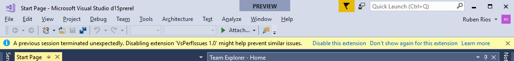
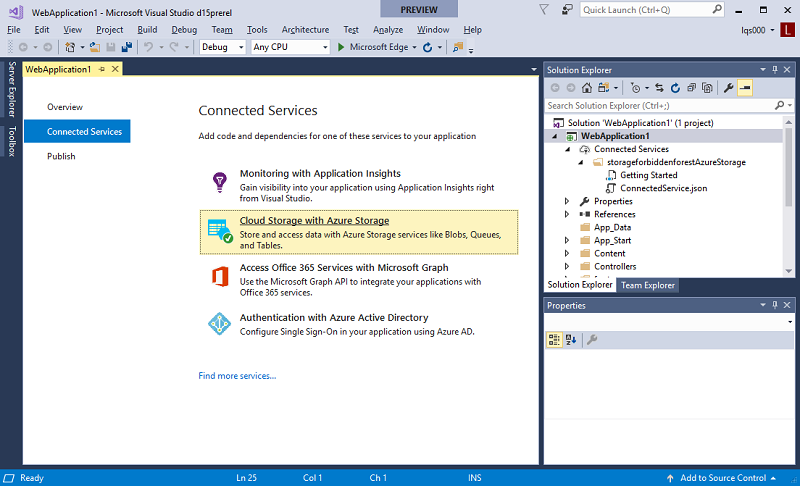
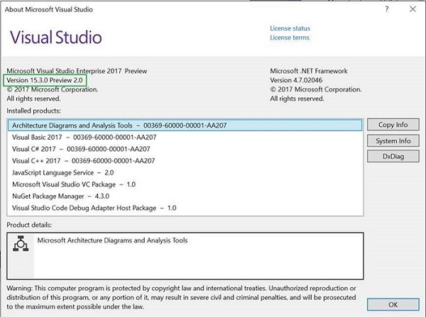
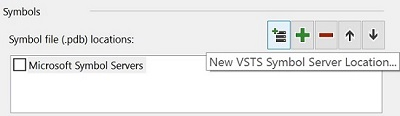
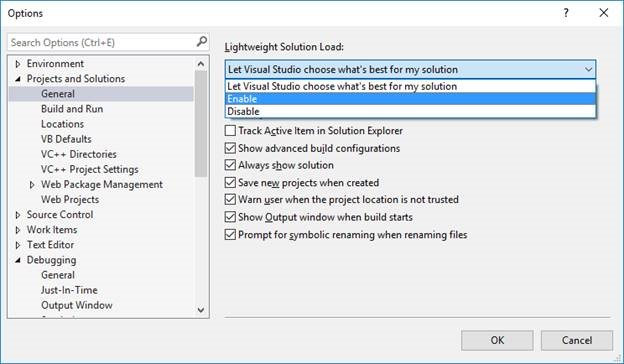

# Visual Studio 2017 version 15.3 - Preview Release Notes

In this article, you will find information regarding the current Preview release for Visual Studio 2017. Click the button to download.

<a href="https://www.visualstudio.com/vs/preview/"></a>

> [!NOTE]
> This release is not "go-live" and not intended for use on production computers or for creating production code.  

To learn more about Visual Studio 2017, see the [System Requirements](https://www.visualstudio.com/productinfo/vs2017-system-requirements-vs), [Platform Targeting and Compatibility](https://www.visualstudio.com/en-us/productinfo/vs2017-compatibility-vs), [Distributable Code](https://www.visualstudio.com/en-us/productinfo/2017-redistribution-vs), and [License Terms](https://www.visualstudio.com/license-terms/) pages.

### Feedback
We’d love to hear from you! You can report a problem via the [Report a Problem](https://docs.microsoft.com/en-us/visualstudio/ide/how-to-report-a-problem-with-visual-studio-2017) option in 
the upper right hand corner of either the installer or the Visual Studio IDE itself. You can track your feedback in the [Developer Community](https://developercommunity.visualstudio.com/index.html) portal. For suggestions,
let us know through [UserVoice](https://visualstudio.uservoice.com/forums/121579-visual-studio).

### Known Issues
Please refer to the [Known Issues](#knownissues) section.

****

##<a id="15.3.1"></a>Release Date: August 18, 2017 - Visual Studio 2017 version 15.3.1 Preview 1

###Issues Fixed in this Release
These are the customer-reported issues addressed in this version:
* [Update Git version to address security fix.](https://blogs.msdn.microsoft.com/devops/2017/08/15/git-vulnerability-with-submodules/)
* [Add Watch displays the wrong line of code.](https://developercommunity.visualstudio.com/content/problem/49728/add-watch-displaying-the-wrong-line-of-code.html)
* [F# Editor loses focus when typing `arrow`, `backspace`, or `newline` keys.](https://developercommunity.visualstudio.com/content/problem/92832/using-f-tools-enter-backspace-and-arrow-keys-will.html)
* [R Tools missing translations.](https://developercommunity.visualstudio.com/content/problem/95381/r-tools-has-english-strings-even-with-a-language-p.html)

****

##<a id="15.3.0"></a>Release Date: August 11, 2017 - Visual Studio 2017 version 15.3.0 Preview 7.1

###Issues Fixed in this Release
These are the customer-reported issues addressed in this version:
* [Unable to fix typing error after launching package manager from Quick Launch.](https://developercommunity.visualstudio.com/content/problem/87922/nuget-package-manager-console-doesnt-allow-backspa.html)
* [Visual Studio deletes all files in solution folder when a user hits `Cancel`in Windows Desktop Wizard window.](https://developercommunity.visualstudio.com/content/problem/79272/vs-20173-preview-deletes-all-files-in-the-solution.html)
* [When you create a new Cross-Platform application, click the Cross-Platform middle option appears garbled](https://developercommunity.visualstudio.com/content/problem/91012/在新建cross-platform应用程序时在点击cross-platform中间选项出现乱码.html)

****

##<a id="15.3.0"></a>Release Date: August 1, 2017 - Visual Studio 2017 version 15.3.0 Preview 7

###Issues Fixed in this Release
These are the customer-reported issues addressed in this version:
* [When you add a parameter to a JavaScript function call, Visual Studio crashes and you have to restart.](https://developercommunity.visualstudio.com/content/problem/81009/indexaspx-mvc-application-javascript-section-visua.html)
* [LUT doesn't start in `dotnet/symreaderportable` repo.](https://developercommunity.visualstudio.com/content/problem/82230/lut-doesnt-start-in-dotnetsymreader-portable-repo.html)
* [Live Unit Testing fails with Orchestrator error.](https://developercommunity.visualstudio.com/content/problem/62188/live-unit-testing-fails-with-orchestrator-error.html)

****

## <a id="15.3.0"></a>Release Date: July 26, 2017 - Visual Studio 2017 version 15.3.0 Preview 6

### Issues Fixed in this Release
These are the customer-reported issues addressed in this version:

&nbsp;&nbsp; [Attempted TextBuffer edit operation while another edit is in progress.](https://developercommunity.visualstudio.com/content/problem/8198/attempted-textbuffer-edit-operation-while-another.html)  

****

## <a id="15.3.0"></a>Release Date: July 24, 2017 - Visual Studio 2017 version 15.3.0 Preview 5

### Issues Fixed in this Release
These are the customer-reported issues addressed in this version:

&nbsp;&nbsp; [List of recent projects does not reflect reality.](https://developercommunity.visualstudio.com/content/problem/45470/list-of-recent-projects-does-not-reflect-reality.html)  
&nbsp;&nbsp; [Publish fails with 'All build submissions in a build must use project instances originating from the same project collection'.](https://developercommunity.visualstudio.com/content/problem/36498/publish-fails-with-all-build-submissions-in-a-buil.html)  
&nbsp;&nbsp; [Recent project refuses to be removed permanently from recent list on start page.](https://developercommunity.visualstudio.com/content/problem/43032/recent-project-refuses-to-be-removed-permanently-f.html)  

****

## <a id="15.3.0"></a>Release Date: July 12, 2017 - Visual Studio 2017 version 15.3.0 Preview 4

### Summary of Updates

* [Visual Studio IDE Improvements.](#IDEimprovements15P4)
* [C++ Language Services.](#C++LanguageServices15P4)
* [C# 7.1 Language Support.](#cs71)

### Top Issues Fixed in this Release
The Developer Community spoke and we listened. This list provides the issues that received your highest votes and were fixed in this release.

&nbsp;&nbsp; [Solution build time is dramatically slower when enabling lightweight solution load.](https://developercommunity.visualstudio.com/content/problem/2548/solution-build-time-is-6x-time-slower-when-enablin.html)  
&nbsp;&nbsp; [Build failure error: 'path' cannot be an empty string ("") or start with the null character.](https://developercommunity.visualstudio.com/content/problem/19115/build-failure-error-path-cannot-be-an-empty-string.html)  
&nbsp;&nbsp; [Track active item in Solution Explorer no longer works.](https://developercommunity.visualstudio.com/content/problem/30109/track-active-item-in-solution-explorer-no-longer-w.html)  
&nbsp;&nbsp; [ADODB 2.7 reference accepted in VS2015, rejected in VS2017.](https://developercommunity.visualstudio.com/content/problem/32525/adodb-27-reference-accepted-in-vs2015-rejected-in.html)  
&nbsp;&nbsp; [Tracking active item is working inconsistently.](https://developercommunity.visualstudio.com/content/problem/6422/tracking-active-item-is-working-inconsistently.html)  

****

## What's New in this Release

### <a id="IDEimprovements15P4"> </a> Visual Studio IDE Improvements
  * We added the Keyboard Accessibility menu command under the "Help" menu. This provides you with a shortcut to online documention about Accessibility Tips and Tricks.
  * The `vswhere.exe` executable file no longer shows preview instances by default. To search preview or other prerelease instances, you must pass `-prerelease` on the command line. 
  * The diagnostic system will now inform you via InfoBar about extensions that might have been involved in an unexpected termination of Visual Studio. The InfoBar provides information about the termination and will ask if you would like to disable the suspected extension.

  
### <a id="C++LanguageServices15P4"> </a> C++ Language Services
  * Several project and code wizards have been rewritten in the signature dialog style.
  * Add Class now launches the Add Class wizard directly. All of the other items that were previously here are now available under "Add > New Item".
  * Win32 projects are now under the Windows Desktop category in the New Project dialog.
  * The Windows Console and Desktop Application templates now create the projects without displaying a wizard. There's a new Windows Desktop Wizard now under the same category that displays the same options as before.
  * Improved debugging support in "Open Folder" for executables built with GCC based compilers such as MinGW and Cygwin.
  * Added support to define global and configuration specific environment variables in "CppProperties.json" and "CMakeSettings.json". These environment variables can be consumed by debug configurations defined in "launch.vs.json" and tasks in "tasks.vs.json".
  * Improved support for CMake's Ninja generator, including the ability to easily target 64-bit platforms.

### <a id="cs71"></a> C# 7.1 Language Support
  * Adds the ability to use C# 7.1 language features.
  * C# 7.1 adds support for [async Main methods](https://github.com/dotnet/csharplang/blob/master/proposals/async-main.md), [pattern-matching with generics](https://github.com/dotnet/csharplang/blob/master/proposals/generics-pattern-match.md), [“default” literals](https://github.com/dotnet/csharplang/blob/master/proposals/target-typed-default.md), and [inferred tuple names](https://github.com/dotnet/csharplang/blob/master/proposals/csharp-7.1/infer-tuple-names.md).
  * When you use C# 7.1 features in your project, lightbulb will offer to upgrade your project’s language version, either to “C# 7.1” or “latest”.
  * See the [C# language feature status page](https://github.com/dotnet/roslyn/blob/master/docs/Language Feature Status.md) for complete details.


****

## <a id="15.3.0"></a>Release Date: June 26, 2017 - Visual Studio 2017 version 15.3.0 Preview 3

### Summary of Updates

* [.NET Core and ASP.NET Core improvements.](#dotnetcoreimprovements15P3)
* [NuGet improvements.](#NuGetimprovements15P3)
* [Visual Studio IDE improvements.](#IDEimprovements15P3)

### Top Issues Fixed in this Release
The Developer Community spoke and we listened. This list provides the issues that received your highest votes and were fixed in this release.

&nbsp;&nbsp; [Setup operation failed.](https://developercommunity.visualstudio.com/content/problem/25757/setup-operation-failed-13.html)  
&nbsp;&nbsp; [VS2017 Version 15.2 upgrade loses Windows layout settings and extensions.](https://developercommunity.visualstudio.com/content/problem/54822/vs2017-version-152-upgrade-loses-settings.html)  
&nbsp;&nbsp; [Install hangs on "Applying Microsoft.VisualStudio.Graphics.EnableTools".](https://developercommunity.visualstudio.com/content/problem/55148/install-hung-on-applying-microsoftvisualstudiograp.html)  
&nbsp;&nbsp; [VS Setup Bootstrapper keeps running after setup.](https://developercommunity.visualstudio.com/content/problem/15535/vs-setup-bootstrapper-keeps-running-after-setup.html)  
&nbsp;&nbsp; [VS Installer Bootstrapper eats 100% of one CPU core.](https://developercommunity.visualstudio.com/content/problem/42932/vs-installer-bootstrapper-hogging-one-cpu-core.html)  

****

## What's New in this Release

### <a id="dotnetcoreimprovements15P3"> </a> .NET Core and ASP.NET Core improvements
  * .NET Framework and .NET Standard/Core interop: Users can now more seamlessly install or refer to .NET Core/.NET Standard libraries from  .NET Framework projects and vice versa. No need to manually add interop NuGet packages – system does this for you automatically.
  * Build: Incremental builds for .NET Core is now turned ON by default. 
  * Live Unit Testing: Live Unit Testing now works for .NET Core projects that target multiple Target Frameworks.
  * ASP.NET Core : In addition to IIS Express, we now also support F5 with IIS for ASP.NET Core projects.
  * Support for .NET Core 2.0 and ASP.NET Core 2.0: This preview release of Visual Studio, continues to support creating and running .NET Core 2.0 apps if the 2.0 SDK is installed separately. Latest public preview of .NET Core 2.0 SDK is available for you to [download.](https://www.microsoft.com/net/core/preview) 
    * If you would like to experiment with .NET Core Preview daily builds, you can install the latest daily build of the [.NET Core SDK](https://github.com/dotnet/cli/tree/release/2.0.0-preview2#build-status). Choose the appropriate package from the Installers and Binaries table. These daily builds will work with this preview release of Visual Studio.
  * See [.NET Core 2.0 blog](https://go.microsoft.com/fwlink/?linkid=848627) for more details.

### <a id="NuGetimprovements15P3"> </a> NuGet improvements
  * NuGet now displays improved warnings and errors when installing packages or adding project-to-project references that are not compatible.
  * NuGet now allows you to suppress specific or all warnings or elevate them to errors via Build properties.
 
### <a id="IDEimprovements15P3"> </a> Visual Studio IDE improvements
  * Visual Studio Installer now supports high-DPI scaling at levels less than 150%.
  * In open folder scenarios, you can select your desired debugger via dedicated UI.
  * We’ve stopped sharing certain settings, like tool window layout, between different side by side installations of Visual Studio 2017 by changing location of *“CurrentSettings.vssettings”* file in *“%userprofile%\Documents\Visual Studio 2017\Settings”* to an installation specific folder that looks like *“%localappdata%\Microsoft\VisualStudio\15.0_xxxxxxxx\Settings”*. 

    **NOTE:** The new installation specific settings location is used only in case of a fresh installation. Doing an upgrade of an existing Visual Studio 2017 installation to this update will result in using the existing shared location. If you currently have side by side installations of Visual Studio 2017 and decide to upgrade and wish to make Visual Studio use the new installation specific settings file location, see following steps:
      1. After the upgrade use the Import\Export settings wizard to export all your existing settings to some location outside of *“%localappdata%\Microsoft\VisualStudio\15.0_xxxxxxxx”* folder.
      2. Open the developer command prompt of the upgraded Visual Studio installation and run `devenv resetuserdata` from it.
      3. Launch Visual Studio and import the saved settings from the exported settings file.

  #### Lightweight Solution Load
  * Added file search results for Solution Explorer search for deferred projects, instead of just for loaded projects. 
    * There are some limits to this:
      * Search does not extend to within the file and does not include progressive results, i.e. classes, methods, etc.
      * Files belonging to a project are shown as a flat list. When files belong to a folder, the relative path is shown instead of just the file name.
      * There are no context menus for the file items in the search view.
    * When you load a project, all existing searches will be refreshed to add progression results.
  * GoTo All and GoTo Files now show content from external items in the workspace.
  * We fixed Batch build in projects using LSL.

  #### Setup
  * CLI is able to handle `--verify`, `--fix` and `--clean`.
    * `--verify` verifies layout and informs you of missing and invalid payloads.
    * `--fix` will verify the layout and re-download the packages that are either missing or invalid.
    * `--clean` will delete obsolete packages and allows you to trim layout to a specific version range.

****

## <a id="15.3.0"></a>Release Date: June 20, 2017 - Visual Studio 2017 version 15.3.0 Preview 2.1

### Top Issues Fixed in this Release
* [New Project menu fails with error "Value cannot be null. Parameter name: eventide".](https://developercommunity.visualstudio.com/content/problem/67355/new-project-menu-fails-with-error-value-cannot-be.html)
* [Visual Studio 2017 keeps crashing after 15.2 update.](https://developercommunity.visualstudio.com/content/problem/63443/visual-studio-2017-keeps-crashing-after-152-update.html)

****

## <a id="15.3.0"></a>Release Date: June 8, 2017 - Visual Studio 2017 version 15.3.0 Preview 2

### Summary of Updates
* [Added the .NET Framework 4.7 runtime and now offered to all supported platforms.](#dotnet47)
* [Visual Studio IDE improvements.](#IDEimprovements)
* [Debugging and diagnostics.](#Debugging)

### Top Issues Fixed in this Release
The Developer Community spoke and we listened. This list provides the issues that received your highest votes and were fixed in this release.

&nbsp;&nbsp; [Updating with the Visual Studio Installer results in an endless update loop.](https://developercommunity.visualstudio.com/content/problem/30271/please-update-visual-studio-installer-endless-loop.html)  
&nbsp;&nbsp; [Visual Studio 2017 fails to start with an "Unknown Error".](https://developercommunity.visualstudio.com/content/problem/31263/vs2017-fails-to-start-with-unknown-error.html)  
&nbsp;&nbsp; [Access denied and unknown/other errors occur while running on Windows 7 under multiple user contexts.](https://developercommunity.visualstudio.com/content/problem/31188/access-denied-error-1.html)  
&nbsp;&nbsp; [TFS goes offline constantly.](https://developercommunity.visualstudio.com/content/problem/24498/tfs-go-offline-consistently.html)  
&nbsp;&nbsp; [TypeScript background compilation causes performance slowdown.](https://developercommunity.visualstudio.com/content/problem/10762/typescript-background-compilation-too-often-causes.html)  
&nbsp;&nbsp; [Team explorer does not recognize previously cloned repository as being part of a VSTS project.](https://developercommunity.visualstudio.com/content/problem/26914/team-explorer-does-not-recognize-previously-cloned.html)  
&nbsp;&nbsp; [Web publish preview is unable to upload only a subset of files.](https://developercommunity.visualstudio.com/content/problem/20787/web-publish-preview-is-unable-to-upload-only-a-sub.html)  
&nbsp;&nbsp; [SSDT cannot be installed.](https://developercommunity.visualstudio.com/content/problem/17173/ssdt-cannot-be-installed.html)  
&nbsp;&nbsp; [Visual Studio 2017 crashes during Attach to Process.](https://developercommunity.visualstudio.com/content/problem/26463/visual-studio-2017-crashes-during-attach-to-proces.html)  

****

## What's New in this Release

### <a id="dotnet47"> </a> .NET Framework 4.7
Visual Studio 2017 15.3 Preview 2 now offers the .NET Framework 4.7 development tools to all supported platforms with the 4.7 runtime included. The .NET Framework 4.7 offers several new features and improvements as well as numerous reliability, stability, security, and performance fixes. You can view more details about .NET 4.7 here: 

* [.NET Framework 4.7 RTM Blog.](http://go.microsoft.com/fwlink/?LinkId=845636)  
* [What's New in the .NET Framework.](http://go.microsoft.com/fwlink/?LinkId=845635)   
* [.NET Framework 4.7 Release Change Notes.](http://go.microsoft.com/fwlink/?LinkId=845633)  
* [Known issues in the .NET Framework 4.7.](http://go.microsoft.com/fwlink/?LinkId=825308)
* [Application Compatibility in the .NET Framework 4.7.](http://go.microsoft.com/fwlink/?LinkId=825324)  
* [The .NET Framework API diff.](http://go.microsoft.com/fwlink/?LinkId=825323) 

### <a id="IDEimprovements"> </a> Visual Studio IDE improvements

#### Sign-In/Connected Services
  * We've added support conditional access and authorization failure.
    * Users can now sign into Visual Studio even if they have Multifactor authentication turned on only for some resources used in the Visual studio sign in flow.
  * Connected Services tab shows which services have already been configured.
    * You can now see visual indicator for configured connected service in Connected Service tab *(Figure 1)*.
  * Added UI support for adding of ADFS azure stacks along with government clouds. 
  

<center>*(Figure 1) Connected Services with Service Configured*</center> 

  * Resolved a bug where old accounts would show up in the Account Picker.

#### Visual Studio IDE
  * Visual Studio 2017 entry in Control Panel -> Uninstall/Change Programs now supports Modify. 
    * In previous versions, you could only uninstall from Control Panel.
  * We've added a "Get Tools and Features..." item to the top of your Tool menu to make it easier to add more components *(Figure 2)*.
    * This will launch the installer on the Modify screen to help you quickly add the tools and features you need.


<center>*(Figure 2) Menu item to add more tools and features*</center> 
  * Solved a hang that was occurring when switching between file tabs.
  * We've added a new Splash Screen *(Figure 3)*. 
    * As well, this screen will display if the version is a Preview version.


<center>*(Figure 3) Splash Screen with Preview Badge*</center> 

* Fixed a shortcut issue causing monitors to disconnect on Intel laptops.
    * In previous versions, the default shortcut to push unpublished commits (Ctrl + Alt +F8) was the same as the shortcut to disconnect monitors on Intel laptops. We've changed the shortcut to Ctrl + E, Ctrl + C to fix this. 

#### Solution Explorer
  * Enabled camelCase matching for files.
  * Open folder now supports MinGW and Cygwin debuggers.
  * As a deterrent to unwanted file moves inside the Solution Explorer, a prompt now asks for confirmation whenever files are moved. Users can disable the prompt and re-enable by going to Tools / Options… / Projects and Solutions *(Figure 4)*. 


<center>*(Figure 4) Warning when moving files in Solution Explorer*</center> 

#### Editor
  * Different icons for quick fixes and refactorings in Lightbulb.

#### Setup
  * Visual Studio’s Installer program has improved our install size estimation to be more accurate based on what you have currently selected and previously installed.
  * Visual Studio updates will now display a new version format to make it easier to understand what updates you are getting. 
    * This version will show in the installer application *(Figure 5)*, Help > About dialog and updates notifications, for example: 
    

<center>*(Figure 5) About Dialog with Version*</center>  

  * The `--layout` feature now includes the ability to modify or upgrade existing layouts, verify and fix corrupted layouts, and clean layouts of older builds no longer needed. Additionally, when creating partial layouts a response.json is created with defaults to install the workloads and components that were included in the partial layout.
  
### <a id="Debugging"> </a> Debugging and Diagnostics
#### Debugger Support for Visual Studio Team Services Symbol Servers
You can now query and download symbols *(Figure 6)* from Visual Studio Team Services Symbol Servers (currently in private preview). You can select and add Visual Studio Team Services symbol paths to your Visual Studio environment using the Tools->Options->Debugger->Symbols page. To set up a Visual Studio Team Services Symbol Server [follow these instructions](https://go.microsoft.com/fwlink/?linkid=846265) to sign up for the private preview.  


<center>*(Figure 6) Add VSTS Symbol Server*</center> 

####Point and Click to Set Next Statement
You can now hold down the Ctrl key while stopped at a breakpoint when debugging. The Run to Click (Run execution to here) icon next to your line of code changes to “Set Next Statement” functionality *(Figure 7)*. Click on it to move the yellow instruction pointer to that line and set the next statement for the debugger to execute.


<center>*(Figure 7) Click to Set Next Statement*</center> 

####Source Link Support for Windows PDBs
Source Link is now supported for Windows PDBs (in addition to Portable PDBs). Compilers that support it can put the necessary information in the Windows PDB and debugger can retrieve source files based on that information.

####Open Folder Debugging Improvements
You can now more easily choose your debugging experience when using Open Folder. With the new templates for the Open Folder experience, if you have the core debugger experience installed you can now choose the type of debugger you want to use (Managed, Native, or Mixed) from the "Select a Debugger" dialog accessed through the "Debug and Launch Settings" menu option in Solution Explorer. If you have a C++ MDD experience installed (Android C++, Linux Debugging, etc.), you will now see options for MinGW and Cygwin support using GDB for attach and launch within the same menu option.

####Refresh All Nested Values in Variable Windows
Now when you click the refresh button for the parent node of a variable or expression in the Watch, Autos, and Locals windows, all visible variables and expressions that are children of that node will also be refreshed and re-evaluated. You no longer have to click on the refresh button for each of the children.

****

## <a id="15.3.26510.00"></a>Release Date: May 11, 2017 - Visual Studio 2017 Preview version 15.3 (26510.00 - Preview)
### Top Issues Fixed in this Release
 * Fixed issue where the use of RS3 UWP projects produced squiggles in the markups due to missing resources.
 * Fixed installer UI reliability issue produced when a user clicks on the launch button after clicking on cancel.

****

## <a id="15.3.26507.00"></a>Release Date: May 10, 2017 - Visual Studio 2017 Preview version 15.3 (26507.0 - Preview)

### Summary of Updates in this Release
* [You can get real time feedback with live unit testing support for your .NET Core projects.](#dotnetcore)
* [Visual Studio IDE Improvements.](#vside)
* [We’ve added related event clusters to the search queries to help you discover patterns in your application's behavior.](#appInsights)
* [The SetThreadDescription API is now supported while debugging and the thread names you set will show up in the Threads window and dropdown in the Debug Location toolbar.](#Debugging)
* [We’ve made usability and icon improvements for high-DPI support and better toolbar responsiveness.](#redgate)
* [We enhanced the CMake tools to support the Ninja generator and CTest integration.](#cmake)


### Top Issues Fixed in this Release
The Developer Community spoke and we listened. This list provides the issues that received your highest votes and were fixed in this release.

&nbsp;&nbsp; [Endless loop when updating the Visual Studio Installer.](https://developercommunity.visualstudio.com/content/problem/30271/please-update-visual-studio-installer-endless-loop.html)  
&nbsp;&nbsp; ["Scanning new and updated MEF components" runs every time Visual Studio 2017 launches.](https://developercommunity.visualstudio.com/content/problem/31028/scanning-new-and-updated-mef-components-every-time.html)  
&nbsp;&nbsp; [TFS unexpectedly goes offline when opening a solution.](https://developercommunity.visualstudio.com/content/problem/24498/tfs-go-offline-consistently.html)  
&nbsp;&nbsp; [Build fails to start with solutions built with previous Visual Studio versions.](https://developercommunity.visualstudio.com/content/problem/5532/build-failes-to-start.html)  
&nbsp;&nbsp; [Several errors are generated during the Attach to Process.](https://developercommunity.visualstudio.com/content/problem/26463/visual-studio-2017-crashes-during-attach-to-proces.html)  
&nbsp;&nbsp; [Solution build time is much slower when enabling Lightweight Solution Load.](https://developercommunity.visualstudio.com/content/problem/2548/solution-build-time-is-6x-time-slower-when-enablin.html)  
&nbsp;&nbsp; [Pressing the 'Enter' key inserts new line instead of the expected C++ autocomplete.](https://developercommunity.visualstudio.com/content/problem/41831/c-autocomplete-enter-inserts-new-line-instead.html)  
&nbsp;&nbsp; [Git processes are unable to start.](https://developercommunity.visualstudio.com/content/problem/27564/git-unable-to-start-process.html)  
&nbsp;&nbsp; [Team Explorer does not recognize previously cloned repository as being part of a VSO project.](https://developercommunity.visualstudio.com/content/problem/26914/team-explorer-does-not-recognize-previously-cloned.html)  
&nbsp;&nbsp; [Unable to clone Git repository in Team Services.](https://developercommunity.visualstudio.com/content/problem/19752/git-cant-clone-remote-repository.html)  

****

## What's New in this Release

### <a id="dotnetcore"> </a> .NET Core

* We added live Unit Testing support for .NET Core projects.
* You can now create .NET Core console applications, and .NET Core and .NET Standard class libraries using Visual Basic.
* Visual Studio now supports creating and running .NET Core 2.0 apps if the SDK is installed separately. [Install the latest builds of the .NET Core 2.0 SDK](https://go.microsoft.com/fwlink/?linkid=848586).

See [.NET Core 2.0 blog](https://go.microsoft.com/fwlink/?linkid=848627) for more details.

#### <a id="aspnetcore"> </a> ASP.NET Core tooling
We added support for containerizing ASP.NET Core apps as Windows Nano images.
You can now select Nano as the container platform. You can do this under File->New Project for ASP.NET Core projects.
For your existing projects, it can be added using the Project Context Menu.

****

### <a id="appInsights"> </a> Related Event Clustering in Application Insights Search

We added clusters of related events to the search query results in the Application Insights Search tool. These clusters can help you discover surprising patterns in your application's behavior, like a large volume of exceptions coming from a single country, version, or user.

****

### <a id="Debugging"> </a> Debugging and Diagnostics

* The [SetThreadDescription API](https://msdn.microsoft.com/en-us/library/windows/desktop/mt774976.aspx) is now supported while debugging using Start Debugging (F5) or Attach to Process (Ctrl+Alt+P). The thread names that are set via this API will now show up in the Threads window and in the Thread dropdown in the Debug Location toolbar. This is not currently supported while [dump debugging.](https://msdn.microsoft.com/en-us/library/d5zhxt22.aspx)
* The Output Window now shows you the console output of an application running inside a Windows Container while debugging. 
* We added new support for debugging .NET Core apps you run inside Windows Containers based on Nano Server.

****

### <a id="vside"> </a> Visual Studio IDE Improvements

#### IDE improvements

* We fixed the "hidden window" bug that made Visual Studio appear to hang before its main window appeared.
* We increased the clickable target area to make it easier to dismiss notification tips.
* We added support for file globbing outside of your project folder.

#### .NET IDE Improvements

* We added several new refactorings and quick fixes, like "Resolve merge conflicts", "Add null checks", "Add parameter", and many more. [Visit our documentation](https://docs.microsoft.com/en-us/visualstudio/ide/refactoring-code-generation-quick-actions) to see the full list.
* We suggest variable names in IntelliSense to help you name your variables quickly, e.g., ```Person person```. 
* Edit and Continue now supports C# 7.0 features (except local functions).

#### Sign in and identity improvements

* We fixed the account picker control so "Re-enter credentials" works more reliably.
* In some cases, the account picker would clear accounts upon re-entering credentials. This fix should resolve that issue.

#### Start page 

We increased the clickable target area on Start Page MRU “pins” to make it easier to pin items you care about to the top of the MRU. 

#### Lightweight solution load 

* We increased build speed and stability.
* We reduced the number of loaded projects.
* We provided a new option *(Figure 8)* to let Visual Studio decide what’s best for this solution.


<center>*(Figure 8) Lightweight Solution Load Options*</center> 

#### Open folder 

* We improved stability for toggling between folder and solution.
*	Open folder extenders can add source control icon to your folders. This allows you to quickly see source control state of your files in Solution Explorer. Currently implemented by SVN.

#### Continuous delivery tools
We moved these features from the CD4VS extension into Visual Studio:
* Configure continuous delivery for solutions containing ASP.NET projects targeting an Azure App Service.
* Configure continuous delivery for solutions containing ASP.NET Core projects targeting an Azure App Service.

#### Container development tools

Visual Studio 2017 15.3 preview now supports the breadth of container development across existing .NET Framework apps with Windows Containers, to .NET Core with Windows, and Linux Support.   Recent additions include support for your .NET Core applications in containers running Nano server, as well as debugging improvements for .NET Framework applications in containers.

#### Service fabric tools

This release provides a new stateful ASP.NET Core project template, support for both 2.5 and 2.6 SDK's (and corresponding runtimes) of Service Fabric, as well as several bug fixes.

****

### <a id="redgate"> </a> Redgate Data Tools

#### Redgate ReadyRoll Core:

We updated to version 1.13.23.3402 to add:
* Icon improvements with high-DPI support and better responsiveness in the toolbar.
* Usability Improvements to Project Settings Tab.
* Usability Improvements to Getting Started view, Deployment Summary, and Login Window.
* Added a view for when the target database doesn’t exist.
* Added a ReadyRoll entry under the Tools menu.
* Added support for SQL Authentication when opening SSMS.

Redgate SQL Prompt Core:
We updated to version 7.5.1.1087 to improve syntax support for SQL Server 2016, as well as fixed issues around name qualification, and with Azure connectivity. 

Redgate SQL Search:
We updated to version 2.4.2.1321 to add an icon for high-DPI support.

****

### <a id="cmake"> </a> CMake Tools
We enhanced CMake tools for Visual Studio to provide you with support for CTest integration and the Ninja generator, including full support to build, debug, and edit with IntelliSense.

****

## <a id="knownissues"> </a>Known Issues

Here are the known issues and available workarounds specific to this Preview release. For known issues in Visual Studio 2017, which will also affect this release, 
see [Visual Studio 2017 Known Issues](vs2017-knownissues.md).

  * [.NET Core](#KIdotnetcore)
  * [Testing Tools](#KITestingTools)
  * [Debugging and Diagnostics](#KIDebugger)
  * [F# Tools](#KIFSharp)
  * [Other](#KIOther)

****

### <a id="KIdotnetcore"> </a>.NET Core Issues

For a current list of issues and workarounds with .NET Core and ASP.NET Core 2.0 see our [GitHub page](https://go.microsoft.com/fwlink/?linkid=848628).

### <a id="KITestingTools"> </a>Testing Tools Issues

#### Native C++ unit testing code coverage
* #### Issue:
Native C++ unit testing code coverage fails with an error stating that no modules were loaded.
 
* #### Workaround:
Rebuild your code with debugging information generated with the /DEBUG:FULL option. The setting can be found under "project properties | Configuration Properties | Linker | Debugging".

#### .NET Core unit testing code coverage
* #### Issue:
Launching Code Coverage analysis from the Test Explorer does not work in the case of .NET Core unit test projects.
 
* #### Workaround:
Please see under "Working with Code Coverage" here  https://github.com/Microsoft/vstest-docs/blob/master/docs/analyze.md#coverage

#### Create IntelliTest project options
* #### Issue:
When Lightweight Solution Load is in effect, the 'Test Project' dropdown in the Create IntelliTest dialog may not list all available test projects.
 
* #### Workaround:
Projects that are not already loaded will not be shown. Load the relevant projects from the Solution Explorer to ensure that are shown here.

### <a id="KIDebugger"> </a>Debugging and Diagnostics Issues

#### Remote Tools for Visual Studio 2017 Preview are not available
* #### Issue:
We have not made an update for the Remote Tools for Visual Studio 2017 Preview available.

* #### Workaround:
The [Remote Tools for Visual Studio 2017](https://www.visualstudio.com/downloads#remote-tools-for-visual-studio-2017) is compatible with Visual Studio 2017 Preview. 
However, if you are interested in using the latest preview version of the remote debugger, see [Run the remote debugger from a file share](https://docs.microsoft.com/visualstudio/debugger/remote-debugging#optional-to-run-the-remote-debugger-from-a-file-share).

### <a id="KIFSharp"> </a> F\# Tools

There are multiple issues the F# tools and .NET Core projects.  These issues have mostly been addressed, but due to the fact that .NET Core and Visual Studio do not align in their releases, these fixes cannot be used unless you install the correct version of the .NET Core SDK on your machine.

In short, download and install [this release of the .NET Core CLI](https://github.com/dotnet/cli/tree/release/2.0.0).  You must install this, otherwise you will come across multiple issues which have already been addressed.

The following issues are currently being worked on:

* #### Issue:
Cannot create a project through Visual Studio's menu system.

* #### Workaround:
Create projects with the .NET CLI.  These can be opened in Visual Studio 2017.

* #### Issue:
Visual Studio does not recognize new files in their defined ordering, references from other projects, or references from NuGet or Paket.  However, building and running the project works.

* #### Workaround:
There is no workaround at this time.  As mentioned, these projects should still build and run.


### <a id="KIOther"> </a> Other Issues

#### NavigateTo search in folder mode does not return external items for Visual C++ projects.

* #### Issue:
When you open a folder with a VC project, NavigateTo search does not return external files.

* #### Workaround:
Open the folder with Lightweight Solution Load on, close the solution, and reopen the folder. 

#### Globs with forward slashes (ie: "**/*.cs") are not supported in CPS based projects (.NET Core and Cordova).

* #### Issue:
Globs with forward slashes are not supported in CPS projects and will cause a non-fatal error. 

* #### Workaround:
 No workaround at this time. 

#### Cannot create team projects or update process templates

* #### Issue:
Customers cannot create new team projects or upload or edit process templates from Visual Studio 2017, version 15.3 Preview 1. Project creation from web access continues to work.

* #### Workaround:
This will be fixed in the next preview.  At this time, please use the released Visual Studio 2017, version 15.2 or earlier, if you need to create team projects or upload process templates from Visual Studio.

#### Error when opening folder if C\# and Visual Basic Component is not installed

* #### Issue:
Error message "Exception thrown by the target of an invocation” when opening folder if C# and Visual Basic Component is not installed.

* #### Workaround:
Install the C# and Visual Basic Component.

#### Microsoft Test Manager (MTM) client cannot connect to Team Foundation Server or Visual Studio Team Services

* #### Issue:
MTM client cannot connect to Team Foundation Server or Visual Studio Team Services, blocking users from creating and running tests cases. 

* #### Workaround
This will be fixed in the next preview. At this time, please use the following workaround:

Find the folder in which mtm.exe is installed by searching for mtm.exe in the start menu and choosing 'Open file location' in the right click menu. Edit the 'mtm.exe.config' file present in the same folder to add the following section in configuration -> runtime section:

      <dependentAssembly>
        <assemblyIdentity name="Microsoft.VisualStudio.Threading" publicKeyToken="b03f5f7f11d50a3a" culture="neutral"/>
        <bindingRedirect oldVersion="10.0.0.0-15.0.0.0" newVersion="15.3.0.0"/>
      </dependentAssembly>

#### Building a DSL project fails with FileNotFoundException

* #### Issue:
Building a newly created DSL project fails with FileNotFoundException.

* #### Workaround:
Add the following snippet to assemblyBinding element in MSBuild.exe.config (in <VSInstallPath>\MSBuild\15.0\Bin):

```xml
    <dependentAssembly>
      <assemblyIdentity name="Microsoft.VisualStudio.Zip.9.0" culture="neutral" publicKeyToken="b03f5f7f11d50a3a" />
      <codeBase version="9.0.0.0" href="..\..\..\Common7\IDE\PrivateAssemblies\Microsoft.VisualStudio.Zip.9.0.dll" />
    </dependentAssembly>
```
****
### [Visual Studio 2017 (version 15.2 - Preview) Release Notes](vs2017-Preview-relnotes-v15.2.md)
<a href="https://developercommunity.visualstudio.com/topics/Fixed-in%3A%20Visual%20Studio%202017%20version%2015.2%20preview.html"></a> See customer-reported issues fixed in Visual Studio 2017 (version 15.2).
### [Visual Studio 2017 (version 15.1 - Preview) Release Notes](vs2017-Preview-relnotes-v15.1.md)
<a href="https://developercommunity.visualstudio.com/search.html?f=&type=question+OR+problem&type=question+OR+problem&c=&redirect=search%2Fsearcvs2017-Preview-relnotes-v15.2h&sort=relevance&q=fixed+in+visual+studio+2017+15.1+preview"></a> See customer-reported issues fixed in Visual Studio 2017 (version 15.1).
### [Visit the Visual Studio 2017 (version 15.0) Release Notes](vs2017-relnotes-v15.0.md)
<a href="https://developercommunity.visualstudio.com/topics/Fixed-in%3A+Visual+Studio+2017+version+15.0.html"></a> See customer-reported issues fixed in Visual Studio 2017 (version 15.0).

****