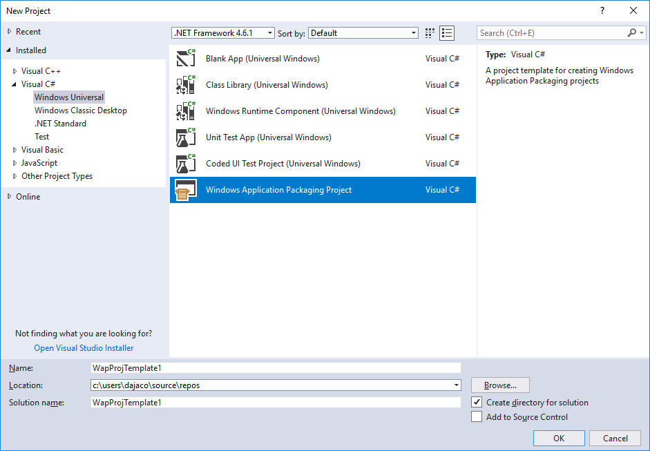
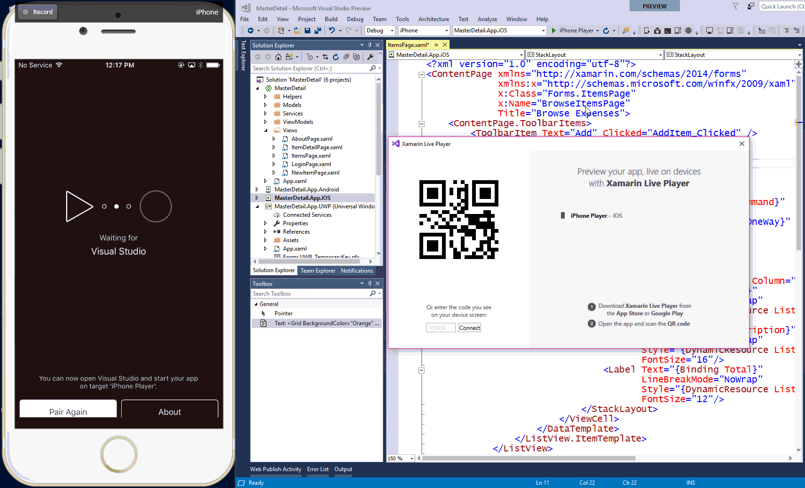
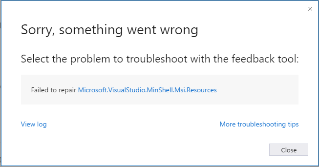

# Visual Studio 2017 version 15.4 - Preview Release Notes

****
<a href="https://developercommunity.visualstudio.com/topics/visual+studio+2017.html?sort=newest&topics=visual studio 2017" target="blank">Developer Community</a> |
<a href="https://www.visualstudio.com/productinfo/vs2017-system-requirements-vs" target="blank">System Requirements</a> |
<a href="https://www.visualstudio.com/productinfo/vs2017-compatibility-vs" target="blank">Compatibility</a> |
<a href="https://www.visualstudio.com/productinfo/2017-redistribution-vs" target="blank">Distributable Code</a> |
<a href="https://www.visualstudio.com/license-terms" target="blank">License Terms</a> |
<a href="https://blogs.msdn.microsoft.com/developer-tools" target="blank">Blogs</a> |
<a href="https://developercommunity.visualstudio.com/topics/Known+issue-in%3A+Visual+Studio+2017+version+15.3.html" target="blank">Known Issues</a>
****

In this article, you will find information regarding the current Preview release for Visual Studio 2017. Click the button to download the latest version.

> [!NOTE]
> This release is not "go-live" and not intended for use on production computers or for creating production code.

### Feedback
We’d love to hear from you! You can report a problem via the [Report a Problem](https://docs.microsoft.com/en-us/visualstudio/ide/how-to-report-a-problem-with-visual-studio-2017) option in
the upper right hand corner of either the installer or the Visual Studio IDE itself. The  icon is located in the upper right hand corner. You can track your feedback in the [Developer Community](https://developercommunity.visualstudio.com/index.html) portal. For suggestions,
let us know through [UserVoice](https://visualstudio.uservoice.com/forums/121579-visual-studio).

### Release History
* September 11, 2017 Visual Studio 2017 version 15.4 Preview 2 
* [August 24, 2017](#15.4.0 Preview 1) Visual Studio 2017 version 15.4.0 Preview 1

You can learn more about how we ship our releases in the [Visual Studio 2017 Release Rhythm] (https://www.visualstudio.com/productinfo/vs2017-release-rhythm) document.

### Known Issues
Please refer to the [Known Issues](#knownissues) section.

##Release Date: September 11, 2017 - Visual Studio 2017 version 15.4.0 Preview 2

### Summary of Updates in this Release
 * [Visual Studio Improvements](#VSIDEP2)

### Top Issues Fixed in this Release
The Developer Community spoke and we listened. This list provides the issues that received your highest votes and were fixed in this release.
 * [Solution build time is dramatically slower when enabling lightweight solution load.](https://developercommunity.visualstudio.com/content/problem/2548/solution-build-time-is-6x-time-slower-when-enablin.html)
 * [Build failure error: 'path' cannot be an empty string ("") or start with the null character.](https://developercommunity.visualstudio.com/content/problem/19115/build-failure-error-path-cannot-be-an-empty-string.html)
 * [Track active item in Solution Explorer no longer works.](https://developercommunity.visualstudio.com/content/problem/30109/track-active-item-in-solution-explorer-no-longer-w.html)
 * [ADODB 2.7 reference accepted in VS2015, rejected in VS2017.](https://developercommunity.visualstudio.com/content/problem/32525/adodb-27-reference-accepted-in-vs2015-rejected-in.html)
 * [Tracking active item is working inconsistently.](https://developercommunity.visualstudio.com/content/problem/6422/tracking-active-item-is-working-inconsistently.html)
 * [The debugger is not properly installed. Run setup or repair the debugger](https://developercommunity.visualstudio.com/content/problem/36755/the-debugger-is-not-properly-installed.html)
 * [Microsoft.VisualStudio.Debugger.JustInTime failed to install.](https://developercommunity.visualstudio.com/content/problem/55113/microsoftvisualstudiodebuggerjustintimeversion1502.html)

### What's New in this Release

#### Visual Studio Improvements

##### *Setup and Installer*
  * Added a launch banner in the installer to signal Visual Studio has been successfully installed (*Figure 1*).

*(Figure 1) Launch banner after successful Visual Studio Install*

  * The installer now uses auto-proxy detection for downloads.
  * The installer will now display a warning instead of a failure when non-critical components fail to install if they do not directly impede the use of the Visual Studio IDE. The change in the user experience makes it clearer that Visual Studio is okay to use even though there were some issues that the user can take action to correct.  
  * Creating an offline layout will use shorter paths, enabling administrators to host offline installs in deeper network folder hierarchies.

##### *Editor*
  * Fixed a problem where screen reader users using Freedom Scientific’s JAWS screen reader could not use IntelliSense in the Visual Studio editor.

##Release Date: August 24, 2017 - Visual Studio 2017 version 15.4.0 Preview 1

### Summary of Updates in this Release
* [Tools for Universal Windows Platform Development](#uwp)
* [Visual Studio Tools for Xamarin](#xamarin)
* [Visual Studio Improvements](#VSIDEP1)
* [Linux C++](#LinuxC++)
* [Visual Studio Tools for Unity](#vstu)

### What's New in this Release

#### Tools for Universal Windows Platform Development

Visual Studio 2017 version 15.4 Preview brings many updates to the tools for Universal Windows Platform development. Read below to see what's new!

##### Windows Fall Creators Update Support

Visual Studio 2017 version 15.4 Preview 2 brings first class support for developers targeting the Windows Fall Creators Update SDK preview. You can now install the latest Windows Fall Creators Update SDK preview directly through the Universal Windows Platform development workload when you install Visual Studio.

##### Updated XAML Designer for UWP Projects Targeting the Windows Fall Creators Update SDK

We have made significant updates to the XAML designer for UWP projects targeting the Windows Fall Creators Update SDK, prioritizing performance and reliability improvements, as well as the ability to render [Fluent](https://fluent.microsoft.com/) design artifacts. Please read the [blog post](https://www.aka.ms/uwpsiblog) for more details.

**Note**: The XAML Designer experience will be the same unless you are building a UWP application targeting the Windows Fall Creators Update preview.

##### .NET Standard 2.0 Support

The Windows Fall Creators Update brings support for [.NET Standard 2.0](https://blogs.msdn.microsoft.com/dotnet/2017/08/14/announcing-net-standard-2-0/) to UWP development. In order to leverage the new APIs with .NET Standard 2.0, you need to set the **minimum** version target of your application to the Windows Fall Creators Update SDK preview. You will then have the ability to reference .NET Standard 2.0 NuGet packages, class libraries, and APIs directly from your UWP application.

##### Windows Application Packaging Project

Visual Studio 2017 version 15.4 Preview brings in new project templates to help you package any Windows projects into an .appx container - allowing for modern distribution or submission to the Windows Store.

To get started with the Windows Application Packaging Project, go to File -> New -> Project... and select the new "Windows Application Packaging Project" template under the Visual C# -> Windows Universal node.

*(Figure 1) Windows Application Packaging Project*

In the new project, you can add a reference to your existing Windows projects, such as WPF, WinForms, or MFC by right clicking on the "Applications" node in the Solution Explorer and selecting "Add Reference...". You then have many of the existing UWP tools that you are used to, such as packaging, manifest editing, and Store association.

##### XAML Edit & Continue Improvements

You can now edit or remove XAML resources with XAML Edit & Continue. In addition, you can also add ControlTemplates. To leverage these new features, make sure you are running the Windows Fall Creators Update SDK preview.

#### Visual Studio Tools for Xamarin

[Xamarin Live](https://www.xamarin.com/live) enables developers to continuously deploy, test, and debug their apps, directly on iOS and Android devices. After downloading the Xamarin Live Player - available in the App Store or on Google Play - you can pair your device with Visual Studio and revolutionize the way you build mobile apps. This functionality is now included in Visual Studio and can be enabled by going to **Tools > Options > Xamarin > Other > Enable Xamarin Live Player**.

*(Figure 2) Animation of the Xamarin Live Player pair, deployment, and live edit modes*

Visit the [Visual Studio Tools for Xamarin](https://developer.xamarin.com/releases/vs/xamarin.vs_4/xamarin.vs_4.7/) release notes for a complete list of changes in Visual Studio 2017 version 15.4

#### Visual Studio Improvements

  * Individual package install and download issues will be displayed at the end of install with links to the Developer Community to get more help so that you can address issues that may be affecting your computer’s ability to install Visual Studio in its entirety.

  
  
*(Figure 3) Error dialog with potential solututions*

  * We have added the popular Productivity Power Tools navigation feature “Control Click Go To Definition” to the core Visual Studio product.
    * For languages which support it (currently C#, VB and Python, with more languages coming in future releases), holding down the Ctrl key will allow you to click on a symbol in the Visual Studio editor and navigate to its definition.
    * If you prefer to keep the older Ctrl+Click word selection behavior, you can control the feature’s key usage via Tools > Options > Text Editor > General > “Enable mouse click to perform Go To Definition”, which lets you select other modifier keys or turn off the feature if you wish.

####  Linux C++ Improvements
  * Added support for Linux with CMake. For more information, see [here](http://aka.ms/vslinuxcmake).

####  Visual Studio Tools for Unity Improvements
  * Improved support for the Experimental .NET 4.6 option in Unity 2017.1.
    * Add support for the Set Instruction Pointer feature under the new runtime.
  * Support for user defined assemblies (assembly.json) in Unity 2017.2.
  * General improvements in Expression Evaluation while debugging.

#### Visual Studio Tools for Apache Cordova

The Android SDK is now being installed to a private location under %programdata%. This will allow users to manage their shared SDK installation elsewhere without affecting any VS-TACO scenarios.

## Known Issues

Here are the known issues and available workarounds specific to this Preview release. For known issues in Visual Studio 2017, which will also affect this release,
see [Visual Studio 2017 Known Issues](vs2017-knownissues.md).

  * [XAML Designer for UWP Projects Targeting the Windows Fall Creators Update SDK](#XAMLDesigner)
  * [Tools for Universal Windows Platform Development](#KIuwp)
  * [R Tools/Sign-In](#KIRTools)
  * [Visual C++](#VC)

### XAML Designer for UWP Projects Targeting the Windows Fall Creators Update SDK
* #### Issue:
ValueConverter usage in XAML may cause the designer to crash.

* #### Workaround:
None at this time – we are working hard to fix this in a near preview.

* #### Issue:
MVVMLight scenarios, including in Windows Template Studio, do not work in the XAML Designer.

* #### Workaround:
None at this time – we are working hard to fix this in a near preview.

* #### Issue:
Selecting or dragging controls around the artboard is slow, especially with more complex controls.

* #### Workaround:
None at this time – we are working hard to fix this in a near preview.

* #### Issue:
d:DesignData (sample data) will not render in the designer.

* #### Workaround:
Use d:DesignInstance for sample data.

* #### Issue:
Consuming a UserControl in a C++ UWP application, or a managed UWP application compiled with .NET Native with the TargetPlatformMinVersion set to 10.0.10240.0 or 10.0.10586.0 will not render in the XAML designer.

* #### Workaround:
There is no workaround.

* #### Issue:
If you create resource objects in App.xaml that expect to be created only once, the XAML designer consuming the resources will crash.

* #### Workaround:
Modify the constructors of such objects to be ‘Static’.

* #### Issue:
Executing x64-bit C++ code doesn’t work in the designer.

* #### Workaround:
Use x32-bit configuration for C++.

* #### Issue:
Adding a reference to a library (drag and drop from toolbox) will result in the XAML not containing the newly added control.

* #### Workaround:
Rebuild and re-add the control.

* #### Issue:
We have temporarily disabled several features that exist in the current XAML designer, including:
  * Edit Current Style
  *	Device preview settings that allow testing for high contrast, themes, etc…
  *	Visual State Management tools
  *	Animation tooling
  *	Sample data, but designer instance is supported
  *	Ordering commands
  *	Alignment commands
  *	Group into commands
  *	Combine commands
  *	Path commands
  *	Make Into Control
  *	Text edit tool
  *	Resource panels in Blend
  *	Data panels in Blend
  *	Design time resource dictionary
  *	Some of the tools in Blend tool pane
  *	Editing inside of a template
  *	Designer extensions
  *	Behaviors tooling in Blend

### Tools for Universal Windows Platform Development
* #### Issue:
The Windows Application Packaging Project defaults the minimum version target to the Windows 10 November Update (10.0.15086.0) which is not valid for Desktop Bridge applications.

* #### Workaround:
Go to the project properties for the packaging project and set the min version to 10.0.14393.0 or higher.

* #### Issue:
If you directly or indirectly use types in the System.Security.Principal namespace or those methods on the System.Diagnostics.Process class that query active processes, they may throw TypeLoadException when compiled with the .NET Native compiler.

* #### Workaround:
Do not use the .NET Native compiler, or avoid using the API's in this preview.

* #### Issue:
Programmatic file IO access using System.IO APIs to brokered locations (such as the documents and pictures folders) will fail with access denied when running a UWP application.

* #### Workaround:
Use WinRT file IO APIs (Windows.Storage.*).

* #### Issue:
Add a project reference from a UWP project (with a min version of the Windows Fall Creators Update SDK preview) to a .NET Standard 2.0 class library results in the UWP project failing to build with:
Project '[ClassLibrary].csproj' targets '.NETStandard,Version=v2.0'. It cannot be referenced by a project that targets 'UAP,Version=v10.0.[Version]'.

* #### Workaround:
Install the preview version of the .NET Core 2.0.2 SDK. Install the x86 version [here](https://aka.ms/ns2x86). Install the x64 version [here](https://aka.ms/ns2x64).

* #### Issue:
Creating or opening a project targeting the Windows Fall Creators Update SDK will encounter the following build errors if you have previously built a UWP project targeting the Creators Update SDK in the same running instance of Visual Studio 2017:

    Type universe cannot resolve assembly: Microsoft.Win32.Registry, Version=0.0.0.0, Culture=neutral, PublicKeyToken=b03f5f7f11d50a3a.
    Cannot resolve Assembly or Windows Metadata file 'Microsoft.Win32.Registry.dll'

* #### Workaround:
Restart Visual Studio 2017 and reopen the project.

### R Language Support and Sign-In
* #### Issue:
When the R Language Support component is installed, signing into Visual Studio will fail with this error:

    Inheritance security rules violated by type: 'System.Net.Http.WebRequestHandler'. Derived types must either match the security accessibility of the base type or be less accessible.

* #### Workaround:
Remove the R Language Support component, or install Visual Studio 2017 Update 3 alongside Update 4 Preview and sign in using 15.3, which will also sign you into 15.4 Preview.

### Visual C++
* #### Issue:
When trying to configure or build a CMake project you receive either of the following errors:

    LINK : fatal error LNK1104: cannot open file 'gdi32.lib' 
or
    No CMAKE_C_COMPILER could be found.
      
* #### Workaround:
Open the Visual Studio Installer and install "Windows 10 SDK (10.16278.0) for Desktop C++ x86 and x64."  The SDK can be found on the "Individual Components" tab under "SDKs, libraries, and frameworks."

### [Visual Studio 2017 (version 15.3) Release Notes](vs2017-relnotes.md)
### [Visual Studio 2017 (version 15.3 - Preview) Release Notes](vs2017-Preview-relnotes-v15.3.md)
### [Visual Studio 2017 (version 15.2) Release Notes](vs2017-relnotes.md)
### [Visual Studio 2017 (version 15.2 - Preview) Release Notes](vs2017-Preview-relnotes-v15.2.md)
### [Visual Studio 2017 (version 15.1) Release Notes](vs2017-relnotes-v15.1.md)
### [Visual Studio 2017 (version 15.1 - Preview) Release Notes](vs2017-Preview-relnotes-v15.1.md)
### [Visual Studio 2017 (version 15.0) Release Notes](vs2017-relnotes-v15.0.md)

****

[Top of Page](#top)

