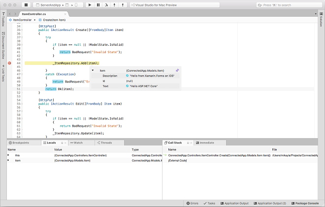
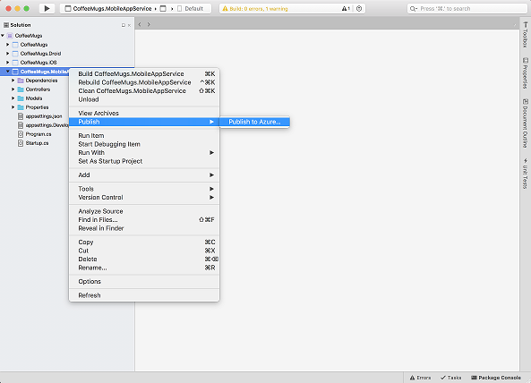
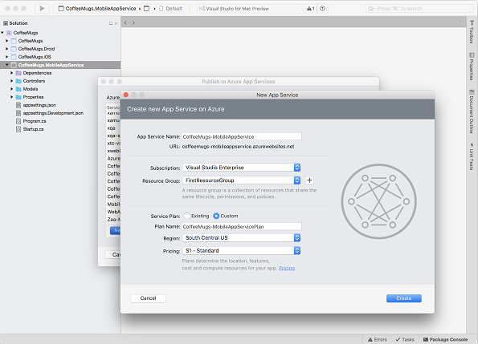
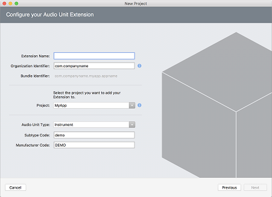
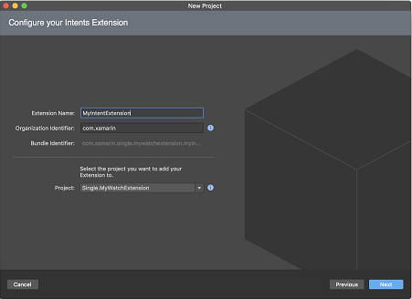
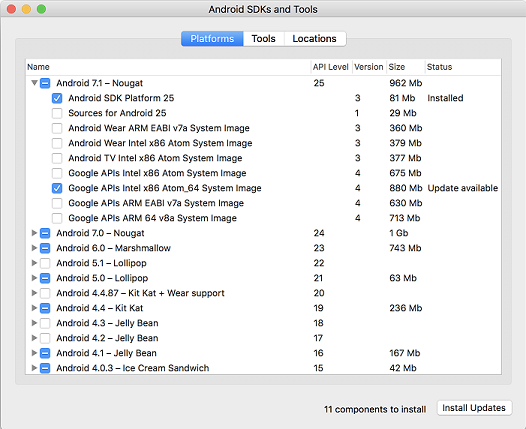

#   Visual Studio 2017 for Mac

This article contains information about the newest release for Visual Studio 2017 for Mac version 7.1.

Use Visual Studio 2017 for Mac to build apps for mobile, web, and the cloud with Xamarin and .NET Core, as well as games with Unity.

To learn more about other related downloads, see the [Downloads](https://www.visualstudio.com/downloads) page. To learn more about Visual Studio 2017 for Mac, see [Mac System Requirements](https://www.visualstudio.com/productinfo/vs2017-system-requirements-mac)
and [Mac Platform Targeting and Compatibility](https://www.visualstudio.com/productinfo/vs2017-compatibility-mac).

### Feedback
We’d love to hear from you! You can report a problem via the [Report a Problem](https://docs.microsoft.com/visualstudio/ide/how-to-report-a-problem-with-visual-studio-2017) option in 
either the installer or the Visual Studio IDE itself. You will find the option in the upper right hand corner. You can track your feedback in the [Developer Community](https://developercommunity.visualstudio.com/index.html) portal. For suggestions,
let us know through the [UserVoice](https://visualstudio.uservoice.com/forums/121579-visual-studio) site.

## Release Date: August 14, 2017 - Visual Studio for Mac 7.1.0.1297

This release focused on bug fixes and introduces the following new features:

- Support for building applications using .NET Core 2.0.
- iOS signing workflow updates.

### .NET Core 2 support
Visual Studio for Mac supports building .NET Core 2.0 applications, including libraries, console apps, as well as web applications and services with ASP.NET Core.

Note that the .NET Core 2.0 SDK needs to be installed via a separate download to enable .NET Core 2.0 development in Visual Studio 2017 for Mac Version 7.1. You can get it at [www.dot.net/core](https://www.dot.net/core). Visual Studio enables side-by-side support of multiple .NET Core SDKs. This also means you can experiment with the latest daily build of the .NET Core SDK, while also developing with the latest public releases.

### iOS signing workflow updates

This release introduces the ability to create required signing artifacts for iOS and tvOS apps. With Visual Studio for Mac, it's possible to:

* Create new signing identities and install them to the local Keychain.
* Create new Provisioning Profiles.
* Add a new signing identity to an existing profile.
* Provision new devices: register a device in the Apple Developer Portal and add them to a provisioning profile.

To try out these new signing features right-click on your project and browse to **Options > iOS Bundle Signing**.

#### Using the Signing Identity section

Before signing, you must satisfy the following criteria:

* A valid certificate (not revoked) is displayed on the Apple Developer Portal in the "Certificates" section.
* The certificate is issued for selected team/developer.
* Both certificate and private key should be installed in your local Keychain. 
* Certificate should not be expired.

Use **Create signing identity...** option of the dropdown if no identities are available on your current machine.

#### Using the Provisioning Profile section

In order to be shown in the "Provisioning Profile" drop-down profile must satisfy the following criteria:
* Not expired.
* Valid (include registered devices and valid certificates).
* Match current distribution type (Debug or Release based on switches at the top).
* Match bundle identifier. Wild card profiles with a matching pattern will be also displayed in this list.

Use **Create provisioning profile...** item of the dropdown if no profiles were found.

If you need to switch back to the previous version of signing controls, and set the provisioning profile and signing identity manually, set the team to **None**. New signing controls will be replaced with old ones. However, we strongly encourage you to try new functionality and provide us with feedback in case of any problems.

Limitations:

* Provisioning profiles created in Visual Studio for Mac will not take into account entitlements selected in your projects (Entitlements.plist). This functionality will be added in future versions of the IDE.
* Distribution provisioning profiles by default will target App Store. In House or Ad Hoc profiles should be created manually.

## Fixes in this release
### Android SDK Manager
* Android SDK Manager is now integrated within Visual Studio `Preferences` instead of being an external application.
* Fixed: The Android SDK Manager shows the wrong component status after an aborted installation.
* Fixed: Android SDK Tools installed but not selected if update is available which can result in the component being uninstalled unintentionally.
* Fixed: Default Android SDK location is not saved if no SDK component changes have been made.

### Performance Improvements
* Improved performance for opening, rendering, typing in a document.
* Optimized background work done while typing.
* Improved load time of opening a solution.
* Optimized loading the search bar results.
* Optimized a lot of source analysis rules.
* Optimized the low level code of the UI work.
* Fixed issues that would cause the memory usage of the IDE to grow over time.
* Optimized code completion, parameter hinting, semantic highlighting.
* Optimized folder expansion in the solution pad - noticeable with folders which contain hundreds of items.
* Optimized IDE startup time for both the first run and subsequent runs.
* In general, optimized CPU usage and memory traffic for using the IDE.

### Other Improvements
* Improved: We have updated the identity service for use on systems behind a proxy. This will get the authentication details from the keychain or prompt for them. If you have been having issues signing in previously please try again and send us any feedback you have so that we continue to improve support for proxies.
* Fixed: Constraint Priority displays 0 in Properties pad; cannot be set from Designer pop-up.
* Fixed: Add the ability to specify the Platform Target for F# projects.
* Fixed: Unused namespaces code issue doesn't handle FSharp.Core namespaces correctly.
* Fixed: Many "New file" dialogs/strings are unlocalized.
* Fixed: "New Solution" dialogs are unlocalized.
* Fixed: Text is truncated in the  "Configure your new Single View App" dialog.
* Fixed: Nuget Wizard tooltip is showing xml character reference '&apos;'.
* Fixed: Updater tooltip is empty when updates are paused.
* Fixed: Update git repo on VSTS fails with "null username or password".
* Fixed: Refactoring for the "nameof" scenario on first use is wrong.
* Fixed: Welcome page keeps losing my recent project when there are many recent projects.
* Fixed: iOS Build error if container app has device-specific builds enabled, while the extension does not.
* Fixed: Syntax Highlighting is not present with C#6 string interpolation for local variables.
* Fixed: In some cases, users are unable to launch Xamarin Inspector.
* Fixed: Getting Warnings while building the Native app (and iOS) in release mode.
* Fixed: .NET Core Class Library targets .NET Standard instead of netcoreapp.
* Fixed: IDE crashes when adding an image (.png or .jpg) to an iOS Storyboard.
* Fixed: Adding all Google Play Services packages fails with "System.AggregateException: One or more errors occurred. ---> System.ArgumentNullException: Value cannot be null.v Parameter name: packageIdentity.Version".
* Fixed: Quick Fix right-click submenu gets stuck up on "Loading...".
* Fixed: The file browser is not displaying SDK Location when clicking “…” file explorer option in Locations tab of the Android SDK Manager.
* Fixed: F# .NET Core projects do not compile.
* Fixed: Logging in to MS Account prompts for credentials to access proxy server graph.windows.net.
* Fixed: Deadlock in Find References and "Find Derived Types" for some F# projects.
* Fixed: Null Reference Exception when trying to add a new iOS account in Visual Studio for Mac.
* Fixed: Adding .NET Standard project to existing solution/directory structure rewrites/reformats *all* source code on disk.
* Removes a requirement to have a specific .NET Core version (preview 2) installed to use .NET Core 2.0. Later previews and .NET Core RTW are now supported.

## Release Date: June 02, 2017 - Visual Studio for Mac 7.0.1.24

This release fixes a number of bugs and memory leaks.

### Android SDK Manager

* Fixed: SDK License is not wrapping correctly.
* Fixed: Cancel Button does not change label back to Install Updates.
* Fixed: On uninstalling latest build of SDK Tools, all SDK tools are uninstalled.
* Fixed: Able to modify components while updates are in progress.
* Fixed: Cannot use downloaded SDK tools from standalone installer due to permission issues.
* Fixed: Not possible to install a previously removed component.
* Fixed: SDK Tools 25.2.5 fail to install.

### Other issues

* Fixed: Issue with restoring documents with side by side document windows.
* Fixed: The name 'InitializeComponent' does not exist in the current context with .NETStandard/new csproj format portable library.
* Fixed: Android deployment is failing silently in release mode.
* Fixed: Quick Fix doesn't do anything.
* Fixed: Removing a Reference in the Edit References Dialog does not work.
* Fixed: Uploading iOS Forms PCL app to Test Cloud fails build step with "Unknown MSBuild Failure”.
* Fixed: Can not inspect variables in .Net core applications.
* Fixed: F# debugging commands show up in all files.
* Fixed: F# Xamarin Forms template doesn't restore packages.
* Fixed: Call Stack disappears when a thread selection is made while debugging .NET Core application.
* Fixed: Holding the shift and the down keys continues to select text past the viewport.
* Fixed: UI lockup while restoring packages.
* Fixed: Editor doesn't render the full text.
* Fixed: File open ordering issue after solution load when using Apple events to open files.
* Fixed: Renaming a file to match class name deleted the file.
* Fixed: FooButton_Clicked handler completion does not generate method stub.
* Fixed: Split screen causes menu items to become disabled.

## What's New in Visual Studio for Mac

### Core Functionality

Visual Studio for Mac has everything you would expect from a modern IDE, including a full-featured source editor, code search and navigation, a powerful debugger, a
customizable workspace, Git integration, and a rich extension system.

Other features include:
* Roslyn-based C# IntelliSense, refactoring, analyzers, and code fixes.
* NuGet-based package management.
* Visual Studio compatible project format.
* MSBuild build engine.
* Integrated unit testing.
* Support for F# out-of-the-box.

### .NET Core Support

[.NET Core](https://www.microsoft.com/net/core) is a platform for creating applications
that you can run on Windows, Linux, and Mac. Visual Studio for Mac provides you with support 
for loading, creating, running, and debugging .NET Core projects.

In order to run .NET Core projects the .NET Core SDK should be
[downloaded and installed](https://aka.ms/vs/mac/install-netcore).

.NET Core support includes:
* C# and F# IntelliSense.
* .NET Core project templates for console, library, and web applications.
* Full debugging support, including breakpoints, call stack, watch window, etc.
* NuGet PackageReferences and MSBuild-based restore.
* Integrated unit testing support for running and debugging tests with the [Visual Studio Test Platform](https://github.com/Microsoft/vstest) that is included with the .NET Core SDK.
* Migration from old project.json format. 

### Web Tooling

Visual Studio for Mac adds new web tooling support for HTML, CSS and JSON files.

#### HTML

* New HTML template.
* Improved smart indent and formatting.
* Improved colorization.
* Improved Intellisense.
* Code folding (must be enabled).
* Unminify command.
* Improved Code Templates (snippets).
* Surround selection with `
`.
* Option up/down moves selected text up/down.
 
#### CSS

* Improved smart indent and formatting.
* Improved colorization.
* Improved IntelliSense.
* Code folding.
* Many Code Templates (snippets).
* Option up/down moves selected text up/down.
 
#### JSON

* Schema picker with access to schemastore.org.
* Validation from schema.
* IntelliSense from schema.
* Improved smart indent and formatting.
* Improved colorization.
* Comment/uncomment.
* Quote injection and brace matching.
* Option up/down moves selected text up/down.

### Xamarin

First-class support for [Xamarin](https://developer.xamarin.com/) allows you to develop rich native
experiences for Android, macOS, iOS, tvOS, and watchOS. Xamarin.Forms cross-platform
applications help you share XAML-based UI code between Android, iOS, and macOS
without limiting access to native functionality.

This includes:
* Building, deployment, debugging, and profiling.
* Drag-and-drop UI designers for iOS and Android.
* Live preview for Xamarin Forms.
* .NET Standard compatible framework.
* Bindings to native APIs.

#### Multiplatform App Templates

The Multiplatform **Xamarin.Forms App** and the **Native App** project templates now provide you a quick way to create a
multiplatform mobile app and its cloud backend.

These templates create multiple projects: a Xamarin.iOS app project and
a Xamarin.Android app project that share code via a shared project, and a
.NET Core Web API project that implements a back-end service for the apps (_Figure 1_).

*(Figure 1) Debugging with .NET Core*

#### Publishing ASP.NET Core Web Apps to Azure App Services

It is possible to publish your ASP.NET Core web apps to Azure App Services (_Figure 2_).

*(Figure 2) Publish to Azure Content Menu*

To publish your web app, select the **Publish | Publish to Azure** command from the **Solution Pad** or from the **Project** menu.
Then choose the **App Service** you wish to deploy to, or create a new **Azure App Service** (_Figure 3_). Output from the publishing will be logged to
a **Publish** output pad and a publishing profile will be created under **Properties > PublishProfiles** in the project.

*(Figure 3) Publish a New App Service*

All publish profiles defined in the project will be shown as options within the **Publish** menu so that you can deploy again without having
to select the **App Service** a second time.

#### Multi-Process Debugging

Projects have **Project Run Configurations** which specify options
and arguments for running your project. A dropdown in the toolbar lets you
view and change the current active Run Configuration.

Visual Studio for Mac's  **Solution Run Configurations**
window allows _multiple_ projects to be launched at once. You can create solution
run configurations in the **Solution Options** dialog. This is very useful for debugging how a mobile app interacts with
its backend service.

#### TextMate Bundles

Visual Studio for Mac has support for TextMate language bundles, which you can use to add: 
* Editor color themes.
* Code snippets.
* Grammars for new languages, enabling highlighting, and basic IntelliSense.

You can add TextMate bundles in **Preferences > Text Editor > Language Bundles**.

#### iOS
##### Audio Unit Wizard

The new Audio Unit Extension wizard *(Figure 4)* adds 3 options to customize the Audio Unit project template's plist.  
* Audio Unit Type
  * Instruments
  * Generator
  * Effect
  * Music effect
* Subtype Code: has to be 4 characters exactly.
* Manufacturer Code: has to be 4 characters exactly.

*(Figure 4) Audio Unit Wizard*

##### watchOS Extension Wizard

In Xcode 8.3, Apple introduced watchOS extensions (similar to the iOS ones), starting with the Intents Extension (Siri).

The watchOS Extension wizard *(Figure 5)* has been updated to support watchOS extensions, and we now have a dedicated Intents Extension template.

*(Figure 5) watchOS Extension Wizard*

##### Other Improvements and Bug Fixes

* We now handle `Deprecated` and `Obsoleted` attributes in autocompletion window. This allows Xamarin.iOS obsoleted and deprecated APIs to be shown as struck through.
* We show a progress bar when deploying to device. This is especially useful for watchOS. *(Requires Xamarin.iOS 10.5.0.323+)*.
* We use known OS versions from Xamarin.iOS to populate the deployent target dropdowns.  
Two advantages are that we can give you the exact minimum version for each App Extensions type, as well as avoid showing OS versions, based on Xcode, that Xamarin.iOS does not *yet* support.

#### Mac/iOS API Issue Analyzer

* Fix duplicated marker when analyzer is triggered.
* Get the "message" (piece of information in the framework explaining why the API is deprecated/obsolete) from the attribute and append that information to the different availability messages.
* Updated all availability messages to improve clarity.
* Improved clarity by using the symbol's name in the availability message, changed from:  
  `API Usage Issue: this API requires iOS 10.0 or later`  
  to:  
  `'MyMethod' is only available on iOS 10.0 or newer`

#### Android

* New SDK Manager

Visual Studio for Mac includes its own Android SDK manager (_Figure 6_).

*(Figure 6) Android SDK Manager*

* Deploying your project to device or emulator is now done via the `/t:Install` msbuild target. Previously Visual Studio for Mac
would use its own internal logic for deploying applications to devices but now it uses same common targets that you can 
employ from Terminal, or that are used in Visual Studio on Windows. One of the benefits of this is that there are now
better logs available to diagnose deployment issues.

* The default for new binding projects is now `class-parse`. It can parse Java bytecode directly wihout the need
for a JVM. You now have the ability to extract parameter names from Java bytecode which contains debug symbols. For example, bytecode compiled with javac -g.
`class-parse` also doesn't "skip" classes which inherit from, or contain, members of unresolvable types.

#### Accessibility

* This version of Visual Studio for Mac contains support for assistive technologies such as Voice Over. Many parts of the user interface, such as the editor and solution explorer, have been made accessible through these technologies. However, it is still a work in progress and futher improvements will be made in future releases. The accessibility features can be enabled either through the **Accessibility** preferences or through the commandline by entering:

  `defaults write com.microsoft.visual-studio com.monodevelop.AccessibilityEnabled 1`

  
[Top of Page](#top)
