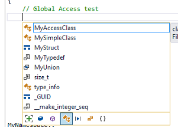

# <a id="top"> </a> Visual Studio 2017 version 15.0 Release Notes
**Please Note:** This is not the latest version of Visual Studio 2017. To download the latest release, please visit the [current release notes](vs2017-relnotes.md) for Visual Studio 2017, or the [Downloads](https://www.visualstudio.com/downloads) page.

In this article, you will find information regarding the releases for Visual Studio 2017 version 15.0.

### Feedback
We’d love to hear from you! You can report a problem via the [Report a Problem](https://docs.microsoft.com/en-us/visualstudio/ide/how-to-report-a-problem-with-visual-studio-2017) option in 
either the installer or the Visual Studio IDE itself. You will find the option in the upper right hand corner. You can track your feedback in the [Developer Community](https://developercommunity.visualstudio.com/index.html) portal. For suggestions,
let us know through the [UserVoice](https://visualstudio.uservoice.com/forums/121579-visual-studio) site.

<hr style="border:1px solid Silver"> 

## <a id="15.0.26228.13"></a>Release Date: May 23, 2017 - Visual Studio 2017 version 15.0 (26228.13)
#### Issues Fixed
* Offline install scenarios no longer require internet access.

<hr style="border:1px solid Silver"> 

## <a id="15.0.26228.12"></a>Release Date: March 31, 2017 - Visual Studio 2017 version 15.0 (26228.12)
#### Summary of Updates
* We now support Xcode 8.3, iOS 10.3, watchOS 3.2, and tvOS 10.2 tools and APIs in the Xamarin.VS Extension for Visual Studio 2017. 

<hr style="border:1px solid Silver"> 

## <a id="15.0.26228.10"></a>Release Date: March 28, 2017 - Visual Studio 2017 version 15.0 (26228.10)
#### Issues Fixed
These are the customer-reported issues addressed in build 26228.10:

* [Git folder view 'Discovering files' hangs](https://developercommunity.visualstudio.com/content/problem/24858/git-folder-view-discovering-files-hangs.html).
* [Windows Explorer crashes when opening folder with a typescript file](https://developercommunity.visualstudio.com/content/problem/31003/windows-explorer-crashes-when-opening-folder-with.html).
* [2017 hangs on open SLN](https://developercommunity.visualstudio.com/content/problem/25046/2017-hangs-on-open-sln.html).
* [Studio hangs on close](https://developercommunity.visualstudio.com/content/problem/18802/studio-hands-on-close.html).
* [Visual Studio crashes when loading solution](https://developercommunity.visualstudio.com/content/problem/26835/visual-studio-crashes-when-loading-solution.html).
* [VS Enterprise 2017 RC crashed when syncing source code from on-prem VSTS server](https://developercommunity.visualstudio.com/content/problem/18484/vs-enterprise-2017-rc-crashed-when-syncing-source.html).
* [Unloading the selected projects hangs](https://developercommunity.visualstudio.com/content/problem/22548/unloading-the-selected-projects-hangs-1.html).
* [VS2017 RC4 freezes when loading a particular solution](https://developercommunity.visualstudio.com/content/problem/19848/vs2017-rc4-freezes-when-loading-a-particular-solut.html).

<hr style="border:1px solid Silver"> 

## <a id="15.0.26228.09"></a>Release Date: March 14, 2017 - Visual Studio 2017 version 15.0 (26228.09)
#### Issues Fixed

These are the customer-reported issues addressed in build 26228.09:
* [Solution appears to close immediately after opening](https://developercommunity.visualstudio.com/content/problem/24293/solution-appears-to-close-immediately-after-openin.html).
* [Install sticks at Applying GitV2](https://developercommunity.visualstudio.com/content/problem/24221/install-sticks-at-applying-gitv2.html).
* [Microsoft.Net.Core.SDK;PackageAction=Install;ReturnCode=-2147023274](https://developercommunity.visualstudio.com/content/problem/24245/microsoftnetcoresdkpackageactioninstallreturncode.html).
* [Installation Failing because of Invalid Source/Destination Paths](https://developercommunity.visualstudio.com/content/problem/23183/installation-failing-because-of-invalid-sourcedest.html).
* [Solution closes after first launch](https://developercommunity.visualstudio.com/content/problem/19189/solution-closes-after-first-launch-1.html).

<hr style="border:1px solid Silver"> 

## <a id="15.0.26228.04"></a>Release Date: March 7, 2017 - Visual Studio 2017 version 15.0 (26228.04)
#### Summary of Updates
#### Develop: Navigate, write, and fix your code fast

* New Installation Experience has a reduced minimum footprint for faster and more customizable installations, as well as support for offline installs.
* Visual Studio IDE provides a broad range of enhancements in Visual Studio 2017, including reduction in startup and solution load times, sign in and identity improvements, improved code navigation, open folder view, and connected services enable connections between your app and any service on-premises or in the cloud.
* There are no breaking changes for Visual C++ between 2015 and 2017. Better C++14 conformance level, CMake support, build throughput, and productivity in the editor.
* C# and Visual Basic extend support for new C# 7.0 and Visual Basic 15 language features, and introduces new refactorings that allow you to organize source code with one action.
* F# support for F# 4.1 language features, improvements to the F# compiler and FSharp.Core, and a new editor based on Roslyn Workspaces.
* JavaScript and TypeScript has TypeScript 2.1 available for all TypeScript projects in Visual Studio. A new JavaScript language service is available and enabled by default.

#### Debug: Debug, profile, and diagnose with ease

* Debugging and Diagnostics overhaul of the Exception Helper and faster code navigation with Run to Click. Plus, a new summary of your application events in the Diagnostic Tools window and several improvements to the CPU Tool.

#### Test: Write high-quality code with comprehensive testing tools

* Live Unit Testing can now visualize unit testing results and code coverage live in the editor.
* Testing Tools associate automation with test case work items using the Test Explorer.

#### Collaborate: Use version control, be agile, and collaborate efficiently

* New Git features in Team Explorer and updated connect experience to do more with Git in Visual Studio 2017 and easily find the projects and repos to which you want to connect.
* Enhanced Visual Studio Feedback Workflow has more collaborative Report-A-Problem. Search, follow, and vote to get latest updates on all feedback.

#### Extend: Customize to your liking by building your own extensions

* Visual Studio Extensions: Customize Visual Studio to your liking by building your own extensions.
* Discoverability of Project and Item Templates: There is a breaking change with how Visual Studio consumes project and item templates to improve performance of template discovery.

#### Equip: Utilize tooling to increase productivity and explore new capabilities

* .NET Core and ASP.NET Core: This contains the 1.0 final release of the new MSBuild based .NET Core Tools. Using Visual Studio 2017, you can create .NET Standard libraries, .NET Core apps/libraries, and ASP.NET web projects that use the new csproj format.
* Tools for Universal Windows App Development: Updates include a new version of the .NET Native toolchain, .NET Core NuGet framework, new productivity tools, and support for the Windows 10 "Creators Update" SDK.
* Xamarin: Xamarin 4.3 adds support for tvOS, while also improving iOS Assets Catalog support and the XML editing experience.
* Visual Studio Tools for Apache Cordova: A new browser-based simulator enables you to code fast and see the results immediately.
* Node.js Tools for Visual Studio: Updates focused on stability, performance, and overall product quality.
* Visual Studio Tools for Unity: Visual Studio Tools for Unity 3 is now available with the "Game Development with Unity" workload from the new Visual Studio installer.
* Redgate Data Tools: To extend DevOps capabilities to SQL database development, Visual Studio now includes [Redgate Data Tools](https://www.red-gate.com/products/sql-development/entrypage/redgate-data-tools?utm_source=microsoft&utm_medium=link&utm_campaign=rgdt&utm_term=relnotes0317), comprising Redgate ReadyRoll Core, SQL Search, and SQL Prompt Core.
* NuGet: NuGet now supports storing package dependency information directly in project files as [package references](https://aka.ms/vs2017nuget-pkgref), while maintaining the advances of transitive package references.
* Tools for XAML Apps: The XAML runtime toolbar now lets you track focus. XAML productivity has been improved with XAML Edit & Continue, improvements to the XAML Editor, and performance optimizations.
* Data Tools and SQL Server: The latest update of SQL Server Data Tools enables support for the newest features in Azure SQL Database and SQL Server 2016.
* Developer Analytics Tools: Visual Studio 2017 includes Developer Analytics Tools v8.6 with many improvements to the Application Insights and HockeyApp features in Visual Studio.
* Office Developer Tools for Visual Studio: Includes Office Developer Tools with the latest features and updates.
* Live Architecture Dependency Validation: Real-time notifications of dependency validation diagrams (aka Layer diagrams).
* Developer Command Prompt: Refactored scripts to support the new installation experience.
* Azure SDK for .NET: Now available from the new Visual Studio installer.

<hr style="border:1px solid Silver"> 

## What's New in this Version
### <a id="install"> </a>Installation Experience

We're delighted to introduce our new installer, which was designed from the ground up to:

* Reduce the minimum footprint of Visual Studio.
* Install more quickly, with less system impact, and uninstall cleanly.
* Make it easier for you to select and install just the features you need.

When you first install Visual Studio 2017, you'll see the new experience *(Figure 1)*:


<center>*(Figure 1) The new installation experience in Visual Studio 2017*</center>

The smallest install is just a few hundred megabytes, yet still contains basic code editing support for 
more than twenty languages including source code control. Most users will want to install
more. You can add one or more 'workloads' that represent common frameworks,
languages, and platforms - covering everything from .NET desktop development to game development with
Unity.

#### How to Update Visual Studio
To update Visual Studio, run the Visual Studio Installer and click the "Update" button.

#### Feedback on the New Installer
You can report problems or praise using the _Report a Problem_ and _Provide a Suggestion_  commands
from the new installer client in the upper right corner of the title bar. We want to know if you experience errors
installing, uninstalling, or modifying your installation, as well as abnormal installation
times (e.g. hangs) or unexpected error messages.

#### Creating a Layout for Offline Installation and New Command-Line Installation Support
System administrators and other users can now create an offline layout of Visual Studio that contains all content needed to
install the product without requiring internet access. This layout can be the full product, a subset of workloads and/or components, and one or
more product locales. Note that creating the offline layout requires internet access. For more information, see
[Create an offline installation of Visual Studio 2017](https://docs.microsoft.com/visualstudio/install/create-an-offline-installation-of-visual-studio).

#### <a id="Nickname"> </a> Installation Nickname
Visual Studio Enterprise and Community (among other products) can now be installed side-by-side on the same computer.
To make identifying these installations simpler, you can specify a short name or "nickname".
For example, if you were to install Visual Studio Enterprise, and then install Community, both would appear the same on the start menu.
You can give the second one a nickname like "community", and the start menu items will appear with names such as "Visual Studio 2017 (community)" and "Developer Command Prompt for Visual Studio 2017 (community)".

********

### <a id="vside"> </a> Visual Studio IDE
#### IDE Improvements
* Visual Studio has been optimized to reduce startup time and solution load time. The very first launch of Visual Studio is at least 50% faster.
* Visual Studio will now monitor extension performance that impacts startup, solution load, or editing. You will receive alerts about poorly performing extensions via the Notification bar in the IDE. The new Performance Center (also available via Help > Manage Visual Studio Performance) lets you view not only extensions that are impacting performance, but also discover tool windows that are impacting your startup performance and change their startup load behavior.
* The GitHub extension for Visual Studio can be selected in the new Visual Studio installer.
* Reload All Projects has been replaced with Reload Solution to support better performance when switching branches external to VS. When using the Git command line to switch branches, choose Reload Solution after the branch has switched to achieve the maximum performance improvement.
* File globbing capabilities for .NET Core and ASP.NET Core projects have been enhanced. See [project file globbing](https://aka.ms/jcmh7k) for more details.
* You are now automatically taken to the folder view of your repository after cloning. You can view files or open Solutions with the new Solution selection list in the Solution Explorer.
* A new external service host is being introduced that will replace VSHub. This new service host is an external process and will appear in Task Manager as ServiceHub.Host.CLR.*.exe, as well as ServiceHub.Host.Node.x86.exe. This host will ultimately eliminate the localhost http traffic that was introduced with VSHub which should alleviate the noise Fiddler users reported.
* Pre-release license expiration messages more clearly communicate the current license state.
* The Account Settings dialog is now more accessible to screen readers.
* Offline help is now available by installing the Help Viewer component from the Visual Studio installer.
* You can now add and remove multiple user interface languages at any time using the Visual Studio installer on the Language Packs tab. You can select the current user interface language among those installed using Tools > Options > International Settings.
* The version control status bar makes it easier to publish local repos to an SCC host and keep track of uncommitted *(Figure 2)* and un-pushed work *(Figure 3)*.


<center>*(Figure 2) Version Control - Unpublished commits example*</center>


<center>*(Figure 3) Version Control - No pending changes example*</center>

#### Sign In and Identity Improvements
We introduced a new identity service that allows you to share user accounts across Microsoft developer tools. Within Visual Studio, this sharing includes features such as Team Explorer, Azure Tools, Windows Store publishing, and more. These features now share a common and consistent sign in experience.

Along with improvements to Visual Studio, we have completed the deployment of some improvements on the service side that allow users to safely stay signed in and eliminate the forced sign in every 12 hours. This addresses the most commonly reported sign in issue.
[Learn more about fewer Visual Studio prompts](https://blogs.msdn.microsoft.com/visualstudio/2016/08/15/fewer-visual-studio-sign-in-prompts/).

#### Start Page
The [redesigned Start Page](https://blogs.msdn.microsoft.com/visualstudio/2016/11/29/harness-the-power-of-the-redesigned-start-page/) has new Open and Create facilities:
* Acquire remote repos from VSTS or use our more prominent MRU to open local projects and solutions easily.
* The Start Page MRU shows repos you've cloned on other machines so you can easily clone them on your current machine.
* Create a new project directly from the Start Page with searchable templates and a list of recently used templates. Recently used templates will also roam across Visual Studio instances with a personalization account.
* Quickly launch the new Clone from VSTS experience through the "Checkout from VSTS" option on the Start Page.
* A dismissible "Get Started" section.
* The News section is now collapsible:
  * Updated badge on newly added items in the News Feed.
  * Badge on News Feed expander if new items appear when the News Feed is collapsed.
*  Refined visual design to address feedback about truncated elements on smaller screens and utilization of empty space.

The new Start page is shown below *(Figure 4)*:


<center>*(Figure 4) Start Page with Get Started and News*</center>

#### <a id="betternav"> </a>Improved Code Navigation
We've made significant improvements to code navigation features in Visual Studio 2017:

* Go To All (`Ctrl+`, or `Ctrl+ T`) lets you quickly find and go to files, types, methods, and other elements in your code. It allows you to locate items of any kind, even in large code bases. What’s more, if you know what kind of item you’re after, you can filter down easily. In C#, Visual Basic, and F#, we have also added "fuzzy" matching such that if you misspell a type name you will still get results. We've also modernized the Go To Line (`Ctrl + G`) experience. You can find the Go To family of commands at the top of the Edit Menu *(Figure 5)* and *(Figure 6)*.  


<center>*(Figure 5) Go To Results Filtered*</center>


<center>*(Figure 6) Go To Line*</center>

* Find All References (Shift+F12) has been overhauled (currently for C#, Visual Basic, F#, and C++), providing advanced grouping, filtering, sorting, searching within reference results, and colorization for results (for C# and VB), so you can get a clear understanding of your references and get to the line of code you need with confidence. On mouse hover on a reference item, a tooltip is displayed with the context of the reference in source code (for C# and VB). By toggling on the Keep Results button in the toolbar, the next invocation of Find All References will populate reference results in a new window. This allows you to keep the current results in the existing window *(Figure 7)*.


<center>*(Figure 7) Find All Reference*</center>

* Structure Guide Lines are now drawn in the editor so that you can easily visualize the structure of the code that you are working in. On mouse hover, a tooltip *(Figure 8)* is displayed containing the context of the current code block relative to its ancestor blocks. Structure Guide Lines are currently supported for C#, Visual Basic, F#, and XAML files, and for any files supported via TextMate grammars. This feature may be disabled in the Tools > Options dialog by unchecking the *Show structure guide lines* checkbox under the *Text Editor* > *General* category.


<center>*(Figure 8) Structure Guide Lines*</center>

#### Coding Convention Support via EditorConfig
The Visual Studio editor now supports [EditorConfig](http://editorconfig.org), which allows developers to define and maintain consistent coding style conventions between different editors and IDEs. See [documentation](https://docs.microsoft.com/en-us/visualstudio/ide/create-portable-custom-editor-options) for more details, and [.NET documentation](https://docs.microsoft.com/en-us/visualstudio/ide/editorconfig-code-style-settings-reference) for information on how to use .editorconfig files to govern your .NET code style. See [known issues](vs2017-knownissues.md) for limitations in EditorConfig support in this release.

#### Open Folder
Open Folder is a convenient way for you to work with code bases without projects and solutions. Open Folder View
 from File > Open > Folder, and then select a folder to navigate.
You can open and edit files using the Solution Explorer *(Figure 9)*. Many popular languages have syntax highlighting and support
for symbol navigation (GoTo).


<center>*(Figure 9) The new Open Folder feature in Visual Studio IDE*</center>

Additionally, some languages have advanced IntelliSense and debugging support directly
from the folder:

* C++ (CMake).
* Node.js - JavaScript/TypeScript.
* C# & VB.

You can build or debug by using F5 and the file context menu in the Solution Explorer. For the best experience,
make sure you install the workload for the languages you are working with.

The folder view also supports the following:

* Search across the code in your folder with GoTo (`Ctrl+`).
* Scope the Solution Explorer folder view to subfolders.
* Open folders in Explorer or the Command Prompt from the Solution Explorer.
* Easily toggle between Solutions in the opened folder or repository with the Solution selection dropdown.
* Configure debug and launch settings with launch.vs.json. Right-click on a file that can be debugged and select Debug and Launch Settings.
* Configure tasks and customize build with tasks.vs.json. Right-click on any file and select Configure Task Settings.
* Launch.vs.json and tasks.vs.json have IntelliSense in the JSON editor.

The performance of opening folders and toggling between folder view and solution view has been drastically improved.

#### Lightweight Solution Load
Lightweight Solution load enables faster loading of large Solutions. It can provide substantial improvements in Solution load time and memory usage for large Solutions. The feature is not enabled by default and can be
enabled on a Solution-by-Solution basis or globally in the IDE. To enable globally, navigate to Tools > Options, select General under Projects and Solutions *(Figure 10)* or by searching for "Lightweight Solution load" with
Quick Launch. The feature can be turned on and off for individual Solutions in the Solution properties pane.


<center>*(Figure 10) The new Lightweight Solution load feature Visual Studio IDE*</center>

Lightweight Solution Load is best suited for large solutions that contain C# or a mix of C# and C++ projects. You
may be prompted to enable the feature if we detect that you are working with large solutions. You can find more
details about this feature on the [Visual Studio blog](https://blogs.msdn.microsoft.com/visualstudio/2016/10/11/shorter-solution-load-time-in-visual-studio-15/).

Performance of full Solution builds has been improved substantially, now at parity with conventional Solution load.

#### Syntax Colorization, Autocomplete, Snippet, and "Navigate To" Search Support for More Languages
Building on the support we added in the Visual Studio 2015 updates, Visual Studio 2017 now supports syntax colorization and autocomplete for an increased range of languages.
In addition, some of these languages also support navigation via "Navigate To" (`Ctrl+`), and/or Code Snippets.

Files for the languages noted below, support these features in the new Visual Studio Core Editor even when
no workloads have been installed to explicitly support the language in question. If a workload that provides
language support is installed (e.g., the .NET Desktop Application Development workload, the Windows Desktop
App Development with C++ workload, etc.), then more extensive language
support including IntelliSense and other advanced language features like Light Bulbs may be provided.

Language file types listed by support level:
* Supports only Syntax Colorization and Autocomplete:
  * Bat, Clojure, CoffeeScript, CSS, Docker, F#, Groovy, INI, Jade, Javadoc, JSON, LESS, LUA, Make, Markdown ++, Objective-C, Perl, PowerShell, Python, Rust, ShaderLab, SQL, Visual Basic .NET, YAML.
* Supports Code Snippets (in addition to Syntax Colorization and Autocomplete):
  * CMake, C++, C#, Go, Groovy, HTML, Java, Javadoc, JavaScript, Lua, Perl, PHP, R, Ruby, Shellscript, Swift, XML.
* Supports Navigate To (in addition to Syntax Colorization and Autocomplete):
  * C++, C#, Go, Java, JavaScript, PHP, TypeScript, Visual Basic.

#### Getting Started with Project Overview Pages
We have introduced a completely new getting started experience for freshly created projects. We've replaced current getting started pages with an Overview
tab in our new App Configuration Designer and focused the page on the actions that will get you up and running quickly! This has been enabled in ASP.NET 4.x ASP.NET Core, and Cordova projects *(Figure 11)*.


<center>*(Figure 11) Project Overview*</center>

#### <a id="servicecapability"> </a>Connecting to Services Using Connected Services
In a previous release, this feature was named Service Capabilities. We've changed the name to Connected Services.

Connected Services is the modern "Add Connected Service" or "Add Service Reference" feature of Visual Studio 2017.
The Connected Services feature makes it easier to connect your app to services. A new node called "Connected Services"
is available in the Solution Explorer for Web and Mobile project types. Double-clicking this node will open a new full page
tab in Visual Studio where you can discover popular Microsoft services you can connect to.

Selecting a service on the Connected Services page *(Figure 12)* will invoke the Connected Services Wizard that configures your project,
and downloads the necessary NuGet packages to get you started coding against your service quickly and painlessly.


<center>*(Figure 12) Connected Services*</center>

#### <a id="quicklaunchinprod"> </a>In-Product Acquisition of Tools and Features
Visual Studio 2017 makes it easy to acquire additional workloads and components without leaving the IDE *(Figure 13)*. Leverage Quick Launch to find and kick-off the Visual Studio Installer for any Workload or Individual component.


<center>*(Figure 13) In-product acquisition via Quick Launch*</center>

If you can't find the templates you’re looking for, the Visual Studio Installer can also be opened from within the New Project dialog *(Figure 14)*.


<center>*(Figure 14) In-product acquisition via Quick Launch*</center>

****

### <a id="cplusplus"> </a> Visual C++
Visual Studio 2017 brings many updates and fixes to the Visual C++ environment. Thank you for reporting bugs! We've fixed over 250 bugs and reported issues in the compiler and tools, many submitted by customers through [Microsoft Connect](https://connect.microsoft.com/VisualStudio "Microsoft Connect").
In this release, we worked on performance improvement of the STL.
The new SQLite-based database engine is now being used by default. This will speed up database operations like Go To Definition and Find All References, and will significantly improve initial solution parse time. We now provide a more granular installation experience for installing the original C++ workload.
We have added selectable components that enable you to install just the tools that you need. CMake support in Visual Studio is ready for primetime! Load your CMake projects directly into VS and start coding now.
“Open Folder” C++ experience has been improved – so bring your source code to VS without the need to create any VS solutions and projects.
Navigate To is now known as Go To, an umbrella term for a set of new navigation filters. This will make it easier to find the right results, especially in larger code bases.

#### C++ Code Analysis
The C++ Core Checkers for enforcing the [C++ Core Guidelines](https://github.com/isocpp/CppCoreGuidelines) are now distributed with Visual Studio. Simply enable the checkers in the Code Analysis Extensions dialog in the project's property pages *(Figure 15)* and the extensions will be included when you run code analysis.


<center>*(Figure 15) CppCoreCheck properties page*</center>

#### C++ Compiler
We've updated the C++ compiler and standard library with enhanced support for C++11 and C++14 features, as well as preliminary support for certain features expected to be in the C++17 standard. With support for generalized constexpr and NSDMI for aggregates, the compiler is complete for features added in the C++14 Standard. Note that the compiler still lacks a few features from the C++11 and C++98 Standards.
Visual Studio 2017 allows using /sdl with /await. We removed /rtc limitation with Coroutines.

This release brings several improvements in optimization and code generation. Some notable improvements include:  

* Improved code generation of loops: support for automatic vectorization of division of constant integers, better identification of memset patterns.
* Improved code security: improved emission of buffer overrun compiler diagnostics, and /guard:cf now guards switch statements that generate jump tables.
* The /debug:fastlink option has been improved to provide 30% faster link times on large components than in Visual Studio 2015.
* When using co-routines, the Experimental keyword "yield" (available under /await switch) has been removed. Your code should be updated to use the "co_yield” instead. For more information, see the [Visual C++ Team blog](https://blogs.msdn.microsoft.com/vcblog/2017/01/27/yield-keyword-to-become-co_yield-in-vs-2017).

#### C++ Libraries

* [STL] Performance improvement of basic_string.
* [STL]  Added \<any\>, \<string_view\>, apply(), make_from_tuple().
* [STL] std::vector has been overhauled for correctness and performance.
* [STL] The STL now avoids dereferencing null fancy pointers.
* [STL] Added \<optional\>, \<variant\>, shared_ptr::weak_type, and \<cstdalign\>.
* [STL] Enabled C++14 constexpr in min/max/minmax(initializer_list) and min_element/max_element/minmax_element().
* [STL]Improved the performance of std::string/std::wstring's move constructors by more than 3x.
* [STL] For a complete list of STL improvements see: [Visual C++ Team blog](https://blogs.msdn.microsoft.com/vcblog/2017/02/06/stl-fixes-in-vs-2017-rtm/).
* [ATL] Yet another set of name-lookup conformance fixes.
* [ATL] Existing move constructors and move assignment operators are now properly marked as non-throwing.
* [ATL] Un-suppress valid warning C4640 about thread safe init of local statics in atlstr.h.
* [ATL] Thread Safe Initialization of local statics was automatically turned off in the XP toolset when [using ATL AND building a DLL]. This is no longer the case. You can add /Zc:threadSafeInit- in your Project settings if having thread safe initialization off is desired.
* [AMP] Audited library and fixed typos.
* [VCRuntime] New header ‘cfguard.h’ for Control Flow Guard symbols.

#### C++ IDE
Configuration change performance is now better for C++ native projects and much better for C++/CLI projects. When a solution configuration is activated for the first time it will now be faster and all subsequent activations of this solution configuration will be almost instantaneous.

The new SQLite-based database engine is now being used by default. This will speed up database operations like Go To Definition and Find All References, and will significantly improve initial solution parse time. The setting has been moved to Tools > Options > Text Editor > C/C++ > Advanced (it was formerly under ...C/C++ > Experimental).

We've improved IntelliSense performance on projects and files not using precompiled headers – an Automatic Precompiled Header will be created for headers in the current file.

Other updates include:

* We've added error filtering and help for IntelliSense errors in the error list *(Figure 16)*. Clicking on the error column now allows for filtering *(Figure 17)*. Also, clicking on the specific errors or pressing F1 will launch an online search for the error message.


<center>*(Figure 16) Error List*</center>


<center>*(Figure 17) Error List Filtered*</center>

* Added the ability to filter Member List items by kind *(Figure 18)*.


<center>*(Figure 18) Member List Filtered*</center>

* Added a new experimental Predictive IntelliSense feature that provides contextually-aware filtering of what appears in the Member List.
* The new Find All References UI includes information about whether you are reading from or writing to a variable in the results for C++ code.

* The Dot-to-Arrow IntelliSense feature has been moved from experimental to advanced, and is now enabled by default. The editor features Expand Scopes and Expand Precedence have also been moved from experimental to advanced.

* The experimental refactoring features Change Signature and Extract Function are now available by default.

* We've enabled the new experimental feature for C++ projects ‘Faster project load’. The next time you open a C++ project it will load faster, and the time after that it will load even faster!

* Improvements to the Open Folder experience. Edit, build, and debug your non-MSBuild C++ project by loading your sources through “Open Folder”. Customize the experience through these json files:
  * CppProperties.json to customize the IntelliSense and browsing experience.
  * Tasks.vs.json to customize the build steps.
  * Launch.vs.json to customize the debugging experience.

* C++ IntelliSense will work without the need to create a CppProperties.json file in the root folder. Along with this, we've added a new dropdown to allow users to easily switch between configurations provided by CMake and CppProperties.json files.
CMake support in Open Folder: opening CMake projects with “Open Folder” will automatically configure the environment for C++ editing, building and debugging.

* Further configuration is supported via a CMakeSettings.json file that sits in the same folder as the CMakeLists.txt file *(Figure 19)*.


<center>*(Figure 19) CMake Open Folder*</center>

* CMake support:
    * For an overview of CMake support see: [Visual C++ Team blog](https://blogs.msdn.microsoft.com/vcblog/2016/12/20/cmake-support-in-visual-studio-2017-whats-new-in-the-rc-update/).
    * Discover the CMake support with a 10 min video: [CMake Video](https://www.youtube.com/watch?v=_lKxJjV8r3Y&t=2s).
* Linux development with C++: see the video [Linux Video](https://www.youtube.com/watch?v=XIiFuBczd6A).

#### C++ Installation Workloads
* Windows Desktop Development with C++:  

    * We now provide a more granular installation experience for installing the original C++ workload. We have added selectable components that enable you to install just the tools that you need.  Please note that the indicated installation sizes for the components listed in the installer UI are not accurate and underestimate the total size.  

    * To successfully create Win32 projects in the C++ desktop workload, you must install both a toolset and a Windows SDK. Installing the recommended (selected) components “VC++ 2017 v141 toolset (x86, x64)” and “Windows 10 SDK (10.0.14393)” will ensure this will work.  If the necessary tools are not installed, projects will not be created successfully and the wizard will hang.

* Linux Development with C++:  

    * The popular extension [Visual C++ for Linux Development](https://visualstudiogallery.msdn.microsoft.com/725025cf-7067-45c2-8d01-1e0fd359ae6e) is now part of Visual Studio. This installation provides everything you need to develop and debug C++ applications running on a Linux environment.  

* Game Development with C++:  

    * Use the full power of C++ to build professional games powered by DirectX or Cocos2d.  

* Mobile Development with C++ (Android and iOS):  

    * You can now create and debug mobile apps using Visual Studio that can target Android and iOS.  

* Universal Windows Platform development:

    * C++ comes as an optional component for the Universal Windows Platform development workload.  Upgrading C++ projects currently must be done manually. If you open a v140-targeted UWP project in Visual Studio 2017, you need to select the v141 platform toolset in the project property pages if you do not have Visual Studio 2015 installed.

#### Clang/C2 Platform Toolset
The Clang/C2 toolset that ships with Visual Studio 2017 now supports the /bigobj switch, which is crucial for building large projects. It also includes several important bug fixes, both in the front-end and the back-end of the compiler.

****

### <a id="csharpvb"> </a>C\# and Visual Basic
#### Language Extensions
This release introduces support for C# 7.0 and Visual Basic 15 language features, including:

For C#:
* [Task-like return types for async methods](https://github.com/dotnet/roslyn/issues/7169 "Task-like return types"): this introduces the ability to return any task-like type from an async method.  Previously these return types were constrained to `Task<T>` and `Task`.
* [Value tuples](https://github.com/dotnet/roslyn/blob/master/docs/features/tuples.md "Value tuples") introduce language support for using tuples to temporarily group a set of typed values. To learn more, please review the [design notes](https://github.com/dotnet/roslyn/blob/master/docs/features/tuples.md "Tuple Feature Specification") on GitHub.
* [Nested local functions](https://github.com/dotnet/roslyn/issues/259 "Nested local functions") extend the language to support declaration of functions in a block scope.
* [Pattern matching extensions](https://github.com/dotnet/roslyn/blob/master/docs/features/patterns.md "Pattern matching") enable many of the benefits of algebraic data types and pattern matching from functional languages.
* [Ref returns](https://github.com/dotnet/roslyn/issues/118 "Ref returns") enable functions to return values by reference.

For Visual Basic:
* [Value tuples](https://github.com/dotnet/roslyn/issues/11370) introduce language support for using tuples to temporarily group a set of typed values: `Dim point As (x As Integer, y As Integer) = GetOffset()`.
* [ByRef return consumption](https://github.com/dotnet/roslyn/issues/11370) extend the language to support consumption of functions and properties from libraries which have ByRef returns.
* Binary literals and digit group separators allow native representation of binary numbers. This is super convenient for bitmasks and flags enumerations: `&B1001_0011`.

For more information, follow our language design on the [CSharpLang GitHub](https://github.com/dotnet/csharplang) and [VBLang GitHub](https://github.com/dotnet/vblang) to learn more about these and other proposed language extensions.


##### Quick Actions and Refactorings
Visual Studio provides lots of refactorings to help you be productive and make your code more readable. Here are just a few:
* Simplify object initialization with an initializer *(Figure 20)*.


<center>*(Figure 20) Use object initializer*</center>

* Move `out` variable declarations inline, leveraging a new C#7 feature *(Figure 21)*.


<center>*(Figure 21) Move out variable inline*</center>

* Simplify null-checks and throw-expressions using null-coalescing operator, leveraging a new C#7 feature *(Figure 22)*.


<center>*(Figure 22) Use throw expression with null-coalescing operator*</center>

* Move type to matching file: Extract a type from one file and put it in another file with a matching name with one click via `Ctrl+`.
* Sync file and type name: If your file and type name are out of sync, you can use `Ctrl+`.
* Convert `String.Format` to string interpolation: take advantage of the [C# 6 language feature](https://msdn.microsoft.com/en-us/library/dn961160.aspx) with this Quick Action.
* Add missing case(s) to a C# switch or a Visual Basic Select.
* Convert property to a method, and vice versa.
* Add Package Reference: Offers to auto-retrieve and install a NuGet package (and add the using/Import) for an unrecognized type. To enable this feature, go to Tools > Options > Text Editor > [C# / Basic] > Advanced > Suggest usings for types in reference assemblies / Suggest usings for types in NuGet packages.
* Make async methods synchronous where applicable.
* Support for "fuzzy" matching for misspelled types.


##### Coding Convention Configuration and Enforcement
Building on Visual Studio's support for [EditorConfig](http://editorconfig.org/), we worked with the community to add .NET code style settings to the file format. This means that you can configure your team's code style conventions, check them into source control,
and have violations appear live in the editor as developers are typing. You can see all the code style options in the Roslyn repo's [.editorconfig](https://github.com/dotnet/roslyn/blob/master/.editorconfig)
or in [the documentation](https://docs.microsoft.com/en-us/visualstudio/ide/create-portable-custom-editor-options). You can continue to configure your machine-specific code style settings in Tools > Options > Text Editor > [C#/Basic] > Code Style and these rules are overridden when an EditorConfig is present and conflicts.

We've also added/updated style analyzers to help you customize and enforce coding conventions on your team, including:
* Naming style rules.
* Use of “var” or explicit types.
* Use of “this.” or “Me.” on member access.
* Use expression-bodies or blocks.
* Use pattern-matching for 'cast' and 'null' checks.
* Use explicit tuple names.
* Simplify null-checking with throw-expressions, conditional delegates, coalescing expressions, and null propagation.
* Require braces.

Note: several of these code style rules are configured as Suggestions in the editor by default *(Figure 23)*.


<center>*(Figure 23) Configure code style preferences and enforcement from EditorConfig*</center>

#### IntelliSense Improvements
This release also introduces improvements to IntelliSense that will make you more productive when working in a large solution or an unfamiliar codebase.
We have added an icon tray to IntelliSense that enables you to filter the member list by type (e.g., methods, properties, classes, etc.).
Each filter toggle has an associated keyboard shortcut which you can discover by hovering over the icon. To enable this feature, go to Tools > Options > Text Editor > [C# / Basic] > IntelliSense and check the options for filtering and highlighting *(Figure 24)*.


<center>*(Figure 24) IntelliSense Completion Filtering*</center>

#### Other Editor Improvements

* You can now split a long string into multiple concatenated strings by positioning the cursor mid-string and pressing `Enter`.
* We have done considerable work to improve responsiveness of the IDE in presence of background operations that compute diagnostics and CodeLens information.

****

### <a id="fsharp"> </a>F\#&nbsp;
#### Support for F# 4.1 Language Features

* Struct Tuples which interop with C# 7/VB 15 Tuples.
* Byref returns which support consuming C# 7 ref returns.
* Struct Record support with the `[<Struct>]` attribute (by [Will Smith](https://github.com/tihan)).
* Struct Discriminated Union support with the `[<Struct>]` attribute.
* A new `Result<'TSuccess, 'TFailure>` type, with supporting functions in FSharp.Core (by [Oskar Gewalli](https://github.com/wallymathieu)).
* The `fixed` keyword, which supports pinning a pointer-type local on the stack.
* Underscores in numeric literals (by [Avi Avni](https://github.com/AviAvni)).
* Caller Info Attribute Arguments (by [Lincoln Atkinson](https://github.com/latkin) and [Avi Avni](https://github.com/AviAvni)).
* Mutually Referential Types and Modules within the same file via `namespace rec` and `module rec`.
* Implicit "Module" suffix on modules which share the same name as a type.


#### Improvements to the F\#&nbsp; Compiler and FSharp.Core
_(Many done by the F# community)_

* Improved Error Messages (by [Steffen Forkmann](https://github.com/forki), [Isaac Abraham](https://github.com/isaacabraham), [Libo Zeng](https://github.com/liboz), [Gauthier Segay](https://github.com/smoothdeveloper), [Rick Minerich](https://github.com/Rickasaurus), and others).
* Performance Improvements in the F# Compiler (by Microsoft, [Gustavo Leon](https://github.com/gmpl), [Steffen Forkmann](https://github.com/forki), [Libo Zeng](https://github.com/liboz), and others).
* Performance improvements in FSharp.Core (by Microsoft, [Jack Mott](https://github.com/jackmott), [Steffen Forkmann](https://github.com/forki), [Libo Zeng](https://github.com/liboz), [Paul Westcott](https://github.com/manofstick), [Zp Bappi](https://github.com/zpbappi), [Victor Baybekov](https://github.com/buybackoff), and others).
* Improvements in interop between F# and C# (by Microsoft and [Eirik Tsarpalis](https://github.com/eiriktsarpalis)).
* Quality-of-life improvements in Statically Resolved Type Parameters (by Microsoft and [Gustavo Leon](https://github.com/gmpl).
* Support for generating Portable PDBs.


#### A New Editor Based on Roslyn Workspaces
_(Many new IDE features contributed by the outstanding F# community)_

* IntelliSense Filters and Glyph improvements (by [Vasily Kirichenko](https://github.com/vasily-kirichenko)).
* Many IntelliSense Improvements (by [Vasily Kirichenko](https://github.com/vasily-kirichenko)).
* Support for the new Go To features (by [Vasily Kirichenko](https://github.com/vasily-kirichenko)).
* Find All References support (by [Vasily Kirichenko](https://github.com/vasily-kirichenko)).
* Re-enabled multiple F# project support (by [Ahn-Dung Phan](https://github.com/dungpa)).
* QuickInfo (type hover) support on Roslyn (by [Vasily Kirichenko](https://github.com/vasily-kirichenko)).
* Module and Namespace colorization in the editor (by [Vasily Kirichenko](https://github.com/vasily-kirichenko)).
* Navigation Bar Support re-enabled and improved (by [Vasily Kirichenko](https://github.com/vasily-kirichenko)).
* Semantic highlighting of tokens (by [Vasily Kirichenko](https://github.com/vasily-kirichenko)).
* Support for the new Structured Guidelines (by [Vasily Kirichenko](https://github.com/vasily-kirichenko) and [Jared Hester](https://github.com/cloudRoutine)).
* F1 Help Service re-enabled (by [Robert Jeppesen](https://github.com/rojepp)).
* Colorization in QuickInfo and Signature Help (by [Vladimir Matveev](https://github.com/vladima)).
* Code Indentation Improvements (by [Ahn-Dung Phan](https://github.com/dungpa)).
* Error Reporting Improvements in the IDE (by [Ahn-Dung Phan](https://github.com/dungpa)).
* Inline Rename (**disabled temporarily**) (by [Vasily Kirichenko](https://github.com/vasily-kirichenko)).
* Go to Definition Improvements (by [Vasily Kirichenko](https://github.com/vasily-kirichenko) and [Ahn-Dung Phan](https://github.com/dungpa)).
* Breakpoint resolution improvements (by [Vasily Kirichenko](https://github.com/vasily-kirichenko) and [Steffen Forkmann](https://github.com/forki)).
* Respecting `EditorBrowsable(EditorBrowsableState.Never)` attribute (by [Vasily Kirichenko](https://github.com/vasily-kirichenko)).
* XML Documentation Generation (by [Ahn-Dung Phan](https://github.com/dungpa)).
* Uppercase Identifiers for Record Labels and Unions Cases Analyzer and codefix (by [Steffen Forkmann](https://github.com/forki)).
* Implement Interface Analyzer and Codefix (by [Ahn-Dung Phan](https://github.com/dungpa)).
* Replacements for Unknown Identifiers Codefix (by [Steffen Forkmann](https://github.com/forki)).
* Prefix or Replace Unused Value with Underscore Analyzer and Codefix (by [Vasily Kirichenko](https://github.com/vasily-kirichenko)).
* Add `new` Keyword Analyzer and Codefix (by [Vasily Kirichenko](https://github.com/vasily-kirichenko)).
* Add `open` Statement Analyzer and Codefix (by [Vasily Kirichenko](https://github.com/vasily-kirichenko)).
* Simplify Name Analyzer and Codefix (by [Vasily Kirichenko](https://github.com/vasily-kirichenko)).
* Gray Out Unused Values (by [Vasily Kirichenko](https://github.com/vasily-kirichenko)).


#### Additional Contributions by the F\#&nbsp; Community
* Solution Load Performance improvements (by [Saul Rennison](https://github.com/saul)).
* Infrastructure Improvements (by [Jack Pappas](https://github.com/jack-pappas), [Enrico Sada](https://github.com/enricosada), [Saul Rennison](https://github.com/saul), [Alfonso Garcia-Caro](https://github.com/alfonsogarciacaro), [Zip Bappi](https://github.com/zpbappi)).
* Colorized FSI (by [Saul Rennison](https://github.com/saul)).
* F# Project System Fixes (by [Saul Rennison](https://github.com/saul)).
* Support for [F# in the .NET CLI](https://github.com/dotnet/netcorecli-fsc) was also built by [Enrico Sada](https://github.com/enricosada).

We would like to thank the entire F# community for dogfooding builds of F# tooling in Visual Studio 2017, filing bugs, driving discussions, and implementing bug fixes and features. The success of F# in Visual Studio 2017 truly would not have been possible without the F# community. Please see the full list of [contributors](https://github.com/Microsoft/visualfsharp/graphs/contributors).

****

### <a id="javascripttypescript"> </a> JavaScript and TypeScript
#### TypeScript 2.1
TypeScript 2.1 is available for all TypeScript projects in Visual Studio.
TypeScript 2.1 delivers down-level async/await, better type inference, local object expansion, and more!
To read more about the release, check out [the release blog post](https://blogs.msdn.microsoft.com/typescript/2016/12/07/announcing-typescript-2-1/) or [the full change log](https://github.com/Microsoft/TypeScript/wiki/What%27s-new-in-TypeScript).

#### JavaScript Language Service
A new JavaScript language service *(Figure 25)* is available and enabled by default.
The new service provides richer IntelliSense and adds IntelliSense support for JSDoc comment annotations, ES6, and Common JS module formats.
It also supports JSX syntax and features from ES2016, such as generators, modules, and decorators.
For more information, see [this blog post](https://blogs.msdn.microsoft.com/visualstudio/2016/11/28/more-productive-javascript-in-visual-studio-2017-rc/) or the [JavaScript IntelliSense documentation](https://docs.microsoft.com/en-us/visualstudio/ide/javascript-intellisense) on GitHub.


<center>*(Figure 25) Rich JavaScript IntelliSense for jQuery*</center>

#### Performance Improvements
Improving performance was one of the greatest focuses of this release. Along with several optimizations to improve memory and responsiveness characteristics, the entire JavaScript/TypeScript language service has been moved to a satellite process outside of `devenv.exe` to provide memory relief to the largest VS projects.
You will see lower memory consumption from the Visual Studio process and less out of memory crashes when working with huge JavaScript projects.
To read more about these improvements, check out [this blog post](https://blogs.msdn.microsoft.com/visualstudio/2016/10/12/reduced-out-of-memory-crashes-in-visual-studio-15/).

****

### <a id="debug"> </a> Debugging and Diagnostics
#### Run to Click
Simply click the icon next to a line of code while debugging to run to that line *(Figure 26)*. No longer set temporary breakpoints or perform several steps to execute your code and stop on the line you want. Now while stopped at a break state under the debugger, the Run to Click icon subtly appears next to the line of code that your mouse is hovered over. Move your mouse to the icon and click the button, now your code will run and stop on that line the next time it is hit in your code path.
 Turn it off from Debug> Options > Enable Run to Click.


<center>*(Figure 26) Run to Click Icon*</center>

#### Attach to Process Filter
Easily search in the Attach to Process dialog *(Figure 27)* to quickly find the process you want to attach the debugger to. The list of running processes will be filtered to items matching your search. The search filter is sticky and will remember your previous search when you reopen the dialog.


<center>*(Figure 27) Attach to Process Filter*</center>

#### Reattach to Process
You can now quickly reattach to processes you were previously debugging. Triggering the new Debug/Reattach to Process (Shift+Alt+P) command will immediately try to attach the debugger to the last processes from the previous debugging session that were invoked from the Attach to Process dialog. The debugger will reattach to processes by first attempting to match the previous process ID and then by matching to the previous process name. If no matches are found or there are multiple processes found with the same name, then the "Attach to Process" dialog will appear so you can select the intended process.  

#### The New Exception Helper
Use the new Exception Helper *(Figure 28)* to view your exception information at a glance in a compact non-modal dialog with instant access to inner exceptions. While diagnosing your NullReferenceException, you can now quickly see what was null from right inside the Exception Helper. You can now exclude breaking on exception types thrown from specific modules by clicking the checkbox to add a condition while stopped at the thrown exception. [Read this blog post for more detailed information on the new benefits of the Exception Helper.](https://blogs.msdn.microsoft.com/visualstudioalm/2016/03/31/using-the-new-exception-helper-in-visual-studio-15-preview/)


<center>*(Figure 28) The New Exception Helper dialog*</center>

#### Add Conditions to Exception Settings
When you configure the debugger to break on thrown exceptions, you can add conditions so that the debugger will only break when exceptions are thrown in specified modules *(Figure 29)*.


<center>*(Figure 29) Edit Conditions dialog box*</center>

#### Debugger Accessibility Improvements
You can now more effectively use several of the Debugger windows (Call Stack, Locals, Autos, Watch, and Quickwatch) with screen readers and for other accessibility needs.

#### IntelliTrace Events for .NET Core
IntelliTrace now supports MVC, ADO.NET, and HttpClient events for [ASP.NET Core](https://docs.asp.net/en/latest) apps. These will appear in the Events tab in the Diagnostic Tools Window.

#### Diagnostic Tools Window Updates
When you start a debugging session, you'll see a new Summary view *(Figure 30)* of your application in the Diagnostic Tools Window. From here, you'll be able to:
* View the number of [Application Insights](https://azure.microsoft.com/en-us/documentation/articles/app-insights-visual-studio/) and [UI Analysis](#UIAnalysis) events (for UWP apps only) that have occurred in your application. In Visual Studio Enterprise, you'll also be able to see the number of Exceptions and [IntelliTrace](https://msdn.microsoft.com/en-us/library/mt243851.aspx) events.
* Take a [memory snapshot](https://blogs.msdn.microsoft.com/visualstudioalm/2014/11/13/memory-usage-tool-while-debugging-in-visual-studio-2015/) of your heap.
* Enable and disable [CPU profiling](https://blogs.msdn.microsoft.com/visualstudioalm/2015/10/29/profile-your-cpu-in-the-debugger-in-visual-studio-2015/).


<center>*(Figure 30) Summary tab in Diagnostics Tools Window*</center>

#### Performance Profiler Updates
The [Performance Profiler](https://msdn.microsoft.com/en-us/library/mt210448.aspx "Performance Profiler") can now attach to a running process. The CPU Usage tool, GPU Usage tool, and Performance Wizard now support attaching to a running process.

#### CPU Usage Tool Updates
Several improvements have been made to the [CPU Usage Tool](https://blogs.msdn.microsoft.com/visualstudioalm/2015/10/29/profile-your-cpu-in-the-debugger-in-visual-studio-2015/ "CPU Usage Tool"):

* Better External Code support - The CPU Tool now gives you better insights into the costs of library and framework functions when called by user code.  
* Functions view *(Figure 31)* - A view that ranks functions by their CPU cost.


<center>*(Figure 31) Functions List*</center>

* Caller/Callee View *(Figure 32)* allows you to investigate costs of function calls made to and from a selected function.


<center>*(Figure 32) Caller / Callee View*</center>
* Source View shows a function's source code when the function is selected in the CPU Tool.

#### Chrome Debugging Support
When you start debugging ASP.NET projects and choose Google Chrome as your browser, Visual Studio will debug your JavaScript running in Chrome. If you prefer to use the in-browser development tools instead, you can disable this feature under Tools > Options > Debugging.

****

### <a id="LiveUnitTesting"> </a> Live Unit Testing
Live Unit Testing *(Figure 33)* is a capability in the Visual Studio 2017 Enterprise edition that displays unit test results and code coverage live in the editor. It supports MSTest, xUnit, and Nunit for C# and VB projects targeting .NET Framework.


<center>*(Figure 33) Live Unit Testing*</center>
See the [Live Unit Testing blog](https://go.microsoft.com/fwlink/?linkid=842514) for more details.

****

### <a id="TestingTools"> </a> Testing Tools
#### Associate automation with test case work items using Test Explorer

You can now associate automation with test case work items *(Figure 34)* by selecting a test method in the Test Explorer.
This new experience also allows you to view any existing associations for the chosen test method.

Simply right click a test in the Test Explorer...


<center>*(Figure 34) Test Explorer Associate Automation*</center>

...and provide a test case ID to create an association *(Figure 35)*.


<center>*(Figure 35) Associate Automation*</center>

In previous versions of Visual Studio, this could be done using the work item form. The work-item form based experience can be enabled by turning on the compatibility mode using Tools | Options *(Figure 36)*.


<center>*(Figure 36) Work Item Form Compatibility mode*</center>
****

### <a id="teamexplorer"> </a> Team Explorer
#### New Git Features
We've added new Git features to Visual Studio 2017 that allow you to do more of your end-to-end workflow without leaving the IDE.
You can easily view the diff for outgoing commits, perform a force push to complete a rebase or push an amended commit, unset your upstream branch, and continue a patch rebase from VS.
Additionally, we have moved to git.exe. This allows us to provide the most up-to-date features. We support SSH, respect your config options, and show in Team Explorer exactly what you see in the command line.
To learn more about these features, check out the [blog post](https://go.microsoft.com/fwlink/?linkid=842504).

#### Connect to VSTS/TFS
On the Visual Studio start page and in Team Explorer, the process for connecting to projects and cloning repos in VSTS/TFS has been personalized and streamlined, making it faster and easier to find the projects and repos to connect to.
Our brand new Connect page shows only the projects and repos that you have mapped and cloned across all your VSTS/TFS servers (rather than every repo for every project). Additionally, you no longer need to connect to a project before cloning repos.

When you launch the dialog to connect to VSTS and TFS, you will see the redesigned UX. You will see any TFS servers you've added followed by all VSTS servers, projects, and repos for your selected user account. The results are listed in a tree to allow for improved navigation. You can connect to collections or projects in addition to repos.
For more information, see [Connect to Team Projects](https://www.visualstudio.com/en-us/docs/connect/connect-team-projects).

#### Work Item Forms
When you connect to Visual Studio Team Services from Visual Studio 2017 and open a work item, the work item form will appear in your web browser *(Figure 37)*. However, if you connect to Team Foundation Server 2015 or earlier, you will see the legacy work item forms.


<center>*(Figure 37) Work Item Form in Team Explorer*</center>
****

### <a id="ReportAProblem"> </a> Enhanced Visual Studio Feedback Workflow
Visual Studio 2017 includes an upgraded feedback experience for better follow-up and collaboration.
As part of this upgrade, you will notice a more collaborative Report-a-Problem experience in Visual Studio supplemented by a comprehensive [web portal]( https://developercommunity.visualstudio.com/index.html)
for a complete end-to-end feedback solution. You can now search, follow, vote, and get the latest updates on all feedback you have provided via Visual Studio IDE’s Report a Problem feature.
These enhanced experiences address much of the feedback we received from you and enable bidirectional communication between our teams and you.

****

### <a id="extensibility"> </a> Visual Studio Extensibility
#### New Extensibility Format
The new installer technology in Visual Studio 2017 gives you greater control over the tools that are installed.  Some users may install just the core Visual Studio editor while others may install several workloads.  To ensure that the prerequisite features and extensions required are installed, extension authors will now be able to specify the individual components required by their extension in the manifest.

Users will be warned when trying to install an extension that was not built using the new VSIX format.  The old VSIX format does not specify prerequisites needed and may fail to work if those prerequisites are unavailable in Visual Studio 2017.  The new VSIX format is backwards compatible and can target past versions of Visual Studio up until Visual Studio 2012.

The VSIX manifest designer has been updated to reflect the changes to the manifest.  In the prerequisite tab *(Figure 38)*, extension developers can find a list of installed components to specify as a prerequisite for their extension.


<center>*(Figure 38) Prerequisite tab*</center>

During the installation of the extension, the VSIX installer *(Figure 39)* will indicate which components are missing and will install them alongside the extension.


<center>*(Figure 39) VSIXInstaller*</center>

#### Modify Extensions in Bulk
In the Extensions and Updates dialog *(Figure 40)*, you can now schedule multiple extensions for installation, update, and uninstallation before needing to restart Visual Studio. In the lower right corner, there is a summary of the scheduled tasks. To remove a scheduled modification, click the X next to an extension that is currently scheduled to install.


<center>*(Figure 40) Extensions and Updates Dialog*</center>

Once the VSIX Installer has detected that all Visual Studio windows are closed, it will start to complete the scheduled modifications *(Figure 41)*.


<center>*(Figure 41) Batched Modification Installer*</center>

#### Ngen Support
You can now choose to install assemblies using Ngen *(Figure 42)*.


<center>*(Figure 42) NGEN Properties*</center>

* Ngen - Whether or not to use Ngen on the assembly.
* Ngen Application - The application to pass into Ngen via the /ExeConfig switch.
* Ngen Architecture - The target architecture for the native image.  Options are: x86, x64, and all.
* Ngen Priority - Ngen priority level.

#### Install Files Outside of Extension Directory
You can now choose to install files to a select list of folders that are outside of the extension directory *(Figure 43)*.


<center>*(Figure 43) VSIX Properties*</center>

* Include in VSIX - Include the file in your VSIX.
* Install Root - The root directory to install the file.  Options are: Default (install inside the extension directory), PublicAssemblies, ReferenceAssemblies, MSBuild, Schemas, Licenses, RemoteDebugger, and VSTargets.
* Target Path - The name of the file to be installed on the user's machine.
* VSIX Sub Path - The sub path under the Install Root where the file will be installed.

#### <a id="extmanager"> </a> Roaming Extension Manager
New in Visual Studio 2017, the Roaming Extension Manager helps you keep track of your favorite extensions across all of your development environments. Roaming your extensions keeps track of the extensions you have installed by creating a synchronized list in the cloud.

When you sign into Visual Studio, you can quickly see a list of your extensions from Tools > Extensions and Updates, and click Roaming Extension Manager *(Figure 44)*. It tracks which extensions you have installed and lets you choose which ones are added to your Roaming list. With new extensions appearing in the gallery every day, this tool makes it quick and easy to set up each dev environment with your favorite extensions.


<center>*(Figure 44) The new Roaming Extension Manager in the Visual Studio IDE*</center>

When using this feature, you will notice 3 icon types:
*  Roamed Icon - Denotes an extension that is part of your Roaming List, but not installed on this machine. You can install these via the "Download" button.
*  Roamed & Installed Icon - Denotes all extensions that are part of your Roaming List and installed in this environment. If you decide you do not want to roam, you can remove these via the "Stop Roaming" button.
*  Installed Icon - Denotes all extensions that are installed in this environment, but are not part of your Roaming List. Extensions can be added to roaming list via the "Start Roaming" button.

These icons will show you the current status of your list. You can have any extension in any state, so customize to your heart's content! Or let us do it for you! Any extension downloaded while you are signed in will be added to your list as  Roamed & Installed and will therefore be part of your Roaming list, giving you access to it from any machine!

#### <a id="exttemplate"> </a>Discovery of Project and Item Templates
Starting in Visual Studio 2017, there is a breaking change with how Visual Studio consumes project and item templates to improve the performance of template discovery.
The new discovery mechanism now requires all item and project templates following "vstemplate" schema to be defined in template manifest files. Visual Studio templates
that you do not define in a template manifest file will no longer be visible in New Project or New Item dialogs. While the new extensibility tooling will generate a
manifest during VSIX build time, if you have Visual Studio templates released as part of an MSI package, you must manually generate template manifest files for those
templates. For more information, see the [Upgrading Custom Project and Item Templates for Visual Studio 2017](https://docs.microsoft.com/visualstudio/extensibility/upgrading-custom-project-and-item-templates-for-visual-studio-2017) MSDN page.

****

### <a id="dotnetcore"> </a>.NET Core and ASP.NET Core
This contains the 1.0 final release of the new MSBuild based .NET Core Tools. Using Visual Studio 2017, you can create .NET Standard libraries, .NET Core apps/libraries and ASP.NET web projects that use the new csproj format.

.NET Core tooling is automatically included in the “ASP.NET and web development” workload and an optional component in the “.NET desktop development” workload in the installer. If you only want to develop .NET Core applications for cross platform use, you can install just the .NET Core and ASP.NET Core tools using the “.NET Core cross-platform development” workload from the “Other Toolsets” section of the installer.

High-level features in this release include the following:

* MSBuild support for .NET Core projects, with a simplified csproj project format that makes it easier to edit by hand, without the need to unload the project.
* Editing .NET Core .csproj file is as simple as a right click on project in Solution Explorer and choosing “Edit”.
* Support for file wildcards in project file, where you don’t have to enumerate all the source code file names, which keeps the csproj file compact in size.
* NuGet package references are now part of the csproj file, consolidating all project references in one file.
* Interop between .NET Core, .NET Standard and .NET Framework projects. For example, a .NET Core project can add a project-to-project reference to a .NET Standard project.
* Cross-target multiple target frameworks in one project.
* Existing project.json .NET Core projects will automatically migrate to csproj when opened in Visual Studio, or you can manually [migrate them using the .NET Command Line Interface (CLI).] (https://go.microsoft.com/fwlink/?linkid=842521)
* Easily configure continuous build integration for your ASP.NET Core application with Docker support and continuous build delivery to your Azure Container Services from within the Visual Studio IDE.

See the [.NET blog](https://go.microsoft.com/fwlink/?linkid=842827) for more details.
****

### <a id="uwptools"> </a>Tools for Universal Windows App Development
#### Updated .NET Native Toolchain
This updated .NET Native toolchain adds several optimizations to improve runtime performance for managed UWP apps in Visual Studio. The release includes more than 600 bug fixes and features to address key customer feedback and improve the overall quality of the toolchain.

#### 5.3.0 Microsoft.NETCore.UniversalWindowsPlatform Package

This update to the .NET Core NuGet framework libraries addresses a number of key issues reported by customers. Existing UWP projects can use the NuGet reference manager to update to this new version. In addition, the new .NET Core package includes the .NET Native toolchain.

#### Windows 10 Anniversary Update SDK and Emulator
The Windows SDK and Windows Phone emulator for the Windows 10 Anniversary Update are included in this release.
* UI Elements created from the Toolbox will now be created with fewer XAML Tags, resulting in cleaner, more readable XAML.
* A new options tool on the XAML Designer allows the developer to select the UI theme and High Contrast settings to be previewed on the design surface.
* The value editors in the Properties window now accept simple mathematical equations, such as "60+20". The equations will be immediately evaluated (in this case, 80) and their resulting value put into the XAML.

#### Manifest Designer Capability for Creating Visual Assets
The Manifest Designer *(Figure 45)* has undergone a visual refresh, and now has the added capability of generating visual assets for your UWP apps. You can now use a single source image to create tiles, logos, icons, and splash screens at any or all scales to fit every type of device your app targets.


<center>*(Figure 45) Manifest Visual Asset Generator*</center>

#### <a id="UIAnalysis"></a> UI Analysis
The Universal Windows platform tooling now has the ability to detect common accessibility and performance related issues. By enabling the "UI Analysis" tool in the Select Tools menu of the Diagnostic Tools window, these issues will be reported along with links to helpful articles explaining how and why the issues should be addressed. Developing with UI Analysis enabled brings UI performance and accessibility to the forefront of your application development.

****

### <a id="xamarin"> </a>Xamarin
Xamarin 4.4 is included in Visual Studio 2017.  For more information, see the [Xamarin release notes](https://developer.xamarin.com/releases/vs/xamarin.vs_4/xamarin.vs_4.4/).

This Xamarin for Visual Studio 4.4 release updates [Xamarin.iOS 10.8](https://developer.xamarin.com/releases/ios/xamarin.ios_10/xamarin.ios_10.8/) and [Xamarin.Android 7.2](https://developer.xamarin.com/releases/android/xamarin.android_7/xamarin.android_7.2/) releases.


#### **Bug fixes**
This release includes the following fixes:

* iOS Extension apps fail to build with error "cannot read Entitlements data".(4.4.0.31)
* Includes symbols for Watson reports.(4.4.0.6)
* Android deployment fails if solution also contains a Wix project.(4.3.1.39)
* Deadlock opening some iOS projects.(4.3.1.39)
* Breakpoints won't hit on second-level PCL references.(4.3.1.39)
* Fixes iOS issue due to missing CodeSignNativeLibraries task.(4.3.1.39)
* Error opening storyboard after connecting to Mac server.(4.3.1.39)
* Android class library project should only include "Compile using Android Version" on Property page.(4.3.1.39)
* Visual Studio hangs when going to the "Tools->Options->Xamarin->Other" tab.(4.3.1.39)
* Visual Studio hangs loading a cross-platform solution in some environments.(4.3.1.1)
* Microsoft.Csharp not referenced in VS Project Templates.(4.3.1.1)
* Cannot connect to Mac server if configured User Shell doesn't use `bash` syntax.(4.3.1.1)
* Submit to Test Cloud option missing (fixed on VS2013 and VS2015).(4.3.1.1)
* Debugger gets confused when Variable/Property name is same as Class name of something else.(4.3.1.1)
* Image set from asset catalog can't be renamed.(4.3.1.1)
* The 'Resources' folder is being forcibly hidden in watch extension projects.(4.3.1.1)
* "Assets.xcasset" folder within "Resources" is not being hidden for tvOS projects.(4.3.1.1)

****

### <a id="apache"> </a>Visual Studio Tools for Apache Cordova
This Visual Studio 2017 release includes the following improvements:

* **Cordova simulate** - A new browser-based simulator enables you to code fast and see the results immediately in the browser *(Figure 46)*. Live reload, plugin simulation, and support for Ionic Framework give Visual Studio the fastest developer workflow on the market.


<center>*(Figure 46) Cordova simulate*</center>

* **Support for iOS 10 & XCode 8** - An update of the `remotebuild` server agent for iOS development now includes support for XCode 8.

* **Error colorization** - Because diagnosing build failures often requires developers to read through build output, we have started to colorize errors in the build output pane for easier reading *(Figure 47)*. Moreover, we have added headers to delineate steps in the build process to help developers identify where in the build process the failure occurred.


<center>*(Figure 47) Colorized Errors*</center>

* **In-product acquisition** - In addition to the new light-weight installation to get you building Cordova apps faster, we have now added pathways from within Visual Studio to acquire additional build pieces as your development continues *(Figure 48)*. If you have not installed Android or Windows components, you can get them through the deploy bar, which will launch Visual Studio setup and guide you through the installation process.


<center>*(Figure 48) In-product acquisition*</center>

* **Fast, reliable builds** - The new Visual Studio Installer, combined with offline installation of a fully validated toolchain of 3rd party components, provides for faster builds that are also easier to troubleshoot and fix.

> [!IMPORTANT]
> Build tools and emulators for Android and Windows are now optional. You can acquire them dynamically through the build/deploy menu bar. This release of Visual Studio does not support Windows Store 8.1 projects. We recommend that you update your Cordova projects to target Windows 10. Minimum supported Cordova version is raised to 6.0.0. Projects targeting a Cordova version lower than 6.0.0 will need to upgrade their project in ```config.xml``` to build and deploy in Visual Studio 2017.

****

### <a id="nodejs"> </a>Node.js Tools for Visual Studio
Node.js Tools for Visual Studio turns Visual Studio into a powerful Node.js development environment. This release focuses on stability, performance, and overall product quality, including:

- Better integration with the new Salsa JavaScript language service.
- Reduced memory and CPU usage, and shorter project load times.
- Support for Pug template files.
- More up-to-date project templates.
- Support for Mocha 3.x test framework.
- Numerous bug fixes.

Thank you to all the amazing contributors who made this release of Node.js Tools for Visual Studio possible. For more information, check out the open source [Node.js Tools project on GitHub](https://github.com/Microsoft/nodejstools).

****

### <a id="vstu"> </a>Visual Studio Tools for Unity
Use Visual Studio to write and debug Unity games for all platforms. Visual Studio Tools for Unity 3 *(Figure 49)* is now available to be installed with the "Game Development with Unity" workload in the new Visual Studio 2017 installer. Visual Studio Tools for Unity 3 focuses on improving the code editing and debugging experience for Unity developers as well as overall product quality, including:

- IntelliSense support for Unity messages.
- Code colorization of Unity messages.
- Improved expression evaluation in the Unity debugger.
- Improved Unity message wizards to support all Unity types able to receive messages.
- Numerous bug fixes and optimizations.


<center>*(Figure 49) Code completion session for Unity messages*</center>
****

### <a id="Redgate"></a> Redgate
#### Redgate Data Tools Included with Visual Studio

To extend Visual Studio 2017 DevOps capabilities to SQL Server database development, [Redgate Data Tools](https://www.red-gate.com/products/sql-development/entrypage/redgate-data-tools?utm_source=microsoft&utm_medium=link&utm_campaign=rgdt&utm_term=relnotes0317),
comprising Redgate SQL Prompt Core, Redgate SQL Search, and Redgate ReadyRoll Core, are now available in the Data Storage and Processing workload.
* [Redgate ReadyRoll Core](https://www.red-gate.com/products/sql-development/readyroll/entrypage/microsoft-and-readyroll?utm_source=microsoft&utm_medium=link&utm_campaign=readyroll&utm_term=relnotes0317),
included with Visual Studio Enterprise 2017, helps you develop migration scripts, manage database changes using source control, and safely automate deployments of SQL Server database changes alongside applications changes.
* [Redgate SQL Prompt Core](https://www.red-gate.com/products/sql-development/sql-prompt/entrypage/microsoft-and-sql-prompt?utm_source=microsoft&utm_medium=link&utm_campaign=sqlprompt&utm_term=relnotes0317),
included with Visual Studio Enterprise 2017, helps you write SQL more quickly and accurately with the help of intelligent code completion. SQL Prompt autocompletes
database and system objects and keywords, and offers column suggestions as you type. This results in cleaner code and fewer errors because you don’t need to remember every column name or alias.
* [Redgate SQL Search](https://www.red-gate.com/products/sql-development/sql-search/?utm_source=microsoft&utm_medium=link&utm_campaign=sqlsearch&utm_term=relnotes0317), included with all editions of
Visual Studio 2017, increases your productivity by helping you quickly find SQL fragments and objects across multiple databases.

****

### <a id="nuget"> </a>NuGet
Visual Studio 2017 includes NuGet 4.0. This release is focused on supporting package reference for the majority project types, quality improvements, and performance improvements:
* In WPF, WindowsForms, and UWP projects, packages can now be managed using [package references](https://aka.ms/packagereferencesupport).
* NuGet restore support has been improved for Lightweight Solution Restore. Restores can now be performed without needing to load any projects.
* In .NET Core and ASP.NET Core projects, packages are now managed using [package references](https://aka.ms/packagereferencesupport).
* In Visual Studio 2017 and above, the machine-wide NuGet.config is now located at %PROGRAMFILES(X86)%\NuGet\Config\NuGet.config. Going forward, nuget.exe v4.0.0 + will also consider the new location for the machine-wide configuration. NuGet.config in program data will no longer be implicitly referenced or considered for the hierarchical merging of nuget.config.

****

### <a id="xaml"> </a>Tools for XAML Apps
#### XAML Edit & Continue
Visual Studio now allows you to edit XAML while your WPF or Universal Windows App is running. While debugging your app in Visual Studio, you can make a change to the markup in the XAML code editor and the change will be reflected in the running app without having to recompile.

#### XAML Editor Productivity Enhancements
* **IntelliSense filtering** - When typing XAML, the completion list will only display types that match and the closest match will be selected.
* **IntelliSense for x:Bind** - We have enabled IntelliSense completion for x:Bind when binding to Path and Events.
* **Namespace completion** -  If the reference to the namespace does not exist *(Figure 50)*, you will not get IntelliSense support while typing. When you have finished typing, you will get light bulb suggestion support to generate & insert the prefix for the type and add the namespace definition in your XAML document.


<center>*(Figure 50) IntelliSense_without namespace*</center>
    * For types that require a prefix, IntelliSense will offer to auto-complete the prefix if the reference to the namespace already exists.

<br>

* **Namespace prefix rename refactoring** - You can invoke the rename action *(Figure 51)* from the context menu or using the keyboard shortcut `Ctrl+R+R` when the cursor is on the prefix. You can also preview changes before applying them.

  
<center>*(Figure 51) Namespace prefix rename*</center>
   <br>

* **Remove and sort namespaces** - You can now remove unnecessary namespaces *(Figure 52)* and sort them from the context menu or by using the keyboard shortcut `Ctrl+R+G`.  If your XAML document has unnecessary namespaces, you will also see a light bulb that will give you the option to remove them.


<center>*(Figure 52) lightbulb_remove unnecessary namespace*</center>
<br>

* **.editorconfig support for XAML editor** - You can define settings for indent_style, indent_size, and tab_width in the .editorconfig file which will be used instead of the settings defined in **Tools > Options**.

* **Structure Visualizer for XAML editor** - The structure visualizer (i.e. indent guides) *(Figure 53)* is now built into Visual Studio, and a separate extension is not required. This feature provides the context of the block of code you are working on at a glance, without scrolling.


<center>*(Figure 53) Structure Visualizer for XAML editor*</center>
<br>

#### XAML Performance Improvements
* **Improved XAML Tab Switch performance** - XAML Tab Switch performance has improved significantly. In sample customer projects, we have seen switching time reduce by over 90%.  
* **Addressing XAML editor typing delays** - XAML typing is now faster than ever. We have made several investments to reduce XAML editor typing delays, and most developers should find the XAML editor and XAML IntelliSense to be more responsive. This will be most apparent when editing a XAML file in projects that consume third party controls or large control libraries.

****

### <a id="sqltools"> </a>Data Tools and SQL Server
#### SQL Server Data Tools
The latest update of SQL Server Data Tools has been included in Visual Studio 2017, which enables support for the latest features in [Azure SQL Database](https://azure.microsoft.com/en-us/documentation/services/sql-database/ "Azure SQL Database") and [SQL Server 2016](https://www.microsoft.com/en-us/server-cloud/products/sql-server-2016/ "SQL Server 2016").

This release brings together the ease of developing, testing, and deploying a database on all supported versions of SQL Server and database platforms - both on-premises and cloud - by using Visual Studio. The release also includes database programmability surface area enhancements, and it improves the SQL connection experience in SQL Server Data Tools, which now automatically discovers SQL Server and Azure SQL Databases that you can connect to with a simple click.

Additionally, Visual Studio 2017 addresses new Azure SQL Database authentication types, as well as Azure Active Directory Integrated and Password authentication.

****

### <a id="devanalytics"> </a>Developer Analytics Tools
Visual Studio 2017 includes Developer Analytics Tools v8.6, with the following improvements:

* CodeLens now shows both debug and live telemetry data in projects that send data to an Application Insights resource.
* CodeLens for exceptions links to Application Analytics to show user impact of an exception.
* CodeLens shows requests from local debug sessions, in projects with the Application Insights SDK.
* CodeLens for requests and exceptions are now available from Visual Basic projects.
* Live Metrics are now shown in a toast notification after you publish your app from Visual Studio.
* Application Insights pricing information is now shown in the Configuration window.
* Availability events are now shown in the Search and Trends tools.
* Events in the Search and Diagnostic Tools now show counts for how often they occurred based on adaptive sampling in the SDK.
* CodeLens shows exceptions that have occurred during local debug sessions for projects with the Application Insights SDK.
* New design for the Application Insights Configuration window.
* CodeLens for exceptions now has a link to Application Analytics to see the impact an exception has had on users.
* The Application Insights JavaScript SDK for collecting page view telemetry is now added when Application Insights is added to a project.
* Publish annotations are now sent to your Application Insights resource when you publish your app from Visual Studio.
* Scrollbar markers are now shown for red and yellow Application Insights CodeLens indicators.

Learn more about Application Insights in the [Microsoft Azure documentation](https://docs.microsoft.com/en-us/azure/application-insights/app-insights-overview).

****

### <a id="officedev"> </a>Office Developer Tools for Visual Studio
This release includes Office Developer Tools with the latest features and updates, as follows:
* New Office Add-in templates specific to Excel, Word, PowerPoint, and Outlook.
* Support for new Office Add-in features such as add-in commands, Fabric UI, and a new version of Office.js.
* New starter code in the templates that will showcase how to get started with new Office Add-in features.
* Support for SharePoint 2016 in SharePoint solutions and add-in templates.

****

### <a id="archtools"> </a> Live Architecture Dependency Validation
If you have setup Dependency Validation diagrams (aka Layer diagrams) in Visual Studio Enterprise, you now get real-time notifications *(Figure 54)* of any violations of the architectural dependency rules as you type your code in the Code Editor. Errors appear in the Error List and squiggles will appear in the text editor showing you the precise location of the violation. You are now less likely to introduce unwanted dependencies.


<center>*(Figure 54) Live Architecture Dependency validation*</center>
****

### <a id="devprompt"> </a>Developer Command Prompt
The Visual Studio 2017 Developer Command Prompt scripts have been refactored to support the new installation experience:
* Environment variables will reflect installed workloads only.
* The Visual Studio Developer Command Prompt shortcut should be compatible with previous releases.
* You can now configure Developer Command Prompt scripts via command line arguments:
    * In a command prompt, call `common7\tools\vsdevcmd.bat -help` (from the Visual Studio installation directory) for details.

### <a id="azuretools"> </a>Azure SDK for .NET
The Azure SDK for .NET Visual Studio is now available to be installed with the new Visual Studio installer. If you previously installed the Azure SDK for .NET using the Web Platform Installer, you can now get the same components by installing the Azure workload using the new Visual Studio Installer. The packages that are installed are at the same feature level as the 2.9.5 version of the SDK. For this version of Visual Studio and all future versions, the Azure SDK for .NET will only be available from the Visual Studio installer.

<hr style="border:1px solid Silver"> 

## [Visit the Current Release Notes](vs2017-relnotes.md)
<a href="https://developercommunity.visualstudio.com/topics/Fixed-in%3A+Visual+Studio+2017+version+15.3.html"></a> See customer-reported issues fixed in Visual Studio 2017 version 15.3.
## [Visit the Visual Studio 2017 version 15.2 Release Notes](vs2017-relnotes-v15.2.md)
<a href="https://developercommunity.visualstudio.com/topics/Fixed-in%3A+Visual+Studio+2017+version+15.2.html"></a> See customer-reported issues fixed in Visual Studio 2017 version 15.2.
## [Visit the Visual Studio 2017 version 15.1 Release Notes](vs2017-relnotes-v15.1.md)
<a href="https://developercommunity.visualstudio.com/topics/Fixed-in%3A+Visual+Studio+2017+Version+15.1.html"></a> See customer-reported issues fixed in Visual Studio 2017 version 15.1.
## [Known Issues](vs2017-knownissues.md)
See all existing [known issues](vs2017-knownissues.md) and available workarounds in Visual Studio 2017.

<center>[Top of Page](#top)</center>