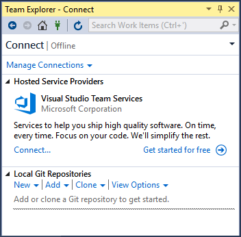

#  Visual Studio 2017 version 15.1 Release Notes
**Please Note:** This is not the latest version of Visual Studio 2017. To download the latest release, please visit the [current release notes](vs2017-relnotes.md) for Visual Studio 2017, or the [Downloads](https://www.visualstudio.com/downloads) page.

In this article, you will find information for the Visual Studio 2017 version 15.1 releases. 

### Feedback
We’d love to hear from you. You can report a problem via the [Report a Problem](https://docs.microsoft.com/en-us/visualstudio/ide/how-to-report-a-problem-with-visual-studio-2017) option in 
either the installer or the Visual Studio IDE itself. You will find the option in the upper right hand corner. You can track your feedback in the [Developer Community](https://developercommunity.visualstudio.com/index.html) portal. For suggestions,
let us know through the [UserVoice](https://visualstudio.uservoice.com/forums/121579-visual-studio) site.

****
## Release Date: April 17, 2017 - Visual Studio 2017 version 15.1 (26403.07)

### Issues Fixed in this Release
These are the customer-reported issues addressed in this version:

* [VS 2017 Professional install fails with "incorrect function" return code.](https://developercommunity.visualstudio.com/content/problem/40973/failed-to-install-vs-2017-pro.html)
* [Update to Windows 10 SDK will result in an issue with app packages for Windows Store creation.](https://developercommunity.visualstudio.com/content/problem/40376/error-file-csomepathbinarmreleaseapp-112180-scale.html)
* [When you add an app extension host declaration, it does not allow the designer to make further edits to manifest.](https://developercommunity.visualstudio.com/content/problem/35713/latest-visual-studio-2017-preview-cant-edit-the-uw.html)
* [Unable to Check-In Changes in VSTS.](https://developercommunity.visualstudio.com/content/problem/31130/cant-check-in-changes-in-vsts.html)
* [VS2017 crashes when you open XAML editor.](https://developercommunity.visualstudio.com/content/problem/41867/vs2017-crashes-when-opening-xaml-editor.html)
* [Windows iOS Simulator Crashes.](https://bugzilla.xamarin.com/show_bug.cgi?id=54672)

Other issues addressed in this version:
* When you install from an offline layout in an environment without internet access, you will not receive update notifications. This also applies when you use the offline layout to update to the newest version.

****

## Release Date: April 10, 2017 - Visual Studio 2017 version 15.1 (26403.03)

### Issues Fixed in this Release

These are the customer-reported issues addressed in this version:

* [Encoding is broken in Visual Studio Installer 15.1 (multiple languages)](https://developercommunity.visualstudio.com/content/problem/40175/encoding-is-broken-in-visual-studio-installer-151.html).
* [Links to open project in Visual Studio from VS Online do not work](https://developercommunity.visualstudio.com/content/problem/33120/links-to-open-project-in-visual-studio-from-vs-onl.html).
* [VS2017 hangs when you open a SLN Solution that contains multiple projects](https://developercommunity.visualstudio.com/content/problem/25281/vs-2017-hangs-when-opening-sln-solution-containing.html).
* [Visual Studio 2017 Update fails](https://developercommunity.visualstudio.com/content/problem/40193/visual-studio-2017-update-fails.html).

****

## Release Date: April 5, 2017 - Visual Studio version 15.1 (26403.00)

### Summary of Updates in this Release

* A New [Team Explorer Standalone Install](#te).
* [Tools for Universal Windows App Development](#UWP-1703) - Support for developing UWP apps for Windows 10 Creators Update version 1703.
* Sign up for, and sign in with a Microsoft account - now in one step through the first launch dialog.
* Addressed various installer reliability and accessibility issues.
* Improved [layout installer experience](https://docs.microsoft.com/en-us/visualstudio/install/use-command-line-parameters-to-install-visual-studio#lf-content=177574689:671110964). Installer now appropriately respects InstallRecommended and InstallOptional.

*****
### Issues Fixed in this Release

Learn more about customer-reported issues addressed in version 15.1.

### What's New in this Release

####  A New Team Explorer Standalone Install

Visual Studio Team Explorer 2017 is a rich, standalone client (Figure 1) used to access Team Foundation Server and Visual Studio Team Services. It is free for any user. This [install](https://www.visualstudio.com/thank-you-downloading-visual-studio/?sku=TeamExplorer&rel=15) only includes Team Explorer so you can access version control and work item tracking without other IDE components.
                                                                                                                                                            

*(Figure 1) Team Explorer*

####  Tools for Universal Windows App Development

The Universal Windows App workload now includes the Creators Update SDK (10.0.15063) and allows you to build apps for the Windows 10 Creators Update version 1703. 
In addition, the release includes these enhancements:
* The Windows 10 SDK will install side by side with the Creators Update SDK. This allows you to use a single machine to build production-ready apps that target the released version of the SDK, as well as begin testing new OS features delivered by a Preview Windows SDK.
* NuGet package management has been improved by using [PackageReference](https://docs.microsoft.com/nuget/consume-packages/package-references-in-project-files) to replace 
package.config and package.json.
* An enhanced .NET Native Compiler that is now delivered as a NuGet package.
* Visual Studio now includes improved tooling support for XAML controls delivered as NuGet packages.
* IntelliSense in the XAML editor now highlights XAML types and properties that are not supported in the version of the SDK that your app is targeting.  

For more information, see [Creators Update SDK support in Visual Studio 2017](https://blogs.msdn.microsoft.com/visualstudio/2017/03/16/visual-studio-2017-update-preview-and-windows-10-creators-update-sdk/).

****
## [Visit the Current Release Notes](vs2017-relnotes.md)
 See customer-reported issues fixed in Visual Studio 2017 version 15.3.
## [Visit the Visual Studio 2017 version 15.2 Release Notes](vs2017-relnotes-v15.2.md)
 See customer-reported issues fixed in Visual Studio 2017 version 15.2.
## [Visit the Visual Studio 2017 version 15.0 Release Notes](vs2017-relnotes-v15.0.md)
 See customer-reported issues fixed in Visual Studio 2017 version 15.0.

## [Known Issues](vs2017-knownissues.md)
See all existing [known issues](vs2017-knownissues.md) and available workarounds in Visual Studio 2017.

****

[Top of Page](#top)
