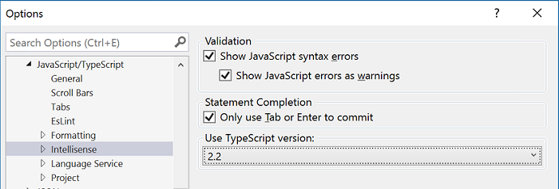

#  Visual Studio 2017 version 15.2 Release Notes 

In this article, you will find information regarding the newest releases for Visual Studio 2017 version 15.2. Click the button to download.

To learn more about Visual Studio 2017, see the [System Requirements](https://www.visualstudio.com/productinfo/vs2017-system-requirements-vs), [Platform Targeting and Compatibility](https://www.visualstudio.com/productinfo/vs2017-compatibility-vs), [Distributable Code](https://www.visualstudio.com/productinfo/2017-redistribution-vs), and [License Terms](https://www.visualstudio.com/license-terms/) pages.

### Feedback  
We’d love to hear from you. You can report a problem via the [Report a Problem](https://docs.microsoft.com/visualstudio/ide/how-to-report-a-problem-with-visual-studio-2017) option in 
either the installer or the Visual Studio IDE itself. You will find the option in the upper right hand corner. You can track your feedback in the [Developer Community](https://developercommunity.visualstudio.com/index.html) portal. For suggestions,
let us know through the [UserVoice](https://visualstudio.uservoice.com/forums/121579-visual-studio) site.

****

## Release Date: June 21, 2017 - Visual Studio 2017 version 15.2 (26430.14)

### Issues Fixed in this Release
These are the customer-reported issues addressed in this version:
* [New Project menu fails with error "Value cannot be null. Parameter name: eventId".](https://developercommunity.visualstudio.com/content/problem/67355/new-project-menu-fails-with-error-value-cannot-be.html)
* [VS2017 fails to start and immediately errors out with "Unknown Error" message.](https://developercommunity.visualstudio.com/content/problem/31263/vs2017-fails-to-start-with-unknown-error.html)
****

## Release Date: June 9, 2017 - Visual Studio 2017 version 15.2 (26430.13)

### Issues Fixed in this Release
These are the customer-reported issues addressed in this version:
* [Update to Visual Studio 2017 version 15.2 solution loading caused forced restart.](https://developercommunity.visualstudio.com/content/problem/63718/after-152-update-visual-studio-2017-crash-and-rest.html)
* [Visual Studio 2017 randomly restarts after 15.2 update.](https://developercommunity.visualstudio.com/content/problem/63443/visual-studio-2017-keeps-crashing-after-152-update.html)

****

## Release Date: May 30, 2017 - Visual Studio 2017 version 15.2 (26430.12)
### Issues Fixed in this Release
These are the customer-reported issues addressed in this version:
* [Compilation fails because proces cannot access dll (after VS2017 update 2 (v15.2)).](https://developercommunity.visualstudio.com/content/problem/54945/compilaion-fails-because-proces-cannot-access-dll.html)
* [Visual Studio 2017 version 15.2 freezes without network connection.](https://developercommunity.visualstudio.com/content/problem/55153/vs-2017-152-freezes-without-network-connection.html)
* [The Visual Studio 2017 version 15.2 update can cause incorrect versions of vcmeta.dll to be installed.](https://developercommunity.visualstudio.com/content/problem/54787/after-todays-update-of-vs17-ccx-projects-fail-to-c.html)
* [Added support for Service Fabric 5.6 release/2.6 SDK which enables using  ServicePackageActivationMode="ExlusiveProcess".](https://github.com/Azure/service-fabric-issues/issues/270)
* [R tools for Visual Studio 2017 won't install on Windows 7.](https://developercommunity.visualstudio.com/content/problem/58632/r-tools-for-visual-studio-2017-wont-install-on-win.html)

Additional fixes included in this release:
* Fixed a possible F# regression related to exception: "This stream does not support writing at System.IO.Compression.DeflateStream.BeginWrite".
* Fixed an issue where Xamarin iOS apps were not building correctly. 
* Fixed a performance degradation sometimes occurring in Xamarin Android apps. 
* Fix for trouble connecting to Android debugger.
* Fix for csproj losing multidex support when upgrading to 4.5.

****

## Release Date: May 12, 2017 - Visual Studio 2017 version 15.2 (26430.06)
### Issues Fixed in this Release
This is the customer-reported issue addressed in this version:
* The [v15.2 dark color theme](https://developercommunity.visualstudio.com/content/problem/54341/color-theme.html) fails to load after F# component in .NET workload is installed.

****

## Release Date: May 10, 2017 - Visual Studio 2017 version 15.2 (26430.04)

### Summary of Updates in this Release
* Maximize your productivity with the newly enhanced [Python development](#python) workload.
* Install the [Data Science and analytical applications](#datascience) workload for all of your data analysis needs.
* [ReSharper 2017.1](#Resharper) now works with solutions that are loaded in a lightweight mode.
* With [Xamarin 4.5](#xamarin), we have redesigned our Property pages and Manifest editors with a simplier, more user-friendly UI. 
* Install Unity 5.6 with the [Game Development with Unity workload](#Unity) to develop games and interactive content. 
* You can now use multiple side-by-side versions of the [TypeScript compiler](#typescript).
* Multiple [F# tools](#fsharp) improvements.
* [Linux C++](#LinuxC++) now enables improved type visualization during debugging.
* [CMake integration](#CMake 3.7.2) now supports CMake 3.7.2. 
* You now have the ability to configure the [Diagnostic Tools window](#long-run-debug) to automatically stop operation when limits are exceeded.
* You can now [change the location of where packages are cached](#nocache) or even disable caching of packages during install, modify, or repair.
* Your Visual Studio Installer will now only display [Visual Studio offerings](#vsofferings) based on your current configuration.

### Top Issues Fixed in this Release

The Developer Community spoke and we listened. This list provides the issues that received your highest votes and were fixed in this release.

&nbsp;&nbsp; [Bring back the solutions list in Team Explorer.](https://developercommunity.visualstudio.com/content/problem/34779/bring-back-showing-solutions-file-in-team-explorer.html)  
&nbsp;&nbsp; [GUIDGen.exe is not a valid executable.](https://developercommunity.visualstudio.com/content/problem/25084/create-guid-not-working.html)  
&nbsp;&nbsp; [“Scanning new and updated MEF components" runs every time Visual Studio 2017 launches.](https://developercommunity.visualstudio.com/content/problem/31028/scanning-new-and-updated-mef-components-every-time.html)  
&nbsp;&nbsp; [Visual Studio hangs when downloading the latest versions of TFS folders.](https://developercommunity.visualstudio.com/content/problem/24506/tfs-folder-download-cause-vs-not-responding.html)  
&nbsp;&nbsp; [Node.js server-side JavaScript process consumes too much memory.](https://developercommunity.visualstudio.com/content/problem/27033/nodejs-server-side-javascript-process-consuming-to.html)  
&nbsp;&nbsp; ["A restart is required" message continues to display after rebooting.](https://developercommunity.visualstudio.com/content/problem/24958/always-want-me-restart-for-n-times-???????????n??.html)  
&nbsp;&nbsp; [How to find installed instances of Visual Studio.](https://developercommunity.visualstudio.com/content/problem/35325/missing-vs150comntools.html)  

   Learn more about customer-reported issues addressed in version 15.2.

****

### What's New in this Release

####  Python Development Workload

We have enhanced the Python development workload in Visual Studio to maximize your productivity in Python. We offer improved IntelliSense, web development projects, Git, and VSTS integration to save you time and effort on everyday tasks. Use world class debugging (local, remote, cross-platform, and Python/native) and profiling tools to improve the quality and performance of your Python code.

Visit our [Python information page](https://www.visualstudio.com/vs/python) for full details and documentation.

####  Data Science and Analytical Applications Workload

With one click you can install the Data Science and analytical applications workload for all of your data analysis needs. We've included support for Python, R, F#, and their respective packages/distros to enable acquisition, analysis, and visualization of data all the way through to building and deploying machine learning models.

Visit our [Python information page](https://www.visualstudio.com/vs/python) and [R Tools information page](https://www.visualstudio.com/vs/rtvs) for full details and documentation.

####  ReSharper Ultimate 2017.1

Resharper now works with solutions that are loaded in a lightweight mode, right from Visual Studio 2017. For more information and a video on how this works, see the [JetBrains blog](https://blog.jetbrains.com/dotnet/2017/04/03/meet-resharper-ultimate-2017-1) post.

####  Property Pages and Manifests Redesign

We've reorganized and simplified the Property Pages in Xamarin 4.5 and split the Manifest editors. You can keep editing csproj options from the Property Pages, and manifest options from the manifest editor. We have simplified and reorganized our Property Page to support high-DPI displays.

Visit the [Xamarin release notes](https://developer.xamarin.com/releases/vs/xamarin.vs_4/xamarin.vs_4.5/) for full details.

####  Visual Studio Tools for Unity

With the Game Development with Unity workload you can now install Unity 5.6 to build multiplatform 2D and 3D games and interactive content. Visit the [Visual Studio Tools for Unity](https://www.visualstudio.com/vs/unity-tools/) page for more information about how you can turn Visual Studio into a Unity development environment.

####  TypeScript Side-by-Side Support

You can now use multiple versions of the TypeScript compiler in Visual Studio 2017. During installation, TypeScript 2.2 will be automatically included with the Web, Node.js, Universal Windows, or Mobile JavaScript workloads. TypeScript 2.1 can also be selected from the 'Individual Components' installer page.

The version of TypeScript used by IntelliSense and by the build will be the latest installed. You can change the version used by IntelliSense, by using the setting shown in (Figure 1). To change the TypeScript version used for building a project, set the MSBuild property `<TypeScriptToolsVersions>` in the project file. For more information on MSBuild properties, see the [TypeScript Handbook](https://www.typescriptlang.org/docs/handbook/compiler-options-in-msbuild.html).

*(Figure 1) TypeScript Version Selection*

####  Linux C++ Improvements
We've made improvements to the Linux C++ workload to support debugger type visualization for both natvis and Python pretty printing. You can now use Linux C++ projects with Shared Items projects for cross-platform code sharing.  For more information, see the [Visual C++ Team blog](https://aka.ms/tjrucr) post. 

####  CMake Integration
The updated CMake menu is based on your feedback. For more information see the [CMake 3.7.2](https://cmake.org/cmake/help/v3.7/release/3.7.html) release page.

####  Diagnostic Tools Window
Long running debugger sessions were using a lot of memory or disk space. The Diagnostic Tools window will now automatically stop operation when limits are exceeded. You can configure the limits by selecting the Settings command from the menu in the Diagnostic Tools window.
This new feature is available due to feedback from customers that ran their debugger overnight. The Diagnostic Tools window shuts down, however, the debugger itself (breakpoints, callstack, etc) is not affected.

####  Moving or Disabling the Installer Package Cache

When you install Visual Studio 2017 [by using the command line](https://docs.microsoft.com/visualstudio/install/use-command-line-parameters-to-install-visual-studio),
you can pass `--cache` to enable the caching policy (default) for the install and subsequent install, modify, and repair operations; or you can pass `--nocache` to disable the policy
which will prevent packages from being cached and remove any packages already cached for the current instance.

You can now change the policy through the registry and group policy. See [our setup blog](https://aka.ms/setup/nocache) for more information.

####  F\# Tools Improvements

* Basic autocomplete support.
* Ability to Go to Definition when clicking in the tooltip.
* Mutable values colorized, and other semantic colorization improvements.
* Project system performance improvements.
* Large performance improvements all-up.
* Move Up/Move Down on Solution folder nodes.
* Intelligent ordering in Completion lists.

####  The Visual Studio Installer will Display Visual Studio Offerings Based on your Current Configuration
For example:
* If you have Visual Studio 2017 Enterprise installed on your machine, you will only see Enterprise offerings.
* If you have Visual Studio 2017 Professional, you will see both Professional and Enterprise offerings. 
* If you have Visual Studio 2017 Community, you will see Community, Professional, and Enterprise offerings.

****
## [Visit the Current Release Notes](vs2017-relnotes.md)
 See customer-reported issues fixed in Visual Studio 2017 version 15.3.

## [Visit the Visual Studio 2017 version 15.1 Release Notes](vs2017-relnotes-v15.1.md)
 See customer-reported issues fixed in Visual Studio 2017 version 15.1.

## [Visit the Visual Studio 2017 version 15.0 Release Notes](vs2017-relnotes-v15.0.md)
 See customer-reported issues fixed in Visual Studio 2017 version 15.0.

### [Known Issues](vs2017-knownissues.md)
See all existing [known issues](vs2017-knownissues.md) and available workarounds in Visual Studio 2017.

[Top of Page](#top)
