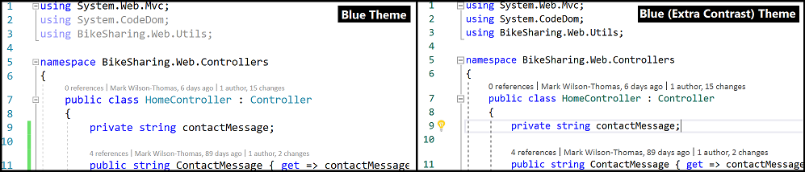
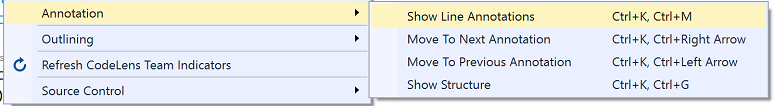
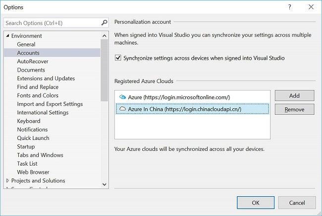
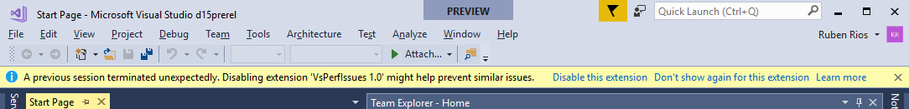
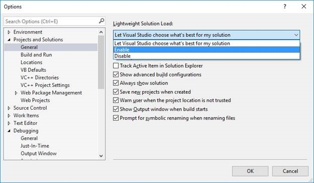
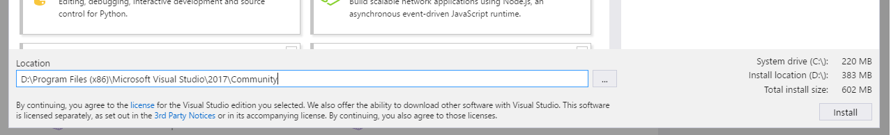
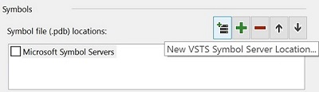
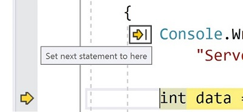

---
title: Visual Studio 2017 15.3 Release Notes
description: Visual Studio 2017 Release Notes
keywords: visualstudio> [!IMPORTANT]
author: reshmim
ms.author: reshmim
manager: sacalla
ms.date: 09/12/2017
ms.topic: release-article, localize
ms.prod: vs-devops-alm
ms.technology: vs-devops-articles
ms.assetid: 550353ed-3edc-4e9e-989e-1a01df0fe259
---

# <a id="top"> </a> Visual Studio 2017 version 15.3 Release Notes

****

<a href="https://developercommunity.visualstudio.com/topics/visual+studio+2017.html?sort=newest&topics=visual studio 2017" target="blank">Developer Community</a> |
<a href="https://www.visualstudio.com/productinfo/vs2017-system-requirements-vs" target="blank">System Requirements</a> |
<a href="https://www.visualstudio.com/productinfo/vs2017-compatibility-vs" target="blank">Compatibility</a> |
<a href="https://www.visualstudio.com/productinfo/2017-redistribution-vs" target="blank">Distributable Code</a> |
<a href="https://www.visualstudio.com/license-terms" target="blank">License Terms</a> |
<a href="https://blogs.msdn.microsoft.com/developer-tools" target="blank">Blogs</a> |
<a href="https://developercommunity.visualstudio.com/topics/Known+issue-in%3A+Visual+Studio+2017+version+15.3.html" target="blank">Known Issues</a>

****

This article contains information about the newest release for Visual Studio 2017 version 15.3. Click the button to download the latest version.

<a href="https://www.visualstudio.com/downloads"></a> **For more information, refer to our [installation](https://docs.microsoft.com/visualstudio/install/install-visual-studio) and [offline installation](https://docs.microsoft.com/en-us/visualstudio/ide/create-an-offline-installation-of-visual-studio) documents.**

### <a id="Feedback"></a> Feedback  
We’d love to hear from you! You can report a problem from the [Report a Problem](https://docs.microsoft.com/visualstudio/ide/how-to-report-a-problem-with-visual-studio-2017) option in
either the installer or the Visual Studio IDE itself. The  icon is located in the upper right hand corner. You can track your feedback in the [Developer Community](https://developercommunity.visualstudio.com/index.html) portal. For suggestions,
let us know through the [UserVoice](https://visualstudio.uservoice.com/forums/121579-visual-studio) site.

### Release History
* [August 14, 2017](#15.3) Visual Studio 2017 version 15.3 
* [May 10, 2017](vs2017-relnotes-v15.2.md) Visual Studio 2017 version 15.2
* [April 5, 2017](vs2017-relnotes-v15.1.md) Visual Studio 2017 version 15.1
* [March 31, 2017](vs2017-relnotes-v15.0.md) Visual Studio 2017 version 15.0

You can learn more about how we ship our releases in the [Visual Studio 2017 Release Rhythm] (https://www.visualstudio.com/productinfo/vs2017-release-rhythm) document.

<hr style="border:1px solid Silver">


## <a id="15.3.5"></a>Release Date: September 19, 2017 - Visual Studio 2017 version 15.3.5

### Issues Fixed in September 19, 2017 Release
These are the customer-reported issues addressed in this version:
* Introduced support for Apple's Xcode 9, iOS 11, tvOS 11 and watchOS 4

<hr style="border:1px solid Silver">

## <a id="15.3.4"></a>Release Date: September 12, 2017 - Visual Studio 2017 version 15.3.4

### Issues Fixed in September 12, 2017 Release
These are the customer-reported issues addressed in this version:
* ["TF30063: You are not authorized to access .visualstudio.com\" after upgrading to VS2017 15.3](https://developercommunity.visualstudio.com/content/problem/93366/tf30063-you-are-not-authorized-to-access-visualstu.html)
* [Error installing GitHub extension](https://developercommunity.visualstudio.com/content/problem/102178/error-installing-github-extension.html)

<hr style="border:1px solid Silver">

## <a id="15.3.3"></a>Release Date: August 29, 2017 - Visual Studio 2017 version 15.3.3

### Issues Fixed in August 29, 2017 Release
These are the customer-reported issues addressed in this version:
* [VS 15.3 update causes "Package is not compatible" for frameworks in project.json imports.](https://developercommunity.visualstudio.com/content/problem/96301/vs-153-update-causes-package-is-not-compatible-for.html)
* [Debugger missing UI icons when browsing variables.](https://developercommunity.visualstudio.com/content/problem/96914/debuger-icons-missing.html)

****

## <a id="15.3.2"></a>Release Date: August 22, 2017 - Visual Studio 2017 version 15.3.2
### Issues Fixed in August 22, 2017 Release
These are the customer-reported issues addressed in this version:

* [Visual Studio crashes when you open a solution with a test project.](https://developercommunity.visualstudio.com/content/problem/94099/visual-studio-crashes-on-solution-load.html)
* [Visual Studio Freezes in Debug with Chrome.](https://developercommunity.visualstudio.com/content/problem/39945/visual-studio-freezes-in-debug-with-chrome.html)
* [Failure to install **HelpViewer**.](https://developercommunity.visualstudio.com/content/problem/94591/the-color-theme-of-microsoft-help-viewer-23-is-alw-1.html?childToView=96265)
* [UI delay while typing R code.](https://developercommunity.visualstudio.com/content/problem/97495/vs2017-very-slow-editing-entering-code.html)
* [C# 7.0 Regression in Tuples.](https://github.com/dotnet/roslyn/issues/21028)
* [Xamarin - Dynamic Type Platform not supported exception.](https://bugzilla.xamarin.com/show_bug.cgi?id=58625)
* [Xamarin – Dynamic object is not supported.](https://bugzilla.xamarin.com/show_bug.cgi?id=58625)
* [Xamarin - Xamarin.iOS: ArgumentNullException for `instruction` parameter in Mono.Linker's `MarkException()` method.](https://bugzilla.xamarin.com/show_bug.cgi?id=58834)

Additional fixes included in this release:
* Service Fabric tooling update.
* Visual Studio upgrade fails with AccessDenied failure during VSIX install / uninstall.
* Project generation issue on Unity version <= 5.5.
* Dump capture for linked files.
* Silent bad codegen due to loop optimization.

<hr style="border:1px solid Silver">

## <a id="15.3.1"></a>Release Date: August 18, 2017 - Visual Studio 2017 version 15.3.1
### Issues Fixed in this Release
These are the customer-reported issues addressed in this version:
* [Update Git version to address security fix.](https://blogs.msdn.microsoft.com/devops/2017/08/15/git-vulnerability-with-submodules/)
* [**Add Watch** displays the wrong line of code.](https://developercommunity.visualstudio.com/content/problem/49728/add-watch-displaying-the-wrong-line-of-code.html)
* [F# Editor loses focus when typing `arrow`, `backspace`, or `newline` keys.](https://developercommunity.visualstudio.com/content/problem/92832/using-f-tools-enter-backspace-and-arrow-keys-will.html)
* [R Tools missing translations.](https://developercommunity.visualstudio.com/content/problem/95381/r-tools-has-english-strings-even-with-a-language-p.html)

<hr style="border:1px solid Silver">

## <a id="15.3"></a>Release Date: August 14, 2017 - Visual Studio 2017 version 15.3

## Summary: What's New in this Release
* [Accessibility Improvements](#Accessibility) make Visual Studio more accessible than ever.
* [Azure Function Tools](#azfunctions) are included in the Azure development workload. You can develop Azure Function applications locally and publish directly to Azure.
* You can now build applications in Visual Studio 2017 that run on [Azure Stack](#azstack) and government clouds, like Azure in China.
* We improved [.NET Core development](#dotnetcoreimprovements15P3) support for .NET Core 2.0, and Windows Nano Server containers.
* In [Visual Studio IDE](#IDEimprovements15), we improved Sign In and Identity, the start page, Lightweight Solution Load, and setup CLI. We also improved refactoring, code generation and Quick Actions.
* The [Visual Studio Editor](#VSEditor153) has better accessibility due to the new ‘Blue (Extra Contrast)’ theme and improved screen reader support.
* We improved the [Debugger and diagnostics](#Debugging) experience. This includes Point and Click to Set Next Statement. We've also refreshed all nested values in variable window, and made Open Folder debugging improvements.
* [Xamarin](#xamarin) has a new standalone editor for editing app entitlements.
* The [Open Folder and CMake Tooling](#cmake) experience is updated. You can now use CMake 3.8.
* We made improvements to the IntelliSense engine, and to the project and the code wizards for [C++ Language Services.](#C++LanguageServices)
* [Visual C++ Toolset](#C++ToolsetLibs15) supports command-prompt initialization targeting.
* We added the ability to use [C# 7.1 Language](#cs71) features.
* You can install [TypeScript](#typescript) versions independent of Visual Studio updates.
* We added support for [Node 8 debugging](#Node.js).
* [NuGet](#NuGetimprovements15P3) has added support for new TFMs (netcoreapp2.0, netstandard2.0, Tizen), Semantic Versioning 2.0.0, and MSBuild integration of NuGet warnings and errors.
* Visual Studio now offers [.NET Framework 4.7](#dotnet47) development tools to supported platforms with 4.7 runtime included.
* We added clusters of related events to the search query results in the [Application Insights](#appInsights) Search tool.
* We improved syntax support for SQL Server 2016 in [Redgate](#redgate) SQL Search.
* We enabled support for [Microsoft Graph APIs](#MSGraph) in Connected Services.


<hr style="border:1px solid Silver"> 

## Top Issues Fixed in this Release
The Developer Community spoke and we listened. This list provides the 10 highest voted issues fixed in this release.  
&nbsp;&nbsp; [Dark theme fails to load after F# install.](https://developercommunity.visualstudio.com/content/problem/47876/dark-theme-broke-over-the-weekend-unusable.html)  
&nbsp;&nbsp; [Visual Studio installer update causes endless loop.](https://developercommunity.visualstudio.com/content/problem/30271/please-update-visual-studio-installer-endless-loop.html)  
&nbsp;&nbsp; [List of recent projects not displayed correctly.](https://developercommunity.visualstudio.com/content/problem/45470/list-of-recent-projects-does-not-reflect-reality.html)  
&nbsp;&nbsp; [Cannot add a name to a new Custom Profile.](https://developercommunity.visualstudio.com/content/problem/27313/vs2017-cant-name-or-rename-a-new-custom-publish-pr.html)  
&nbsp;&nbsp; [Moving DSL extension from Visual Studio 2015 to Visual Studio 2017 gives runtime error.](https://developercommunity.visualstudio.com/content/problem/34692/microsoftvisualstudiomodelingsdkintegrationshell-r.html)  
&nbsp;&nbsp; [Try...catch block throws 'TextBuffer edit operation while another edit is in progress' error message.](https://developercommunity.visualstudio.com/content/problem/8198/attempted-textbuffer-edit-operation-while-another.html)  
&nbsp;&nbsp; [Visual Studio self-signed certificate not accepted in Chrome 58.](https://developercommunity.visualstudio.com/content/problem/48596/visual-studio-self-signed-certificate-not-working.html)  
&nbsp;&nbsp; [Publish fails with 'All build submissions in a build must use project instances originating from the same project collection'.](https://developercommunity.visualstudio.com/content/problem/36498/publish-fails-with-all-build-submissions-in-a-buil.html)  
&nbsp;&nbsp; ['Scanning new and updated MEF componets' runs every time Visual Studio 2017 is launched and slows startup time.](https://developercommunity.visualstudio.com/content/problem/31028/scanning-new-and-updated-mef-components-every-time.html)  
&nbsp;&nbsp; [Page loads are slow when debugging Visual Studio 2017 locally.](https://developercommunity.visualstudio.com/content/problem/26064/slow-debug-in-vs-2017.html)  

<a href="https://developercommunity.visualstudio.com/topics/Fixed-in%3A+Visual+Studio+2017+Version+15.3.html"></a> Learn more about customer-reported issues addressed in [Visual Studio 2017 version 15.3](https://developercommunity.visualstudio.com/topics/Fixed-in%3A+Visual+Studio+2017+Version+15.3.html).

<hr style="border:1px solid Silver"> 

## Details: What's New in this Release
### <a id="Accessibility"> </a> Accessibility
We addressed over 1,700 accessibility issues in this release and made Visual Studio more accessible than ever.
You have access to the new “Blue (Extra Contrast)” theme *(Figure 1)*. This theme offers you more contrast than the regular "Blue" theme if you don't want or need the full High Contrast mode.

 
<center>*(Figure 1) Blue (Extra Contrast) theme*</center>

With Visual Studio Editor, you can discover and navigate between text adornments via the new "Show Line Annotations" command set. You can find the new feature on the **Editor context menu** *(Figure 2)*.  See the [Visual Studio Editor](#VSEditor153) section for more information.

 
<center>*(Figure 2) Show Line Annotations*</center>

For more accessibility news, visit the [Accessibility improvements in Visual Studio 2017 version 15.3](https://blogs.msdn.microsoft.com/visualstudio/2017/08/14/accessibility-improvements-in-visual-studio-2017-version-15-3/) blog post.

****
### <a id="azstack"</a> Azure Stack and Azure Government Clouds
Use all the same tools in Visual Studio &#8212; like Cloud Explorer, Connected Services and ASP.NET Publish &#8212; to connect Azure Stack and government clouds. Pick an existing government cloud, like Azure in China *(Figure 3)*, or enter the  discovery endpoint for your organization’s Azure Stack.

 
<center>*(Figure 3) Azure Stack*</center>

### <a id="azfunctions"></a> Azure Function Tools
* Tools for developing C# Azure Functions are included as part of the “Azure development” workload.
* You can develop Azure functions by using pre-compiled C# class libraries, and attributes to specify triggers.
* You can build, run, and debug on your local development machine.
* You can publish directly to Azure from Visual Studio.

For more details, see the [Visual Studio 2017 Tools for Azure Functions](https://blogs.msdn.microsoft.com/webdev/2017/05/10/azure-function-tools-for-visual-studio-2017/) blog post.

****

### <a id="dotnetcoreimprovements15P3"> </a> .NET Core and ASP.NET Core
* You can install .NET Core 2.0 SDK via a separate download to enable .NET Core 2.0 development in Visual Studio 2017 version 15.3. Visual Studio now provides side-by-side support of multiple .NET Core SDKs. You can experiment with the latest daily build of the .NET Core SDK while you develop with the latest public release of the SDK. See [.NET blog](https://go.microsoft.com/fwlink/?linkid=853702) for details.
* With Visual Basic support, you now have the ability to create .NET Core console applications, and .NET Core, and .NET Standard class libraries in Visual Basic.
* .NET Framework and .NET Standard/Core interop allows you to refer to .NET Core/.NET Standard libraries from .NET Framework projects and vice versa. No need to manually add interop NuGet packages – Visual Studio does this for you automatically.
* Multiple target framework support enhancement allows you to build your project for multiple target frameworks (TFM), and use the TFM picker in **Debug/Run** to pick the TFM to run.
* We added Windows Nano Server image support for containerizing ASP.NET Core apps as Windows Nano Server images. You can now select Windows Nano Server as the container platform. You can do this under **File->New Project** for ASP.NET Core projects. For your existing projects, it can be added using the **Project Context Menu**.
* Local IIS support: You can now develop and debug using IIS from Visual Studio.
* ASP.NET Core on .NET Framework – When you create an ASP.NET Core project targeting the full .NET Framework (Windows only), you will use the dropdown on the One ASP.NET dialog.
* The Live Unit Testing feature can be enabled for your .NET Standard, .NET Core, and ASP.NET Core projects.

#### Service Fabric Tools
This release provides a new stateful ASP.NET Core project template, support for both 2.5 and 2.6 SDK's (and corresponding runtimes) of Service Fabric, as well as several bug fixes.

#### Continuous Delivery Tools
We moved these features from the CD4VS (Microsoft Continuous Delivery Tools for Visual Studio) extension into Visual Studio:
* Configure continuous delivery for solutions that contain ASP.NET projects targeting an Azure App Service.
* Configure continuous delivery for solutions that contain ASP.NET Core projects targeting an Azure App Service.

****

### <a id="IDEimprovements15"> </a> Visual Studio IDE
* We added the **Keyboard Accessibility menu** command under the **"Help" menu**. This provides you with a shortcut to online documention about Accessibility Tips and Tricks.
* The diagnostic system informs you via the **InfoBar** about extensions that might have been involved in an unexpected termination of Visual Studio *(Figure 4)*. The **InfoBar** provides this information about the termination and asks if you would like to disable the suspected extension.

 
<center>*(Figure 4) InfoBar notification*</center>

* In open folder scenarios, you can select your desired debugger via dedicated UI.
* We’ve stopped sharing certain settings, like tool window layout, between different side-by-side installations of Visual Studio 2017. For more information, see the [Synchronize your settings in Visual Studio](https://docs.microsoft.com/en-us/visualstudio/ide/synchronized-settings-in-visual-studio#side-by-side-synchronized-settings) documentation.
* We fixed the "hidden window" bug that made Visual Studio appear to hang before its main window appeared.
* We increased the clickable target area to make it easier to dismiss notification tips.

#### .NET IDE

* We added several new refactorings and quick fixes, like "Resolve merge conflicts", "Add null checks", "Add parameter", and many more. Take a look at our [Refactoring, Code Generation and Quick Actions in Visual Studio](https://docs.microsoft.com/visualstudio/ide/refactoring-code-generation-quick-actions) page to see the full list.
* We suggest variable names in IntelliSense to help you name your variables quickly, for example, ```Person person```.
* **Edit and Continue** supports C# 7.0 features (except local functions).
* We added support for file globbing outside of your project folder for .NET Core.

#### Sign In and Identity
We fixed the **account picker control** so "Re-enter credentials" works more reliably. In some cases, the account picker would clear accounts upon re-entering credentials.

#### Start Page
We increased the clickable target area on Start Page MRU “pins”. It's easier to pin items you care about to the top of the MRU.

#### Lightweight Solution Load
* We increased build speed and stability.
* We reduced the number of loaded projects.
* We added a new option *(Figure 5)* that allows Visual Studio to decide what’s best for your solution.


<center>*(Figure 5) Lightweight Solution Load Options*</center>

* We added file search results solutions to search for deferred projects, instead of just loaded projects.  
  * When you load a project, all existing searches are refreshed to add progression results.
  * There are limits to this:
    * Search does not extend within the file and does not include progressive results, i.e. classes, methods, etc.
    * Files that belong to a project are shown as a flat list. When files belong to a folder, the relative path is shown instead of just the file name.
    * There are no context menus for the file items in the search view.
* **GoTo All** and **GoTo Files** show content from external items in the workspace.
* We improved Batch build in projects that use Lightweight Solution Load.

#### Setup
* Visual Studio Installer now supports high-DPI scaling at levels less than 150%.
* The `vswhere.exe` executable file has been updated to exclude preview instances by default, and includes them when `--prerelease` is included on the command line.
* CLI is able to handle `--verify`, `--fix` and `--clean`.
   * `--verify` verifies layout and informs you of missing and invalid payloads.
   * `--fix` verifies the layout and re-downloads packages that are either missing or invalid.
   * `--clean` deletes obsolete packages and allows you to trim layout to a specific version range.
* We added details that show the net size impact per drive to the installation details page. *(Figure 6)*.


<center>*(Figure 6) Drive Sizes listed in the Installer*</center>

****

### <a id="VSEditor153"> </a> Visual Studio Editor
* Manual scroll and selection are no longer difficult when a large numbers of errors are being added.
* We added a new variant of the "Blue" theme, which caters specifically to users who need more contrast in the Visual Studio Editor. This theme offers you more contrast than the regular "Blue" theme if you don't want or need the full High Contrast mode. You can try it out via **Tools -> Options -> Environment -> General**.
* If you use a screen-reader, you can now navigate between adornments by using the new **"Show Line Annotations"** command.
  * To activate, select "Show Line Annotations" (`Ctrl+K`, `Ctrl+M`) on the **Editor context menu**. A popup will appear in the editor describing the adornments on that line.
  * Navigate through multiple annotations on the line using `Ctrl+K`, `Ctrl+ Right/Left Arrow`.
  * You can also easily find context in code through the "Show Structure" command `Ctrl+K`, `Ctrl+G`. This shows the structural context of the line of code in the popup where the caret is located, and can be read by the screen reader.

****
### <a id="Debugging"> </a>Debugging and Diagnostics
#### Debugger Support for Visual Studio Team Services Symbol Servers
* You can query and download symbols *(Figure 7)* from Visual Studio Team Services Symbol Servers. You can select and add Visual Studio Team Services symbol paths to your Visual Studio environment using the **Tools->Options->Debugger->Symbols** page. To set up a Visual Studio Team Services Symbol Server, see the [Use Symbol Server in Team Services](https://go.microsoft.com/fwlink/?linkid=846265) page.  


<center>*(Figure 7) Add VSTS Symbol Server*</center>
* The [SetThreadDescription API](https://msdn.microsoft.com/library/windows/desktop/mt774976.aspx) is supported while debugging when you use Start Debugging (`F5`) or Attach to Process (`Ctrl+Alt+P`). The thread names that are set via this API now show up in the Threads window and in the Thread dropdown in the Debug Location toolbar. This is not currently supported while [dump debugging.](https://msdn.microsoft.com/library/d5zhxt22.aspx)
* The Output Window now shows you the console output of an application running inside a Windows Container while debugging.
* We added new support for debugging .NET Core apps you run inside Windows Containers based on Windows Nano Server.

#### Point and Click to Set Next Statement
You can hold down the `Ctrl` key while stopped at a breakpoint when debugging. The `Run to Click` (Run execution to here) icon next to your line of code changes to “Set Next Statement” functionality *(Figure 8)*. Click the icon to move the yellow instruction pointer to that line and set the next statement for the debugger to execute.


<center>*(Figure 8) Click to set Next Statement*</center>

#### Source Link Support for Windows PDB File Format
Source Link is now supported for Windows PDB file format (in addition to Portable PDBs). Compilers that support it can put the necessary information in the Windows PDB file format and the debugger can retrieve source files based on that information.

#### Open Folder Debugging
We have made your debugging experience easier when you use our new templates for Open Folder. If you have the core debugger installed, our new templates allow you to choose the type of debugger you want to use. Managed, Native, or Mixed can be chosen from the "Select a Debugger" dialog in the "Debug and Launch Settings" menu option in Solution Explorer. If you have a C++ MDD experience installed (Android C++, Linux Debugging, etc.), you now see options for [MinGW and Cygwin](https://blogs.msdn.microsoft.com/vcblog/2017/07/19/using-mingw-and-cygwin-with-visual-cpp-and-open-folder) support by using GDB for attach and launch within the same menu option.

#### Refresh All Nested Values in Variable Windows
When you click the refresh button for the parent node of a variable or expression in the Watch, Autos, and Locals windows, all visible variables and expressions that are children of that node also refresh and re-evaluate. You no longer need to click on the refresh button for each of the children.

#### Live Unit Testing Support for .NET Core
You can enable the Live Unit Testing feature for .NET Standard, .NET Core, and ASP.NET Core projects.

****

### <a id="xamarin"> </a> Xamarin
* Property Pages & App Manifest Redesigns - We have continued our work on making property pages for iOS and Android projects easier to use.
* New Entitlements Editor - We added a standalone editor for editing app entitlements.

For a complete overview of changes, be sure to check out [developer.xamarin.com](https://developer.xamarin.com/releases/vs/xamarin.vs_4/xamarin.vs_4.6/) for more details.

****

### Open Folder and <a id="cmake"> </a> CMake Tools
* We improved stability for toggling between folder and solution.
* Open folder extenders can add a source control icon to your folders. This allows you to quickly see the source control state of your files in Solution Explorer, which is currently implemented by SVN.
* The CMake experience in Visual Studio is upgraded to [CMake 3.8](https://blogs.msdn.microsoft.com/vcblog/2017/06/14/cmake-support-in-visual-studio-whats-new-in-2017-15-3-preview-2/).
* We improved editing, building, and debugging support in "Open Folder" for C++ projects that use [MinGW or Cygwin](https://blogs.msdn.microsoft.com/vcblog/2017/07/19/using-mingw-and-cygwin-with-visual-cpp-and-open-folder).
* We added support to define global and configuration-specific environment variables in "CppProperties.json" and "CMakeSettings.json". These environment variables can be consumed by debug configurations defined in "launch.vs.json" and tasks in "tasks.vs.json".
* We enhanced CMake tools for Visual Studio to provide you with support for [CTest integration](https://blogs.msdn.microsoft.com/vcblog/2017/05/10/cmake-support-in-visual-studio-whats-new-in-2017-15-3-update).
* You can now use the [CMake's Ninja generator](https://blogs.msdn.microsoft.com/vcblog/2017/06/14/cmake-support-in-visual-studio-whats-new-in-2017-15-3-preview-2/) to easily target 64-bit platforms, build, debug, and edit with IntelliSense.

****

### <a id="C++LanguageServices"> </a> C++ Language Services
The “Enable Faster Project Load” option under Experimental options has been renamed “Enable Project Caching” and moved under VC++ Project Settings. The old property value is not propagated to the new option.

#### IntelliSense Engine
  * C++ IntelliSense supports new C++17 features matching the batch compiler release.
  * Added context menu option in C++ editor to **Rescan File**, which can be used if IntelliSense is not working correctly.
  * Reduced CPU usage when running Find All References or Call Hierarchy for C++ code.
  * We've improved the overall C++ IntelliSense engine experience.

#### Project and Code Wizard
  * We have rewritten several project and code wizards in the signature dialogue style.
  * Add Class launches the Add Class wizard directly. All of the other items that were previously here are available under "Add > New Item".
  * Win32 projects are under the Windows Desktop category in the New Project dialog.
  * The Windows Console and Desktop Application templates now create the projects without displaying a wizard. There's a new Windows Desktop Wizard under the same category that displays the same options as before.


****

### <a id="C++ToolsetLibs15"></a> Visual C++ Toolset and Libraries
* The Developer Command Prompt for Visual Studio (and the Visual C++ Command Prompt) have added support for initializing a command-prompt environment targeting the Visual C++ 2015 Toolset (v140) via the `-vcvars_ver=14.0` argument.
* Visual C++ Redist file directories have been renamed to Microsoft.VC141.* to match versioning with the toolset (14.1x). In Visual Studio 2017 RTM, these directories were incorrectly named Microsoft.VC150.*.
* Visual C++ File Version and Directories (Visual Studio 2017 15.3) :
    * VC++ Toolset File Version : 14.11.25506.0 or 19.11.25506.0
    * VC++ Tools Directory      : VC\Tools\MSVC\14.11.25503  (directory location was locked in a Preview release)
    * VC++ Redist Directory [a] : VC\Redist\MSVC\14.11.25325 (All runtimes except for MFC and OneCore)
    * VC++ Redist Directory [b] : VC\Redist\MSVC\14.11.25415 (MFC and OneCore runtimes)

***

### <a id="cs71"></a> C# 7.1 Language Support
* You can now use C# 7.1 language features.
* C# 7.1 adds support for [async Main methods](https://github.com/dotnet/csharplang/blob/master/proposals/async-main.md), [pattern-matching with generics](https://github.com/dotnet/csharplang/blob/master/proposals/generics-pattern-match.md), [“default” literals](https://github.com/dotnet/csharplang/blob/master/proposals/target-typed-default.md), and [inferred tuple names](https://github.com/dotnet/csharplang/blob/master/proposals/csharp-7.1/infer-tuple-names.md).
* When you use C# 7.1 features in your project, lightbulb offers to upgrade your project’s language version, to “C# 7.1” or “latest”.
* See the [C# language feature status](https://github.com/dotnet/roslyn/blob/master/docs/Language%20Feature%20Status.md) page for complete details.

****

### <a id="typescript"></a> JavaScript & TypeScript
* We switched from 64-bit node to 32 bit-node when launching tsserver and cut language service memory consumption in half.
* File path IntelliSense in import statements is now faster.
* TypeScript versions can be installed independent of Visual Studio updates and selected on a per project basis. For more information see the [Updating TypeScript in Visual Studio 2017](https://github.com/Microsoft/TypeScript/wiki/Updating-TypeScript-in-Visual-Studio-2017) documentation.

****

### <a id="Node.js"></a> Node.js
* We added support for Node 8 debugging.
* We made unit test runner performance enhancements.
* We simplified the npm package installer UI.

****

### <a id="NuGetimprovements15P3"> </a> NuGet
* We have added support for the following TFMs - `netcoreapp2.0`, `netstandard2.0`, and `Tizen`.
* We have integrated NuGet warnings and errors with MSBuild so you can use existing MSBuild properties to suppress certain warnings or elevate them to errors.
* We have added support for Semantic Versioning 2.0.0.

You can find more details about these improvements and the complete list of bug fixes in the [NuGet release notes](https://go.microsoft.com/fwlink/?linkid=854734).

****

### <a id="dotnet47"> </a> .NET Framework 4.7
Visual Studio 2017 version 15.3 now offers the .NET Framework 4.7 development tools to all supported platforms with the 4.7 runtime included. The .NET Framework 4.7 offers several new features and improvements as well as numerous reliability, stability, security, and performance fixes.  

You can find more details about .NET 4.7 in these articles:
* [.NET Framework 4.7 RTM Blog](http://go.microsoft.com/fwlink/?LinkId=845636)  
* [What's New in the .NET Framework](http://go.microsoft.com/fwlink/?LinkId=845635)   
* [.NET Framework 4.7 Release Change Notes](http://go.microsoft.com/fwlink/?LinkId=845633)  
* [Known issues in the .NET Framework 4.7](http://go.microsoft.com/fwlink/?LinkId=825308)
* [Application Compatibility in the .NET Framework 4.7](http://go.microsoft.com/fwlink/?LinkId=825324)  
* [The .NET Framework API diff](http://go.microsoft.com/fwlink/?LinkId=825323)

#### Container Development Tools
Visual Studio 2017 version 15.3 now supports the breadth of container development across existing .NET Framework apps with Windows Containers, to .NET Core with Windows, and Linux Support.   Recent additions include support for your .NET Core applications in containers running Windows Nano Server, as well as debugging improvements for .NET Framework applications in containers.

****

### <a id="appInsights"> </a> Related Event Clustering in Application Insights Search
We added clusters of related events to the search query results in the Application Insights Search tool. These clusters can help you discover surprising patterns in your application's behavior, like a large volume of exceptions coming from a single country, version, or user.

****

### <a id="ssdt"> </a> SQL Server Data Tools (SSDT)
Visual Studio 2017 version 15.3 now ships with SQL Server Data Tools that fully supports [SQL Server 2017](https://www.microsoft.com/sql-server/sql-server-2017) running on Windows, Linux and Docker in macOS. SSDT now supports all versions of SQL Server, SQLDB and DW on Azure.

Fixes for top customer reported issues:
* We added Ignore Column Order option to prevent unnecessary table data movement due to a column order change.
* We fixed ESENT build error and increased the database project build stability and performance in Visual Studio 2017.   
* We addressed many more customer reported issues. See [SSDT changelog](https://docs.microsoft.com/sql/ssdt/changelog-for-sql-server-data-tools-ssdt) for more details of fixed issues.

****

### <a id="redgate"> </a> Redgate Data Tools
#### All Redgate Data Tools
We removed the introduction dialog that appeared upon first use of Redgate Data Tools.

#### Redgate SQL Prompt
We made formatting improvements.

#### Redgate ReadyRoll
* The ReadyRoll open project window has been redesigned.
* We improved the loading time of Project Properties.
* We replaced the script status widget with an action bar.

#### Redgate SQL Search
* We fixed the connectivity problems with Azure.
* We improved the syntax support for SQL Server 2016.

****

### <a id="python"></a> Python
* We improved accessibility in screen readers, keyboard navigation and high contrast.
* We improved localization so that non-English users will see less English text in the UI.

### <a id="rtools"></a> R Tools
* The IntelliSense experience is improved.
* You have better Azure connectivity to your machines that are blocking ping.
* When you perform a remote services install, you are no longer required to have service management rights.
* We improved overall accessibility, and localization.

****

### <a id="MSGraph"></a> Microsoft Graph Provider in Connected Services
We have enabled support for Microsoft Graph APIs in Connected Services. We've made Installation easier. Just open the Connected Services dialog to access and install *(Figure 9)*.


<center>*(Figure 9) Install Microsoft Graph provider*</center>

<hr style="border:1px solid Silver">

## [Blogs](https://blogs.msdn.microsoft.com/developer-tools/)  
<a href="https://blogs.msdn.microsoft.com/developer-tools/ "></a> Take advantage of the insights and recommendations available in the Developer Tools Blogs site.  

The [Developer Tools Blogs]( https://blogs.msdn.microsoft.com/developer-tools/) keep you up-to-date on all new releases and include deep dive posts on a broad range of features. For insights into the .NET world, check out the [DotNet Blog](http://blogs.msdn.microsoft.com/dotnet/). You can find detailed expertise in each language area team blog &#8212; [C#]( https://blogs.msdn.microsoft.com/dotnet/tag/c/), [VB]( https://blogs.msdn.microsoft.com/vbteam/), [C++]( https://blogs.msdn.microsoft.com/vcblog) and, [F#](https://blogs.msdn.microsoft.com/dotnet/tag/visual-f/) &#8212; to name a few.

<hr style="border:1px solid Silver">

## [Known Issues](https://developercommunity.visualstudio.com/topics/Known+issue-in%3A+Visual+Studio+2017+version+15.3.html)  
<a href="https://developercommunity.visualstudio.com/topics/Known+issue-in%3A+Visual+Studio+2017+version+15.3.html "></a> See all existing known issues and available workarounds in Visual Studio 2017 version 15.3.  

We are fully committed to listening to your feedback. Visit the [Developer Community](https://developercommunity.visualstudio.com/spaces/8/visual-studio-ide.html?unsolved=true) site to find the latest issues, log new issues, and upvote existing issues.

<hr style="border:1px solid Silver">

## [Visual Studio 2017 version 15.2 Release Notes](vs2017-relnotes-v15.2.md)
<a href="https://developercommunity.visualstudio.com/topics/Fixed-in%3A+Visual+Studio+2017+version+15.2.html"></a> See customer-reported issues fixed in Visual Studio 2017 version 15.2.

## [Visual Studio 2017 version 15.1 Release Notes](vs2017-relnotes-v15.1.md)
<a href="https://developercommunity.visualstudio.com/topics/Fixed-in%3A+Visual+Studio+2017+Version+15.1.html"></a> See customer-reported issues fixed in Visual Studio 2017 version 15.1.

## [Visual Studio 2017 version 15.0 Release Notes](vs2017-relnotes-v15.0.md)
<a href="https://developercommunity.visualstudio.com/topics/Fixed-in%3A+Visual+Studio+2017+version+15.0.html"></a> See customer-reported issues fixed in Visual Studio 2017 version 15.0.

<hr style="border:1px solid Silver">

<center>[Top of Page](#top)</center>
